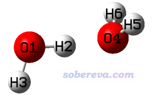
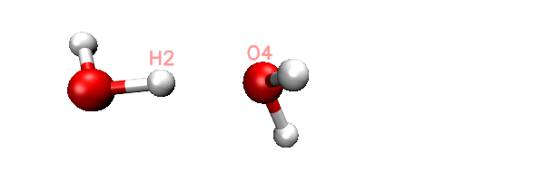
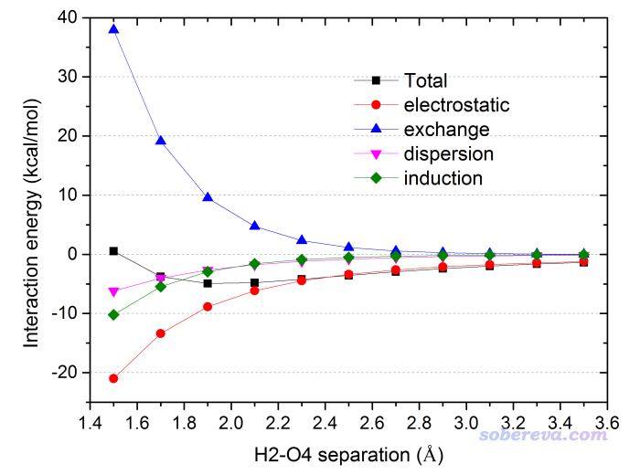

**注**：如今非常推荐用sobEDA方法做能量项随二聚体间距离变化的扫描，sobEDA比SAPT普适得多，而且速度快得多，内存消耗少得多，结合我给的脚本做扫描极为方便。具体做法在**《使用sobEDA和sobEDAw方法做非常准确、快速、方便、普适的能量分解分析》**（<http://sobereva.com/685>）里提到的sobEDA原文附带的教程里给出了。

注：本文内容主要是写给一个外国合作者的看的，所以是用英文写的。本文介绍的dimerscan程序也可以结合Gaussian非常容易地实现二聚体间距的刚性扫描，详见《详谈使用Gaussian做势能面扫描》（<http://sobereva.com/474>）。

对于单一结构做SAPT分析，在此文有详细介绍：《使用PSI4做对称匹配微扰理论(SAPT)能量分解计算》（<http://sobereva.com/526>）。

**考察SAPT能量分解的能量项随分子二聚体间距变化的简单方法**  
**A simple way to investigate the variation of SAPT energy decomposition terms with respect to molecular dimer separation**

文/Sobereva@[北京科音](http://www.keinsci.com)  2019-Mar-4

## 1 Foreward

The symmetry adapted perturbation theory (SAPT) is a rigorous and useful way of evaluating intermolecular interaction energy; more importantly, the SAPT interaction energy can be decomposed into various physical terms, which are very useful for understanding the nature of the interaction. PSI4 should be the best code for performing the SAPT calulation, because it is free, fast and relatively easy to use. PSI4 can be obtained from <http://psicode.org>. I assume readers have already known how to use the PSI4 and meantime PSI4 has been installed on the machine in correct way.

It is often interesting to examine variation of SAPT interaction terms with respect to molecular dimer separation. In very simple cases, such as scanning SAPT terms for Ar-Ar distance of Ar dimer, this can be done by properly making use the rule of PSI4 input file, see this file for example: <http://sobereva.com/attach/469/Ar-Ar.inp>. However, for most practical cases, e.g. scanning the O...H distance in H2O...HOH dimer, this purpose cannot be easily realized by only using single PSI4 input file. In present article, I will introduce a simple and general way of obtaining all SAPT terms with varying intermolecular distance. Specifically, the "distance" mentioned here denotes spacing of a pair of atoms between the two monomers, and in the variation process the orientation and structure of the monomers keep fixed. The method described in this article consists of three steps:  
(1) Generating SAPT input files  
(2) Running PSI4 in batch mode  
(3) Extracting data and plotting them as curve map

Below I will take water dimer as instance to show how to do. We want to vary H2-O4 distance from 1.5 to 3.5 Angstrom with step size of 0.2, therefore there should be 10 steps.

All relevant files of the water dimer instance can be downloaded here: <http://sobereva.com/attach/469/waterdimer.rar>

Note that the method illustrated in this article has been employed in my very systematic research on hydrogen bond, I strongly suggest reading it:  
Exploring Nature and Predicting Strength of Hydrogen Bonds: A Correlation Analysis Between Atoms-in-Molecules Descriptors, Binding Energies, and Energy Components of Symmetry-Adapted Perturbation Theory, J. Comput. Chem., 40, 2868–2881 (2019) DOI: 10.1002/jcc.26068

## 2 Generating SAPT input files

I wrote a code named dimerscan, which is used to generate PSI4 SAPT input files at various intermolecular separations. This code can be downloaded from this page: <http://sobereva.com/soft/dimerscan>.  
PS: Please kindly cite dimerscan like this if dimerscan is utilized in your work: Tian Lu, dimerscan program, http://sobereva.com/soft/dimerscan (accessed month day, year)

In this package, the "dimerscan.exe" is executable file in Windows, the "dimerscan" is executable file in Linux, and "SAPT_template.inp" is template input file of PSI4 SAPT task, it will be loaded by dimerscan. You can manually change memory specification, basis set and keyword of SAPT task in this file, while other parts should keep unchanged without special reasons.  
PS: In the template file, the SAPT level is SAPT2+(3)dmp2/aug-cc-pVTZ. According to the benchmark in J. Chem. Phys., 140, 094106 (2014), this level is able to predict binding energy in very high accuracy (usually close to CCSD(T)/aug-cc-pVTZ), therefore it is highly recommended for small dimers.

We first optimize structure of water dimer at reasonable level (e.g. B3LYP-D3(BJ)/def2-TZVP) via your favourite quantum chemistry code, then create a plain text file like below (this is content of the H2Odimer.txt in the waterdimer.rar package):

3 3  
 0 1 0 1  
  O                  1.21571500    0.00004000   -0.12596300  
  H                  0.26191400   -0.00018400    0.04416700  
  H                  1.62937300   -0.00025200    0.74021400  
  O                 -1.08643200   -0.00004600    0.11097100  
  H                 -1.46302100   -0.76572600   -0.33250500  
  H                 -1.46252900    0.76620800   -0.33193600

The first line is the number of atoms in monomer 1 and monomer 2, the second line is net charge and spin multiplicity of monomer 1 and monomer 2. The content starting from line 3 is dimer coordinate (in Angstrom).

Put the SAPT_template.inp file into the same folder of dimerscan executable file, then boot up dimerscan, input path of the H2Odimer.txt, and input:  
2,4  // Index of the atom in monomer 1 (H2) and that in monomer 2 (O4). Their distance will be gradually changed in your specified way  
1.5  // Initial distance of H2-O4  
10   // Number of steps  
0.2  // Stepsize

Now you will find totally 11 .inp files have been generated in current folder. The 0000.inp is PSI4 SAPT input file at initial distance, while 0001.inp, 0002.inp ... 0010.inp correspond to the structure of scan steps 1, 2 ... 10. You can also find a file named scan.xyz in current folder, it is a trajectory file containing all the 11 geometries. You can load it into VMD visualization program to check if the geometry variation meets our expectation. The animation of playing the scan.xyz is shown below, as you can clearly see the 11 geometries have been correctly generated.

As an example, the content of the generated 0002.inp is shown below. This file is easy to undertstand, the task use memory up to 2000MB, current H2-O4 distance is 1.9, as denoted by the "dimerdist" variable. After completing the SAPT2+(3)dmp2 energy evaluating, various terms are assigned to user-defined variables, and finally they are printed to the output file together in specific format.

memory 2000 MB

molecule dimer {  
   0  1  
 O      1.215715    0.000040   -0.125963  
 H      0.261914   -0.000184    0.044167  
 H      1.629373   -0.000252    0.740214  
 --  
   0  1  
 O     -1.635758    0.000010    0.138187  
 H     -2.012347   -0.765670   -0.305289  
 H     -2.011855    0.766264   -0.304720  
 }  
 dimerdist=    1.900000

set {  
 basis aug-cc-pVTZ  
 scf_type DF  
 freeze_core True  
 }

energy('sapt2+(3)dmp2')  
 E_disp = get_variable('SAPT DISP ENERGY') * psi_hartree2kcalmol  
 E_elst = get_variable('SAPT ELST ENERGY') * psi_hartree2kcalmol  
 E_exch = get_variable('SAPT EXCH ENERGY') * psi_hartree2kcalmol  
 E_ind = get_variable('SAPT IND ENERGY') * psi_hartree2kcalmol  
 E_tot = get_variable('SAPT TOTAL ENERGY') * psi_hartree2kcalmol

psi4.print_out("\n")  
 psi4.print_out(" Summary of SAPT result (kcal/mol)\n")  
 psi4.print_out(" Distance      E_tot     E_elst     E_exch     E_disp      E_ind\n")  
 psi4.print_out("%s %6.3f %10.3f %10.3f %10.3f %10.3f %10.3f\n" % ("R=",dimerdist,E_tot,E_elst,E_exch,E_disp,E_ind))

## 3 Running the SAPT input files in batches

Now, put all the .inp files we just generated to a folder used for running PSI4 calculation, and then put this shell script into the this folder: <http://sobereva.com/attach/469/psi4all.sh>. Open this file by text editor, change the value after -n argument to actual number of CPU cores that you want to use to conduct PSI4 calculation. Next, enter this folder and run this command: ./psi4all.sh. This script will invoke "psi4" command to execute all .inp files in current folder in turn and produce output files with same name but contain .out suffix.

## 4 Extracting data and plotting them as curve map

After all SAPT calculations have finished, run this command to extract data from output files to result.txt file: grep "R= " *.out > result.txt

The content of result.txt is shown below. As can be seen from the .inp files, the values should be: distance, total binding energy, electrostatic term, exchange term, dispersion term and induction term.  
0000.out:R=  1.500      0.536    -20.989     37.925     -6.180    -10.220  
 0001.out:R=  1.700     -3.769    -13.378     19.103     -4.034     -5.460  
 0002.out:R=  1.900     -4.923     -8.860      9.532     -2.660     -2.935  
 0003.out:R=  2.100     -4.798     -6.144      4.719     -1.771     -1.602  
 0004.out:R=  2.300     -4.223     -4.460      2.322     -1.189     -0.896  
 0005.out:R=  2.500     -3.552     -3.370      1.138     -0.805     -0.515  
 0006.out:R=  2.700     -2.932     -2.630      0.556     -0.551     -0.306  
 0007.out:R=  2.900     -2.407     -2.108      0.271     -0.381     -0.189  
 0008.out:R=  3.100     -1.979     -1.723      0.132     -0.267     -0.120  
 0009.out:R=  3.300     -1.636     -1.431      0.064     -0.190     -0.079  
 0010.out:R=  3.500     -1.363     -1.203      0.031     -0.137     -0.054

Next we plot the data as curve map via Origin program. Boot up Origin, directly dragging the result.txt into the Origin window to import it, properly specifying column names, and then plotting Line+Symbol map of various SAPT terms with respect to the distance values, you will eventually get below map.

From the map it can be seen that the minimum point of water dimer should occur around the position of R(H2-O4)=1.9 Angstrom. Electrostatic, dispersion and induction terms play attractive role, while repulsive effect purely comes from exchange term. All terms smoothly converge to zero with respect to increase of H2-O4 separation. The data also clearly shows that the H-bond in water dimer is completely dominated by electrostatic interaction irrespective of the dimer separation.
