**详谈使用Gaussian做势能面扫描**

Detailed introduction to using Gaussian to perform potential energy surface scanning

文/Sobereva@[北京科音](http://www.keinsci.com)  2019-Apr-1

**目录**  
1 基本知识  
2 用Gaussian做刚性扫描的方法和实例  
    2.1 基础知识  
    2.2 刚性扫描实例1：扫描乙醇的羟基的二面角  
    2.3 刚性扫描实例2：扫描Li+...苯之间的距离  
    2.4 刚性扫描实例3：扫描氟化氢键长获得解离曲线  
    2.5 刚性扫描实例4：同时扫描水分子的键长与键角  
3 使用dimerscan结合Gaussian做二聚体的刚性扫描  
    3.1 实例：苯酚二聚体的氢键距离扫描  
    3.2 实例：主-客体复合物的接触距离扫描  
4 使用gentor结合Gaussian做二面角的刚性扫描  
5 用Gaussian做柔性扫描的方法和实例  
    5.1 基本用法  
    5.2 柔性扫描的一些相关问题  
    5.3 柔性扫描实例1：柔性扫描C2H4ClBr的二面角  
    5.4 柔性扫描实例2：乙酰和甲胺封闭的丙氨酸(ACE-ALA-NME)的构象搜索  
    5.5 柔性扫描实例3：辅助寻找乙醇脱水的过渡态  
    5.6 柔性扫描实例4：把环丁烷拉成丁烷双自由基  
6 通过广义化内坐标(GIC)进行柔性扫描  
    6.1 GIC扫描实例1：水+氮气二聚体的几何中心距离扫描  
    6.2 GIC扫描实例2：令1,3-丁二烯两个亚甲基同步旋转的扫描  
7 总结&其它

本文将介绍势能面扫描的概念，通过最常用的量子化学程序Gaussian演示怎么实现各种类型的势能面扫描，并且介绍利用笔者开发的gentor和dimerscan程序结合Gaussian来实现一些只靠Gaussian实现不了的特殊的扫描。相信笔者读完本文后会对势能面扫描有十分全面的了解。在北京科音开办的初级量子化学培训班（<http://www.keinsci.com/workshop/KEQC_content.html>）、中级量子化学培训班（<http://www.keinsci.com/workshop/KBQC_content.html>）里会对这个主题讲得更充分并给出更多例子。

## 1 基本知识

势能面扫描用来考察体系能量随着一个或多个几何变量的改变而发生的改变。势能面扫描有很多实际用处，比如  
• 构造完整势能面或者势能面的子空间。之后基于此可以跑量子动力学、计算反应速率常数时考虑多维隧道效应等等  
• 产生力场参数。一般通过势能面拟合实现  
• 帮助确定搜索过渡态适合的初猜结构  
• 求解振动问题（振动能级、振动平均结构等）。相关信息参考《Molcas的计算双原子分子光谱常数的模块vibrot使用简介》（<http://sobereva.com/372>）、《谈谈温度、压力、同位素设定对量子化学计算结果产生的影响（<http://sobereva.com/423>）。  
• 寻找能量较低或最低的构象。参考《gentor：扫描方式做分子构象搜索的便捷工具》（<http://bbs.keinsci.com/thread-2388-1-1.html>）  
• 帮助弄清楚反应机理、键的解离等化学上感兴趣的过程  
• 考察体系电子结构随几何结构特定方式的改变而发生的变化。见比如《制作动画分析电子结构特征》（<http://sobereva.com/86>）。

扫描分为刚性扫描(rigid scan)和柔性扫描(relaxed scan)。刚性扫描指的是让程序按照你指定的扫描设定依次改变体系几何结构，结构每变一次就算一次单点能，而不被扫描的那些几何变量还是保持在初始结构的值。而在柔性扫描中，每次按照你的要求而改变特定几何参数时，做的不是单点计算而是限制性优化，即没有被扫描的变量都会被优化以使得体系能量尽可能低，相当于允许这些变量自发地弛豫（relax）。我们平时说扫描的时候一般默认指前者。因此如果你想告诉别人你做的是柔性扫描的话，那么绝对不要简单地说成“扫描”或scan，免得造成误会。

下面，笔者就结合最常用的量子化学程序Gaussian对势能面扫描的操作进行介绍，并且举各种势能面扫描的例子。所有计算使用Gaussian16 A.03版完成，GaussView用的是6.0.16版，同时会利用到的xyz2QC和gentor程序来自于molclus 1.8版程序包（可在此免费获取<http://www.keinsci.com/research/molclus.html>）。

本文例子的输入文件都可以在此文件包里找到：<http://sobereva.com/attach/474/file.rar>。文件名在例子中都提到了。输出文件也给了。

## 2 用Gaussian做刚性扫描的方法和实例

### 2.1 基础知识

在Gaussian里做刚性扫描很简单，关键词里写上scan，然后对要扫的变量进行定义即可。键长、键角、二面角都可以扫描，被扫描的几何坐标必须以变量形式表达。比如某个键长变量原本定义是B1= 1.3，那么把这个变量设置改为B1= 1.3 10 0.1，就代表以1.3埃为初始值扫描10步，每步增加0.1埃，最终扫到1.3+10*0.1=2.3埃。由于初始结构也会被计算一次，所以总共会计算11个单点能。算完之后，可以从输出文件末尾读取信息汇总，也可以把输出文件用GaussView打开观看扫描过程每一步的结构变化，还可以在Result - Scan里图形化显示能量在扫描过程中的变化。

还值得一提的是，扫描的每一步用的初猜波函数会自动用上一步收敛的波函数，主要考虑是相邻两步之间结构变化不是特别大，所以这样获得初猜波函数比重新产生初猜波函数通常更容易令SCF收敛，从而节约时间，通常还能使得上一步的电子结构能够承接下去。如果你做扫描的时候，发现一开始能收敛，但是扫描中途有的点SCF不收敛，或者收敛到奇怪的情况（体现在能量出现突然波动），不妨将扫描步长改小试试。

下面我们来看一些例子，被考察的问题由简单到复杂。

### 2.2 刚性扫描实例1：扫描甲醇的羟基的二面角

这个简单例子的目的是考察一下甲醇的羟基二面角旋转过程的能量变化。做扫描之前，我们先在B3LYP/6-31G*下对甲醇做一下几何优化，优化后是下图的结构，两张图是不同的视角。可见当前结构是Cs点群：

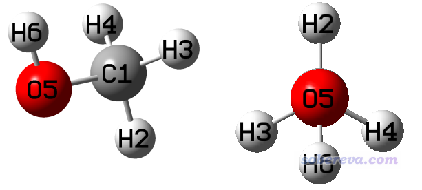

用GaussView把优化后的结构保存为methanol.gjf文件，在保存的界面里记得把Write Cartesians复选框取消掉，以使得保存出的坐标是以内坐标方式记录的。

我们打算在B3LYP/6-31G*下做扫描，想让C1-O5键转180度，使得上图的右图中H6从H2的反方向转到与H2重合。因此，我们得从methanol.gjf里去看内坐标的定义，看让哪个二面角变量的改变可以使得H6绕着C1-O5轴旋转。在gjf里可见  
 C                
  H                  1            B1  
  H                  1            B2    2            A1  
  H                  1            B3    2            A2    3            D1  
  O                  1            B4    2            A3    3            D2  
  H                  5            B5    1            A4    2            D3  
显然，D3对应H6-O5-C1-H2二面角，因此如果让D3变化，即绕着C1-O5转，就可以达到目的了。我们让这个变量每10度变化一次，因此总步数应当是180/10=18步。遂把gjf文件改成下面这样，对应methanol_scan.gjf：

# b3lyp/6-31g(d) scan nosymm  
 [空行]  
 Title Card Required  
 [空行]  
 0 1  
  C                
  H                  1            B1  
  H                  1            B2    2            A1  
  H                  1            B3    2            A2    3            D1    0  
  O                  1            B4    2            A3    3            D2    0  
  H                  5            B5    1            A4    2            D3    0  
 [空行]  
    B1             1.09337920  
    B2             1.10125884  
    B3             1.10125884  
    B4             1.41863900  
    B5             0.96872260  
    A1           108.05956655  
    A2           108.05956655  
    A3           106.69693538  
    A4           107.66742719  
    D1           117.09085412  
    D2          -121.45457294  
    D3           180.00000000 18 10.

注意，凡是程序需要读入浮点数的地方，绝对不能写成整数，因此此例步长必须写10.或者10.0而不能写10。另外，做刚性扫描的过程中，如果涉及到点群的改变，不加nosymm关键词的话有时会出问题，而且看到的扫描轨迹可能不连续。一开始结构是Cs点群，二面角改变一下就成C1点群了，所以我们这里用了nosymm。关于nosymm的更多说明看《谈谈Gaussian中的对称性与nosymm关键词的使用》（<http://sobereva.com/297>）。

这个体系小、计算级别低，很快就算完了。计算过程中途输出的信息不用管，直接把输出文件拉到末尾，可以看到下面的信息，是扫描过程的汇总。D3是指被扫描的那个变量，当前用的B3LYP属于SCF一类方法，所以每个点的能量显示在SCF那一列下面，单位是Hartree。  
 Summary of the potential surface scan:  
    N      D3          SCF      
  ----  ---------  -----------  
     1   180.0000   -115.71441  
     2   190.0000   -115.71425  
     3   200.0000   -115.71382  
     4   210.0000   -115.71320  
 ...略

把methanol_scan.out拖到GaussView里，在窗口左上角可以看到帧号。当前扫描18步，初始结构也算一个结构，因此一共19帧，第一帧对应输入文件里的结构。选择Results - Scan，可以看到扫描过程的能量变化，如下图所示。点击其中一个点，图形窗口就会切换到相应的帧。在窗口下方可以看到这个点对应的能量和被扫描的坐标的当前值。

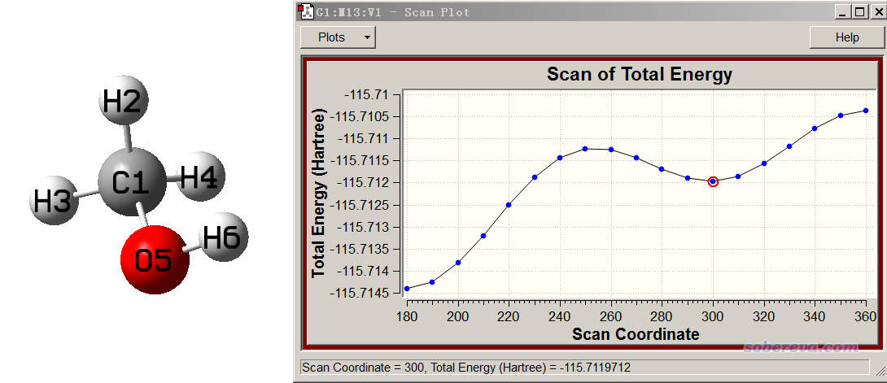

从扫描曲线上，可以看到有两个极小点（对于这条曲线而非整个势能面而言），一个是D3=180度，正好对应初始结构，这显然是能量最低的结构。另一个局部极小点在D3大约300度的位置，结构如上图左边所示。而当H6转到与H2沿着C-O键轴看正好重合的时候，能量达到了全局最大。

通过这个图中的极大点和相邻极小点位置，我们可以粗略估计旋转势垒。但是要想精确计算的话，应当用这个图中极小点和极大点的坐标分别作为初猜结构去准确优化极小点和过渡态结构（找过渡态参考《简谈Gaussian里找过渡态的关键词opt=TS和QST2、3》<http://sobereva.com/460>），然后再用更高级别算单点能再求差。

做刚性扫描比较烦人的一个情况是想扫描的那个坐标在GaussView直接保存的gjf文件没有恰好对应的变量。此时要么想办法修改体系坐标书写方式使得被扫描的坐标能通过某个几何变量表示；要么手动在GaussView里每修改一次坐标就保存一个输入文件，扫多少步就产生多少个输入文件，然后批量运行、批量提取单点能。Linux下批量执行的方法看《使用Gaussian时的几个实用脚本和命令》（<http://sobereva.com/258>）。

### 2.3 刚性扫描实例2：扫描Li+...苯之间的距离

这个例子中我们要扫描Li+与苯的苯环中心在垂直于苯环方向的距离。这个目的有两种实现方式，第一种是基于笛卡尔坐标来设定扫描方式，下面说一下。我们先在GaussView里画一个苯，做对称化成为D6h点群，用便宜的B3LYP/6-31G*优化一下，然后以笛卡尔坐标方式保存为gjf文件。此文件里，苯正好在Z=0的XY笛卡尔平面上，苯环中心就是(0,0,0)位置。假设我们想扫描Li+，使之从距离苯环中心5埃处逐渐接近苯环中心，共10步，每一步移动0.3埃，最终移动到相距2埃的位置，我们应当把输入文件写成这样（Ben_Li_Cart.gjf）：

# M062X/6-311g(d) scan pop=always  
 [空行]  
 Title Card Required  
 [空行]  
 1 1  
  C                  0.00000000    1.39650157    0.00000000  
  C                  1.20940584    0.69825078   -0.00000000  
  C                  1.20940584   -0.69825078   -0.00000000  
  C                  0.00000000   -1.39650157    0.00000000  
  C                 -1.20940584   -0.69825078    0.00000000  
  C                 -1.20940584    0.69825078    0.00000000  
  H                  0.00000000    2.48320512   -0.00000000  
  H                  2.15051871    1.24160256   -0.00000000  
  H                  2.15051871   -1.24160256   -0.00000000  
  H                 -0.00000000   -2.48320512    0.00000000  
  H                 -2.15051871   -1.24160256    0.00000000  
  H                 -2.15051871    1.24160256    0.00000000  
  Li                0. 0. Z  
 [空行]  
 Z= 5.0 10 -0.3

可见我们手动添加了一个Li原子，X和Y都为0，Z坐标以变量表示，初值为5.0，最后一步距离苯环中心将是5.0+10*(-0.3)=2.0埃。此例为了让结果达到基本定量合理，用了算弱相互作用不错的M06-2X结合比前例稍微大一些的基组。由于扫描过程始终是C6v点群，所以此例我们不用写nosymm关键词，如果写了这个关键词的话由于没法利用对称性加速计算会多花很多时间。

有量子化学常识的人都知道Gaussian里只能设定体系总电荷，没法直接指定Li带的电荷。但Li在实际体系中到底带多少电荷？随着扫描的进行其电荷量如何变化？想了解这个问题，最简单的做法就是在扫描的时候像本例这样同时写pop=always关键词，这样扫描的每一步都会做一次布居分析从而得到原子电荷。

执行上面这个任务，把输出文件用GaussView打开，扫描曲线如下。图应该从右往左看

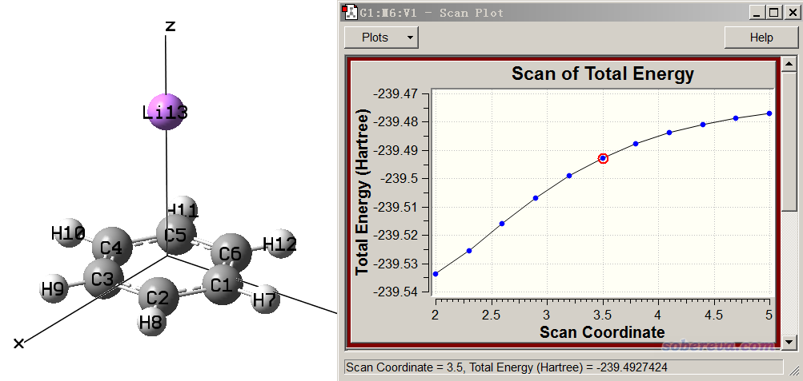

可见随着Li逐渐接近苯环中心，体系能量显著下降。我们可以直接在GaussView里观看原子电荷的变化，做法是在Scan界面里选择Plots，选Plot Molecular Property，再选Atomic Charge，然后输入13，点OK。之后在能量变化图的下方就可以看到序号为13的Li原子的Mulliken电荷随扫描的变化了，如下所示

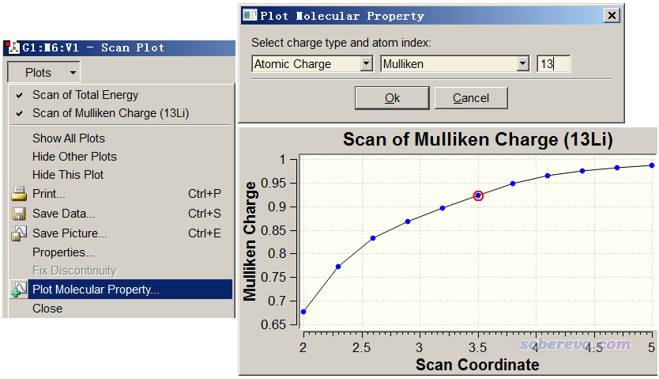

由图可见，当Li距离苯很远的时候，Li带的原子电荷接近1.0，是个典型的阳离子。而随着距离接近，苯上的电子就逐渐往Li+上转移，导致在距离较近的时候Li带的原子电荷明显达不到1.0了。注意，Mulliken电荷只是一个比较low的原子电荷模型，存在容易低估离子性、怕弥散函数等问题，相关讨论参见笔者的《原子电荷计算方法的对比》（<http://www.whxb.pku.edu.cn/CN/abstract/abstract27818.shtml>）一文，在实际研究中用ADCH或NPA电荷说事更好。如果想对电荷转移特征了解更多，还可以用Multiwfn做更细致的布居分析，看Multiwfn手册4.7.0节的例子，以及绘制密度差图，看《使用Multiwfn作电子密度差图》（<http://sobereva.com/113>）。

Plot Molecular Property界面里还可以绘制别的，比如绘制几何变量随扫描的改变。使用pop=always后，还可以在这个界面里选择绘制偶极矩矢量或其总大小。而如果不用pop=always的话，程序只会在初始结构计算时做布居分析。

这个例子也可以在内坐标下实现扫描，但是需要用到虚原子。做法是在GaussView里显示出苯之后，在苯环中心添加一个虚原子X（把苯环上的六个碳都选中成为黄色，在Builder窗口里选X原子，然后点右键选Builder - Place Fragment at Centroid...），然后再在虚原子上加个氢，把X-H的键轴调成与苯环垂直，然后把氢替换成Li原子。之后保存内坐标形式的gjf文件，会发现其中有一个变量正好对应虚原子和Li原子之间的距离，因此对这个距离扫描即可。输入文件是Ben_Li_Zmat.gjf。

实际研究中，可能环是斜着的，要扫描某个原子与它的环中心的距离。此时既可以用上面提的内坐标方式扫描，也可以用笛卡尔坐标方式扫描。对于后者，由于Gaussian里在刚性扫描的时候没法让某个原子按照某个自定义矢量来移动，因此需要先旋转体系，让环平面恰好平行于某个笛卡尔平面，比如平行于XY，这样才能通过扫描Z坐标实现目的。按照《调节平面分子间距的方法》（<http://sobereva.com/178>）里的“方法二”，借助笔者自写的VMD程序的脚本，可以轻易让某个环平面恰好平行XY平面。

值得一提的是，在扫描过程中如果能进行深入细致的电子结构分析，可以获得远比结构+能量丰富得多的信息，让研究文章充实起来。想实现这点，可以用《产生Gaussian的IRC和SCAN任务每个点的波函数文件的工具》（<http://sobereva.com/199>）一文介绍的笔者写的SCANsplit工具载入刚性扫描的输出文件，将扫描过程中每个结构转化为单点任务输入文件，批量执行后就有了记录每个点波函数的fch或wfn文件，之后再通过脚本和一些Linux下的命令就可以自动调用Multiwfn考察电荷分布、成键等电子结构方面的信息随扫描过程的变化，详见《通过键级曲线和ELF/LOL/RDG等值面动画研究化学反应过程》（<http://sobereva.com/200>），可以讨论的手段见《Multiwfn支持的分析化学键的方法一览》（<http://sobereva.com/471>）。

### 2.4 刚性扫描实例3：扫描氟化氢键长获得解离曲线

这一节我们通过DFT方法研究氟化氢分子的H-F键断裂过程的势能曲线。这个曲线我之前在《浅谈为什么优化和振动分析不需要用大基组》（<http://sobereva.com/387>）给出过，当时对不同级别扫描出的曲线进行了对比。H-F键的断裂过程中体系会由闭壳层分子逐渐变成H自由基和F自由基。当键长在平衡距离附近的时候，体系是闭壳层状态，计算没有什么特殊的，而距离拉远后，超过所谓的“不稳定点”对应的键长，整个体系就成了双自由基状态，属于自旋极化单重态，这时对于DFT计算而言需要做对称破缺计算。如果对这点不懂，一定要看《谈谈片段组合波函数与自旋极化单重态》（<http://sobereva.com/82>）。因此，扫描这种共价键均裂解离曲线不是看起来那么简单。而如果你扫描的是NaCl这样的离子键异裂成Na+和Cl-的解离曲线，那就不需要考虑这些问题了，因为解离后变成的Na+和Cl-都是闭壳层状态。

对于这个体系的扫描，我的建议是这样：  
(1)先在H和F距离很远、键完全断裂的情况下产生对称破缺波函数，对应双自由基状态  
(2)用非限制性开壳层形式(U)做扫描，让H-F距离逐渐减小，第一步的初猜波函数直接读取(1)收敛的波函数。由于之后每一步都会用上一步收敛的波函数做初猜，所以一开始的波函数的对称破缺状态会一直维持下去。当距离减小到已经小于不稳定点的时候，由于此时基态波函数是闭壳层波函数，因此从此开始每一步的结果和用限制性闭壳层(R)形式计算的结果将会完全一样。

第1步的输入文件是下面这样（HF_broken.gjf），对应键长4埃。用U明确指定做非限制性计算，用guess=mix是为了打破初猜波函数的对称性，但是直接用guess=mix未必能收敛到真正的对应当前结构下基态的对称破缺波函数，因此又加上了stable=opt来对收敛的波函数进行检测，如果发现不稳定，会自动尝试优化出最稳定的波函数。

%chk=C:\HF.chk  
 # UB3LYP/def2TZVP guess=mix stable=opt  
 [空行]  
 Title Card Required  
 [空行]  
 0 1  
  F  
  H      1 B1  
 [空行]  
 B1 4.0

第2步的输入文件如下（HF_scan.gjf），从4.0埃扫到4.0-0.06*55=0.7埃。涉及对称破缺的计算加上nosymm会比较稳妥，所以这里用了nosymm。

%oldchk=C:\HF.chk  
 # UB3LYP/def2TZVP scan guess=read nosymm  
 [空行]  
 Title Card Required  
 [空行]  
 0 1  
  F  
  H      1 B1  
 [空行]  
 B1 4.0 55 -0.06

最终扫出来的曲线如下，非常理想。如果扫描出的这种曲线有一些明显的突跃，通常是那个点恰好没有收敛到与周围的点特征基本相同的波函数所致，此时可以尝试把扫描步长减小再试，这样有助于保持波函数的连续性，毕竟每个点的初猜自动用上一个点的收敛的波函数，二者结构相差越小则波函数的状态越容易继承下去。

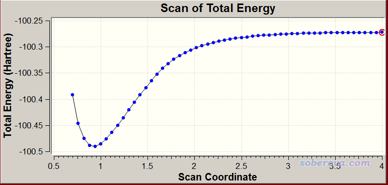

扫描共价键的解离曲线还有个做法，只需要一步，就是使用比如# UM062X/TZVP guess(always,mix) scan nosymm这种关键词，此时让键长从大变小来扫描，还是让键长从小变大来扫描，其实都一样，因为这里用了always，代表每一步重新产生初猜波函数；而且由于用了mix来使得每一步都试图得到对称破缺态，如果对称破缺态更稳定，那么这个点就收敛到对称破缺态，而如果闭壳层态更稳定，那么就自动收敛到对应闭壳层的波函数。大家可以尝试对乙烷的C-C键用这个关键词扫描，会发现可以得到正确的解离曲线，扫到最后相当于两个甲基自由基。但是这套关键词用于扫描上面的氟化氢体系的话会发现行不通，会扫得乱七八糟，因为对这个体系的很多点，光靠guess=mix产生的初猜波函数收敛不到实际基态波函数上。不信的话可以看一下HF_scan_mix_always.out的曲线，就是以这种方式算的，其最后一个点SCF没有收敛，只看其它点的话，会看到能量曲线不合理，因为拉远后能量变化没有趋于水平。虽然从输出文件中看到超过不稳定点的结构的<S**2>确实不为0，因此确实得到了对称破缺态，但是和之前我们扫描出来的输出文件里相应的点<S**2>不符（明显偏小）。有兴趣的话读者可以对诸如键长为3.5埃的时候用UB3LYP/def2TZVP guess(mix,always) nosymm产生fch文件，用Multiwfn看看自旋密度分布了解是怎么回事（参见《谈谈自旋密度、自旋布居以及在Multiwfn中的绘制和计算》<http://sobereva.com/353>），你会发现，并不是如期望的在H和F上各有单电子且自旋相反，而是alpha和beta单电子同时出现在了F上面！

可以计算共价键解离曲线的方法极多。使用恰当的泛函，通过对称破缺方式计算通常就可以给出不错的解离曲线。但如果要求更高，可以用UCCSD(T)。而对于牵扯多重键断裂的问题，情况复杂、静态相关很强，通常需要考虑用较复杂但是普适性强的多参考方法如CASPT2以确保得到靠谱的结果。

### 2.5 刚性扫描实例4：同时扫描水分子的键长与键角

这个例子演示二维扫描。对水分子，令两个O-H键长同时从0.92扫到1.02埃，每步0.01埃，共10步。与此同时，让键角从95度扫到115度，每步2埃，共10步。因此扫描任务中要算的单点能的次数是(10+1)*(10+1)=121个。显然，随着被扫描的变量数增加，刚性扫描的耗时呈几何式增加。对某个刚性扫描任务要想估计能不能扫得动，你可以算一个单点看看耗时，然后乘以要算的点数。

当前这个任务的输入文件如下（H2O_2Dscan.gjf）  
# B3LYP/def2SVP scan  
 [空行]  
 Title Card Required  
 [空行]  
 0 1  
  O                
  H                  1    B1  
  H                  1    B1    2  A1  
 [空行]  
 B1 0.92 10 0.01  
 A1 95.0 10 2.0

算完之后，可以把输出文件末尾的汇总数据用Sigmaplot、Surfer、Origin之类绘制成曲面图或者填色图或者等值线图便于考察。如果将输出文件载入GaussView，也可以看到有121帧，并可以观看扫描轨迹。如果进入Results - Scan，会看到下图，曲面图的纵坐标对应电子能量，在下方还有投影的等值线图。

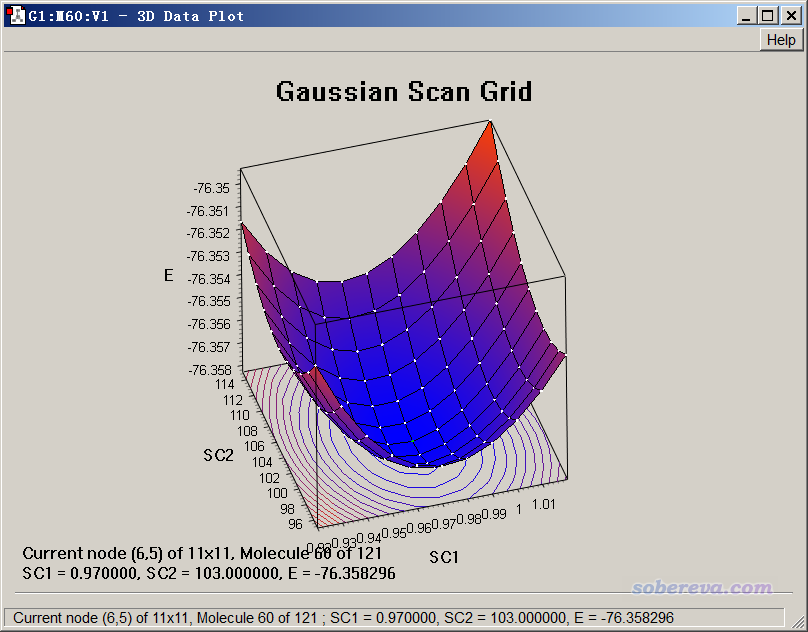

点击曲面上的小白点使之成为绿色，可以使状态栏下方显示相应的点对应的几何变量的数值和能量，图形窗口里的结构也会切换到对应的帧。由上图可见，所有扫描的点里能量最低的是B1=0.97埃、A1=103度的那个点，比起其它点更接近于水分子的势能面最低点。

类似地，我们还可以用Gaussian同时扫描更多的坐标，但超过两个坐标时，结果就没法直接用GaussView绘图直观展现了。

### 3 使用dimerscan结合Gaussian做二聚体的刚性扫描

借助笔者写的dimerscan和xyz2QC程序，我们可以实现很多没法直接用Gaussian的scan设定实现的二聚体的刚性扫描。下面通过两个例子来体现这点。dimerscan可以从《考察SAPT能量分解的能量项随分子二聚体间距变化的简单方法》（<http://sobereva.com/469>）页面里下载，xyz2QC是笔者开发的团簇构型与分子构象搜索molclus程序包中带的工具，可以在molclus主页下载：<http://www.keinsci.com/research/molclus.html>。

3.1 实例：苯酚二聚体的氢键距离扫描

经常研究分子间相互作用的人，往往会遇到一个问题就是想对二聚体之间做刚性扫描，但是GaussView产生的gjf文件里没有正好对应于想扫描的坐标的几何变量。比如下面的苯酚二聚体

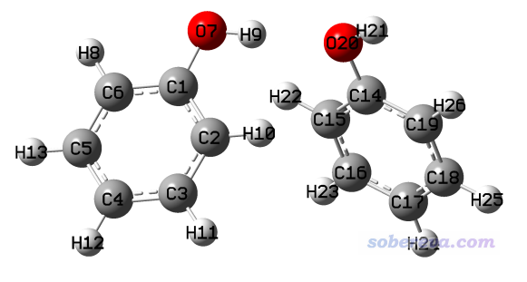

我们想考察体系能量随氢键距离变化而发生的变化，从而得到不同距离下两个单体间的弱相互作用能，因此我们应该扫描H9-O20或者O7-O20键长。但不幸的是，GaussView里保存的内坐标形式的输入文件中（phenoldimer.gjf），O20的键长项是参考C14来定义的，因此只使用Gaussian的话没法达到我们的扫描目的。虽然如后文所述，用柔性扫描的话想怎么定义都可以，但是柔性扫描不仅昂贵，而且扫描过程中其它坐标都可能显著变化，和我们期望的研究目的不符。像这种情况，我们要扫描氢键距离，就得用dimerscan结合xyz2QC程序来实现。下面提到的文件都在本文文件包里rigid\phenoldimer目录下。

我们先用GaussView打开phenoldimer.gjf，保存成笛卡尔坐标形式的gjf。将gjf里原子坐标以外的部分都删掉，在坐标前面插入两行，第一行是两个单体各自的原子数，第二行是计算两个单体时分别用的电荷和自旋多重度（对当前研究无影响），然后把这个文件保存为dimer.txt。此文件当前内容的形式如下

13 13  
 0 1 0 1  
 [苯酚单体1的坐标]  
 [苯酚单体2的坐标]

假设我们想扫描H9-O20，从1.7埃扫20步，每步增加0.1埃。将dimer.txt放到dimerscan.rar解压后的目录中，启动dimerscan，输入dimer.txt的路径，然后依次输入  
9,20  
1.7   //初始距离  
20    //扫20步  
0.1   //每步伸长0.1埃  
最后按一次回车退出。此时当前目录下出现了一堆.inp文件，不用管，那是给PSI4程序做SAPT用的。当前目录下还出现了scan.xyz，里面每一帧对应扫描过程的一个结构。如果想检验下一生成的对不对，可以把这个文件拖到VMD程序（<http://www.ks.uiuc.edu/Research/vmd/>）里播放动画确认一下，由动画可见确实生成得没错：

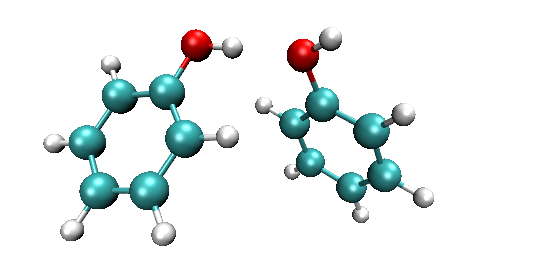

把molclus程序包中的template.gjf里的关键词改为要计算每个点用的级别，比如我们想用比较便宜的PM6-D3方法实现苯酚二聚体扫描，就把这个文件里的关键词设为# PM6D3。然后启动molclus程序包中的xyz2QC程序，选择1 Generate multi-step Gaussian input file，输入scan.xyz的路径，然后直接按回车代表考虑所有帧，再按回车退出。当前目录下马上出现了Gaussian.gjf文件，此文件是Gaussian的多步任务文件，每一步是对每个结构算一次单点。

用Gaussian运行Gaussian.gjf，用ultraedit或者Linux下的grep命令将里面所有带有E(RPM6D3)字样的行都提取到一个文本文件里，会发现一共有21行（初始结构+扫描的20个结构）。然后把多余的列都删掉只保留能量的列，导入到Origin里，把扫描的距离信息也插入到里面作为一列，然后用Origin作图，如下所示（原始文件是phenoldimer.opj），完全与我们预期的相符。

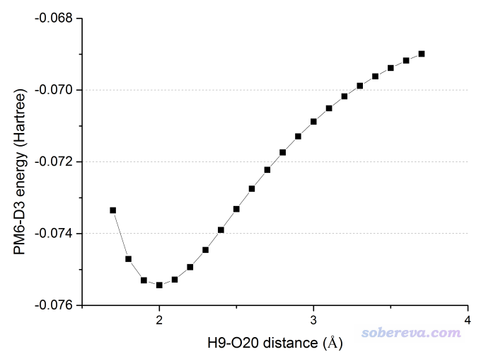

注：当二聚体结构中不同单体的原子顺序存在相互交错的时候，需要先处理一下，确保单体里的原子序号是连着的，否则dimerscan没法用。处理过程是用GaussView打开二聚体结构文件，在其中一个单体的原子上点右键选Select Fragment of ...使这个单体变成黄色，然后按Ctrl+X复制到剪切板，创建一个新窗口，再按Ctrl+Shift+V将之粘贴进去，保存成笛卡尔坐标形式的输入文件1.gjf。之前的窗口还剩另一个单体，保存为2.gjf。最后将2.gjf里的坐标拼接到1.gjf的坐标后头去。

### 3.2 实例：主-客体复合物的接触距离扫描

此例我们想对下图所示的主-客体复合物在红线方向上进行扫描，看这个富勒烯脱离主体分子过程的能量变化曲线。复合物结构是本文文件包里host-guest目录下的host-guest.gjf。

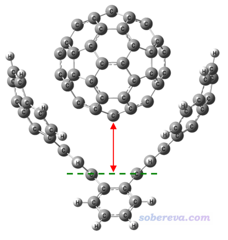

做这个体系的刚性扫描也没法直接用Gaussian实现，不仅被扫描的两端恰好没有原子出现，而且即便有原子，一般也不会恰好有对应的变量可供扫描。对这种情况，我们还是可以用dimerscan+xyz2QC的组合来实现，只不过用之前我们先得在扫描的两端位置添加虚原子。

我们先在GaussView里将客体分子剪切并粘贴到新窗口里，然后将主体和客体分子分别保存成host.gjf和guest.gjf。然后打开主体分子，在扫描的位点增加一个虚原子，然后保存gjf。对客体分子也这样增加虚原子并保存。虚原子位置如下所示

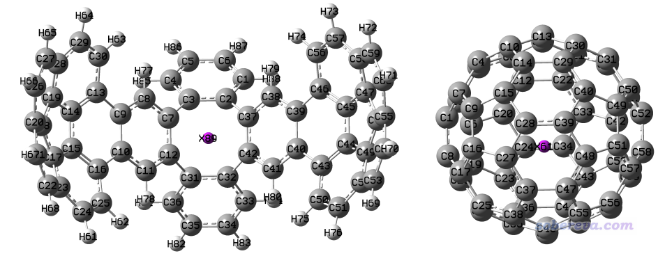

然后把host.gjf和guest.gjf里的坐标合并在一起，改成下面的格式，并保存为dimer.txt。目前包含虚原子X在内主体和客体分子分别有89和61个原子。  
89 61  
 0 1 0 1  
 [主体分子的坐标]  
 [客体分子的坐标]

将dimer.txt拷到dimerscan目录下，启动dimerscan程序并输入  
dimer.txt  
89,150  //新添加的两个虚原子在整体中的序号，都是每个单体最后一个原子，因此第二个虚原子序号是89+61=150  
2.8  //初始距离  
30   //30步  
0.15  //每步增加0.15埃

用VMD播放一下新产生的scan.xyz，会看到下面的动画

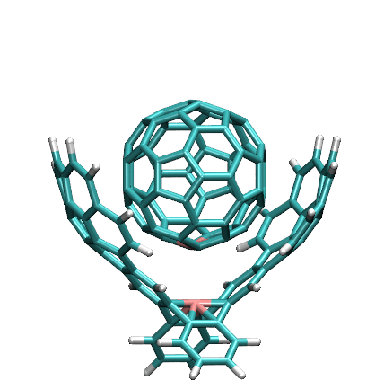

还是按照上一节的方法，通过xyz2QC程序将scan.xyz转换成多任务的Gaussian输入文件Gaussian.gjf，使其中每个子任务都对应于用PM6-D3计算单点。用Gaussian执行此任务，然后提取SCF Done的数据进行作图，会看到下图的结果：

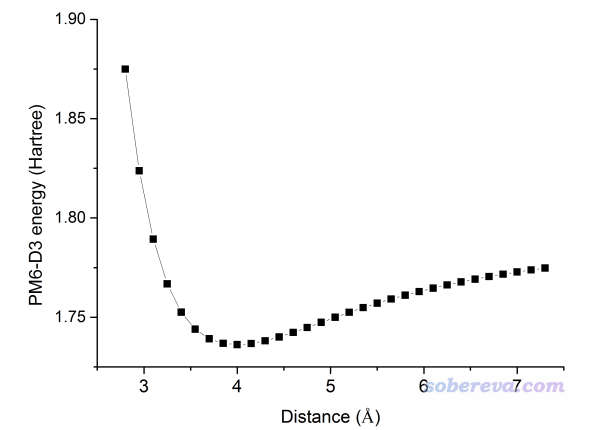

值得一提的是，一般绘制这种图都应该用极小点结构作为纵轴零点，令每个点的能量都减去这个能量，使得图上纵坐标体现的是相对于极小点的能量变化，此时纵坐标才有化学意义。

## 4 使用gentor结合Gaussian做二面角的刚性扫描

往往我们想刚性扫描二面角，并且扫描的时候让整个基团连带地转动。比如下面这个体系，我们想看看绕着C1-C4键轴转动时势能曲线是什么样。文件包里的C2H4ClBr.gjf是保存出来的基于内坐标的结构。

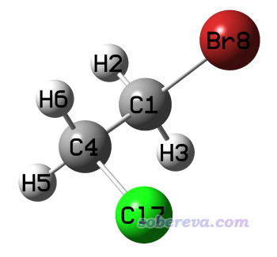

但我们的目的没法简单地达到。比如虽然gjf文件里可以发现D5对应Br8-C1-C4-H6二面角，但是如果扫这个角的话，发现Br8和H6虽然都转动了，而其它原子并没有跟着它俩的转动而转动，因此随着扫描的进行结构愈发扭曲，完全违背我们的意愿。

对于这种绕着键旋转的刚性扫描，需要借助笔者开发的molclus程序包里的gentor子程序实现。它可以按照用户的要求对某个键依次进行旋转，并将产生的结构依次写入到traj.xyz文件里，之后再用xyz2QC转化成Gaussian输入文件，计算后提取所有能量就可以作图了。

使用gentor前需要先把当前结构转化成.xyz文件。最简单的方法就是直接把C2H4ClBr.gjf载入GaussView，保存成笛卡尔坐标的形式的gjf，然后手动把此文件改写成下面的样子，第一行是原子数，第二行是注释（内容随意），然后把此文件保存为mol.xyz

8  
 niconiconi  
  C                  0.00000000    0.00000000    0.00000000  
  H                  0.00000000    0.00000000    1.07000000  
  H                  1.00880579    0.00000000   -0.35666635  
  C                 -0.72596336    1.25740469   -0.51333288  
  H                 -0.22269110    2.13105477   -0.15506960  
  H                 -1.73533208    1.25642706   -0.15826411  
  Cl                -0.72317775    1.25901418   -2.27332994  
  Br                -0.90038238   -1.55950848   -0.63666702

把mol.xyz放到molclus目录下的gentor目录下，并把自带的gentor.ini改写为下面这样：  
1-4  
 e10  
这代表从初始结构开始，绕着1-4键旋转360度，每10度产生一个结构。其中第一个结构对应旋转0度，最后一个结构对应旋转350度，因此共36个结构。gentor提供了很丰富的选项来控制怎么旋转，用法详细介绍见《gentor：扫描方式做分子构象搜索的便捷工具》（<http://bbs.keinsci.com/thread-2388-1-1.html>），靠gentor甚至可以实现多个二面角同步变化的扫描。

运行gentor，从屏幕的提示中会看到成功产生了36个构象（倘若有严重不合理接触的，会被自动剔除），这些结构输出在了当前目录下的traj.xyz中。将此文件载入VMD播放一下，会看到下面的动画

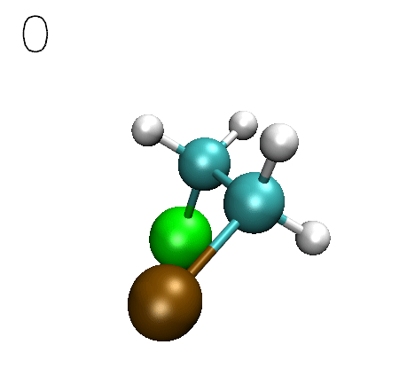

还是按之前的做法，用xyz2QC工具将traj.xyz转化成含多任务的单一Gaussian输入文件Gaussian.gjf，为省时间计算级别还是用粗糙的PM6-D3。按照之前的步骤把能量取出来，并且把每个点对应的Cl7-C4-C1-Br8二面角数值附上去，用Origin作图，如下所示。（第一个结构的这个二面角数值-60.11104从GaussView里直接读，之后各个结构的二面角数值利用excel产生等差数列就得到了）

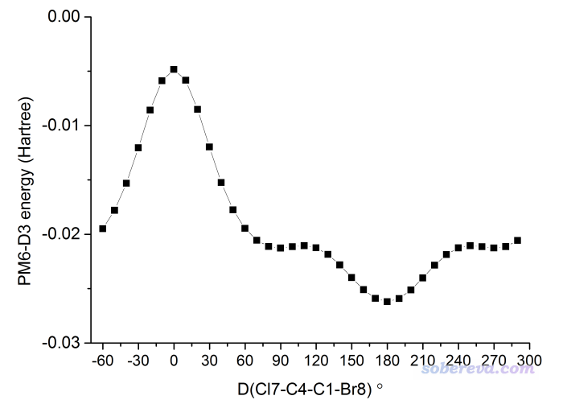

可见图像首尾相接，因为正好转了360度。图中0度的时候正好是Cl和Br处于重叠构型，由于位阻大，所以能量很高。当转到180度时，正好Cl在Br反方向，位阻最小，因此能量最低。

我们当前得到的这个二面角的刚性扫描图其实实际意义并不太大。因为在现实中，随着二面角旋转，其它变量肯定会自发地变化，比如当Cl7-C4-C1-Br8正好处于0度时，中间的C-C键肯定会自发地轻微变长以让Cl和Br的位阻适当减小，C-C-Br和C-C-Cl键角也肯定在二面角旋转过程中出现可查觉的变化。如果忽略了这些效应，必定得到的二面角旋转曲线不够真实，并可能明显高于实际旋转势垒。想较真实地考虑这些效应，就得用下文介绍的柔性扫描了。

## 5 用Gaussian做柔性扫描的方法和实例

### 5.1 基本用法

前面说了，柔性扫描就相当于对每一个扫描点结构中的非扫描变量做限制性优化。在Gaussian下做柔性扫描一般是在冗余内坐标下做，但其实也可以在内坐标下做，而不能在笛卡尔坐标下做。注意这里说的在什么坐标下做指的是限制性优化过程用的坐标，和输入文件里把体系结构写成什么坐标没有任何关系（通常我们在冗余内坐标下做柔性扫描都是用比较方便的笛卡尔坐标形式）。

在冗余内坐标下做柔性扫描需要写opt=modredundant关键词，然后在坐标末尾空一行定义被扫描的变量，格式为：

原子1  原子2  [原子3]  [原子4] S  步数  步长

写两个、三个、四个原子序号的话分别对应扫键长、键角、二面角。初值就是输入文件里的结构的相应变量的数值，所以要改初值的话应该在GaussView里修改几何坐标后再保存gjf。（在大约G09 C.01及之前版本，还可以在S后头直接设定初值，但是对于之后的版本都没法设初值了）

相对于刚性扫描，做柔性扫描的一个便利之处是不用考虑输入文件里有没有现成的对应于被扫描变量的坐标，想扫什么直接定义即可。柔性扫描也是可以同时扫多个，只要写多行这种设定即可，对于二维柔性扫描也是可以用GaussView显示出曲面图。柔性扫描的输出文件末尾不像刚性扫描那样有汇总信息，但可以在GaussView里显示出曲线或者曲面图之后，在图上点右键选导出数据，然后再用第三方程序绘图。

做柔性扫描的时候也可以同时进行冻结设定，比如写  
8 F  
 10 F  
就代表扫描过程中8、10号原子位置不允许改变（但使用nosymm的时候从动画上才会看到完全没动）。这点在《在Gaussian中做限制性优化的方法》（<http://sobereva.com/404>）文中也介绍过。

柔性扫描时不能像刚性扫描时那样允许虚原子出现在扫描设定中。

扫描某个原子时，它所在的片段上其它原子也会连带地一起运动，这点比起刚性扫描好。比如之前需要借助gentor才能实现在刚性扫描过程中让整个基团转起来，而在柔性扫描时只需要对一个二面角扫描即可实现。

### 5.2 柔性扫描的一些相关问题

由于几何优化比单点能的计算昂贵起码一个数量级，因此，在同样的扫描设定下，做柔性扫描比做刚性扫描也昂贵至少一个数量级，所以没事别瞎用昂贵的柔性扫描。不得不用昂贵的柔性扫描的时候，如果对精度要求不是很高，可以用一些便宜的计算级别，比如PM7这样的半经验方法，比起用常用的DFT能节约两个数量级的时间。另外，要注意柔性扫描是注定不可能用来得到极小点和过渡态的精确结构的，且不说别的，起码被优化的变量一般不可能有某个点的数值恰好等于极小点或过渡态结构的数值。另外，柔性扫描是无法替代IRC的用处的，柔性扫描的曲线不可能与IRC正好相同，毕竟算法上相差很大，至多是对于极个别反应，其反应坐标基本上可以通过某个几何变量表现（比如激发态质子转移），那么扫描这个变量得到的曲线和IRC才有相似性。

由于柔性扫描过程本质上相当于一大批限制性优化，而几何优化过程中Gaussian要求不能中途出现三个原子排成直线的情况，因此柔性扫描任务中途有可能因为出现三个原子排成直线而报错。这也没有什么简单而且一定奏效的做法可以解决。碰上这种情况可以考虑调整扫描设定试图避开出现这种现象的可能；或者对柔性扫描中失败的点手动做限制性优化，然后遇到三个原子排成直线时，取最后的结构沿用之前的设定进一步优化（由于此时初始结构里就已经有三个原子排成直线，Gaussian会做一些恰当处理使得优化往往可以继续进行）。

由于限制性优化时需要计算原子受力（梯度的负矢量），Gaussian只能对那些有解析梯度的方法做柔性扫描。诸如CCSD(T)那些只能算能量而连一阶解析导数都没有的方法，拿它们做柔性扫描想都别想；而且就算真的能做一般也根本算不动，因为柔性扫描这种任务本身就极其昂贵，其中要计算受力的次数巨多，而CCSD(T)就连算个单点能都很昂贵，更别提计算梯度了。之前看有的初学者居然试图拿CCSD(T)/aug-cc-pVQZ去做柔性扫描，而且还打算扫62步，真是都不知该从哪吐槽。

做刚性扫描的时候，对计算级别的要求和单点一样，也就是在计算条件允许范围内，尽量用比较好的级别（但也别过度浪费），因为能量对计算级别敏感。而大家知道做几何优化不需要太好级别就可以得到不错结果，见《浅谈为什么优化和振动分析不需要用大基组》（<http://sobereva.com/387>），类似地，做柔性扫描的过程也完全不需要太好的级别。如果你想让扫描曲线更准确，那么之后对柔性扫描产生的每个点再用较好级别计算单点能就行了。别直接直接用昂贵的级别做柔性扫描，否则纯粹是在浪费计算资源。

经常有人问为什么他得到的柔性扫描曲线里出现了能量的突跃，问是否正常、结果能不能用。突跃是怎么造成的，通过下面这个势能面图就可以秒懂，越红的地方势能越高，越蓝的地方势能越低

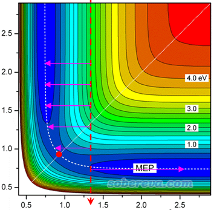

这张图里面纵坐标是被扫描的变量值，按照箭头方向从上到下扫描，横坐标是不被扫描的变量。可见，由于扫描的每一步都是限制性优化，没有被扫描的变量会被自动优化到与其初始坐标值最近的极小点去，相当于在水平方向上按照粉色箭头的方向优化。图中红色圆球对应过渡态位置，当被扫描变量越过这个红色圆球到达其下方之后，粉色箭头的末端就会从图的左侧突然转变到图的右端去。由于红色圆球附近的两个扫描点在限制性优化后对应的结构发生了巨大变化，因此体系能量也会发生一个突跃，在曲线图上就像一个断崖一样。而断崖处的那个极大点，如果你观看对应的结构发现与过渡态比较像，那么可以用这个点作为过渡态的初猜来用opt=TS找过渡态，本文5.5节会给出例子。

Gaussian的柔性扫描和上图示意的还有所不同。对于Gaussian的柔性扫描的每一步，不被扫描的变量的初值并不是输入文件里的这个变量值，而是上一步的这个变量被优化后的值。由于这点，柔性扫描过程存在“滞后性”。有人问为什么通过柔性扫描对某个二面角旋转360度，得到的曲线的末端和始端能量、结构并不重合，其实就是这个原因。

柔性扫描和普通几何优化一样可能遇到难收敛之类情况，碰到这种问题时《量子化学计算中帮助几何优化收敛的常用方法》（<http://sobereva.com/164>）中提到的一些解决办法也是可以尝试的，比如改成gdiis算法、用recalc/calcall、放宽收敛限、恰当增大maxcyc等。

### 5.3 柔性扫描实例1：柔性扫描C2H4ClBr的二面角

我们之前将gentor与Gaussian结合对C2H4ClBr的C-C键做了刚性扫描，这回我们做一下柔性扫描。我们想让Cl7-C4-C1-Br8的二面角从0度开始扫一圈，每10度扫一步，因此我们应当在GaussView里先把这个二面角设为0，然后保存gjf并改成下面这样（C2H4ClBr_relax.gjf）

# PM7 opt=modredundant nosymm  
 [空行]  
 Title Card Required  
 [空行]  
 0 1  
  C                  0.00000000    0.00000000    0.00000000  
  H                  0.00000000    0.00000000    1.07000000  
  H                  1.00880579    0.00000000   -0.35666635  
  C                 -0.72596336    1.25740469   -0.51333288  
  H                 -0.05342615    1.83983916   -1.10777699  
  H                 -1.06223201    1.83983874    0.31888943  
  Cl                -2.10874985    0.77839276   -1.49111051  
  Br                -0.90038252   -1.55950848   -0.63666682  
 [空行]  
 7 4 1 8 S 36 10.

这里为了省时间，用了从G16开始支持的PM7半经验方法。nosymm加不加不影响扫描结果，这里之所以写了nosymm是为了避免Gaussian每一步自动把结构调整到标准朝向下从而令扫描轨迹从视觉上看起来别扭、不连续。对于打算观看柔性扫描轨迹的情况，一般建议在柔性扫描时加上nosymm。

把输出文件载入进GaussView，在Results - Scan里观看扫描曲线，如下所示

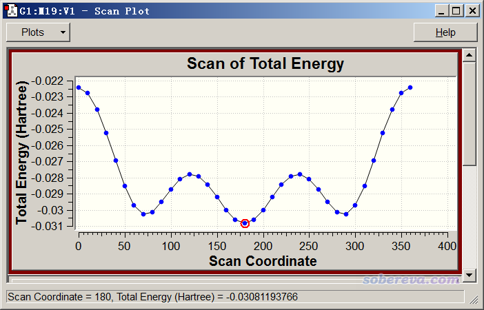

我们还可以考察一下中间的C-C键在扫描过程中的变化。选左上角的Plots - Plot Molecular Property，选Bond，然后输入中间两个碳的序号，即1和4，然后把窗口下拉框拉到最下面，看到下图

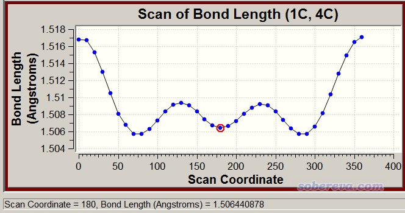

我们可以发现扫描过程中能量变化和C-C键键长变化有一定正相关性。能量越高，即两边基团间的位阻越大的结构下，中间的C-C键倾向于被撑得越长。

### 5.4 柔性扫描实例2：乙酰和甲胺封闭的丙氨酸(ACE-ALA-NME)的构象搜索

ACE-ALA-NME是对丙氨酸两边用乙酰和甲胺封闭后的模型结构，这里我们通过二维柔性扫描，试图寻找这个体系的能量最低构象。体系结构如下所示

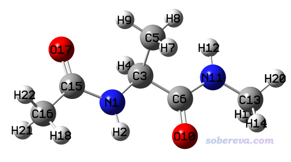

是否对这个体系里的甲基绕着C-C键做扫描意义不大，因为甲基非常小而且三个氢化学等价，其旋转对势能基本没什么影响。此体系里的N1-C15和C6-N11都在肽键中，肽键由于存在局部pi共轭，旋转势垒很高，所以也没必要考虑对其进行扫描。想通过扫描来找这个体系的能量最低构象只需要绕着容易旋转的N1-C3和C3-C6键扫描就行了。对这两个二面角做柔性扫描的输入文件如下（ACE-ALA-NME.gjf）：

# PM7 opt=modredundant  
 ...略  
 5 3 1 15 S 6 60.  
 5 3 6 10 S 6 60.

将输出文件弄到GaussView里查看，绘制曲面图，如下所示。为了看得清楚把两个视角都展示了出来，能量最低点用红圈标了出来

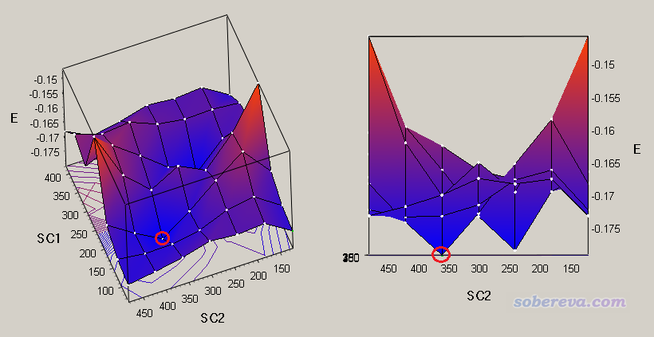

由于扫描的时候坐标是以固定步长变化的，因此上图中能量最低点肯定还不是真正的能量最低构象，应当用这个点作为初始结构进一步做几何优化。我们在GaussView中切换到这个点，保存文件成ACE-ALA-NME_opt.gjf，然后恰当设置关键词，对应在B3LYP-D3(BJ)/def2-SVP这种稍微像样的级别下优化。优化完的结果如下所示，之所以这个能量最低是因为形成了分子内氢键。实际上从扫描的二维图上还看到有另一个点的能量也非常低，读者也可以尝试对那个点也做一下优化，没准儿优化之后能量比当前结构还低。

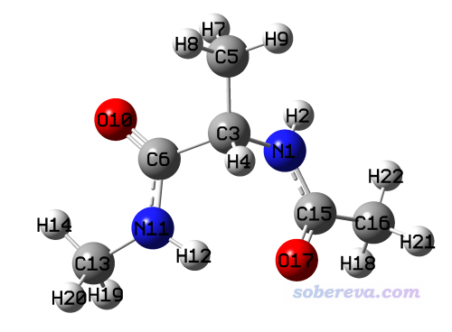

顺带一提，如果你想将这个分子内氢键的存在可视化，并考察其本质特征，可以用Multiwfn做RDG、IGM、AIM等分析，见《Multiwfn支持的弱相互作用的分析方法概览》（<http://sobereva.com/252>）。

对这个体系做刚性扫描试图找能量最低结构是没意义的，因为扫描过程中可能有些原子间出现严重不合理的接触，但这些地方的原子又不会由于限制性优化而自发回避开，故势能会极高，甚至可能由于原子间距离过近而报错。

对各种实际分子做构象搜索，往往需要考虑两个以上可旋转的键，按照上面的方式直接用Gaussian做多维柔性扫描试图找能量最低构象绝对不是好主意。通常，做分子构象搜索的最佳的做法是使用笔者开发的molclus程序，免费，使用灵活、方便，精度随意可控，介绍见<http://www.keinsci.com/research/molclus.html>，特别是要阅读《gentor：扫描方式做分子构象搜索的便捷工具》（<http://bbs.keinsci.com/thread-2388-1-1.html>），其中给出了构象搜索实例，并对构象搜索的很多要点做了讨论。

### 5.5 柔性扫描实例3：辅助寻找乙醇脱水的过渡态

乙醇的甲基上的一个氢可以转移到羟基的氧上，脱掉一个水，剩下的部分成为乙烯。这种氢转移的过渡态还是比较好找的，初猜不难摆。但有时候碰上比较复杂的情况，不好确定opt=TS找过渡态的初猜结构时，借助柔性扫描帮助判断合适的初猜结构往往还是有帮助的。这里就拿乙醇脱水作为例子说明一下，乙醇的结构如下。

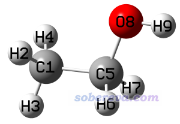

我们假定H2会转移到O8上，要借助柔性扫描辅助获得恰当的过渡态初猜，就应该扫描与反应过程对应最直接对应的坐标，对于此例来说应该逐渐缩短H2-O8距离。一开始的结构H2-O8距离2.667埃，而水的O-H键长约0.96埃，因此我们可以从初始结构开始扫17步，每步减少0.1埃，最后一步对应2.667-17*0.1=0.967埃。对于粗略确定合适的过渡态初猜的目的，柔性扫描用很便宜的级别就够了，故这里用很便宜的PM7（对有机体系过渡态研究多数情况定性正确，尽管也有不少反例），输入文件如下（ethanol_relax.gjf）。

# PM7 opt=modredundant nosymm  
 ...略  
 2 8 S 17 -0.1

对结果进行绘图，如下所示

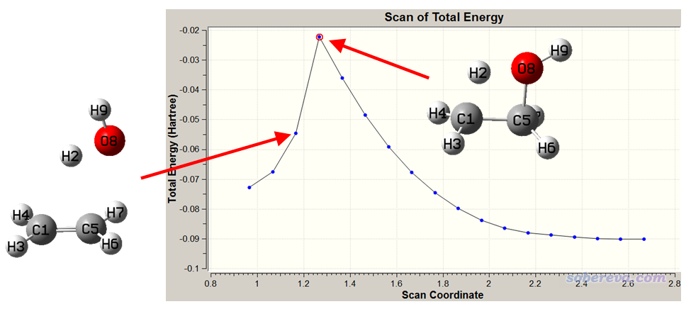

由于被扫描的变量是逐渐减小的，所以图应该从右往左看。随着扫描的进行，由于C-H和C-O键逐渐被拉长，能量逐渐升高，直到到达图中的最高峰。再往下走一步，能量突然降低，这是因为O-H距离此时已经比较短了，对其它变量进行优化后产生的结构已很像水+乙烯复合物了。这种断崖式曲线的形成原因通过本文5.2节的示意图已经展现得很清楚了。由于凭基本化学直觉就能看出扫描曲线上最高点的样子差不多就是乙醇脱水的过渡态结构，即处于乙醇结构和水+乙烯复合物结构之间，因此可以用这个点作为找过渡态的初猜结构。

经常有人贴出一个柔性扫描的图，上来就问最高点能不能作为过渡态初猜结构，这种问法明显不合适。不看一下最高点对应的具体结构，安知那个点是否有当前研究的反应的过渡态的基本模样？如果结构看着不像过渡态，显然不能当做找过渡态的初猜结构。

由于柔性扫描昂贵，不要随便碰到一个反应就总是试图通过柔性扫描帮助找适合的过渡态初猜，多数情况花那功夫自己早就试出一个能收敛到过渡态的初猜结构了，应当只有迫不得已时才应该考虑柔性扫描的做法。而且很多反应也不适合或根本没法通过柔性扫描确定适合的过渡态初猜结构。由于确定过渡态初猜的目的不需要限制性优化得太精确，可以在opt里同时写上loose用较松的收敛限来降低柔性扫描的耗时。

### 5.6 柔性扫描实例4：把环丁烷拉成丁烷双自由基

此例演示怎么实现把环丁烷的一个C-C键拉开，最终形成丁烷双自由基的扫描。最终要拉到差不多是直链丁烷的两端的碳之间的距离。估计了一下距离，比较适合从平衡结构开始扫11步，每步拉长0.2埃。当前任务输入文件如下（cyclobutane_relax.gjf）

# UM062X/6-31G* guess(mix,always) opt=modredundant pop=always nosymm  
 ...略  
 1 2 S 11 0.2

由于涉及到共价键断裂，所以关键词必须用guess(mix,always)，让每一步都产生对称破缺初猜波函数，使得扫描到已经对应双自由基状态的结构时，波函数能够收敛到双自由基状态（但是否确实能够奏效，还需要之后再考察输出信息）。这里用了M06-2X是因为它很适合研究有机问题，包括双自由基的情况。用pop=always是为了能在GaussView里直接绘制扫描过程的原子自旋布居。用nosymm一方面使得扫描轨迹看起来连续，另一方面也使得对称破缺计算更有保障。

在GaussView里显示结果，如下所示

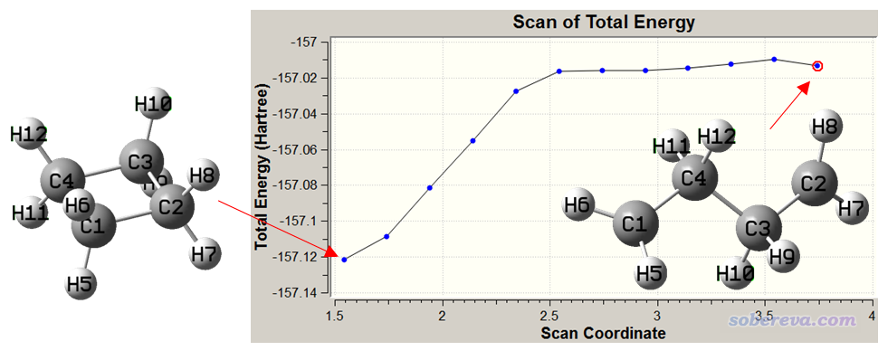

可见一开始，随着C-C键被拉长，能量显著上升。拉到大约2.5埃的时候，再继续增加C-C距离时，能量就不怎么显著上升了。这是因为差不多这个时候C-C化学键已经完全被破坏了，继续拉远导致的基本上只是构象变化，而构象变化造成的能量变化程度是远低于破坏化学键的。当前图中最后一个点的能量减去第一个点的能量可以近似作为这个键的键能，是(-157.01341+157.12159)*2625.5=284.0 kJ/mol。当然这样算的键能并不准，在于两端结构没经过优化，而且计算级别比较低（特别是基组）。此外，要和实验的BDE对比的话需要用焓来求差而非这样用电子能量求差。

我们再看一下原子的自旋布居在扫描过程中的变化，以了解形成双自由基的过程。如果不懂什么叫自旋布居、自旋密度，一定要看《谈谈自旋密度、自旋布居以及在Multiwfn中的绘制和计算》（<http://sobereva.com/353>）。选择Plot - Plot Molecular Property - Atomic Charge - Mulliken Spin population，输入1，可以看到带显著单电子的C1的Mulliken自旋布居在扫描过程中的变化，如下所示

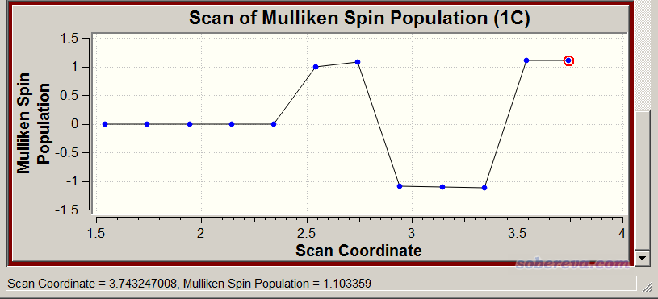

这个图看起来比较诡异，即中途突然有三个点变成负值了。这绝对不是计算过程出错了，而是因为我们用了guess(mix,always)，每一步都是重新产生初猜波函数而非用上一步收敛的波函数当初猜。因此C1在某个点可能带的是alpha单电子，但到了下一步，由于产生的初猜的数值巧合性，导致最终带的是beta单电子。这里假设我们只想考察C1带的单电子量，因此看这个图的时候我们不应该考虑自旋布居的正负号，应该只看数值大小。从C1的自旋布居大小上看，前5步都为0，体现由于C-C还没拉得较远，尚未呈现双自由基状态。从第六步开始自旋布居不再为0，而且数值几乎为1.0，说明从此开始，双自由基状态已经显著出现了，C1和C2每边几乎各分布一个单电子且彼此自旋方向相反。

## 6 通过广义化内坐标(GIC)进行柔性扫描

Generalized internal coordinate (GIC)是从Gaussian 16开始加入的特征，利用GIC的设定语句可以比使用冗余内坐标的设定语句更灵活地控制几何优化和柔性扫描。笔者没有精力去详细介绍（北京科音基础量子化学培训班里会细说），这里只是给两个例子体现GIC在柔性扫描中能产生的价值。笔者在《在Gaussian中做限制性优化的方法》（<http://sobereva.com/404>）文中给出了利用GIC实现限制性优化的例子，读者有兴趣也可以看看。

### 6.1 GIC扫描实例1：水+氮气二聚体的几何中心距离扫描

此例我们利用GIC对水的几何中心和氮气二聚体的几何中心间的距离进行柔性扫描。这种扫描如果不利用GIC设定的话肯定是没法实现的，因为普通的柔性扫描的扫描设定中不能牵扯虚原子，也因此不可能通过给每个单体中心增加虚原子然后扫二者的距离来实现。

在扫描前，建议先把水+氮气的二聚体极小点结构优化出来。这里用B3LYP-D3(BJ)/def-TZVP级别，不贵但是可以保证定性正确。将优化完的结构的单体的几何中心位置都添加虚原子，然后把虚原子与单体中任意一个原子连上键，然后调节虚原子间的距离使得两个片段的几何中心相距3埃。最终结构如下所示

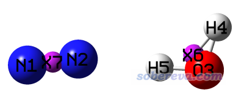

保存gjf文件，然后加上恰当的关键词和GIC设定成为下面这样（H2O_N2_gic.gjf）：

# b3lyp/tzvp em=gd3bj opt=addgic  
 [空行]  
 Title Card Required  
 [空行]  
 0 1  
  N                 -2.09851100   -0.04510800    0.06118400  
  N                 -1.02140600    0.07296400   -0.07499500  
  O                  1.65885690   -0.14665701    0.01859668  
  H                  1.94081190    0.77130999    0.08101768  
  H                  0.70784690   -0.10669701   -0.12803832  
  X                  1.43583857    0.17265199   -0.00947465  
  X                 -1.55995850    0.01392800   -0.00690550  
 [空行]  
 XH2O(inactive)=XCntr(3-5)  
 YH2O(inactive)=YCntr(3-5)  
 ZH2O(inactive)=ZCntr(3-5)  
 XN2(inactive)=XCntr(1,2)  
 YN2(inactive)=YCntr(1,2)  
 ZN2(inactive)=ZCntr(1,2)  
 scan(StepSize=0.1,NSteps=10)=sqrt[(XH2O-XN2)^2+(YH2O-YN2)^2+(ZH2O-ZN2)^2]*0.529177

opt里加上addgic代表读入额外的GIC设定。上面的设定代表将水分子（3~5号原子）的几何中心的X,Y,Z坐标分别定义为XH2O、YH2O、ZH2O这三个变量，后面加上(inactive)代表这仨变量本身不是被几何优化的对象（被优化的对象是原子，而不是几何中心，几何中心仅被用来定义约束条件之用）。类似地对氮气分子也这么定义三个变量。此处scan不是关键词，而是自定义的一个变量名，取其它名字也可以，而括号里的StepSize=...,NSteps=...设定则是GIC里做柔性扫描的选项。我们通过表达式将被扫描的变量定义为了两个单体几何中心的距离，最后0.529177是把默认的距离单位由Bohr转化为埃。此例扫10步，每步增加0.1埃，因此理应最后一个结构下两个分子几何中心距离为3.0+10*0.1=4.0埃。我们可以通过GIC支持的运算符和数学函数任意去构造被扫描的变量，所以GIC非常灵活。

用Gaussian跑一下这个任务，发现总共才扫了8个点就报错停止了。这是因为目前笔者用的Gaussian 16 A.03的GIC代码不太稳定，也可能存在bug，所以看似合理的GIC设定也往往会莫名其妙出错中断，但愿以后会有所改进。对于跑出来的8个GIC扫描点，绘制成动画是这样。

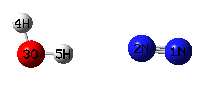

由动画可见，确实每扫一步二者间几何中心距离都增长一点。而且由于是柔性扫描，所以单体相对朝向都自发做了调整来最小化能量。

下面是scan结果观看页面，横坐标没有直接显示几何中心距离，但根据我们的设定可以知道能量最低的那个点是3.0+(7-1)*0.1=3.6埃处（第一个点是初始结构）。

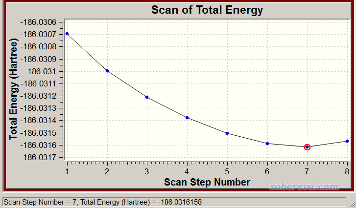

### 6.2 GIC扫描实例2：令1,3-丁二烯两个亚甲基同步旋转的扫描

此例主要目的是演示怎么在GIC里设定约束，使得几个变量可以被同步地扫描，这在实际中挺有用。比如有时候我们想让几个键的键长，或几个键角/二面角每一步改变相同数值，不利用GIC的话不好实现。

我们画一个顺式1,3-丁二烯，用PM7优化一下，得到如下结构

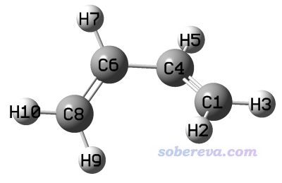

此例我们想让左边和右边的亚甲基同步顺时针旋转。因此我们可以把被扫描的变量设为6-4-1-2，让二面角每一步都减小，而且让4-6-8-9二面角与6-4-1-2二面角初始的差值约束为恒定，这样右边亚甲基转多少度，左边亚甲基也会同步转多少度。此例的输入文件如下（butadiene_gic.gjf）

# opt=addgic UPM7 guess(mix,always)  
 [空行]  
 Title Card Required  
 [空行]  
 0 1  
  C                  1.52650408   -0.47892841    0.10569634  
  H                  1.19780098   -1.39607531    0.57075384  
  H                  2.58160131   -0.47569529   -0.11790508  
  C                  0.71385757    0.54669829   -0.15773410  
  H                  1.08159899    1.46515075   -0.62106758  
  C                 -0.71385135    0.54669658    0.15773254  
  H                 -1.08160736    1.46512752    0.62108081  
  C                 -1.52650638   -0.47892483   -0.10569716  
  H                 -1.19781485   -1.39607552   -0.57075439  
  H                 -2.58160268   -0.47568190    0.11790667  
 [空行]  
 scan(StepSize=-10.0,NSteps=13)=D(6,4,1,2)  
 rcons(freeze)=D(4,6,8,9)-D(6,4,1,2)

可见我们要让亚甲基顺时针转10.0*13=130度。GIC里面R、A、D分别接两个、三个、四个原子序号，用来选择距离、角度、二面角。rcons是一个自定义的变量，括号里freeze代表令这个变量的数值在扫描过程中严格维持为初始结构中的值。rcons被定义为了能代表左侧亚甲基和右侧亚甲基的两个二面角的差值，因此扫描过程中左侧亚甲基会与右侧亚甲基同步转动。这里用了U的计算形式和guess(mix,always)关键词，正如我们之前柔性扫描共价键断裂时用的，这是因为当亚甲基旋转到与C-C-C-C平面接近90度的时候，1,3-丁二烯两侧的C=C双键会很大程度被破坏掉，此时将使体系出现一定双自由基特征，若当成闭壳层计算的话肯定严重不合理。

下面是扫描过程动画，以及能量变化曲线

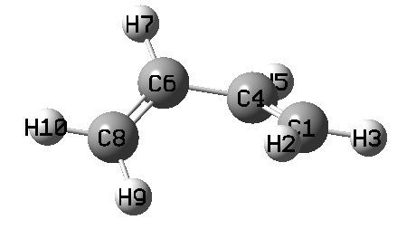

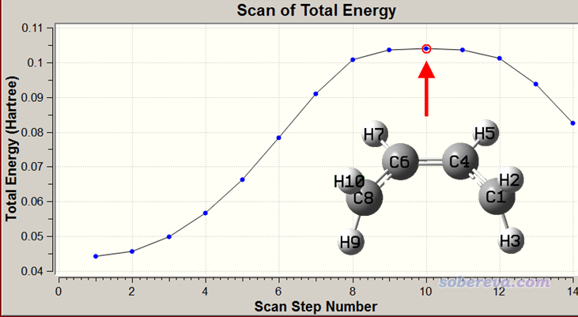

由动画可见，确实两个亚甲基同步旋转了。旋转到第10个点的时候能量最高，此时对应于两个亚甲基都垂直于C-C-C-C平面，此时体系两侧的pi键被完全破坏掉，在C1、C8上基本上各分布一个单电子而且自旋相反，而原本与C1、C8形成pi键的中间两个碳上的倆p电子此时就用于在中间两个碳上形成pi键了。在第10个点时，C1和C8之间必定有很强的跑到一起形成sigma键的趋势（如果发生了的话就成了环丁烯），但是此现象并没有出现，这在于如果形成环丁烯的话必须两个亚甲基的氢往体系两侧显著偏移来让C1和C8形成sp3杂化，但当前我们人为控制了亚甲基的二面角数值，因此阻止了C1与C8自发成键并形成sp3杂化。

## 7 总结&其它

本文深入、详细、系统地对势能面的刚性扫描和柔性扫描的概念进行了介绍，并结合Gaussian程序以及笔者自行开发的程序举了大量例子，充分体现出了势能面扫描的意义和实际用处，其中还介绍了不少特殊技巧、与其它方面知识进行了联系。望读者举一反三，灵活、恰当运用势能面扫描解决实际问题。

基本上所有主流量子化学程序都支持势能面扫描，原理都大同小异，只不过大部分程序里的柔性扫描功能没有Gaussian这么灵活。其它的量化程序往往支持一些自己需要用但是Gaussian又不支持的理论方法，比如CCSD(T)-F12、GFN-xTB、NEVPT2等，此时可以效仿以下两篇文章的做法让Gaussian在扫描时调用那些程序去计算能量/梯度，之后能量变化和扫描轨迹可以照常在GaussView里直接观看：  
《将Gaussian与ORCA联用搜索过渡态、产生IRC、做振动分析》（<http://sobereva.com/422>）  
《将Gaussian与Grimme的xtb程序联用搜索过渡态、产生IRC、做振动分析》（<http://sobereva.com/421>）

还有一些特殊情况的势能面扫描，是使用本文提到的任何方法都没法直接实现的，比如对于pi-pi堆积二聚体，两个单体都平行于XY平面，想让其中一个单体在X,Y方向上进行二维扫描，像这种情况就只能自己写程序来解决了。具体来说可以产生多帧的xyz轨迹（这是最简单的记录多帧结构的格式），每一帧对应把单体在X和Y方向上平移不同的数值，然后再用xyz2QC转化成Gaussian输入文件，最后用Gaussian执行、批量提取数据。

本文都是对基态做势能面扫描，Gaussian里所有支持的理论方法都可以用于做扫描（热力学组合方法不算，没有解析梯度的方法也没法用于柔性扫描），也包括计算激发态的方法。扫描激发态只不过是在常规扫描设定基础上加上算激发态的关键词或相关设定。比如要在TDDFT下对第2激发态势能面做柔性扫描，写比如# PBE1PBE/6-31G* TD(nstates=5,root=2) opt=modredundant即可，详见《Gaussian中用TDDFT计算激发态和吸收、荧光、磷光光谱的方法》（<http://sobereva.com/314>（<http://bbs.keinsci.com/thread-2413-1-1.html>）。另外，对于分子力场，由于在Gaussian里其默认的做优化的模块、流程和其它方法不同，因此要做柔性扫描的话需要在opt里同时写nomicro，否则柔性扫描设定都不会生效。
