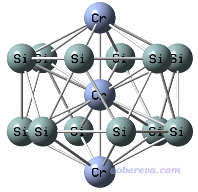
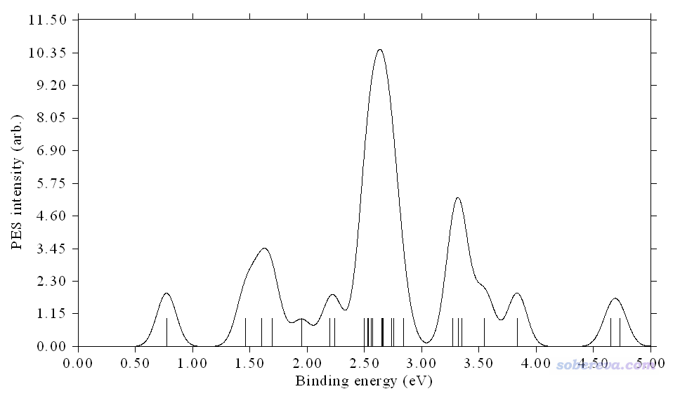
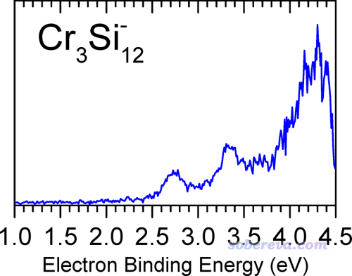
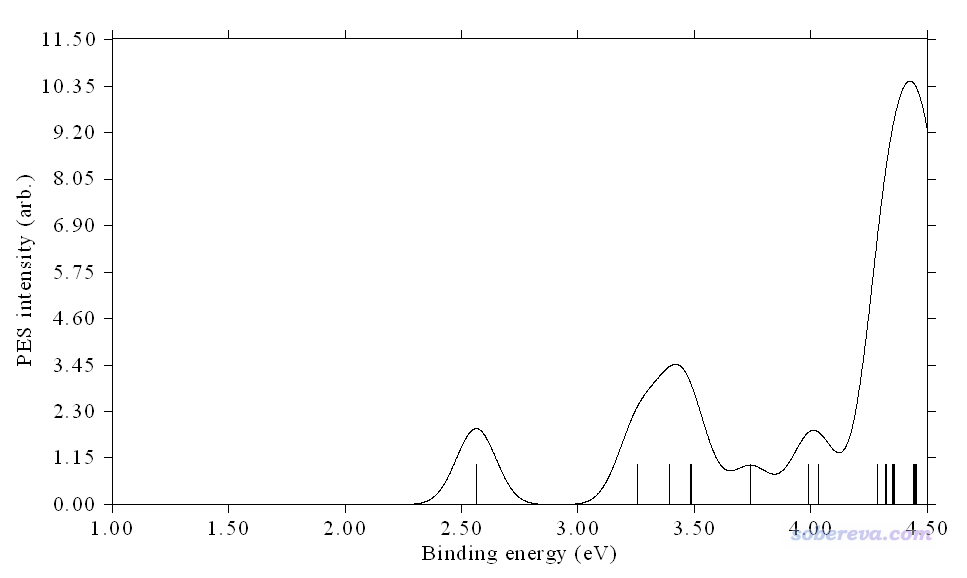
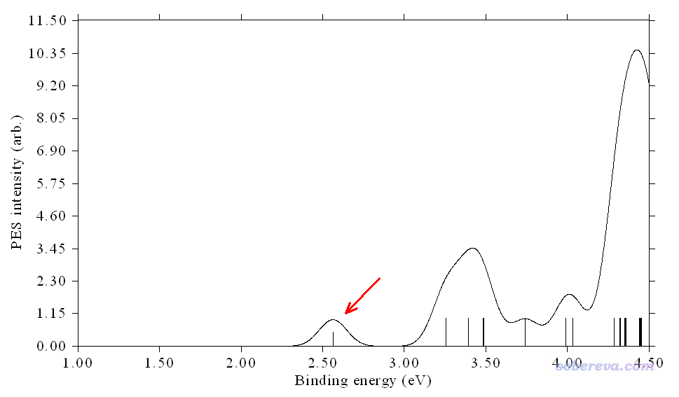

**使用Multiwfn绘制光电子谱**

Using Multiwfn to plot photoelectron spectrum

文/Sobereva@[北京科音](http://www.keinsci.com)

First release: 2019-Apr-27  Last update: 2020-Sep-28

## 1 前言

波函数分析程序Multiwfn（<http://sobereva.com/multiwfn>）具有很方便、灵活、强大的态密度(DOS)绘制功能，在《使用Multiwfn绘制态密度(DOS)图考察电子结构》（<http://sobereva.com/482>）里有充分讲解和示例。光电子谱（photoelectron spectrum, PES）的绘制原理和DOS图颇为相似，而且需要绘制PES的人不在少数，经常有人问我怎么绘制，因此笔者在Multiwfn的DOS绘制模块里专门加入了一个很方便的PES绘制功能，在此文专门介绍一下。注意只有2019-Apr-27及之后更新的Multiwfn才有绘制PES的功能。不了解Multiwfn的话强烈建议参看《Multiwfn入门tips》（<http://sobereva.com/167>）。

PS：在Multiwfn支持光电子谱绘制之后，很快就有不少文章使用Multiwfn的这个功能作图发表文章了，比如Mater. Today Adv., 6, 100070 (2020)、J. Phys. Chem. C, 123, 28561 (2019)、Comput. Theor. Chem., 1170, 112635 (2019)、Int. J. Quantum Chem., 120, e26087 (2019)、Int. J. Quantum Chem., e26457 (2020)、New J. Chem. (2020) DOI: 10.1039/D0NJ03483E等。

## 2 光电子谱的绘制原理

光电子谱上的谱峰位置体现的是被光子打掉一个电子后的阳离子状态的能量与原先中性状态的能量差。根据打来的光子的能量不同，可分为紫外光电子谱(UPS)和X光光电子谱(XPS)，前者打来的电子能量低，电离掉的是价层电子；后者打来的光子能量很高，电离掉的是内层电子。假设体系是中性，则体系原先通常处于中性的振动基态，电离掉电子之后，体系可以处于阳离子态的不同振动态，因此PES是有精细结构的，体现振动耦合效应。但我们实际理论研究时为了省事，往往忽略掉核运动的量子效应（下文都是这样考虑），而把电离假想为垂直过程，即电离过程中核坐标来不及改变，一直处于初态势能面的极小点，此时PES上的峰位置就等同于垂直电离能(VIP)。后文我们说的所有电离能(IP)都是指VIP。因此，只要我们先对体系优化，然后算出来从体系各层电离掉电子对应的电离能，就能绘制出PES。

一般我们做电离能计算都是在中性的势能面极小点下通过IP=E(cation)-E(neutral)得到，E是电子能量。但是这样通常只能得到最外层电子电离的能量，而电离掉更深层电子的能量得不到，不过其它方法可以计算，比如OVGF、IP-EOM-CC、ADC等。

最最简单的绘制PES的方法就是基于Koopmans定理。Koopmans定理非常知名，它说各层电子的电离能等于各个Hartree-Fock轨道能量的负值。注意这只是近似的关系，它忽略了电子相关和轨道弛豫问题，把电子态层面的问题简化到了单电子近似得到的轨道层面上。光从第一电离能来看，HF轨道能量的负值只是其很粗糙的近似，而对于如今最常用的KS-DFT计算，这个近似往往更烂，但这点实际上具体取决于泛函的选用（诸如在特殊的QTP17等泛函下靠Koopmans定理得到的VIP相当不错。而对于精确泛函，可以证明HOMO的能量和第一IP精确相等。有些人由于误认为KS-DFT轨道对Koopmans定理满足程度一定很差就因此信誓旦旦地鼓吹KS-DFT轨道缺乏意义、甚至不叫分子轨道，还引来不少点赞，真是...）。

HF如今谁也不用。而对于大家平时常用的那些DFT泛函，各个轨道能量对各层IP肯定有不同程度的偏离，而且一般偏离还挺明显，这导致直接用KS-DFT轨道能量的负值绘制的PES和实验对得可能较差。还有个定理叫Generalized Koopmans定理，可以很大程度上解决这个问题。这个定理把常规的通过E(cation)-E(neutral)方式计算的IP作为第一个IP，然后把HOMO以下的各个占据轨道相对于HOMO轨道的能量差的绝对值加上去作为第二IP、第三IP...换句话说，就是把所有轨道能量进行整体平移，使得IP与-E(HOMO)恰好相等，拿平移后的轨道能量的负值再来绘制PES往往就能和实验对得不错了。

在《正确地认识分子的能隙(gap)、HOMO和LUMO》（<http://sobereva.com/543>）一文中，笔者还详细介绍了QTP系列泛函。用QTP17泛函的话，轨道能级能比较理想地满足Koopmans定理（无论是价层的还是内核的）。因此如果你基于这种泛函的轨道能级绘制PES的话，就不用着Generalized Koopmans定理了，直接基于Koopmans定理绘制即可（换句话说，在下文的例子中就用不着输入平移值了）。在Gaussian中使用QTP17的方法见《Gaussian中非内置的理论方法和泛函的用法》（<http://sobereva.com/344>）。

上面只是说了PES的峰的位置的确定方式，我们最终要得到的是能够和实验谱对照的PES曲线图。具体产生的方式是给每个轨道一个强度值，然后通过Gaussian函数进行展宽（展宽出的峰的积分面积正比于强度值），再把所有展宽出的曲线叠加到一起来得到PES曲线图。这个过程十分类似于《使用Multiwfn绘制红外、拉曼、UV-Vis、ECD、VCD和ROA光谱图》（<http://sobereva.com/224>）中介绍的基于量子化学程序计算的跃迁能量和强度数据产生各类光谱的过程，没看过此文者强烈建议一看。一般都是将每个轨道的强度值定义为相同的数值，具体数值是多少无所谓，因为模拟的PES谱的整体强度大小不是我们关心的，纵坐标的具体数值都不需要标在图上。展宽过程中有个重要的参数FWHM，决定了每个轨道展宽出的峰的半高位置处的全宽，数值越大峰越宽。在Multiwfn中，每个轨道强度默认为1，FWHM默认为0.2eV，但用户也可以自己适当修改，来试图使得模拟的谱图和实验谱对得更好。

## 3 用Multiwfn绘制光电子谱的基本过程

在Multiwfn里绘制PES很容易。输入文件可以用fch/fchk、chk、molden、gms、Gaussian的pop=full的输出文件。其中gms是GAMESS-US的输出文件，用chk时需要设定formchkpath，详见《详谈Multiwfn支持的输入文件类型、产生方法以及相互转换》（<http://sobereva.com/379>）里的说明。对于无法产生这些文件的量子化学程序，你也可以把轨道能级信息整理成手册3.12.2节说明的文本文件格式，此文件也可以作为绘制DOS或PES的输入文件使用。

载入文件后，进入主功能10，选择子功能12进入绘制PES的界面，然后选择0，PES图马上就蹦出来了。在这个界面里有很多选项可以调节作图设定，一看提示就立马明白，包括：  
• 横、纵坐标范围  
• 是否将横轴左右反转  
• 是否显示曲线和离散竖线  
• 是否显示Y轴的标签和刻度  
• 曲线和离散竖线的粗细  
• 结合能的平移值，用于满足Generalized Koopmans定理的目的  
• FWHM值  
• 曲线乘的系数。数值越小，则竖线相对于曲线来说越高

还可以在PES绘制界面选择选项1把图像保存。这种纯曲线图建议用pdf、svg、wmf这些矢量图格式。pdf大家都熟悉，svg用网页浏览器都能打开，而wmf适合嵌入word、ppt里面。启动前在settings.ini里通过graphformat参数可以设置保存成什么格式。

如果你选择绘制PES时屏幕上什么都没出现，要么是你输入文件有问题，可以在PES界面里选择选项-2把所有占据轨道信息显示出来检查载入的数据有无问题；要么就是你的横坐标范围没设合理，绘制的能量范围内没有任何轨道出现。

如果你想对不同的轨道定义不同的强度和FWHM值，可以在PES界面里选选项-3把数据导出成PESinfo.txt，手动对里面对应强度和FWHM值的列进行编辑，然后将这个文件作为输入文件。

注意PES绘制界面虽然是通过DOS绘制界面进入，有些选项也比较类似，但是二者的参数大多不共享。在PES绘制界面里用的展宽函数只能为Gaussian函数，单位只能是eV。另外，对于非限制性开壳层波函数，虽然有alpha和beta两套轨道，但是绘制PES时是不区分自旋的，两套轨道都一视同仁。

## 4 实例：Cr3Si12-光电子能谱的绘制

在J. Phys. Chem. A, 122, 9886 (2018)一文中研究了Cr3Si12-等团簇，既测了这些体系的PES谱，又在PBE/6-311+G*下做了理论计算，并且通过上文提到的原理绘制了理论PES谱。本例就拿文中优化出的Cr3Si12-这个体系中的一个构型（文中称为3A）来示例一下用Multiwfn绘制PES谱的过程。这个构型的笛卡尔坐标是直接从文中的补充材料中取的，因此这里就不再做优化了，本例用的计算级别也和原文保持一致。文中指出这个结构在PBE/6-311+G*下的电子态应为8B1（八重态，B1不可约表示），是D6d点群，体系结构如下：

此体系用PBE/6-311+G*按照常规方式计算IP是2.56 eV。值得一提的是，对于这样的阴离子体系，VIP一般被叫做VDE，即vertical detachment energy（垂直脱附能），体现阴离子脱掉带的额外的一个电子需要的能量。

这里假定读者是最常用的量子化学程序Gaussian的用户。我们首先要基于文献里优化好的结构算一次单点任务得到fch文件。然而笔者发现对这个体系直接用PBE/6-311+G*算单点时程序自动初猜的波函数是B2不可约表示，而且很难收敛。笔者略施小计，先在B3LYP/6-31G*下算了个单点，很容易就收敛了，而且最终波函数是B1。然后做PBE/6-311+G*计算，用guess=read读取chk里的波函数当初猜，然后很容易就收敛到了B2态。相应的输入、输出文件，以及chk转换出的fchk文件都可以在此下载：<http://sobereva.com/attach/478/file.rar>。

启动Multiwfn，依次输入  
Cr3Si12-.fchk  //输入实际路径  
10  //绘制DOS  
12  //进入绘制PES光谱的界面  
1   //显示PES光谱

瞬间在屏幕上看到下图，对应于基于Koopmans定理得到的PES图

上图中纵坐标的单位不用管，arb.是arbitrary，即任意的意思，只有曲线形状、横坐标位置有意义，也可以选择一次选项13来把纵坐标上的数值和刻度给去掉。横坐标对应结合能(binding energy)，可见默认绘制的是0~5eV区间。图上每个竖线的横坐标的位置对应分子轨道能量的负值，竖线高度对应强度值。

下图是JPCA那篇文章里实验测出来的

可见对于我们绘制的PES谱，即便只关注0~4.5 eV部分，也和实验对得不好，第一个峰出现的位置明显太早了，在0.75 eV左右，而实验则是2.75左右。

为了修正这个问题，我们下面基于Generalized Koopmans定理再来重新绘制一次，相当于自行设定平移量，结合能加上这个量之后才会被用于绘图。注意，在进入PES光谱绘制界面时，Multiwfn在文本窗口里已经给出了HOMO能量，为-0.7732 eV，这是alpha的HOMO和beta的HOMO中最大的值，可以当做不区分自旋时候的HOMO。JPCA文中在当前计算级别下算出来的VIP为2.56 eV，对结合能的修正量应当为这两个量的相加，即2.56-0.7732=1.79 eV。

我们在PES绘制界面里输入  
3   //设定平移值  
1.79  
4  //设定横坐标  
1,4.5,0.5  //绘制1.0~4.5 eV范围，标签间隔0.5eV  
1  //绘制光谱  
立刻看到下图

我们将上图与实验谱对照，发现虽然峰的位置仍有些许偏差，但整体已经高度相符了，不同区域曲线之间的相对高度也和实验对应得很好，说明当前绘制的PES非常理想，也说明当前算的这个体系的结构正是实验观测到的实际结构。

下面，再演示一下如何自行修改轨道的强度值，假设我们的目的是让图上第一个峰对应的轨道强度值设为0.5，即默认的一半，从而让峰的曲线高度降低。在PES界面里选择-3，当前目录下就出现了一个PESinfo.txt文件，含义在手册3.12.2节已经说明了。从第三行开始，四列数据分别是轨道能量（原始值）、占据数、强度、FWHM。上图中第一个峰对应的是能量最高的占据轨道，仔细看一下PESinfo.txt，会发现对应的是下面两行，是二重简并的alpha的HOMO轨道（其能量值的负值也正对应于一开始基于Koopmans定理绘制的图里面第一个竖线位置）  
         -0.773240    1.000000    1.000000    0.200000  
         -0.773240    1.000000    1.000000    0.200000  
我们手动将其内容改为  
         -0.773240    1.000000    0.500000    0.200000  
         -0.773240    1.000000    0.500000    0.200000  
保存后，将这个PESinfo.txt作为输入文件，和前面的步骤一样基于Generalized Koopmans定理绘制光谱，得到的图如下所示，可以看到确实第一个峰变低了，竖线高度只有原来的一半。

