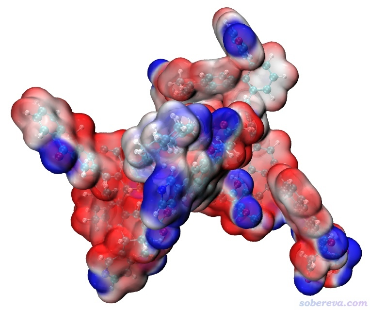
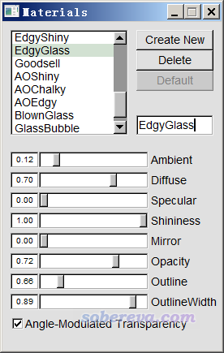
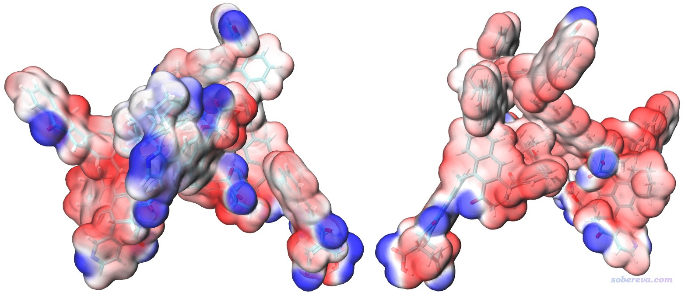
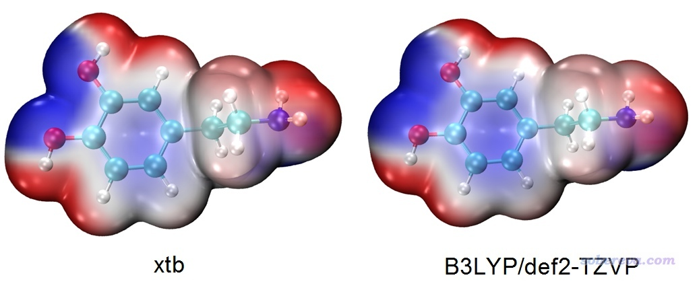

**重要提示**：下文是很早以前写的，如今已经没意义了！如今使用Multiwfn官网上的最新版本，结合下文提到的xtb产生的molden文件作为输入文件，直接用《使用Multiwfn+VMD快速地绘制静电势着色的分子范德华表面图和分子间穿透图》（<http://sobereva.com/443>）介绍的ESPiso脚本绘制才是最好的做法。因为后来得益于《Multiwfn使用的高效的静电势算法的介绍文章已于PCCP期刊发表！》（<http://sobereva.com/614>）中介绍的Multiwfn计算静电势速度的巨大提升，以及《巨幅降低Multiwfn结合VMD绘制分子表面静电势图耗时的一个关键技巧》（<http://sobereva.com/602>）所描述的巨幅降低耗时的技巧，用443号文中的做法比下文的做法不仅更省事、省时，还不需要调用收费的Gaussian里的cubegen。

**提示**：如果你要绘制1000原子以上的特大体系的表面静电势图，应当使用《基于原子电荷极快速绘制超大体系的分子表面静电势图》（<http://sobereva.com/639>）里的做法，用Multiwfn基于原子坐标和原子电荷来计算，耗时超级低！

**巨大体系的范德华表面静电势图的快速绘制方法**

Rapidly plotting electrostatic potential colored van
der Waals surface for huge system

文/Sobereva@[北京科音](http://www.keinsci.com)

 First release: 2019-May-7  Last update: 2020-Apr-26

有人问我，怎么绘制他的含有多达336个原子的分子的分子表面静电势图。对这么大体系，绘制这种图看似极其困难，很难吃得消，但其实只要方法得当，哪怕只有台普通四核机子，也完全没有压力，而且绘制的图像效果极佳，本文就来介绍一下流程。绘制用的步骤和《使用Multiwfn+VMD快速地绘制静电势着色的分子范德华表面图和分子间穿透图》（<http://sobereva.com/443>）里介绍的基本一样，但牵扯到一些其它过程和技巧，没读过此文的读者一定要先阅读一下。本文用到的Multiwfn可以在其官网<http://sobereva.com/multiwfn>上免费下载，读者用的Multiwfn版本应是2019年4月或以后更新的。

本文笔者的条件是：CPU为Intel i7-2630QM（4核），操作系统是Win7-64bit，Multiwfn是2019-May-5版，xtb是2019-Apr-16版，Gaussian是G16 A.03版，VMD是1.9.3版，这几个程序里只有Gaussian是收费的。笔者跑xtb时是在VMware装的CentOS 7.4虚拟机下跑的，因为此程序目前只有Linux版，不会装Linux的话看《在VMware 15中安装CentOS 7.6的完整过程视频演示》（<http://sobereva.com/454>）。

要绘制分子表面静电势图，不管通过什么途径，肯定得先产生波函数，至少得算一次单点任务。但如果你只有一台四核机子，遇见300多个原子的体系，用Gaussian算DFT就甭想了，哪怕在ORCA里用纯泛函开RI，照样很难算得动。虽然用半经验方法如PM6算几百个原子很快，但是一般的程序都不支持基于半经验方法得到的波函数去算静电势。碰到这种情况，最佳的出路就是用Grimme的xtb程序。此程序的安装和基本用法在《将Gaussian与Grimme的xtb程序联用搜索过渡态、产生IRC、做振动分析》（<http://sobereva.com/421>）已经介绍了，不会用xtb的人一定要看一下。

先把那个336原子的大分子的结构文件载入Multiwfn（支持mol、mol2、pdb、xyz、gjf等众多格式），进入主功能100的子功能2，选择相应选项导出为xyz文件，比如叫336.xyz。然后把此文件随便放到一个空目录下，在此目录下运行此命令通过xtb做单点计算：xtb 336.xyz --molden（如果这个结构是未经优化过的，可再加上--opt让xtb优化此结构）。在笔者的4核机子上只花了20秒钟就算完了，在当前目录下出现了molden.input，这是Molden输入文件，可以被Multiwfn读取并做波函数分析。

把Multiwfn目录下的settings.ini里的nthreads设为机子里实际的CPU物理核心数，使得CPU运算能力能在接下来的计算中充分发挥。

下面产生此体系的电子密度格点数据。启动Multiwfn，载入molden.input，然后依次输入以下命令：  
5  //计算格点数据  
1  //计算电子密度  
3  //高质量格点  
计算过程花费仅不到1分钟，然后选2导出格点数据，此时当前目录下出现了density.cub，将之改名为density1.cub备用。

然后我们要计算静电势格点数据，用Multiwfn调用Gaussian目录下的cubegen速度会很快，但是这要求必须以fch作为输入文件，所以我们要把当前的波函数导出为fch文件。接着在Multiwfn里输入  
0  //返回主菜单  
100  //其它功能part 1  
2  //导出文件  
7  //导出fch文件  
336.fch  //输出文件名  
马上当前目录下就有了336.fch。现在退出Multiwfn。

我们修改Multiwfn目录下的settings.ini，将其中的cubegenpath路径设为你机子里实际的Gaussian目录下的cubegen可执行文件的路径，比如D:\study\G16W\cubegen.exe。关于这点，在<http://sobereva.com/435>里有更多说明。

当前这个体系很大，当Multiwfn调用cubegen去处理这个文件时，会由于G16的cubegen默认可用内存上限不够而报错。为解决这个问题，对于Windows用户，进入操作系统的控制面板，选择“系统”-“高级系统设置”-“高级”-“环境变量”，然后在用户变量里点击“新建”，变量名填GAUSS_MEMDEF，变量值填1400MB，然后点“确定”。之后cubegen处理fch文件时最大可用内存就为1400MB了，对当前体系完全够了（如果你的Gaussian是64bit版本，GAUSS_MEMDEF也可以设更大，比如可以填4GB。而对于32bit版Gaussian，GAUSS_MEMDEF通常最多只能设1400MB，再大往往就无法运行了）。如果你用的是Linux版Gaussian，应当运行比如export GAUSS_MEMDEF=4GB命令来让cubegen可以最大调用4GB内存（建议把这行命令也加入到~/.bashrc文件中，否则每次开启终端后都得再运行一次此命令）。

启动Multiwfn，依次输入  
336.fch  
5  //计算格点数据  
12  //计算静电势  
3  //高质量格点  
现在会看到Multiwfn正在调用cubegen计算静电势。这一步是整个过程最耗时的一步，花了50分钟（而在笔者的2*E5-2696v3 36核服务器上三分多钟就能算完）。然后选2导出格点数据，此时当前目录下出现了totesp.cub，将之改名为ESP1.cub。

现在把density1.cub和ESP1.cub都拷到VMD目录下，把Multiwfn目录下的examples\drawESP目录下的ESPiso.vmd也拷到VMD目录下。启动VMD，在文本窗口输入source ESPiso.vmd并回车，马上就可以看到下图：

这图虽然效果已经很好了，但看着还有点乱，因此我们进入Graphics - Materials，选里面的EdgyGlass材质（这是用于显示当前分子表面用的材质），然后适当调节各个参数令效果尽可能好，最后改成下面这样：

然后进入Graphics - Representation，点击对应显示分子结构的rep，把CPK显示方式切换为Licorice，并让键的粗细从默认的0.3改为0.2。然后点击对应Isosurface显示方式的那个rep，选择Trajectory标签页，把Color Scale Data Range范围设成比默认-0.03~0.03更宽的-0.04~0.04使得颜色变化更柔和些。最后图像效果如下，两个视角都给了，可见效果相当令人满意！（可能有人觉得这个图还没一开始看到的酷炫，但此时的图更容易分辨分子表面上不同区域静电势的差异）

图中红色和蓝色分别对应于静电势为正和为负的区域。如果你想把色彩刻度轴加上去也很容易，做法在<http://sobereva.com/443>文中已经介绍了。

本文的做法绘制甚至四五百个原子的体系的静电势图也是完全没问题的，哪怕只有一台四核机子，也完全可以算得动，只不过是时间长一些而已。本文给出的静电势分布其实算不上很准确，毕竟xtb程序做的GFN-xTB计算只相当于半经验层面的DFT方法，用的是极小基，不过对于几百个原子的静电势图的绘制，谁也不会那么关注定量大小，只要定性正确就足够了，当前绘制的图完全可以满足这个需要。本文的例子也充分体现出，对于好几个百原子的精度要求不很高的波函数分析，xtb+Multiwfn可谓是黄金组合。

下面是xtb产生的波函数与精度理想的B3LYP/def2-TZVP波函数绘制的分子表面静电势图的对比，可见差异不是很大，基于xtb的结果已经完全可以满足需要了。

不过，如果你想基于xtb的波函数按照《使用Multiwfn的定量分子表面分析功能预测反应位点、分析分子间相互作用》（<http://sobereva.com/159>）去定量考察分子表面静电势特征，那么xtb的波函数质量还是差点意思。比如对于上面这个多巴胺的分子表面静电势最大、最小点数值，基于xtb算的结果与基于B3LYP/def2-TZVP波函数算的结果甚至能差出20 kcal/mol的程度。而对于计算拟合静电势电荷，比如CHELPG，基于xtb波函数算的结果与基于B3LYP/def2-TZVP算的结果差异最大的可达0.23，这也不是个小数目。所以，xtb波函数对应的静电势可以满足肉眼观看、定性分析需要，但定量层面上还明显达不到准确的标准。
