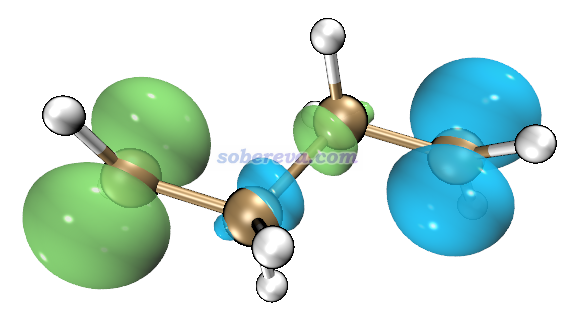
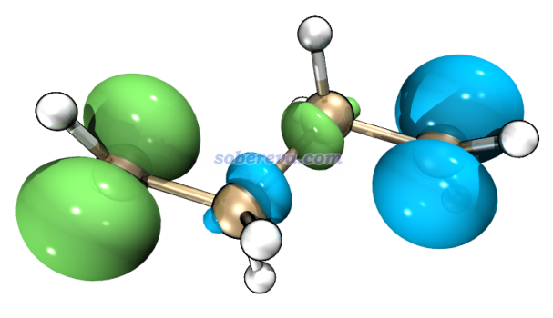
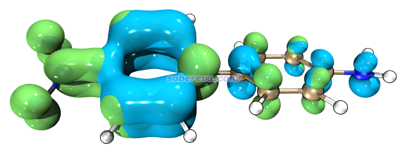
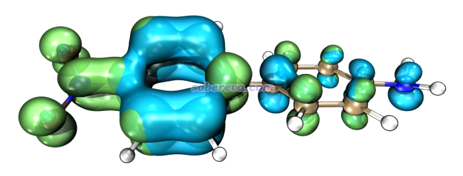
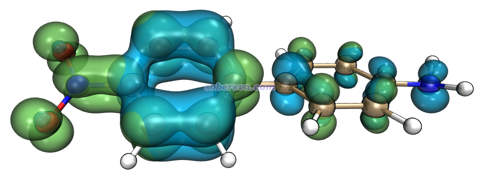
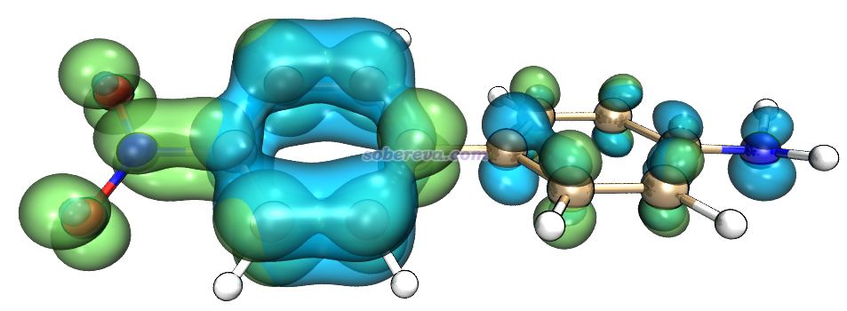
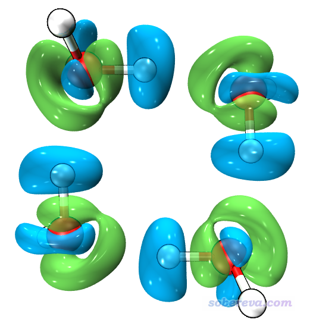
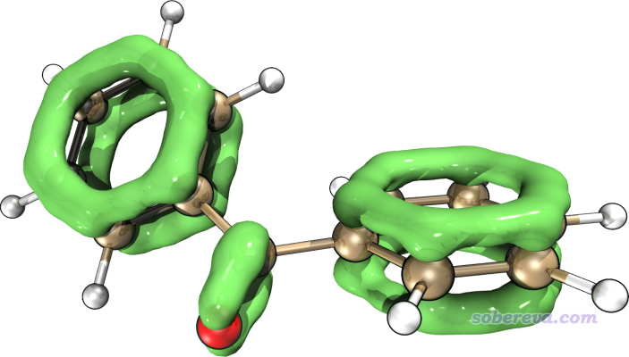

**在VMD里将cube文件瞬间绘制成效果极佳的等值面图的方法**

Easily drawing a cube file as an excellent isosurface map in VMD

文/Sobereva@[北京科音](http://www.keinsci.com/)  2019-May-21

## 1 前言

Multiwfn（<http://sobereva.com/multiwfn>）是产生量子化学研究和波函数分析中用到的各种格点数据特别方便、强大的工具，可以在自带的界面里直接显示出等值面，也可以把数据导出成cube文件从而在免费的VMD程序（<http://www.ks.uiuc.edu/Research/vmd/>）里绘制出效果更好的图像。不了解cube文件者请参看《Gaussian型cube文件简介及读、写方法和简单应用》（<http://sobereva.com/125>）。笔者感到每次给初学者解释怎么在VMD里操作显示出等值面特别费劲、费事。笔者之前写过一篇文章《用VMD绘制艺术级轨道等值面图的方法》（<http://sobereva.com/449>），里面介绍了一种利用自编的VMD脚本超级方便地绘制出效果绝赞的轨道等值面图的做法。于是笔者想到，不如干脆写一个脚本，从而对于任意类型的cube文件都可以敲几下键盘就能瞬间在VMD里画出极好的等值面图。本文就介绍一下这个脚本，我深信这个脚本会有极高的实用价值（相比之下，大部分其它可视化程序的显示效果都丑爆了，操作步骤还更繁琐）。

## 2 脚本

本文介绍的VMD脚本是我编写的showcub.vmd，在Multiwfn程序包里的examples\scripts目录下。将这个文件拷到VMD目录下（即VMD启动后在命令行窗口里运行pwd命令显示的那个目录），并且用文本编辑器编辑此目录下的vmd.rc文件（对于Windows版VMD而言），在末尾插入一行source showcub.vmd，之后保存此文件，重启VMD。每次VMD启动时会自动执行此脚本使其中定义的命令生效。此脚本定义了四条命令，可以直接在VMD的控制台里输入，这里直接给出一些例子：

cub MIO：将VMD目录下的MIO.cub绘制成等值面图，正值和负值部分分别用绿色和蓝色显示，等值面数值分别为默认值0.05和-0.05  
cub MIO 0.02：同上，但正值和负值部分等值面数值直接分别设为0.02和-0.02  
cubiso 0.015：在使用cub命令后使用，把当前载入的格点数据的正值和负值部分分别设为0.015和-0.015

有的时候我们需要同时将两个cube文件显示在一起，此脚本里也定义了相应命令用于此目的，示例：  
cub2 eri nozomi：将VMD目录下的eri.cub和nozomi.cub同时绘制成等值面，分别用绿色和蓝色表示，等值面数值都为默认的0.05（注：如果eri和nozomi格点数据里也有负值部分，负值部分不会被显示出来）  
cub2 eri nozomi 0.02：同上，但是二者的等值面数值都直接设为0.02  
cub2iso 0.015：在使用cub2命令后使用，代表把已载入的两套cube文件对应的等值面数值都设为0.015

每次使用cub或cub2命令之前都会自动将之前载入的格点数据从VMD中清掉，因此这俩命令可以反复用无数次。

和前述的《用VMD绘制艺术级轨道等值面图的方法》里的做法一样，用VMD绘制出来之后，可以借助Multiwfn程序包里的examples\scripts\VMDrender_full.bat将等值面通过Tachyon渲染器渲染成非常漂亮的图像。

下面给一些例子，VMD用的是1.9.3 Windows版。大家先按上述说明把vmd.rc设置好。

## 3 例子：用VMD显示自旋密度等值面

在《谈谈自旋密度、自旋布居以及在Multiwfn中的绘制和计算》（<http://sobereva.com/353>）一文中笔者举了丁烷双自由基的例子。我们用Multiwfn的主功能5计算完这个体系的自旋密度格点数据后，在后处理菜单选择导出cube文件，当前目录下就得到了spindensity.cub。将此文件挪到VMD目录下，启动VMD，直接输入cub spindensity 0.01，马上看到下图，绿色和蓝色分别对应自旋密度为正和为负的部分。

为了得到更好的效果，我们把Multiwfn的examples\scripts目录下的VMDrender_full.bat拷到VMD目录下。在VMD里选择File - Render，渲染器选Tachyon（别选后面带internal的那个），点击Start Rendering。然后双击VMDrender_full.bat执行这个批处理文件，过一会儿VMD目录下就出现了full.bmp，效果如下，可见非常理想，富有立体感而且有阴影效果。

之前笔者录过一段视频《使用Multiwfn结合VMD绘制自旋密度等值面图》（<https://www.bilibili.com/video/av26312131>），由视频可见，如果不用脚本而手动在VMD里进行操作来显示出等值面，操作步骤多，而效果还明显不如本文的做法好。

## 4 例子：用VMD同时显示电子激发过程中空穴和电子的等值面

笔者之前在《使用Multiwfn做空穴-电子分析全面考察电子激发特征》（<http://sobereva.com/434>）中介绍了一种极为重要的考察电子激发特征的方法，此方法可以把空穴和电子分布都给出来。按照文中的做法将空穴和电子格点数据都算出来后，在后处理菜单里可以看到将二者导出为cube文件的选项，选了之后会得到electron.cub和hole.cub。我们现在用VMD将二者同时绘制成等值面。

将这两个cube文件都挪到VMD目录下，启动VMD，在文本窗口输入cub2 electron hole。此时图形窗口里只看到了结构，没看到等值面，这是因为默认的等值面数值太大。我们通过cub2iso命令不断尝试不同的等值面数值，发现当输入cub2iso 0.002命令的时候，空穴和电子的分布特征看起来都比较明显。和上一节一样通过VMDrender_full.bat进行渲染，得到下图：

这图虽然表面上效果看起来很不错，但对于空穴-电子分析来说并不算特别理想。因为我们希望能把空穴与电子分布的交叠特征比较清楚地展现出来，但是当前的图看不清楚这点。此时我们可以尝试其它材质。进入Graphics - Representation，把Material改为EdgyGlass，然后在Selected Molecule里切换成electron.cub，再次把Material改为EdgyGlass，此时空穴和电子就都是EdgyGlass材质了，二者的交叠在图形窗口中已经可以看得非常清楚了。如果你用VMDrender_full.bat来渲染，得到的图像如下

此时的图很不错，但可能会有人觉得有点偏亮。你可以编辑VMDrender_full.bat的内容，把里面的-trans_raster3d改为-trans_vmd，-fullshade改为-mediumshade，再次运行脚本，得到下图

可能又有人嫌这个图有点偏暗，你可以在图像编辑程序如ps里调调曝光度、饱和度之类直到最满意。在Photoshop里把上图的曝光度（Ctrl+Alt+E）增加0.6后得到下图，此时亮度正合适，而且空穴和电子的重叠看得非常清楚，完美！

## 5 例子：用VMD显示水四聚体的密度差图

在Multiwfn手册4.4.8节给出了绘制水四聚体的密度差图的步骤，也就是让整个水四聚体的密度减去构成它的每个单体的密度。我们将算出来的密度差格点数据导出成cube文件，然后用VMD来渲染。如果直接用VMDrender_full.bat渲染，虽然效果很好，但是阴影搞得图像略微复杂，反倒有点不便于分析，因此我们还是按照上一节，改成-trans_vmd和-mediumshade选项然后再渲染，之后在Photoshop里按Ctrl+Alt+E，把灰度系数校正（Gamma）改为0.7后得到下图，可见又漂亮，又把密度差特征展现得很清楚。

## 6 例子：苯甲酮的LOL-pi

在《在Multiwfn中单独考察pi电子结构特征》（<http://sobereva.com/432>）一文中介绍了怎么通过Multiwfn非常简单地绘制出平面和非平面体系的描述pi电子结构的函数的图像，其中对一个非平面体系苯甲酮绘制了LOL-pi等值面图。使用本文的脚本，直接用cub命令将LOL-pi的格点数据文件载入VMD，等值面设为0.5后，通过VMDrender_full.bat渲染直接就得到了下面这个效果非常理想的图像。

## 7 总结&其它

本文提供的脚本可以又快又好又方便地将一个或两个cube文件绘制成等值面，尤其是建议Multiwfn用户都掌握本文的做法。

用VMDrender_full.bat渲染出的效果并非对任何情况都总是理想，应根据实际情况调节，在<http://sobereva.com/449>文中对于作图设定还有更多讨论，本文不再累述。尤为值得一提的是如果在.bat里加入-shadow_filter_off，可以避免由于等值面产生大量阴影而使得图像较暗，用了-trans_vmd后若感觉图像偏暗，除了如上文用ps调节外也可以尝试这个选项。大家也可以在Graphics - Representation中对设置自行进行各种修改、在Graphics - Materials里对材质定义进行调整、在Display里调整光源来试图改进效果。等值面是否光滑和格点间距有直接关系，间距越小越光滑，但计算也越昂贵，详见《Multiwfn FAQ》（<http://sobereva.com/452>）的Q39的讨论。

.bat里-res后面的数字定义的是渲染出来的图像尺寸，设得越小则Tachyon渲染耗时越低。
