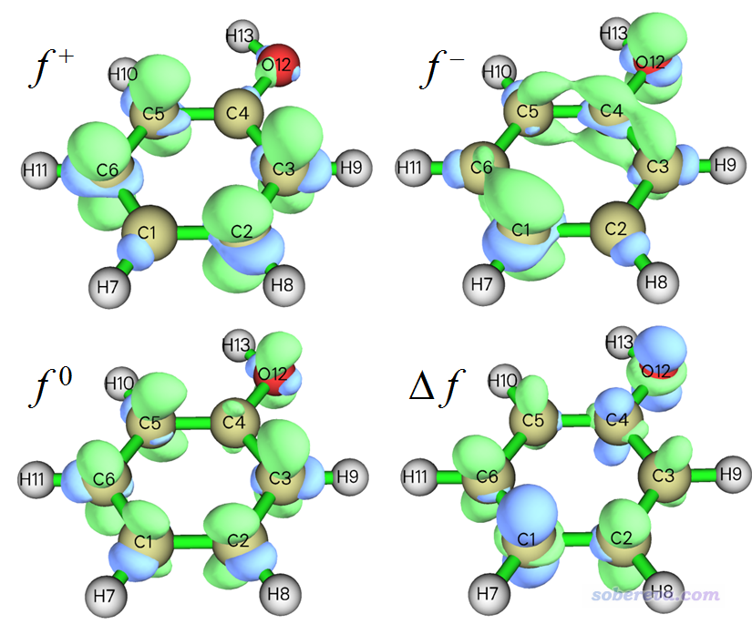
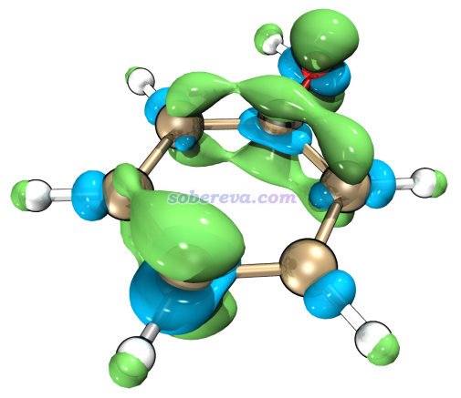

**注1**：轨道权重福井函数/双描述符特别适合前线轨道简并或近简并体系，也是使用本文提到的功能来计算，但本文没涉及，在另一篇博文里专门作了介绍《通过轨道权重福井函数和轨道权重双描述符预测亲核和亲电反应位点》（<http://sobereva.com/533>），非常建议看过本文后阅读。

**注2**：《使用Multiwfn计算键双描述符考察不同化学键的反应性》（<http://sobereva.com/766>）是对本文内容的重要额外补充，十分建议在阅读本文后观看！

**注**：本文对应2024-Apr-17及以后更新的Multiwfn及手册，不要用老版本！

**使用Multiwfn超级方便地计算出概念密度泛函理论中定义的各种量**

Using Multiwfn to easily calculate various quantities defined in the concept density functional theory

文/Sobereva@[北京科音](http://www.keinsci.com)

First release: 2019-May-21  Last update: 2024-Apr-17

## 1 前言

由Parr最初开始发展的概念密度泛函理论（conceptual density functional theory，CDFT）也称密度泛函反应性理论（DFRT），是量子化学和波函数分析领域中的一个重要组成，专门用来预测和解释化学物质的反应活性、反应位点等问题，对于研究化学反应有重要意义。相关介绍以及笔者写过的相关博文见《概念密度泛函综述和重要文献合集》（<http://bbs.keinsci.com/thread-384-1-1.html>）。在“**量子化学波函数分析与Multiwfn程序培训班**”（<http://www.keinsci.com/WFN>）里专门有一节由笔者十分全面讲授反应位点的预测与反应活性分析，对本文涉及的各种量做了非常详细具体的介绍并给了诸多应用例子，非常推荐感兴趣者参加。

CDFT框架里有大量概念，包含很多实空间函数、局部指数和全局指数，它们经常出现在各种文献里用来讨论反应问题。只要有N、N+1、N-1电子态的波函数和能量，就可以计算它们中的绝大部分。N指的是体系的电子数，比如某个分子最稳定状态是中性的，则N就是指中性时的电子数，N+1就是指带一个负电荷的阴离子状态的电子数，N-1就是指带一个正电荷的阳离子态的电子数。其实计算CDFT里的那些量并不复杂，手动算起来没什么难度，然而如果把所有量全都一一算出来，还是比较费事，而且容易弄错数据。另外，网上也经常有人问我怎么去算那些量，由于初学者的量子化学基础知识往往很薄弱，经常解释起来很费劲，甚至怎么说也说不明白。于是，笔者决定在Multiwfn里直接加入一个功能，通过极简单的步骤，就可以一次性把所有CDFT框架内常见的量全都算出来，过程完全傻瓜化。笔者相信这个功能有极高的实用性，经常要计算CDFT里涉及的量的读者务必要重视此功能。

这个功能是Multiwfn的主功能22。Multiwfn最新版可以在官网<http://sobereva.com/multiwfn>免费下载。相关入门知识看《Multiwfn入门tips》（<http://sobereva.com/167>）、《Multiwfn FAQ》（<http://sobereva.com/452>）。

使用本文介绍的Multiwfn的功能发表文章时，**除了要按照Multiwfn程序启动时的提示引用Multiwfn的原文外，也请同时引用下面的书籍章节**，其中专门介绍了Multiwfn程序中的概念密度泛函理论分析的功能和实现：  
Tian Lu, Qinxue Chen, Realization of Conceptual Density Functional Theory and Information-Theoretic Approach in Multiwfn Program. In Conceptual Density Functional Theory, WILEY-VCH GmbH: Weinheim (2022); pp 631-647. DOI: 10.1002/9783527829941.ch31  
链接: <https://pan.baidu.com/s/10SYF27bZBodM-fLXgs7bEQ?pwd=guv6>

## 2 能计算的量

这个功能能直接计算的量主要包含下面这些，分为三大类，具体定义在这里就不写了，因为在Multiwfn手册3.25节都已经明确给出了。也非常推荐大家阅读《Multiwfn支持的预测化学体系反应位点和反应活性方法一览》（<http://sobereva.com/767>），里面把Multiwfn能支持的预测反应位点的方法做了很全面的总结和简要介绍，包括概念密度泛函领域的那些。  
• 全局指数（即对整个体系而言的数值）  
垂直电离能（Vertical ionization potential，VIP）  
垂直电子亲和能（Vertical electron affinity，VEA）  
Mulliken电负性（Mulliken electronegativity）  
化学势（Chemical potential）  
电子的硬度（Hardness）  
电子的软度（Softness）  
亲电指数（Electrophilicity index）  
亲电指数ωcubic（在ω之后提出，形式更严格）  
亲电描述符ε（Electrophilic descriptor）  
亲核指数（Nucleophilicity index）  
• 实空间函数（即变量是三维空间坐标的函数）  
福井函数（Fukui function）  
双描述符（Dual descriptor）  
局部软度（Local softness）  
局部亲电指数（Local electrophilicity index）  
局部亲核指数（Local nucleophilicity index）  
• 原子指数（即每个原子各有一个数值）  
简缩福井函数（Condensed Fukui function）  
简缩双描述符（Condensed dual descriptor）  
简缩局部软度（Condensed local softness）  
简缩局部超软度（Condensed local hyper-softness）  
相对亲电指数（Relative electrophilicity index）  
相对亲核指数（Relative nucleophilicity index）  
简缩局部亲电指数（Condensed local electrophilicity index）  
简缩局部亲核指数（Condensed local nucleophilicity index）  
简缩局部ωcubic亲电指数

上述原子指数都可以写为基于原子电荷计算的形式。根据一些文章的测试，Hirshfeld电荷非常适合这种目的（不建议用NPA等其它电荷），所以Multiwfn自动计算它们都是用的Hirshfeld电荷，相关讨论见《TCA上的一篇对比不同原子电荷预测反应位点、亲电/亲核性的文章》（<http://bbs.keinsci.com/thread-15512-1-1.html>）。

除上述外，Multiwfn还可以计算在反应位点预测方面比双描述符更严格的双描述符势（dual descriptor potential），笔者专门有文章介绍：《使用Multiwfn计算双描述符势预测反应位点》（<http://sobereva.com/708>）。

## 3 实例：对苯酚计算CDFT定义的各种量

这个功能的用法和细节在手册3.25节都介绍了，本文就不再累述，下面直接看一个具体使用例子，对苯酚计算各种量。看完例子后建议再看一下手册这一节。

### 3.1 准备.wfn文件

用本文介绍的功能计算各种量之前需要先在当前目录下给出N.wfn、N+1.wfn和N-1.wfn，分别记录当前体系三个电子态的波函数信息。可以自行提供它们，做法见《详谈Multiwfn支持的输入文件类型、产生方法以及相互转换》（<http://sobereva.com/379>）；但如果你是Gaussian用户，按照下面的流程操作省事得多。

计算前述所有量要用的几何结构都是相同的，都是N电子态的极小点结构。对于苯酚这个例子而言，我们需要对苯酚中性状态进行几何优化，这一步是用户自己手动做的，用什么程序、什么级别无所谓，靠谱就行。普通有机体系用常用的B3LYP-D3(BJ)/6-31G*级别一般就够了，如果想更便宜一些，用半经验、GFN-xTB之类也可以。在B3LYP/6-31G*下优化中性苯酚得到的结构已经直接给了，是Multiwfn目录下的examples目录中的phenol.xyz。

启动Multiwfn，依次输入  
examples\phenol.xyz  //一开始载入的文件只要含有中性苯酚优化后的结构即可，其它格式如pdb/fch/gjf/mol/mol2等也都可以  
22  //计算CDFT里定义的各种量  
1  //产生波函数文件  
[直接按回车]  //这一步让你输入gjf文件里对应的计算单点任务的关键词。按回车代表用默认的B3LYP/6-31G*，此级别虽然很便宜，但对于考察CDFT定义的量来说一般基本已可以满足需要  
[直接按回车]  //这一步让你输入计算N、N+1和N-1态用的电荷和自旋多重度。按回车代表用对三个态分别用默认的0 1、-1 2和1 2

现在当前目录下已经有了N.gjf、N+1.gjf和N-1.gjf，是用于产生.wfn文件的单点任务的Gaussian输入文件。如果你不自己改gjf里的.wfn文件路径的话，把这些gjf都用Linux下的Gaussian执行后，N.wfn、N+1.wfn和N-1.wfn会产生在当前目录下，而如果用Windows下的Gaussian执行则会产生在临时文件目录下（比如D:\study\G16W\Scratch下）。如果你当前机子里已经装了Gaussian，而且之前Multiwfn的settings.ini里的gaupath已经被你设为了实际的Gaussian可执行文件路径，那么建议此时直接在Multiwfn窗口里输入y，这样Multiwfn就会自动调用Gaussian计算这个三个gjf文件，并在当前目录下产生相应的三个wfn文件，然后gjf和out文件会自动被删掉。显然，如果你当前的机子里没Gaussian，应当把gjf放到有Gaussian的机子上算，算完之后再把得到的.wfn文件拷回来。  
注：让Multiwfn顺利调用Windows版Gaussian需要做额外的设置，见Multiwfn手册Appendix 1。

计算这些gjf文件过程中，特别是计算N+1.gjf（通常对应阴离子）时，可能出现SCF不收敛问题，届时按照此文加上帮助SCF收敛的关键词即可：《解决SCF不收敛问题的方法》（<http://sobereva.com/61>）。

三个态的波函数文件也不是必须叫做N.wfn、N+1.wfn和N-1.wfn并处在当前目录下。用选项2或3开始计算时，若Multiwfn发现当前目录下缺少这些文件的一个或多个，程序就会让用户直接输入相应电子态的.wfn或.wfx或.fch或.mwfn文件的路径。因此，比如你想用自行算出来的N.fch、N+1.fch、N-1.fch做后面的计算也完全可以。

另外，如果你没有Gaussian而只有ORCA，也可以选择-2 Choose the quantum chemistry program used in option 1之后再选2。之后再选选项1产生输入文件时，Multiwfn产生的就是三个态的ORCA的输入文件N.inp、N+1.inp和N-1.inp，手动算完了之后就会在当前目录下产生N.wfn、N+1.wfn和N-1.wfn（其它产生的文件可删掉）。如果你把settings.ini里的orcapath设为了实际ORCA可执行文件路径，那么Multiwfn在产生输入文件后会问你是否自动调用ORCA去计算它们并在计算结束后删掉其它文件。

### 3.2 计算各种指数

现在当前目录下已经有了N.wfn、N+1.wfn和N-1.wfn，可以开始算了。在当前模块里选择2 Calculate various quantitative indices，然后程序就会依次载入wfn文件，读取其中的能量信息和波函数信息，自动计算Hirshfeld电荷，最后给出各种指数。对于6-31G*基组下的苯酚，在Intel 4核机子下不出10秒钟就都算完了。算完的数据被输出到了当前目录下的CDFT.txt中，此文件内容如下：  
 Note: the E(HOMO) of TCE used for evaluating nucleophilicity index is the value evaluated at B3LYP/6-31G* level  
   
 Hirshfeld charges, condensed Fukui functions and condensed dual descriptors  
 Units used below are "e" (elementary charge)  
     Atom     q(N)    q(N+1)   q(N-1)     f-       f+       f0      CDD  
     1(C )  -0.0587  -0.1185   0.0852   0.1439   0.0598   0.1018  -0.0841  
     2(C )  -0.0390  -0.1674   0.0268   0.0658   0.1284   0.0971   0.0626  
     3(C )  -0.0597  -0.1873   0.0319   0.0916   0.1276   0.1096   0.0360  
     4(C )   0.0737   0.0216   0.1739   0.1001   0.0522   0.0762  -0.0480  
     5(C )  -0.0731  -0.1956   0.0090   0.0821   0.1225   0.1023   0.0404  
     6(C )  -0.0415  -0.1730   0.0336   0.0751   0.1315   0.1033   0.0563  
     7(H )   0.0417  -0.0048   0.0993   0.0576   0.0464   0.0520  -0.0112  
     8(H )   0.0450  -0.0193   0.0904   0.0455   0.0642   0.0548   0.0187  
     9(H )   0.0473  -0.0160   0.0953   0.0480   0.0633   0.0557   0.0153  
    10(H )   0.0387  -0.0230   0.0854   0.0467   0.0617   0.0542   0.0150  
    11(H )   0.0444  -0.0207   0.0914   0.0470   0.0651   0.0561   0.0181  
    12(O )  -0.1977  -0.2443  -0.0517   0.1460   0.0465   0.0963  -0.0995  
    13(H )   0.1789   0.1482   0.2294   0.0505   0.0307   0.0406  -0.0197  
   
 Condensed local electrophilicity/nucleophilicity index (e*eV)  
     Atom              Electrophilicity          Nucleophilicity  
     1(C )                  0.02576                  0.45535  
     2(C )                  0.05533                  0.20827  
     3(C )                  0.05496                  0.28982  
     4(C )                  0.02249                  0.31688  
     5(C )                  0.05280                  0.25977  
     6(C )                  0.05665                  0.23773  
     7(H )                  0.02001                  0.18234  
     8(H )                  0.02767                  0.14394  
     9(H )                  0.02729                  0.15195  
    10(H )                  0.02659                  0.14779  
    11(H )                  0.02807                  0.14875  
    12(O )                  0.02005                  0.46203  
    13(H )                  0.01325                  0.15965  
   
 Condensed local softness (e/Hartree), relative electrophilicity/nucleophilicity (dimensionless) and condensed local hyper-softness (e/Hartree^2)  
     Atom         s-          s+          s0        s+/s-       s-/s+       s(2)  
     1(C )      0.3761      0.1562      0.2661      0.4154      2.4075     -0.5746  
     2(C )      0.1720      0.3355      0.2538      1.9501      0.5128      0.4271  
     3(C )      0.2392      0.3333      0.2863      1.3933      0.7177      0.2459  
     4(C )      0.2617      0.1363      0.1990      0.5210      1.9195     -0.3276  
     5(C )      0.2145      0.3202      0.2674      1.4927      0.6699      0.2762  
     6(C )      0.1964      0.3436      0.2700      1.7498      0.5715      0.3847  
     7(H )      0.1506      0.1213      0.1360      0.8058      1.2411     -0.0764  
     8(H )      0.1189      0.1678      0.1433      1.4116      0.7084      0.1279  
     9(H )      0.1255      0.1655      0.1455      1.3188      0.7583      0.1045  
    10(H )      0.1221      0.1612      0.1416      1.3210      0.7570      0.1024  
    11(H )      0.1228      0.1703      0.1465      1.3860      0.7215      0.1239  
    12(O )      0.3816      0.1216      0.2516      0.3186      3.1387     -0.6794  
    13(H )      0.1319      0.0804      0.1061      0.6095      1.6408     -0.1346  
   
 E(N):     -307.464860 Hartree  
 E(N+1):   -307.383614 Hartree  
 E(N-1):   -307.163438 Hartree  
 E_HOMO(N):     -0.218913 Hartree,   -5.9569 eV  
 E_HOMO(N+1):    0.161297 Hartree,    4.3891 eV  
 E_HOMO(N-1):   -0.464864 Hartree,  -12.6496 eV  
 Vertical IP:    0.301421 Hartree,    8.2021 eV  
 Vertical EA:   -0.081246 Hartree,   -2.2108 eV  
 Mulliken electronegativity:     0.110088 Hartree,    2.9956 eV  
 Chemical potential:            -0.110088 Hartree,   -2.9956 eV  
 Hardness (=fundamental gap):    0.382667 Hartree,   10.4129 eV  
 Softness:    2.613235 Hartree^-1,    0.0960 eV^-1  
 Electrophilicity index:    0.015835 Hartree,    0.4309 eV  
 Nucleophilicity index:     0.116285 Hartree,    3.1643 eV

上面的数据基本没有什么需要特别解释的，信息都非常易懂，也可以去对照手册3.25节的式子。唯一值得特别一提的是亲核指数（以及局部亲核指数），这个量是依赖于TCE（四氰基乙烯）的HOMO能量定义的，TCE的HOMO能量按理说是应当使用和当前计算级别完全一样的级别来计算的，这样得到的全局和局部亲核指数才是严格的，但Multiwfn在给出的时候是自动用笔者事先算好的B3LYP/6-31G*下的TCE的HOMO值-0.335198 Hartree算的。如果你当前用的不是B3LYP/6-31G*级别且追求更严格的结果，应当自行用当前级别去算TCE的HOMO值然后手动根据定义得到全局和局部亲核指数。

在Multiwfn手册里也有手动计算简缩福井函数和简缩双描述符的例子，见4.7.3节，用的也是Hirshfeld电荷和B3LYP/6-31G*级别，因此结果和上面自动算出来的完全一样。相比之下，用本文介绍的功能实在方便太多了，所有重要的量一口气全都输出了！

**关于ωcubic和亲电描述符（ε）的计算**

前面例子中输出信息里的亲电指数是Parr早年提出的形式（ω），也是目前用的最多的。后来在J. Phys. Chem. A, 124, 2090 (2020)又有人提出了新的而且更严格的形式，称为ωcubic。文中发现对于R-X...NH3型卤键二聚体（R为不同基团），卤原子上的简缩局部形式的ωcubic值与结合能有很不错的线性关系，R^2达到0.94，比ω的相关性明显更好，因此ωcubic很有实际意义，可以用于预测弱相互作用强度、解释弱相互作用内在特征。亲电描述符ε于Int. J. Quantum Chem., 124, e27366 (2024)中提出，文中通过35个有机分子测试发现它与Mayr亲电性参数的相关性远好于ω。

由于ωcubic和ε都涉及到比ω的更高阶项，即超硬度（hyperhardness），因此计算时还额外依赖于N-2态的能量，所以默认情况下Multiwfn不计算它们。如果想计算它们的话，对于本例应如下操作。载入输入文件后，依次输入  
22  //计算CDFT里定义的各种量  
-1  //要求计算ωcubic和ε  
1  //产生波函数文件  
[直接按回车]  //用默认的B3LYP/6-31G*  
[直接按回车]  //对N、N+1、N-1、N-2态用默认的电荷和自旋多重度（对于中性闭壳层分子这是适合的）  
此时当前目录下就有了N.gjf、N+1.gjf、N-1.gjf、N-2.gjf，你可以让Multiwfn直接调用Gaussian计算也可以自行计算。算完后就有了这四个态的.wfn文件。之后进入选项2，在输出的CDFT.txt中可见不仅我们之前看到的那些量都给出来了，还给出了体系整体的ωcubic、各个原子的简缩ωcubic，以及ε。与此同时，计算它们过程中用到的第二垂直电离能也会顺带输出出来。

### 3.3 计算福井函数和双描述符

接下来计算福井函数和双描述符。在当前模块里选择3 Calculate grid data of Fukui function, dual descriptor and related functions，然后选择一个合适的格点设定，对于当前这样小体系选择Medium quality grid就够了（大体系应当用High quality grid或其它选项，详见<http://sobereva.com/452>中的Q39的讨论），然后程序会依次载入当前目录下的N.wfn、N+1.wfn和N-1.wfn并计算电子密度格点数据，之后会看到一个菜单。通过选择相应选项，可以把各种类型的福井函数以及双描述符直接显示成等值面图。比如此例我们依次选择选项1、2、3、4来把f+、f-、f0福井函数和双描述符都依次绘制出来，下图是把图像手动合并到一起的图，等值面数值都是用的0.007：

通过主功能5手动计算福井函数和双描述符的方法在Multiwfn手册4.5.4节已经详细介绍了，得到的图像和上图完全一样。使用本文介绍的步骤，明显远比手动操作方便得多得多得多！

值得一提的是，如果你想要更好的显示质量，可以借助VMD。比如我们选择6 Export grid data of f- as f-.cub in current folder，然后把当前目录下产生的f-.cub按照《在VMD里将cube文件瞬间绘制成效果极佳的等值面图的方法》（<http://sobereva.com/483>）里介绍的方法载入VMD并通过Tachyon渲染器渲染，只需要很简单几步就可以得到下图，可见效果极好！

当前功能也可以对局部软度、局部亲电/亲核指数观看等值面和导出cube文件，因为它们的定义都是对特定类型的福井函数乘上一个数值，而Multiwfn当前功能里可以设乘上的系数。比如局部软度s-定义为全局软度乘以福井函数f-，我们根据前面算出的数据已知苯酚的局部软度是2.613235 Hartree^-1，因此若我们想导出局部软度cube文件，就选-1 Set the scale factor to various grid data，输入2.613235，之后选6 Export grid data of scaled f- as f-.cub in current folder导出的cube文件就对应于s-的格点数据了，若选2 Visualize isosurface of scaled f-则看到的是s-的等值面。

另外，在J. Math. Chem., 62, 461 (2024)中还介绍了超软度的概念，对应于双描述符乘上全局软度的平方，使得双描述符有尺寸一致性。显然在当前界面里把要乘的数值设为全局软度的平方，再选8 Export grid data of scaled dual descriptor as DD.cub in current folder，产生的cube文件就对应于超软度了。

## 4 总结&其它

本文介绍了Multiwfn的超级便利的一口气算出来概念密度泛函理论里涉及到的各种量的功能，这使得初学者也可以非常顺利、快速且不犯错误地计算这些量。相信此功能对于将概念密度泛函理论广泛地应用于实际化学问题的研究有积极的促进作用，也鼓励大家在日常研究中充分使用此功能，以从繁复的手动操作中解脱出来。

经常有用户问本文介绍的方法是否只能用于闭壳层中性体系、用于其它体系时怎么对N、N+1和N-1状态在Multiwfn里输入净电荷和自旋多重度。在这里我就再次着重强调一下：显然本文的方法可以用于非中性、非闭壳层体系。例如，若当前体系是个中性自由基（并假定是普通有机类体系，没什么复杂的情况），N状态的净电荷和自旋多重度是0 2，N+1时是-1 1，N-1时是1 1。原因很容易理解：N+1和N-1的时候分别比N状态多一个和少一个电子，净电荷自然分别是N状态的减1和加1。N状态原本有一个未配对电子，多一个电子时必然令其配对，少一个电子时它必然丢失，体系自然就成了闭壳层状态，故N+1和N-1时的自旋多重度为1。注意这里假设N+1和N-1状态时不涉及到分子轨道简并因而变成高自旋的可能，一般有机体系都如此，而碰上过渡金属配合物体系时，拿不准的话应当对N+1和N-1态分别计算最低几种可能的自旋态的能量看哪种最低以判断它们应当是什么自旋多重度。

类似地，对于普通有机类体系，其它几种情况的净电荷和自旋多重度为：  
• 若当前体系是个+1电荷的阳离子自由基，N状态是1 2，N+1状态是0 1，N-1状态是2 1。  
• 若当前体系是个-1电荷的阴离子自由基，N状态是-1 2，N+1状态是-2 1，N-1状态是0 1。  
• 若当前体系是个+1电荷的闭壳层阳离子，N状态是1 1，N+1状态是0 2，N-1状态是2 2。  
• 若当前体系是个-1电荷的闭壳层阴离子，N状态是-1 1，N+1状态是-2 2，N-1状态是0 2。

还值得一提的是，Multiwfn亦能够计算亲核和亲电超离域度（superdelocalizabilities），类似于能量权重的基于轨道计算的福井函数。这个量最早由Schüürmann在Environ. Toxicof. Chem., 9, 417 (1990)和Quant. Struct.-Act. Relat., 9, 326 (1990)中提出，被广泛用于构建QSAR方程。但原文的计算形式只适合基于半经验方法进行计算，而Multiwfn使用的计算形式是笔者对之进行广义化后的，也能够用于HF和DFT波函数。具体细节见Multiwfn手册3.25.5节，用户只需要提供分子原本状态的fch、molden、mwfn之类含有基函数信息的文件，进入主功能22后选择选项8即可得到各个原子的超离域度。
