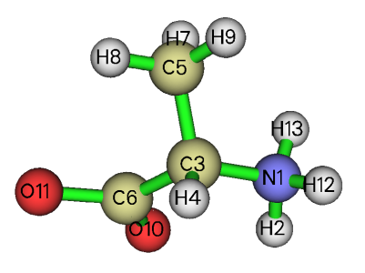
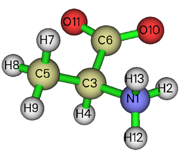
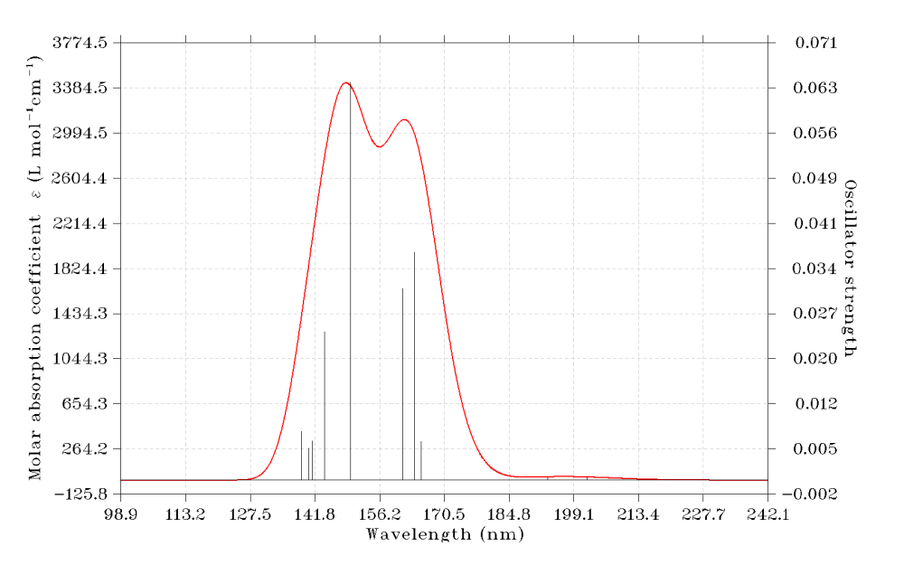
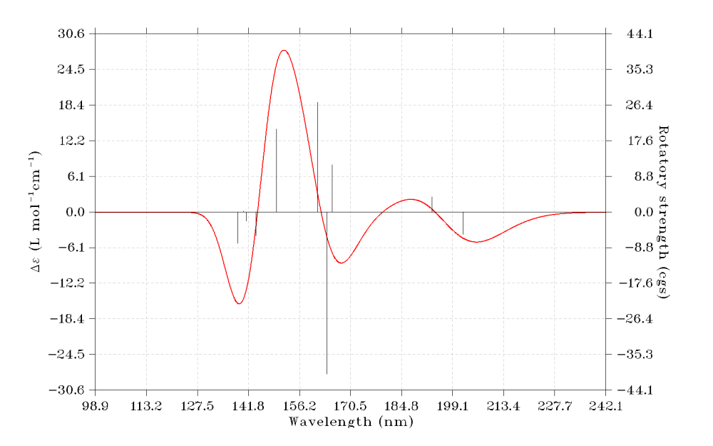

注：本教程只是皮毛程度，而且对应的是老版本的。想一次性完整系统学习ORCA并达到精通的话，切勿错过**北京科音高级量子化学培训班**（<http://www.keinsci.com/KAQC>），里面对ORCA程序和各种相关理论背景知识有极其全面、深入、系统的讲解！

**Simulating UV-Vis and ECD spectra using ORCA and Multiwfn**

Written by Tian Lu ([sobereva@sina.com](mailto:sobereva@sina.com)), 2019-May-20

 Beijing Kein Research Center for Natural Sciences (<http://www.keinsci.com>)

## 1 Introduction

In this tutorial, I will show how to very easily using ORCA and Multiwfn to simulate UV-Vis and electronic circular dichroism (ECD) spectra for a typical organic system alanine in water environment. The ORCA is a free quantum chemistry program, it can be downloaded via <https://orcaforum.kofo.mpg.de/app.php/portal>. Although Multiwfn is a code aiming for wavefunction analysis, it also has a powerful module used to plot various kinds of spectra based on output file of Gaussian, ORCA, xtb, sTDA or plain text file. Multiwfn can be freely obtained at <http://sobereva.com/multiwfn>. All the ORCA and Multiwfn supports Windows, Linux and MacOS platforms.

In this tutorial, I assume that you are using Windows platform. The version of ORCA is 4.1.1, the version of Multiwfn is 3.7(dev) updated on 2019-Jul-14 (do not use older version). The overall computational cost should be less than 10 minutes for an ordinary Intel quad-core CPU.

All files involved in this tutorial can be downloaded at <http://sobereva.com/attach/485/file.rar>.

## 2 Optimization of ground state

Both UV-Vis and ECD are absorption spectra, commonly it is assume when a molecule undergo electronic excitation, the geometry is at minimum point of potential energy surface of ground state. Therefore, the ground state geometry should be optimized first. Since the conformational space of alanine is not complicated, construction of the alanine structure is relatively arbitrary. It is important to note that under water environment the alanine is a zwitterion. The initial geometry (initgeom.xyz) I built is shown below:

Now we generate input file of optimization task of ORCA. The easiest way in my opinion is using Multiwfn to do this. Double click icon of Multiwfn.exe to boot up Multiwfn, then input below commands. The texts behind // are comment.  
initgeom.xyz   //Other formats are also supported, e.g. mol, mol2, pdb, gjf, fch, molden...  
100  //Other functions (Part 1)  
 2   //Exporting files or generating input file of mainstream quantum chemistry codes  
 12  //Generate ORCA input file  
 S0_opt.inp  //The path of the input file to be generated  
 -1   //Enable using SMD solvation model  
 [Press ENTER button to use default solvent (water)]  
 0  //Select type of task  
 2  //Optimization  
 1  //B97-3c. This is an economical level but able to provide satisfactory geometry

Now S0_opt.inp has been generated in current folder. Open it by text editor, change the value behind "nprocs" to the actual number of physical CPU cores of your machine, also properly set the value behind "maxcore", which controls the maximal amount of memory can be utilized per CPU core (in MB).

Move the S0_opt.inp to an empty folder, open console window of your system and enter this folder, then input command such as D:\study\orca411\orca S0_opt.inp > S0_opt.out to conduct the calculation, where D:\study\orca411\orca is the absolute path of ORCA executable file in my machine.

After calculation, from the output file S0_opt.out you can find the optimization converged after 11 steps without any error. The S0_opt.xyz in current folder is the optimized geometry, while S0_opt.trj contains every structure of optimization trajectory (If you want to visualize the trajectory, you can manually change the suffix to .xyz, and then drag this file into VMD, which is an excellent visualization program and can be freely obtained via <http://www.ks.uiuc.edu/Research/vmd/>).

Use Multiwfn to load the S0_opt.xyz, and then enter main function 0 to visualize the geometry, it can be seen that the optimized geometry fully meets our expectation, as shown below

## 3 Calculation of excited states

Next, we perform excited state calculation using the popular TDDFT method. According to many benchmark articles, for TDDFT calculation of such a small molecule, PBE0 functional is very suitable (however, for large conjugated systems such as most organic dyes, in particular the states with strong charge-transfer character, CAM-B3LYP and wB97XD often work much better)

Return to main menu of Multiwfn, then input  
100  //Other functions (Part 1)  
 2   //Exporting files or generating input file of quantum chemistry codes  
 12  //Generate ORCA input file  
 TDDFT.inp  //The path of the input file to be generated  
 -1   //Enable using SMD solvation model  
 [Press ENTER button to use default solvent (water)]  
 22  //TDDFT task at PBE0/def2-SV(P) level with RI acceleration technique

The TDDFT.inp has been generated in current folder, do not forget to properly change the "nprocs" and "maxcore" parameters. Note that in this file the "nroots" is set to 10, namely ten lowest excited states will be calculate. For plotting absorption spectra purpose of small systems like alanine, this setting is adequate, however, if your system consists of much more atoms, "nroots" should also be accordingly increased, otherwise the finally simulated spectra cannot fully cover wavelength range of common interest (e.g. >250nm). In addition, since this system is fairly small, in order to reach higher accuracy, we can use basis set better than the def2-SV(P), therefore we replace the "def2-SV(P)" keyword with "def2-TZVP(-f)", which is a good basis set with size similar to 6-311(2d,p).

Run command like this: D:\study\orca411\orca TDDFT.inp > TDDFT.out

## 4 Simulating UV-Vis spectrum

From the TDDFT output file, you can find excitation energies and oscillator strengths under "ABSORPTION SPECTRUM VIA TRANSITION ELECTRIC DIPOLE MOMENTS". Based on these data, Multiwfn is able to plot theoretical UV-Vis spectrum. Now we do this.

Boot up Multiwfn and input  
TDDFT.out  
 11  //Plot spectrum  
 3  //UV-Vis  
 0  //Show the spectrum on the screen

Now you can see below UV-Vis graph

You can use abundant options in the interface to gradually adjust plotting parameters and then replot the graph until you are satisfied. Please check Section 3.13 of Multiwfn manual on the detailed introduction of the spectrum plotting module and related theoretical background. Section 4.11 provided examples of plotting other kind of spectra.

NOTE: If Multiwfn crashes before entering the plotting interface, it is possible that your ORCA output file is in Unicode encoding, while Multiwfn only supports parsing text file in ASCII encoding. Please check #6 in this post on how to solve this problem: <http://sobereva.com/wfnbbs/viewtopic.php?id=213>.

## 5 Simulating ECD spectrum

Multiwfn is also able to simulate ECD spectrum based on excitation energies and rotatory strengths in the ORCA TDDFT output file. Now we do this.

Input below commands in the Multiwfn window:  
-3  //Return to main menu  
 11  //Plot spectrum  
 4  //ECD  
 0  //Show the spectrum on the screen

Now you can see below ECD graph

## 6 Some worth noting points

There are several points I want to mention.

For most neutral system, geometry optimization can be carried out without solvation model to decrease time cost. However, for systems whose local region shows evident ionic character, such as the alanine in water environment, the solvation model should also be applied in optimization stage. For calculation of excited states, solvation model should always be employed to mimic real environment because its impact on electronic excitation is large, in particular for polar solvents.

ECD spectrum is very sensitive to conformation. The alanine under our present study does not have more than one accessible conformation, therefore we can safely use single structure to simulate the spectra. However, if there may be multiple thermally accessible conformations under present condition (this is usually true for flexible molecules containing rotable bonds at room temperature), commonly you should optimize structure and calculate free energy for each one, then use Boltzmann relationship to estimate occurrence percentage, then perform electron excitation calculation for all conformations having probability higher than e.g. 5%, and finally use Multiwfn to plot conformationally averaged ECD spectrum, as illustrated in Section 4.11.4 of Multiwfn manual.

BTW 1: To obtain all possible conformations of a highly flexible molecule, commonly you need to use conformational search software, there are many choice. Among which, one of best choice is the Molclus code developed by me, it is free and very flexible, the official site is <http://www.keinsci.com/research/molclus.html> (English version of manual will be available later).

BTW 2: To characterize and understand nature of electron excitations, Multiwfn provide numerous functions, see Section 4.A.12 of the manual for an overview.

BTW 3: There is a video tutorial illustrating how to use ORCA quantum chemistry program in combination with Multiwfn, OfakeG and GaussView to realize very common calculation tasks and analyses for a simple organic molecule methanol, taking a look at it is suggested: <https://youtu.be/tiTmTbtbtig>.
