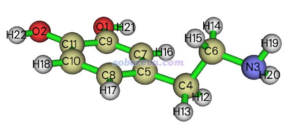
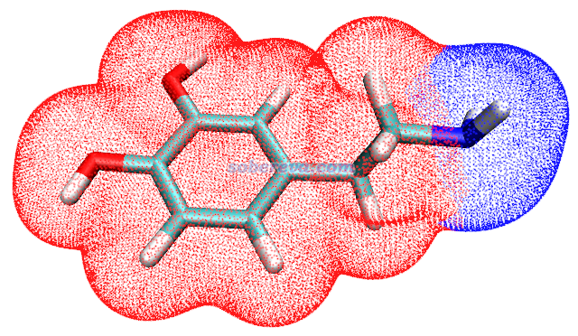

**使用Multiwfn和VMD计算分子表面积和片段表面积**

Using Multiwfn and VMD to calculate molecular surface area and fragment surface area

文/Sobereva@[北京科音](http://www.keinsci.com)  2019-May-27

时常有人问怎么计算分子表面积、怎么计算基团的表面积，其实这用Multiwfn或VMD来做非常简单，这里就结合例子简单说一下。

## 1 关于分子表面的定义

首先要清楚定义表面积的方式非常多，在《谈谈分子体积的计算》（<http://sobereva.com/102>）一文中就已经提到了好几个。其中有一个叫做SASA（溶剂可及表面积），这个面积定义依赖于溶剂探针半径，通过VMD等程序可以快速计算。

范德华表面是分子表面的一种，但也有不同具体定义。一种广为接受的以量子化学方式的定义是Bader在JACS, 109, 7968 (1987)中提出的，也就是对于气相情况，将电子密度为0.001 a.u.（1 a.u.=e/Bohr^3）的等值面作为范德华表面。这种方式定义的范德华表面平滑，并且可以反映电子结构特征（如孤对电子、pi电子等），其范围比通过范德华球叠加得到的范德华表面略大一些。对于凝聚相环境，考虑到分子间相互作用导致范德华表面穿透，分子体积会减小，故此时建议用电子密度0.002 a.u.的等值面作为范德华表面。计算以电子密度等值面方式定义的分子表面可以用Multiwfn程序非常简单快速地实现。

下面，笔者以多巴胺分子为例演示计算的方式。此体系结构如下，我们既打算计算其整体表面积，也想计算其氨基部分的表面积。

Multiwfn程序可以在官网<http://sobereva.com/multiwfn>免费下载，不熟悉者强烈建议参看《Multiwfn入门tips》（<http://sobereva.com/167>）和《Multiwfn FAQ》（<http://sobereva.com/452>）。本文使用的是Multiwfn 3.6版。VMD是一个绝佳的化学体系可视化程序，可以在<http://www.ks.uiuc.edu/Research/vmd/>免费下载，本文使用的是1.9.3。

本文用到的所有文件可以在此下载：<http://sobereva.com/attach/487/file.rar>。

## 2 通过Multiwfn计算范德华表面积

### 2.1 基于量子化学方式产生的密度计算范德华表面积

要基于电子密度计算范德华表面积，自然得先获得电子密度，一般通过做量子化学计算来实现。使用B3LYP/6-31G*这种比较便宜的计算级别，对于当前目的就已经够用了。Multiwfn支持大量量子化学程序产生的含有波函数信息的文件来做当前的分析，见《详谈Multiwfn支持的输入文件类型、产生方法以及相互转换》（<http://sobereva.com/379>）。这里我们使用常用的Gaussian来产生.wfn文件。

本文文件包里的dopamine.xyz是之前恰当优化后得到的多巴胺结构。将之载入Multiwfn，然后依次输入  
100  //其它功能（Part 1）  
2  //转换文件格式、产生量化程序输入文件  
10  //产生Gaussian输入文件  
dopamine.gjf  //输出的文件名

现在当前目录下就有了dopamine.gjf，对应B3LYP/6-31G*计算级别。将out=wfn关键词加进去，末尾空一行写上.wfn文件的输出路径，比如C:\dopamine.wfn。然后用Gaussian计算之，得到的.wfn文件已经提供在了本文的文件包里。

Multiwfn的定量分子表面分析功能是专门考察各种函数在分子表面上分布特征的，在<http://sobereva.com/159>和<http://sobereva.com/196>文中都有介绍。我们目前的目的不是分析函数在分子表面上的分布特征，而是仅仅要获得表面积，因此我们下面将把映射到分子表面上的函数切换为一个没有任何耗时的函数来节约不必要的计算时间。

启动Multiwfn，载入dopamine.wfn，然后依次输入  
12  //定量分子表面分析  
2   //选择被映射到分子表面的函数  
-1  //用户自定义函数。默认设置下，这个函数值处处为1，所以不会有额外计算耗时  
Multiwfn的这个功能默认分析的是电子密度为0.001 a.u.的等值面。假设此处我们想改成0.002等值面来对应凝聚相情况下范德华表面的定义，我们就输入  
1   //选择用于定义表面的函数  
1   //用电子密度等值面定义表面  
0.002  //等值面数值（isovalue）  
然后选0开始分析。Multiwfn转眼就分析完了。其它输出不用管，就看下面这一行输出  
Overall surface area:         648.82739 Bohr^2  ( 181.69020 Angstrom^2)  
即整个多巴胺用0.002 a.u.电子密度等值面定义的范德华表面的面积为181.7 Angstrom^2。

### 2.2 计算片段对应的范德华表面积

接着上一节，这里我们来算一下分子表面上对应氨基区域的局部表面积，这要利用Multiwfn的局部分子表面分析功能。在后处理菜单中依次输入  
12  //输出某个片段的属性  
3,19,20  //氨基的原子序号  
从屏幕上可见下面的输出  
Overall surface area:          99.58145 Bohr^2  (  27.88565 Angstrom^2)  
即曰这个电子密度为0.002 a.u.的等值面上由氨基贡献的部分为27.9 Angstrom^2，占总面积比例为27.9/181.7=15.3%。

此时程序还问你是否导出locsurf.pdb。如果我们想图形化观察分子表面上对应氨基的区域，我们就选择y来导出它。然后启动VMD，将这个文件拖到VMD main窗口载入，然后选Graphics - Representation，把Drawing Method设为Points，把Coloring Method设为Beta。然后再把dopamine.xyz也载入进VMD来把分子结构显示出来，把Drawing Method设为Licorice，背景改为白色，当前看到的图像如下所示

图中每个小点对应电子密度等值面上的一个顶点，蓝色的区域对应氨基。由此图可见，Multiwfn给出的对应氨基的局部表面定义得很合理，因此上面给出的氨基的面积是可靠的。

### 2.3 基于准分子密度计算范德华表面积

如果你没Gaussian的版权，也不会用任何免费的量子化学程序，也照样可以用Multiwfn来计算分子和片段的表面积，只要提供一个含有合理的分子结构的文件即可（可以用比如xyz、mol、mol2、pdb等）。此时电子密度就不是直接基于波函数算出来的了，而用的是promolecular density（准分子密度），它是将每个原子在孤立状态下的电子密度按照分子中原子的坐标简单叠加来产生的，整个周期表几乎所有元素在孤立状态下的高精度电子密度在Multiwfn里直接内置了。这种方式产生的分子的电子密度显然比较糙，因为没考虑原子间相互作用导致的电子的转移、极化。但如果你要求不高，有个定性结果就够，那还是完全可以接受的。

启动Multiwfn，载入dopamine.xyz，然后依次输入  
12  //定量分子表面分析  
1   //选择用于定义表面的函数  
2   //用一个特殊函数的等值面定义表面  
1   //准分子密度  
0.002  //等值面数值  
0   //开始分析  
值得一提的是当前被映射到表面的函数默认被切换为了user-defined function，默认设置下这个函数是个常数，计算它没有任何额外的耗时。当前面积计算结果为  
Overall surface area:         697.18104 Bohr^2  ( 195.23060 Angstrom^2)  
这里给出的结果195.2 Angstrom^2和之前基于B3LYP/6-31G*密度给出的181.7 Angstrom^2定性一致。

和2.2节一样，我们用相同的步骤再计算一下氨基对应的表面积，输出为  
Overall surface area:         112.37312 Bohr^2  (  31.46768 Angstrom^2)  
此处31.5和之前给出的27.9也差不太多，占总面积的比例31.5/195.2=16.1%和之前算的15.3%也相仿佛。这说明，基于直接通过几何结构构建的准分子密度来考察表面积是完全靠谱的。如果这次也通过locsurf.pdb去看一下分子表面顶点和划分情况，会发现从肉眼上看不出图像与上一节的图有什么差别。

值得一提的是，如果你考察的是很大体系，如果做上述分析发现太耗时（无论是基于量化计算的密度还是准分子密度），可以在主功能12的界面里选择3 Spacing of grid points for generating molecular surface，然后输入一个比默认更大的格点间距，比如0.4。间距越大，表面顶点就越稀疏，得到的表面积数值精度就越差，但分析耗时也越低。

## 3 通过VMD计算SASA面积

启动VMD，载入dopamine.xyz，然后在命令行窗口输入下面这一行，就可以计算整体的SASA  
measure sasa 1.4 [atomselect top all]  
返回的结果为343.08，单位是Angstrom^2。上面的命令中1.4代表探针半径，探针半径越小，得到的SASA也会越小。1.4对应于水分子的探针半径。

将下面的语句复制到VMD命令行窗口里运行，就可以计算氨基部分暴露在SAS（溶剂可及表面）上的面积，即氨基对整体的SASA的贡献  
measure sasa 1.4 [atomselect top all] -restrict [atomselect top "serial 3 19 20"]  
返回的结果为59.80 Angstrom^2，占总SASA比例为59.80/343.08=17.4%，比例值和前面我们基于电子密度范德华表面的方式算的比较接近。
