**考察分子磁感生电流的程序GIMIC 2.0的使用**

Use of GIMIC 2.0 program to investigate magnetically induced currents of molecules

文/Sobereva@[北京科音](http://www.keinsci.com)

First release: 2019-Jun-22  Last update: 2020-Sep-18

## 1 前言

GIMIC的主要用途是基于量子化学程序的输出信息来计算分子的磁感生电流，这对于考察芳香性尤为重要，见《衡量芳香性的方法以及在Multiwfn中的计算》（<http://sobereva.com/176>）中的相关介绍。GIMIC可以给出电流矢量、电流矢量的模，还可以对穿越特定截面的电流密度进行积分来定量考察电流的强度。

之前笔者在《使用GIMIC计算和分析磁感应电流密度》（<http://sobereva.com/155>）中已经非常详细地介绍了如何使用GIMIC考察磁感生电流密度，对相关原理也予以了说明。那篇文章里介绍的GIMIC是老版本，一个关键缺点是没法结合最主流的量子化学程序Gaussian来使用。如今GIMIC已经有了2.0版本，已可以结合Gaussian使用了，用法也有很大变化。本文的目的就是介绍一下怎么将GIMIC 2.0和Gaussian结合做磁感生电流密度的分析。凡是前面那篇文章里已经讲过的内容本文就不再怎么提了，所以读完本文后别忘了把前面那篇文章也看一看。

GIMIC 2.0程序的在线手册是<https://gimic.readthedocs.io>，里面有用法说明。但写得很混乱，好多地方语焉不详令人糊涂，有不少地方还是错的。读者读过本文后基本就没必要看那个手册了。

笔者将此文的方法应用于了电子结构十分新颖的18碳环体系，得到了很有意义的结果，见此文介绍的笔者的ChemRxiv上的论文：《一篇最全面、系统的研究新颖独特的18碳环的理论文章》（<http://sobereva.com/524>），后来相关部分的研究笔者发表在了Carbon, 165, 468 (2020)中。此论文是本文介绍的方法的很好的应用实例。论文的补充材料中还给出了18碳环在外磁场下环电流的动态动画，效果十分非常酷炫，强烈建议一看。此外，在《18碳环等电子体B6N6C6独特的芳香性：揭示碳原子桥联硼-氮对电子离域的关键影响》（<http://sobereva.com/696>）介绍的笔者的Inorg. Chem., 62, 19986 (2023)文章中利用了GIMIC动画展现了18碳环等电子体B6N6C6和B9N9的芳香性的巨大差异。**这些文章都十分建议仔细阅读，并推荐引用作为GIMIC使用和分析讨论的范例**。

## 2 GIMIC 2.0的获取和安装

去GIMIC 2.0的官网<https://github.com/qmcurrents/gimic>，点击Clone or download按钮，点击Download ZIP，即可把源代码包下载下来。笔者在2019年6月18日下载的程序包可以在这里下：<http://sobereva.com/attach/491/gimic_2019-Jun-18.zip>，本文所述都是对这个版本而言。

笔者使用的是CentOS 7.6系统，root账户，安装过程与《在VMware 15中安装CentOS 7.6的完整过程视频演示》（<http://sobereva.com/454>）里演示的一致。如果你的情况和本文的不同，本文的做法可能无法安装成功，请根据提示随机应变。

在系统里依次运行以下命令，安装EPEL源，并且装上cmake和conda。GIMIC 2.0是用Fortran和Python混合写的，所以需要安装conda来管理Python的包。  
yum install epel-release  
yum install cmake  
yum install conda

然后运行下面的命令创建一个名为myconda的环境，并且初始化conda  
conda create --name myconda  
conda init bash  
在~/.bashrc文件的末尾加入一行conda activate myconda使得每次进入终端后自动激活myconda环境。

退出终端，然后重新进入终端，输入以下命令安装GIMIC 2.0运行时依赖的一些Python库  
conda install cython numpy pyparsing

将GIMIC压缩包解压，比如笔者解压到了/sob/gimic下面，进入此目录后运行  
./setup --omp  
cd build  
make install

编译完成后，在~/.bashrc里末尾加入  
export PATH=$PATH:/sob/gimic/build/bin

之后重新进入终端，程序就可以用了。

注：在上面的步骤中运行了conda init bash之后，会自动在~/.bashrc里添加一串内容，从# >>> conda initialize >>>开始到# <<< conda initialize <<<结束，这可能导致进入终端后命令提示符需要按一下回车之后才能显示出来。只要把这段内容从.bashrc里删掉就没这个问题了，不影响gimic的正常运行。

## 3 使用方法

运行以下命令即可启动GIMIC 2.0并读取test.inp输入文件里的设置进行运算，信息输出到gimic.out里也同时显示在屏幕上。  
gimic test.inp |tee gimic.out  
如果当前目录下有名为gimic.inp的文件，直接输入gimic就可以计算，程序会将它当做默认的输入文件。

输入文件里要指定XDENS和MOL文件的路径，前者包含分子坐标和基组信息，后者包含密度矩阵和密度矩阵对磁场的导数。对于不同的量子化学程序，XDENS和MOL文件有不同的得到方法。下面是对于Gaussian的用法（笔者只测试了Gaussian09的情况）。

运行以下任务  
%chk=test.chk  
# B3LYP/6-311G* Int=NoBasisTransform IOp(10/33=2) NMR  
[空行]  
test  
[空行]  
0 1  
[坐标...]

然后将chk转换为fchk，把gimic\tools\g092gimic目录里的BasisSet.py和Gaussian2gimic.py拷到当前目录下，之后运行./Gaussian2gimic.py --input=test.fchk，当前目录下就出现了XDENS和MOL。

如果是开壳层体系，关键词应当用gfprint pop=full Int=NoBasisTransform IOp(10/33=2) NMR，令输出文件后缀设为log，然后用Gaussian2gimic.py --input=test.log。

注意Gaussian计算时会自动把结构摆到标准朝向下，可能导致最终分子不是处于你预期的朝向。加上nosymm关键词即可避免这点，详见《谈谈Gaussian中的对称性与nosymm关键词的使用》（<http://sobereva.com/297>）。

## 4 关于ParaView

如果你想把GIMIC 2.0得到的感生电流图绘制出来，一般需要用ParaView可视化程序。这是一个非常强大、知名的体数据可视化程序。此程序可以在<https://www.paraview.org/download/>免费下载。笔者使用的是Windows 5.6.1版，大家就下载比如ParaView-5.6.1-Windows-msvc2015-64bit.exe就行了。

安装之后需要设置一下。启动ParaView，进入Edit - Setting，点击右上角齿轮图标，然后选上Auto Apply和Enable Auto MPI，Auto MPILimit设成实际物理核数。然后在Camera标签页里把Camera 2D Manipulators和Camera 3D Manipulators下面把左键、中键、右键分别设为Rotate、Pan、Roll，这样视角操作就常用的GaussView一样了，笔者感觉比较顺手（在ParaView界面里，可以在图形窗口上方点击3D/2D按钮来在透视视图和正交视图间切换）。

在主菜单的Tools - Manage Plugins里分别展开SurfaceLIC、StreamLinesRepresentation、StreamingParticles条目，将其中的Auto Load开启。重启ParaView后这些显示方式将能够使用。

## 5 实例：图形化考察苯分子的磁感生电流

本节和下一节涉及的文件都可以在此处下载：[**http://sobereva.com/attach/491/file.rar**](http://sobereva.com/attach/491/file.rar)。

文件包里有benzene.gjf，使用Gaussian计算之，用formchk将chk转换为fchk，再用./Gaussian2gimic.py --input=benzene.fchk命令处理，就得到了文件包中的MOL和XDENS。

### 5.0 产生ParaView绘图需要的文件

在用ParaView绘图之前，首先需要产生vti文件，里面可以记录标量场和向量场，可以被ParaView直接可视化。

写一个GIMIC的输入文件gimic.inp，内容如下。此文件在本文的文件包里的3D子目录下可以找到。//后面是笔者写的说明。文件里面#后头的内容都是注释，会被程序忽略

calc=cdens      //任务类型。cdens代表产生格点数据，integral代表计算截面积分值  
 basis="../MOL"  //MOL文件的路径。../代表上一级目录  
 xdens="../XDENS"  //XDENS文件的路径  
 openshell=false  //如果是开壳层体系，需要设成true  
 magnet=[0,0,1]  //外磁场的方向，这里要求外磁场方向是Z轴正方向。当前体系里的苯环是在XY平面上

Grid(base) {  
     type=even  //格点是均匀分布的  
     origin=[-8.0, -8.0, -8.0]   //格子原点  
     ivec=[1.0, 0.0, 0.0]   //格子有ijk三个方向，这里定义i方向矢量  
     jvec=[ 0.0, 1.0, 0.0]     //定义j定义方向矢量。k的方向无需定义，程序自动将i与j做叉乘得到  
     lengths=[16.0, 16.0, 16.0]   //i,j,k三个方向的长度，单位是Bohr  
 #   spacing=[0.5, 0.5, 0.5]     //i,j,k三个方向的格点间距，单位是Bohr  
     grid_points=[50, 50, 50]     //i,j,k三个方向的格点数。spacing和grid_points二者只能定义一个，因为是彼此矛盾的，所以此例把spacing注释掉了  
 }

Advanced {  
     spherical=off  //这个别管它，但必须写，否则结果异常  
     diamag=on      //on代表考虑diamagnetic部分的贡献  
     paramag=on     //on代表考虑paramagnetic部分的贡献  
 }

Essential {  
     acid=on  //on代表输出acid.vti文件  
     jmod=on  //on代表输出jmod.vti文件  
 }

将MOL和XDENS文件放在上一级目录下，把gimic.inp放在当前目录下，然后直接运行gimic命令就开始进行运算，很快就能算完。显然，grid_points越大，或者spacing越小，计算耗时越高，但图像也越精细。

算完后当前目录下出现了以下文件，在本文文件包里3D目录下也可以看到。  
• mol.xyz：分子结构文件。不懂xyz格式的话看《谈谈记录化学体系结构的xyz文件》（<http://sobereva.com/477>）  
• grid.xyz：也是分子结构文件，但是末尾还多了8个X原子，对应盒子的8个顶点。末尾还有一个Be原子，无意义，可删掉  
• acid.vti：ACID函数的格点数据。关于这个函数的介绍看《使用AICD程序研究电子离域性和磁感应电流密度》（<http://sobereva.com/147>），它本质上反映的是相应位置电子对磁场感应的各向同性强度  
• jmod.vti：电流矢量的模的格点数据（标量场），体现各个位置电流的大小  
• jvec.vti：电流矢量的格点数据（矢量场）

为了能让ParaView正确地显示出分子结构，绘图之前还需要产生分子的cml格式的文件。先在机子里安装OpenBabel程序，运行yum install openbabel即可。然后将本文文件包里的xyz2cml.sh拷到当前目录，运行./xyz2cml.sh，此脚本就调用OpenBabel把mol.xyz转换成了mol.cml，然后再自动用awk工具把此文件里坐标单位从埃转换成Bohr并输出为mol-bohr.cml。由于vti文件是用原子单位记录的，所以ParaView载入的也必须是以Bohr记录坐标的cml文件。

现在相关文件都已经准备好了，可以绘制各种图了。下面笔者依次介绍各种常见类型的图怎么绘制。由于操作步骤很多，所以过程笔者都录成了视频而不以文字和图片去介绍了。绘制各种图的演示视频见：[**https://www.bilibili.com/video/av56441881**](https://www.bilibili.com/video/av56441881)（全长23分半！）。

值得一提的是在ParaView里选项很多，往往需要做很多操作才能得到期望的图像，设好之后建议用File - Save State将当前的状态保存为pvsm文件，这样以后随时可以用Load State载入它来恢复之前的作图状态。

### 5.1 绘制感生电流的模的等值面

基于jmod.vti，效仿本文的视频第1部分即可绘制出来，效果如下。分子外围蓝色部分是diatropic（满足左手定则的）电流的模的等值面，等值面数值为0.05；内部红色部分是paratropic电流的模的等值面，等值面数值为-0.05。

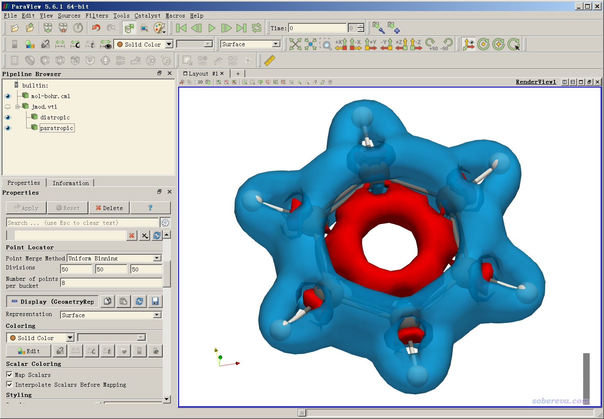

### 5.2 用VMD绘制感生电流的模的等值面

如《在VMD里将cube文件瞬间绘制成效果极佳的等值面图的方法》（<http://sobereva.com/483>）所示，用VMD可以得到效果绝佳的等值面图，而用ParaView明显达不到这个效果，然而VMD又不支持直接载入vti文件，怎么办？2019-Jun-21及之后发布的Multiwfn都支持载入vti文件（只支持标量数据形式）。用Multiwfn载入jmod.vti后，选择主功能13，再选择导出cube文件，之后就可以用VMD按照博文里的做法来绘制了。Multiwfn可以在<http://sobereva.com/multiwfn>免费下载。

完整操作过程在本文视频第2部分做了演示。绘制效果如下，可见非常漂亮。

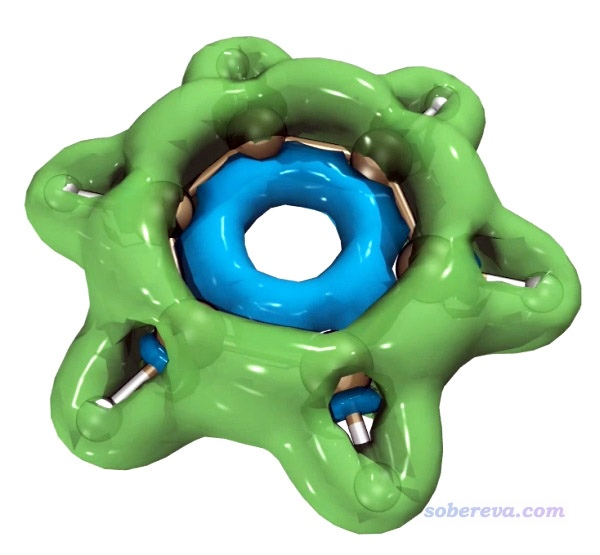

### 5.3 绘制感生电流的模的截面着色图

按照本文视频第3部分即可绘制出感生电流的模的截面着色图。在ParaView里可以设置无数多个截面，每个截面可以通过着色方式展示出标量函数的数值或者向量函数的模。下图把分子平面和分子平面上方1.5 Bohr处的环电流的模同时通过颜色进行了展示。为了避免遮住下方的平面，上方的平面设置了透明效果。

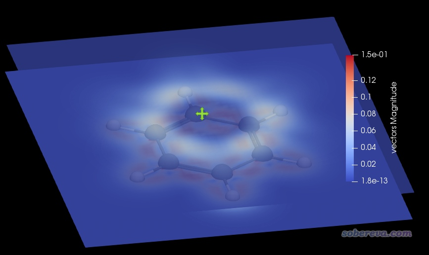

### 5.4 绘制ACID等值面图+向量场图

按照本文视频第4部分即可绘制出来向量场图，可以展现整个三维空间中各个位置的电流方向。但由于倒处都是箭头，为了看起来更清楚，还同时把ACID等值面也展现了出来。从此图上也可以看出在分子平面上方、下方以及外围，电流都是diatropic的。

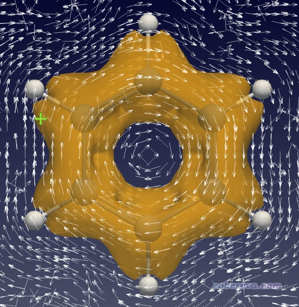

### 5.5 绘制感生电流三维流线图

基于jvec.vti，效仿本文的视频第5部分即可绘制出来感生电流的三维流线图，效果如下。

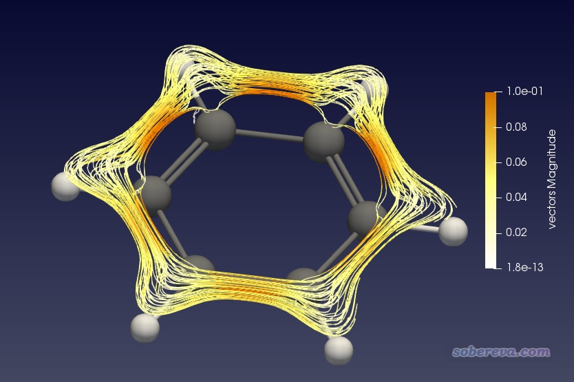

流线图可以清晰地展现出环电流的路径。绘制流线图的时候，流线的起点是用户通过设置一个球形范围来定义的，球形位置可以用鼠标挪动，球形半径、流线的长度和方向都可调，默认是前后两个方向都产生流线。

还可以显示成流线箭头图

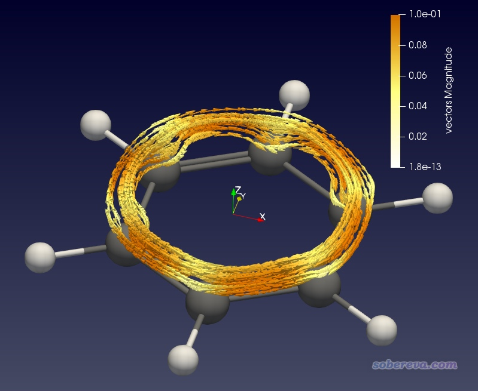

由上图可见，在苯环上方形成了显著的环绕苯环的环电流。图中流线是根据矢量的模来着色的，图上箭头都普遍偏橙黄，体现出环电流强度较大。本例磁场是往Z轴正方向加的，从箭头方向上也看出在苯环上方形成的是满足左手定则的diatropic电流。

绘制的流线图也可以只往正方向或逆方向生成，比如把Integration Direction从默认的BOTH切换为FORWARD之后，图像如下所示。磁场是从屏幕内侧往外侧加，可见在分子外围区域都是diatropic环电流（顺时针方向），而且在C-C sigma键区域也形成了显著的局部环流，体现出了这个区域电子较高的定域性。

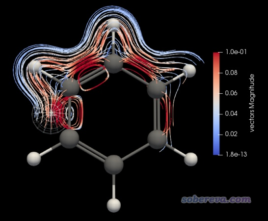

### 5.6 绘制感生电流的模的平面着色流线图+箭头图

按照本文视频第6部分即可绘制出来感生电流的模的平面着色流线图，如下所示。此图选的截面正好在分子平面上，图中越白的地方说明电流大小越大，可见绕着每个sigma键都形成了显著环电流。

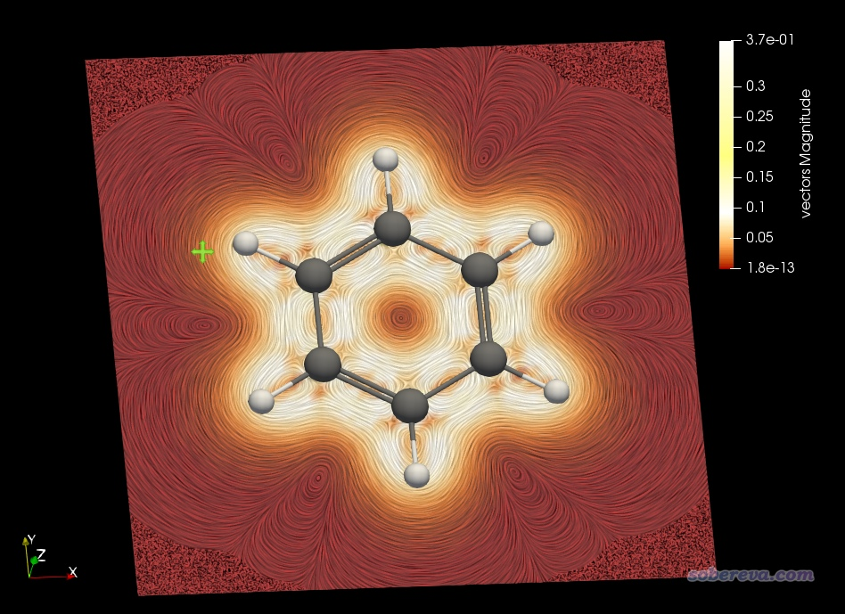

下图是把平面挪到距离分子平面1.5 Bohr的位置，用来反映pi电子形成的环电流的情况。为了看得更清楚，把色彩刻度上限调小到了0.2。可见，在碳环上方形成了一圈白色，体现出在这个环状区域环电流很大。

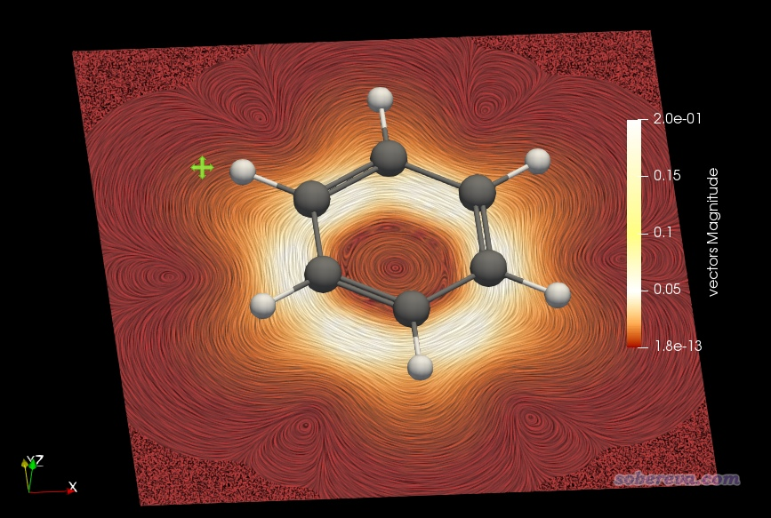

之后可以再增加一个截面用来显示箭头，位置也设成距离平面1.5 Bohr处，这样就把特定截面上电流的大小和方向同时清楚地展现出来了，如下所示。

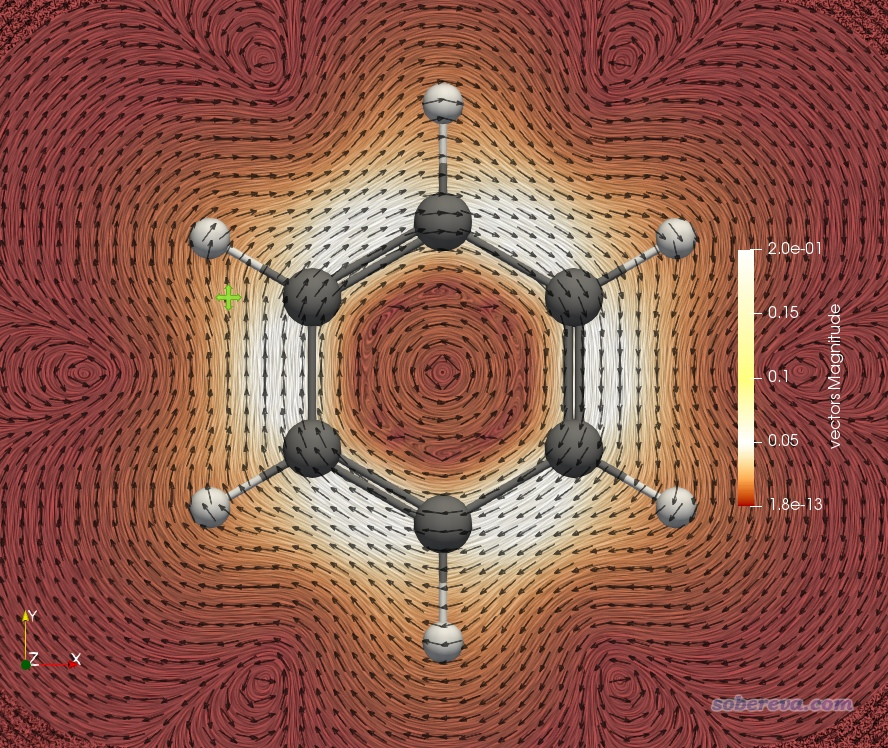

### 5.7 绘制全空间动态流线场图

这种图的动画效果极其酷炫，保证每个看到这个图第一眼的人都会被惊到！这种图以极度直观的方式将外磁场下环电流的流动体现了出来。按照本文视频第7部分即可轻易绘制出来，大家一定要看一下。这种动态图的截图如下。

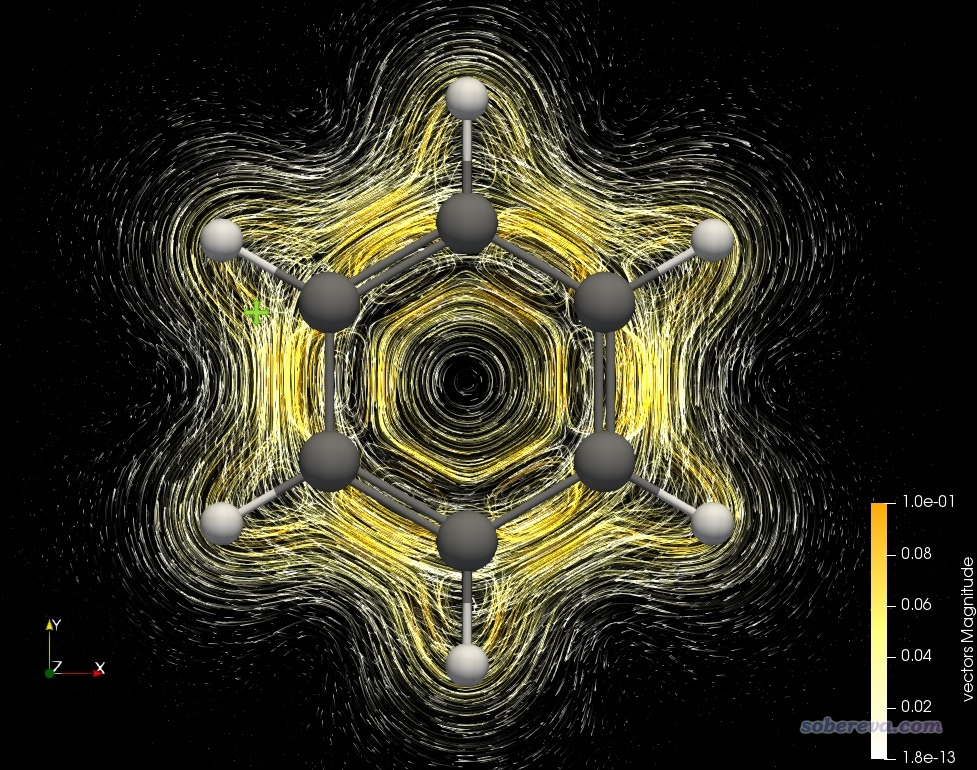

## 6 实例：对穿越苯分子C-C键截面的电流进行积分

这一节讲一下怎么计算穿越苯分子C-C键截面的环电流的积分值，这可以从定量上考察环电流的大小、考察芳香性的强弱。做这种计算需要定义一个积分截面，对于当前例子如下所示

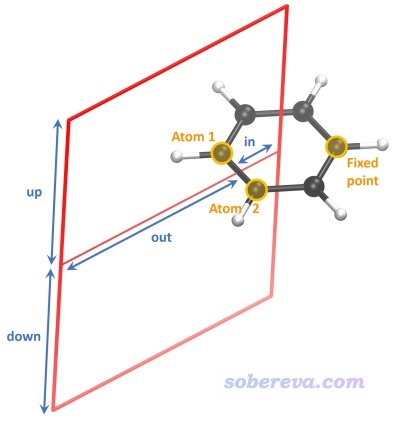

可见需要设置两个原子来定义键轴，定义截面距离第一个原子的距离，以及定义键轴与截面交点向四周的延展距离。为了唯一地定义截面区域，还需要设置一个固定点（fixed point），这个点的位置就取为相同环平面上的另一个原子即可，并且应当取的是相对于键轴靠环中心那一侧的原子。

本例相关文件都在本文文件包里的int目录下。其中输入文件gimic.inp的内容如下，有必要说明的地方我都进行了注释。

calc=integral  
 basis="../MOL"  
 xdens="../XDENS"  
 openshell=false   
 magnet=[0,0,1]

Grid(bond) {   
     type=gauss   //在截面上分布用于高斯积分的格点  
     gauss_order=9   //高斯积分阶数。当前值总是恰当的，不需要改  
     bond=[1,2]    //定义键轴的两个原子序号为1和2  
 #   coord1=[0.0, 0.0, 2.145166]   //也可以通过两个坐标来定义连线方向。注意单位是Bohr  
 #   coord2=[0.0, 0.0, -2.145166]  
     distance=1.32  //截面距离第一个原子的垂直距离，单位为Bohr。1.32 Bohr是苯的C-C键的一半，通常都取为键的一半  
     fixpoint=4  //固定点对应的原子的序号（4号原子位置见下文的图）  
 #   fixcoord=[0.0, 0.0, 0.0]  //也可以直接提供固定点的坐标  
     grid_points=[30, 30, 0]   //只需要定义前两个值，用来设定截面上两个方向的点数。越大积分越准确，通常用30*30就够了  
     height=[-5.0, 5.0]   //对应于上图的down和up数值。由于down对应下方，所以写成负值。当前数值大小一般来说足够大了  
     width=[-2.2, 5.0]    //对应于上图的in和out数值。由于in对应内侧，所以写成负值，其绝对值对应于苯环中心与键轴的垂直距离。当前out数值一般来说足够大了  
 }

Advanced {  
     lip_order=5     //拉格朗日插值多项式的阶数。不用改  
     spherical=off  
     diamag=on  
     paramag=on  
 }

确保MOL和XDENS在上一级目录下，运行gimic命令执行此目录下的gimic.inp。由于做截面积分需要算的点数很少，瞬间计算就完成了，主要输出信息如下

 *** Integrating current  
     Magnetic field <x,y,z> =   0.00000   0.00000   1.00000

 ************************************************************  
     Induced current (au)    :     0.428903  
        Positive contribution:     0.604900  (  17.045730 )  
        Negative contribution:    -0.175997  (  -4.959491 )

    Induced current (nA/T)  :    12.086239  
        (conversion factor)  :    28.179409  
  ************************************************************

即穿越C-C键截面的感生电流数值为0.4289 a.u.，还把diatropic和paratropic电流分别贡献的正值和负值部分都给出了，括号里是常用的nA/T为单位的数值，即a.u.的数值乘上28.179409。

当前目录下还出现了grid.xyz，其中的X原子对应截面的四个顶点位置。将其中最后一个意义不明的Be原子删掉，然后在VMD里进行恰当设置，可得下图。可见确实截面位置设置得正确。建议大家每次总是这么通过绘图检查一下截面设置到底对不对，避免得到无意义的结果。（具体来说绘制过程是用《在VMD中显示原子序号的方法》<http://sobereva.com/197>里的做法显示出序号，然后在Graphics - Representation里新增Rep，选区设成name X，然后显示风格设成DynamicBonds，然后把Distance Cutoff逐渐设大直到四个X之间连成上图的框）

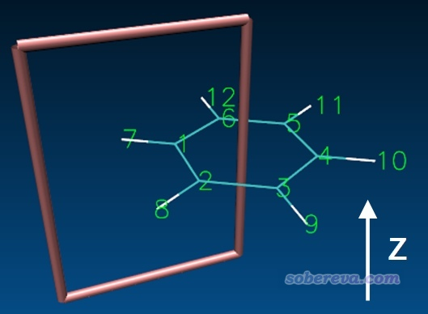

注意环电流积分的正负号是取决于键轴定义的方向的。当前是用1,2两个原子定义键轴，如果反过来，写成bond=[2,1]，则积分值就成了-0.4289了。使用bond=[1,2]时，顺着1→2原子方向的电流对积分值是负贡献，顺着2→1原子方向的电流对积分值是正贡献，由于此例总积分值为正，2→1方向的电流占主导，因此diatropic电流比paratropic电流整体要大，体现出苯分子的芳香性很强。

## 7 其它

实际研究的环往往不是正好在XY、YZ或XZ平面上的，这给加磁场的设定、设置作图平面带来麻烦。对于这种情况，笔者建议用《调节平面分子间距的方法》（<http://sobereva.com/178>）文中提供的笔者写的VMD脚本alignplane来把要考察的环弄成平行于XY平面的状态。之后Gaussian计算时必须加nosymm关键词，否则朝向会被Gaussian自动改变。

我估计大部分读者对ParaView都不熟悉，本文的视频里已经充分体现了用ParaView可视化格点数据涉及的各种基本操作，希望读者举一反三，灵活运用，结合实际情况得到又酷炫又能很好说明问题的图。另外，目前官网上最新的Multiwfn已经可以在计算或载入格点数据后利用主功能100的子功能2导出vti文件和以Bohr为单位的cml文件，因此各种实空间函数、cube文件也都可以在ParaView里可视化。

可能有读者不知道怎么恰当设置盒子的原点（origin）和边长（lengths），其实利用Multiwfn，很容易确定这两个参数。启动Multiwfn（这里用的是3.6版），载入fch/fchk文件，然后依次输入  
5  
100  
1  
然后在屏幕上就可以看到这些信息  
 Coordinate of origin in X,Y,Z is     -10.078470  -10.709411   -6.000000 Bohr  
 Coordinate of end point in X,Y,Z is    9.993583   10.746921    6.112446 Bohr  
 Grid spacing in X,Y,Z is    0.346070    0.346070    0.346070 Bohr  
这说明对于当前体系可以设origin=[-10.1, -10.1, -6.0]。X方向边长适合设9.993583-(-10.078470)=20.1 Bohr，对Y、Z方向也类似，因此设lengths=[20.1, 21.4, 12.1]是合适的。

还有一个非常流行的考察感生电流的程序是AICD，在《使用AICD程序研究电子离域性和磁感应电流密度》（<http://sobereva.com/147>）和《使用AICD 2.0绘制磁感应电流图》（<http://sobereva.com/294>）都详细介绍了。相对于AICD而言，GIMIC的优点在于可以给出三维空间中各个位置的环电流矢量和模，并且结合ParaView可以以不同方式作出很漂亮的图进行考察，绘图设定非常灵活。GIMIC的缺点在于没法将环电流分解为不同轨道的贡献，因此没法实现sigma和pi环电流的分离考察，而且也没法得到AICD程序给出的那种在AICD等值面上标记电场方向箭头的图（这种图非常直观，而且对于展现非平面体系的环电流特征尤为方便和好用）。所以GIMIC和AICD之间没有替代关系，二者在展现环电流的角度上是高度互补的，二者都应当会用，并且根据实际情况判断怎么展现最清楚、最能说明问题。

此外，SYSMOIC也是知名的考察感生电流的程序，介绍见《使用SYSMOIC程序绘制磁感生电流图和计算键电流强度》（<http://sobereva.com/702>）。它和GIMIC一样可以产生感生电流向量场图，虽然效果没那么酷炫，但由于自带了可视化功能，使用起来明显更方便。而且SYSMOIC对键截面上做感生电流的积分比GIMIC方便得多。
