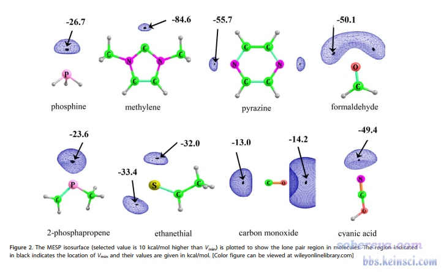
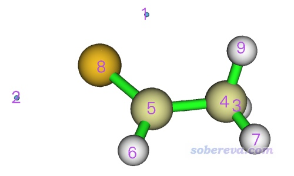
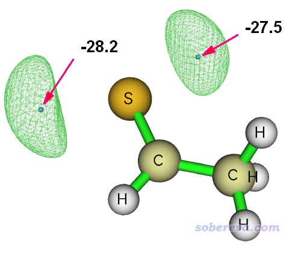
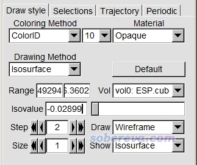
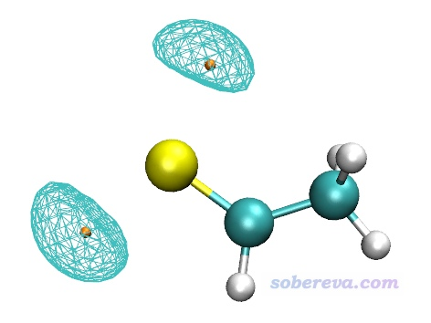
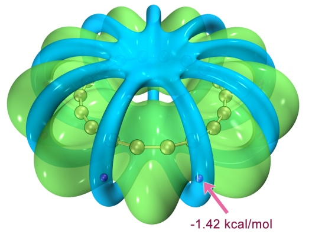

**2022-Jul-5重要补充**：本文用的是盆分析方法得到静电势极小点的位置和数值，用Multiwfn的拓扑分析功能也实现同样的目的，而且精度比用盆分析更高。如果你对精度有较高要求，应当用拓扑分析代替盆分析。具体例子参见《使用Multiwfn对静电势和范德华势做拓扑分析精确得到极小点位置和数值》（<http://sobereva.com/645>）。

**绘制静电势全局极小点+等值面图展现孤对电子位置的方法**

Method of plotting global minimum and isosurface map of electrostatic potential to show the position of lone pair electrons

文/Sobereva@[北京科音](http://www.keinsci.com)

First release: 2019-Jun-24  Last update: 2020-Apr-13

## 1 前言

有人在计算化学公社论坛问下面这张图怎么绘制（实际上是J. Comput. Chem., 39, 488 (2018)里的图）

这张图里面每个黑点是静电势的全局极小点，蓝色网格等值面展现的是静电势的等值面图，如图题所示，等值面数值取的是比静电势全局最小点数值(Vmin)大10 kcal/mol的值。

孤对电子出现位置有不同方式可以考察，没法说哪个是最严格的。比如可以用Multiwfn做轨道定域化分析看对应孤对电子的轨道质心位置来考察，见《Multiwfn的轨道定域化功能的使用以及与NBO、AdNDP分析的对比》（<http://sobereva.com/380>）；也可以通过对ELF或LOL函数绘图或通过其临界点位置考察，见《使用Multiwfn做拓扑分析以及计算孤对电子角度》（<http://sobereva.com/108>）和《ELF综述和重要文献小合集》（<http://bbs.keinsci.com/thread-2100-1-1.html>）。Suresh的一些文章认为通过静电势全局极小点位置也可以展现孤对电子，如上图所示，极小点连同周围的静电势等值面也确实合理地把孤对电子出现区域展现了出来，与化学直觉一致。Multiwfn是分析静电势非常强大、灵活的工具，下面就说一下怎么绘制上面那种图。如果你对静电势了解甚少的话，建议看看《静电势与平均局部离子化能综述合集》（<http://bbs.keinsci.com/thread-219-1-1.html>）里面的资料和笔者的相关博文。

本文使用乙硫醛作为例子，就是上图第二行第二个。由于计算级别和原作者不可能恰好相同，所以结果也不可能精确相同。这里笔者用Gaussian在B3LYP/def2-TZVP下对结构进行优化并产生波函数，得到的fch文件在<http://sobereva.com/attach/493/file.rar>里面。用其它的含有波函数信息的格式作为Multiwfn的输入文件当然也可以，见《详谈Multiwfn支持的输入文件类型、产生方法以及相互转换》（<http://sobereva.com/379>）。为了加快静电势计算，强烈建议让Multiwfn调用本机里Gaussian中的cubegen，做法见《Multiwfn现已可以调用cubegen使静电势分析耗时有飞跃式的下降！》（<http://sobereva.com/435>）。

本文的Multiwfn用的是官网<http://sobereva.com/multiwfn>上的最新版本（老版本可能不适用于本文的步骤）。VMD使用1.9.3版，可在<http://www.ks.uiuc.edu/Research/vmd/>下载。

## 2 在Multiwfn中的计算和绘制

首先需要用Multiwfn对乙硫醛做静电势的盆分析，从而得到全局极小点位置和数值，然后再绘制等值面。如果你不了解Multiwfn的盆分析功能的话，建议看《使用Multiwfn做电子密度、ELF、静电势、密度差等函数的盆分析》（<http://sobereva.com/179>）。

启动Multiwfn，输入  
ethanethial.fch  //在本文文件包里  
17  //盆分析  
1  //生成盆并获得极值点  
12  //静电势  
1  //当前对精度要求不高，选择Low quality grid就够了  
如果你允许Multiwfn调用cubegen来计算静电势的话，一般Intel四核机子下不超过一分钟就可以算完。从屏幕上可以看到如下极值点的信息，Value就是这些点静电势的值，单位是a.u.：  
  Attractor       X,Y,Z coordinate (Angstrom)                Value  
       1   -0.31737088   -2.08489274   -0.05291772         -0.04389250  
       2    2.64602171   -0.17985465   -0.05291772         -0.04492940  
       3   -1.90490263    0.13765170   -0.89960132          9.75537000  
       4   -1.48156083    0.66682895   -0.05291772         38.00920000  
       5    0.00013547    0.66682895    0.05291772         35.31730000  
       6    0.52931272    1.61934800   -0.05291772          7.39722000  
       7   -1.90490263    1.72518345   -0.05291772          6.35453000  
       8    0.84681907   -0.70903190   -0.05291772         86.36020000  
       9   -1.90490263    0.13765170    0.89960132          9.75537000

选择选项0观看极值点，恰当设置后会看到下图。

可见，有两个静电势极小点（蓝球），数值对应于上面看到的-0.04389250和-0.04492940 a.u.，乘上627.51 kcal/mol转换单位后，数值是-27.5和-28.2 kcal/mol。然后点击界面上的Attractor labels取消显示极值点的标签，然后输入  
-10  //返回主菜单  
13  //处理格点数据的主功能  
-2  //观看等值面  
此时图形窗口里显示的是内存里装着的格点数据的等值面，即静电势等值面。

当前体系的Vmin是-0.04492940，比它静电势高10 kcal/mol的话就是-0.0449294+10/627.51 = -0.02899。将这个数值输入当前窗口的Isosurface Value文本框里然后按回车，然后点击Show both sign来避免显示与之符号相反的0.02899 a.u.等值面。然后在菜单栏的Isosurface style里选Mesh。点击Show atomic labels将原子标签显示在图上，再选菜单栏的Other settings - Set atomic label type - Element Symbol。最后，点击Save picture按钮保存图像文件到当前目录，再自行把极值点的数值标上去，就得到了下图

## 3 在VMD中的绘制

使用VMD来绘制往往可以得到比Multiwfn更好的效果，特别是对于大体系、需要精细调整视角的情况而言。接着上一节的例子，退出图形窗口，在主功能13的界面中选择0，然后输入ESP.cub来把当前内存里的静电势格点数据导出为当前目录下的ESP.cub（此文件也在本文的文件包里）。然后启动VMD，将ESP.cub拖入VMD Main窗口载入之，进入Graphics - Representation，把Drawing Method切换为CPK，把Sphere Resolution设为22使得原子球更更滑。然后点Create Rep，并把选项设成下面这样

然后在命令行窗口输入color Display Background white切换为白背景。之后输入以下命令，在静电势极小点的位置绘制桔黄色小球，坐标就是之前Multiwfn做盆分析时候找出来的  
draw color orange  
 draw sphere { -0.31737088   -2.08489274   -0.05291772 } radius 0.1 resolution 15  
 draw sphere { 2.64602171   -0.17985465   -0.05291772 } radius 0.1 resolution 15

现在看到的图像如下所示，和Multiwfn显示的完全一样。可见无论是VMD绘制的还是Multiwfn绘制的，都明显比原文的图好看得多。

在VMD中，静电势等值面图也可以通过《在VMD里将cube文件瞬间绘制成效果极佳的等值面图的方法》（<http://sobereva.com/483>）介绍的做法绘制，效果明显更好，而且比上文的做法还省事，只需要在Multiwfn产生静电势cub文件后在VMD里运行一个我写的绘图脚本即可。在《一篇最全面、系统的研究新颖独特的18碳环的理论文章》（<http://sobereva.com/524>）介绍的文章中笔者研究了电子结构十分特殊的18碳环体系，其中在考察静电势分布特征的时候就用了此文的方法确定了静电势极小点位置并结合VMD进行了绘制，如下所示，可见效果极佳。绿色和蓝色分别是静电势为正和为负的等值面，紫球是静电势最小点。很建议大家看看此文中对18碳环的静电势的相关讨论。

