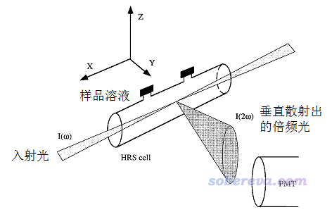
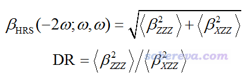
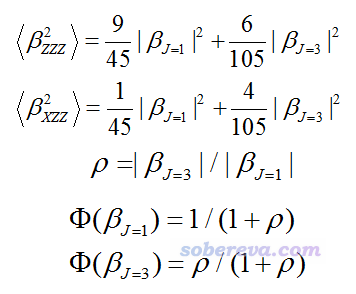
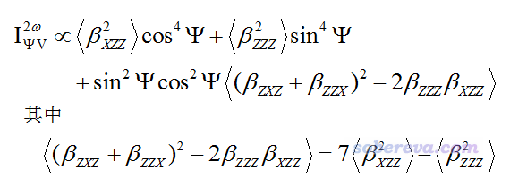
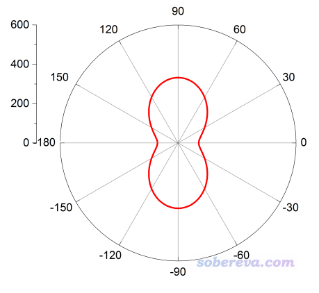
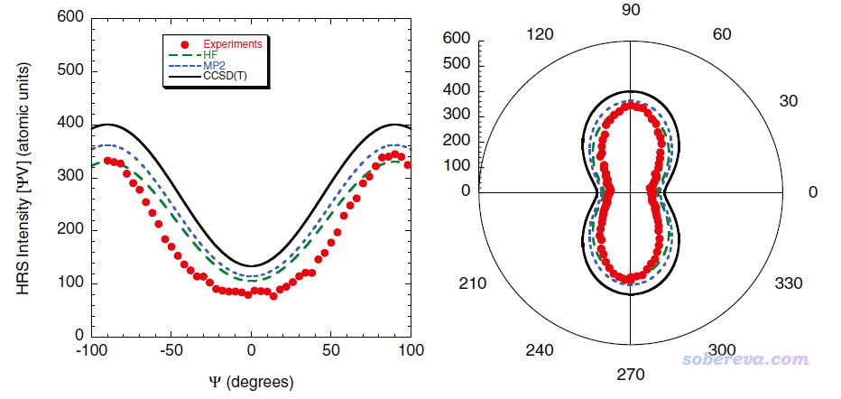

**使用Multiwfn计算与超瑞利散射(HRS)实验相关的量**

Using Multiwfn to calculate quantities related hyper-Rayleigh scatter experiment

文/Sobereva@[北京科音](http://www.keinsci.com)

 First release: 2019-Aug-7  Last update: 2020-Jun-26

**摘要**：超瑞利散射(HRS)是考察分子第一超极化率的一种实验手段，本文介绍如何使用Multiwfn基于Gaussian的polar任务的输出文件计算出与HRS实验相关的量。首先介绍基础知识，然后给出具体例子，并重复文献里的数据。

笔者参与的一篇文章中利用了Multiwfn将本文介绍的HRS分析用于了实际研究中，见J. Phys. Chem. A (2020) DOI: 10.1021/acs.jpca.0c03166，欢迎阅读和引用。

## 1 基本知识

之前笔者在《使用Multiwfn分析Gaussian的极化率、超极化率的输出》（<http://sobereva.com/231>）中已经对(超)极化率的相关知识和计算有过基本的介绍。实验上测定beta（第一超极化率）常用的方法是EFISHG（电场诱导二次谐波产生）实验，这个测的是平行于分子偶极矩的beta(-2w;w,w)的分量，这里w是外场频率。还有一种实验上考察beta(-2w;w,w)的方法是超瑞利散射(Hyper-Rayleigh Scattering, HRS)，相关介绍见Acc. Chem. Res., 31, 675 (1998)（此文有个别错误）。HRS实验示意图如下。

根据入射光的强度和测定的垂直散射出的倍频光的强度，可以得到beta_HRS值，表达式如下，它是对分子的beta(-2w;w,w)的一种展现，是各向平均属性，不受分子朝向的影响。其中<beta^2 ZZZ>和<beta^2 XZZ>的具体定义看Multiwfn手册3.200.7节或PCCP,10,6223(2008)，是基于beta(-2w;w,w)张量的各个分量计算的。还有个量叫退偏比(depolarization ratio, DR)，定义也在下面给出了，理论最小值为1.5（对应Td点群的分子）。

<beta^2 ZZZ>和<beta^2 XZZ>可分解为偶极（J=1）和八极（J=3）成份的加和，如下所示。并进而可以定义各向异性参数ρ，以及偶极和八极对beta的相对贡献φ(beta J=1)和φ(beta J=3)。

对于小分子，其偶极矩大小与上述很多量有密切联系，本文就不多说了，读者可参看J. Chem. Phys., 136, 024506 (2012)里的例子。

入射光的极化态通过(Ψ,δ)两个参数确定。当入射光以X方向射入、相位延迟量δ=π/2时，顺着Y方向散射出的沿Z方向极化的光的强度与入射光极化角Ψ的关系为：

很多文章里都考察了散射光强度随Ψ的变化关系，比如JCP,136,024506(2012)、JPCA,116,10249(2012)。

## 2 用法&例子

下面就结合例子说一下用Multiwfn具体怎么计算前述的与HRS相关的量。注意从2019年7月30日更新的Multiwfn 3.7(dev)开始才有相关功能，绝对不要用在此日期之前发布的版本！！！Multiwfn可在其主页<http://sobereva.com/multiwfn>免费下载。

计算HRS相关的量需要提供Gaussian的polar=DCSHG任务的输出文件。此处我们重复一下JCP,136,024506(2012)中对CH2Cl2计算的结果。文中给了很多数据，我们这里将要对照文中在HF/d-aug-cc-pVTZ级别下结合IEFPCM描述CH2Cl2溶剂环境时算的数据，入射波长取的是1064nm。Gaussian的输入文件如下。

#p HF/daug-cc-pVTZ polar=DCSHG CPHF=rdfreq scrf=solvent=CH2Cl2  
 [空行]  
 Title Card Required  
 [空行]  
 0 1  
  C                  0.00000000    0.00000000    0.76822500  
  H                 -0.89768500    0.00000000    1.37593000  
  H                  0.89768500    0.00000000    1.37593000  
  Cl                 0.00000000    1.49574000   -0.21650600  
  Cl                 0.00000000   -1.49574000   -0.21650600  
 [空行]  
 1064nm

这个例子里，#P必须有，否则Multiwfn无法解析输出文件。d-aug-cc-pVTZ在Gaussian里写作daug-cc-pVTZ。由于HRS展现的是分子的beta(-2w;w,w)，显然必须用polar=DCSHG关键词来计算这种形式的beta。CPHF=rdfreq结合末尾空一行处的1064nm代表要算的不仅有静态极限w=0的情况还有w=1064nm的情况（由于polar=DCSHG关键词默认了CPHF=rdfreq，因此CPHF=rdfreq也可以不写）。scrf=solvent=CH2Cl2代表用默认的IEFPCM隐式模型描述CH2Cl2溶剂环境。上面输入文件里的坐标是笔者事先使用与JCP文章里相同的级别优化好的。

上面的输入文件和G09 E.01计算产生的输出文件可以直接在此下载：<http://sobereva.com/attach/499/file.rar>。

启动Multiwfn，载入上述任务的输出文件CH2Cl2_solv.out，然后依次输入  
200  //主功能200  
7  //解析Gaussian的polar任务的输出文件里的(超)极化率信息并计算相关数据  
-1   //切换为载入含频(超)极化率的模式  
1   //当前用的计算级别是有解析三阶导数的级别，包括HF、普通DFT泛函、半经验  
2   //载入对应w=1064nm的数据  
2   //考察的形式是beta(-2w;w,w)

此时在屏幕上看到下面的输出

[beta各个分量略...]  
 Beta_X=        0.00000  Beta_Y=        0.00000  Beta_Z=       41.77407  
 Magnitude of first hyperpolarizability:       41.774067  
 Projection of beta on dipole moment:       41.774067  
 Beta ||     :       25.064440  
 Beta ||(z)  :       25.064440  
 Beta _|_(z) :        8.334480

Note: Kleinman's symmetry condition is not employed for below quantities:  
 <beta_ZZZ^2>:  3.32226140E+02  
 <beta_XZZ^2>:  1.05032972E+02  
 Hyper-Rayleigh scattering (beta_HRS):        20.911  
 Depolarization ratio (DR):   3.163  
 |<beta J=1>|:        32.374  
 |<beta J=3>|:        46.322  
 Nonlinear anisotropy parameter (rho):   1.431  
 Dipolar contribution to beta, phi_beta(J=1):     0.411  
 Octupolar contribution to beta, phi_beta(J=3):   0.589  
 < (beta_ZXZ+beta_ZZX)^2 - 2*betaZZZ*betaZXX >:  4.03004664E+02

前文提到的beta_HRS值、<beta_ZZZ^2>、DR等各个量都已经明确给出来了。由于计算前没要求程序切换成其它单位输出，所以单位用的都是默认的a.u.。

在前述的JCP文章的表5中的最后一行我们看到在当前计算条件下beta_HRS值为20.90，DR值为3.12，我们自己算的结果分别是20.911和3.16，可见与文献高度相符。

如果你想考察散射光强度随Ψ的变化，此时输入y，然后输入一个起始角度。如果输入的值为r，那么就会给出Ψ从r到r+360度范围内每隔1度对应的散射光强度值。这里我们输入-180，然后屏幕上提示HRS_angle.txt已经导出到了当前目录下。内容为：  
-180.0  105.032972  
 -179.0  105.091742  
 -178.0  105.268017  
 ...略  
  177.0  105.561698  
  178.0  105.268017  
  179.0  105.091742

之后可以把这个文件拖入到Origin里并绘制成曲线图。由于当前的数据是360度周期性的，很多研究者通过图像展现这类数据的时候喜欢绘制成极坐标的图。具体做法是选择Plot - Polar theta(X)r(Y)，然后对图像做一番调整，就可以得到下图的效果。相应的Origin的.opj文件在上面提到的文件包里直接提供了。

此图很容易理解，角度对应Ψ值，每个特定角度下红线距离原点的距离就是这个Ψ值对应的散射强度值。在前述JCP文章的图9里，给了与上图相对应的图，曲线图也一并给出，如下所示。其中右图中绿色长虚线对应的是我们上面用的计算级别，可见我们的图和文献里的图完全一致。

顺带一提，之前密度泛函小卒写过一个基于Python的程序NLO Calculator也可以计算上述这些量，Multiwfn计算的结果和NLO Calculator是一样的，但输出格式明显不同。
