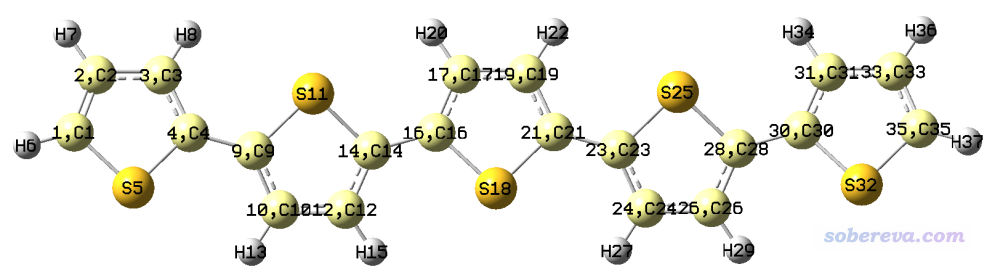
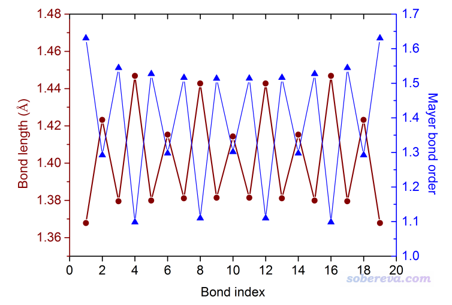
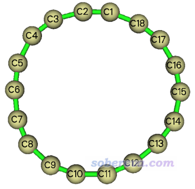
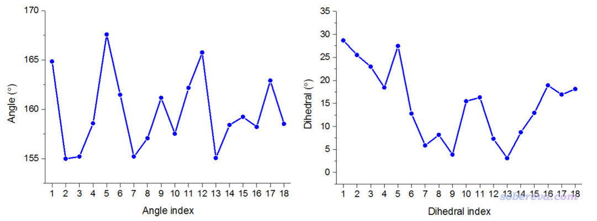
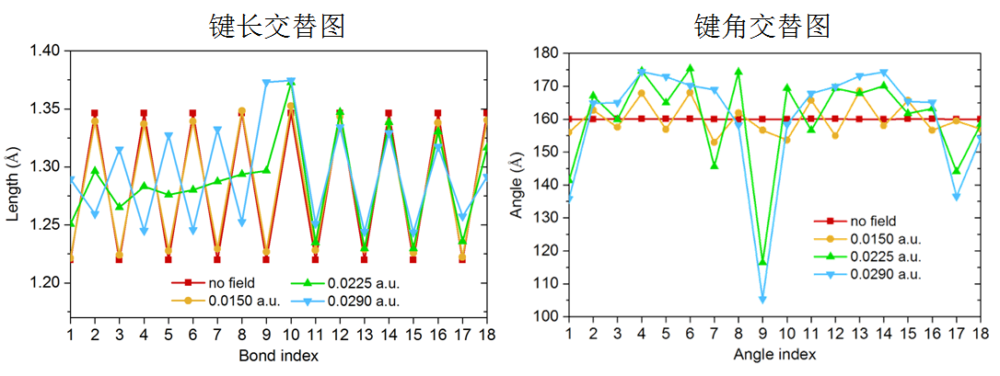
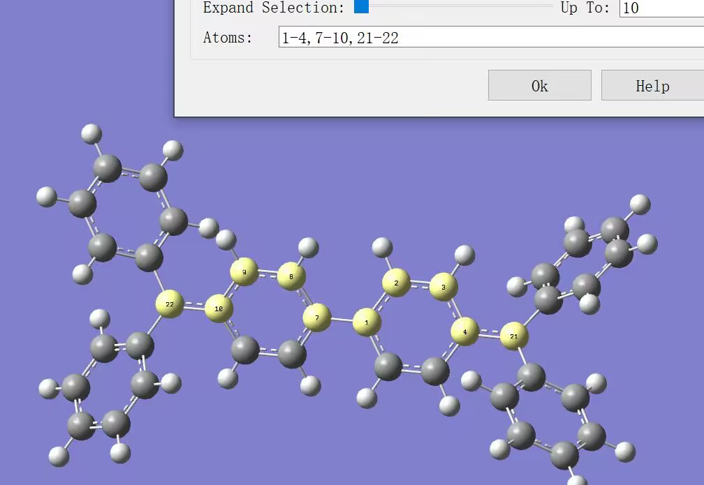
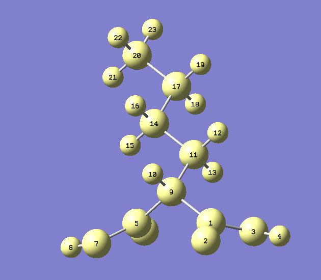

**使用Multiwfn计算Bond length/order alternation (BLA/BOA)和考察键长、键级、键角、二面角随键序号的变化**

Using Multiwfn to calculate bond length/order alternation (BLA/BOA) and study variation of bond length, bond order and angle with respect to bond index

文/Sobereva@[北京科音](http://www.keinsci.com)

  First release: 2019-Aug-11  Last update: 2024-Apr-23

## 1 基本知识

共轭寡聚物是量子化学经常研究的对象，如10聚乙烯、12聚噻吩等。这类体系都有共轭长链，pi电子能够在上面长程离域。这种共轭链上的键长通常呈现交替变化特征，即长-短-长-短...，相应地，键级的变化也有类似的交替波动规律。为展现这点，可以绘制键长或键级随共轭链上的键的序号变化的折线图，例如ACS Cent. Sci., 2, 309 (2016)文中的图2。还专门有人定义了Bond length alternation (BLA)和Bond order alternation (BOA)来定量化描述这种交替特征的大小。按照Handbook of Thiophene-based Materials: Applications in Organic Electronics and Photonics公式7.6的定义，BLA一般化的定义可表达为：[偶数键的平均键长] - [奇数键的平均键长]。假设共轭链的始端到末端的原子序号顺序是3-5-6-9-10-12，那么BLA就是[R(5-6)+R(9-10)]/2 - [R(3-5)+R(6-9)+R(10-12)]/3。

将BLA里的键长改为键级，就对应于BOA。相对于BLA从几何层面上体现键的交替特征，BOA是从电子结构层面上体现这点。由于对于同类键，键越长键级通常越小，因此BLA和BOA一般呈负相关（BLA为正时BOA一般为负，BLA越正则BOA倾向于越负）。如《Multiwfn支持的分析化学键的方法一览》（<http://sobereva.com/471>）的键级部分所介绍的，键级有很多不同的定义。Multiwfn在计算BOA的时候用的是Mayer键级，因为其计算速度很快，普适性强，数值大小和形式键级接近，有较好化学意义，适合用于作为BOA中的键级定义。原理上，用笔者在J. Phys. Chem. A, 117, 3100 (2013)提出的拉普拉斯键级(LBO)来考察BOA也完全可以，只不过耗时会高一些。

BLA和BOA与共轭寡聚物的gap、(超)极化率等很多属性都有十分密切的关系，如BLA越大gap越大，还专门有人拟合了关系式。外电场、取代基也会影响BLA/BOA值。更多相关内容这里就不细说了，在这里有较全面的介绍：<http://photonicswiki.org/index.php?title=Structure-Property_Relationships>。很多此类体系的研究文章中也都讨论了BLA或BOA，如J. Chem. Phys., 136, 094904 (2012)、Syn. Met., 141, 171 (2004)等等。

顺带一提，在寡聚物的共轭链上，除了键的特征有规律性的波动，原子的特征也有规律性的波动，如笔者的RSC Adv., 3, 25881 (2013)一文中图5考察了纳米线的共轭链上原子电荷和原子的pi布居的变化。

研究共轭链的特征时候还经常考察键角、二面角随共轭路径的变化。路径上的各二面角偏离平面的程度整体越低，往往暗示共轭越强。

## 2 Multiwfn的BLA/BOA的计算功能

Multiwfn是功能非常全面的波函数分析程序，可以从官网<http://sobereva.com/multiwfn>免费下载，相关知识见《Multiwfn FAQ》（<http://sobereva.com/452>）。从2019-Aug-11更新的Multiwfn开始，BLA和BOA计算功能作为Multiwfn的主功能200的子功能18出现。Multiwfn还顺便给出选定的共轭链上各个键的键长和键级，便于用户之后画出“键长-键序号”和“键级-键序号”的折线图。此功能用的键级是Mayer键级，注意由于Mayer键级怕弥散函数，所以用的波函数文件在产生的时候不能带弥散函数。

如果使用含有基函数信息的文件比如.fch、.molden作为输入文件，那么键长和键级数据都会被给出来；如果使用只含分子结构信息的格式如.xyz、.pdb、.mol、.mol2作为输入文件也可以，但此时键级数据和BOA值不给出来。更多相关信息，以及怎么产生这些文件见《详谈Multiwfn支持的输入文件类型、产生方法以及相互转换》（<http://sobereva.com/379>）。

虽然手动提取键长、计算键级，然后再手算BLA/BOA也不难，但是当考察的体系很多，特别是聚合度很高的话，手动处理非常费时费力，还容易弄错，而Multiwfn的这个功能大大简化了这个过程。

此外，在这个功能中用户还可以要求Multiwfn将各个键角、二面角的数值沿着路径的变化输出出来，从而便于绘制“键角-键角序号”和“二面角-二面角序号”的折线图，从后面的例子就会看到这种图对展现结构特征很有价值。

## 3 例子

### 3.1 考察五聚噻吩的BLA、BOA以及键长/键级随键序号的变化

下面以五聚噻吩为例，介绍一下如何在Multiwfn中计算BLA、BOA以及绘制键长/键级随键序号的变化。此体系以下简称TP5，用Gaussian 16在PBE0/6-31G*下优化并得到的fchk文件可以在此下载：<http://sobereva.com/attach/501/TP5.zip>。值得一提的是，这个体系看似好像应该是平面结构，但实际上如TP5.fchk所示，其无虚频的结构是稍微弯折的。

在计算之前，显然必须先确定出来从共轭链的始端到末端的原子序号顺序。虽然可以在可视化程序里通过观看分子，把序号一个一个记录下来，但这样很费劲。利用Multiwfn算BLA/BOA则不需要这么麻烦。用户只需要告诉Multiwfn这条链上都有哪些原子，以及始端和末端的原子序号是什么就行了，Multiwfn会根据这些信息以及原子间连接关系自动识别出链上的原子序号顺序。

获取链上原子序号最省事的做法是把体系载入GaussView，选Builder面板上的Select Atoms by Brush按钮（对于gview 6.0.16版是倒数第四行最右边那个。gview 6之前的版本没有这个按钮），然后按住鼠标左键，让光标经过共轭链上的每一个原子来选中它们，之后窗口里的图像应该是下面这样

注：由于C-S、C-H键不参与共轭，所以H、S原子不纳入考虑。由于当前体系里所有碳原子都参与共轭，所以你在gview的Atom List Editor里直接把所有碳原子选上效果也是等价的。

然后进入gview的Tools - Atom selection，会看到当前被选中的原子序号范围是：1-4,9-10,12,14,16-17,19,21,23-24,26,28,30-31,33,35。从上图还可以看到，选中的链的始端的原子序号是1，末端的原子序号是35。

现在可以开始计算了。启动Multiwfn，然后输入  
TP5.fchk  
200   //主功能200  
18    //计算BLA/BOA和考察键长/键级随键序号的变化  
1-4,9-10,12,14,16-17,19,21,23-24,26,28,30-31,33,35   //把前面得到的链当中的原子序号范围直接粘贴到窗口里  
1,35   //链的始端和末端原子序号

屏幕上首先显示出了自动判断的共轭链上的原子序列：  
 Sequence of the atoms in the chain from the beginning side to the ending side  
       1       2       3       4       9      10      12      14      16  
      17      19      21      23      24      26      28      30      31  
      33      35  
你可以对照分子结构图检验一下判断的对不对，不对的话后面的结果都没意义，当前识别出来的是对的。原子间连接关系是自动根据键长和共价半径判断的，细节这里提了《谈谈原子间是否成键的判断问题》（<http://sobereva.com/414>）。如果你载入的是.mol或.mol2文件，则连接关系是直接从里面读取而不是自动判断的。

接下来输出的是共轭链上从始端到末端的各个键的序号、构成这个键的相应原子，以及这个键的键长和Mayer键级：  
  Bond     Atom1     Atom2   Length (Angstrom)   Mayer bond order  
    1         1         2        1.3678              1.6303  
    2         2         3        1.4232              1.2924  
    3         3         4        1.3795              1.5445  
    4         4         9        1.4468              1.0985  
    5         9        10        1.3799              1.5273  
    6        10        12        1.4153              1.2976  
    7        12        14        1.3811              1.5164  
    8        14        16        1.4427              1.1098  
    9        16        17        1.3814              1.5139  
   10        17        19        1.4143              1.3017  
   11        19        21        1.3814              1.5140  
   12        21        23        1.4427              1.1097  
   13        23        24        1.3811              1.5164  
   14        24        26        1.4153              1.2976  
   15        26        28        1.3799              1.5273  
   16        28        30        1.4468              1.0985  
   17        30        31        1.3795              1.5445  
   18        31        33        1.4232              1.2924  
   19        33        35        1.3678              1.6303

如屏幕上的提示所示，上述数据还被输出到了当前目录下的bondalter.txt中。

之后输出的是统计数据，包括序号为偶数和奇数的键的数目，这两类键的平均键长、平均键级，以及相应的BLA和BOA值。  
The number of even bonds:     9  
The number of odd bonds:     10  
Average length of even bonds:       1.4300 Angstrom  
Average length of odd bonds:        1.3779 Angstrom  
Bond length alternation (BLA):      0.0521 Angstrom  
Average bond order of even bonds:      1.2109  
Average bond order of odd bonds:       1.5465  
Bond order alternation (BOA):         -0.3356

如果想绘制“键长 vs. 键序号”和“键级 vs. 键序号”的折线图，就把bondalter.txt拖入到Origin里绘制即可。下图是绘制后的效果，两个折线图作为两个不同的layer绘制在了一起，此图的Origin .opj文件在前述的TP5.zip文件包里也提供了。

之后程序还问你是否把键角、二面角在路径上的变化输出出来，此例我们不考察这个，因此输入n。对于其它共轭寡聚物的考察方法与本文类似，请大家自行尝试。

后来有读者问，在这个例子里，gview的Atom selection里已经显示了1-4,9-10,12,14,16-17,19,21,23-24,26,28,30-31,33,35这个序列，干嘛Multiwfn还要再自己判断一次序列？对当前这个体系，确实Multiwfn这一步没必要，因为原子序号本身就是顺着的；但是对于其它体系，很多情况下，你要考察的链上的原子序号顺序不是顺着的，比如有时可能是6,5,2,3,4,9,10这样交错的。Multiwfn自动判断链上的原子顺序的好处是，你在给Multiwfn提供链上的原子序号时不需要考虑提供的顺序，你按照实际顺序写成6,5,2,3,4,9,10也行，写成2-6,9-10也行，写成9-10,2-6也行，怎么写都无所谓，只要序号范围对即可。这就省得你一边看结构一边一个个记录链上的原子序号了，对于链比较长的情况省事多了，你想考察哪条链只要在gview里用前述功能一划来选中，在Atom selection里拷出来序号范围就行了。

### 3.2 考察18碳环上的键角、二面角变化

在《谈谈18碳环的几何结构和电子结构》（<http://sobereva.com/515>）中笔者专门介绍了18碳环体系。这个体系在势能面极小点情况下键角都是160度，二面角都是0度，但是在实际环境中，由于有热运动，体系结构会发生明显变形。笔者对这个体系在200 K下做了从头算分子动力学，随便截取了其中一帧，结构如下所示。当前这个例子就用Multiwfn来考察一下此结构中的键角、二面角沿着环是怎么变化的。

启动Multiwfn然后输入  
examples\C18_MD_1.xyz  
200  
18  
1-18  //即当前体系里所有原子的序号  
1,1  //对于路径是个封闭的环的情况，这一步输入的两个原子序号必须相同。输入环上哪个原子序号都可以，这里我们将此体系的1号原子作为起始原子

此时屏幕上输出了一共18个键长。之后选择y来把键角、二面角在环上的变化输出出来，看到以下信息：

Note The unit of printed values is degree

 Atoms:     1     2     3  Angle:   164.841  
 Atoms:     2     3     4  Angle:   154.976  
 Atoms:     3     4     5  Angle:   155.200  
 Atoms:     4     5     6  Angle:   158.564  
 Atoms:     5     6     7  Angle:   167.583  
 Atoms:     6     7     8  Angle:   161.476  
 Atoms:     7     8     9  Angle:   155.205  
 Atoms:     8     9    10  Angle:   157.061  
 Atoms:     9    10    11  Angle:   161.160  
 Atoms:    10    11    12  Angle:   157.517  
 Atoms:    11    12    13  Angle:   162.158  
 Atoms:    12    13    14  Angle:   165.757  
 Atoms:    13    14    15  Angle:   155.054  
 Atoms:    14    15    16  Angle:   158.404  
 Atoms:    15    16    17  Angle:   159.228  
 Atoms:    16    17    18  Angle:   158.207  
 Atoms:    17    18     1  Angle:   162.906  
 Atoms:    18     1     2  Angle:   158.520

 Atoms:     1     2     3     4  Dihedral:  28.69, deviation to planar:  28.69  
 Atoms:     2     3     4     5  Dihedral:  25.51, deviation to planar:  25.51  
 Atoms:     3     4     5     6  Dihedral:  22.98, deviation to planar:  22.98  
 Atoms:     4     5     6     7  Dihedral:  18.44, deviation to planar:  18.44  
 Atoms:     5     6     7     8  Dihedral:  27.47, deviation to planar:  27.47  
 Atoms:     6     7     8     9  Dihedral:  12.77, deviation to planar:  12.77  
 Atoms:     7     8     9    10  Dihedral:   5.86, deviation to planar:   5.86  
 Atoms:     8     9    10    11  Dihedral:   8.16, deviation to planar:   8.16  
 Atoms:     9    10    11    12  Dihedral:   3.88, deviation to planar:   3.88  
 Atoms:    10    11    12    13  Dihedral:  15.47, deviation to planar:  15.47  
 Atoms:    11    12    13    14  Dihedral:  16.28, deviation to planar:  16.28  
 Atoms:    12    13    14    15  Dihedral:   7.30, deviation to planar:   7.30  
 Atoms:    13    14    15    16  Dihedral:   3.10, deviation to planar:   3.10  
 Atoms:    14    15    16    17  Dihedral:   8.71, deviation to planar:   8.71  
 Atoms:    15    16    17    18  Dihedral:  12.94, deviation to planar:  12.94  
 Atoms:    16    17    18     1  Dihedral:  18.89, deviation to planar:  18.89  
 Atoms:    17    18     1     2  Dihedral:  16.91, deviation to planar:  16.91  
 Atoms:    18     1     2     3  Dihedral:  18.13, deviation to planar:  18.13

可见，总共18个键角，以及18个二面角都给出了。其中deviation to planar指的是偏离平面的程度。Multiwfn给出的二面角范围是0~180，对于0~90的情况，deviation to planar就等于二面角；而对于90~180的情况，deviation to planar等于180减去这个角度。

之后如果想作图的话，按照Multiwfn手册5.5节说的做法把相应的列从屏幕上拷出来，可以拷到Origin、Excel之类的窗口里，之后做成折线图就是下面的样子

此图非常直观地体现出，在当前结构下，键角普遍明显偏离18碳环极小点结构对应的160度，说明发生了显著的环平面内的变形；从二面角的图上可以看到数值普遍明显大于0，说明18碳环也发生了显著的平面外扭曲。可见这个分析对于展现某些体系的某些环的几何特征非常有价值而且非常方便。

在《一篇文章深入揭示外电场对18碳环的超强调控作用》（<http://sobereva.com/570>）介绍的笔者的研究论文中，笔者还用此文介绍的方法考察了不同电场下18碳环结构的键长、键角交替曲线，如下所示。这个研究的题材很有意思，建议大家读读。

 笔者的18氮环的研究论文中使用Multiwfn对其三种构型计算并对比了BLA以及环上的键角的变化情况，是很好的讨论例子，非常建议阅读《18个氮原子组成的环状分子长什么样？一篇文章全面揭示18氮环的特征！》（<http://sobereva.com/725>）中的相应部分。

### 附：输入路径原子序号的常见问题

之前不止一个人用本文的功能时原子序号输不对，令我非常纳闷为什么他们无法正确理解本文内容以及Multiwfn窗口里非常清楚的提示。这里再举个输入序号的例子，来自一个用户的提问。像下图这种情况，计算黄色所示的链的BLA，在进入本文介绍的功能后，Multiwfn问你路径上有哪些原子，显然应当输入1-4,7-10,21-22。然后Multiwfn问你路径两端的原子是哪两个，显然输入21,22（输入22,21也行）。

输入的原子序号范围里绝对不应当出现这条路径上没有的原子，要不然Multiwfn显然没法判断出该考察的路径。例如下面就是个典型，网上有个人输入的原子序号是1-3,5-7,9,11,14,17,20，然后将1和20定义为两端的原子，然后问我怎么得不到结果。这是显然的，此时Multiwfn怎么可能唯一地判断你要考察的路径？诸如1-9-5-7...20这样的路径根本什么都不是，都不满足原子连接关系，显然Multiwfn不可能给出有意义的BLA。如果要考察1到20最短的路径，显然应该输入的序号是这条路径上包含的原子，即1,9,11,14,17,20（顺序无所谓，诸如14,17,20,11,1,9也可以），然后你再设1和20作为两端的原子，Multiwfn才能唯一地确定出要考察的路径是1-9-11-14-17-20。

