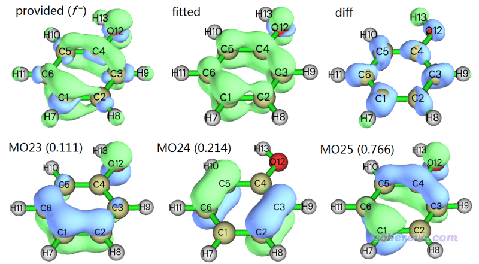
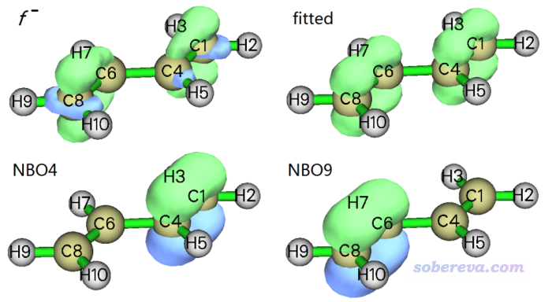
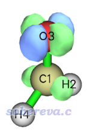
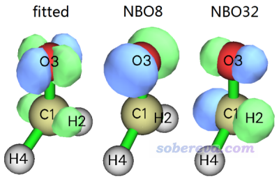

**使用Multiwfn考察分子轨道、NBO等轨道对密度差、福井函数的贡献**

Using Multiwfn to study contribution of molecular orbital, NBO and so on to density difference and Fukui function

文/Sobereva@[北京科音](http://www.keinsci.com)  2019-Aug-17

## 1 前言&基本知识

密度差是量子化学研究中经常被考察的量，Multiwfn可以非常容易地计算和绘制各种类型的密度差，见《使用Multiwfn作电子密度差图》（<http://sobereva.com/113>）。福井函数本质上也是密度差的一种，对于预测反应位点非常有实际价值，在<http://bbs.keinsci.com/thread-384-1-1.html>里有相关文章和我写过的与福井函数有关的各种博文。

虽然对密度差直接作图就可以考察密度差的基本特征来讨论问题，但是如果能从轨道角度上讨论密度差，或者说计算轨道对密度差的贡献，对于更好地揭示密度差所体现的本质无疑是非常有益的。比如，因为电离过程会伴随着轨道的弛豫，因此分子的垂直电离过程对应的密度差并不等同于HOMO轨道的概率密度（即HOMO波函数模的平方），但如果能考察各个轨道对密度差的贡献，无疑可以得知哪个轨道是电离过程中最主要涉及的、其它轨道产生了多大影响。再比如，NBO轨道往往有明确化学意义，如果考察NBO轨道对福井函数的贡献，相比于只去观看福井函数的图形，可以更充分、严格地解释当前的福井函数的本质特征，进而讨论各个键在反应过程中起到的角色。

轨道对密度差的贡献并没有唯一的计算方法。在J. Mol. Model., 24, 25 (2018)中，作者讨论了NBO对福井函数的贡献，给出了计算方法。但这篇文章写得相当抽象，读起来感觉也比较混乱。这篇文章还给出了一个叫UCA-FUKUI的程序来实现他们提出的算法，但我看过后感觉用起来相当麻烦。后来，我将JMM这篇文章的思想和算法充分做了广义化并实现在了Multiwfn当中，使得Multiwfn可以非常方便地计算任意类型轨道（如MO、NBO、NAO、LMO、NTO等等）对任意类型密度差（如电子激发过程、电离过程、电子亲合过程、加外电场前后）的贡献。注意，这个功能从2019-Aug-9及之后更新的Multiwfn中才有。

Multiwfn的这个功能用的算法细节在相应版本手册的3.200.13节里有非常详细的介绍，因此本文就不细说了，只是简单提一下梗概。大致思想就是密度差可以近似表达为各个轨道概率密度的线性组合，换句话说轨道的概率密度可以作为基近似地展开密度差，组合系数就是轨道对密度差的贡献值，可正可负。各个轨道的概率密度乘上各自的贡献值得到的函数下面被称为fitted density。实际的密度差与fitted density的差异通过函数F体现，即这两个函数的差值函数的平方在全空间的积分。通过最小二乘法令F对组合系数最小化就得到了轨道的贡献值。

Multiwfn提供两个指标衡量拟合误差，一个是密度差与fitted density的差值的绝对值的全空间积分，在输出信息里叫Fitting error (definition 1)。另一个就是拟合时用的F函数，在程序里叫Fitting error (definition 2)。

整个计算过程是基于立方格点实现的。具体来说，用户需要给Multiwfn提供自己事先算好的密度差格点数据（通常用Multiwfn的主功能5产生cube文件），之后Multiwfn会自动计算各个格点上各个轨道的概率密度值，再根据拟合公式得到轨道贡献值。显然，纳入考虑的轨道越多、格点数越高，整个计算过程耗时就会越高。

在使用最小二乘法的时候可以施加约束，要求所有轨道贡献值加和等于特定值P，使得贡献值更有化学意义或者令数量级更合理。比如如果密度差对应电子激发这种电子数不增不减的情况，可以让P=0；对于福井函数f-的情况，由于是N电子态的密度减去N-1电子态的密度，可以让P=1.0。如果不设定约束的时候算出来的贡献值也合理，那么不施加约束也完全可以，拟合误差还能因此更小一些。

这个算法虽然原本目是计算轨道对密度差的贡献，但由于Multiwfn的这个功能非常灵活和普适，其实被拟合的函数并不要求非得是密度差，也可以是其它格点数据，比如特定情况下算出来的电子密度。

更多相关细节请参阅Multiwfn手册3.200.13节，下面就直接通过几个例子讲解怎么实现分析。Multiwfn可以在官网<http://sobereva.com/multiwfn>免费下载，相关基本知识见《Multiwfn FAQ》（<http://sobereva.com/452>）。如果对Multiwfn可以支持的文件的特征和产生方法不了解，看《详谈Multiwfn支持的输入文件类型、产生方法以及相互转换》（<http://sobereva.com/379>）。

## 2 例子

### 2.1 计算分子轨道对苯酚的f-福井函数的贡献

此例计算分子轨道对苯酚的f-福井函数的贡献，这需要用到N电子态和N-1电子态的波函数文件，N代表苯酚中性时的电子数。这两个态的文件phenol.wfn和phenol_N-1.wfn在程序包的examples目录下已经提供了。怎么用Multiwfn计算福井函数在手册4.5.4节已经写得相当明白了，更多细节这里就不多提了。

计算分子轨道对f-的贡献前我们需要先产生f-的格点文件。启动Multiwfn然后输入以下命令  
examples\phenol.wfn  
5  // 计算格点数据  
0  // 自定义运算  
1  // 有1个额外的文件将被纳入相互运算  
-,examples\phenol_N-1.wfn  
1  // 被运算的函数是电子密度  
2  // 中等质量格点（对于当前这种不大的体系，用这个档次就足够获得可靠的贡献值）  
2  // 把算完的格点数据导出到当前目录下的density.cub中

然后我们就可以开始计算轨道的贡献了。当前我们只想考察中性状态的苯酚的占据轨道对f-的贡献，而一开始载入的phenol.wfn文件里包含的轨道正好就是这些轨道，所以我们直接按0退回到主菜单，输入以下命令进行贡献的计算  
200  // 其它功能 (Part 2)  
13  // 计算轨道对密度差或其它格点数据的贡献。  
density.cub  // 即我们前面刚算出来的包含f-的cube文件  
此时从屏幕上的选项1中，你会看到Multiwfn默认将所有轨道贡献加和值约束为了1.0，这对于当前情况正合适。接着输入  
0  // 选择轨道范围并开始计算  
o  // 输入字母o代表把所有占据数不为零的轨道作为拟合时被考虑的轨道，对于当前体系等价于把所有占据MO纳入拟合来得到它们的贡献

之后Multiwfn开始计算各个轨道的概率密度的格点数据，然后通过拟合得到贡献值。输出信息如下：  
Orbital    20   Value:    -0.108  
 Orbital    11   Value:    -0.089  
 Orbital     9   Value:    -0.065  
 Orbital    10   Value:    -0.061  
 Orbital     8   Value:    -0.044  
 Orbital    14   Value:    -0.030  
 Orbital    19   Value:    -0.004  
 Orbital    15   Value:    -0.002  
 Orbital     7   Value:    -0.001  
 Orbital    17   Value:    -0.001  
 Orbital     1   Value:    -0.001  
 Orbital     6   Value:    -0.001  
 Orbital     2   Value:    -0.001  
 Orbital     3   Value:    -0.000  
 Orbital     5   Value:    -0.000  
 Orbital     4   Value:     0.000  
 Orbital    16   Value:     0.022  
 Orbital    12   Value:     0.030  
 Orbital    18   Value:     0.052  
 Orbital    13   Value:     0.055  
 Orbital    21   Value:     0.064  
 Orbital    22   Value:     0.095  
 Orbital    23   Value:     0.111  
 Orbital    24   Value:     0.214  
 Orbital    25   Value:     0.766  
 Sum of all values:       1.000  
 Fitting error (definition 1):      0.8911  
 Fitting error (definition 2):    0.003828

上面的Value就是贡献值。可见MO25，即HOMO，对f-有绝对主导性的贡献，其贡献值0.766远大于其它的。但由于也有几个其它轨道贡献值并不可忽略，比如MO24和MO23分别是0.214和0.111，这说明f-虽然可以定性正确被HOMO对应的概率密度所表现，但差异还是不容忽视的。MO20、MO11等几个轨道的贡献值为负，这暗示f-也存在数值为负的区域，众所周知这是由轨道弛豫效应所导致的。

现在在屏幕上可以看到一个菜单，可以用相应选项显示你提供的格点数据（即f-）的等值面、拟合出的格点数据的等值面（即前文说的fitted density），以及二者的差值函数的等值面。这几个格点数据的0.005等值面，以及前面提到的几个轨道的0.07等值面如下所示

由图可见拟合出来的格点数据等值面和f-等值面定性一致，至少在pi区域高度相符，所以当前做的拟合是有意义的。但是这俩等值面在sigma电子出现的区域有显著差别，差值函数（diff）的图充分体现出了这一点。这部分特征虽然没拟合好，但这不是什么重点，因为对当前体系的f-主要用来考察pi区域的亲电反应情况。  
PS：如果你去看一下那些贡献值为负的轨道，比如MO20，会发现这些轨道是sigma轨道。但由于它们的形状都与diff的特征偏离较大，所以把这些sigma轨道引入拟合中也并没有改善这部分区域的拟合质量。

从上图也可看到，MO25的形状和f-在pi区域比较相似，也因此MO25是f-的主要贡献者，贡献值最大。对于讨论亲电反应位点，在原理上，用f-讨论比前线轨道理论(FMO)主张的用HOMO分布讨论要严格得多，但从实用角度来讲考察HOMO依然往往能说明问题，这从当前体系HOMO可以定性正确表现f-的特征上就可以看出来。若f-恰好等于HOMO的分布，那么就只有HOMO的贡献为1.0，而其它轨道的贡献都为0.0，因此我们可以用最大轨道贡献值与1.0的差值来衡量当前情况下FMO理论的适用程度。当偏差特别大的情况显然光靠分析一个轨道是不足以可靠地说明反应位点的。

### 2.2 计算NBO轨道对1,3-丁二烯福井函数f-的贡献

这次我们考察NBO轨道对1,3-丁二烯福井函数f-的贡献。相关文件都在examples\orb_densdiff\butadiene里提供了。做这个计算，我们必须得向Multiwfn提供记录了NBO轨道的文件，通常都是使用NBO plot文件，通过其中的.31和.37文件Multiwfn就可以分析NBO轨道了，关于这点详见《使用Multiwfn绘制NBO及相关轨道》（<http://sobereva.com/134>）。

启动Multiwfn，然后依次输入  
examples\orb_densdiff\butadiene\butadiene.fch  // 中性状态的丁二烯  
5  // 计算格点数据  
0  // 自定义运算  
1  // 有1个文件将被纳入相互运算  
-,examples\orb_densdiff\butadiene\butadiene_N-1.fch  // N-1电子态的丁二烯  
1  // 被运算的函数是电子密度  
2  // 低质量格点（由于当前体系很小，基于格点数较低的格点设定算出来的轨道贡献值就足够准确）  
2  // 把算完的格点数据导出到当前目录下的density.cub中

重启Multiwfn，然后输入  
examples\orb_densdiff\butadiene\BUTADIENE.31   // 此文件包含基函数定义  
37  // 载入当前目录下的BUTADIENE.37，其中含有NBO轨道展开系数信息  
我们当前只想考察高占据的NBO轨道（也叫做Lewis型NBO轨道）对f-的贡献。大家自己去看NBO模块的输出信息可以判断这些轨道的序号范围，也可以进入Multiwfn的主功能6，用选项3来显示出各个轨道的占据数。你会发现前15个轨道都是高占据的，接近2.0，因此我们要把它们纳入拟合。在Multiwfn主菜单里接着输入  
200  // 其它功能 (Part 2)  
13  // 计算轨道对密度差或其它格点数据的贡献  
density.cub  // 即我们前面刚算出来的包含f-的cube文件  
0  // 选择轨道范围并开始计算  
1-15  // Lewis型NBO轨道的序号范围

此时看到以下信息  
 Orbital     3   Value:    -0.047  
  Orbital     8   Value:    -0.046  
 [略...]  
  Orbital    10   Value:     0.017  
  Orbital     4   Value:     0.530  
  Orbital     9   Value:     0.531  
  Sum of all values:       1.000  
  Fitting error (definition 1):      0.9008  
  Fitting error (definition 2):    0.004961

可见NBO4和NBO9一起主导f-，二者贡献相同。下面是实际的f-、拟合出的f-的0.01等值面，以及NBO4和NBO9的0.1等值面。

由上图可见拟合出的f-和实际的f-非常相符，都是主要分布在两个边缘的C-C键的pi区域。从NBO轨道的贡献值以及轨道图形来看，可以视为f-主要是边缘两个C-C键的pi轨道贡献的。

### 2.3 计算NBO轨道对甲醛的S0->S1密度差的贡献

这一节我们考察甲醛的各个NBO轨道对S0态垂直跃迁到S1态对应的密度差的贡献。examples\orb_densdiff\H2CO目录下的S0.fch是对S0态优化好的甲醛在B3LYP/6-31G*下算单点得到的文件，顺带还产生了此目录下的NBO plot文件。S1.wfn是对S0极小点结构下用B3LYP/6-31G*做TDDFT得到的S1态的.wfn文件。相应任务的gjf文件已经直接提供在此目录下了。如果缺乏电子激发计算的相关知识，看《Gaussian中用TDDFT计算激发态和吸收、荧光、磷光光谱的方法》（<http://sobereva.com/314>）。

首先生成S0->S1跃迁对应的密度差，即S1的密度减S0的密度。启动Multiwfn然后输入  
5  // 计算格点数据  
0  // 自定义运算  
1  // 有1个文件将纳入相互运算  
-,examples\orb_densdiff\H2CO\S0.fch  
1  // 电子密度  
1  // 低质量格点  
2  // 把算完的格点数据导出到当前目录下的density.cub中

现在我们也可以选择选项-1直接看一下密度差格点数据，如下所示（等值面=0.03）

其实从这个等值面图我们就已经可以大致判断出这个跃迁的特征了。相关讨论见《图解电子激发的分类》（<http://sobereva.com/284>）。但这里我们从轨道角度对其特征进行更严格的讨论。重启Multiwfn然后输入  
examples\orb_densdiff\H2CO\H2CO.31  
37  // 载入相同目录下的同名的.37文件，里面包含NBO轨道信息  
200  // 其它功能 (Part 2)  
13  // 计算轨道对密度差或其它格点数据的贡献  
density.cub  // 前面我们算出来的S0->S1密度差的格点数据  
1  // 设置对贡献加和值的约束  
2  // 设为指定值  
0  // 将贡献加和值约束为0。因为电子激发前后电子数没有变，因此强制令贡献加和值为0是有依据的  
0  // 选择轨道并开始分析  
然后直接按回车，代表把所有轨道都纳入考虑。之所以这里我们不再像前例一样只考虑高占据的NBO，是因为电子激发过程可以表述为各种占据轨道向各种空轨道的跃迁的组合，因此占据数近乎为0的NBO也应当纳入分析。输出的信息如下：

 Orbital     8   Value:    -0.719  
  Orbital    16   Value:    -0.254  
  Orbital     9   Value:    -0.151  
 [略...]  
  Orbital    11   Value:     0.115  
  Orbital    22   Value:     0.132  
  Orbital    18   Value:     0.148  
  Orbital    32   Value:     0.894  
  Sum of all values:       0.000  
  Fitting error (definition 1):      0.4778  
  Fitting error (definition 2):    0.001770

可见贡献最正的是NBO32，贡献最负的是NBO8。其它轨道也有一定参与，但如果我们只想考察主体特征，可以暂且忽略它们。从S0态计算的输出文件examples\orb_densdiff\H2CO\S0.out中的NBO分析部分，我们可以看到这程序自动对两个轨道做的标记，后面的数值是占据数：  
8.  LP (   2) O   3                  1.88565  
 32. BD*(   1) C   1 - O   3          0.00000

可见NBO8是O3的孤对电子轨道，而NBO32的特征从上述信息尚不好判断，我们可以结合其等值面图考察。拟合出的密度差的0.03等值面图，以及这两个NBO轨道的0.17等值面图如下所示

从轨道图形可以判断NBO32是C1-O3的反pi轨道。再结合Multiwfn计算出的NBO贡献值，我们可以很严格地将S0->S1指认为是n(O3)->*(C1-O3)型的跃迁。另外，上图中拟合出的密度差与前面给出的实际的密度差极其相似，肉眼很难看出差别，这也体现出当前拟合质量非常高，也因此得到的轨道对密度差的贡献值在解释密度差本质特征上是很可靠的。

在examples\orb_densdiff\H2CO\目录下还有个H2CO.33，这是记录NAO轨道的文件。如果你想考察NAO对密度差的贡献，只需要在载入.37文件的那一步改成载入.33文件即可，之后的操作完全相同，感兴趣的读者可以一试。

## 3 总结

本文介绍的Multiwfn计算轨道对密度差（或其它格点数据）贡献的功能非常普适，能做的分析远不仅本文示例所展示的。本文只用了很简单体系做了示例，希望读者能结合上面的例子充分理解这个功能的思想、用法，并弄清楚算法特点，从而灵活、恰当地运用此功能研究各种实际问题。
