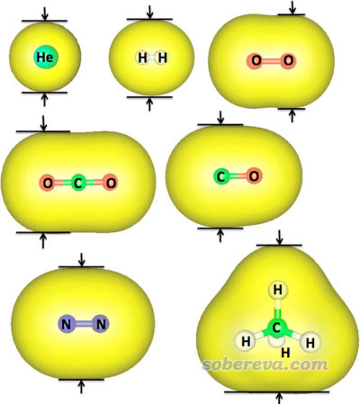
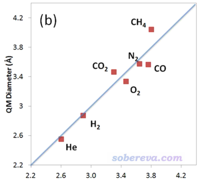
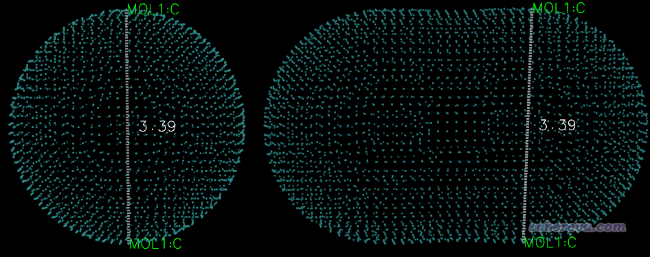
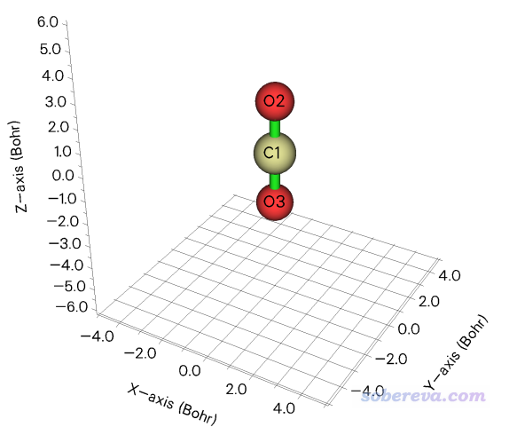

**使用Multiwfn计算分子的动力学直径**

Using Multiwfn to calculate dynamic diameter of molecules

文/Sobereva@[北京科音](http://www.keinsci.com)

First release: 2019-Aug-19  Last update: 2024-May-4

## 1 相关知识&计算原理

分子直径有很多不同定义。在分子分离研究领域中经常用动力学直径（kinetic diameter）体现分子尺寸，这个量没有一般性的方法，直到现在，主要来源还是Breck很老的1974年的Zeolite Molecular Sieves; Structure, Chemistry and Use一书，数值是通过气体在不同温度和压力下的第二维里系数实验和Lennard-Jones势的形式推出来的，动力学直径对应LJ作用为0的情况。

在J. Phys. Chem. A, 118, 1150 (2014)文中，作者提出了基于分子电子密度等值面的估计分子动力学直径的方法。对于文中测试的一系列小分子，计算结果和被普遍采用的Breck书里的那些值有不错的线性相关性，因此此文的做法可以作为一个普适型的算动力学直径的做法。

分子表面可以通过电子密度等值面来定义，这点我在很多博文里提过，比如《使用Multiwfn和VMD计算分子表面积和片段表面积》（<http://sobereva.com/487>）、《谈谈分子体积的计算》（<http://sobereva.com/102>）、《使用Multiwfn的定量分子表面分析功能预测反应位点、分析分子间相互作用》（<http://sobereva.com/159>）等。JPCA文中的思想是以这种方式定义分子表面，然后测量最短方向的等值面两端的距离，即下面这些例子中的箭头夹着的距离。

前述JPCA文中在PBE0/def2-TZVP级别下考察了不同电子密度下算的动力学直径与Breck的值的线性关系，发现用0.0015 a.u.作为等值面定义效果最好。如下所示，这样计算的几个小分子的动力学直径（纵坐标）与Breck书中的动力学直径（横坐标）的线性关系不错。

如JPCA文中表2所示，用0.0015 a.u.作为等值面数值计算后，原理上最好再除以拟合出来的系数1.025。

此文的方法思想非常简单，也没有考虑分子在实际环境中电子的可极化效应导致对动力学直径产生的影响。但不管怎么说，这个方法还是比较有实用性的，如果被考察的分子查不到现成的动力学直径，不妨用这个方法粗略估计一下。

JPCA这篇文章的方法可以通过Multiwfn的定量分子表面分析功能非常容易地实现，下面就以CO2分子为例讲一下如何计算。对Multiwfn完全不了解者参看《Multiwfn FAQ》（<http://sobereva.com/452>）、《详谈Multiwfn支持的输入文件类型、产生方法以及相互转换》（<http://sobereva.com/379>）。使用Multiwfn以这种方式计算动力学直径已经被很多文章所使用，例如Nature (2024) DOI: 10.1038/s41586-024-07342-y。

## 2 计算实例：CO2

这里我们首先用Gaussian程序优化CO2并产生它的波函数。笔者用的是Gaussian16 A.03，计算级别用的和JPCA里相同，即PBE0/def2-TZVP。输入文件如下

%chk=C:\CO2.chk  
# PBE1PBE/def2TZVP opt  
[空行]  
Title Card Required  
[空行]  
0 1  
 C                  0.00000000    0.00000000    0.00000000  
 O                  0.00000000    0.00000000    1.25840000  
 O                  0.00000000    0.00000000   -1.25840000

将CO2.chk用formchk转换成CO2.fch，之后就可以用Multiwfn计算了，此文件可以从这里下载：<http://sobereva.com/attach/503/file.rar>。用Multiwfn载入CO2.fch，然后输入以下命令  
12  //定量分子表面分析  
1   //选择表面的定义  
1   //用电子密度等值面作为表面  
0.0015  //用0.0015 a.u.作为等值面数值  
6  //开始分析（但不考虑映射的函数，因为这不是我们目前感兴趣的）  
6  //将表面顶点坐标导出为当前目录下的vtx.pdb

现在，通过vtx.pdb我们就可以考察动力学直径了，有两种方法可以实现。下文的“方法1”最普适，可以用于任意形状体系，但需要借助VMD，且眼力不能太差，要有耐心；而“方法2”的做法省事得多，不过没那么灵活，不适合形状复杂的情况。

### 方法1：通过VMD测量表面顶点间距离

在<http://www.ks.uiuc.edu/Research/vmd/>下载VMD并安装，启动后将vtx.pdb拖入其中，在Graphics - Representation里将Drawing Method设为Points。然后在VMD Main窗口选择Display - Orthographic使用正交视角以便于选取顶点。将图形窗口拉大，按键盘上的2进入距离测量模式，恰当旋转分子使得要选的顶点处在容易被选中的位置，然后按照JPCA文中的示意图，点击能反映动力学直径的两个位置的表面顶点。恰当选择后，该体系两个角度的图像如下所示

从VMD的文本窗口中可以读到精确数值：  
Info) Added new Bonds label MOL1:C/MOL1:C = 3.385527  
即动力学直径是3.385埃，和Breck书中的3.31埃相符很好，和JPCA文中表1中的3.469埃也基本吻合（JPCA这篇文章没说具体怎么测量的，但至少我们的测量方法是肯定恰当的）。

用此方法选取顶点时往往会碰到一个问题，就是从某个角度看选取的顶点似乎很合适，但换一个角度看又不那么合适。选取的技巧只可意会不可言传，试多了自然就懂了。点上去之后如果发现不合适想删除标签，可以进入Graphics - Labels，在Atoms和Bonds里圈上条目后点Delete即可删除。

### 方法2：通过Multiwfn直接统计表面顶点的最大、最小坐标

用这个方法前，必须先保证当前体系的最短方向冲着X、Y、Z坐标轴之一。比如对于CO2.fch，利用Multiwfn主功能0一看就可以看出最短轴是X或Y方向，如下所示，因此这个体系可以用下面的方法考察动力学直径。

启动Multiwfn并载入vtx.pdb，进入主功能100，然后进入子功能21，这个功能专门考察体系的几何信息。然后输入all，从输出文件中可以找到以下信息  
  Minimum X is   -1.69400000 Angstrom, at atom   134(C )  
 Minimum Y is   -1.69400000 Angstrom, at atom  2112(C )  
 Minimum Z is   -2.75500000 Angstrom, at atom  2177(C )  
 Maximum X is    1.69300000 Angstrom, at atom  4249(C )  
 Maximum Y is    1.69400000 Angstrom, at atom  2244(C )  
 Maximum Z is    2.75600000 Angstrom, at atom  2179(C )

由于Y轴方向原子位置（当前语境下对应表面顶点位置）最小值是-1.694，最大值是1.694，因此CO2的动力学直径是1.694*2=3.388埃。此数值和“方法1”肉眼测量的3.385埃很接近，显然用这种方法比方法1省事得多，还可以避免肉眼测量可能造成的不准确。但实际研究的分子往往比此例复杂得多，此方法未必总适用。有时虽然可以用，但Gaussian算之前可能需要将分子先恰当旋转到合适朝向，并且计算时加上nosymm关键词避免自动被旋转，详见《谈谈Gaussian中的对称性与nosymm关键词的使用》（<http://sobereva.com/297>）。

值得一提的是，利用Multiwfn和VMD，不仅可以像上文这样考察分子的外径，还能通过测量表面顶点距离的方式考察环状、笼状分子的内径。在《一篇最全面、系统的研究新颖独特的18碳环的理论文章》（<http://sobereva.com/524>）介绍的笔者的论文中就用Multiwfn+VMD测量了18碳环的内径，并讨论什么样的分子有可能穿过去，感兴趣的读者建议看看。

Multiwfn还专门有计算分子孔洞直径的功能，见《使用Multiwfn计算分子和晶体中孔洞的直径》（<http://sobereva.com/643>），只不过这是基于原子坐标和范德华半径，而非基于电子密度等值面算的。
