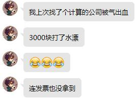
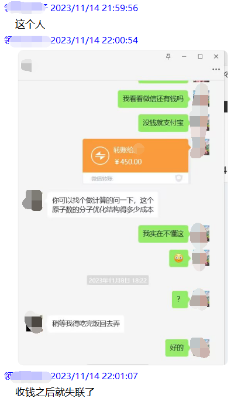
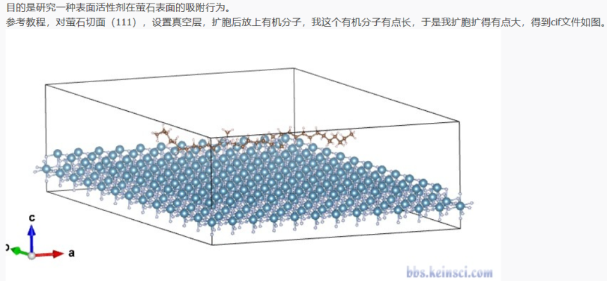
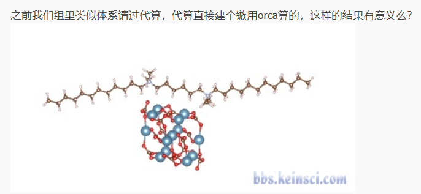
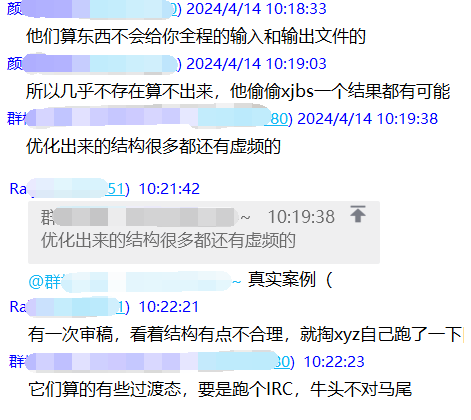
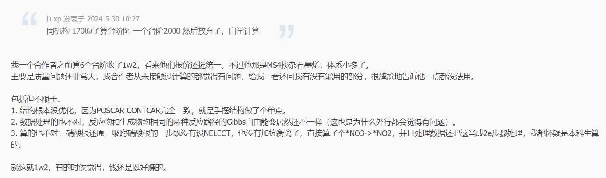
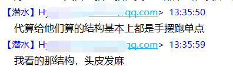
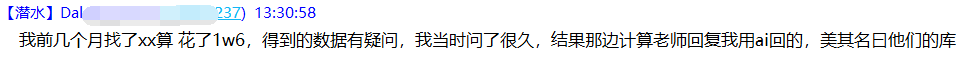
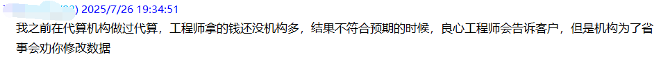
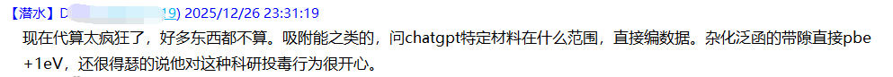

**谈谈我对计算化学代算的看法**

**My personal views on computational chemistry study by agent**

文/Sobereva

First release: 2019-Aug-20   Last update: 2025-Dec-26

时常有人在群里、论坛里，或者直接邮件问我，他要算***问题，哪里可以提供计算化学代算、哪里有靠谱的。我从2014年开始专门做过两年多代算，那时候总共接过的代算任务有将近90个。在那个时候还没有像现在这样的代算产业，我算是代算领域的鼻祖了，而且很可能还是代算这个概念的发明人，现在那些搞代算的个人或机构基本都不同程度受了我的直接或间接的影响。对于代算这方面我是很有发言权的，如今看到各种代算乱象，觉得有必要写一篇文章谈谈我的看法。顺带一提，我早已不再接任何代算了（**我也十分反感有人私窗/发站内信问我是否接代算**），而是提供极高含金量的计算化学的培训（见<http://www.keinsci.com>的“科研培训”栏目）。正所谓“授人以猪不如授人以豢”（我原创的），通过培训充分教会别人怎么做计算、令其有自主研究问题的能力，远远比起直接给别人算出来数据有意义得多得多。

本文里我基本的观点是：提供代算的机构里良心的极少。如果需要算的问题不是操作工简简单单就能完成的那种，应当去找专门方向的理论计算课题组合作，而不是去找代算，否则极可能花不少钱最后文章也发不出来。如果要算的是非常简单、直白、只需要最最基本的操作而几乎不需要经验和动脑的任务，与其去找代算机构冒着被宰的风险，还不如找圈子里的在读学生或者淘宝上的人给你算，价格比较公道和透明（需要开发票的情况除外）。但我绝不是说所有代算机构都是很黑或者不负责任的，但如果你问我哪家是良心和靠谱的，反正我是不知道，无法给予答复。

下面我先说一个最关键的问题，即代算到底靠不靠谱。然后在第2节再说一些找人代算/给别人代算需要注意的事情。计算化学的面非常广，本文在讨论时我主要从我代算经历最多的量子化学角度来谈，对其它类型代算大家也要注意类似问题。

另外，在笔者的QQ群里的聊天中，看到有个人差点被山寨代算机构骗了1500块钱，我相信这绝对不是个例，强烈建议大家看看，了解一下不懂计算的人找乱代算有多么危险：《外行人别轻易找量子化学代算》（<http://bbs.keinsci.com/thread-19519-1-1.html>）。更糟糕的是，乱找代算，可能发票也拿不到，自己的钱白打了水漂，还弄得一肚子气，这是群聊里的一个截图：

下图是群里一个人向我举报的情况，他试图求代算，在群里联系了一个人给他了450块钱，结果对方消失了

## 哪怕你自己不打算实际上手做计算（如没时间、没服务器），就是要找代算，也极其强烈推荐通过北京科音计算化学培训班（见<http://www.keinsci.com/workshop.html>）系统学学相关知识，哪怕不想花时间学具体计算操作也至少要具备相关素养。否则被黑心的代算严重忽悠、坑上万块钱都浑然不知，而且也不知道怎么正确、有效地和靠谱的代算交流，以及提出合理的计算要求和准确理解代算结果。而且通过北京科音的培训完整系统学习计算化学知识，还能充分避免被AI产生的各种坑爹的文字骗、令你白绕弯路甚至被带到沟里的可能。

## 1 代算到底靠不靠谱？

代算绝对没有很多不搞理论计算的人想象的那么简单！！！

计算化学能从深层次探究、阐明大量光靠一般实验手段弄不清楚的问题，现在想要发高IF的期刊，光靠纯实验越来越难，将理论计算结合进去的必要性越来越高。理论计算绝对不是像某些搞实验的人想象的那么容易。理论计算在我来看，由易到难可以分为三类：  
(1)简单体系的计算一些很简单的任务。比如计算HOMO/LUMO能级、计算偶极矩、优化分子结构、绘制分子表面静电势、计算电子激发能、计算红外和拉曼光谱等等。如果被计算的体系简单的话，算这些确实很容易，给高中生培训一下都能算。  
(2)牵扯到乱七八糟问题的常见体系的普通任务。即便计算上述这些司空见惯的普通问题，碰上复杂的情况考虑起来很麻烦，涉及到一堆坑。比如一个柔性分子，可能有很多构象，对偶极矩、分子结构、电子光谱影响往往很大，怎么去恰当考虑？有时候溶剂效应对UV-Vis或ECD谱的影响不是写个关键词就能充分体现，需要考虑显式溶剂乃至动态效应，怎么恰当去搞？算荧光是常见计算问题，可有些体系荧光不是那么简单，可能从S2发射，也可能从S1不同极小点发射，溶质分子可能形成多聚体而明显影响发光特征，这一大堆乱七八糟的因素怎么充分考虑使得结果能和实验对上？  
(3)复杂、综合性需要探究的任务。比如做实验的人想解释一个实验现象，让一个做计算的人去研究，那里面牵扯到的计算步骤、需要反复思考/琢磨/尝试的地方、需要查阅相关的理论计算和实验文章太多了，难度高的甚至要做几个月甚至半年。还很有可能受限于当下计算方法学和计算能力，以及研究者自身经验水平，最后白忙活一通，最终也没能让算出来的数据充分解释/支持实验。像这种较复杂的研究，通常都可以作为一个独立的paper的素材。

现在有些代算机构各处打广告提供代算，好像显得神通广大无所不能似的，还弄个像模像样的代算任务表格交由需求代算的人填写，显得好像很正规，似乎按照他们的“流程”就没有他们算不了的问题似的。这种，作为理论计算的内行一看就知道不靠谱！要明白代算机构绝大多数都是冲着钱去的，代算是商业行为，钱赚到了目的就达到了，能有几个代算机构是真心想着帮助你的文章能顺利发表到好期刊？前面说了理论计算有那种很简单的，这些机构确实能快速给你算出正确、有用的数据，但是由于你不知理论计算的深浅、不同问题所需计算量的大小和计算步骤，没良心的（也是大多数的）代算机构会利用信息不对称宰你一刀。可能在网上找个计算圈子里的学生，两百块钱就能给你算的简单数据，那些机构要一千五乃至两千多（这不是瞎说，之前群里讨论时有人说，某机构算个分子轨道居然收了两千块钱！）。

而对于前面说的那种更复杂的、需要一定经验、得考虑构象/溶剂等等乱七八糟效应的计算的情况，代算机构能给你的数据的可靠性就很难保证了，主要原因之一是你往往太好骗了，你不懂怎么计算才是真正合理的。比方说，你给代算机构提供了一个药物分子的结构，让他给你预测溶液中的电子光谱，然后过些天，你拿到了结果，由于光谱乍看起来没有硬伤，你觉得挺满意，把钱交了。然而，你可知他在计算时候怎么算的？计算流程合理么？用的计算级别恰当么？用的结构是稳定结构么（有没有虚频）？做构象搜索考虑了构象平均了么？用的什么质子化态算的？怎么考虑的溶剂效应？这些都不是小问题，一个因素考虑不恰当，算的结果就可能和实验差相当大。对这样的任务，若代算的人给你算出有价值的数据，不仅代算的人要非常懂行、有经验，还需要他真的有良心才行。要是碰上没良心的，他可能没有考虑溶剂、没有考虑构象平均、优化完了也不检查有无虚频、用一个很便宜的精度在内行看来很垃圾的级别做这些计算。这样他自己省事了，比起恰当考虑那些效应/因素所需的步骤少得多，计算耗时低了几百倍，然而算出的结果根本不准确。等你回头把那个物质测出来实验谱，你届时可能会发现和算的结果相差极其离谱。可这时候，你再找人家说理，人家就不理你了，反正你钱已经交了。你若还想让人家重算，人家会说，要算更高精度数据太复杂啦，完整考虑那些效应你得再交***钱（可能是最初人家给你报价的5倍以上，是你无力支付的）....

前面还说了，有些问题是复杂、综合性的问题，比如解释某个搞实验的人想不明白的实验现象、通过计算推测个复杂反应的机理。这种问题想让代算的人通过理论计算给你解答，完全是异想天开。前面说过，这等问题的计算研究，那都是可以作为单独的纯理论计算paper的内容，通过计算把这些问题搞清楚了可能都能发个3区乃至2区的期刊。而代算机构的目的是赚钱，哪有工夫“帮你搞科研”、“帮你发文章”？不搞计算的外行人，不知道理论计算什么能行什么不能行、适合什么不适合什么，以为把复杂问题直接丢给那些“万能”的代算机构就直接能解决了，这是何等的天真！无良的代算机构，接到这样的可能完全超越他们自身能力或精力的代算任务时，为了能赚钱，往往也会不负责任地拍着胸脯说：“没问题！能算！价格是***”。然后呢，他们会做一些计算，一旦发现棘手的情况（比如很优化难收敛、虚频消不干净）、碰见不理想的计算结果（比如电子光谱和实际差了50~100nm）、发现得到能用的结果需要用极其昂贵的级别（比如确实需要用很贵的CCSD(T)或费事的多参考方法算）、遇见算不出来的问题（比如试了几把还找不到过渡态），他们绝对不去去花精力和计算资源想办法给你算出来、把问题圆满地解决，而是会瞎凑合一下；而遇到解释不通实验的地方，他们也不会去花时间给你调研文献、反复琢磨，而是稀里糊涂瞎弄一下，凑凑数据胡解释一通就算交差了，严重的情况甚至可能伪造数据来和你提供的实验数据或现象对上（人家觉得反正你也看不懂计算输出，造假你也不知道。如果你要对方提供输出文件以便你认识的内行检查，人家可能说没有保存，不给你）。所以啊，凡是号称什么都能算的机构，碰见复杂问题，返回来的是什么鬼数据都不知道！可能最后你很不满意，但如果你先交了钱或者先付了定金，那就打水漂了，一般都要不回来了，人家会说人家都已经给你花精力和机时算了，无法退款。还可能骗你说算的数据不好是因为目前理论计算领域的发展至多只能算到这种程度、没法算得更好了，你由于不懂计算，也只能信了。如果你去问内行，内行人指出代算机构是胡算瞎算，或者审稿人明确指出他们的计算明显不靠谱，当你要求他们重算的时候，8成就联系不上他们了，或者根本就不再理你。

之前我在群里让某个明显被代算机构坑了的人甭去找代算，那个人还说他找的是xxx，是正规机构，言下之意他觉得自己没被坑。真是搞笑，哪个代算机构广告发得多，哪个机构就是正规机构、就不会坑你了？有这种认知的人被坑也完全不值得同情。也正是因为这样的人傻钱多的人太多，急于靠钱来解决问题，那些黑心代算机构才因此赚得盆满钵满。

代算这么多坑，那么，什么样的能代算？什么样的不能代算？综上所述，前面提到的第(1)类问题是可以代算的，找谁算基本都差不多，本身不需要代算者有很丰富的经验和责任心，也没有太大的门道。这类代算就类似于测试中心，你给个样品，对方按照标准化的操作流程测试出各种数据，结果是什么就是什么，也不存在太多可产生争议的地方（但是即便如此，也不能找太不靠谱、太新手的人给你算。没准你让他算个某有机分子的HOMO、LUMO能级，他直接拿ChemDraw画出来用Chem3D生成一个粗劣结构，然后用巨垃圾的HF/6-31G级别算个单点任务然后给你结果）。

如果不属于上述第(1)类的代算，而是那些确实有一定水平且负责任的人才有可能合理计算的任务，我不建议找人代算（因为能得到可靠、合理数据的几率不高），而是最好找理论化学课题组合作发文章。有一点极其关键：**只有文章里挂上对方的名字，对方才有可能真心实意地、花精力和脑力认真去做这个计算任务！**因为这文章既是你的也是他的，他必然得对他算出的数据负责；也只有他算的数据可靠、准确，最后文章也才能发到较好期刊上。找这些理论课题组合作一点都不难，因为如今国内做理论计算的人非常多，而且增速迅猛，师生加起来得有好几万。你可以在相关的论坛（如人气最高的计算化学论坛“计算化学公社” <http://bbs.keinsci.com>）里发帖求合作，或者去看主流期刊里的国内高校和研究所发表的和你研究的问题有关的计算文章，通过通讯作者的邮箱联系他们。

这里给个有代表性的例子，让大家看看随便找代算有多坑（原帖<http://bbs.keinsci.com/thread-25694-1-1.html>）。有人要算这么个问题

下图是代算给他计算用的模型，在内行人眼里完全就是个笑话，就那么一丁点簇结构还能近似表现固体表面？真是找人花钱算出个笑料！遇到内行审稿人，这计算100%会被严重质疑、要求重算，而就算碰到的审稿人都是外行，从而文章侥幸发表了，这也会成为自己科研的污点，被文章读者们笑话。

这是我建立的一个QQ群内他人的交流讨论，看看时下的代算机构普遍都多么不负责、没内行人把关的情况下找代算多么危险：

代算各种偷工减料是常态，这是<http://bbs.keinsci.com/thread-45966-1-1.html>里曝光的情况，且不说代算的人有没有计算经验了，居然直接摆结构都不做优化，真是逆天的赤果果的欺骗！无耻的程度令人瞠目结舌！

这种行为在思想家公社的大杂烩群里也同样有曝光：

现在的一些代算，乃至有的付费广告打得很响的，竟然直接靠AI随便应付客户：

更有代算公司甚至敢数据造假！乱找代算公司，真是自找最终文章被撤稿！

## 2 代算的其它问题

写含有计算内容的文章的时候，显然得对计算细节进行描述、对计算的结果进行恰当的分析讨论。如果你对计算一窍不通，让别人代算的话，别人光给你计算结果、图片是不够的，应当要求对方把你的文章computational details段落也写出来，并且里面插入恰当的要引入的文献，否则文章肯定发不出去，审稿人会让你补充这部分内容。另外，由于你对理论计算的知识可能很缺乏，在对计算数据进行分析讨论的时候可能需要代算的人辅助。但代算的人一般不愿意无偿协助你写文章的这些部分，如果没有事先约定的话，在这方面向你额外收费是正常的。所以如果需要代算的人在你的文章撰写阶段提供帮助，应当事先跟人家说好。

在文章投出去之后，往往审稿人会对你文章里的计算的方法学或者相关分析讨论有所comment，或者让你补算一些数据。有良心、能给你靠谱数据的代算的人，会在这个阶段给你提供帮助，协助你回复审稿人的意见，但这严格来说不属于代算的人的“义务”。所以，在代算之前，应当在回复审稿意见这方面进行约定，是否收费以及如何收费。这要是不说清楚，到时候代算的人不帮你回复审稿人，你觉得对方不负责任，而对方又嫌你粘人、烦人，觉得明明给你算完了怎么你还有一堆破事要纠缠他。

计算中用到的程序版权问题是要重视的。大量主流计算化学都是收费的，比如量子化学计算最常用的Gaussian、第一性原理领域常用的VASP。如果代算的人用了这些收费程序，你肯定得在文章里说明用的是什么程序，若你自己没通过正规方式购买程序的版权，那么文章发出去之后，被开发者知道，有吃官司、被要求撤稿、进入用户黑名单以后再也无法购买程序的风险。那怎么解决版权问题？无非就这四种  
(1)发文章前老老实实购买使用版权。购买方式大多数情况都会在程序官网上写明  
(2)找个有版权的人挂名  
(3)事先要求代算的用免费的程序给你代算。比如量化程序用ORCA，第一性原理计算用Quantum Espresso或CP2K等  
(4)如果你用的程序如Gaussian已经有学院里的人买了site license，整个学院的人都能合法使用，你就不用再买了，你得向同事或者代理商打听一下有没有买过site license。  
当然，还有一些不可描述的解决方法，由于严格来说不合法，或者过于投机取巧，我就不说了。

顺带一提，有一些代算机构，在宣传信息里标榜“正版软件授权”，还对找他们代算的人说“只要致谢了他们就可以”，这完全就是在坑害对方！可能最终对方会被这种不负责任的说法坑得很惨！这些代算机构，他们不是官方代理，程序开发者根本都不知道他们是谁，他们说致谢他们一下就不用花大价钱买程序了？明显是开玩笑！代算方买过使用版权，绝对不代表给别人代算的时候别人也等于有合法版权。倘若用户只要致谢一下有版权的某人就能解决版权问题，程序开发者得少卖出去多少份copy，损失得多大？你觉得官方开发者能答应么？我前面说很多代算机构很不靠谱，就想着多接代算多捞钱，这从某些机构关于程序版权的这种不负责任的发言上就可见一斑。如果你真觉得致谢一下有版权的代算方就不用买程序了，最起码，你得去程序官网上查询客服的电子邮箱，发邮件向官方问清楚这样是否属于正当行为。可能有人心想，我也没买程序使用版权，但是之前发文章时用这程序不是一直也没事？可别心存侥幸，这就跟酒驾一样，没逮着什么事也没有，一旦逮着就是大事！

关于代算的价格，这是一个很不透明的区域，目前代算机构极少有明码标价的。由于现在代算机构还不算多，竞争还不太激烈，不同类型任务算不同类型体系是什么价格也没有一个一般化的标准。代算机构普遍想着多捞钱，因此宰人现象严重、频发。如果你真的必须去找代算机构，建议你多问几家，也可以去理论计算的群或者论坛里问问内行，看看内行人对那些机构的报价如何评价，如果水分太大一下子就会被内行人拆穿。如前所述，笔者当年也做过很多代算，当年笔者的定价是这样的：<http://www.keinsci.com/fee.shtml>。当然了，近些年通货膨胀极其厉害，如今的报价不能与当年同日而语，但是以我的评价标准来看，如果对方给你的报价比起这个网页里高得太离谱，比如高三四倍，那就很坑爹了，你可以轻易从量化计算学术交流群或者论坛上找到要价低得多的同样能给你做代算的人。另外，我认为以上面这个页面里这种形式给出报价，是靠谱的代算机构的应有的作风。决定代算花费的关键因素是什么？显然就是计算量和人力的付出。这就像修手机，需要更换不同配件都有不同的价格。我认为，但凡靠谱的代算机构，都应该制定这样一个价目表并且挂出来，明码标价，一方面显示出代算提供方有专业性，是内行、靠谱（黑心机构肯定不敢这样暴露自己的收费标准），而需要代算的人看了也更放心，不用担心对方会漫天要价而被宰。

现在有很多人提供私人的代算，比如淘宝上一搜就能找到不少。那些代算的，可靠程度如何我无从判断，但似乎整体价格还可以，大部分不黑，毕竟要价都是公开的，大家都可以互相对比，所以水分不会太大。但私人代算有个问题就是不一定能开发票，而大多数人代算肯定都是要开发票报销的，这点得事先考虑好、问清楚。

由于我之前做过大量的代算，作为提供代算的一方，我对一些问题也深有感触，所以这里我也从给别人代算的角度，给提供代算的和需求代算的人提一些意见和建议。  
(1)对需要代算的人，应当给其交代清楚具体计算流程，这样收费比较透明，减少之后可能有的争执。对于很多问题，有的计算流程和计算级别精度高但耗时高，也有的精度低而耗时也低，需要代算的人不知道这些，代算者有义务让对方结合实际需求和可接受的花费进行选择，并且提供指导意见。别为了代算时候省事就都给对方用简单便宜的计算方式，到时候对方发文章的时候可能被审稿人嫌弃，回头还得重算。  
(2)需求代算的人不要向代算者提一些无理、不合基本逻辑的要求，否则会令代算者很为难。比如之前我接过一个动力学模拟的代算，算一个分子多聚体，明明跑出来的团簇结构就是椭圆的，从分子结构特征、相互作用角度来说都是很合理的结果，可对方偏偏非要跑出来圆的，完全莫名其妙，也不知道是出于什么极其特殊的理由。于是我只能从轨迹里取一个看起来最接近圆的一帧给他，他满意地接受了（虽然这从计算角度来说说不通，但对方非要这样的结果我也着实没办法）。  
(3)向代算的人提出代算要求时，不要隐藏已知数据、隐藏自己对结果的期望，而是应当把尽可能多的信息、自己希望要什么结果都一次性说清楚，免得之后有争执，而且一定要确定自己给代算的人提供的信息是正确的，免得对方做无用功。比如我之前给别人算了一个有机分子的荧光，本身算这种过程不麻烦，按照一般讨论就是优化S1态，然后取最后的激发能和振子强度绘图就完了。本以为这个过程花不了多少时间，于是就接了。等到都算完了，对方才说算的结果和实验差得较多，而事先他也不说他们已经有的实验结果是多少。于是我之后又花了很大精力尝试其它计算方式，查看相关文献，折腾一番后终于发现问题在于对方提供的分子结构本来就是错的，在他实验的溶液环境中那个分子的质子化态和他提供给我的结构根本就不符。最后对方又追加新的要求和数据，弄得我又得给他考虑S2、内转换问题，还算旋轨耦合，最终给他算的内容比起他一开始说的“我要对xxx分子算个荧光”麻烦、复杂了至少10倍，早知道需要花我这么大精力我都不接这任务了。还有一次，对方让我算个抗冻蛋白，还给我了我一个文献，让我照着做类似的计算。我明显觉得那篇文献的做法不甚合理，模型过于简单了，我也给她提出了我的看法，但她的意思就是让我那么做。等到真给她做完了，她又嫌结果不能说明问题，最终害得我不得不用更复杂、考虑更周全但也费事的多的方式给她算。她要是早说就是需要解释实验现象，我就完全没必要按照她提供的那个文献的做法算了。还有一次，对方要求算个有机大分子的轨道图形，大概收费是两三百，本以为挺简单的事，把作完的图发给他，他又嫌视角不好，改了视角，又嫌配色不好，折腾了半天才完事。对图像配色、角度有那么多零零碎碎的要求，干嘛不事先说清楚？如果语言说不清楚，直接拿文献里的一张图作为例子不就好了？  
PS：我代算定价一直比较良心，不靠这个业务获取任何暴利，而且我对代算出的数据相当认真负责，这也导致我做代算花精力多但又不带来太多获利，再加上上述令我不愉快、烦心的情况，以及偶有碰见一些胡搅蛮缠的人，令我最终决定把代算业务给彻底砍掉了。  
(4)要和代算者商量好计算产生的中间文件怎么处理。显然计算过程涉及到大量输入、输出文件，还有一些其它的文件，比如轨迹文件、格点文件等等。这些文件哪些需要对方提供给自己，哪些不需要故对方可以直接删掉，应该沟通好。比如代算的人用的是Gaussian，你若不告诉对方算完之后需要留着chk文件，原本那批任务算完了之后，你又额外要求对方给出分子轨道图形、用Multiwfn做一些波函数分析，那人家还得给你重算一遍产生chk文件，届时可能还需要为此额外向你收费。当然你可能完全不懂Gaussian，不知道这些细节，这种情况你就应当一次性把要算的所有内容完整告诉代算的人，这样代算者可以规划好流程。我觉得，如果代算的人不反对的话，你最好把他计算中产生的输入、输出等文件都要过来，这样你可以参考着他的文件学习计算套路，也可以之后找内行人参谋这个计算是否合理，自己有计算常识的话也可以看看代算的人有没有玩什么猫腻，而且利用这些文件也便于之后补算新数据。  
(5)以量子化学方式研究问题，必须把被计算的对象和计算条件明确到极致方能开始计算。因此，让别人代算时，要尽量把要算的内容明确化，最好确切到具体算什么结构的什么类型的任务，而不是告诉对方自己想研究什么问题，因为这太含糊了。前面说了，代算的话，只有很简单、内容非常明确的任务，找别人代算一般才是比较靠谱的，否则一方面容易被宰，另一方面如果对方水平不高，设计了不合理的计算流程，不仅你可能会为他算的无意义的数据白花不少钱，还可能最后算完的数据不能满足你的最初要求。我觉得，如果你要算的东西不是那么傻瓜化、一两步任务就可以完成的话，那么对代算的人最友好的表达你要算的东西的方式是直接给对方提供一个文献，明确告诉对方，对于我的这个结构，我想要类似文献里某某某数据，那就没有任何歧义了，对方可以清楚明白你要算什么，他有了前人的文章作为参考也能更顺利地算出来你想要的数据。  
(6)给别人代算时，应当事先跟对方讲好整个计算中是否会涉及到收费的程序，对于程序版权问题应给对方合理的提醒和建议。否则对方拿了代算出的数据也没法直接发文章，可能引起麻烦、争议。

最后，我想再说一下，对于那些很适合被代算的很简单、标准的计算任务，我觉得尽量还是应该自己学会计算、自行完成（除非你仅仅是对当前的体系需要理论计算数据，以后再也不需要类似数据了，甚至根本不做科研了，这样自己学计算确实没必要。或者你其实也会计算，但由于机子太烂，只能找有较好计算资源的人代算）。用目前主流的量子化学程序做那些容易代算的任务其实真的很简单，不用懂Linux，不用懂编程，不用很懂数学物理，高中生都能学会，有台个人计算机其实就能顺利完成那些计算（除非体系特别大、精度要求高，不得不用服务器）。参加4天时间的北京科音初级量子化学培训班（<http://www.keinsci.com/KEQC>），对于常见量子化学计算任务包会，不仅以后自己需要用的数据自己都能算了，比让别人代算省钱、省事得多往往还更省时，甚至自己还能给别人代算，赚一些外快，相关信息看《谈谈学量子化学如何正确地入门》（<http://sobereva.com/355>）和北京科音官网<http://www.keinsci.com>的“科研培训”栏目。至于那些比较复杂的计算任务，有的确实需要计算者在相关领域有较多经验和知识，不得不让专业内行帮忙算，但自己若有量化计算底子，看别人的计算也能做到心里有数，沟通起来顺畅得多，用那些数据写文章分析讨论的时候也不会犯一些低级错误、暴露对理论和数据理解上的无知，回复审稿人的时候也不会感到茫然。
