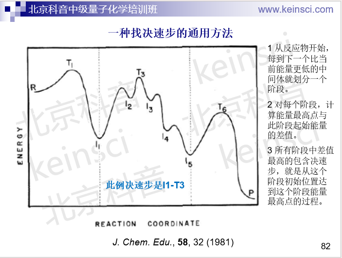
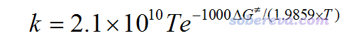
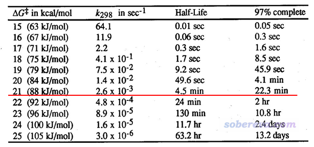
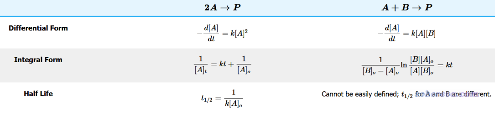

**谈谈如何通过势垒判断反应是否容易发生**

On the judgement whether a reaction is easy to occur based on potential barrier

文/Sobereva@[北京科音](http://www.keinsci.com)

First release: 2019-Aug-23  Last update: 2024-Dec-31

经常有人问“反应势垒小于多少反应才容易发生？”这种问题，本文就专门说一下。

## 1 拿什么来衡量反应快慢？

首先要明确“势垒”或“能垒”（barrier）到底是指什么。这个词比较含糊，可以指代很多种，比如：  
(1)电子能垒：用过渡态结构的电子能量减反应物结构的电子能量。电子能量是指什么这里说了《谈谈该从Gaussian输出文件中的什么地方读电子能量》（<http://sobereva.com/488>）  
(2)焓垒：用过渡态结构的焓减反应物结构的焓。  
(3)自由能垒：用过渡态结构的自由能减反应物结构的自由能。

目前最常用，也比较省事的预测反应速率常数k的方法是Eyring的过渡态理论（transition state theory, TST），它可以写为基于配分函数的形式和基于热力学量的形式；对于后者，k是由自由能垒直接决定的，相关知识和具体公式看《基于过渡态理论计算反应速率常数的Excel表格》（<http://sobereva.com/310>），k可以直接用里面的Excel表格计算。因此，用自由能垒讨论反应是否容易发生无疑是最严格的，自由能怎么算在这里也有明确说明：《使用Shermo结合量子化学程序方便地计算分子的各种热力学数据》（<http://sobereva.com/552>）、《谈谈隐式溶剂模型下溶解自由能和体系自由能的计算》（<http://sobereva.com/327>）。但是，计算自由能得做振动分析，故需要额外多做一步，而且也需要花不少耗时，因此如果你想在讨论时图省事，用电子能垒讨论往往也可以接受，而且电子能量对自由能有主导性（虽然也有很多例外），但这种做法审稿人答不答应那就难说了，很可能届时会让你补算自由能再重新讨论。显然，当我们计算自由能的时候，你考察什么温度下的反应，自由能就应当在什么温度下计算，而使用0K下的自由能（等价于0K下的内能和焓，也等于电子能量加上ZPE）来讨论是没有什么实际意义的。

还有一个词叫活化能（activation energy）。大家学物理化学的时候都学过阿仑尼乌斯公式，里面有一个参数就是活化能。一定要搞清楚，活化能不是通过理论化学的方式直接算出来的，而是根据已知的k与温度的关系（可以根据TST、做实验等方式得到），通过阿仑尼乌斯公式拟合出来的。你可以用Origin等程序拟合，也可以通过比如此文介绍的程序自动进行拟合：《使用KiSThelP结合Gaussian基于过渡态理论计算反应速率常数》（<http://sobereva.com/246>）。然而，在很多文章以及日常讨论中，经常把活化能和能垒这两个词混淆使用，显然这是不妥的。但当具体说“活化自由能”这个词的时候，一般就是指自由能垒；说“活化焓”的时候，一般就是指焓垒。有时候还讨论“活化熵”，对应于过渡态位置的熵减去反应物的熵。  
PS：活化能并非只能通过阿仑尼乌斯公式拟合。利用动力学模拟，对任何动态过程（如扩散）等也可以计算活化能，见J. Phys. Chem. A, 123, 7185 (2019)，这里就不多提了。

实际考察的反应往往是复合反应，即包含很多步基元过程。像这种情况，讨论反应是否容易发生应当取决速步的自由能垒。笔者讲授的北京科音中级量子化学培训班（<http://www.keinsci.com/KBQC>）专门讲反应速率常数计算的部分里给出了一种判断决速步的方法，如下所示。下图示例的过程中决速步对应I1到T3的过程，因此可以用T3的自由能减去I1的自由能作为自由能垒计算k、讨论反应快慢。（注：也有文章如ChemPhysChem, 12, 1413 (2011)主张废除决速步的概念而建议用决速态的概念，确实这样更严格，但这不属于本文讨论范畴。决速步这个东西无疑对于讨论反应问题是很有实用价值的）

实际上自由能垒不是唯一决定反应快慢的量。对很多反应，特别是低温、直接涉及到氢的运动的反应，隧道效应是不容忽视的，甚至对k有关键性影响。计算隧道效应的方法有一大堆，坑很深，这里就不多说了。隧道效应通过透射系数体现，需要乘到原始的k上，在前述我做的Excel表格里就有通过Wigner和Skodje-Truhlar方法计算透射系数的单元格，一看单元格的注释就知道怎么用。另外，根据比TST更精确、严格的变分过渡态理论（VTST）的思想，计算k用的自由能垒其实并不应当是简单地拿比如Gaussian里opt=TS关键词直接找的过渡态的自由能与反应物的自由能相减。VTST具体分为很多种，其中最简单的正则变分过渡态理论（CVT）是用IRC曲线上自由能最大点的自由能与反应物的自由能相减，然后再代入到常规的TST的公式里。

综上所述，决定反应快慢的是反应速率常数k，只有当隧道效应可忽略不计（即透射系数接近于1.0）、过渡态理论基本适用（即不必非得用VTST的场合），我们才能用过渡态结构的自由能减去与之直接相连的反应物的自由能得到的自由能垒来考察反应是否容易发生反应。下面，我们基于这些假设，讨论一下自由能垒低于多少的时候反应算是容易反应。另外别忘了，对于考察多步反应问题，此处说的自由能垒应当取决速步的。

## 2 单分子反应

首先我们看单分子反应，就是一个分子自身发生的反应，这类最常见的就是分子异构化和分子热分解。当温度T以K为单位，自由能垒ΔG≠以kcal/mol为单位，不考虑隧道效应时的TST的计算公式可以明确写为下面的形式（假定转动对称数σ的影响已经体现在了ΔG≠里面了）

单分子反应的半衰期t(1/2)代表反应物浓度降低为初始浓度一半需要的时间。由于这类具有一阶动力学形式的反应满足[At]=[A0]*exp(-k*t)，其中[At]和[A0]分别是t时刻和初始时刻物质的浓度，可知的单分子反应的半衰期为t(1/2)=ln2/k。

比如当T=298.15 K，ΔG≠为30 kcal/mol，代入上式（也可以直接用我的Excel表格算），k为6.2*10^-10 /s，因此半衰期为ln2/(6.2*10^-10)=1117979323秒，折合35年多，时间尺度极大，可见自由能垒为30 kcal/mol时在标况下可以认为不能反应。注意，这里前提是没有其它物质产生催化效应。例如在土壤上的反应，黏土矿物产生的催化作用可以令一些势垒超过60 kcal/mol的反应发生。

下面的表格是常温下反应的ΔG≠不同的时候的情况，里面的k和t(1/2)都可以通过前述公式直接把ΔG≠代进去得到。97% complete相当于是反应基本完毕所花的时间（计算公式为-(ln0.03)/k）。PS：老有人问我这是哪篇文献的，我也忘了，而且没有任何必要问出处（也绝对不要问我），因为把自由能垒代入上面提到的式子直接就能得到表格里的数据。

由图可见，常温下，自由能垒为21 kcal/mol时只需要4.5分钟就可以反应完一半，反应比较快。而半衰期对自由能垒相当敏感，哪怕再提升1 kcal/mol，半衰期也会增加到24 min，这就算已经偏慢了。所以，我们通常对单分子反应以自由能垒<=21 kcal/mol作为标准判断常温下反应是否容易发生。当然，这个判断标准适用的前提是这个反应满足前面提到的各种条件，所以是比较理想化的情况。

上表也体现出自由能计算精度对反应速率常数、半衰期的影响非常大，如果你就用比如B3LYP/6-31G*算自由能垒（包括其中自由能热校正量和电子能量部分），发现结果是20.1 kcal/mol，于是你就说这个反应容易发生，那显然是极度不可靠的，因为这种在现在看起来非常low的档次算自由能垒的误差经常可以达到几kcal/mol。这年头，若计算有机反应自由能垒而且想算得质量不错，起码也得用M06-2X/def2-TZVP。

## 3 双分子反应

双分子反应就是A+B两个分子之间的反应，一般满足二阶动力学特征。根据两个反应物是相同的还是不同的，有不同的式子，如下所示

可见，当发生反应的两个分子相同（两个分子不同但初始浓度相同也属于此情况），半衰期公式是t(1/2)=1/(k*[A0])，其中[A0]是反应物初始的浓度，反应速率常数k可以通过双分子形式的过渡态理论公式来计算，只要把温度和自由能垒代入前述笔者的Excel表格里就能直接得到。由此可见，由于半衰期不仅依赖于k，我们并没有简单办法说双分子反应的自由能垒低于多少算是容易反应的。但如果我们假定[A0]=1 M，T=298.15K，将半衰期为5分钟作为容易反应的标准，那么基于上述笔者计算k的Excel表格并通过Excel的单变量求解功能，可以算出来k大于3.33*10^-3 /(s•M)算是容易反应的，若不考虑隧道效应的话相当于自由能垒应当低于22.7 kcal/mol。另外，从t(1/2)表达式也可以看出，对于满足“容易反应”的条件，反应物初始浓度越高，自由能垒的上限就越高（但影响有限，毕竟自由能垒变化一丁点，对k的影响就足矣抵消[A0]的影响）。

由上面的表也可以看到，如果发生反应的两个分子不同，而且初始浓度也不同的话，浓度随时间的变化公式是比较复杂的，半衰期需要对A分子和B分子分别来定义，而且还必须已知各自的初始浓度，所以这就需要结合具体实验情况来讨论了，这里我就不再多提了。只要初始浓度给定了，那么通过Excel的单变量求解功能，求解出容易发生反应的自由能垒的阈值还是很容易的。

值得注意的是，在计算双分子反应的自由能垒时（为讨论简便，假设是基元反应），反应物的自由能在计算时应当是用两个分子孤立状态下算的自由能加和来得到，而不应当是对反应复合物来计算自由能。因为这样得到的自由能才适合代入TST公式里得到能与实验相对应的k。

顺带一提，有的时候有人问，为什么实验明明容易进行，但从他算出来的势垒上看，根据以上标准，似乎并不容易进行。导致和实验对应不上的因素实在太多了，这里随便举几条：  
(1)计算用的体系的模型和实际不符  
(2)该用自由能垒讨论却用了电子能量讨论  
(3)计算级别太烂或不适合当前体系  
(4)溶剂效应没考虑或考虑不周，诸如有时应当考虑显式溶剂  
(5)计算的反应过程和实际的反应机理不同  
(6)过渡态理论的假设不满足，需要考虑隧道效应或者VTST  
(7)实际中有其它物质对反应有催化但是计算时没考虑  
(8)计算过程读错数据了、数据弄乱了  
(9)数据计算流程不合理，或有低级错误，如：净电荷或自旋多重度设得不对、忘给某些原子定义基组/赝势、极小点或过渡态优化不充分、没考虑波函数稳定性问题  
  
很多人一看到计算结果和实验相符不理想，就盲目地以为当前用的理论方法、基组不合适，这是大错特错。如上面所列举的，诸多方面都可能导致计算和实验不符。而且也有可能实验给出的信息本来就有问题，比如试剂里的某杂质严重影响了反应的进行，做实验的人却没意识到。  
  
如果你对于化学反应的理论计算方面是零基础或者基础薄弱，十分推荐通过北京科音初级量子化学培训班（<http://www.keinsci.com/KEQC>）和北京科音中级量子化学培训班（<http://www.keinsci.com/KBQC>）系统性学习，从而能够得心应手、真正正确地研究化学反应问题。

附：如果你想系统了解与反应动力学有关的基础知识、上面提到的半衰期的推导细节，可以参考以下页面

半衰期：<https://chem.libretexts.org/Bookshelves/Physical_and_Theoretical_Chemistry_Textbook_Maps/Supplemental_Modules_(Physical_and_Theoretical_Chemistry)/Kinetics/Reaction_Rates/Half-lives_and_Pharmacokinetics>  
零阶反应：<https://chem.libretexts.org/Bookshelves/Physical_and_Theoretical_Chemistry_Textbook_Maps/Supplemental_Modules_(Physical_and_Theoretical_Chemistry)/Kinetics/Reaction_Rates/Zero-Order_Reactions>  
一阶反应：<https://chem.libretexts.org/Bookshelves/Physical_and_Theoretical_Chemistry_Textbook_Maps/Supplemental_Modules_(Physical_and_Theoretical_Chemistry)/Kinetics/Reaction_Rates/First-Order_Reactions>  
二阶反应：<https://chem.libretexts.org/Bookshelves/Physical_and_Theoretical_Chemistry_Textbook_Maps/Supplemental_Modules_(Physical_and_Theoretical_Chemistry)/Kinetics/Reaction_Rates/Second-Order_Reactions>
