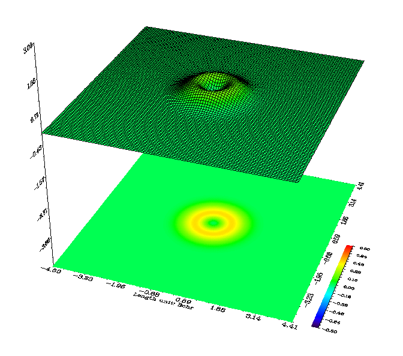

**谈谈5d、6d型d壳层基函数与它们在Gaussian中的标识**On the 5d and 6d type d-shell basis functions and their identification in Gaussian  
  
文/Sobereva@[北京科音](http://www.keinsci.com/)   Last Update: 2011-Jul-30

  
  
在含有d轨道的体系的高斯输出文件中，有时会看到d轨道名以D 0, D+1, D-1, D+2, D-2标识，有人误以为那些轨道就是指复数型真实原子轨道，这是个严重的误区，下面将对此进行讨论。  
  
在高斯等量化程序中，对于非半经验方法用的都是GTF(Gaussian type function)型实函数用来描述原子轨道，以解决双电子多中心积分的麻烦，所以与复数型轨道完全无关。  
  
最常用的高斯型函数是笛卡尔型高斯函数，通式为N*x^a*y^b*z^c*exp(-q*r^2)，N为归一化常数，q为高斯函数的指数，r为以此基函数所在原子为中心的坐标向量。  
  
对于描述d原子轨道，使用d型笛卡尔型GTF作为基函数，包含六种具体形式:xx,yy,zz,xy,xz,yz。例如xy型GTF，其通式中的a=b=1，c=0。然而这6种里面除了xy、yz、xz以外的其它三种笛卡尔型GTF并没有与真实的实形式的原子轨道有直接的对应关系，波函数角度部分的行为明显不一致。  
  
还有一种球谐型高斯函数，也叫原子轨道型高斯函数，通式为N*r^n*exp(-q*r^2)*Y(θ,φ)，其中Y(θ,φ)就是类氢原子轨道的角度部分函数，与STO的区别是指数项的r变为了r^2。球谐型高斯函数与实型原子轨道角度部分行为一致，通过调整收缩系数调整径向行为，就可以一一对应地近似描述实型原子轨道。  
  
笛卡尔型GTF可以线性组合，使角度部分行为与球谐型GTF一致（尽管组合后的函数形式与球谐型仍不同），以用于合理描述原子轨道。对于d型轨道转换比较简单：xy、yz、xz这三种不变，其余三个变成了x^2-y^2、3*z^2-r^2、r^2。（注：r^2=x^2+y^2+z^2）。其中xy、yz、xz、x^2-y^2、3*z^2-r^2这5种就是组合出的d型球谐GTF，也叫纯d型GTF，而r^2函数一般不用，它是一个特殊的球型GTF轨道，在某个径向距离（取决于指数）附近函数值较大，而接近GTF的中心和远离GTF时都很小，其投影地形图如下所示：  
  

  
在高斯中，如果用了5d关键字，就会使用xy、yz、xz、x^2-y^2、3*z^2-r^2这5种轨道描述d轨道。这时输出的d轨道符号会显示D 0, D+1, D-1, D+2, D-2，但显然这决不是指这样由GTF组合出来的波函数的角动量z轴分量的本征值，也不是指这5个轨道用来对应地近似描述5个真实的复数型原子轨道。这样的轨道符号没有意义，还会引起严重混淆，它仅仅是做个标识罢了。  
可以得到这样的对应关系：  
  
作为基函数的GTF   实型真实原子轨道符号   高斯中用了5d关键字后对d轨道的标识  
3*z^2-r^2 ->dz^2     ->d 0  
 xz        ->dxz      ->d+1  
 yz        ->dyz      ->d-1  
 x^2-y^2   ->dx^2-y^2 ->d+2  
 xy        ->dxy      ->d-2  
  
高斯一般默认使用6d关键字（在使用gen等关键字时往往默认为5d）。此时说明使用xx、yy、zz、yz、yx、zx这6种笛卡尔型GTF轨道，在输出的d轨道符号中也对应地以xx、yy、zz、yz、yx、zx标识。在d轨道基函数不分裂情况下，描述d轨道的可独立变分的基函数就相对于5d关键字时的5个增加到了6个，可看到输出文件中basis functions的数目对应地增加了。但无论用5d还是6d，输出文件显示的原始基函数（primitive gaussians，即笛卡尔型GTF）的数目都一样，这是因为5d的5个轨道仍需要有全部6种笛卡尔型d型GTF才能组合出来。比如对5d中的3*z^2-r^2函数来说，将其中r^2展开，可写成N*(2*z^2-x^2-y^2)，即等于zz、xx、yy三种笛卡尔型GTF系数按照2:-1:-1组合并乘上归一化系数，这个比值这是固定的，不会在计算过程中改变，某种意义上也可看作是CGTF（收缩型GTF）。  
  
6d型轨道好处是方便编程，能够直接计算各种积分。缺点很明显，由于缺乏与真实原子轨道的对应关系，结果不像用5d的结果那样方便分析。虽然这6个笛卡尔型轨道不直接对应于真实原子轨道，但在计算过程中经过变分，其结果同样会展现出真实原子轨道的行为。这是因为以它们为基函数变分的结果，等价于对它们线性变换后的基函数变分的结果。前面已提到，6个笛卡尔型d型GTF线性变换后的6个函数其中的5个就是对应真实轨道的5d型轨道，只不过多增加了一个r^2轨道。换句话说，使用6d关键字，就是在5d型的基函数基础上多添加了一个内部含有节面的s型GTF轨道，由于这个轨道与其它s轨道有不小重叠，会造成一定线性相关问题，所以并不会比5d的结果有多少改进。  
  
7f与10f的关系与5d与6d的关系类似，对于g、h等更高角动量函数也有如上讨论，笛卡尔型与球谐型GTF转换关系将更为复杂，而且组合方法并不唯一（比如有所谓标准纯f集、纯f“立方”集）。计算时若同时含有d和f轨，用5d时应当结合7f，用6d时应当结合10f。顺带一提，6d轨道间不都是正交的，例如XX与YY，而5d轨道间都是正交的，同样10f和7f的关系也是如此。
