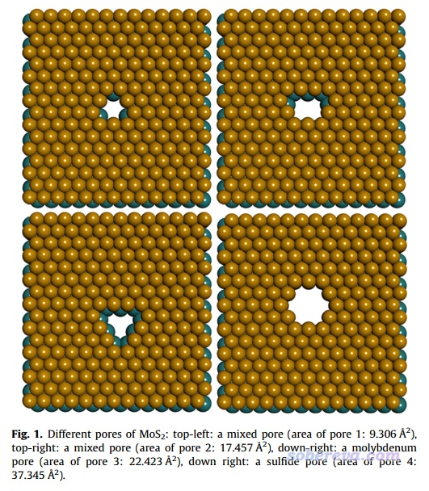
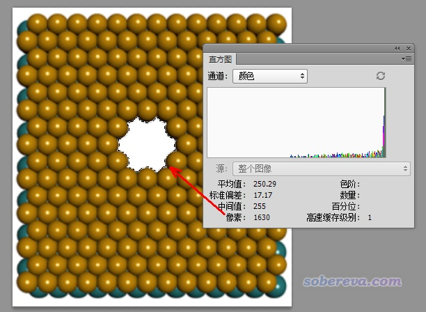
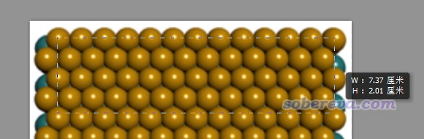
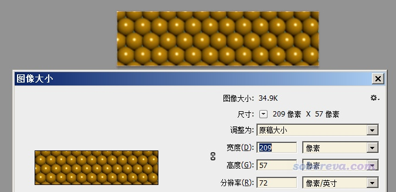

**利用photoshop计算晶体表面孔洞面积**

Using photoshop to calculate hole area on crystal surface

文/Sobereva@[北京科音](http://www.keinsci.com)   2019-Aug-31

今天思想家公社QQ群里有人发了一张图片，问文献中标注的MoS2的孔洞面积是怎么算的

其实用photoshop就可以实现计算。拿上图右下角那个体系为例，我们实际上要统计的就是图中孔洞对应的白色区域的面积。

把图片载入ps，用魔棒工具选择那块白色区域，再点击“窗口”-“直方图”，就看到了选区的像素数为1630。

然后按照下图，用矩形选择工具，从图中最上面一层的最左边的硫的中心位置拉到最右边的硫的中心位置，总共横跨12个S-S键。

然后按ctrl+Q把选区截取出来，再按ctrl+alt+I，可见横向像素是209。

笔者量了一下M$里自带的MoS2的结构中相邻的S之间距离，是3.166埃。因此12个S-S键总长度是3.166*12=37.992埃，因此上图中每个像素对应37.992/209=0.18178埃。因此1630像素面积就折合1630*0.18178*0.18178=53.86 埃^2。

还有一种计算方式是根据原子半径算。我们将S-S键长3.166的一半作为S原子球半径，图中孔洞相当于缺了7个硫，因此面积是7*pi*(3.166/2)^2=55.11 埃^2，和我们用photoshop那种方式算的基本吻合。

至于他人传到群里的那张图里标注的孔洞面积是37.345 埃^2，笔者不知怎么来的，我没有那篇文章，可能文中的数据不合理，反正本文的计算方式无疑是很合理的。值得提醒的是，用photoshop量面积的方式计算的时候，应当使用正交视角显示晶胞，否则由于透视视角的近大远小会导致算出来的面积没有意义。另外，在产生晶体图像的时候最好把像素分辨率设得高一些，这样通过上文的做法统计误差才会较小。
