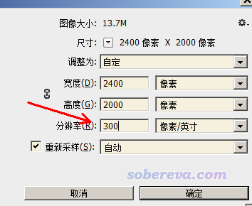

**谈谈怎么正确认识论文投稿时对图像分辨率的要求**

On the correctly understanding the requirements for image resolution when submitting a paper

文/Sobereva@[北京科音](http://www.keinsci.com)   2019-Aug-31

笔者在思想家公社QQ群和计算化学公社论坛交流、答疑时，时常看到有人提到有关图片的分辨率的问题，一些期刊在投稿时对分辨率有明确要求。在讨论中明显可以看出他们对分辨率这个概念缺乏正确的理解，因此导致做一些无意义的处理、考虑无意义的问题，因此笔者在这个小文中专门说说怎么正确认识分辨率。

首先要知道，常用的jpg（亦即jpeg）、gif、bmp、png、tif（亦即tiff）等格式都属于位图，即每个图片是由一大批像素(pixel)构成，每个像素点有不同的颜色值，这种图直接放大显示后会看到马赛克的效果。与位图相对的是矢量图，如svg、eps、pdf等格式，图像通过数学方式定义的线条描述，可以无损缩放。对于矢量图说分辨率是没有意义的。

不同位图文件有宽度的像素值也有高度的像素值，像素总数是二者的乘积。比如一张图片像素是1400*1000，那么像素数是1400000，可以简写为1.4M（一百四十万）。如果把图片打印到印刷品上，打印出来后图片有一定的高度和宽度，我们管它叫打印尺寸。

有一个重要的概念叫dpi（dots per inch），即每英寸像点数。例如一张图的像素数是1200*1000，假设打印尺寸是6*5英寸，那么横向dpi值是1200/6=200，纵向dpi值是1000/5=200，由于二者相同，我们可以简称此图是200 dpi。

分辨率(resolution)在不同语境下具体指代不同。应当明确分为两种：  
• 像素分辨率：这也就是前面说的图片的像素是多少。只要是位图文件，都有这个概念。  
• dpi分辨率：即图片的dpi值。诸如png文件有个header部分，其中专门有个字段记录这个分辨率值。

如果你的图片只在电子设备上显示，那么谈论dpi分辨率是毫无意义的。因为dpi分辨率完全不影响你在屏幕上看到的图像的清晰度，也完全不影响图像文件大小。当在屏幕上以原始尺寸显示图像时（即令图片的每个像素与屏幕的每个像素一一对应显示），肉眼看到的图片尺寸完全是由像素分辨率决定的；而当你把两张像素数都不高的图片在显示器上显示成相同大小时，像素分辨率较高的那个必然显示得更清晰。此外，文件尺寸也完全由像素分辨率决定，比如对于特征和内容相同的两个png文件，显然2400*2000的图像文件大小会比1200*1000的更大。

讨论dpi分辨率仅在涉及打印时有意义。比如有一张图片是2400*2000，如果打印成6*5 inch，就相当于是400 dpi分辨率，而打印成24*20 inch，就相当于100 dpi分辨率。很显然，像前者那样打印成小图，图像就看起来比较精细，而如果打印成后面那样大尺寸，图像自然看起来就粗糙模糊（除非眼睛离印刷品很远），就像把位图图像强行拉大了那样有颗粒感。

显然，对于作图的人来说，以及对于计算机里面的图片来说，只有像素分辨率这个概念。仅当知道打印出来的图像尺寸，才能说dpi。然而在科研论文投稿的时候，经常会看到期刊的author guide里有一条，要求图片分辨率必须是比如300 dpi，这是什么鬼？笔者在这里明确地说，这个要求根本没有丝毫意义！是个完全荒唐的要求！因为投稿的人根本事先就不知道期刊实际印刷出来时这个图像的尺寸是多少。就算你有这个这个期刊的纸质版，能用尺子量一下已出版文章里图片的大小，你也难以事先预料到编辑在排版的时候把这图弄成单栏图还是通栏图，也不知道编辑实际会把这图缩放成什么大小。只有编辑事先告诉你，比如你的某张图排版完了是6*4 inch，要求分辨率是300 dpi，那么我们才知道在实际作图时怎么处理，即图像的宽度应当为6*300=1800，高度应当为4*300=1200。

像JCTC的Author guide里关于cover图的说法还算基本恰当：  
Images to be considered for the cover should be submitted as TIF, EPS, or high-resolution PDF files with a resolution of at least 300 dpi for pixel-based images. The image size is 8.5 in × 8.8 in., 21.6 cm × 22.4 cm, or 2530 pixels × 2640 pixels  
上面的文字虽然开始说非得是300 dpi，显得无厘头，但后面的文字明确说了，图像实际打印尺寸是8.5*8.8 inch，因此我们作图时的宽度和高度应当为8.5*300=2550和2640，这和后面说的“2530 pixels × 2640 pixels”是一致的（稍有偏差是inch表示时的舍入误差所致）。

然而有的期刊就是告诉你，要求投稿时图像是300 dpi（或更高），你也无从得知打印尺寸，那我们作图时到底该怎么办？你根本就别管它这个无理要求就完了！你只要在作图时让图像的像素分辨率足够高即可。比如你的图是2000*1500，这就算很高分辨率图了，哪怕被用于通栏图（即一张图直接横跨整页纸），印刷出来也肯定够清楚。但可能有人说，某些期刊有自动检查机制，发现图片文件达不到比如300 dpi就不接收，怎么搞？很简单，你首先保证像素分辨率足够高（别就用区区400*300这样的图拿去投稿），然后在Photoshop（或其它图像编辑程序）里按Ctrl+Alt+I，直接把dpi值改到300然后保存图像就完了，如下所示

点确定后你会看到像素分辨率、屏幕上看到的图并没有丝毫改变，实质上只不过是把图片的header里的dpi分辨率值改写了一下罢了。

顺带一提，研究表明人类肉眼能夠分辨的最高分辨率是300 dpi，这应当也是为什么很多期刊非要追求这个300 dpi，因为再高了也没意义。另一方面，还有一个打印机分辨率的概念，这取决于打印机的硬件规格，现在一般家用激光打印机都能支持到600 dpi，因此打印已足够精细了，肉眼看不出瑕疵；而用于打票据的针式打印机当中那些比较廉价的则一般只有180 dpi或360*180 dpi，因此肉眼离近了看可以看得出颗粒感。

另外还值得顺带一提的是屏幕分辨率。近年来的新手机在宣传的时候都有个指标叫ppi（pixels per inch），即每英寸像素数，这个指标的定义和dpi是相同的。ppi越大则屏幕上单位面积里能显示的像素越多，看起来越精细。比如荣耀10达到432 ppi，已超过了肉眼可辨别的极限，所以除非用放大镜，否则看不出任何颗粒感。

PS：可能还有人听说过什么显示器分辨率是72 ppi、互联网上的图像是72 dpi之类的说法，早点忘记这些，都是些概念严重错误的说法。
