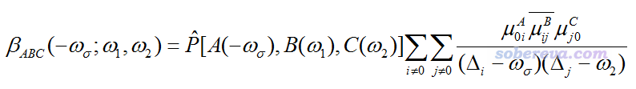
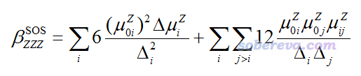
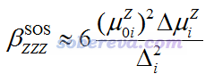
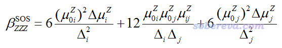
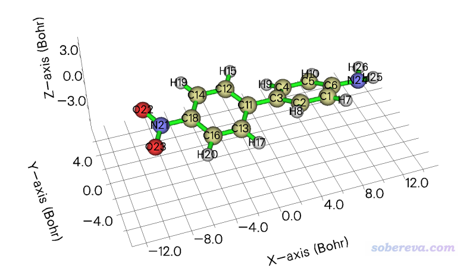

**使用Multiwfn对第一超极化率做双能级和三能级模型分析**

Using Multiwfn to perform two-level and three-level model analyses for first hyperpolarizability

文/Sobereva@[北京科音](http://www.keinsci.com/)

First release: 2019-Sep-6   Last update: 2025-Jun-10

## 1 前言

研究第一超极化率（beta）的文章里经常做一种叫双能级模型的分析用于阐明影响beta的关键因素、便于讨论不同体系beta大小差异的原因，比如在笔者的J. Comput. Chem., 38, 1574 (2017)中就用了这种方式讨论。之前笔者在《谈谈计算第一超极化率的双能级公式》（<http://sobereva.com/361>）里专们对此方法进行了介绍。本质上，双能级公式就是从《使用Multiwfn基于完全态求和(SOS)方法计算极化率和超极化率》（<http://sobereva.com/232>）文中介绍的计算beta的完整的SOS公式中简化来的。

使用双能级公式的前提之一是必须有一个激发态是关键态（crucial state），也就是它对beta的贡献远大于其它激发态，因此可以只用基态和这个激发态来讨论beta。然而很多情况下关键态难以确定、模棱两可，甚至有时候明显能看出就是需要同时考虑两个激发态才能定性正确描述实际的beta，比如第一激发态和第二激发态振子强度都较大而它们的能量差很小，此时就明显不能强行用双能级分析了，得同时把这两个激发态一起考虑，笔者管这叫三能级模型，推导过程见下一节。

为了便于大家实现双能级和三能级分析，Multiwfn在完全态求和(SOS)模块里新增了子功能20，专门进行双/三能及分析，使用相当容易，下面就进行介绍。首先笔者把方法的原理介绍一下，然后给出一个具体分析例子。本文介绍的功能在2025-Jun-10做了重要更新，**读者请务必使用这个日期及之后发布的Multiwfn版本**。

Multiwfn可以在其主页<http://sobereva.com/multiwfn>免费下载。不了解Multiwfn的话看《Multiwfn FAQ》（<http://sobereva.com/452>）、《Multiwfn入门tips》（<http://sobereva.com/167>）。**使用本文介绍的Multiwfn的功能发表文章时请务必引用Multiwfn启动时提示的原文**。

## 2 原理

Multiwfn手册的3.27.2节里对双能级、三能级公式的推导做了非常详细的说明，十分建议一看。这里只是简单提一下关键点。

SOS方法计算beta张量的ABC分量公式如下

对于静态极限（ω=0）的情况，ZZZ分量的公式可以写为以下形式

其中Δi是第i激发态的激发能，μ0i_Z是基态到第i激发态的跃迁偶极矩的Z分量，μij_Z是第i激发态到第j激发态的跃迁偶极矩的Z分量，Δμi_Z是第i激发态的（非弛豫密度对应的）偶极矩矢量与基态偶极矩矢量之差的Z分量。

由上式可见，静态beta的ZZZ分量可以写为每个激发态独自的贡献以及不同激发态之间耦合所产生的贡献之和。如果只有一个激发态起到主导地位，那就可以用下面的双能级模型讨论

如果有两个激发态同时起到关键地位，哪个都不能简单地忽略，那就得用下面的三能级模型讨论，包括两个激发态自身的贡献和二者的耦合项

再强调一下，用双/三能级模型讨论影响beta大小的因素的时候必须满足以下两条：  
(1)beta的总值必须能被beta_XXX、beta_YYY、beta_ZZZ其一所主导，这样我们才能针对起到主导作用的分量来进行双/三能级模型的分析来解释影响beta总大小的主要因素（注：为此，有的时候可能需要在计算前对体系做恰当的旋转来使得以上三个分量之一最大化，从而便于双/三能级分析）  
(2)打算用双能级分析时，必须有一个激发态对被考察的beta分量的贡献远大于其它激发态；打算用三能级分析时，必须有两个激发态的贡献远大于其它激发态。

通常，Donor-pi-acceptor型体系可以满足以上要求。分析前应当令Donor-acceptor连线的方向（或者更广义地说，电子激发时电荷转移的方向）平行于某个笛卡尔轴，以满足上面第(1)条。

## 3 实例

下面就用一个典型的Donor-pi-acceptor型体系“氨基-联苯-硝基”作为例子说一下怎么用Multiwfn做双能级和三能级分析。用到的输入文件满足Multiwfn手册3.21节开头里说的对输入文件的要求即可。简单来说，对于Gaussian用户，一般需要做TDDFT计算，并且写上IOp(9/40=4)关键词，计算后产生的fch和输出文件都需要保留。本例用到的文件D-pi-A.fchk和D-pi-A.out已经提供在了程序包的examples\excit\目录下（注：这个计算任务是在CAM-B3LYP/6-31G(d)级别下完成的，对于考察超极化率来说，用这种不带弥散函数的基组不可能得到准确的结果，但本文仅作为演示，所以暂且忽略这点）。

### 3.1 准备输入文件

首先我们产生Multiwfn的SOS模块的输入文件，这需要依赖D-pi-A.fchk和D-pi-A.out里的信息计算出各个态的偶极矩和态之间的跃迁偶极矩。启动Multiwfn后依次输入  
examples\excit\D-pi-A.fchk  
18  //电子激发分析  
5  //计算各个态的偶极矩和态之间的跃迁偶极矩  
[回车]  //会默认载入examples\excit\D-pi-A.out  
3  //将结果导出为当前目录下的SOS.txt文件

然后就可以做双/三能级分析了。在此之前，返回主菜单，进入主功能0看一眼体系的朝向，如下所示。可见体系是顺着X方向的，因此我们之后主要考察的是beta_XXX。而且如果你有计算beta的常识的话，也会知道这种体系beta_XXX主宰了总beta，即考察beta_XXX就等于近似考察了总beta。

### 3.2 双能级分析

启动Multiwfn，输入  
SOS.txt  //载入当前目录下的SOS.txt  
24  //(超)极化率分析  
2  //通过完全态求和(SOS)方式研究（超）极化率  
20  //双、三能级分析

此时Multiwfn将所有激发态的基本信息输出了出来，便于用户选择被考察的态。给出的信息包括激发能、基态与各个激发态之间的跃迁偶极矩，各个激发态的偶极矩相对于基态的变化。Tot对应矢量的模。

 Excitation energy (E), transition electric dipole moment between ground state and excited state, and variation of dipole moment of excited states w.r.t. ground state  
                  Trans. dipole moment (a.u.)        Var. dipole moment (a.u.)  
 State   E(eV)     X       Y       Z      Tot        X       Y       Z      Tot  
    1   3.9069   0.444  -0.000  -0.002   0.444    -1.010  -0.001   0.001   1.010  
    2   4.0624   2.528  -0.003  -0.007   2.528     6.563  -0.015  -0.047   6.501  
    3   4.4166  -0.003  -0.002  -0.023   0.024    -1.081   0.002   0.002   1.077  
    4   4.7912   0.001   0.341  -0.013   0.341     1.845  -0.006  -0.015   1.823  
    5   4.8872  -0.004   0.192  -0.171   0.257     0.993  -0.019  -0.049   0.925

可见，第2激发态跃迁偶极矩最大，相对于基态的偶极矩变化也最大，同时激发能又低，可以期望这应当是关键态。

输入1-5，代表对1到5号激发态依次用双能级模型计算beta，结果如下所示。可见第2激发态的beta的XXX分量和Norm（即XXX、YYY、ZZZ的平方和开根号）都远大于其它态，更进一步确认了这是关键态。只考虑第2激发态以双能级模型得到的beta应当较为接近严格计算的beta。

 beta evaluated by two-level model: (a.u.)  
 #    1: XXX=       -58.05  YYY=        -0.00  ZZZ=         0.00  Norm=        58.05  
 #    2: XXX=     11289.12  YYY=        -0.00  ZZZ=        -0.00  Norm=     11289.12  
 #    3: XXX=        -0.00  YYY=         0.00  ZZZ=         0.00  Norm=         0.00  
 #    4: XXX=         0.00  YYY=        -0.15  ZZZ=        -0.00  Norm=         0.15  
 #    5: XXX=         0.00  YYY=        -0.13  ZZZ=        -0.27  Norm=         0.30

再次输入20进入双、三能级分析功能，输入2，就马上看到了第2激发态的信息，比之前看到的更具体。利用这些信息，我们可以讨论这个体系与与它类似的体系的beta的差异主要来自于哪些因素。

 Excited state     2  
 Excitation energy    0.149290 a.u.    4.0624 eV  
 Transition dipole moment (a.u.)  
 X=    2.527776  Y=   -0.003088  Z=   -0.007328  Total=    2.527789  
 Oscillator strength  
 X=    0.635943  Y=    0.000001  Z=    0.000005  Total=    0.635949  
 Variation of dipole moment (a.u.)  
 X=    6.562899  Y=   -0.015345  Z=   -0.046710  Total=    6.563083

 beta evaluated by two-level model: (a.u.)  
 XXX=    11289.1185  YYY=       -0.0000  ZZZ=       -0.0007  Norm=    11289.1185

从以上数据也看到beta_YYY和beta_ZZZ基本都为0，在于这个态的跃迁偶极矩以及偶极矩的变化的Y和Z分量都接近0。

### 3.3 三能级分析

接下来我们用三能级模型进行考察。在Multiwfn窗口里输入  
20  //再次做双/三能级分析  
1,2  //将第1、2激发态用于三能级模型分析

结果如下  
 Excited state     1  
 Excitation energy    0.143576 a.u.    3.9069 eV  
 Transition dipole moment (a.u.)  
 X=    0.444412  Y=   -0.000436  Z=   -0.001817  Total=    0.444416  
 Oscillator strength  
 X=    0.018904  Y=    0.000000  Z=    0.000000  Total=    0.018905  
 Variation of dipole moment (a.u.)  
 X=   -1.009787  Y=   -0.000610  Z=    0.000608  Total=    1.009787

 Excited state     2  
 Excitation energy    0.149290 a.u.    4.0624 eV  
 Transition dipole moment (a.u.)  
 X=    2.527776  Y=   -0.003088  Z=   -0.007328  Total=    2.527789  
 Oscillator strength  
 X=    0.635943  Y=    0.000001  Z=    0.000005  Total=    0.635949  
 Variation of dipole moment (a.u.)  
 X=    6.562899  Y=   -0.015345  Z=   -0.046710  Total=    6.563083

 Transition dipole moment between states     1 to     2: (a.u.)  
 X=    1.475397  Y=   -0.001634  Z=   -0.008677  Total=    1.475423  
 Individual contribution of excited state     1 to beta: (a.u.)  
 XXX=      -58.0482  YYY=       -0.0000  ZZZ=        0.0000  Norm=       58.0482  
 Individual contribution of excited state     2 to beta: (a.u.)  
 XXX=    11289.1185  YYY=       -0.0000  ZZZ=       -0.0007  Norm=    11289.1185  
 Coupling contribution of the two excited states to beta: (a.u.)  
 XXX=      927.8987  YYY=       -0.0000  ZZZ=       -0.0001  Norm=      927.8987

 beta evaluated by three-level model: (a.u.)  
 XXX=    12158.9690  YYY=       -0.0000  ZZZ=       -0.0007  Norm=    12158.9690

可见，Multiwfn先给出了第1、2激发态的具体信息，然后输出了三能级公式里面涉及到的所有量，以及通过三能级模型给出的结果。当必须用三能级模型才能说明问题的情况，大家就可以对不同体系考察上述这些量对beta的影响。

从上面的输出也可以看到对于beta_XXX，第1激发态自身的贡献（-58.0），以及第1激发态与第2激发态之间耦合产生的贡献（927.9）相对于总结果12158.9来说都很小，体现出用双能级模型其实就足够了，而把第1激发态纳入作为三能级模型考察也不会得到更多信息。也很容易理解为什么第1激发态的独自贡献（-58.0）那么小，这是因为双能级模型指出某个激发态对beta的贡献正比于其偶极矩相对于基态的变化量以及跃迁偶极矩的平方，而第1激发态的这两项都不大。

原理上来说，还可以做四能级、五能级...分析，但是由于基本不可能用得到，所以Multiwfn也就没提供相应功能。

顺带一提，有时候我们的电子激发计算的输出文件里可能有很多态，比如50个乃至上百个，但使用双/三能级公式考察的时候一般只会牵扯到最低的几个，显然此时对输出文件里所有激发态都做偶极矩、跃迁偶极矩的计算完全没必要，会造成大量无意义的耗时。为此，可以恰当设定Multiwfn的settings.ini里的maxloadexc，比如设为5，那么主功能18的子功能5就只会读入前5个激发态，计算偶极矩和跃迁偶极矩也只对它们计算，比起算所有激发态会省时甚巨，此时产生的SOS.txt就足矣用于做双/三能级分析了。
