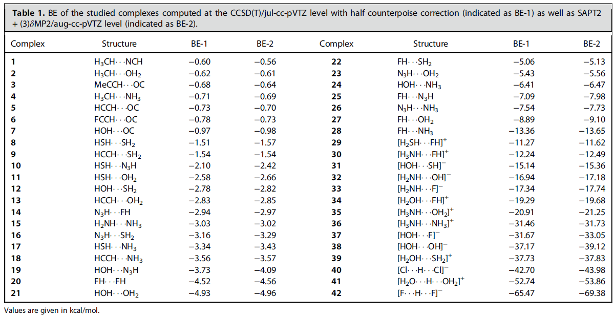
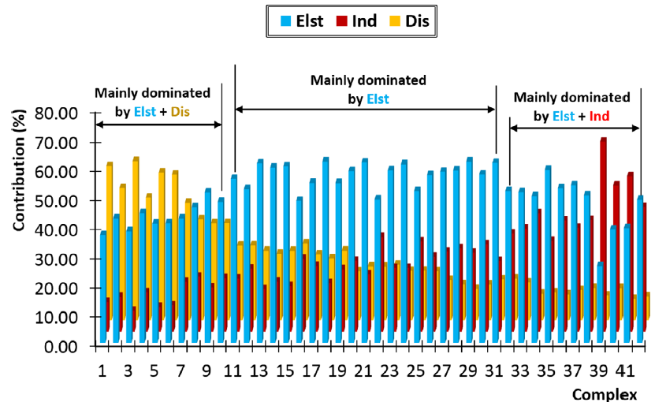
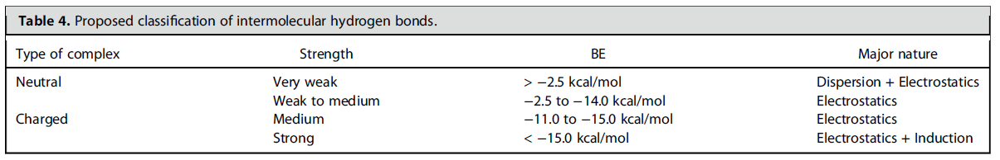
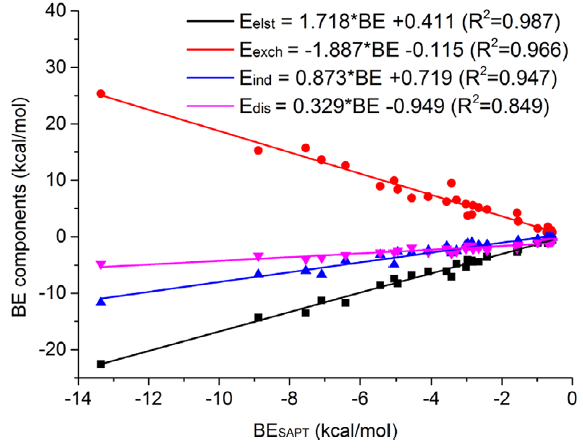
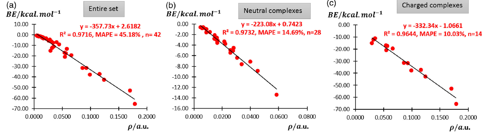
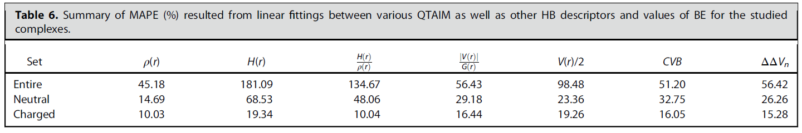
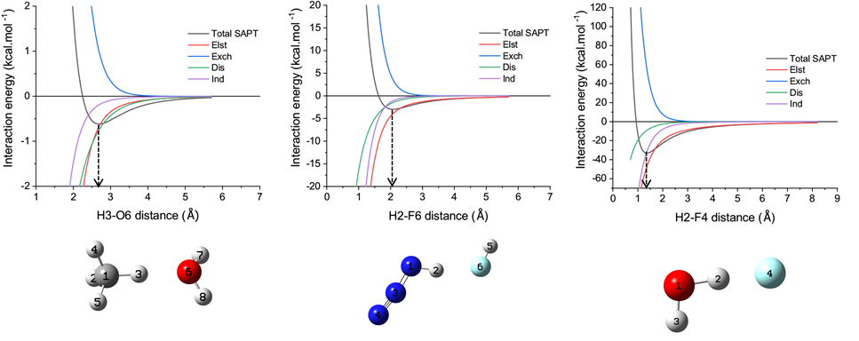
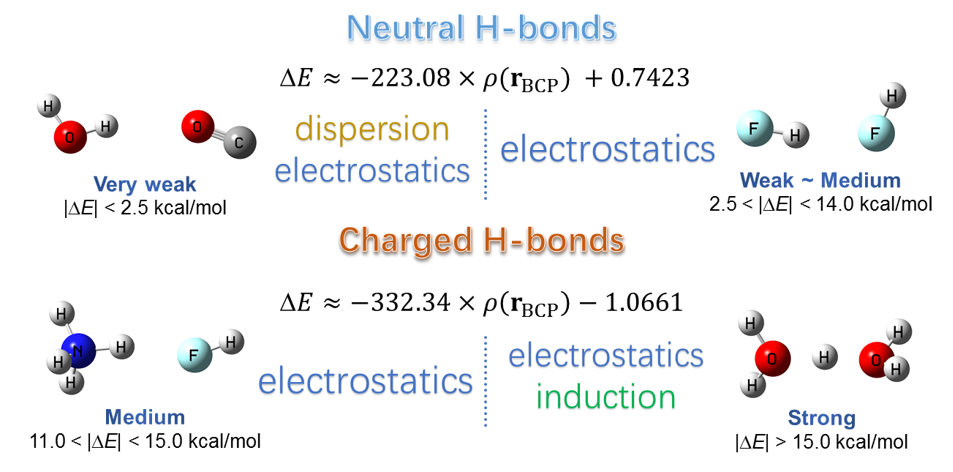

**透彻认识氢键本质、简单可靠地估计氢键强度：一篇2019年JCC上的重要研究文章介绍**

Thoroughly understanding the nature of hydrogen bonds and estimating hydrogen bond strength easily and reliably: An introduction to an important research article published in JCC in the 2019

文/Sobereva@[北京科音](http://www.keinsci.com)  2019-Sep-15

## 0 前言

氢键是最重要的分子内和分子间相互作用类型之一，尽管已经有巨量文章对其从各个角度进行探讨，但即便到现在依然是一个研究的热点，尚有很多未探究充分、透彻的问题。2019年9月，北京科音自然科学研究中心（<http://www.keinsci.com>）连同伊朗Islamic Azad大学以及捷克科学院的研究者，发表了一篇名为Exploring Nature and Predicting Strength of Hydrogen Bonds: A Correlation Analysis Between Atoms-in-Molecules Descriptors, Binding Energy and SAPT theory的文章，见J. Comput. Chem., 40, 2868-2881 (2019) DOI: 10.1002/jcc.26068。此文章利用量子化学计算和波函数分析，充分讨论了氢键的本质，并提出了新的氢键分类和估计氢键强度的方法，文章内容非常具有普遍意义，内容丰富，值得关注。下面就依次对此文章的亮点和重点做简明直白的介绍，更详细内容请阅读原文。此文中的波函数分析部分全部使用Multiwfn（<http://sobereva.com/multiwfn>）程序完成。

## 1 亮点1：构造了具有代表性的氢键作用体系

为了揭示氢键本质、讨论如何估计氢键强度，此文首先构造了一批氢键二聚体，如下所示

这套氢键二聚体有几个特点：(1)样本数很大，使得后续分析讨论依据充分 (2)体系非常有代表性，常见的氢键类型X-H...Y (X,Y=O,N,F)都被纳入其中 (3)中性和带电荷氢键体系同时包含，结合能涵盖了从极弱到极强所有范围，因此可以提供关于氢键全面的视角 (4)样本都是由恰当选取的小分子构成，可以充分避免氢键以外的作用区域对讨论氢键时的干扰。以上体系都通过B3LYP-D3(BJ)/ma-TZVP级别做了几何优化，所得结构可以从文章的补充材料里获得。

如上表所示，此文通过高精度的CCSD(T)/jul-cc-pVTZ级别计算了结合能（Binding energy, BE），还通过PSI4程序通过高阶SAPT方法SAPT2+(3)δMP2结合aug-cc-pVTZ基组做了能量分解并同时得到结合能。文中数据体现这样的高阶SAPT方法不仅对中性体系结果和金标准CCSD(T)非常接近，即便对于带电荷体系也能得到合理结果，表明SAPT分析完全可以放心地用于带电荷氢键。在此文的补充材料里还证明，通过代入简单的线性回归公式，可以令CCSD(T)/jul-cc-pVTZ级别算的结合能很好地重现更准确但也昂贵得多的CCSD(T)/CBS（TZ->QZ外推）级别算的结合能。

考虑到本文构造的氢键数据集非常全面、有代表性，且提供了高精度结合能数据，因此可以在未来作为检验更廉价计算级别计算精度的测试集。

## 2 亮点2：通过能量分解充分展现了氢键的作用本质

SAPT是目前被使用最多、最被广为接受的能量分解方法，它能将结合能分解成不同的物理成分，从而更好地理解相互作用的本质。虽然SAPT早已被大量用于氢键体系的研究中，但是像此文这样使用SAPT非常系统、全面地考察大批量典型氢键的文章还非常少。文中对上述42个氢键二聚体分别给出了结合能当中的静电作用(Elst)、色散作用(Dis)、诱导(Ind)、交换互斥(Rep)部分各自的贡献，其中前三项对于氢键的形成起到正贡献，它们所占贡献的比例在下图给出

图中前28个体系是中性氢键二聚体，后14个是带电荷氢键作用。图中从左到右总的排列顺序是氢键作用逐渐增强。由图可以一目了然发现，不同强度的氢键有着十分不同的本质。强度很低的氢键主要是通过静电吸引和色散吸引效果一起维持的。而中等强度氢键，比如水二聚体，静电吸引作用占绝对主导，而色散吸引和诱导作用一起起到辅助效果。非常强的氢键大多数是带电荷氢键，由图可见这种情况下静电和诱导作用共同起到关键性角色，而色散作用相对而言可以忽略不计。注意SAPT方法给出的“诱导项”本质上体现的是电荷转移、极化、轨道相互作用。

## 3 亮点3：一种新的氢键分类

根据SAPT分析数据和计算的氢键结合能，文中提出一种全新的氢键分类：

这种分类方法相对于以往其他研究者提出的分类方法的关键好处在于，这种分类将氢键强度（由结合能BE体现）和氢键本质直接关联了起来。研究者们根据理论计算或实验观测到的氢键结合能，通过对照上表就能马上认识到这种氢键的主要本质大概是什么。由于此文考虑的样本较大，而且不是拘泥于特定类型体系，因此这个分类不仅可靠而且普适。再加上这个分类简单直白，所以很适合纳入教科书，对于学生正确理解氢键的本质很有好处。

## 4 亮点4：构建了氢键结合能与其能量成分之间的关系

按照常规逻辑，要想得到SAPT中的能量成分，肯定是要做SAPT能量分解的，但是研究者为此需要学习专门的程序的使用（PSI4或Molpro等），还需要付出计算代价。此文发现对于中性氢键作用体系，氢键结合能与各个能量成分间可以拟合出很好的线性关系，如下所示

图中的式子中自变量BE是结合能。因此研究者只要通过一般方法计算出氢键结合能，直接代入上面的公式，就可以立马估计出各个SAPT能量成分了，省事极了！虽然不同的氢键体系都有一定个性，严格讨论时仍免不了需要直接做SAPT计算，但至少这套关系式足够给出定性正确的能量成分，用于粗略讨论足够了。注意用这套式子有个前提，就是你算的结合能必须确实只由某个氢键作用所主导，体系其它部分的作用相对而言可以忽略。

上面的图也体现出，氢键的所有能量项的绝对值都是随着氢键强度增加而增加的，对氢键形成产生正贡献的静电、色散、诱导作用增强时，起到负贡献的交换互斥作用也随之增加，很大程度上抵消掉结合作用。此外还可以看到，随着氢键增强，诱导作用增加的速度明显比色散作用增加的速度要快，即色散作用对氢键强度不是很敏感。对于强度只有<10 kJ/mol的弱氢键，色散作用不仅比诱导作用强，甚至和静电作用起到的地位不分伯仲，而当氢键强度进一步增加后，色散作用起到的地位就垫底了。

## 5 亮点5：证明了通过氢键的键临界点处的电子密度可以可靠地估计氢键强度

弱相互作用是波函数分析（wavefunction analysis）方法的常见研究对象。有很多研究者通过Atoms-in-molecules理论定义的键临界点(BCP)的属性（电子密度、电子密度的拉普拉斯函数、能量密度、势能密度等等）分析氢键的本质和估计氢键的强度。也有些人提出了一些指标，比如CVB指数、ΔΔVn指数来考察氢键强度。此前有一个知名的关系是Espinoa在Chem. Phys. Lett., 285, 170 (1998)提出来的BE=V(BCP)/2，即氢键的结合能约等于氢键的键临界点处势能密度的一半。然而，Espinoa的关系局限性非常大。首先，他当年考察氢键体系用的结合能的计算精度在如今来看非常差，而且他的文章只考虑了X-H...O (X=C,N,O)型氢键。

到底被使用广泛的Espinoa的估计氢键强度的公式准不准确？能不能找到更好的估计氢键强度的关系？这是一个极其重要的问题。因为，如果能确定一个简单且可靠的估计氢键强度的方法，那么就可以比较廉价地近似得到高精度量子化学方法计算的结果。更重要的是，利用这种关系可以估计一些不容易直接计算的氢键键能。比如说分子内氢键键能就不好算，因为这通常需要把体系进行截断、对截断处进行饱和，还得恰当对结构进行调节以避免严重位阻等问题，相当麻烦。再比如，有时候两个分子间形成多对氢键，一般的算分子间作用的方法只能给出总的作用能，想得到每个氢键各自的作用能很不容易实现。

此文将CCSD(T)算的42个氢键二聚体结合能与BCP处的电子密度ρ进行了线性拟合，如下所示

由图可见，如果把带电荷和不带电荷的总共42个氢键体系直接拟合，虽然R^2看起来不差，但是MAPE（平均绝对百分误差）很大，因此这样拟合的关系在预测氢键作用能上没实际意义。然而，如上图(b)和(c)所示，若对中性和带电荷的氢键二聚体分别进行拟合，那么对二者都可以得到理想的线性关系，不仅R^2很高，同时MAPE很低，拟合出的公式很有实际意义。也就是说，我们只需要对氢键复合物先用量子化学程序进行几何结构优化，同时产生含有波函数的文件（如.wfn、.fch、.molden），然后用Multiwfn程序做电子密度的拓扑分析得到要考察的氢键的BCP处的电子密度（这个过程耗时几乎可忽略不计），再代入图中的公式，就可以直接得到较准确的氢键结合能。这样算出的结果准不准？假设有个中性体系的氢键的结合能是-5.0 kcal/mol（接近水二聚体的氢键强度），乘上MAPE=14.69%后可知，误差才0.7 kcal/mol而已，这样的误差实际上比起很多廉价方法（比如PM6-D3H4、PM7半经验方法）得到的氢键结合能准得多，很多时下算弱相互作用流行的DFT泛函也未必达得到这个精度。

为了考察是否能用BCP处的其它属性，或者一些与氢键有关的指标来准确预测氢键强度，文中也对它们与氢键结合能的关系做了回归分析，MAPE如下所示

由表可见，用BCP处的能量密度（H）、bond degree（H/ρ）、势能密度的绝对值除以拉格朗日动能密度（|V|/G），都不能通过拟合关系很好预测氢键强度，至少比用电子密度来预测要差不少。Espinoa提出的用V/2来预测氢键结合能的做法也并不理想（对中性氢键MAPE达到23.35%），因此从此以后不应当再用这个关系估计氢键结合能。至于基于电子定域化函数定义的CVB指数，以及基于原子核位置静电势定义的ΔΔVn指数，虽然与氢键结合能确实有相关性，但从上面表格里的MAPE值来看也不算理想。因此此文有个发现值得强调：虽然BCP处的电子密度是最容易算的、形式最简单的量，但是基于它来预测氢键强度比用形式更复杂、看似更高级方式定义的量效果还好！

## 6 其它

在一些文章指出，SAPT的诱导项(E_ind)与共价作用程度有密切联系，甚至被一些文章直接拿来衡量共价作用程度。而在一些AIM研究文章里指出BCP处的|V|/G和H/ρ与共价作用也关系密切。考虑到这点，此文将|V|/G和H/ρ向E_ind进行了拟合。结果发现对于中性体系，|V|/G与E_ind之间可以通过二次函数很好地关联起来，暗示出BCP处|V|/G越大，氢键的共价成分越强，证明了将BCP处的|V|/G用于讨论不同中性体系的氢键的共价性是合理的。

想全面研究氢键本质，不仅要考虑平衡位置（优化后的复合物结构）下氢键的特征，还应当考察不同作用距离下氢键的特征。因此文章的补充材料里的S3一节里取了弱氢键、中等强度氢键以及带电荷的强氢键各一例，对SAPT总能量和各个分量随作用距离的变化情况进行了扫描和分析，如下所示

由图明显可见不同的作用成份随氢键距离增加时衰减行为明显不同，详细分析讨论请看原文补充材料，在这里不再细谈。

## 7 总结

这篇JCC文章选取了非常有代表性的大批氢键体系，基于高精度的数据，从各个角度对氢键本质进行了深入的分析探讨，对于正确了解氢键本质非常有益，并且文中给出的氢键分类方法和估计氢键结合能的方法极具实用性，值得推广。这几点通过此文的Table of content图非常直观地体现了出来（其中电子密度ρ和结合能ΔE的单位分别用的是a.u.和kcal/mol）：

## 8 相关阅读

本文提出的根据BCP处电子密度估计氢键键能的方法在Multiwfn手册4.2.1节以及《计算分子内氢键键能的几种方法》（<http://sobereva.com/522>）中给了实际例子，你会发现用起来非常简单，而且计算耗时极低。关于Multiwfn做AIM拓扑分析的更多信息，见《使用Multiwfn做拓扑分析以及计算孤对电子角度》（<http://sobereva.com/108>）和Multiwfn手册4.2节的各种例子。关于怎么用Gaussian等程序产生给Multiwfn用的输入文件，见《详谈Multiwfn支持的输入文件类型、产生方法以及相互转换》（<http://sobereva.com/379>）。

上面提到的CVB指数的介绍和计算方法见：《使用Multiwfn计算CVB指数考察氢键强度》（<http://sobereva.com/461>）。

前述的ΔΔVn指数是怎么定义的，以及如何用Multiwfn计算，见Multiwfn手册4.1.2节。

用Multiwfn可以实现的各种研究弱相互作用的方法汇总见《Multiwfn支持的弱相互作用的分析方法概览》（<http://sobereva.com/252>），其中还对能量分解做了简介。

使用PSI4做SAPT计算，以及扫描各个SAPT能量项随作用距离的变化可参考《考察SAPT能量分解的能量项随分子二聚体间距变化的简单方法》（<http://sobereva.com/469>）。

分子间弱相互作用的本质简介，以及上文中提到的B3LYP-D3(BJ)，见《谈谈“计算时是否需要加DFT-D3色散校正？”》（<http://sobereva.com/413>）。

文中用到的ma-TZVP基组用法见《给def2以ma-方式加弥散函数的Gaussian格式的基组定义文件（含所有def2支持的元素）》（<http://sobereva.com/509>）。

文中提到的counterpoise校正的原理，以及为什么文中用一半Counterpoise校正，在此文有提及《谈谈BSSE校正与Gaussian对它的处理》（<http://sobereva.com/46>）。
