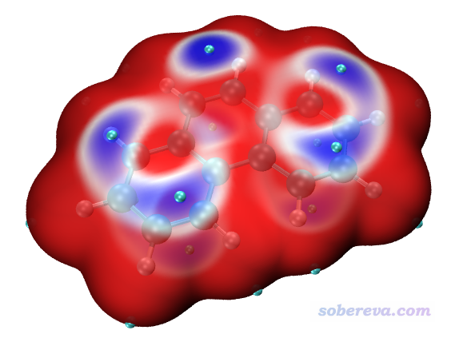
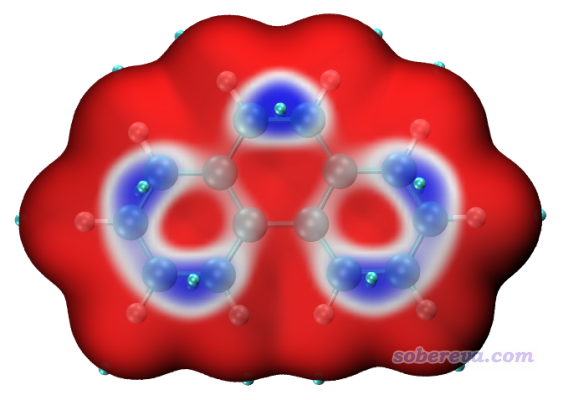
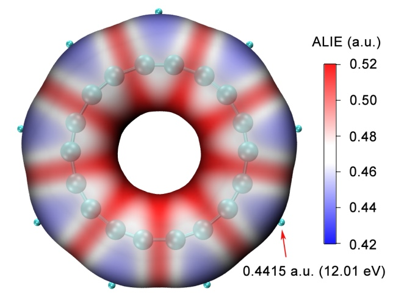

注：笔者后来又写了《使用Multiwfn通过局部电子附着能(LEAE)考察亲核反应位点、难易及弱相互作用》（<http://sobereva.com/676>），其中介绍的重要的LEAE函数与ALIE有关键性的互补，非常推荐阅读！

**使用Multiwfn和VMD绘制平均局部离子化能(ALIE)着色的分子表面图（含视频演示**）

Using Multiwfn and VMD to plot map of molecular surface colored by averaged local ionization energy (ALIE)

文/Sobereva@[北京科音](http://www.keinsci.com)

First release: 2019-Sep-17  Last update: 2020-Oct-10

平均局部离子化能(ALIE)是一个对于考察分子亲电反应位点、活性非常有用的量，在《静电势与平均局部离子化能综述合集》（<http://bbs.keinsci.com/thread-219-1-1.html>）我给出了很多综述、介绍性文章以及笔者写过的相关博文，不熟悉ALIE者强烈建议阅读。Multiwfn是考察ALIE最方便、灵活、强大的程序。通常分析ALIE时都是考察它在分子表面的分布。之前笔者有个文章《使用Multiwfn+VMD快速地绘制静电势着色的分子范德华表面图和分子间穿透图》（<http://sobereva.com/443>）介绍了如何将Multiwfn与VMD程序联用非常方便、快速地绘制高质量的静电势着色的分子范德华表面图。由于后来又有不少人问我怎么类似地也绘制ALIE着色的分子表面图，因此这里笔者就专门说一下。本文对应于Windows环境，若想在Linux下实现同样绘制效果，请读者灵活变通。

本文的过程配有全程演示视频，强烈建议一看：[**https://www.bilibili.com/video/av68116168/**](https://www.bilibili.com/video/av68116168/)

首先大家去<http://sobereva.com/multiwfn>下载Multiwfn程序，必须是2019-Sep-17及之后更新的版本，之前的版本没有下面提到的脚本。如果还没装VMD，去<http://www.ks.uiuc.edu/Research/vmd/>下载。本文用的是VMD 1.9.3。

之后进行以下操作：  
·将examples\scripts里的ALIE.vmd复制到VMD目录下  
·将examples\scripts里的ALIE_isoext.bat和ALIE_isoext.txt复制到Multiwfn.exe所在目录下  
·编辑ALIE_isoext.bat批处理文件，将里面的文件路径改成实际要考察的，把VMD路径也改成实际的。输入文件可以用.wfn、.fch、.molden等  
·双击ALIE_isoext.bat，Multiwfn将被自动调用进行计算，算完后会在VMD目录下产生avglocion.cub、density.cub、surfanalysis.pdb  
·启动VMD，在命令行窗口输入source ALIE.vmd，就可以得到想要的图像了

下图是绘制出来的菲的ALIE着色的分子表面图像。

图中的表面对应的是电子密度为0.0005 a.u.的等值面。之所以不是常用的0.001 a.u.等值面（通常被用来作为分子范德华表面的定义），是因为此时ALIE着色效果不好，不容易通过颜色区分不同区域ALIE分布差异。上图中青色圆球是分子表面上ALIE的极小点，体现电子被束缚得极弱的位置，也因此体现出容易发生亲电反应的位点。ALIE是按照蓝-白-红的色彩过渡方式着色的，因此上图中蓝色区域都是ALIE比较小的区域，电子比较容易参与反应。

为了效果更好，可以用Tachyon渲染器渲染，在视频里已经演示了。

若你研究的体系不容易通过色彩区分ALIE在不同区域的相对大小，或者整个分子表面颜色全都是红色或蓝色，**说明当前用的ALIE的色彩刻度范围不合适**，可以在VMD命令行窗口输入诸如mol scaleminmax 0 1 0.31 0.37，这里0.31和0.37分别是色彩刻度下限和上限（亦可以在VMD的图形界面里修改，做法是进入Graphics - Representations，在窗口上方选择当前是Isosurface的那项，点击Trajectory标签页，在文本框里输入色彩刻度的下限和上限之后按回车）。色彩刻度范围怎么设合适和具体体系有关，可以反复试试。如果心里没谱的话，可以先把下限和上限分别设成当前分子表面上的ALIE实际的最小值和最大值，以让色彩变化能完整表现分子表面上的ALIE分布。这两个值在Multiwfn计算过程的输出信息里就可以看到（将ALIE_isoext.bat第一行末尾加上[空格]> out.txt，脚本调用Multiwfn期间输出的信息就会导出到当前目录下的out.txt，其中搜Minimal value:和Maximal value:），然后手动将这两个值除以27.2114换算为以Hartree为单位的值，作为色彩刻度下限和上限即可。

对于平面体系，如果想准确考察ALIE极值点与原子或者键的相对位置，最好改成正交视角，即选择Display - Orthographic，否则会由于近大远小的缘故可能导致误判位置。以正交视角显示时的菲分子的图像如下，位于蓝色区域的原子或键容易参与亲电反应。

值得一提的是，笔者在《一篇最全面、系统的研究新颖独特的18碳环的理论文章》（<http://sobereva.com/524>）介绍的论文中使用本文的方法考察了电子结构非常特殊的18碳环体系，得到的图像很漂亮（如下所示），体现出的信息又非常有价值，很建议读者看看此文中关于反应性的相关讨论。

如果想像上图一样把色彩刻度轴画出来，按照《使用Multiwfn+VMD快速地绘制静电势着色的分子范德华表面图和分子间穿透图（含视频演示）》（<http://sobereva.com/443>）里面介绍的做法就可以实现。如果你想查询分子表面ALIE极值点具体的值，也效仿此文里面说的做法。
