**后记**：笔者后来在18碳环方面开展了大量研究工作，并陆续发表了许多论文，汇总见<http://sobereva.com/carbon_ring.html>。本文的读者请务必一看，非常欢迎阅读和引用其中的文章！

本文下面的所有数据和图像都已体现在笔者发表的文章Carbon, 165, 468-475 (2020) DOI: 10.1016/j.carbon.2020.04.099的正文或者补充材料里。因此如果需要引用下文的任何内容，都请引用Carbon这篇论文。

**谈谈18碳环的几何结构和电子结构**   
On the geometric structure and electronic structure of cyclo[18]carbon

文/Sobereva (Tian Lu) @[北京科音](http://www.keinsci.com)

First release: 2019-Sep-20   Last update: 2019-Sep-22

## 0 前言

2019年8月，在Science上发表了一个首次实验观测到18碳环的文章（DOI: 10.1126/science.aay1914），引起了热议。有个问题在群里笔者被问及数次：怎么文中（还有一些乱七八糟公众号文章）说这个体系是单-三键交替的，而我算出来是所有键都一样长？笔者遂抽了点时间，对18碳环随便做了一些简单的计算和分析，在此文里简单说说，也同时展现利用Multiwfn做波函数分析考察新颖体系电子结构的价值（其实靠这个很容易发文章，但别灌水）。

18碳环的两种极端结构可以表示为下面的示意图，一种是单-三键交替，一种是所有键全同。实际上，两种Lewis结构都不全对，应当认为是介于二者之间。后面笔者会利用量子化学计算和Multiwfn做波函数分析获得的数据来说明这点。

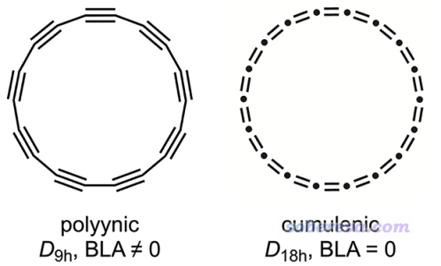

上图里有个BLA，是什么含义以及如何计算见《使用Multiwfn计算Bond length/order alternation (BLA/BOA)和考察键长/键级随键序号的变化》（<http://sobereva.com/501>）。简单来说BLA不为0就对应所有C-C键不都相同。

## 1 到底18碳环的C-C键是交替的还是全相同的？

在Science这篇文章里其实也提了，之前就有研究者在18碳环被观测之前，就通过理论对其结构进行预测、对结构进行了优化。文中提到，之前有人用某些DFT泛函、微扰方法（具体来说是MP2）计算，算出来的所有键的长度都相同；也有人用HF、量子蒙特卡罗、CCSD，计算都表明键长是交替的。在Science这篇文章里通过STM和AFM实验都确认了实际的18碳环的键长就是交替的。

考虑到实验都观测到了键长交替，再加上高级别电子相关方法也算出来了键长交替的情况，因此这个体系的键长是交替的可以说是板上钉钉了。那到底为什么有人用DFT算出来键长是相同的？下面给出笔者用不同泛函优化后的键长，单位是埃。普通泛函用的是def-TZVP基组，B2PLYP-D3(BJ)用的是cc-pVTZ，结构都无虚频，是Gaussian16算的。

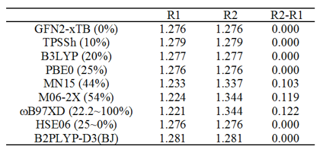

另外，Science文中在补充材料里也分别用PBE（纯泛函）和HSE（近程HF成份25%，但文中用的是20%）做了优化，发现前者算出来键长都是1.284埃，后者算出来是键长交替的（1.195埃和1.343埃）。然而作者的计算貌似有问题，笔者用HSE06算出来的明明都是键长相同，不知作者的数据有什么猫腻（作者用的是非主流FHI-aims程序）。还值得一说的是在J. Chem. Phys., 128, 114301 (2008)的表3中，CCSD/cc-pVDZ优化出的D9h构型的两种键长分别是1.2381埃和1.3828埃。

Science文中的AFM和STM实验并没法准确测定C-C键长，但由以上数据，应该认为两种C-C键键长相差0.10~0.15埃应当是比较合理的范围。以上泛函的测试体现出，要想得到这样的合理结果，不能用HF成份太低的泛函，哪怕PBE0这样HF成份25%的都不行，近程为25%而远程为0%的HSE06理所当然地也不行（别管Science文章作者的看似合理的HSE计算数据，前面说了，这数据应当是错的），没有纳入HF交换成份的GFN2-xTB理论显然也不行。前述JCP 2008文章里也对BLYP、PBE、B3LYP、PBE0做了计算，结果都是两种C-C键键长几乎没有任何差别。而如上面的表格所见，用HF成份较高的M06-2X、带长程校正的泛函wB97XD结果都较为可信。MN15这样44%的泛函也在靠谱范围之内。令人大跌眼镜的是主流的双杂化泛函B2PLYP-D3(BJ)表现极差，算出的结果是键长相同，这和前人的MP2计算结果相一致。

总之，大家以后计算18碳环或类似体系，用wB97XD的结构是可以放心的，不用担心审稿人质疑，毕竟更高级的CCSD的结果也与之相仿佛。而B3LYP等HF成份较低的泛函优化的结构千万别用，双杂化也算这个也不靠谱。算此体系不用太顾及静态相关问题，笔者测试过，T1诊断才0.016。

## 2 怎么理解Science文中的STM/AFM图？

下图是Science文中对C18测的STM图（Q、R）和AFM图（S、T），其中Q和S对应较大探针距离，R和T对应较小探针距离。

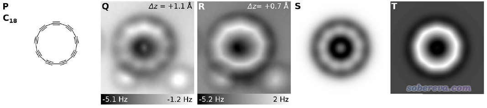

笔者第一次看这个图的时候，感觉这图不是体现的所有原子均匀分布么，文中怎么得到单-三键交替的结论？后来定睛再看，才意识到确实这图体现了不同C-C键的特征差异。我觉得把实验的图与Multiwfn绘制的分子平面上方1埃处的电子密度图来对照很有助于理解实验图像。这里我们基于Gaussian16用wB97XD/def-TZVP优化后得到的无虚频的D9h点群结构的fch文件绘制这样的图。Multiwfn用的是2019-Sep-20更新的3.7(dev)版，可在<http://sobereva.com/multiwfn>免费下载，不要用更老的版本！对Multiwfn不了解或对作图步骤有不理解的读者请参看此文中关于绘制平面图的说明：《Multiwfn FAQ》（<http://sobereva.com/452>）以及Multiwfn手册4.4节绘制平面图的一大把例子。下面例子用的fch文件可以在这里下<http://sobereva.com/attach/515/file.rar>。

启动Multiwfn，然后输入  
wB97XD.fchk  
4  //绘制平面图  
1  //电子密度  
1  //填色图  
[按回车用默认格点设定]  
1  //绘制XY平面  
1a  //Z=1埃的XY平面  
关闭蹦出来的图像，然后输入以下命令使得绘制的图的特征比较接近于实验  
1  //修改色彩刻度  
0,0.05  //色彩刻度下限和上限  
4  //显示原子标签  
4  //白色  
17  //设置显示原子标签时原子与作图平面间距离的阈值  
10  //随便改成一个较大的值（10 Bohr）  
y  
19  //修改色彩变化方式  
6   //黑->白  
-8  //把坐标标签单位切换为埃  
-2  //修改坐标轴刻度间隔  
2,2,0.01  
-1  //重新绘图  
看到的图像如下所示

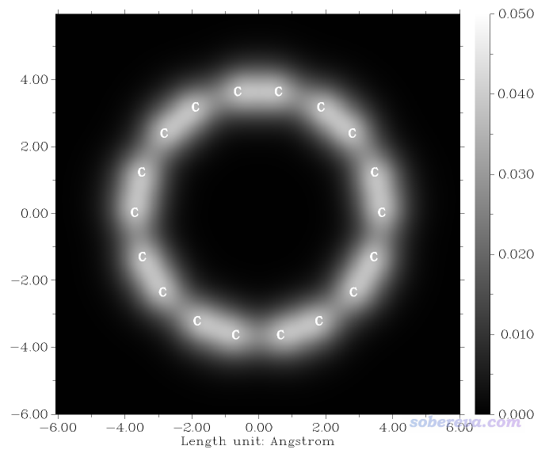

可见在体系平面上方1埃区域，比较短的C-C键的电子密度要大于比较长的C-C键的，因此相应位置颜色更白。上图与Science文章里的S图中的相对白亮的区域可以很好地对应上，见下图。

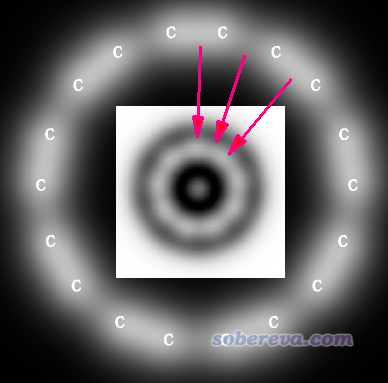

## 3 18碳环里的C-C键真的是单-三键交替么？

Science文章信誓旦旦地说C-C键是单-三键交替，这点笔者强烈不认同。确实文章通过确凿的证据说明了C-C键特征是交替的，但作者在没有任何证据的前提下，却从头到尾一直在提单键、三键，这种说法无疑是有误导性的。作者的逻辑似乎是只要键长交替就必然是单-三键交替，这种观念明显缺乏科学性，被Lewis式的电子结构表现形式所误导（而且还没考虑共振）。如《Multiwfn支持的分析化学键的方法一览》（<http://sobereva.com/471>）中所提到的，判断是几重键，最简单、方便、靠谱的做法就是算一下键级，这竟然被作者忽视了，真不应该。下面对wB97XD/def-TZVP波函数用Multiwfn通过几种不同的键级计算方法进行计算，结果如下（只要用Multiwfn载入前述fch文件，进入主功能9，选相应键级即可得到结果）。

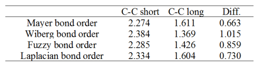

这些键级的定义存在差异，见<http://sobereva.com/471>这篇博文里的介绍和讨论，这里不多说。但无论哪种键级，结论都是较短的C-C键的键级明显达不到三重键的标准，而较长的C-C键的键级明显超过标准的单重键。所以，对18碳环这个体系只要说C-C键特征是交替的就足够了，而添油加醋说成是“单-三键交替”就明显不对了。

## 4 18碳环里pi电子是怎么离域的？

如果18碳环的C-C键特征皆相同，那么应当如Science文章里画的下图这样，通过两个18中心大pi键形成高度电子离域特征，一个是在环上/下方离域，一个是沿着环平面离域。

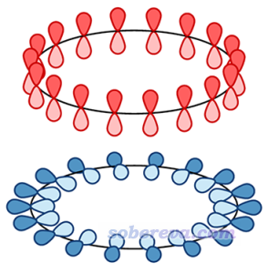

前面也说了，此体系实际上是C-C键特征交替的。在这种电子结构下，pi电子的离域特征实际是什么样的？这有很多方法可以考察，在《衡量芳香性的方法以及在Multiwfn中的计算》（<http://sobereva.com/176>）里面笔者介绍了很多。而这一节，我们通过绘制LOL-pi函数，来图形化考察此体系的pi电子离域情况，相关知识、操作介绍见《在Multiwfn中单独考察pi电子结构特征》（<http://sobereva.com/432>），本文不再细说。我们在4.1和4.2节通过LOL-pi函数分别把上图中红色和蓝色那种pi电子离域特征进行展现。

### 4.1 图形化展现环平面上/下方的pi电子离域情况

启动Multiwfn，依次输入  
wB97XD.fchk  
100  //其它功能(Part1)  
22  //自动检测pi轨道  
0   //当前轨道有离域特征（如当前fch里记录的分子轨道）  
2   //把识别出的pi轨道以外轨道占据数清零  
0   //返回主菜单  
5   //计算格点数据  
10  //LOL  
2   //中等质量格点  
-1  //观看等值面

把等值面数值改为0.45后得到下图，直观展示出了环平面上/下方pi电子的离域路径。其中，在较短的C-C键上电子离域较容易（等值面较肥），而跨越较长C-C键离域则相对困难一些（等值面较细。把等值面数值设大点后甚至都断开了）。

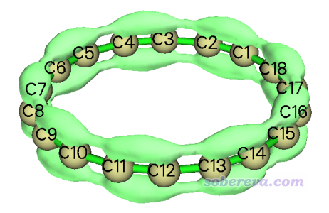

### 4.2 图形化展现沿着环平面的pi电子离域情况

为了绘制LOL-pi来展现沿着环平面的pi电子离域情况，我们首先得找到在环平面上的pi型分子轨道。载入wB97XD.fch并进入主功能0后，我们从HOMO轨道（54号）开始挨个往下一个一个看轨道图形，最终发现有9个轨道是我们要的：

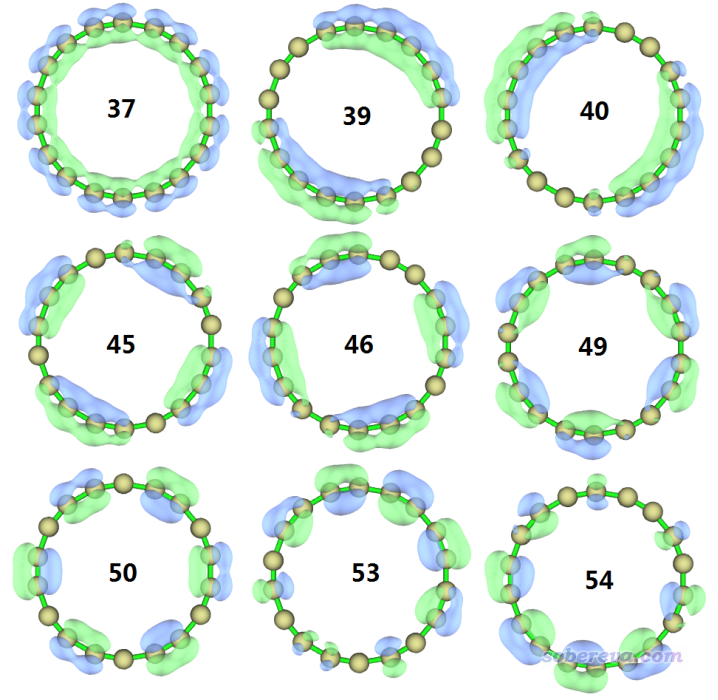

然后在主菜单依次输入  
6  //修改波函数  
26  //修改占据数  
0  //选择所有轨道  
0  //把占据数清零  
37,39,40,45,46,49,50,53,54  //我们刚找到的环平面上的pi轨道  
2  //占据数恢复为原本的2.0  
q  //返回  
-1  //返回主菜单  
5   //计算格点数据  
10  //LOL  
2   //中等质量格点  
-1  //观看等值面  
将等值面数值设为0.46后得到下图

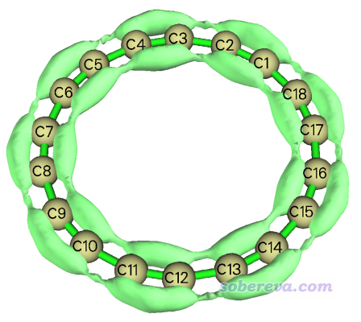

由图可见，对于沿环平面的pi电子，也是较容易离域经过较短的C-C键，而相对来说离域通过较长C-C键要难一些，这从其相应较窄的等值面上就能体现。

我们也可以绘制环平面上LOL-pi的填色图，这样能把LOL-pi在这个平面上的分布特征展现得更为充分。接着输入  
0  //返回主菜单  
4  //绘制平面图  
10  //LOL  
1  //填色图  
[按回车用默认的格点设定]  
1  //XY平面  
0  //Z=0  
为了获得更好的图像效果，关闭图像后输入  
4  //显示原子标签  
7  //青色  
19  //修改色彩过渡方式  
13  //黑-橙-黄  
18  //修改原子标签类型  
2  //只显示序号  
-1  //重新绘图  
此时看到下图

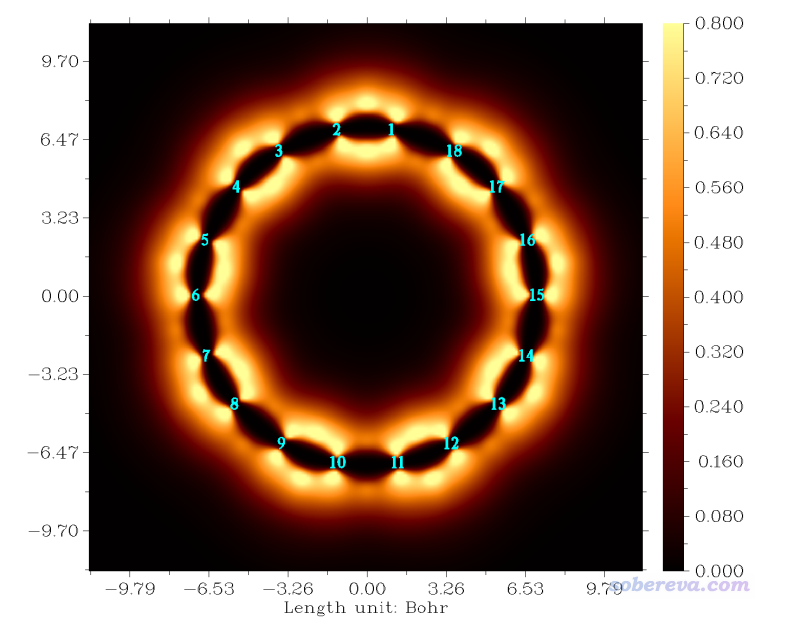

此图又漂亮又直观地展现出，对于C1-C2这样较短的C-C键，电子无论从内侧还是外侧离域过去都较容易，而离域经过诸如C1-C18相对困难。

## 5 从定域化轨道角度考察C-C键

定域化分子轨道(LMO)对于从轨道角度讨论化学键极其重要，相关知识见《Multiwfn的轨道定域化功能的使用以及与NBO、AdNDP分析的对比》（<http://sobereva.com/380>）。这里我们通过LMO考察一下当前体系的C-C键。

把Multiwfn的settings.ini文件里的iprintLMOorder参数改为1，然后启动Multiwfn，输入  
wB97XD.fchk  
19  //轨道定域化  
1   //定域化占据轨道  
马上定域化就完成了。当前体系里C1-C2是较短的碳碳键，我们从屏幕上输出的LMO轨道成份列表可以直接看到哪些LMO主要描述了C1-C2成键：  
 Almost two-center LMOs: (Sum of two largest contributions > 80.0%)  
    27:   1(C ) 46.1%   2(C ) 44.6%        47:   1(C ) 42.1%   2(C ) 41.6%  
    53:   1(C ) 44.2%   2(C ) 43.9%        33:   1(C ) 48.7%  18(C ) 47.7%  
    31:   2(C ) 47.8%   3(C ) 48.7%        23:   3(C ) 45.7%   4(C ) 45.2%  
    43:   3(C ) 42.4%   4(C ) 41.6%        49:   3(C ) 44.8%   4(C ) 43.5%  
 ...略  
即LMO27、LMO47、LMO53是我们感兴趣的。进入主功能0，看一下这三个轨道：

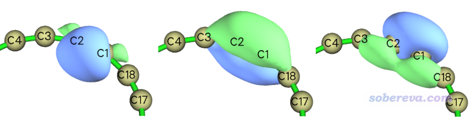

可见这仨LMO确实充分描述了C1-C2键，左边的轨道可以认为主要体现的是sigma特征，中间的是分子平面上/下方pi电子轨道，右边的体现的是描述沿着分子平面离域的pi电子的轨道。注意中间和右边的轨道还稍微离域到了旁边的C3和C18上，这说明C1-C2算不上是严格的三重键，而旁边的C-C键也具有部分pi成份而不可能只是sigma单键。

顺带一提，虽然如<http://sobereva.com/432>所示，Multiwfn有通过自动判断pi型LMO来考察pi电子结构的功能，但是不适合用于考察当前体系的沿环平面的pi电子特征。因为如上图所示，此体系里sigma-LMO和沿环平面的pi-LMO混合相当厉害，难以充分分离，因此只能基于MO来分离讨论。

## 6 总结

本文对比较热门的，而且也是一些人好奇、抱有疑惑的18碳环的几何结构特征做了讨论，并利用Multiwfn从电子密度分布、LOL函数、分子轨道、轨道定域化等方面展示了体系的电子结构特征，应该能解除一些读者对此体系的一些疑惑、令读者更好地认识此体系。显然，对这个体系还可以做很多其它分析，比如布居分析、芳香性、(超)极化率、激发态与电子光谱等等，Multiwfn都可以派上很大用场。
