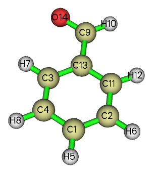

**关于为什么Multiwfn算的出RESP电荷与Antechamber的有所差异**

Regarding why the RESP charge calculated by Multiwfn is different from that of Antechamber

文/Sobereva@[北京科音](http://www.keinsci.com) 2019-Sep-27

## 0 前言

RESP电荷的原理、细节以及计算在《RESP拟合静电势电荷的原理以及在Multiwfn中的计算》（<http://sobereva.com/441>）有详细说明，Multiwfn是计算RESP电荷最方便易用和灵活的程序。有Multiwfn用户发现，Multiwfn算出的某些分子的RESP电荷与antechamber的不同，在此文我说一下原因。使用Multiwfn算RESP电荷的用户不是很有必要看此文，Multiwfn给的结果肯定是合理的。但如果想了解一些细节的话也可以看看。

简单来说导致差异的原因主要有两点：  
(1)拟合点的分布不同  
(2)等价约束设置不同

下文涉及的体系的相关文件可以在这里下：<http://sobereva.com/attach/516/file.rar>。本文用的是2019-Sep-26更新的Multiwfn 3.7(dev)版。

## 1 拟合点的分布不同带来的差异

Multiwfn在计算RESP电荷的时候，对于3.6、3.7版默认用的是MK方式设置拟合点（以后版本有可能会改变，届时看Multiwfn的RESP模块界面上的选项提示便知默认的是什么），拟合点位置由Multiwfn自己的代码设置，静电势由Multiwfn自己的代码计算或者调用cubegen计算。Antechamber计算RESP电荷时是从Gaussian的pop=MK IOp(6/33=2) IOp(6/42=6)输出文件里直接读取MK拟合点的坐标和静电势。虽然MK原文虽然定义了拟合点的分布规则，即每个原子上在不同原子半径倍数上有几层拟合点，但在具体确定拟合点坐标上，不同程序的细节不同，比如在球面上的拟合点以什么算法生成排布？拟合点的密度是多少？在原子接缝的地方是否自动去除过密的拟合点？等等。由于Multiwfn设置的拟合点的位置和Gaussian在这方面有一些不同，导致Multiwfn和Antechamber算的RESP电荷会有些许差别，但这个因素造成的差异通常不大，也没法说哪个程序更对，因为都是合理的。注：前述IOp(6/33=2)是让Gaussian把拟合点的位置和静电势数值打印到输出文件里的选项，而IOp(6/42=6)用来将拟合点的密度设为高于默认值。在Multiwfn的RESP电荷计算界面里也可以直接设拟合点的密度。

下面我们拿乙醇这个体系来对比一下。这里笔者直接用gview画了一个乙醇，保存成了.mol2文件。然后用antechamber产生了对应的gjf文件，里面的关键词是#HF/6-31G* SCF=tight Test Pop=MK iop(6/33=2) iop(6/42=6)，原本带着的opt我给删了，对于本文的讨论没意义。然后用Gaussian 09 E.01进行计算，得到的chk文件我转成了fch文件。

用Multiwfn载入fch文件，进入RESP计算界面，直接选标准两步式RESP电荷计算，结果如下  
Center      Charge  
   1(C )   -0.250749  
   2(H )    0.064449  
   3(H )    0.064449  
   4(H )    0.064449  
   5(C )    0.547451  
   6(H )   -0.091298  
   7(H )   -0.091298  
   8(O )   -0.714589  
   9(H )    0.407135

在计算第二步的时候提示用了以下等价性约束  
Constraint   1:    2(H )    3(H )    4(H )  
 Constraint   2:    6(H )    7(H )

再用antechamber计算RESP电荷，会出现一批文件，其中有两个RESP计算模块输出的文件ANTECHAMBER_RESP1.OUT和ANTECHAMBER_RESP2.OUT。第一个就是第一步拟合的输出，第二个就是第二步拟合的输出，最终结果看第二个里面的下面的部分

          Point Charges Before & After Optimization

    no.  At.no.    q(init)       q(opt)     ivary    d(rstr)/dq  
     1   6      -0.229693      -0.229799      0       0.003990  
     2   1       0.077688       0.059374      0       0.000000  
     3   1       0.077682       0.059374      2       0.000000  
     4   1       0.034340       0.059374      2       0.000000  
     5   6       0.464072       0.533889      0       0.001841  
     6   1      -0.057092      -0.086155      0       0.000000  
     7   1      -0.057098      -0.086155      6       0.000000  
     8   8      -0.720426      -0.720426    -99       0.001375  
     9   1       0.410526       0.410526    -99       0.000000

q(init)是第一步拟合之后产生的电荷，q(opt)是经过第二步拟合最终得到的RESP电荷。ivary是等价性约束关系，比如no.为3和4的原子的ivary是2，就代表2、3、4在拟合过程中保持等价，这和前面看到的Multiwfn自动用的约束完全一样。8和9号原子的ivary为-99，代表它们在第二步拟合过程中电荷被约束为保持不变。

Antechamber这里产生的RESP电荷和前面给的Multiwfn算出来的有轻微差异，但顶多也就差0.01几。如果我们想让Multiwfn算出的电荷与Antechamber的精确一样，那就在选择开始计算RESP电荷之前先选一下选项8，然后再选1开始标准两步式拟合，按屏幕提示的要求把Gaussian输出文件路径输进去，这时Multiwfn就和Antechamber一样从Gaussian输出文件里读取拟合点的位置和静电势了，输出信息如下，和Antechamber给出的完全相同（个别原子仍有10的负六次方的差异是收敛限设置、舍入误差等数值细节导致的，完全可忽略不计）

  Center      Charge  
     1(C )   -0.229798  
     2(H )    0.059373  
     3(H )    0.059373  
     4(H )    0.059373  
     5(C )    0.533887  
     6(H )   -0.086155  
     7(H )   -0.086155  
     8(O )   -0.720426  
     9(H )    0.410526

## 2 等价约束设置不同带的差异

下面我们看苯甲醛这个例子。哪怕Multiwfn也直接从Gaussian输出文件里读取拟合点的信息，结果与Antechamber给出的仍有轻微差异，这是由于两个程序用的等价性约束设置不同所带来的。

我们先用Multiwfn基于Gaussian里的拟合点信息计算RESP电荷。启动Multiwfn，载入本文文件包里的C6H5CHO.fchk，进入RESP模块，先选择8，再选择1，再输入C6H5CHO.out的路径，得到的结果如下  
   Center      Charge  
      1(C )   -0.115868  
      2(C )   -0.111841  
      3(C )   -0.114944  
      4(C )   -0.146385  
      5(H )    0.137991  
      6(H )    0.134593  
      7(H )    0.153718  
      8(H )    0.139930  
      9(C )    0.391423  
     10(H )    0.059972  
     11(C )   -0.223448  
     12(H )    0.155781  
     13(C )    0.034578  
     14(O )   -0.495500  
  Sum of charges:    0.000000  
  RMSE:    0.001373   RRMSE:    0.079595

从屏幕上的提示可见，这个体系的RESP电荷计算过程只做了第一步，因为按照RESP电荷定义的规则，这个体系本身不需要做第二步。在第一步计算的时候没有自动做任何等价性约束。

也用antechamber进行计算，从给出的ANTECHAMBER_RESP2.OUT中可以看到所有原子的ivary都为-99，即第二步相当于什么也没做，因此最终得到的RESP电荷来自于第一步。然后看ANTECHAMBER_RESP1.OUT，输出信息为

    no.  At.no.    q(init)       q(opt)     ivary    d(rstr)/dq  
     1   6       0.000000      -0.101223      0       0.003514  
     2   6       0.000000      -0.148518      0       0.002793  
     3   6       0.000000      -0.139285      0       0.002916  
     4   6       0.000000      -0.148518      2       0.002793  
     5   1       0.000000       0.136078      0       0.000000  
     6   1       0.000000       0.140390      0       0.000000  
     7   1       0.000000       0.147385      0       0.000000  
     8   1       0.000000       0.140390      6       0.000000  
     9   6       0.000000       0.404823      0       0.001199  
    10   1       0.000000       0.028701      0       0.000000  
    11   6       0.000000      -0.139285      3       0.002916  
    12   1       0.000000       0.147385      7       0.000000  
    13   6       0.000000       0.001412      0       0.004999  
    14   8       0.000000      -0.469734      0       0.001041

可见结果与Multiwfn产生的略有差异，特别是第11号原子。从ivary可见，第一步拟合的时候约束了4=2、8=6、11=3、12=7。此体系结构如下

可见antechamber自动把苯环上左右对称的原子电荷约束为了相同，而Multiwfn默认情况下没有做这个约束，因此俩程序结果不同。

如果想让Multiwfn也实现同样的约束，自己写个约束设置文件即可。写个文本文件比如叫eqs.txt，内容为  
4,2  
 8,6  
 11,3  
 12,7

在Multiwfn计算RESP电荷前，选择设置等价性约束的选项，再选读取约束文件，输入eqs.txt的路径，然后选择2开始一步式RESP电荷拟合，此时自定义的约束会被利用上，结果为  
  Center      Charge  
     1(C )   -0.101222  
     2(C )   -0.148519  
     3(C )   -0.139284  
     4(C )   -0.148519  
     5(H )    0.136078  
     6(H )    0.140390  
     7(H )    0.147385  
     8(H )    0.140390  
     9(C )    0.404824  
    10(H )    0.028701  
    11(C )   -0.139284  
    12(H )    0.147385  
    13(C )    0.001411  
    14(O )   -0.469734  
 Sum of charges:    0.000000  
 RMSE:    0.002020   RRMSE:    0.117100

可见此时结果和Antechamber给出的精确相同了。

对苯环上对称的原子设置等价性约束并不是RESP电荷原文里提出的标准做法，纯粹是Amber的开发者自己定义的规则。这个规则有一点道理，但带来的坏处是会使得静电势重现性误差增加。如上述信息所示，不做这个约束时RMSE是0.001373，做约束后就增加到了0.002020。对于Multiwfn用户，这种约束想施加就施加，不想施加就不施加。如果懒得手动一条一条写这种等价性约束设置，在Multiwfn中可以直接利用结构的对称性自动产生等价性约束设置文件，看《RESP拟合静电势电荷的原理以及在Multiwfn中的计算》（<http://sobereva.com/441>）第3.5节的例子。
