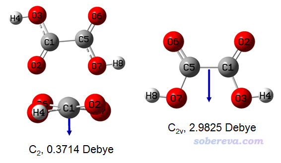
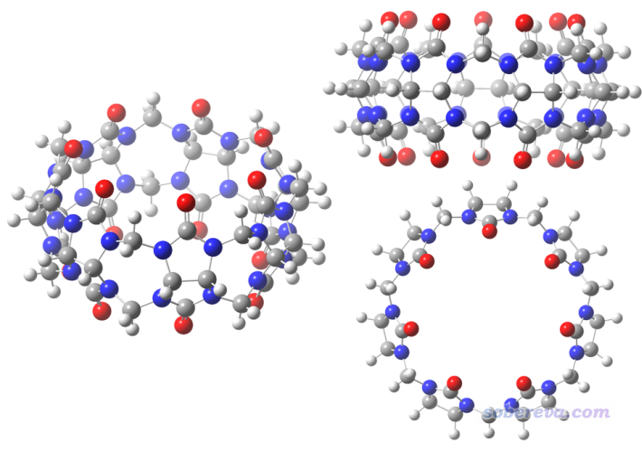
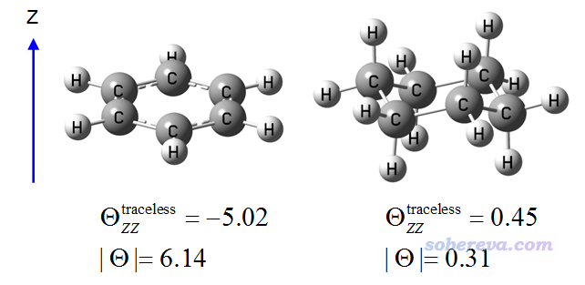
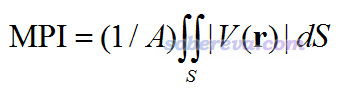
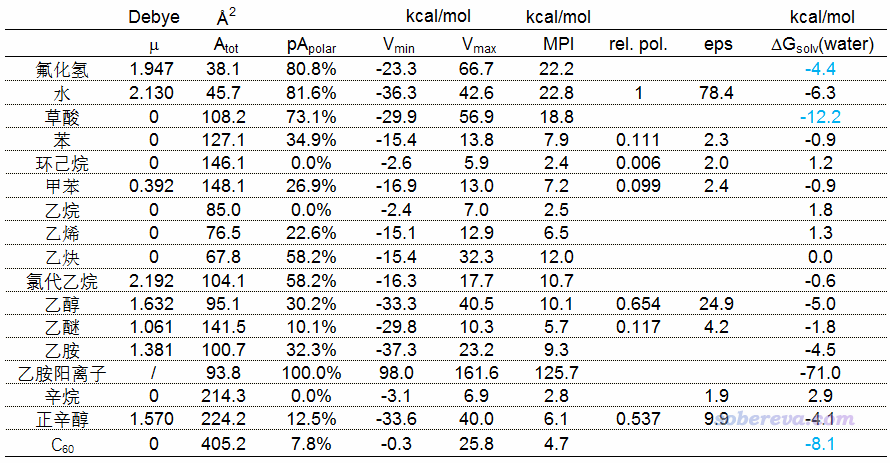

**谈谈如何衡量分子的极性**

The way of measuring molecular polarity

文/Sobereva@[北京科音](http://www.keinsci.com)

First release: 2019-Oct-16  Last update: 2020-Sep-29

## 0 前言

经常有人问怎么衡量分子的极性，是不是算个偶极矩就可以。实际上，极性是一个非常含糊的概念。从本质上来说，极性来自于净电荷分布的不均匀性，不均匀性越大则极性越强，而分布完全均匀就没有极性。至于极性这个概念怎么才能严格定量反映出来，这没有唯一答案，不同方式考察得到的结论可能大相径庭。本文就专门说说如何衡量分子的极性。本文首先介绍一下从理论计算和实验上有哪些方法可以衡量分子极性，最后一节用具有代表性的分子对不同方法进行对比，讨论什么指标在衡量极性时相对而言更有意义、更靠谱。对比体现出Multiwfn程序可以计算的分子极性指数（Molecular polarity index, MPI）在衡量分子极性时比较有实用性，值得读者在实际研究中采用。

## 1 从偶极矩角度衡量极性

一提起怎么衡量分子的极性，绝大多数人首先想到的就是计算偶极矩。确实偶极矩是最常被用来衡量分子极性的指标，比如去Google搜搜molecular polarity，看到的资料几乎都是拿偶极矩说事。偶极矩可以非常方便地通过量子化学计算准确得到，很多情况下也确实能体现出极性的大小，它本质上体现体系正电荷中心和负电荷中心的分离情况。比如偶极矩的顺序是水>一氯甲烷>甲烷，因此我们说这三个分子极性递减，这没错。

然而，需要注意的是，哪怕是小分子，在很多情况下用偶极矩来体现极性也会有严重误导性。我们看下面的草酸体系，图里给了B3LYP/def-TZVP下优化出的两种能量极小点构型（左侧的两个是不同的视角），在B3LYP/def2-TZVPD下算的偶极矩也给出了（计算时没考虑溶剂效应），箭头指示了偶极矩方向，朝向是负电荷中心指向正电荷中心

由常识都知道，羧基是个极性基团，草酸这么小的体系还有俩羧基，显然它应该是极性分子。然而从上图左边构象的偶极矩来看，由于数值极小，草酸几乎是非极性分子，这结论显然不对。另外，上图的右边的构象比左边构象的偶极矩大非常多，充分体现出对于极性分子，偶极矩是有严重的构象依赖性的。

尤其是对于大分子，更是不能随便拿偶极矩说事。下面是一个分子的三个不同构象，分子是D7h点群

此体系里电负性中等的碳和高电负性的氧、氮元素交错排列，从基本常识就知道肯定这个体系里原子电荷正负交替特征非常明显，理应认为是有高度极性特征的。然而，由于体系的对称特征，在垂直于环方向偶极矩精确为0，平行于环的方向偶极矩也非常小，因此拿偶极矩来衡量此体系的极性明显不妥。

不光偶极矩衡量上面这种高对称性体系的极性不适用，对于许多大分子，比如蛋白质、糖、核酸也都不适用。可以认为这些体系都有明显的“局部极性”，用局部片段的偶极矩可以衡量这种局部极性，而如果直接用整体的偶极矩来说明分子整体极性就很不妥了，因为局部偶极矩会有互相抵消。往往大体系的很多地方局部极性很大，但整体的偶极矩却不大，没法正确反映体系是高极性分子的事实。此外，如果大家了解电多极展开的话，就知道体系的电荷分布可以展开为单极矩（即体系净电荷）+偶极矩+四极矩+八极矩+十六极矩...一直到无穷阶。对于净电荷为0的体系，偶极矩相当于只是体系电荷分布的最低阶近似。对于大体系，光拿偶极矩反映电荷分布并讨论，显然太糙了。

另外，对于带电体系，用偶极矩大小衡量极性总是无意义的。因为这种情况下偶极矩的大小是决定于体系原点的选择的。换句话说，把体系整体平移一下，算出来的偶极矩就会出现变化，但显然平移对于分子的极性从原理上是没有内在影响的。

所以，什么时候能用偶极矩来衡量极性？答案是：中性小体系，并且体系里高极性局部区域间的极性相互抵消不是特别显著的情况。比如像乙醛、丙醇、乙醚、乙腈、甲酰胺等等都适用。

值得一提的是，想算准偶极矩的话基组必须带弥散函数。图便宜的话可以用def2-SVPD，图准的话可以用上面我用的def2-TZVPD，这俩基组在此文里都有介绍：《给ahlrichs的def2系列基组加弥散的方法》（<http://sobereva.com/340>）。强烈不推荐Pople系列基组加弥散函数后用来算偶极矩（如6-311+G**），效果很差。至于理论方法，用B3LYP、PBE0都可以，不昂贵而计算偶极矩精度又不错。

## 2 关于用四极矩讨论无偶极矩体系的极性

前述的电多极展开里，高于偶极矩的项我们这里称作多极矩。比偶极矩更高一阶的四极矩我觉得值得在这里顺便说一下。Gaussian做完单点等任务的计算后，末尾不仅输出偶极矩，也会给出包括四极矩在内的多极矩。四极矩是个3*3矩阵，Gaussian给出的四极矩有两种形式，彼此可相互变换。其中一种是Traceless Quadrupole moment（无迹的四极矩），即它的迹（三个对角元加和）为0。对于这种四极矩，体系在X/Y/Z上哪个方向电荷延展程度相对来说越高，它的XX/YY/ZZ中哪个分量就越大，因此可以反映出体系电荷分布偏离球对称程度。

苯和环己烷（椅式）都有六个碳原子，都是偶极矩为0的体系，从偶极矩上完全体现不出它们的极性差异，但实际上从四极矩的角度来看，它们的极性并不同。下面是在B3LYP/6-31G*下优化后用B3LYP/def2-TZVPD算的无迹的四极矩在垂直于环方向的分量，以及无迹的四极矩的大小|Θ|，即XX、YY、ZZ分量的平方和开根号，单位是Debye*Å。

由|Θ|可见，环己烷的电荷分布偏离球对称程度明显低于苯，即电荷分布更为均匀。因此从四极矩的角度，我们可认为环己烷的极性低于苯。我们还看到苯的无迹四极矩ZZ分量是个明显的负值，这体现出苯的电荷分布在垂直于环平面的方向上显著收缩；由于电子带的是负电荷，因此这等价于说在垂直于环平面方向上电子分布的延展程度高于在苯环平面的方向，这是苯环上丰富的pi电子云导致的。

有很多体系，比如甲烷等Td点群的体系，|Θ|精确为0。如果想通过电多极展开考察它们的极性，就得考察八极矩了，但这就相当抽象了。

总的来说，一般很少有机会拿四极矩去衡量分子的极性，像本节的例子那样适合用四极矩说事的情况并不多。也就是对于一些无偶极矩的小体系，非要通过电多极分析对比极性高低的话可以祭出四极矩。

顺带一提，笔者之前有篇文章J. Mol. Model., 19, 5387 (2013)，通过静电势和四极矩的角度讨论了无偶极矩的两个分子H2和N2的分子间相互作用，很推荐看看。对于无偶极矩的分子，其四极矩的大小明显影响它与其它分子的静电作用强度。在《静电效应主导了氢气、氮气二聚体的构型》（<http://sobereva.com/209>）也对这篇文章内容进行了介绍。

## 3 从分子表面静电势分布特征衡量分子极性

静电势是由体系电荷分布直接决定的，静电势对于考察分子间静电相互作用、预测分子凝聚相性质等方面有重要意义，不了解者参看此贴里的资料和其中列出的我的相关博文：《静电势与平均局部离子化能综述合集》（<http://bbs.keinsci.com/thread-219-1-1.html>）。分子中电荷的不均衡分布会体现在分子表面的静电势分布上，因此对分子表面静电势分布特征进行表征，就可以对分子的极性进行衡量。下面说的分子表面用的是Bader用电子密度0.001 a.u.等值面定义的范德华表面。

为了能直接通过分子表面静电势分布特征衡量体系的极性，笔者定义了一个量，叫molecular polarity index（分子极性指数），简写为MPI，定义如下

其中V是分子静电势，积分是对分子表面S进行积分，A是分子表面积。可以期望，MPI越大，分子的整体极性就越大。因为体系电荷分布不均匀性是分子极性的体现，分布越不均匀就越会导致分子表面静电势出现很正或者很负的区域，从而使得MPI较大。上式的表达式是积分形式表达的，实际上Multiwfn在计算的时候是基于构成分子表面的顶点及对应的三角来算的，算法详见笔者写的J. Mol. Graph. Model., 38, 314 (2012)。  
注：值得注意的是，即便体系电荷分布绝对均匀，分子表面静电势也并非精确为0。比如一个Ar原子，是严格非极性的，因为电子密度分布完全球对称，但在不同电子密度等值面上静电势的数值是不同的。在B3LYP/6-31G*级别下，Ar的电子密度0.001 a.u.表面上MPI是1.37 kcal/mol。因此MPI=0并不是极性的零点，但这不影响在不同分子之间横向对比MPI来比较极性的差异。

另外笔者还定义了分子极性表面积，即静电势绝对值大于10 kcal/mol的面积，以及分子非极性表面积，即静电势绝对值小于10 kcal/mol的面积。容易理解，对于中性分子，分子极性表面积占总表面积百分比越大，理应认为分子的极性越大。之所以用10 kcal/mol作为标准，一方面是其数值比较“整”，另一方面是像烷烃这种典型的非极性分子的范德华表面上不会有静电势绝对值超过这个范围的地方（从后文表格里分子的Vmin和Vmax可以看到这一点）。

如果MPI在你的文章中被使用，除了要按照Multiwfn启动时的提示引用Multiwfn程序本身的原文外，也请同时引用笔者的论文Carbon, 171, 514-523 (2021)，这是第一篇包含MPI指数的公开发表的论文，在《全面探究18碳环独特的分子间相互作用与pi-pi堆积特征》（<http://sobereva.com/572>）中对此论文还做了专门的解读和评述，文中用MPI指数考察了独特的18碳环体系的分子表面静电势，分析了与其它分子作用的特征。如果要引用笔者对极性和非极性表面积的定义，请引用Multiwfn手册，格式如：Tian Lu, Multiwfn Manual, version 3.7, Section 3.15.1, available at http://sobereva.com/multiwfn (accessed Sep 29, 2020)。

上述的这些量用Multiwfn的定量分子表面分析功能做表面静电势分析后就可以直接输出出来。程序可以在<http://sobereva.com/multiwfn>免费下载。Multiwfn的基础知识见《Multiwfn FAQ》（<http://sobereva.com/452>），定量分子表面分析功能的基本使用见<http://sobereva.com/159>，可以用的输入文件和产生方式见《详谈Multiwfn支持的输入文件类型、产生方法以及相互转换》（<http://sobereva.com/379>）。

下面举一个例子，对计算乙胺的上述量。启动Multiwfn，输入  
ethylamine.fch  //用B3LYP/def2-SVP优化，之后B3LYP/def2-TZVP算单点产生的文件  
12  //定量分子表面分析  
0  //开始分析。默认分析的是静电势在0.001 a.u.电子密度等值面上的分布特征  
然后可以看到一大堆信息：

 Volume:   565.17983 Bohr^3  (  83.75103 Angstrom^3)  
  Estimated density according to mass and volume (M/V):    0.8939 g/cm^3  
  Minimal value:    -37.25348 kcal/mol   Maximal value:     23.19198 kcal/mol  
  Overall surface area:         359.52687 Bohr^2  ( 100.67779 Angstrom^2)  
  Positive surface area:        281.16492 Bohr^2  (  78.73421 Angstrom^2)  
  Negative surface area:         78.36195 Bohr^2  (  21.94358 Angstrom^2)  
  Overall average value:    0.00375931 a.u. (      2.35900 kcal/mol)  
  Positive average value:   0.01186119 a.u. (      7.44301 kcal/mol)  
  Negative average value:  -0.02531045 a.u. (    -15.88256 kcal/mol)  
  Overall variance (sigma^2_tot):  0.00044428 a.u.^2 (   174.94388 (kcal/mol)^2)  
  Positive variance:        0.00007670 a.u.^2 (     30.20141 (kcal/mol)^2)  
  Negative variance:        0.00036758 a.u.^2 (    144.74248 (kcal/mol)^2)  
  Balance of charges (nu):   0.14283204  
  Product of sigma^2_tot and nu:   0.00006346 a.u.^2 (   24.98759 (kcal/mol)^2)  
  Internal charge separation (Pi):   0.01314447 a.u. (      8.24829 kcal/mol)  
  Molecular polarity index (MPI):   0.40252623 eV (      9.28248 kcal/mol)  
  Nonpolar surface area (|ESP| <= 10 kcal/mol):     68.12 Angstrom^2  ( 67.66 %)  
  Polar surface area (|ESP| > 10 kcal/mol):         32.56 Angstrom^2  ( 32.34 %)

可见体系总面积是100.67埃^2，MPI是9.28 kcal/mol，非极性表面积是68.12埃^2（占总表面积67.66%），极性表面积是32.56埃^2（占总表面积32.34%）。其它指标的定义和实际意义看手册3.15.1节。可见用Multiwfn计算这些指标相当方便。如果计算静电势时让Multiwfn自动调用cubegen（做法见<http://sobereva.com/435>），计算很大的体系也花不了多少时间。

## 4 从实验角度衡量分子极性

除了偶极矩外，还有不少可观测的分子性质和它的极性有密切关系，因而可以在一定程度上衡量极性，这里说一些。

溶解自由能的定义和计算方法在《谈谈隐式溶剂模型下溶解自由能和体系自由能的计算》（<http://sobereva.com/327>）里有详述。大家都知道相似相溶原理，极性-极性分子间，以及非极性-非极性分子间容易互溶，而极性和非极性分子间难以互溶，极性差异越大则通常越难互溶。A溶质在B溶剂中越容易溶，则A在B溶剂中的溶解自由能就往往越负。因此，我们可以计算不同分子在水当中的溶解自由能，由于水的极性极大，因此溶解自由能越负，可以认为分子的极性越高，反之溶解自由能越正，则可认为分子的极性越低。顺带一提，诸如SMD这样的常用的溶剂模型，溶解自由能是分为极性和非极性两部分贡献的，前者体现溶质-溶剂之间的静电、极化作用导致的自由能降低，因此产生负贡献，而后者则体现其它效应，贡献可正可负。对于极性不很小的分子，在水中的溶解自由能的极性部分总占主导，使得数值为负。而极性特别小的分子，诸如烷烃，极性部分负贡献很小，而非极性部分此时是正贡献，导致在水中的溶解自由能为正。由于溶剂与溶质处处发生作用，体系的各个区域都对溶解自由能有贡献，效果会以类似于标量和的方式累加，因此用溶解自由能方式判断极性时并不会像用偶极矩那样会由于结构的空间排列原因产生抵消（类似矢量和）。但这也带来一个问题，也就是如果体系有多个极性基团时，溶解自由能体现的不是体系的平均极性，比如丙三醇的溶解自由能远高于甲醇，但如果说丙三醇的极性高于甲醇是不妥的。后面有例子会体现这一点。

相对介电常数(eps)与分子的极性有密切关系。通常极性越高的分子的介电常数越高，比如水在标况下eps达到78；极性越低的分子通常介电常数越低，比如环己烷的eps仅有2.0。原因在于eps体现的是介质导致静电作用的衰减，对于极性分子构成的液体，加电场会导致其中的分子朝向被极化，它们产生的反方向的电场会一定程度抵消外电场，致使静电作用比在真空中衰减得更快。不过介电常数虽然也可以通过分子动力学等方式模拟，但终究比较麻烦，精度往往也不是很好（取决于力场和模拟设定），而且和偶极矩一样对衡量大分子极性也不适用（局部极性会相互抵消），因此不是很建议用eps来衡量极性。

溶质的电子基态和激发态的极性是不同的，比如孤对电子到反pi轨道类型的激发，激发态的极性是小于基态的。由于溶剂对两个态稳定化程度不同（极性越大的溶剂令极性越大的态能量降低越多），因此溶剂下和真空下的激发能是不同的。对于基态到特定的某个激发态的跃迁，溶剂的极性越大，会导致激发能改变越多。因此可以通过溶剂导致谱峰位移程度来衡量极性。<https://sites.google.com/site/miller00828/in/solvent-polarity-table>这个表格里的relative polarity就是根据溶剂令吸收峰位移得到的。用这种方式衡量极性确实是合理的，但必须做实验。虽然理论计算也可以计算不同溶剂下的光谱，但是在隐式溶剂模型下算光谱时需要给出介电常数，这又遇到了用eps衡量极性时的问题。

色谱法中样品的保留时间和物质极性也有密切联系。在正相色谱中，流动相是非极性物质，极性小的物质会先被洗脱下来，即保留时间较小，在谱图前面出峰，而极性大的后被洗脱下来，在谱图后面出峰。反相色谱则相反，流动相是极性物质，高极性的保留时间小。不过这只是一般规律，还有其它因素也会影响保留时间。

## 5 几种衡量分子极性的参数的对比

下面我给出我对一些比较有代表性的分子计算的一些前面提及的数据，从而对比一下各种指标对极性的衡量。要强调的是，没法说哪一种指标衡量极性是完全合理的，本来极性就是个含糊的概念，我们只能说哪种指标相对而言更有实际意义、更靠谱、更有普适性。在我来看，一个合理的衡量极性的指标应当能够反映出整个分子的平均极性。

下面表格中μ是偶极矩，Atot是总表面积，pApolar是前述的极性表面积所占总面积百分比，Vmin和Vmax是分子表面静电势最小和最大点的数值。MPI是前述的分子极性指数。rel. pol.是前述的文档里的relative polarity，eps是常温下实验测定的静态介电常数，ΔGsolv(water)是标况下实验测定的分子在水中的溶解自由能（前后都是1M标准态）。有些单元格是空着的，要么是常温下相应分子是气态本身就没法测，要么是没有查到。体系在B3LYP/def2-SVP下优化，之后在B3LYP/def2-TZVP下得到波函数，并使用2019-Oct-15更新的Multiwfn 3.7(dev)进行分析得到静电势相关数据和表面积。偶极矩在B3LYP/ma-TZVP下得到（注：B3LYP/def2-SVP下草酸极小点是C2h点群，偶极矩精确为0）。优化、单点、偶极矩计算时都没有考虑溶剂模型。溶解自由能里蓝字的是我用M05-2X/6-31G*结合SMD溶剂模型算的。

先看上表里的偶极矩。偶极矩确实能区分开一些分子的极性，比如高极性的水的偶极矩2.130远大于低极性的甲苯的偶极矩0.392。但是用偶极矩来衡量极性在很多情况下明显不靠谱。草酸在前面已经提了就不说了，从偶极矩的角度看，苯、环己烷、乙烷、乙烯、乙炔...的极性完全相同，显然这是不科学的，其它指标都指出它们的极性并不相同。从偶极矩的角度看，乙醇和正辛醇的极性几乎没有差别，前者和后者偶极矩分别是1.632和1.570，但由于正辛醇有一个很长的烃链，显然应当认为正辛醇的极性远低于乙醇才对。氯代乙烷的偶极矩2.192比氟化氢的1.947还大，若因此就认为氯代乙烷比氟化氢的极性更大显然是不对的，严重违背化学直觉。可见拿偶极矩衡量极性实在不可靠。

再看极性表面积占总表面积的百分比，pApolar。从数据可见对于靠偶极矩不能区分或不能正确区分极性的很多分子，靠这个指标可以区分。例如水的81.6%明显大于氯代乙烷的58.2%，乙炔（58.2%）>乙烯（22.6%）>乙烷（0%），乙醇（30.2%）>正辛醇（12.5%），等等，这都与极性关系次序准确。但是靠这个指标判断也有一些不妥，比如氯代乙烷的58.2%比乙醇的30.2%大了近一倍，但乙醇的极性理应不比氯代乙烷小那么多。

Vmin和Vmax本身不能用来衡量极性，但可以作为用其它指标讨论极性的时候的一个辅助。可以认为分子具有很负的Vmin或很正的Vmax是体系具有较大极性的前提。众所周知氟化氢、水的极性都很大，确实二者Vmin都很负，同时Vmax都很正。而缺乏极性基团的环己烷、辛烷、乙烷的Vmin和Vmax都比较接近于零。虽然氯代乙烷的pApolar高达58.2%，但由于其Vmin不算特别负而Vmax也不算特别正，因此不应当认为其极性比pApolar为30.2%的乙醇高很多。由于Vmin和Vmax只体现分子表面上静电势最负和最正的两个点的静电势情况，因此光靠Vmin和Vmax没法说明分子整体极性情况，比如乙醇和正辛醇的Vmin和Vmax相仿佛，这是因为二者都有羟基，但正辛醇的很长的烃链拉低了体系的极性这点则没有在此反映出来。

再来看笔者的MPI指数。由数据可见MPI用来衡量极性，总体上比较符合化学直觉（虽然少数极性顺序可能有点违背直觉，但问题不显著）。带杂原子的体系给出的极性顺序是水(22.8)≈HF(22.2)>草酸(18.8)>氯代乙烷(10.7)≈乙醇(10.1)≈乙胺(9.3)>正辛醇(6.1)≈乙醚(5.7)。给出的烷烃类极性顺序是乙炔(12.0)>苯(7.9)≈甲苯(7.2)>=乙烯(6.5)>辛烷(2.8)≈乙烷(2.5)≈环己烷(2.4)。根据MPI，C60 (4.7)的极性介于乙烷和乙烯之间。乙炔的MPI数值不小，都已经赶上乙醇了，这是因为绕着C-C三键有一大圈pi电子，导致很大一块区域表面静电势都为负，而乙炔里氢原子的电荷明显比乙烯、乙烷里的大很多，导致乙炔两端静电势明显为正。

Relative polarity将水定义为了1。其给出的顺序是苯>=甲苯>环己烷，以及乙醇>正辛醇>乙醚，都和MPI相同。但是这个指标的分辨能力稍微差一些，比如正辛醇比乙醇长两倍，长出来的部分都是极性很低的烃链，但前者和后者的Relative polarity分别是0.654和0.537，相差得没有直觉上那么大。

静态介电常数eps和MPI给出的极性顺序比较一致。比如都是乙醇>正辛醇>乙醚>辛烷，也都指出苯和甲苯比环己烷极性更强。

表格里的分子在水中的溶解自由能有些和一般直觉上的极性相吻合，比如体现出水的极性最大，HF的极性也很大，并且体现极性顺序：苯(-0.9)=甲苯(-0.9)>环己烷(1.2)，乙炔(0.0)>乙烯(1.3)>乙烷(1.8)。但也有些不是那么符合直觉，比如氯代乙烷(-0.6)仿佛还没有苯(-0.9)的极性大，乙醇(-5.0)和正辛醇(-4.1)区分度不高，乙烷(1.8)显得比辛烷(2.9)极性更大并没什么道理。草酸的溶解自由能-12.2比水都大一倍，原因在前面提到了，这是因为草酸有两个羧基，对溶解自由能的贡献有累加效果，如果光看数值就认为草酸比水的极性更大显然是不合适的。C60明显是低极性分子，但算出来它在水中的溶解自由能-8.1比水分子在水中的溶解自由能还负，若认为C60的极性比水分子还高明显不妥。之所以这么负是因为虽然C60局部极性不大，也就类似于苯，但由于与溶剂作用面积很大，因此溶解自由能很负。从这些数据来看，能用溶解自由能衡量分子极性的，也就是分子大小相仿佛，而且具有相同数目极性基团的情况。

总的来说，没有哪种指标对所有体系都能100%给出完全符合直觉的极性顺序，但相对来说，MPI指数对于绝大多数情况都表现较好，比较普适，而且计算非常容易，因此笔者建议拿它来衡量整体极性。

顺带一提，表格里有个阳离子体系，即乙胺阳离子。它的Vmin和Vmax都是非常大的正值，这是理所应当的，因为阳离子体系通常分子表面的静电势都被它带的正电荷所主导，故通常静电势都是正的而且数值较大。它的MPI也远大于任何中性分子，在水中的溶解自由能也远比中性分子要负得多得多。因此如果要把离子体系和中性分子放到一起对比，那姑且可以认为离子体系具有极大的极性。
