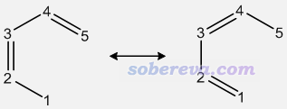
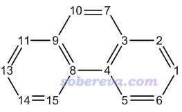
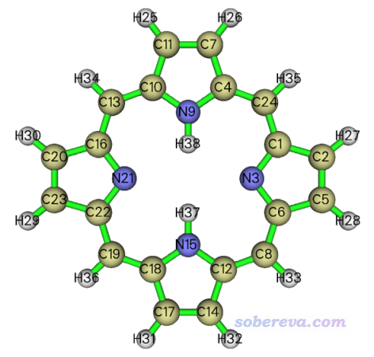
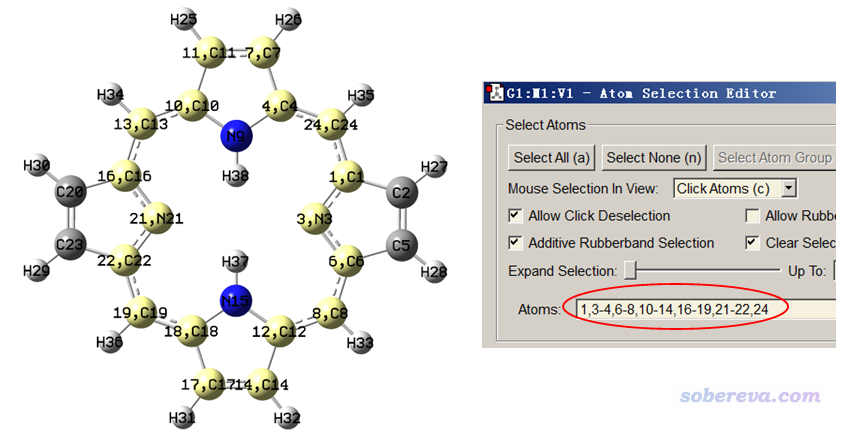
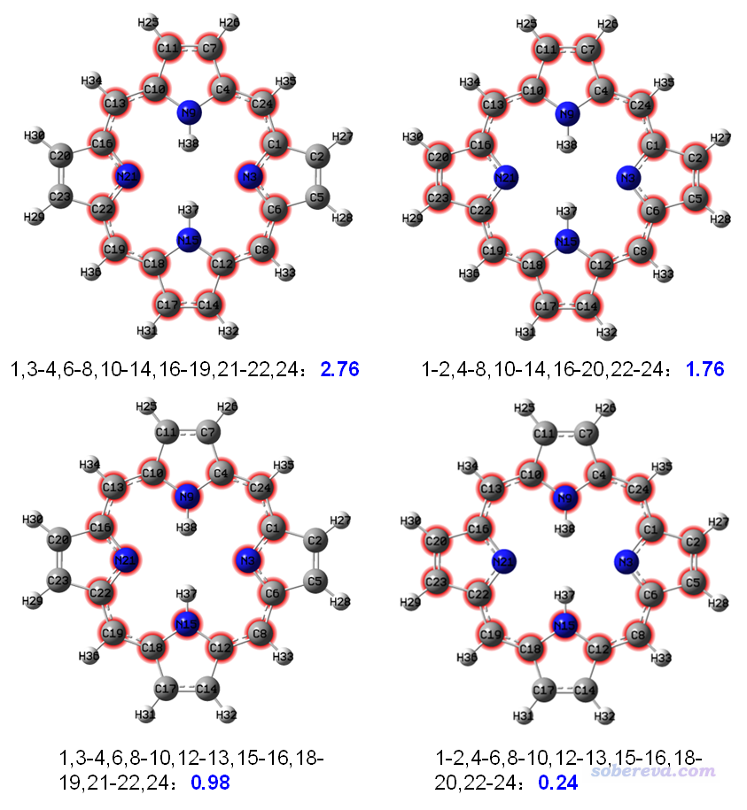
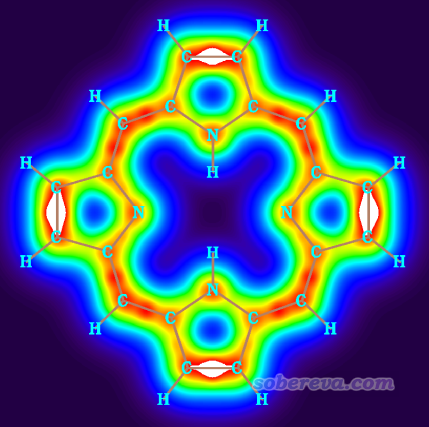
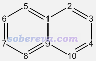

**2020-Sep-14后记**：本文中关于多中心键级计算耗时的说法已经完全过时了。因为从2020-Sep-12更新的Multiwfn开始，程序中实现了笔者提出的一种超快的多中心键级计算算法，而精度没有丝毫损失，对于哪怕含有几十个原子的环也可以非常快速地计算多中心键级，这使得多中心键级的应用范畴有了革命性的扩展。相比之下，AV1245的实际价值就已经不大了。

**使用Multiwfn计算AV1245指数研究大环的芳香性**

Using Multiwfn to calculate the AV1245 index to study
the aromaticity of macrocycles

文/Sobereva@[北京科音](http://www.keinsci.com)

First release: 2019-Oct-27  Last update: 2022-Apr-29

## 0 前言

Multiwfn程序（<http://sobereva.com/multiwfn>）支持大量分析芳香性的方法，见《衡量芳香性的方法以及在Multiwfn中的计算》（<http://sobereva.com/176>）。其中提到了一个重要指标是多中心键级，这个指标对于研究多中心键和芳香性非常方便、可靠，如今非常流行。多中心键级的一个主要缺点是计算耗时随考虑的中心数呈指数型增长，虽然算6、7个原子瞬间就能得到结果，但计算12个原子以上的环却几乎不可能。

在Phys. Chem. Chem. Phys., 18, 11839 (2016)中提出了AV1245指数，可以视为是多中心键级的近似，原文实测发现其数值与多中心键级的相关性不错。由于AV1245的耗时只是随环中的原子数增加以线性方式增长，因此哪怕对于包含十几、乃至几十个原子的大环，AV1245都可以快速地计算出来，这使得定量衡量大环的芳香性成为了可能。Multiwfn的最新版本已经支持了AV1245指数的计算，作为主功能9的子功能11出现。下面交代一些此方法的思想和细节，然后给出两个具体的计算例子。

值得一提的是，在Carbon, 165, 468 (2020)一文中，笔者将此方法应用于了电子结构非常特殊的18碳环体系用于考察其pi电子全空间离域特征和芳香性，得到了很有价值的结果，充分体现出了AV1245的实际意义。另外，在《深入揭示18碳环的重要衍生物C18-(CO)n的电子结构和光学特性》（<http://sobereva.com/640>）介绍的笔者的Chem. Eur. J., 28, e202103815 (2022)一文对C18-(CO)n的电子离域的研究中，将AV1245分解为了in-plane和out-of-plane两类pi电子的贡献分别讨论了它们的离域性。在《18碳环等电子体B6N6C6独特的芳香性：揭示碳原子桥联硼-氮对电子离域的关键影响》（<http://sobereva.com/696>）介绍的笔者的Inorg. Chem., 62, 19986 (2023)一文中还利用AV1245分析了18碳环的等电子体B6N6C6和B9N9的芳香性差异。**非常建议读者们看看这几篇文章里面的相关讨论，也推荐在使用AV1245的时候引用它们作为应用范例。**

## 1 AV1245的原理

原子序号的输入顺序是可能影响多中心键级的计算结果的。一般我们用多中心键级研究芳香性的时候，是按照环当中原子顺序依次输入的。还有一种少见的多中心键级是在计算过程中考虑所有原子序号的置换(permutation)，表达式见Multiwfn手册3.11.2节，这种多中心键级下面称为I_perm。I_perm并不适合研究电子沿着某个环的路径的离域情况，但适合用于考察选定的一批原子彼此间的离域程度（不考虑特定的离域路径）。

一些研究发现在共轭环当中，1-2和4-5键之间通常有下图所示的这种共振

这种共振特征可以靠1,2,4,5之间的四中心I_perm捕捉到，数值越大说明共振效应越强，也因此暗示这些原子所在的环的相应区域的共轭效应比较强。I_perm和电子共享指数(ESI, electron sharing index)有直接联系，ESI可以根据此式从I_perm换算过来：ESI=[2/(n-1)!]*I_perm，此处n是中心数。因此，四中心ESI等于四中心I_perm除以3，二者是正比关系。

AV1245将被研究的环上所有四中心ESI取平均作为衡量这个环的芳香性的指标。其思想容易理解，如果环的各个局部位置都存在显著的上述形式的共振，即环的各个区域都有很强的共轭，那么整个环的共轭就比较强，从而可以说环的芳香性比较大。

AV1245的这种衡量环的芳香性虽然没有多中心键级原理上严格，但根据原文的实际测试，发现对于能算得动多中心键级的环，AV1245能不错地重现出多中心键级所能展现出的芳香性差异。对于多中心键级算不动的大环，经测试AV1245的结果也比较满足一般化学直觉，应当是合理的。

AV1245绝不是研究大环芳香性的唯一方法，比如往往可以看轨道图形根据休克尔规则考察、通过ICSS考察（见《通过Multiwfn绘制等化学屏蔽表面(ICSS)研究芳香性》<http://sobereva.com/216>）、通过ELF-pi或LOL-pi考察（见《在Multiwfn中单独考察pi电子结构特征》<http://sobereva.com/432>）、通过AICD环电流图考察（见《使用AICD 2.0绘制磁感应电流图》<http://sobereva.com/294>）。AV1245的一个好处是计算非常简单和快速，而且可以给出一个简单直白的数值便于横向对比。

值得一提的是，原文里计算AV1245用的ESI是基于原子重叠矩阵算的，而且利用AIM方式划分原子空间，这种方式计算相当耗时、费事，把简单问题搞复杂。因此笔者将AV1245实现在Multiwfn中的时候没有用原文的方法，而是以常规的基于密度矩阵和重叠矩阵的方式计算I_perm、折算成四中心ESI，再组成AV1245值。这种方式算AV1245速度很快，结果也合理。只不过由于和原文做法的差异，Multiwfn这样给出的AV1245数值比原文里的大一些（完全不影响横向对比），乘上0.635后和原文数值比较接近。这种做法唯一一个缺点就是基组不能带弥散函数，否则而由于计算出的多中心键级不合理，最终导致AV1245的结果也不合理。Multiwfn支持的各种包含基函数信息的格式，如.fch、.molden都可以用于这种情况下计算AV1245，产生方式见《详谈Multiwfn支持的输入文件类型、产生方法以及相互转换》（<http://sobereva.com/379>）。

有时候要算阴离子，这种情况往往要带弥散函数。为了对这种情况也能合理且快速地计算AV1245，Multiwfn还支持基于自然原子轨道(NAO)计算AV1245。此时需要用NBO程序带着DMNAO关键词的输出信息作为输入文件，这样计算的AV1245不怕弥散函数；而对于本身就没用弥散函数的时候，这样计算的结果和常规方式计算的几乎一样。

下面看两个例子。第一个例子是菲，我们用AV1245计算它的中心的六元环和边缘的六元环，看看芳香性的差异。这个体系用多中心键级也可以研究，因此我们可以对比一下AV1245和更严格的多中心键级的结论是否吻合。第二个例子是卟啉，我们将要通过AV1245研究其中四种可能的大范围的离域路径，看看哪种离域特征最强，因而最能体现卟啉的芳香性特征。

## 2 例1：分析菲的局部芳香性

本例研究的菲的原子序号如下所示

启动Multiwfn，然后输入  
examples\phenanthrene.fch  
9  //键级分析  
11  //计算AV1245  
1,2,3,4,5,6  //边缘环上的原子序号，按照原子连接关系输入（顺时针输入还是逆时针输入都一样）  
结果如下

 4-center electron sharing index of     1     2     4     5:    0.01304820  
  4-center electron sharing index of     2     3     5     6:    0.01245026  
  4-center electron sharing index of     3     4     6     1:    0.00801537  
  4-center electron sharing index of     4     5     1     2:    0.01304820  
  4-center electron sharing index of     5     6     2     3:    0.01245026  
  4-center electron sharing index of     6     1     3     4:    0.00801537

 AV1245 times 1000 for the selected atoms is   11.17127674

由于环上有6个原子，所以如提示所示，程序一共算了6种四中心ESI，然后取平均并乘以1000使得数量级便于考察，最后结果为11.17。

之后我们输入3,4,8,9,10,7来计算中间环的1000*AV1245，结果为5.01。这体现出，菲的边缘的环的芳香性强于中间的环。

AV1245给出的这个结论是否可靠？由于六元环比较小，我们可以再用意义更严格的六中心键级检验一下。接着输入  
q  //退出AV1245计算界面  
0  //返回至主菜单  
9  //键级计算  
2  //多中心键级  
1,2,3,4,5,6  //边缘环的原子序号  
程序输出的多中心键级为0.059。然后再输入3,4,8,9,10,7，多中心键级为0.026，可见这也明显体现出边缘环的芳香性显著强于中间的环。通过其它方法，比如AdNDP、ELF-pi，也同样可以得到这样的结论，见《使用AdNDP方法以及ELF/LOL、多中心键级研究多中心键》（<http://sobereva.com/138>）。

下面再演示一下基于NAO对菲计算AV1245。要用的输入文件是examples目录下的phenanthrene_DMNAO.out，这是一个Gaussian输出文件，对应的输入文件是examples目录下的phenanthrene_DMNAO.gjf。从这个.gjf文件可见，任务要求Gaussian调用NBO模块进行分析，并且将DMNAO关键词传递给NBO模块来让它把NAO为基的密度矩阵输出出来。启动Multiwfn，依次输入  
examples\phenanthrene_DMNAO.out  
9  //键级分析  
11  //计算AV1245。此时如屏幕提示所示，自动从输入文件里读取了NAO信息和以NAO为基的密度矩阵  
1,2,3,4,5,6  //边缘环上的原子序号  
计算结果为10.98，和前面基于原始基函数算出来的11.17基本一样，这是因为当前没用弥散函数，所以差异必然不会很明显。这也同时暗示不用弥散函数时，直接基于原始基函数算的AV1245是靠谱的，完全没必要像原文那样基于耗时的AIM划分来计算。

注：基于NAO计算AV1245的时候也可以用独立的NBO程序的输出文件作为Multiwfn的输入文件，不是非得依赖于Gaussian。

## 3 例2：分析卟啉不同离域路径的芳香性

这一节用到的卟啉在B3LYP/6-31G*下优化得到的fch文件可以在<http://sobereva.com/multiwfn/extrafiles/porphyrin.rar>下载。此体系的结构如下所示

计算这个体系的大环的AV1245和上一节其实一样，按照连接顺序依次输入环上的各个原子序号即可。但是一个一个手动输入很麻烦，对照着结构看序号还容易眼花看错，导致结果无意义。为了便于输入大环中的原子序号，Multiwfn有个很贴心的设计，结合GaussView（版本>=6.0）使用非常方便。首先，进入AV1245计算界面后先输入d然后按回车进入特殊的输入模式，然后在GaussView里选择刷子选择工具，即Builder - Select Atoms by Brush，然后按住鼠标左键滑过要研究的环上每个原子使之被选中成为黄色（如下图所示），之后进入Tools - Atom Selection，把环上的原子序号从文本框里（见下图）拷到Multiwfn窗口里，之后Multiwfn就会根据原子连接关系将输入的序号自动整理成满足连接关系的序号，然后开始AV1245的计算。

下面我们来实际算一下卟啉的上图所选中的环的芳香性。启动Multiwfn后输入  
porphyrin.fch  
9  //键级分析  
11  //计算AV1245  
d  //在此模式里，环上的原子序号可以按照任意顺序输入  
1,3-4,6-8,10-14,16-19,21-22,24  //从GaussView的Atom Selection界面里拷出来的环上的原子序号  
输出信息如下

 The order of the atoms in the ring has been successfully identified

 Number of selected atoms:    18  
  Atomic sequence:  
      1     3     6     8    12    14    17    18    19    22    21    16  
     13    10    11     7     4    24

 4-center electron sharing index of     1     3     8    12:    0.00297431  
  4-center electron sharing index of     3     6    12    14:    0.00194343  
  4-center electron sharing index of     6     8    14    17:    0.00287786  
 ...略  
  4-center electron sharing index of     7     4     1     3:    0.00194343  
  4-center electron sharing index of     4    24     3     6:    0.00297431  
  4-center electron sharing index of    24     1     6     8:    0.00259647

 AV1245 times 1000 for the selected atoms is    2.75856093

从提示可见，Multiwfn根据输入的序号和原子连接关系正确识别出了环上的实际原子序列（疑心重的话，可以对照结构图上的序号去验证），AV1245乘以1000后的结果为2.758。

类似地，我们对其它几种可能的共轭路径也这么算，依次输入  
d  
1-2,4-8,10-14,16-20,22-24  
d  
1,3-4,6,8-10,12-13,15-16,18-19,21-22,24  
d  
1-2,4-6,8-10,12-13,15-16,18-20,22-24

下图将上面算过的四种情况的结果汇总在了一起。考察的路径通过红色高亮显示了，黑色文字是在Multiwfn的“d”模式里输入的原子序号，蓝字是AV1245乘以1000后的值。

可见上图左上角的路径整体共轭程度最高，因此这个环的AV1245数值可以代表卟啉的芳香性并与其它体系进行对比。

在前述的<http://sobereva.com/432>一文中，也介绍了怎么绘制卟啉分子平面上方1.2 Bohr 处的LOL-pi图，结果如下

从LOL-pi图中的红色和橙色勾勒出的路径可以看出，卟啉这个体系中的pi电子的离域路径倾向于穿越吡咯区域的氮原子，而同时倾向于避开N-H部分的氮原子。这样的优势离域路径正好也是前面我们算出来的AV1245最大的路径，因此很好地体现出AV1245在研究大环芳香性上是颇有意义的。

需要注意的是，在“d”模式里便利地输入序号有个限制，也就是被研究的环里每个原子不能同时与超过两个在环上的原子相连。比如下面的体系，我们不能直接在“d”模式里输入1-10来让Multiwfn自动识别出整个10元环上正确的原子连接顺序，因为1、9号原子同时连接了三个被考察的环上的原子。

## 4 总结

AV1245对于考察大环芳香性非常有用，本文的例子已经很大程度体现了其价值和合理性。在原文里有更多例子，感兴趣的读者可以参看。由于AV1245提出的年代较晚，而且之前没有公开的程序可以实现，因此截止到目前（2019年）还极少在实际研究中被使用，可靠性还需要更多的检验。笔者相信，有了Multiwfn这么方便的实现AV1245计算的程序，此方法在未来应该会得到比较多的应用。

从2020-Jun-1更新的Multiwfn开始，Multiwfn又新支持了AVmin指数，这是AV1245的作者在J. Phys. Chem. C, 121, 27118 (2017)中提出的。AVmin对应于计算AV1245过程中涉及的4c-ESI的最小的绝对值。AVmin体现了整个路径上电子共轭的“瓶颈”，而不是像AV1245那样体现的是平均共轭程度，因此在衡量大环的芳香性上有其独特价值。这个特点在Phys. Chem. Chem. Phys., 20, 2787 (2018)中使用各种芳香性指标考察卟啉类体系的离域路径上有所体现。AVmin会在给出AV1245的时候同时给出，讨论例子见Multiwfn手册4.9.11节。
