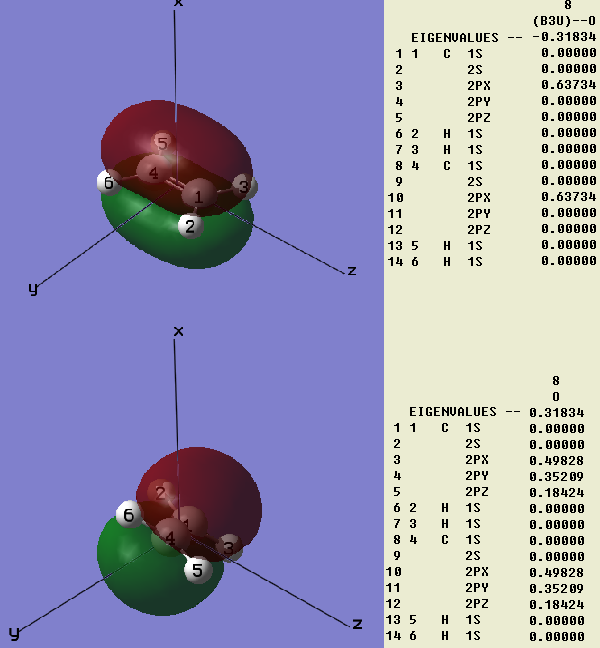
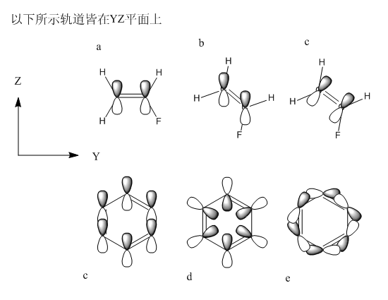
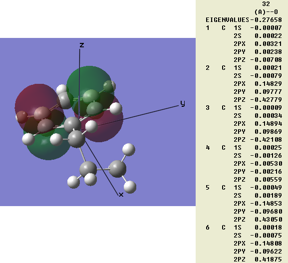

**谈谈原子轨道朝向引起的量子化学计算结果与经验观念的差异**On the differences between quantum chemistry calculation results and empirical concepts caused by atomic orbital orientation  
  
文/Sobereva @[北京科音](http://www.keinsci.com/)    Last update: 2010-Mar-27

  
  
我曾在《谈谈5d-6d型d轨道波函数与它们在高斯中的标识》一文中讨论到量化程序中的基函数与实际中的原子轨道的对应问题，即6d型笛卡尔GTF函数是难以对应实际实际原子轨道的，这是基函数本身形式的问题。导致对应问题的另一个因素，就是分子的取向问题，它造成了分子轨道组成与常规化学观念相冲突，比如π键。这个问题常常被忽视，很有必要在此讨论一下。当然，还有其它因素导致对应问题，比如使用扩展基等等，都给直观地讨论分子轨道的组成带来了很大困难。（有人提出AOIM、NPA方法来解决基函数与实际原子轨道对应性的问题）  
  
注：下文所说的p轨道，虽然在量化计算中描述它用的函数形式与真实原子轨道波函数是不同的，本质意义也不一样，但在极小基下，可以近似地将二者画上等号。下文就假设两种情况下的差别仅在于本文讨论的朝向问题。下文假设量化计算时的坐标系用的是笛卡尔坐标，这样坐标轴确定，讨论起来方便。  
  
  
首先考虑这样一个问题。乙烯有π键，一般看成是两个碳原子的类型相同的p轨道组成，比如都是px，它们是垂直于分子平面而平行于某坐标轴的。我们用高斯用极小基计算乙烯，得到图1中上方的情况。这没什么问题，从组合系数中可以看到的确由且仅由两个2px轨道组成。  

  
如果将乙烯旋转一下，并且使用nosymm关键字不让高斯自动重新设置分子的朝向，结果会怎样？程序中的描述这个p轨道的基函数朝向也会随之改变么？如果不随之改变的话，则px轨道将不再垂直于分子平面，π键还能形成否？  
  
如果原子轨道朝向会随分子旋转而改变，则px/py/pz将不再平行于对应的坐标轴，则其函数形式也必须做变换，这是件麻烦事。更重要的是，若量化程序中的原子轨道朝向不是固定的话，也就是说px/py/pz并非必须平行于对应坐标轴，那么程序如何确定轨道的朝向？对于一个复杂的分子，程序怎么知道每个原子上的原子轨道应该朝向哪个方向？难道也得通过变分方法，改变原子轨道的朝向，使之达到能量最低么？例如图2的苯，究竟每个碳上的pz轨道的朝向是c、d还是e情况，或者其它情况？显然，如果程序中各种轨道朝向不是固定的话，会带来上述很多问题。  

  
实际上，量化程序中，原子轨道基函数的形式是不随输入文件中分子的取向而改变的，也就是说由于坐标轴是固定的，px/py/pz也一定平行于坐标轴（d、f、g轨道也如此），不管分子怎么转它们的朝向都不会变。比如图2所示，让a状态的氟代乙烯分子在YZ平面上旋转，pz轨道的朝向将不变，为b情况，而不会成为c情况。  
  
我们再来看看将乙烯进行旋转后的高斯计算结果，如图1下方所示。可以看到，π键照常形成，从图上看与原先没有任何差异，分子轨道能量也与原先一致。然而，组合系数却发生了很大变化，原先只有px参与，现在px、py、pz都有很大程度的参与。这看起来很有趣，波函数组成看似不同，但结果完全一致。这并非偶然，而是必然，下面就来分析一下其原因。  
  
将分子旋转，可以看成是固定分子而旋转坐标轴，已经提到，量化计算中原子轨道的朝向与坐标轴方向是“绑定”的，所以也就等于旋转了原子轨道的朝向，将旋转后得到的新朝向的三个p轨道叫做px'、py'、pz'，原先的朝向叫做px、py、pz。则px'可以写为px、py、pz的线性组合，即px'=a*px+b*py+c*pz，py'、py'亦如此，当然px反过来也可以写为px'、py'、pz'的线性组合。实际情况中，分子轨道显然不只由px、py、pz轨道展开，可以进行推广，将旋转之前的基函数称为a(i),i=1,2,3...；旋转后的基函数称为b(i),i=1,2,3...，也可以得到b(i)与a(i)的线性变换关系，b(i)=∑[k]X(k,i)a(k)（这里∑[k]代表令k=1,2,3...并将后面含k的项加和，后同），X就是变换矩阵，也就是b(i)在a(k)上的分量。  
  
在旋转前的a非正交基函数系下，求解正则Hartree-Fock方程就是已知F和S求解方程FC=SCE中的C和E。其中F为Fock矩阵，它正是Fock算符f在a基函数系下的矩阵形式，F(i,j)=<a(i)|f|a(j)>；S为重叠矩阵，S(i,j)=<a(i)|a(j)>；E为本征值矩阵，它是对角矩阵，对角元分别是每个分子轨道的能量；C为系数矩阵，C(i,j)为第j个分子轨道Ψ(j)在a(i)基函数上的展开系数，可写成Ψ(j)=∑[i]C(i,j)a(i)。  
  
令C=XC`，代入FC=SCE得FXC`=SXC`E，左右都乘上X'（后文都用X'代表X的共轭矩阵，A(i,j)"代表A(i,j)的共轭值），得X'FXC`=X'SXC`E。现在将X'FX进行转化：  
(X'FX)(i,j)=∑[k]X'(i,k)(FX)(k,j)=∑[k]X(k,i)"(FX)(k,j)=∑[k]X(k,i)"∑[l]F(k,l)X(l,j)=∑[k]∑[l]X(k,i)"X(l,j)<a(k)|f|a(l)>=<∑[k]X(k,i)a(k)|f|∑[l]X(l,j)a(l)>=<b(i)|f|b(j)>=F`(i,j)  
即X'FX=F`。将Fock算符看成数字1，可以用同样方法转化X'SX成为S`，S(i,j)=<b(i)|f|b(j)>。这样在基函数系a下求解FC=SCE就等价地转化为了求解F`C`=S`C`E。从F`、S`的表达式可见，在旋转后所得的b基函数系下求解正则HF方程，也正是求解F`C`=S`C`E。所以旋转前后基函数虽变了，但求解的正则HF方程完全一样，因此结果一模一样，E矩阵不变故每条轨道能量不变，b基函数系下的C`和a下的基函数系C等价，所以描述的波函数不变。可以检验，例如b基函数系下解正则HF方程得到的Ψ(j)=∑[k]C`(k,j)b(k)，将b(k)=∑[l]X(l,k)a(l)代入，得∑[k]∑[l]C`(k,j)X(l,k)a(l)=∑[l](XC`)(l,j)a(l)=∑[l]C(l,j)a(l)=∑[k]C(k,j)a(k)，这正是在a基函数系下解正则HF方程得到的Ψ(j)。  
  
显然与波函数相关的分子的属性也自然不会改变，比如轨道的图形。所以只要两套基函数之间能够线性变换（但变换后的基不能有线性依赖）结果就完全一样，这就是Hartree-Fock方法的线性变换不变性。旋转不变性则是线性变换不变性的一个具体体现。还有很多的地方也利用了这种性质：量化计算中往往会将基组变换为最好用的基组，比如用群论方法简化久期方程计算，就是将原子轨道基函数线性组合成含有对称性信息的群轨道，使det(F-SE)行列式中很多要算的项直接化为0成为块对角行列式来简化求解。在实际求解HF方程中，也会先用正交化方法得出变换矩阵X使X'SX=I，FC=SCE就成为了FC=CE，即C^(-1)FC=E，求解C和E的问题就成了方法成熟的求解本征值和本征向量的问题。也可以先将原有原子轨道变换成轨道杂化再求解HF方程。  
  
（半经验方法常使用ZDO近似，因而重叠矩阵往往近似为单位矩阵，Fock矩阵中很多多中心双电子积分项都成为了0，假设称为矩阵K。此时方法不再具有基函数线性变换不变性，这与前面讨论的HF方程的情况不同。一方面是S=I的近似明显使上述推导不成立，因为不同基函数系下S显然不同；另一方面，半经验方法出于数值求解方便，根据ZDO近似对F进行不同程度的篡改，得到的K并不对应于某个算符，故K与K`不是同一个算符在不同表象下的矩阵形式，上述线性变换不变性的证明也不成立。但满足线性变换不变性是重要的，尤其是要满足其中同原子上基函数的线性变换不变性，否则将失去物理意义，所以很多半经验方法通过将双电子积分用预设参数取代，不仅加速了计算，也同时满足了这个要求。比如使双电子积分值不看轨道具体类型，只取决于所在中心，则杂化、旋转引起的同原子上的基函数混合对结果将不产生影响。）  
  
这样我们就明白，旋转分子不会令HF的能量、电子密度、分子轨道等改变，改变的只是量化程序输出的分子轨道向各个原子轨道的展开系数。这就是说，量化程序中分子轨道如何由原子轨道组成，在某种意义上有任意成分，因为分子呈什么朝向完全是任意的，没有对错之分。这一点需要引起注意，例如有些人会以为，分子中形成大π键能从分子轨道组合系数中看出，一定几乎只由某几个原子的某种xyz标识相同的p轨道构成，实际上这是大误。尽管往往程序根据对称性自动调整分子的朝向，使得这个规律有时有效，比如对平面型分子，程序默认时会自动令分子平面与XY或XZ或YZ平面平行。  

  
但即便允许程序自动调整分子朝向，这个规律也往往不符。例如我们用极小基计算丙基苯，没有加nosymm关键字，允许程序自动调整分子位置和朝向。但是结果如图3，自动设的朝向苯环平面就是倾斜的，常理上本应该纯粹由pz轨道组成的两个π键，从算出来的分子轨道组合系数上看是同一个原子上多个p原子轨道混合的。所以光从组成系数上分析而不看分子轨道图形，凭人的直觉很难得出很多重要结论的，仅因为从分子轨道组合系数中看不出π键而对此体系乱下结论说不存在π键是大错特错。这样的问题根源就是量化程序中根据坐标轴固定了原子轨道朝向而带来的。还有人弄轨道成分分析程序，讨论某某轨道由px、py、pz等原子轨道分别贡献百分之多少，其实若初学者没弄明白上述实质的话，是很容易得到错误结论的，分子一旋转，轨道组成一下就变了，拿分子的某一种朝向计算结果来解释不同xyz标识的原子轨道在分子中的功用，结果是没意义的。  
  
但是并不是说从程序输出的分子轨道组合系数上不能获得任何有用的信息。如果忽略重叠积分，我们可以用某个分子轨道上的每个原子轨道的系数的平方来近似估计原子轨道的贡献。旋转分子，也就是旋转了分子轨道与原子轨道的相对朝向，虽会使它们的系数发生复杂的变化，但是这并不会使不同原子的轨道间发生混合，不会使不同类型（如p、d的）轨道发生混合，也不会使不同轨道指数的轨道发生混合。所以每个原子上轨道的总贡献不会有变化，可以做出讨论，也可以讨论某个原子上哪几类轨道贡献对分子轨道贡献较大，比如讨论是2p、是3p还是3d或由几类轨道共同贡献等等，旋转不会对它们贡献的比例在本质上有影响，但是会对每一类当中有不同xyz标识的轨道的贡献比例有着重大影响。所以我们可以考察分子轨道主要由哪些原子的哪种主量子数的哪种角量子数轨道贡献，或者由哪个壳层的轨道贡献，但绝对不能说比如某分子轨道就是由某原子px、py轨道贡献，或者仅在阐述计算数据时在不引起歧义的情况下这么说，决不能把本来是任意的朝向问题带入到结果的理论分析中。  
  
我们有很多直觉性的化学键概念，这里最主要涉及的是π键概念，说它是纯粹由p轨肩并肩组成，是因为我们总是将构成π键的原子轨道的朝向认为是垂直于相应部分的分子平面，分子旋转一下，我们脑中的那个原子轨道的朝向也跟着转，以保持它总是垂直于那个部分的分子平面。这显然和原子轨道朝向“死板”的量子化学程序不符，人脑中的原子轨道朝向总是尽可能地调节以符合化学意义。比如两个苯环由一个亚甲基相连，必然苯环平面之间是倾斜的，我们往往会想象苯环1上的所有碳的py轨道都垂直于苯环1的平面，苯环2上的所有碳的py轨道都垂直于苯环2的平面，在人脑中一个分子中甚至如此地构成了多个局部的坐标系。但是量化程序不懂这一套迎合人们化学直觉思维的表达方式，一刀切，为了方便，所有原子的py轨道必须平行于y轴，不管是什么分子。若程序经过内置算法自动调整方向后，恰好使原子轨道的朝向相对于分子的朝向符合人的习惯时，分子轨道组成系数看起来才舒服，此时π轨道从组合系数上看才仅由某几个轨道构成。虽然前面已经提到，原子轨道朝向不改变分子属性和波函数，但合适的朝向能方便人们从分子轨道组合系数中分析轨道如何由原子轨道构成，那程序何不加入这么个功能来讨好用户的直觉、迎合常规化学理念呢？这实在太麻烦，意义也不大，没多少人关注这个小问题。
