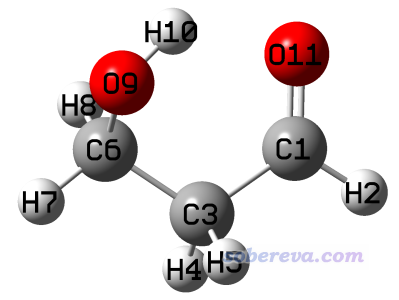
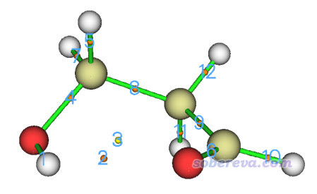
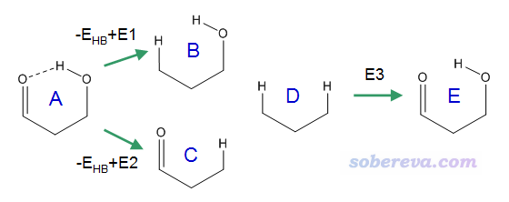
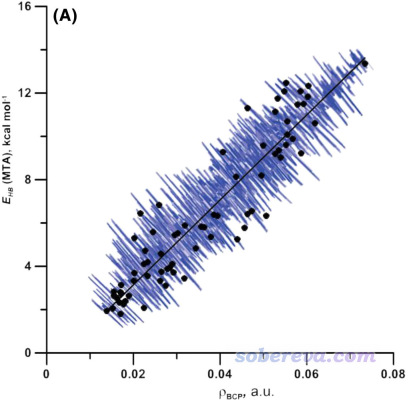
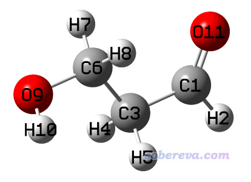
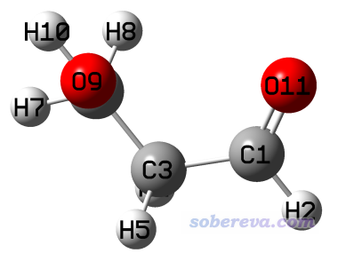
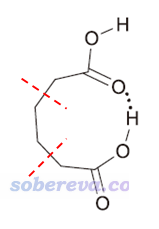
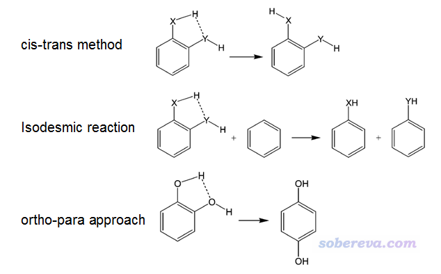

**计算分子内氢键键能的几种方法**

Several methods for calculating energy of intramolecular hydrogen bonds

文/Sobereva@[北京科音](http://www.keinsci.com)  
First release: 2019-Nov-23  Last update: 2022-May-26

## 0 前言

计算分子间弱相互作用，包括计算最常被研究的氢键的键能，已经有非常成熟、准确的方法，比如最常用的就是用CCSD(T)等高精度方法，拿复合物的能量减各个单体的能量。有时我们需要研究分子内氢键的键能，但计算方法并不唯一，哪种方法最合理也争议颇多，没有普遍的共识，而且本身这也不是实验上可以测定的。尽管如此，由于研究分子内氢键键能在很多方面（如考察和对比构象稳定性）非常重要，我们还是需要了解有哪些方法可以计算。本文就以下面这个分子作为例子，介绍几个计算内氢键的方法。

本文例子用到的所有Gaussian输入、输出文件以及fch文件都可以在这里下载：<http://sobereva.com/attach/522/intraHB.rar>。其中用到ma-TZVPP基组的时候利用了《给def2以ma-方式加弥散函数的Gaussian格式的基组定义文件（含所有def2支持的元素）》（<http://sobereva.com/509>）里提供的基组定义文件。

优化都使用B3LYP-D3(BJ)/def-TZVP级别进行，对各个结构的能量计算使用M06-2X/ma-TZVPP（对这个不算大的体系用更高精度的CCSD(T)/CBS也算得动，用当前级别是图省事，而精度也已经不错，足够说明问题）。本文计算的都是电子能量，不牵扯热力学数据。本文下面计算的是氢键相互作用能，负值代表内氢键的形成令体系能量降低，但为了表述省事，下文简称为氢键键能。

本文使用的Multiwfn可以在官网<http://sobereva.com/multiwfn>免费下载。相关常识看《Multiwfn FAQ》（<http://sobereva.com/452>）。Gaussian用的是Gaussian 16 A.03。

## 1 基于键临界点的电子密度估计内氢键键能

Atoms-in-molecules (AIM)理论利用氢键的键临界点(BCP)位置的属性考察氢键特征。笔者在《透彻认识氢键本质、简单可靠地估计氢键强度：一篇2019年JCC上的重要研究文章介绍》（<http://sobereva.com/513>）中介绍了笔者在J. Comput. Chem., 40, 2868 (2019)中提出的基于BCP位置的电子密度预测氢键键能的公式，其中参数是向高精度的CCSD(T)/jul-cc-pVTZ + counterpoise级别算的氢键结合能拟合的。对于中性氢键体系，预测公式为  
E_HB = -223.08*ρ(BCP)+0.7423  
此处氢键键能E_HB单位为kcal/mol，ρ(BCP)的单位为a.u.。经过文中的对比，发现此方法比起其它文献里提出的基于氢键描述符的预测公式精度都更好。文章中拟合公式是对分子间氢键进行的拟合，这里我们也将之用于内氢键的预测。

本文文件包里sp_B3LYP.gjf是对优化后的结构在B3LYP-D3(BJ)/ma-TZVPP级别下进行单点任务，得到的fch文件是sp_B3LYP.fch。JCC文章中在拟合预测公式时用的波函数正是B3LYP-D3(BJ)/ma-TZVPP级别得到的，这是为什么此例也用这个级别做AIM分析。

启动Multiwfn程序，载入sp_B3LYP.fch，然后依次输入  
2  //拓扑分析  
2  //搜索核临界点  
3  //用每一对原子的中点搜索临界点  
0  //观看临界点

在图形界面右边把CP labels开启，看到下图

很明显，对应内氢键的BCP的序号是2。点击图形窗口中的Return按钮关闭之，然后输入7进入选项7考察临界点属性的选项，然后输入2，查看这个临界点的各种性质，从屏幕上可看到

Density of all electrons:  0.1535708348E-01

即曰ρ(BCP)=0.015357 a.u.。代入到上面的公式里，氢键键能为-223.08*0.015357+0.7423=-2.68 kcal/mol。按照前述JCC文章里的分类标准，这属于较弱氢键范畴，静电吸引作用占主要因素，而色散作用也不可忽略。

本文的文件包里sp_M062X.fch是对优化后的结构用M06-2X/ma-TZVPP做单点产生的，同样做AIM拓扑分析，得到的ρ(BCP)是0.015222 a.u.，氢键键能计算结果是-2.65 kcal/mol，和基于B3LYP-D3(BJ)/ma-TZVPP波函数分析的很相近，可见上述JCC文章里的预测公式对计算波函数用的DFT泛函并不敏感。

需要注意的是，有一些内氢键并没有对应的BCP，原因在《使用IRI方法图形化考察化学体系中的化学键和弱相互作用》（<http://sobereva.com/598>）里介绍的我发表的IRI方法的原文里做了深入讨论，强烈建议一读。对这种情况，只能通过IRI、IGMH（<http://sobereva.com/621>）等方法图形化展现，但没法用本节介绍的方法定量计算内氢键键能。

## 2 使用Molecular Tailoring Approach方法估计内氢键键能

在J. Phys. Chem. A, 110, 12519 (2006)等文章中，作者提出一种叫Molecular Tailoring Approach (MTA)的方法计算内氢键键能。文中对此方法的叙述比较抽象，这里笔者用比较易于理解的方式说明。看下面的示意图

其中A是原先的体系，B、C、D是人为把基团替换成氢的情况，E是虚构的不存在内氢键的情况。  
图中示意了三个转化过程  
-E_HB + E1 = B - A，因此E1 = B - A + E_HB。其中E1是把=O变成H的能量变化  
-E_HB + E2 = C - A，因此E2 = C - A + E_HB。其中E2是把OH变成H的能量变化  
E3 ≈ - E1 - E2

由于E_HB = A - E，而E = D + E3，经过简单推导可知E_HB ≈ A + D - B - C。

用MTA方法计算本文体系涉及的文件都在本文文件包的MTA目录下，对A、B、C、D四种状态都做了单点计算（不要分别做优化）。其中A的结构就是对本文体系优化后的结构，B、C、D是把A的结构的基团在GaussView里替换为氢的情况，键轴方向和原先一致，替换后C-H键长度是GaussView默认的1.07埃。

将能量从四个.out文件提取出来按照上式运算，结果为627.51*(-268.358311297-118.441683680+193.666146710+193.130292306) = -2.23 kcal/mol，此数值和基于ρ(BCP)估计的差不太多。

MTA方法看起来不错，原理比较清楚，手动实现也不难，但在Int. J. Quantum Chem., 119, e26001 (2019)中作者发现MTA方法的噪音比较大。比如对一系列内氢键进行测试，对有的体系明明ρ(BCP)比别的更大，但MTA方法算出来的内氢键强度反倒更低，如下图所示

为了减小数据噪音，作者建议将MTA方法与基于BCP属性、振动频率变化、氢的NMR化学位移变化等描述符的经验预测方法组合到一起用于预测氢键键能。但这么做太繁琐，还不如就直接用本文第1节的基于ρ(BCP)的预测公式，又省事又靠谱。不过，基于ρ(BCP)的方法目前只拟合了用于氢键的参数，而MTA方法在原理上也可以用于分子内卤键等其它情况。

## 3 通过比较不同构象能量估计内氢键键能

将原本有氢键的构象通过扭转某些单键对应的二面角，成为氢键被破坏的构象，对比前后的能量变化，是常用而且原理非常易于理解的计算内氢键键能的手段。但这种调整构象算氢键键能的做法在原理上算不上严格，因为让氢键破坏的同时，免不了会带来位阻效应的变化、其它位置弱相互作用的变化等因素，如果这些因素十分明显的话，显然得到的能量差就不能很好地衡量内氢键键能了。为了让这些伴生效应出现得尽量小，我们在具体实现上应当注意这三点：(1)扭转哪个键？(2)扭转多少度？(3)扭转后是否做优化或者限制性优化？

我们下面对本文的例子考虑两种修改构象的方式。

### 3.1 扭转C-C键

我们将C3-C6扭转，使得羟基远离羰基氧，之后进行优化，可以得到一个无虚频的局部极小点构象，如下所示。优化和单点计算的文件在本文文件包里conf2目录下。

将原本有内氢键的结构能量与这个求差，由此估计出内氢键键能是627.51*(-268.358311297+268.353235417) = -3.18 kcal/mol。

### 3.2 扭转O-H键

我们这回旋转C-O键，让形成氢键的氢避开氢键受体，之后如下所示。为了减小位阻效应，注意让羟基的氢与对面的C-H呈交错式。

由于这个结构附近没有局部极小点，因此不能去直接优化。但如果完全不做优化，物理意义又不太好，比如没法通过自发弛豫来一定程度消除人工修改结构引入的额外位阻效应，因此笔者做了限制性优化，保持C-C-O-H键角是180度。限制性优化相关介绍见《在Gaussian中做限制性优化的方法》（<http://sobereva.com/404>）。优化和单点任务的文件在本文的文件包里rotH目录下提供了。

将原本有内氢键的结构能量与这个求差，由此估计出内氢键键能是627.51*(-268.358311297+268.353289743) = -3.15 kcal/mol。

可见上述两个修改构象的做法算出的氢键键能非常接近。有文章指出扭转O-H键这种做法会高估键强度，因为当O-H转开之后，由于氧和氧之间会有一定静电互斥使得体系能量升高。在笔者来看，本节做法算出来的内氢键键能适合作为一个键能的上限看待。本文第1节的基于ρ(BCP)进行估计的结果-2.65 kcal/mol与这一节的-3.1 kcal/mol接近，而大小稍微小一点，这种对照检验体现出靠ρ(BCP)进行估计是靠谱的，而MTA那个方法算出来的-2.23 kcal/mol则有可能低估了实际氢键强度。

## 4 其它方法

除本文介绍的外，还有其它一些方法。比如如果氢键给体和受体基团之间隔的化学键比较多，可以在适当的位置把中间链接区域去掉一截，然后边缘补氢，例如下面这样

如果补氢后，两个片段在截断处的原子挨得较近，可以通过扭转一些化学键让这个区域的片段间的重叠彼此避开。然后以常规计算二聚体结合能的方式得到整体与两个片段的能量差，就是内氢键键能了（不需要对二聚体模型和各个片段进行优化，要不然二聚体会严重变形）。

对于不是特别小的内氢键作用体系，如果有地方把氢键给体或受体挪到别处去从而使氢键破坏（换句话说，跟那个地方的氢彼此交换），则通过挪动前后的能量差也可以估计氢键键能。

对于二取代苯类型体系，在J. Phys. Chem. A, 108, 10834 (2004)利用了以下三种方法考察了氢键键能，即右侧物质的总能量减去左侧物质的总能量

其中cis-trans方法和前面3.2节是一回事，被文章认为有高估氢键强度的倾向。Isodesmic reaction（等键反应）这种方法反应物和产物中各种类型键的数目保持不变，JPCA这篇文章认为此方法也不可靠，而认为最可靠的是ortho-para方法，相当于前面说的挪动基团位置的做法对二取代苯的一个特例。但其实ortho-para方法也并非严格，毕竟哪怕这两个基团之间没有氢键作用，把二取代苯的一个基团从另一个基团的邻位挪到对位也会对体系的能量所有影响。
