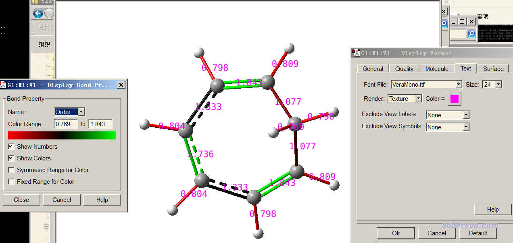

**将Multiwfn计算的键级直接标注在分子结构图上的方法**

The way of directly labelling bond orders calculated by Multiwfn on molecular structure map

文/Sobereva@[北京科音](http://www.keinsci.com)  2019-Dec-4

有人在Multiwfn中文论坛上问怎么把Multiwfn计算的键级直接标注在分子结构图上，以便于直观观看。将Multiwfn与GaussView结合使用就可以很方便地实现这一点，在本文介绍一下。读者必须使用2019-Dec-4及以后更新的Multiwfn版本，可以在其官网<http://sobereva.com/multiwfn>免费下载。GaussView必须用>=6.0的版本，本文用的是GaussView 6.0.16。如果不了解Multiwfn，看《Multiwfn FAQ》（<http://sobereva.com/452>），如果不了解键级的概念，看此文中关于键级的部分：《Multiwfn支持的分析化学键的方法一览》（<http://sobereva.com/471>）。

我们这里用Multiwfn自带的一个环庚三烯分子为例进行演示，用拉普拉斯键级。对其它分子、其它键级过程都一样。

启动Multiwfn，然后输入  
examples\cycloheptatriene.fch  
9  //键级计算  
8  //拉普拉斯键级  
y  //将键级矩阵导出为当前目录下的bndmat.txt  
0  //返回主菜单  
1000  //隐藏选项  
13  //将当前目录下的bndmat.txt转化为带有键级信息的Gaussian输入文件

当前目录下此时产生了一个名为gau.gjf文件，内容如下  
#P B3LYP/6-31G* geom=connectivity  
  
Generated by Multiwfn  
  
  0  1  
 [坐标部分略]  
    
        1       2  1.7363       4  1.3325       8  0.8040  
        2       3  1.3325       9  0.8040  
        3       5  1.8425      10  0.7980  
        4       6  1.8425      11  0.7980  
        5       7  1.0773      12  0.8094  
        6       7  1.0773      13  0.8094  
        7      14  0.7693      15  0.7903  
        8  
        9  
       10  
       11  
       12  
       13  
       14  
       15

可见，在坐标部分后头有原子连接关系段落，当前记录的正是bndmat.txt里的键级数值。只有被Multiwfn判断为键连的原子间才在这里记录了键级数值。如果你用的输入文件是.mol、.mol2等本身就带有连接关系的文件，连接关系与此文件里记录的将一致；如果用的是.fch、.wfn、.molden作为输入文件，则连接关系是Multiwfn根据原子间距离自动猜的，详见《谈谈原子间是否成键的判断问题》（<http://sobereva.com/414>）。

然后，将gau.gjf载入GaussView，进入Results - Bond properties，把Name改成Bond order，选上Show Numbers和Show Colors复选框。之后再按Ctrl+D打开Display Format界面，恰当调整文字标签，就看到下图的效果了。可见各个键的键级一目了然，不仅通过文字标注了，还通过颜色体现了（越绿键级越大、越红键级越小）。PS：建议在Display Format界面的Molecule标签页里把Scale Radii by改小使得原子球变小，避免遮挡标签。

顺带一提，Multiwfn算的原子电荷也可以直观地展现在结构图上，参看《使用Multiwfn+VMD以原子着色方式表现原子电荷、自旋布居、电荷转移、简缩福井函数》（<http://sobereva.com/425>）。
