**后记**：后来笔者在此文的研究的基础上做了大量扩展和深化，发表了一系列论文，并且还做了很多其它的与18碳环及其类似物有关的研究，汇总见<http://sobereva.com/carbon_ring.html>。非常欢迎阅读和引用其中的文章！

**一篇最全面、系统的研究新颖独特的18碳环的理论文章**

The most comprehensive and systematic theoretical article on the novel and unique cyclo[18]carbon

Sobereva@[北京科音](http://www.keinsci.com)

First release: 2019-Dec-15  Last update: 2020-Jan-3

18碳环是18个碳原子构成的环状体系，具有非常独特的几何和电子结构特征。此体系早在1966年就被Hoffmann做了研究，但直到2019年8月，这个体系才首次在凝聚相中被实验观测到，并发表在Science, 365, 1299。一个月后，在《谈谈18碳环的几何结构和电子结构》（<http://sobereva.com/515>）中笔者对其电子结构特征进行了初步探讨，受到了不少关注。不久后，有数篇他人的关于18碳环的理论计算文章发表，但内容局限性都比较大，且大多显得成文仓促，内容深度和广度非常有限，因此仍然缺乏一篇对18碳环真正非常全面、充分的理论研究文章。

2019年12月12日，笔者在ChemRxiv上发表了名为A Thorough Theoretical Exploration of Intriguing Characteristics of Cyclo[18]carbon: Geometry, Bonding Nature, Aromaticity, Weak Interaction, Reactivity, Excited States, Vibrations, Molecular Dynamics and Various Molecular Properties的文章，是第一篇对18碳环几乎所有性质、特征进行系统性分析讨论的文章。文章DOI号是10.26434/chemrxiv.11320130，现可以在[**https://doi.org/10.26434/chemrxiv.11320130**](https://doi.org/10.26434/chemrxiv.11320130)免费下载，非常欢迎阅读！（如果在大陆网速太慢难以完整下载，可以通过百毒网盘下载：<https://pan.baidu.com/s/1idQ50UZe_lAiLSOk-6ETgw>，链接：tjv5）

值得一提的是，此文充分、综合运用了Multiwfn波函数分析程序（<http://sobereva.com/multiwfn>）进行了各种分析，绘制了大量美观的图形，得到了大量颇有意义的信息，是使用Multiwfn结合量子化学程序研究新颖化学体系的一个很好的范例，因此特别建议Multiwfn用户们阅读。其中很多研究和讨论都可以挪用到其它新颖化学体系的研究中。

以下是本文研究的内容概述：

• 键长与计算级别的影响：考察了主流理论方法对18碳环这种电子结构特殊体系的几何优化结果的影响，通过与CCSD/def-TZVP的对比证明了ωB97XD/def2-TZVP对此体系的合理性。注：在未来笔者预计还会发表一篇专门研究计算级别对18碳环结构、势能面描述精度的对比文章，届时将涉及大量电子相关方法。  
• 分子尺寸：研究了18碳环的厚度、内径、外径、动力学直径，这对于在未来考察18碳环的吸附问题很有帮助  
• 分子轨道与态密度：通过MO-PDOS图和等值面图展现了18碳环的sigma、in-plane pi和out-plane pi分子轨道能级分布和轨道波函数特征，同时给出了HOMO-LUMO gap  
• C-C键的本质：通过计算多种知名的键级，否认了诸多18碳环研究文章的“单-三键交替”的错误说法，但证明了体系中两类C-C键强度存在显著交替特征。还对Mayer键级进行了分解研究，讨论了sigma、in-plane pi和out-plane pi型相互作用对成键的影响。之后，通过价层电子密度、变形密度、电子定域化函数从实空间函数角度进一步考察了此体系中两类C-C键的差异。然后，运用定域化分子轨道(LMO)和预正交自然键轨道(PNBO)分析从轨道角度分析了成键特点。最后，文章通过Atoms-in-molecules (AIM)理论对成键特征进行了讨论并与相关体系进行了对比。  
• 全局电子离域性：18碳环最大的特点在于其双18中心pi电子离域特征。此文通过LOL-pi函数非常鲜明、直观地将这种特殊的电子离域特征展现了出来。之后通过ELF-pi二分点分析定量考察了两类C-C键的pi离域特征的差异。  
• 芳香性以及对外磁场的响应：电子的多中心离域伴随着芳香性的出现，并且在磁场下应当会产生绕着环的感生电流。此文通过近年提出的AV1245指数考察了18碳环的芳香性，展现出此体系具有很强的芳香性，且明显大于同样具有18中心pi共轭特征的18-轮烯。之后使用ACID方法分别将in-plane pi和out-plane pi电子在磁场下产生的环电流情况进行了展现。然后利用了GIMIC程序绘制了分子平面上环电流的截面图，并且给出了环电流的动态动画，以更清晰地展现出环电流密度的分布特征。同时还对键截面的环电流密度进行了积分，体现出18碳环的芳香性远大于苯。最后，通过ICSS方法研究了18碳环在体系各个区域产生的磁屏蔽效果，从而将体系的芳香性特征进行了更充分的展现。勘误：文中的ICSS图、ICSS_ZZ(0)和ICSS_ZZ(1)实际上是wB97XD/def2-TZVP优化的结构下用LC-wPBE/6-31+G*（而非如Computational Details部分所述完全用wB97XD/def2-TZVP）算出来的  
• 分子静电势：文中考察了18碳环的分子静电势等值面、分析了分子表面静电势极值点，将18碳环与其它分子间可能形成的静电相互作用强度和位点进行了预测。还通过近期笔者提出的MPI指数和分子表面静电势面积分布对体系的极性进行了考察，展现出体系具有极弱的极性。  
• 二聚体和pi-pi相互作用分析：18碳环体系无疑可以和诸多分子形成相互作用，但其中最值得研究的显然是它与它自己的二聚体，因为这种相互作用最直接影响它的凝聚相特征。文中优化了18碳环二聚体，考察了二聚过程对分子结构的影响，通过RDG填色等值面图和AIM拓扑分析研究了相互作用区域和本质，再进一步结合SAPT能量分解分析，充分证明了二聚体中存在典型且强度很高的pi-pi堆积。  
• 反应性分析：文中通过平均局部离子化能(ALIE)分析展现了体系发生化学反应的难易性，并证明优先发生亲电反应的位点是在较短的C-C上。  
• UV-Vis光谱与电子激发态：文中对18碳环的电子光谱进行了预测，指出了跃迁的简并性，讨论了其中强度最显著的跃迁的本质，并且基于跃迁偶极矩密度以及跃迁偶极矩向分子轨道跃迁的分解分析解释了为什么此体系存在贼强的紫外吸收峰。文中还通过空穴-电子分析解释了重要的S0->S1跃迁以及对应最强吸收峰的跃迁的本质特征。  
• 分子振动以及红外、拉曼光谱：文中预测了18碳环的红外光谱，详细讨论了光谱特征，对分子的几种具有特点的振动模式进行了分析，还预测了常温下对应Nd:YAG激光器入射光的拉曼光谱。本文的振动与电子光谱对于实验研究者对照试验光谱检验18碳环的存在性很有帮助。  
• 分子动力学：本文对18碳环在100 K、200 K、298.15 K下用ORCA做了从头算动力学，考察了温度对18碳环动态行为的影响，体现出18碳环具有显著柔性，并且表明在常温下也具有足够稳定性而不会发生异构化。  
• 对外电场的响应属性：用ωB97XD结合专门适合超极化率计算的LPol-ds基组考察了18碳环的极化率和超极化率特征。  
• 电离、电子亲和过程：考察了体系绝热和垂直电离能、电子亲和能，空穴和电子重组能。同时考察了电离和电子亲和过程对体系的几何和电子结构的影响  
• 其它分子属性：理论预测了18碳环的各种物理属性和概念密度泛函理论定义的量，包括四极矩、Mulliken电负性、化学势、fundamental gap、软度、亲电指数、亲核指数、水合自由能、LogP、环张力能、NMR化学位移。此体系的C-C键的键解离能(BDE)没法通过常规方法计算，但这又是很有意义的数据，文中利用了拉普拉斯键级与BDE的关系，估计了此体系中两类C-C键的BDE。

下面贴一些文中的图片，对图片详细的解释见ChemRxiv中的文章。就算对这篇研究本身不感兴趣，光看看图也是好的;-)

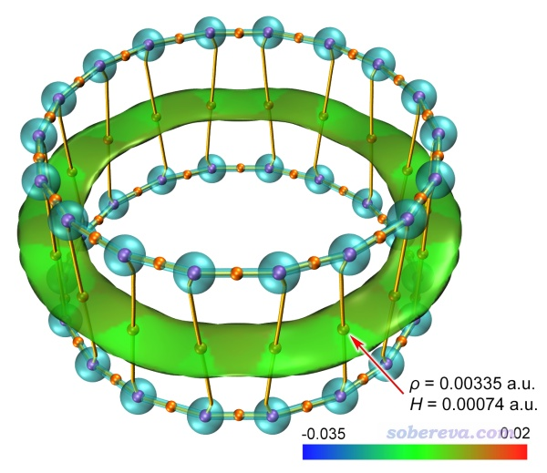

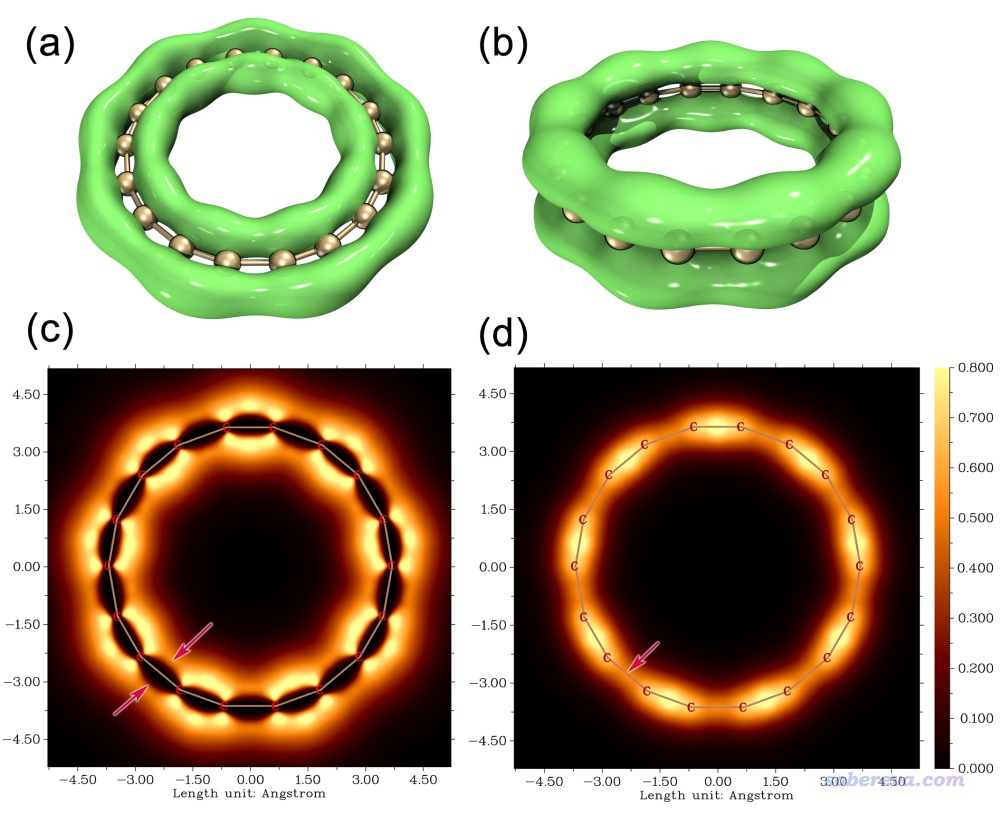

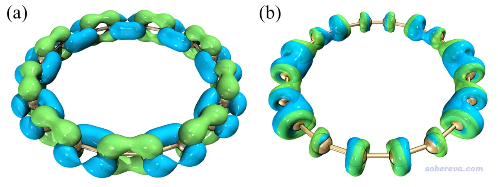

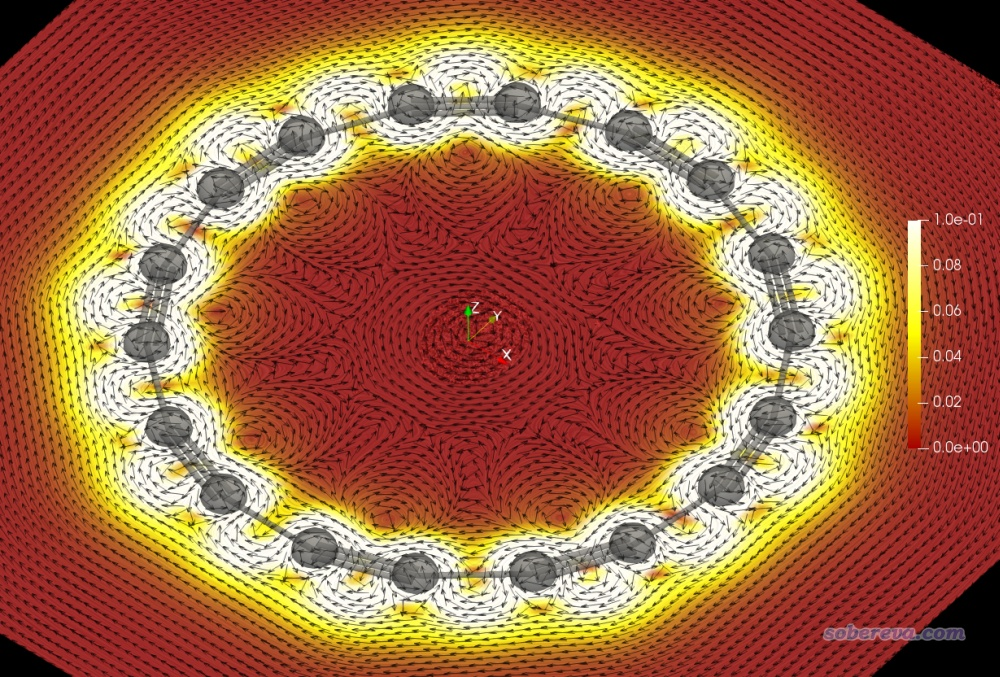

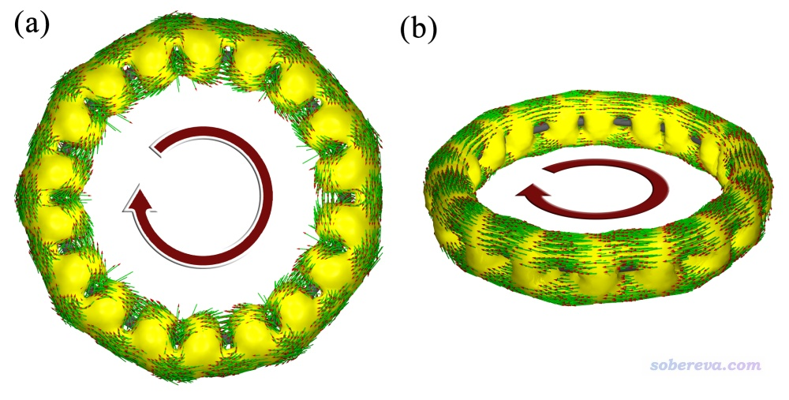

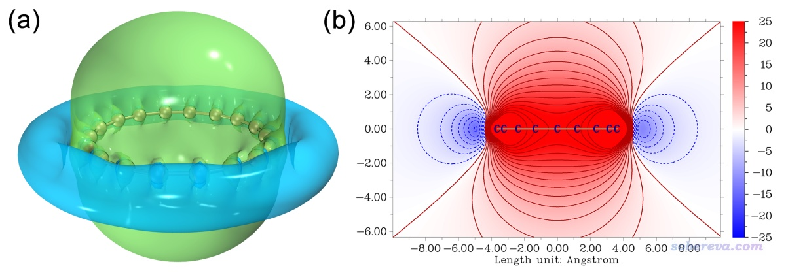

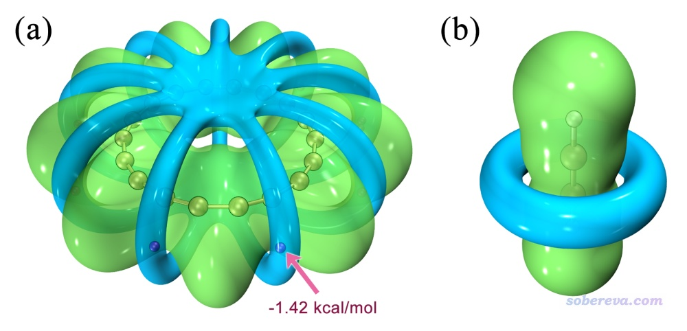

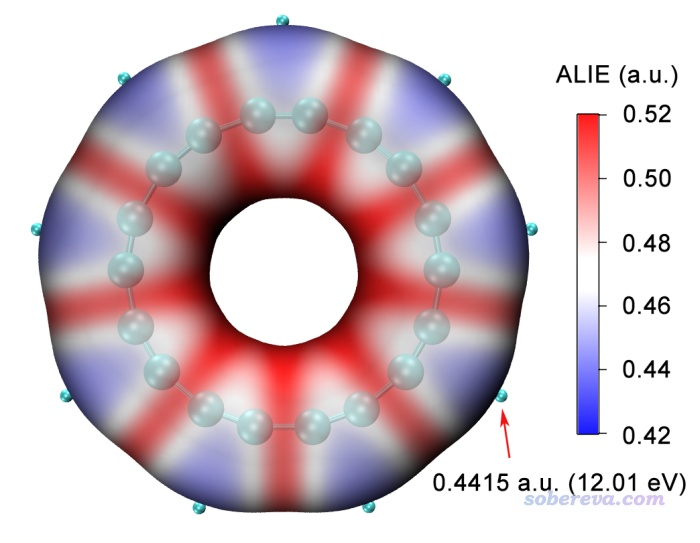

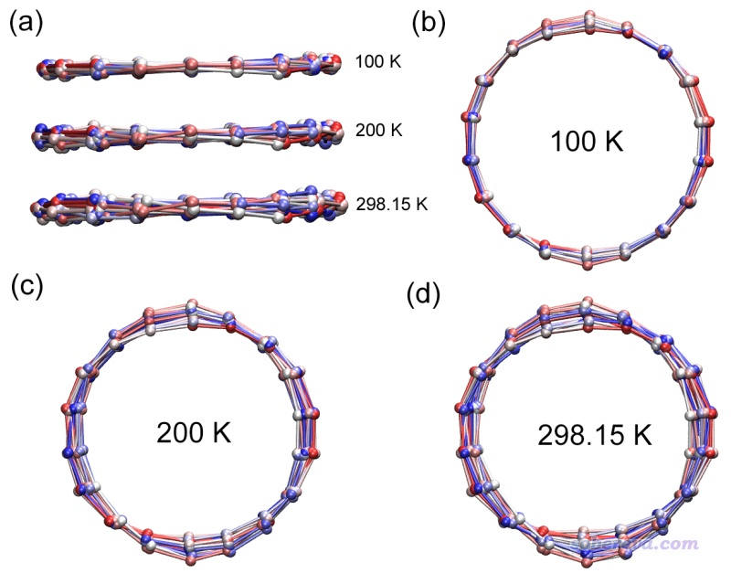

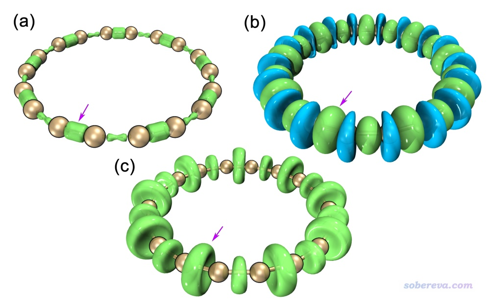

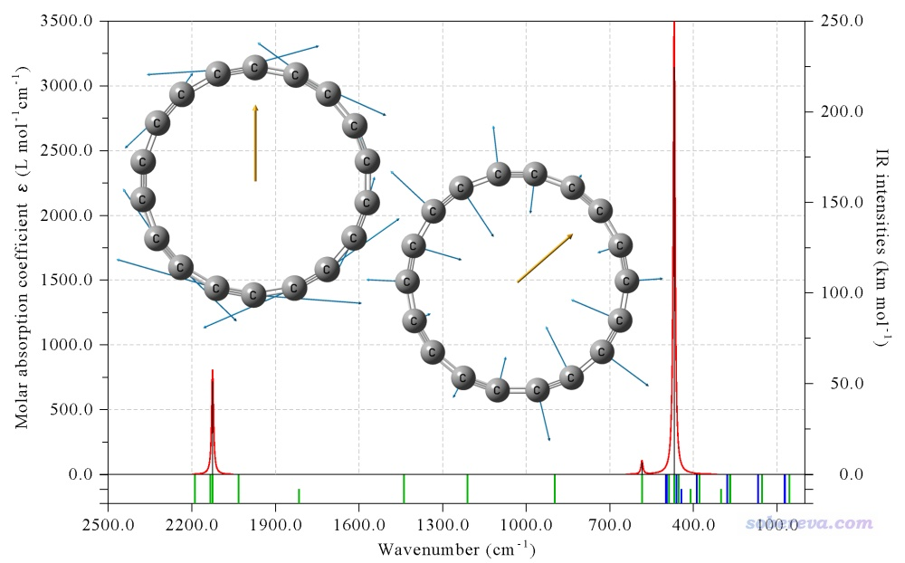

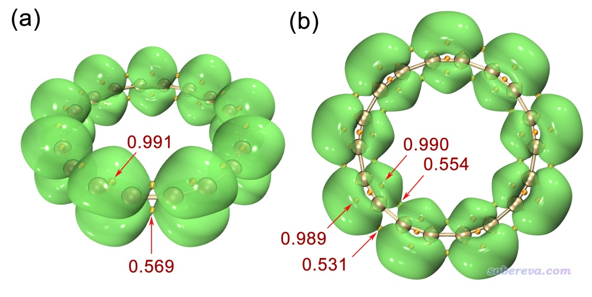

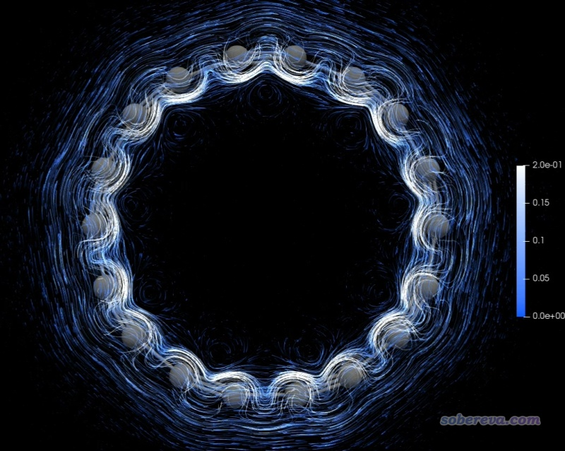

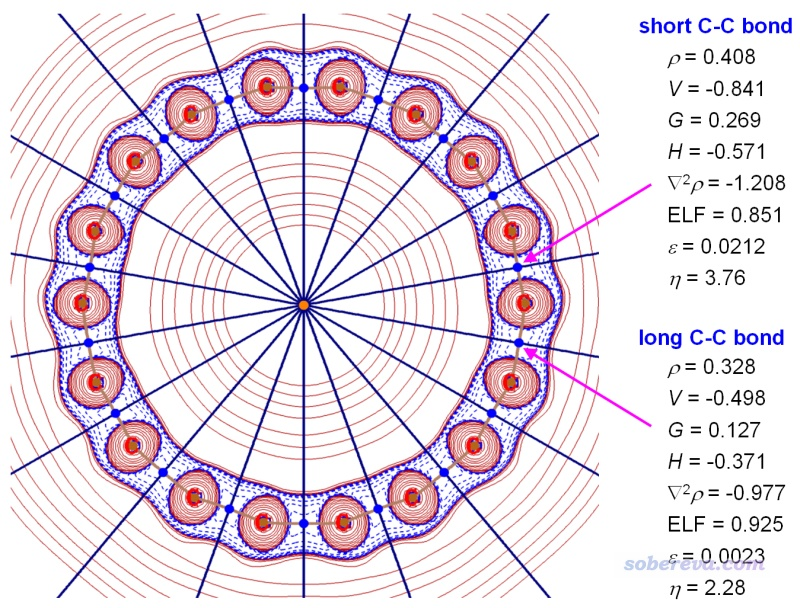

## 附：

本文中涉及到的与波函数分析的博文和相关资料如下，阅读后读者可以轻易重复出本文中的数据和图像（18碳环的单体和二聚体坐标已在文中的补充材料中给出）。如果有Multiwfn使用上的疑问，欢迎到Multiwfn论坛<http://bbs.keinsci.com/wfn>咨询。如果在重复文中其它数据时遇到困难，也可以在计算化学公社论坛<http://bbs.keinsci.com>的量子化学版咨询。

绘制含有AIM拓扑信息的平面图（上文中最后一幅图）的视频演示：<http://sobereva.com/attach/524/AIM_planemap.mp4>

用VMD基于Multiwfn产生的格点数据绘制等值面图：  
在VMD里将cube文件瞬间绘制成效果极佳的等值面图的方法 <http://sobereva.com/483>

分子尺寸：  
使用Multiwfn计算分子的动力学直径 <http://sobereva.com/503>  
使用Multiwfn计算分子的长宽高以及显示分子的主轴 <http://sobereva.com/426>

MO-PDOS图：  
使用Multiwfn绘制态密度(DOS)图考察电子结构 <http://sobereva.com/482>

轨道等值面图：  
使用Multiwfn观看分子轨道 <http://sobereva.com/269>  
用VMD绘制艺术级轨道等值面图的方法 <http://sobereva.com/449>  
用VMD绘制极高质量的轨道等值面图的方法（视频演示） <https://www.bilibili.com/video/av37101659/>  
使用Multiwfn+VMD快速绘制高质量分子轨道等值面图（视频演示） <https://www.bilibili.com/video/av34024335/>  
使用Multiwfn方便快速地批量绘制轨道图形（视频演示） <https://www.bilibili.com/video/av69765564/>

键级与键级分解分析：  
Multiwfn支持的分析化学键的方法一览 <http://sobereva.com/471>  
Multiwfn手册4.9节

AIM拓扑分析操作：  
使用Multiwfn做拓扑分析以及计算孤对电子角度  
<http://sobereva.com/108>  
Multiwfn手册4.2.1节

电子定域化函数：  
ELF综述和重要文献小合集 <http://bbs.keinsci.com/thread-2100-1-1.html>  
电子定域性的图形分析 <http://sobereva.com/63>

变形密度：  
使用Multiwfn作电子密度差图 <http://sobereva.com/113>

LMO分析：  
Multiwfn的轨道定域化功能的使用以及与NBO、AdNDP分析的对比 <http://sobereva.com/380>  
谈谈轨道成份的计算方法 <http://sobereva.com/131>

显示PNBO轨道：  
使用Multiwfn绘制NBO及相关轨道 <http://sobereva.com/134>

价层电子密度：  
通过价层电子密度分析展现分子电子结构 <http://www.whxb.pku.edu.cn/EN/10.3866/PKU.WHXB201709252>  
Multiwfn手册4.6.2节

AIM拓扑分析操作、绘制含有拓扑信息的平面图：  
使用Multiwfn做拓扑分析以及计算孤对电子角度 <http://sobereva.com/108>  
在Multiwfn中绘制带有AIM拓扑信息的平面图（视频演示） <https://www.bilibili.com/video/av28743642>

LOL-pi与ELF-pi分析：  
在Multiwfn中单独考察pi电子结构特征 <http://sobereva.com/432>

AV1245指数：  
使用Multiwfn计算AV1245指数研究大环的芳香性 <http://sobereva.com/519>  
衡量芳香性的方法以及在Multiwfn中的计算 <http://sobereva.com/176>

ACID分析：  
使用AICD 2.0绘制磁感应电流图 <http://sobereva.com/294>  
使用AICD程序研究电子离域性和磁感应电流密度 <http://sobereva.com/147>

GIMIC分析：  
考察分子磁感生电流的程序GIMIC 2.0的使用（含24分钟演示视频） <http://sobereva.com/491>  
使用GIMIC计算和分析磁感应电流密度 <http://sobereva.com/155>  
Utilizing AICD and GIMIC programs to study magnetically induced current density (幻灯片) <http://sobereva.com/148>

ICSS分析：  
通过Multiwfn绘制等化学屏蔽表面(ICSS)研究芳香性 <http://sobereva.com/216>

静电势分析：  
静电势与平均局部离子化能综述合集 <http://bbs.keinsci.com/thread-219-1-1.html>  
绘制静电势全局极小点+等值面图展现孤对电子位置的方法 <http://sobereva.com/493>  
使用Multiwfn+VMD快速地绘制静电势着色的分子范德华表面图和分子间穿透图（含视频演示） <http://sobereva.com/443>  
使用Multiwfn结合VMD分析和绘制分子表面静电势分布 <http://sobereva.com/196>

MPI指数：  
谈谈如何衡量分子的极性 <http://sobereva.com/518>

RDG填色等值面图（NCI分析）：  
使用Multiwfn做NCI分析展现分子内和分子间弱相互作用（视频演示） <https://www.bilibili.com/video/av71561024>  
使用Multiwfn图形化研究弱相互作用 <http://sobereva.com/68>  
用Multiwfn+VMD做RDG分析时的一些要点和常见问题 <http://sobereva.com/291>  
Multiwfn支持的弱相互作用的分析方法概览 <http://sobereva.com/252>

Multiwfn+VMD绘制AIM拓扑分析图：  
使用Multiwfn+VMD快速地绘制高质量AIM拓扑分析图 <http://sobereva.com/445>  
使用Multiwfn+VMD快速地绘制高质量AIM拓扑分析图（视频演示）<https://www.bilibili.com/video/av33724816/>

平均局部离子化能：  
使用Multiwfn和VMD绘制平均局部离子化能(ALIE)着色的分子表面图 <http://sobereva.com/514>  
使用Multiwfn和VMD绘制平均局部离子化能(ALIE)着色的分子表面图（视频演示） <https://www.bilibili.com/video/av68116168>  
使用Multiwfn的定量分子表面分析功能预测反应位点、分析分子间相互作用 <http://sobereva.com/159>  
静电势与平均局部离子化能综述合集 <http://bbs.keinsci.com/thread-219-1-1.html>

绘制UV-Vis、IR、Raman光谱：  
使用Multiwfn绘制红外、拉曼、UV-Vis、ECD、VCD和ROA光谱图 <http://sobereva.com/224>

跃迁偶极矩密度：  
使用Multiwfn绘制跃迁密度矩阵和电荷转移矩阵考察电子激发特征（含视频演示） <http://sobereva.com/436>

空穴-电子分析：  
使用Multiwfn做空穴-电子分析全面考察电子激发特征 <http://sobereva.com/434>

跃迁偶极矩向分子轨道跃迁的分解：  
Multiwfn支持的电子激发分析方法一览 <http://sobereva.com/437>  
Multiwfn手册4.18.10节

产生ORCA做从头算动力学任务的输入文件：  
详谈Multiwfn产生ORCA量子化学程序的输入文件的功能 <http://sobereva.com/490>

计算、提取极化率和超极化率：  
使用Multiwfn分析Gaussian的极化率、超极化率的输出 <http://sobereva.com/231>

计算电离、电子亲合过程密度差：  
使用Multiwfn作电子密度差图 <http://sobereva.com/113>

计算概念密度泛函理论定义的量：  
使用Multiwfn超级方便地计算出概念密度泛函理论中定义的各种量 <http://sobereva.com/484>  
概念密度泛函综述和重要文献合集 <http://bbs.keinsci.com/thread-384-1-1.html>
