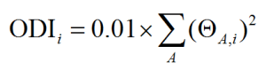
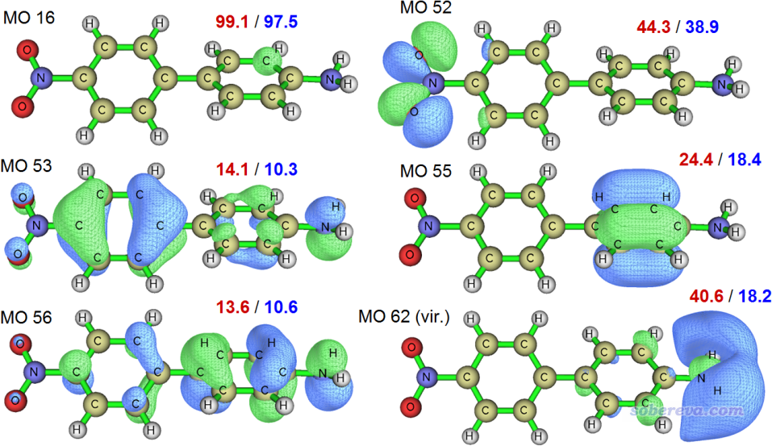
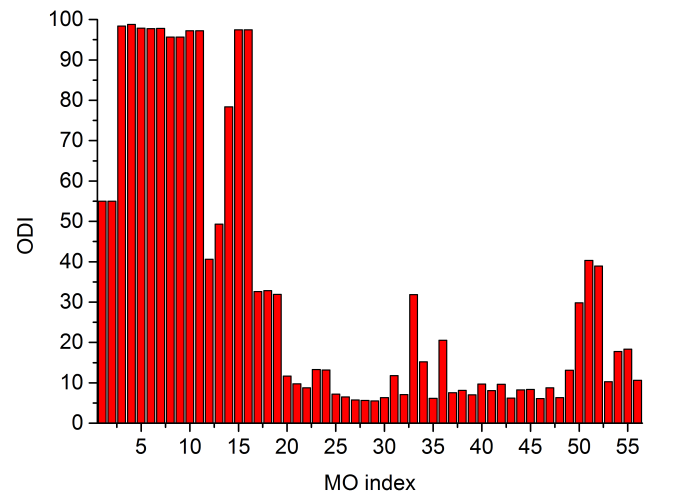
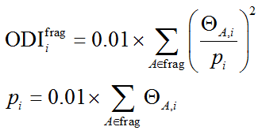

注：笔者后来又写了《使用Multiwfn计算轨道的体积》（<http://sobereva.com/734>），和本文内容有一些相关性，推荐看完本文后阅读。

**通过轨道离域指数(ODI)衡量轨道的空间离域程度**

Using orbital delocalization index (ODI) to measure spatial delocalization extent of orbitals

文/Sobereva@[北京科音](http://www.keinsci.com)

First release: 2019-Dec-22  Last update: 2024-Aug-28

## 1 前言

轨道的离域程度就是指轨道分布的范围是比较窄还是比较广，分布范围越大可以说离域性越强。有人在思想家公社QQ群里发了几个轨道图片，问怎么衡量他这几个轨道的离域程度，即谁离域相对比较强一些。有很多情况直接看轨道图形就可以直接比较，但也有很多时候从轨道图形上并不容易定量区分，而且轨道等值面图又依赖于等值面数值的选取，有很主观性。为了能定量考察轨道离域程度的高低，笔者提出了一个指标叫轨道离域指数（Orbital delocalization index, ODI）并写入了波函数分析程序Multiwfn（<http://sobereva.com/multiwfn>）中，在此文就简单介绍并示例一下。如果你经常要对比不同轨道特征的话，你会发现ODI往往挺有用，又很能说明问题，计算又方便又快。

《Multiwfn波函数分析程序的最新最全面的介绍文章已在JCP上发表！（对应2024年8月版）》（<http://sobereva.com/726>）中提到的Multiwfn的2024年介绍文章中的第E节里给出了ODI的定义，所以引用ODI的时候引用这篇文章即可。

## 2 原理

如果你不懂轨道成分分析的话，建议先看此文《谈谈轨道成份的计算方法》（<http://sobereva.com/131>）。

某个轨道i的ODI值通过下式计算

其中ΘA,i代表A原子在i轨道中所占成份。数值越小，表明轨道离域程度越高。值域是(0,100]。

ODI的原理很容易理解。比如一个轨道如果完全定域在某一个原子上，即这个原子所占轨道成份为100%，那么ODI值就为(100^2)/100=100，即达到理论最大值。如果这个轨道均匀分布在两个原子上，ODI值将为(50^2+50^2)/100=50，明显更小了。如果均匀分布在三个原子上，就只有33.3了。因此，轨道平摊在越多的原子上，即离域性越强，ODI值就会越小。实际上，Pipek-Mezey轨道定域化在本质上就类似于最大化ODI，不懂轨道定域化的话可以看《Multiwfn的轨道定域化功能的使用以及与NBO、AdNDP分析的对比》（<http://sobereva.com/380>）。

Multiwfn程序的任何轨道成分分析功能在输出原子对轨道的贡献时都会顺带输出ODI。因此计算ODI用的轨道成份的计算方式有一定任意性，见后文的讨论。

## 3 实例

下面通过一个具体的体系，D-pi-A型的分子，展示ODI的计算过程和可靠性。Multiwfn最新版可在其官网<http://sobereva.com/multiwfn>免费下载，如果对Multiwfn不了解，强烈建议看看《Multiwfn FAQ》（<http://sobereva.com/452>）和《Multiwfn入门tips》（<http://sobereva.com/167>）。

启动Multiwfn然后输入  
examples\excit\D-pi-A.fchk  //里面包含的是CAM-B3LYP/6-31G*级别产生的分子轨道  
8  // 轨道成分分析  
1  // 我们首先用Mulliken方法算ODI  
52  // 假设考察的是第52号轨道  
在输出信息的末尾会看到ODI值：  
Orbital delocalization index:   44.28

作为例子，我们再用Hirshfeld方法计算一下这个轨道的ODI值。依次输入  
0  // 返回  
8  // Hirshfeld轨道成分分析  
1  // 使用内置的原子球对称化的密度  
52  // 分析52号轨道  
会发现Hirshfeld方法算的ODI值为38.93。

我们以相同方法对随便选取的其它一些轨道也进行计算，计算结果以及轨道的0.04等值面下的轨道图形如下所示。红字的是Mulliken方法算的ODI，蓝字的是Hirshfeld方法算的ODI。（轨道图像用Multiwfn主功能0显示，过程见<http://sobereva.com/269>）

由图可见，MO 16对应的是其中一个碳的内核轨道，几乎完全定域在这个碳上，因此这个轨道的ODI的数值几乎达到了理论上限100。MO 52对应的是硝基的孤对电子，由于它主要同时分布在两个氧上，有一定离域性，因此ODI值不大不小。MO 55对应的是一个苯环上的pi轨道，从轨道图形可见主要分布在4个碳上，因此离域性比MO 52更强，故ODI值也更低。MO 53和MO 56呈现出极强的离域性，遍布在整个体系，而且离域程度相仿佛，因此它们的ODI是所有被考察的轨道中最低的，而且二者数值基本一样。有此例可见ODI值很可靠，很能说明离域程度问题。

上述轨道都是占据轨道，而MO 62是个空轨道，而且本质上是个里德堡轨道（不懂什么叫里德堡轨道的话看《图解电子激发的分类》<http://sobereva.com/284>）。如图可见对这个轨道Mulliken和Hirshfeld方法算的ODI差异甚大。Mulliken方法认为它的离域程度显著低于MO 55，从等值面图上看这结论明显不靠谱。而Hirshfeld算的ODI则表示它的离域程度和MO 55相仿佛，这个结论与图上看到的分布情况相对应。

总的来说，对占据轨道，Mulliken和Hirshfeld方法算的ODI虽然有定量差异，但趋势一致，说明如果没有弥散函数、只考察占据轨道的话用哪个都可以。用Mulliken方法的好处是耗时极低，而Hirshfeld方法由于牵扯到做数值积分，因此对大体系会花一点时间（但耗时也并不太高）。用Hirshfeld方法的好处是什么情况都可以用，既可以用于空轨道，也不怕弥散函数。在Multiwfn里还可以用SCPA、NAO等方式算轨道成份得到ODI，但相对来说没有特别的优点，这里就不说了。

## 4 对一批轨道计算离域指数

Multiwfn的Hirshfeld、Hirshfeld-I、Becke轨道成分分析功能的界面里也提供了相应选项来一次性计算一大批轨道的ODI。这里还是用上面的体系作为例子，我们用Hirshfeld方法计算它的所有占据轨道的ODI。

启动Multiwfn然后输入  
examples\excit\D-pi-A.fchk  
8  // 轨道成分分析  
8  // Hirshfeld方法  
1  // 使用内置的原子球对称化的密度  
-5  // 对一批轨道计算ODI  
1-56  // 占据轨道的序号范围

很快得到以下数据  
 Orb:    1 Ene(a.u.):    -19.246317 Occ:  2.0000 Type: Alpha&Beta ODI:   55.03  
 Orb:    2 Ene(a.u.):    -19.246291 Occ:  2.0000 Type: Alpha&Beta ODI:   55.03  
 Orb:    3 Ene(a.u.):    -14.644365 Occ:  2.0000 Type: Alpha&Beta ODI:   98.40  
[ignored...]  
 Orb:   55 Ene(a.u.):     -0.315850 Occ:  2.0000 Type: Alpha&Beta ODI:   18.36  
 Orb:   56 Ene(a.u.):     -0.257102 Occ:  2.0000 Type: Alpha&Beta ODI:   10.61

将轨道序号和ODI绘制成条形图，如下所示

通过此图我们可以非常直观、快速地了解到哪些轨道具有较强的离域性。比如此体系前16个轨道都是对应内核电子的轨道，因此由图可见它们的ODI数值都较大（有些只有50%左右，这是因为这些轨道同时出现在两个原子的内核区域）。而在价层轨道范畴中，50、51、52号轨道的ODI值也不小，具有较强的定域性，如果通过Multiwfn主功能0去看轨道图形的话就会发现它们主要都是定域在硝基上。

## 5 片段ODI

笔者还定义了考察轨道在特定分子片段上离域情况的ODI，称为片段ODI：

由于每个片段上轨道分布总量不同，因此上式中p用来起到归一化作用，就是片段对轨道的贡献除以100。如果把片段设为整个体系，那么片段ODI和前文的ODI结果完全一样。

片段的ODI很有用，例如对于具有相同局部特征的类似物，可以通过此方法考察不同轨道在它们共有的局部区域上的离域程度。在Multiwfn的基于空间划分的轨道成份分析功能（Hirshfeld、Hirshfeld-I、Becke）中，先定义片段，再计算轨道成份，片段的ODI就会连同片段对轨道的贡献一起输出。

还是拿前面的D-pi-A体系作为例子。从前面的轨道等值面图上可以看到，对于MO53，氨基部分轨道主要分布在N上，而对于MO62，氨基的N、H上都有显著的轨道分布，我们看看用轨道ODI能否区分这俩轨道在氨基上的离域程度。启动Multiwfn然后输入  
examples\excit\D-pi-A.fchk  
8  // 轨道成分分析  
8  // Hirshfeld轨道成份分析  
-9  // 定义片段  
24-26  // 氨基的序号  
53  // 考察53号轨道  
输出信息为  
Fragment contribution:     13.564%  
Orbital delocalization index of the fragment:   77.26  
然后输入62，输出信息是  
Fragment contribution:     71.819%  
Orbital delocalization index of the fragment:   33.41  
可见，若只看氨基部分，MO62的轨道离域程度明显大于MO53，因为其ODI值(33.41)明显小于MO53的(77.26)，这和从轨道图形上观看到的情况一致。

现在读者还可以选择Print orbital delocalization index (ODI) for a batch of orbitals选项，然后输入一批轨道序号。程序会先输出这些轨道的整体的ODI指数，之后输出当前片段的ODI指数。
