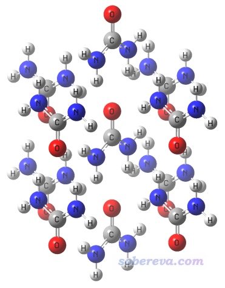
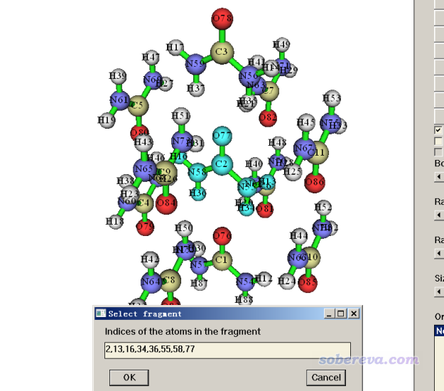
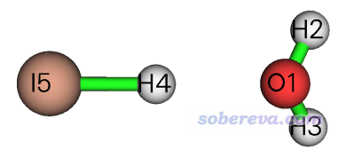

**后记**：笔者在2023年提出了sobEDAw能量分解方法，用起来非常方便，计算耗时以及对内存和硬盘的要求都远远低于SAPT0，而精度可以达到较高阶SAPT（明显好于SAPT0）的水平，因此**强烈建议用sobEDAw代替本文介绍的SAPT！**介绍和用法见《使用sobEDA和sobEDAw方法做非常准确、快速、方便、普适的能量分解分析》（<http://sobereva.com/685>）

**使用PSI4做对称匹配微扰理论(SAPT)能量分解计算**

Using PSI4 to perform symmetric-adapted perturbation theory (SAPT) energy decomposition calculations

文/Sobereva@[北京科音](http://www.keinsci.com)

First release: 2019-Dec-24  Last update: 2020-Oct-15

## 1 前言

能量分解方法之前我在《Multiwfn支持的弱相互作用的分析方法概览》（<http://sobereva.com/252>）中简单介绍过。能量分解就是将片段间相互作用能分解成不同物理成分，从而能从能量角度更深入地了解相互作用的本质。其中最流行、被接受程度最高的一种是对称匹配微扰理论（Symmetry-Adapted Perturbation Theory, SAPT），其物理意义较严格，也已经有很多程序支持。经常有人问SAPT怎么做，本文就通过例子简单说一下如何通过免费的PSI4程序来实现。

本文不打算涉及太多SAPT的原理，因为这部分笔者在“量子化学波函数分析与Multiwfn程序培训班”（<http://www.keinsci.com/WFN>）里面的“能量分解”部分做了专门详细的介绍。如果想自己了解原理的话，可以看以下综述：  
Computational Molecular Spectroscopy (2000)第3章  
Chem. Rev., 94, 1887 (1994)  
WIREs Comput. Mol. Sci., 2, 254 (2012) DOI: 10.1002/wcms.86  
WIREs Comput. Mol. Sci., 2, 304 (2019) DOI: 10.1002/wcms.84  
WIREs Comput. Mol. Sci., 10, e1452 (2019) DOI: 10.1002/wcms.1452

笔者之前的一些论文使用了SAPT考察了不同问题，很建议一看，可以作为SAPT的应用例子进行参考，了解怎么对SAPT的结果进行分析讨论，**也非常欢迎大家作为SAPT的例子进行引用**：  
• J. Comput. Chem., 40, 2868 (2019) DOI: 10.1002/jcc.26068。主要内容介绍：《透彻认识氢键本质、简单可靠地估计氢键强度：一篇2019年JCC上的重要研究文章介绍》（<http://sobereva.com/513>）  
• Carbon, 171, 514-523 (2021) DOI: 10.1016/j.carbon.2020.09.048。文章内容详细介绍+大量评注：《全面探究18碳环独特的分子间相互作用与pi-pi堆积特征》（<http://sobereva.com/572>）  
• J. Mol. Model., 19, 5387 (2013) DOI: 10.1007/s00894-013-2034-2。主要内容介绍：《静电效应主导了氢气、氮气二聚体的构型》（<http://sobereva.com/209>）  
• Comput. Theor. Chem., 1195, 113090 (2021) DOI: 10.1016/j.comptc.2020.113090。此文里笔者用SAPT结合def2-TZVPP基组计算了一大批AtXn(X=Cl, Br, I; n=1, 3, 5)∙∙∙H2O/H2S类型的体系，是SAPT研究含重元素体系的很好的实例。

本文只涉及对单个结构下做SAPT计算，如果你要考察SAPT能量项随分子间距离的变化，参看《考察SAPT能量分解的能量项随分子二聚体间距变化的简单方法》（<http://sobereva.com/469>）。

## 2 一些SAPT相关的关键性的知识

SAPT在上世纪七十年代最早提出。它既是将片段间作用分解为不同物理成份的方法，本身也是一种计算片段间相互作用能的方法，而且没有BSSE问题。SAPT只能用于研究弱相互作用，不能用来考察化学键这种强相互作用的物理成份，因为SAPT的基本思想是片段间微扰，而强相互作用已经违背了微扰理论的前提。

SAPT可以将相互作用能分解为四部分：  
• 静电(electrostatics)：描述片段间经典库仑作用，数值可正可负  
• 交换(exchange)：描述片段间近距离出现的交换互斥作用，数值为正（即不利于结合）  
• 色散(dispersion)：数值为负，起到吸引作用  
• 诱导(induction)：体现片段间电荷相互极化和相互转移的作用，数值为负  
如果你对分子间相互作用了解不多的话，建议看此文中的相关介绍：《谈谈“计算时是否需要加DFT-D3色散校正？”》（<http://sobereva.com/413>）。

SAPT理论涉及片段内的微扰和片段间的微扰，随着微扰阶数增加结果也越来越好。高阶SAPT可以达到接近金标准CCSD(T)的弱相互作用计算精度。原理上来说（按照考虑的微扰阶数逐级增高），精度关系是SAPT0<SAPT2<SAPT2+<SAPT2+(3)<SAPT2+3。SAPT0对中等、中等偏大体系还能算得动，而SAPT2+(3)这样的就只算得动小体系了。

为了让SAPT算的相互作用能精度更好，PSI4程序中的SAPT0还包含了δHF项，它体现了高阶项诱导作用。对于SAPT2+、SAPT2+(3)、SAPT2+3这样的高阶SAPT，还可以加上δMP2项来考虑诱导和色散间的高阶耦合作用，诸如SAPT2+(3)结合δMP2被称为SAPT2+(3)δMP2。但δ项的物理意义不是很清楚，也无法进一步划分。δ项的数值通常较小，一般把它归入诱导项。

在实际中，并非耗时越高的越高阶SAPT结果就越好。在J. Chem. Phys., 140, 094106 (2014)中，通过不同基组结合不同级别SAPT方法的组合测试，发现主要有三个组合最值得推荐，并且用金属贵重程度进行命名：sSAPT0/jun-cc-pVDZ（铜）、SAPT2+/aug-cc-pVDZ（银）、SAPT2+(3)δMP2/aug-cc-pVTZ（金），耗时依次升高，精度也依次升高。除了这些以外的组合就完全没必要考虑了。其中sSAPT0代表scaled SAPT0，是对SAPT0的交换项的经验校正版本，耗时和SAPT0相同，但结合jun-cc-pVDZ时由于误差抵消较好的原因，有明显更好的精度（不要试图将sSAPT0和其它基组结合，比如用更大的aug-cc-pVTZ。因为这样会导致误差抵消得没那么好，结果反倒会整体变差）。在笔者的J. Comput. Chem., 40, 2868 (2019)中的氢键测试中，SAPT2+(3)δMP2/aug-cc-pVTZ计算的弱相互作用能的精度与公认的高精度CCSD(T)/jun-cc-pVTZ结合一半counterpoise校正的结果相比，相对误差只有3 %，对多数体系绝对误差小于0.1 kcal/mol，可见已经非常理想了。

能做SAPT计算的程序不少。PSI4是其中做得最好的，开源免费，速度快，输入文件不复杂，还可以做到很高阶的SAPT2+3。Molpro也能做SAPT，但只支持最低阶的SAPT0，而且价钱很贵，如今还按年收费。SAPT最初提出者Szalewicz等人的SAPT代码虽然功能也挺强，但是安装和使用麻烦。阿Q只能做最低阶的SAPT0，还要钱，没有使用价值。

SAPT还有基于DFT描述单体内作用的变体，包括Molpro能做的DFT-SAPT，以及Szalewicz的SAPT程序和CamCASP程序能做的SAPT(DFT)，它们的思想和结果相仿佛。它们比起原本基于微扰方式描述单体内作用的SAPT在原理上能以更低的耗时达到更高的精度，但麻烦的一点是需要额外提供分子的电离能来校正DFT交换势的渐进行为。前述的J. Mol. Model., 19, 5387 (2013)文中就用DFT-SAPT考察了氢气和氮气二聚体，结果很不错。目前PSI4的SAPT(DFT)搞得还不成熟，预计以后会完善。

PSI4的SAPT0速度很快（远远快于高阶SAPT），但sSAPT0/jun-cc-pVDZ对很大体系照样算不动。这种情况就别指望用基于量子化学的方式做能量分解了，此时最适合的是用Multiwfn做基于力场的能量分解，看《使用Multiwfn做基于分子力场的能量分解分析》（<http://sobereva.com/442>）。

PSI4的各种SAPT方法中只有SAPT0支持开壳层分子间以及开壳层与闭壳层分子间的计算，但研究开壳层弱相互作用的场合不多，本文不举例子。

有文章专门把SAPT里的极化作用和电荷转移作用能拆分开，以讨论更透彻。在PSI4里也支持，但此时没法用δMP2改进结果，而且需要额外的计算耗时，因此一般不特意考虑这个。

PSI4里SAPT2+及以上的高阶SAPT还可以用CCD方法算色散作用的多体项，需要更多的耗时，据说对于色散作用很强的时候会有改进，本文不做涉及。诸如PSI4里sapt2+(3)(ccd)dmp2关键词就是指SAPT2+(3)δMP2结合这种处理。

PSI4还支持其开发者搞的原子SAPT（A-SAPT）、官能团SAPT（F-SAPT）以及I-SAPT，它们底层都是基于SAPT0的。这些变体不属于本文内容范畴。

其它量子化学程序也支持一些五花八门的能量分解方法，但要么原理上不如SAPT严格（比如LMO-EDA里色散部分只是靠DFT-D色散校正能估算的），要么有这样或那样的缺点（诸如局限性大、昂贵，分解出的物理成分意义不清楚、缺乏主流程序支持等等），对于研究弱相互作用来说都不如SAPT理想。

值得一提的是在J. Comput. Chem., 40, 2868 (2019)中笔者发现对氢键作用体系，基于总的氢键作用能直接就能估计出SAPT各个物理成份的大小，并给出了拟合出来的公式。靠这个都能免得专门去做SAPT分析了，对氢键研究很有实际用处。详见《透彻认识氢键本质、简单可靠地估计氢键强度：一篇2019年JCC上的重要研究文章介绍》（<http://sobereva.com/513>）。

## 3 PSI4的安装

PSI4可以在官网<http://psicode.org>下载。可以直接下载installer包。如果你机子里已经有conda了，也可以按网站上的说明用conda装。也可以下载源代码包自行编译，但没必要这么折腾。

以下是笔者使用PSI4 1.3.2，用installer包的安装过程：  
下载Psi4conda-1.3.2-py36-Linux-x86_64.sh后，用chmod +x加上可执行权限，然后运行./Psi4conda-1.3.2-py36-Linux-x86_64.sh启动之。然后输入安装路径，比如/sob/psi4_132，之后开始安装。等安装好后输入yes即可。安装器会在~/.bashrc文件末尾写入一大堆乱七八糟的东西，将之都删掉，然后加上以下两句  
export PATH=$PATH:/sob/psi4_132/bin  
export PSI_SCRATCH=/sob2/psi4scr  
这里/sob2/psi4scr是笔者专门建立的存放PSI4运行过程临时文件用的目录。

之后重新进入终端，PSI4就可以通过输入psi4命令用了。

## 4 SAPT计算实例

为了令初学者也能很容易地上手SAPT计算，笔者在Multiwfn中加入了相应的选项产生PSI4的SAPT任务的输入文件，只需输入两个片段里原子序号、选择计算级别，就可以马上得到现成的SAPT任务的输入文件。此功能从2019-Dec-23及之后更新的Multiwfn中才有，最新版本可以在官网<http://sobereva.com/multiwfn>免费下载。对于这个功能，给Multiwfn用的输入文件可以是Multiwfn支持的任何含有结构信息的文件，诸如.xyz、.mol2、.pdb、.fch等等，详见《详谈Multiwfn支持的输入文件类型、产生方法以及相互转换》（<http://sobereva.com/379>）。另外，在Multiwfn的主功能0里还提供了方便的获得整个片段里原子序号功能，使得产生SAPT输入文件时输入原子序号非常容易。

本文用到的文件都可以在此下载：<http://sobereva.com/attach/526/file.rar>。

### 4.1 例1：水-氨气二聚体

这里首先我们用一个很简单的体系，水-氨气二聚体为例介绍演示SAPT的计算过程。这个体系是笔者的J. Comput. Chem., 40, 2868 (2019)文中计算的第24号体系，当时用B3LYP-D3(BJ)/ma-TZVP级别优化出来的xyz文件是本文文件包里的H2O_NH3.xyz。

启动Multiwfn，然后输入  
H2O_NH3.xyz  
100  //其它功能 (Part 1)  
2  //导出文件或产生量子化学程序输入文件  
15  //产生PSI4的输入文件  
sapt.inp  //产生的文件的名字  
1  //SAPT任务  
3  //当前体系很小，因此我们选最昂贵的，即“金”级别的SAPT2+(3)δMP2/aug-cc-pVTZ  
1-3  //第一个片段（水分子）里原子的序号  
4-7  //第二个片段（氨气）里原子的序号  
当前目录下此时已经有了sapt.inp文件了，可以关闭Multiwfn窗口了。文件内容如下

memory    6000 MB

molecule dimer {  
 0 1  
 O     -0.03836200    1.54613400    0.00000000  
 H      0.06356500    0.57566500    0.00000000  
 H      0.85354600    1.90026300    0.00000000  
 --  
 0 1  
 N     -0.03836200   -1.37627100    0.00000000  
 H     -1.03728700   -1.54652400    0.00000000  
 H      0.34780000   -1.83229000    0.81779500  
 H      0.34780000   -1.83229000   -0.81779500  
 }

set {  
     scf_type DF  
     freeze_core True  
     basis aug-cc-pVTZ  
 }

energy('sapt2+(3)dmp2')

这个文件里memory应根据自己机子的实际情况进行修改，有更大内存的话可以设得更大。Multiwfn产生的SAPT输入文件里每个片段都假定电荷为0、自旋多重度为1，如果与实际情况不符需自行更改。PSI4默认不冻核，这里用freeze_core True启动冻核近似可以令计算更快。scf_type DF代表利用密度拟合加速SCF过程（其实这行可以不写，因为是默认的）。在官网的某些SAPT例子里还通过df_basis_sapt关键词指定SAPT过程用RI辅助基组，其实是多余的，因为这本来就是默认的。

然后运行psi4 sapt.inp sapt.out -n 36执行这个输入文件，得到sapt.out。-n后面接的是并行核数。在笔者的Intel 2*2696v3双路36核机子下此任务用了24秒就算完了。

从末尾可以看到SAPT结果汇总：

    SAPT Results   
   --------------------------------------------------------------------------------------------------------  
     Electrostatics                -18.65467700 [mEh]     -11.70598655 [kcal/mol]     -48.97784771 [kJ/mol]  
       Elst10,r                    -19.13938171 [mEh]     -12.01014335 [kcal/mol]     -50.25043976 [kJ/mol]  
       Elst12,r                      0.07639831 [mEh]       0.04794066 [kcal/mol]       0.20058373 [kJ/mol]  
       Elst13,r                      0.40830641 [mEh]       0.25621614 [kcal/mol]       1.07200833 [kJ/mol]

    Exchange                       20.14110989 [mEh]      12.63873727 [kcal/mol]      52.88047673 [kJ/mol]  
       Exch10                       18.33496859 [mEh]      11.50536649 [kcal/mol]      48.13845340 [kJ/mol]  
       Exch10(S^2)                  18.10056896 [mEh]      11.35827850 [kcal/mol]      47.52303725 [kJ/mol]  
       Exch11(S^2)                   0.43063271 [mEh]       0.27022611 [kcal/mol]       1.13062603 [kJ/mol]  
       Exch12(S^2)                   1.37550859 [mEh]       0.86314467 [kcal/mol]       3.61139731 [kJ/mol]

    Induction                      -6.63886139 [mEh]      -4.16594842 [kcal/mol]     -17.43032818 [kJ/mol]  
       Ind20,r                      -8.79354765 [mEh]      -5.51803446 [kcal/mol]     -23.08745617 [kJ/mol]  
       Ind22                        -0.83815403 [mEh]      -0.52594959 [kcal/mol]      -2.20057310 [kJ/mol]  
       Exch-Ind20,r                  5.13721139 [mEh]       3.22364881 [kcal/mol]      13.48774663 [kJ/mol]  
       Exch-Ind22                    0.48965157 [mEh]       0.30726100 [kcal/mol]       1.28558002 [kJ/mol]  
       delta HF,r (2)               -2.69965724 [mEh]      -1.69406050 [kcal/mol]      -7.08794911 [kJ/mol]  
       delta MP2,r (2)               0.06563457 [mEh]       0.04118632 [kcal/mol]       0.17232354 [kJ/mol]

    Dispersion                     -5.16221417 [mEh]      -3.23933830 [kcal/mol]     -13.55339144 [kJ/mol]  
       Disp20                       -5.91459173 [mEh]      -3.71146234 [kcal/mol]     -15.52875845 [kJ/mol]  
       Disp30                        0.25910602 [mEh]       0.16259148 [kcal/mol]       0.68028275 [kJ/mol]  
       Disp21                        0.10497528 [mEh]       0.06587299 [kcal/mol]       0.27561257 [kJ/mol]  
       Disp22 (SDQ)                  0.06225733 [mEh]       0.03906707 [kcal/mol]       0.16345661 [kJ/mol]  
       Disp22 (T)                   -0.79231330 [mEh]      -0.49718410 [kcal/mol]      -2.08021828 [kJ/mol]  
       Est. Disp22 (T)              -0.94442417 [mEh]      -0.59263511 [kcal/mol]      -2.47958531 [kJ/mol]  
       Exch-Disp20                   1.27046309 [mEh]       0.79722763 [kcal/mol]       3.33560039 [kJ/mol]

  Total HF                         -7.16040663 [mEh]      -4.49322299 [kcal/mol]     -18.79964501 [kJ/mol]  
   Total SAPT0                     -11.80453526 [mEh]      -7.40745771 [kcal/mol]     -30.99280306 [kJ/mol]  
   Total SAPT2                     -10.27049811 [mEh]      -6.44483487 [kcal/mol]     -26.96518908 [kJ/mol]  
   Total SAPT2+                    -11.04768966 [mEh]      -6.93252993 [kcal/mol]     -29.00570521 [kJ/mol]  
   Total SAPT2+(3)                 -10.38027724 [mEh]      -6.51372231 [kcal/mol]     -27.25341413 [kJ/mol]  
   Total SAPT2+dMP2                -10.98205509 [mEh]      -6.89134361 [kcal/mol]     -28.83338166 [kJ/mol]  
   Total SAPT2+(3)dMP2             -10.31464267 [mEh]      -6.47253599 [kcal/mol]     -27.08109059 [kJ/mol]

  Special recipe for scaled SAPT0 (see Manual):  
     Electrostatics sSAPT0         -19.13938171 [mEh]     -12.01014335 [kcal/mol]     -50.25043976 [kJ/mol]  
     Exchange sSAPT0                18.33496859 [mEh]      11.50536649 [kcal/mol]      48.13845340 [kJ/mol]  
     Induction sSAPT0               -6.15381951 [mEh]      -3.86158004 [kcal/mol]     -16.15685089 [kJ/mol]  
     Dispersion sSAPT0              -4.59412980 [mEh]      -2.88285997 [kcal/mol]     -12.06188612 [kJ/mol]  
   Total sSAPT0                    -11.55236243 [mEh]      -7.24921687 [kcal/mol]     -30.33072337 [kJ/mol]

程序把SAPT2+(3)δMP2定义的所有项都输出了，并且为了考察方便，把不同的项进行加和成为Electrostatics、Exchange、Induction、Dispersion四部分便于考察。其实有些项的归属是有任意性的，诸如Exch-Ind22这种交换和诱导的耦合项归属到交换也可以，归属到诱导也可以，PSI4的开发者将之归到了诱导项里。

从上面的结果我们可知当前级别总相互作用能是-27.08 kJ/mol，即-6.47 kcal/mol，和J. Comput. Chem., 40, 2868 (2019)的表1中相应的数据（BE-2）完全一致，而文中用高精度的CCSD(T)/jun-cc-pVTZ结合一半counterpoise校正能的结果为-6.41 kcal/mol，可见我们当前用的SAPT级别相当精确。总相互作用中静电作用贡献了-48.98 kJ/mol，交换作用贡献了52.88 kJ/mol，诱导作用贡献了-17.43 kJ/mol，色散作用贡献了-13.55 kJ/mol。可见此体系结合的主要贡献者是静电作用，而色散和诱导作用相对次要却也不可完全忽略。

由于当前我们算的是高阶SAPT，因此更低阶的SAPT相互作用能也都顺带给出了。另外还给出了sSAPT0能量，由于这个结果肯定比我们当前的SAPT2+(3)δMP2糙得多，因此没必要管它。

输出文件末尾显示Buy a developer a beer!，说明运行正常结束了。如果开发者让你买咖啡，说明任务失败了。

### 4.2 例2：尿素晶体中的相邻尿素间的相互作用

此例我们考察尿素晶体中的相邻尿素间的相互作用。之前笔者录过一个视频《基于分子晶体cif文件抠出分子团簇结构》（<https://www.bilibili.com/video/av35864488/>），按照视频里的做法，基于尿素的cif文件我们可以得到下图的团簇，其结构文件是本文文件包里的Urea_cluster.pdb。

此例我们想获得中间那个尿素与它上方那个尿素之间的相互作用能和各种能量成份。注意由于X光衍射一般没法得到确切的氢的位置，做SAPT计算之前理应先固定此体系的重原子而优化所有氢原子，做法可参看《在Gaussian中做限制性优化的方法》（<http://sobereva.com/404>）。但本例仅是示例目的，所有忽略掉了这一步。

由于此例的团簇中尿素很多，分子内原子序号又不连着，所以我们首先应当用Multiwfn把要考察的分子中的原子序号得到。启动Multiwfn，输入Urea_cluster.pdb的路径，然后进入主功能0。在界面上方菜单栏中选Tools - Select fragment，然后输入上图的中间的尿素上随便一个原子序号，比如2，之后会看到整个分子都被高亮显示了，并且在文本框里显示了其中原子的序号，如下所示（如果是Linux版，序号在文本窗口里显示）。将显示的原子序号2,13,16,34,36,55,58,77拷出来备用。

类似地，再次用上述功能，我们得到团簇最上方的尿素的序号，为3,14,17,35,37,56,59,78。

点击Return按钮返回Multiwfn主菜单，然后输入  
pi  //进入产生PSI4输入文件的快捷命令，意为PSI4 input  
sapt.inp  
1  //SAPT任务  
1  //作为示例，这里我们用很便宜的sSAPT0/jun-cc-pVDZ级别  
2,13,16,34,36,55,58,77  //中间尿素的原子序号  
3,14,17,35,37,56,59,78  //上方尿素的原子序号

运行此命令开始计算：psi4 sapt.inp -n 36。用了15秒就算完了。像这样不指定输出文件名的话，程序会将输入文件名自动加上.dat后缀，因此我们得到了sapt.inp.dat。其中SAPT部分的结果如下

  Special recipe for scaled SAPT0 (see Manual):  
     Electrostatics sSAPT0         -24.34792103 [mEh]     -15.27855111 [kcal/mol]     -63.92545785 [kJ/mol]  
     Exchange sSAPT0                15.70145759 [mEh]       9.85281339 [kcal/mol]      41.22417122 [kJ/mol]  
     Induction sSAPT0               -5.93603581 [mEh]      -3.72491871 [kcal/mol]     -15.58505986 [kJ/mol]  
     Dispersion sSAPT0              -4.77805738 [mEh]      -2.99827627 [kcal/mol]     -12.54478793 [kJ/mol]  
   Total sSAPT0                    -19.36055663 [mEh]     -12.14893270 [kcal/mol]     -50.83113444 [kJ/mol]

即相互作用能为-50.83 kJ/mol。这个结果是比较靠谱的，差不多是两个中等强度氢键的能量。从前面的图来看，中间和上头的尿素间就是形成两个氢键。

注意，上面我们得到的并不能认为是绝对严格的在晶体环境中的中间的尿素和上方的尿素的相互作用能，因为我们忽略了周围尿素对它们电子结构的极化、电荷转移等效应。实际上也没有办法绝对严格地去计算凝聚相环境中的两个分子间的相互作用能，因为体系中存在不可分割的多体耦合作用。这种效应导致比如对于三聚体而言，三聚作用能E(ABC)-E(A)-E(B)-E(C)并不等于每一对二聚体作用能的加和，即[E(AB)-E(A)-E(B)] + [E(AC)-E(A)-E(C)] + [E(BC) - E(B) - E(C)]。尿素分子是显著极性的，但是是电中性的，所以多体耦合作用对相邻尿素之间的作用能的影响虽然不能完全忽略，但也不至于有定性程度的影响。但如果某一个二聚体旁边有一个离子，那么耦合作用就强到不可忽略了，因为它与这两个分子间会有显著的电荷转移，并且产生严重的电子密度的极化，进而明显影响两个单体间的相互作用能。

### 4.3 例3：碘化氢与水的相互作用

此例我们用SAPT2+(3)δMP2研究下图的碘化氢与水的二聚体。之前笔者用Gaussian通过B3LYP-D3(BJ)结合def-TZVP（氧和氢）和Lanl08(d)（碘）对此体系已做了几何优化，Gaussian输入输出文件已提供在了本文的文件包里。

用GaussView打开H2O_HI_opt.out，直接保存成optimized.gjf文件。此文件就包含了优化后的结构信息，并且可以直接被Multiwfn读入。

启动Multiwfn，输入以下命令  
optimized.gjf  
pi  
sapt.inp  
1  //SAPT任务  
3  //SAPT2+(3)δMP2/aug-cc-pVTZ级别  
1-3  //水中的原子序号  
4,5  //碘化氢中的原子序号

当前的sapt.inp不能像之前那样直接跑，因为aug-cc-pVTZ对第四周期之后的元素都没有定义！对于这种情况，最省事的做法就是把基组改成def2系列。如《谈谈赝势基组的选用》（<http://sobereva.com/373>）所述，def2对第四周期之后是赝势基组。对于当前体系用def2系列的话，PSI4自动就会对碘用对应的赝势。我们把当前输入文件里的basis aug-cc-pVTZ改成basis def2-QZVP。之所以用def2-QZVP，是因为比它更低的def2-TZVP不带弥散函数，质量比aug-cc-pVTZ差，因此我们得提高zeta数来弥补其不足。QZ档次基组计算弱相互作用精度就已经相当高了，除非是超高精度计算或者是阴离子体系，否则完全可以不带弥散函数（虽说aug-cc-pVTZ-PP对碘有定义，和aug-cc-pVTZ最搭，但在PSI4里没有自带，自定义用着麻烦，所以这里不用）。如果def2-QZVP算不动，改为def2-TZVPP也可以，耗时能低一个数量级甚至更多。

然后我们用PSI4对此体系进行计算，SAPT2+(3)δMP2/def2-QZVP计算的总作用能为-14.08 kJ/mol。静电、交换、诱导、色散分别贡献-31.67、45.99、-15.39、-13.02 kJ/mol。之前笔者用MP2/jun-cc-pVTZ（对碘用jun-cc-pVTZ-PP)结合counterpoise校正，结果是-13.6 kJ/mol，当前SAPT2+(3)δMP2/def2-QZVP的结果与其很接近（注：MP2算弱相互作用精度很平庸，但唯独算氢键很好。当前数据从侧面体现了SAPT2+(3)δMP2/def2-QZVP结果的合理性）。

## 5 计算CT对结合贡献的方法

如果想把电荷转移(CT)对结合能的贡献单独得到，把SAPT方法名后面加上-ct即可，在Multiwfn产生SAPT输入文件的界面里也可以看到有两个预置的：  
10 SAPT0/aug-cc-pVDZ with explicit charge-transfer energy  
11 SAPT2+(3)/aug-cc-pVTZ with explicit charge-transfer energy

如果对4.1节的例子选择上面第11号选项的话，就得到了本文文件包里的sapt_CT.inp。运行后输出的CT部分信息如下：

    SAPT Charge Transfer Analysis  
  ------------------------------------------------------------------------------------------------  
    SAPT Induction (Dimer Basis)       -4.0048 [mEh]      -2.5131 [kcal/mol]     -10.5147 [kJ/mol]  
    SAPT Induction (Monomer Basis)     -2.5741 [mEh]      -1.6153 [kcal/mol]      -6.7584 [kJ/mol]  
    SAPT Charge Transfer               -1.4307 [mEh]      -0.8978 [kcal/mol]      -3.7563 [kJ/mol]

可见CT部分贡献只有-3.76 kJ/mol，这对应于上面6.7584和10.5147的差值，也即在Monomer basis和Dimer basis下不考虑δHF贡献的Induction项的差值。

当前任务实际上是在Dimer basis和Monomer basis下分别做了一次SAPT2+(3)计算，前者等于单独做SAPT2+(3)给出的结果，其中induction作用能（含δHF在内）为-17.6 kJ/mol。CT贡献的-3.76 kJ/mol只占其很小部分，可见对于弱相互作用二聚体来说，电荷转移作用对结合的贡献通常是非常小的。

## 6 其它

PSI4里一般自动用SAD方式产生初猜波函数，时候难收敛，此时可以在set { ... }里写上guess GWH换初猜方式，可能就收敛了。不过，有时候GWH会收敛到非基态波函数导致算出的SAPT作用能明显不对。为判断是否有这种可能，可以和Gaussian等程序对比一下HF的计算结果进行判断。另外，在难收敛时也可以尝试加上soscf true和soscf_max_iter 30。

笔者发现在个别时候，用SAPT2+(3)δMP2结合冻核近似时，诱导项里的delta MP2,r (2)项的数量级异常之大，导致SAPT2+(3)δMP2的结合能明显不合理，偏离SAPT2+(3)的很多。这种情况应当去掉freeze_core True避免用冻核（当然，代价是对于含有较多周期较靠后的原子的体系耗时会猛增N倍）。我认为这是PSI4的冻核考虑的bug所致。什么情况下会有这种问题笔者还没摸索出规律，至少之前用SAPT2+(3)δMP2/def2-QZVP计算AtBr5与H2S形成的卤键复合物的时候遇到过这个问题。

有人问做SAPT的时候怎么考虑溶剂效应，实际上SAPT不能直接结合隐式溶剂模型用。溶剂效应对结合能的贡献应当估计为：使用常规的超分子方法（即二聚体减两个单体能量之和）在气相下和溶剂模型下分别计算结合能，二者求差，由此作为溶剂效应对结合能的影响。注意这是一个独立的项，不要纳入到SAPT的任何一个物理成分中。

如果Multiwfn产生SAPT输入文件的功能对你的研究起到了帮助，希望在文章中提及，如The SAPT input files of PSI4 were generated with help of Multiwfn program，并引用Multiwfn程序启动时显示的原文。
