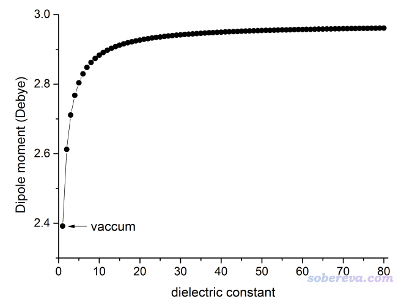
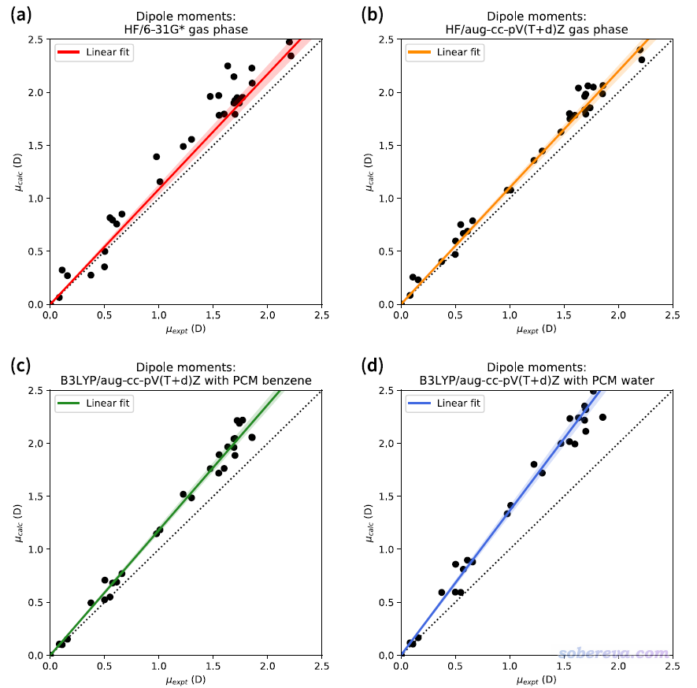
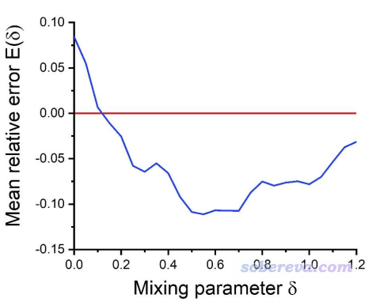

**RESP2原子电荷的思想以及在Multiwfn中的计算**

Idea of RESP2 atomic charge and its calculation in
Multiwfn

文/Sobereva@[北京科音](http://www.keinsci.com)

 First release: 2020-Feb-1  Last update: 2022-Aug-6

## 1 前言

RESP是几乎最适合用于分子动力学模拟的原子电荷计算方法，在《RESP拟合静电势电荷的原理以及在Multiwfn中的计算》（<http://sobereva.com/441>）中笔者对RESP电荷有非常详细的介绍。RESP电荷的具体数值明显依赖于计算电子波函数用的量子化学方法和基组，以及对溶剂效应的考虑。有不少人关心到底什么计算级别最适合计算RESP电荷，笔者在上文中已经做了一些说明，在本文笔者将对这个问题做更具体的讨论，并且介绍RESP电荷的变体RESP2电荷的思想，以及如何用Multiwfn计算RESP2电荷。目前已经有人使用Multiwfn计算了RESP2电荷并发表了文章，比如Nature Energy (2023) DOI: 10.1038/s41560-023-01275-y、Chem. Phys. Lett., 754, 137707 (2020)。

**使用本文介绍的方法用Multiwfn计算RESP2电荷的话需要在文章中恰当引用Multiwfn**，引用方式在《Multiwfn FAQ》（<http://sobereva.com/452>）一开始就说明了。

## 2 关于溶剂对溶质电荷分布极化效应的描述

在谈RESP2电荷之前，先说一些相关知识。

在溶剂环境下，溶质的电荷分布会被溶剂环境所极化。量子化学计算中溶剂环境通常通过PCM等隐式溶剂模型表现，溶剂对溶质极化的作用关键在于溶剂的介电常数。缺乏溶剂模型相关知识的话看《谈谈隐式溶剂模型下溶解自由能和体系自由能的计算》（<http://sobereva.com/327>）。在《谈谈如何衡量分子的极性》（<http://sobereva.com/518>）中笔者提到，偶极矩是衡量小分子极性的常用指标之一。下图展示了甲醛在不同介电常数的溶剂下的偶极矩，计算在B3LYP/aug-cc-pVTZ下进行，溶剂模型用Gaussian默认的IEFPCM，结构是在B3LYP/def-TZVP级别下在真空中优化的。图中对应真空的情况（介电常数=1）是去掉溶剂模型后计算的结果。

可见，溶剂的介电常数越大，溶质在溶剂中就被极化得越厉害、极性比真空下就大得越多（但极化程度和介电常数不是线性关系，从上图也能看出来）。水是最常见的溶剂，常温下介电常数是78.3。

对于目前最常用的固定电荷力场（相对于可极化力场而言），在凝聚相下模拟时，原子电荷分布应当能等效地体现出实际环境产生的极化效果。例如常用的SPC/E水模型对应的偶极矩2.35 Debye就明显高于水的气相实验偶极矩1.85 Debye。

以往的AMBER力场中大多数版本，包括2019年提出来的AMBER19SB，都是在HF/6-31G*级别下算的RESP电荷。稍有量子化学常识的人都知道HF/6-31G*非常垃圾、无法忍受。之所以HF/6-31G*下的RESP电荷还被沿用至今，是因为HF完全不能考虑电子库仑相关，这使得波函数质量很烂、体系的极性整体被一定程度高估，而这误差恰巧能一定程度表现凝聚相中溶剂对溶质的极化作用。另一方面，主要描述蛋白质和核酸的AMBER力场大多数版本都是结合着HF/6-31G*的RESP电荷拟合的力场参数，参数与电荷间有一定耦合（尤其是氨基酸的参数，稍微变变就可能导致长时间跑出来的蛋白质构象改变不少，开发者不敢轻易动），因此搞力场的人即便明知道HF/6-31G*组合如今看起来很渣，也还继续容忍着这种陋习。

显然，如果用像样的DFT泛函结合隐式溶剂模型来体现溶剂的极化作用，比起靠HF/6-31G*气相计算这种“以错误的方式得到凑合能用的结果”要优雅、理想得多，也显然是未来发展新力场时势必要用的做法。

在J. Chem. Inf. Model., 60, 249 (2020)一文中，作者专门考虑了不同方式计算的一批很小的有机分子的偶极矩，如下所示。其中横坐标是气相实验偶极矩，纵坐标是不同方式计算出的偶极矩。（注：DFT结合图中这么大的带弥散函数的3-zeta基组计算的气相偶极矩可以和实验值对得很好，所以与气相实验值的偏差纯粹体现的是隐式溶剂模型的影响）

从上图可以得到以下结论  
(1)HF/6-31G*倾向于高估体系极性（拟合的直线斜率大于1），但数据点分布比较散，因此高估程度不一，甚至对于个别体系反倒还低估了偶极矩（散点在对角线下方）。  
(2)如果HF计算时改用较大基组，则线性相关性比起用6-31G*好得多，即数据质量更好了，而对极性的平均高估程度倒是和6-31G*相仿佛。  
(3)常用的B3LYP泛函结合较大基组并考虑溶剂效应时，哪怕只用介电常数比较低的苯作为溶剂（介电常数为2.2），体系的极性也比HF在真空下计算的更高。若改用极性很大的水作为溶剂，则极化程度还能再提高一倍。

从上述对比可以看出，使用HF/6-31G*算RESP电荷的做法绝对应当被摒弃，因为其数据质量太低，溶剂的等效极化效应表现的可靠程度太差（数据点太分散，时高时低）。再者，实际的溶剂只会对直接暴露在溶剂环境的位于溶质表面的原子的电荷分布产生明显的极化，并不会显著影响溶质内部区域的电荷分布，而在HF下溶质所有区域的极性都倾向于被高估，这和实际不符。另外，HF/6-31G*下计算RESP电荷完全体现不出不同溶剂对溶质极化程度的差异，这又是基本原理上的一个硬伤。

由于从上图可见，DFT结合隐式溶剂模型计算出的偶极矩分布没有那么分散，因此以这种组合在RESP电荷计算时考虑溶剂效应在理论上是非常理想的。然而要注意的是，对于RESP电荷计算目的，并非体系实际处于什么溶剂环境，就应当选择什么溶剂用于溶剂模型。有以下几点值得关注：  
(1)基于HF/6-31G*的RESP电荷下用AMBER、GAFF力场得到的水环境下的模拟结果通常还不错。而从上图来看，如果DFT计算时用隐式溶剂模型表现水，那么溶质的极性就显得有点高过头了，整体远高于HF/6-31G*的情况，因此从直觉来看此时的结果有可能更差。  
(2)AMBER03力场也是用的RESP电荷，且计算RESP电荷时是在看起来比较理想的B3LYP/cc-pVTZ结合IEFPCM溶剂模型下进行的，但是设的介电常数是4。之所以设得这么小是避免过度极化，否则最终会高估静电相互作用，导致出现氢键过强等问题。而且从前面的图来看，哪怕用苯这么低极性的溶剂，产生的极化效应也并不小，比HF/6-31G*高估极性的程度甚至整体还高。这体现出刻意用较小的介电常数结合隐式溶剂模型来计算水环境中模拟用的RESP电荷有一定合理性。  
(3)在J. Chem. Inf. Model., 60, 249 (2020)文中提到，对于高极性溶剂环境下的模拟，用于计算原子电荷的体系波函数中，体系的被极化程度理应低于实际溶剂中的情况，这用于体现体系电荷分布从孤立状态被极化到溶剂环境中的状态过程中的能量消耗。

## 3 IPolQ与RESP2电荷

J. Phys. Chem. B, 117, 2328 (2013)中提出了IPolQ原子电荷，它是将气相和显式水下算的RESP电荷取平均。后来J Comput Aided Mol Des, 28, 277 (2014)中提出的IPolQ-mod将IPolQ的计算简化，变成了将气相和隐式水下算的RESP电荷取平均，用的是MP2/aug-cc-pVDZ级别（此级别对电荷分布的描述和上图中B3LYP/aug-cc-pV(T+d)Z其实差不多）。测试发现用IPolQ-mod电荷算水合自由能的结果和基于HF/6-31G*下RESP电荷计算的结果差不多。因此，IPolQ-mod这种在靠谱计算级别下，将气相和隐式溶剂下算的RESP电荷取平均的做法是值得提倡的方法，因为虽然结果看起来并不比用基于HF/6-31G*的RESP电荷算的有显著优势，但做法明显严格、合理得多得多，还能有效避免因为用了垃圾的HF/6-31G*被他人批评。

在2019年的<https://doi.org/10.26434/chemrxiv.10072799.v1>一文中，作者将IPolQ-mod的思想进一步广义化，提出了RESP2电荷（PS：这名字起得真够吸引眼球的）。它的定义是：q_RESP2 = (1-δ)*q_gas + δ*q_aqu。其中q_gas和q_aqu分别是气相和水模型下计算的RESP电荷，δ是可调参数。诸如δ=0.5的时候可以叫RESP2(0.5)。实际上RESP2(0.5)就相当于IPolQ-mod电荷。

2020-Apr-29补充：RESP2的文章已发表于Communications Chemistry, 3, 44 (2020)，地址：<https://www.nature.com/articles/s42004-020-0291-4>。

注：RESP2的文章里用的计算级别是PW6B95/aug-cc-pV(D+d)Z，在我来看用这个并没有什么特别的道理。PW6B95是个非主流泛函，对于RESP电荷计算来说不会比常用的B3LYP有任何优势，绝对没必要刻意用。而用aug-cc-pV(D+d)Z这种基组其实还不如用def2-TZVP，因为对中性体系，与其加弥散函数还不如先从2-zeta升到3-zeta，而且def2-TZVP的f极化函数也对于更好地描述电荷分布有不可忽视的帮助（尤其是杂原子）。如果是阴离子，个人建议用def2-TZVP加弥散的版本ma-TZVP，详见<http://sobereva.com/509>。

RESP2这篇文章基于非主流的SMIRNOFF力场，对一批有机体系模拟了密度、蒸发焓、介电常数、水合自由能，根据文中的数据可以发现以下情况（以下RESP代表HF/6-31G*气相算的RESP电荷，RESP2代表PW6B95/aug-cc-pV(D+d)Z算的RESP2电荷）：  
(1)不重新优化LJ参数时，基于RESP2(0.6)电荷算的介电常数比RESP好很多，其它性质则半斤八两。如果加大δ，可以令介电常数和水合自由能的模拟精度比RESP更有优势（δ=1时最理想）。如果减小δ，可以令密度的精度更有优势（δ=0.2时比较合适）  
(2)如果重新优化LJ参数，δ在0.5~0.7时整体误差（蒸发焓、密度、介电常数、水和自由能的平均误差）最低，尽管不同的属性对于δ的倾向性有所不同。重新优化LJ参数时，RESP2(0.6)比RESP除了算蒸发焓以外都更好，说明用RESP2电荷的话比基于RESP电荷明显有更大的余地去进一步优化LJ参数来改进结果，这点从下图可以非常清楚地看出。图中中红线是基于RESP电荷算的各种性质的平均误差，蓝线曲线是对RESP2电荷扫描δ的情况，每次计算时都重新优化了LJ参数。

RESP2这篇文章进一步体现，在像样的计算级别下，将气相和溶剂模型下的RESP电荷相混合，比起用垃圾的HF/6-31G*在气相下算RESP电荷更妥，后者俨然已经过时，是时候抛弃它了。

此文中发现RESP2计算性质整体误差最小时δ是0.6，和IPolQ电荷对应的δ=0.5非常接近，而且RESP2(0.5)和RESP2(0.6)的误差差不多，因此δ=0.5应当认为是一个比较普适的参数。RESP2文章里没有测试Amber03那种算RESP电荷的做法，即基于介电常数为4的溶剂用像样级别算RESP电荷，这有点可惜。

RESP2原文里的RESP2电荷的定义在我来看有个不妥之处是不管体系处在什么外环境下，在溶剂模型下计算时都是用的水，这明显不科学。一个溶质在低极性的溶剂比如氯仿中以及在高极性的溶剂比如水当中的电荷分布差异是很大的，而隐式溶剂模型明明能考虑不同溶剂何故不如实地考虑？如果此文里诸如计算呋喃的密度时就用呋喃作为溶剂来计算RESP2公式中溶剂下的RESP电荷，估计会使文中的除了水合自由能以外的性质都得到不小改进。

## 4 到底该怎么计算适合AMBER/GAFF力场模拟的电荷？

上面说了一大堆，到底怎样计算最佳的用于AMBER/GAFF力场模拟的原子电荷？我个人目前推荐这样计算RESP2(0.5)电荷：  
q_RESP2(0.5) = 0.5*q_gas + 0.5*q_solv  
其中q_gas是气相下的RESP电荷，q_solv是用PCM模型表现实际溶剂时的RESP电荷（注：G09、G16默认的IEFPCM是PCM最佳的实现形式）。几何优化使用B3LYP-D3(BJ)搭配6-311G**（或更好一点点的def-TZVP），优化时在真空下即可，但如果是带电体系或局部带显著电荷的体系则应当在溶剂模型表现实际溶剂环境下进行优化。之后产生用于计算q_gas和q_solv的波函数文件时的单点任务使用B3LYP-D3(BJ)/def2-TZVP，如果是阴离子则基组改为ma-TZVP。只要有个基本像样的服务器，这样的计算级别用Gaussian+Multiwfn算上百个原子的RESP2电荷完全没有压力。但如果体系更大，或者要算一大批体系，或者机子实在烂，那么优化可以用6-31G**，单点可以用def-TZVP，再低就没法忍受了。

以上述做法计算电荷，从任何角度都说得通。但可能有人会叽叽歪歪说，对之前AMBER力场的大多数版本，以及专门用于有机小分子的GAFF力场，官方都是HF/6-31G*下算的RESP电荷，你这样拿RESP2(0.5)电荷搭配会不会有不兼容性？这完全不必顾虑。前文已经说了，原理较严格的RESP2(0.5)的电荷实际表现不会比HF/6-31G*的RESP电荷差，很多情况还更好，而且前文里IPolQ-mod文章就是基于GAFF力场做的对比，SMIRNOFF力场的LJ参数也都是来自AMBER/GAFF的。

## 5 使用Multiwfn计算RESP2电荷实例

下面就通过实例完整演示一下使用Gaussian结合Multiwfn计算RESP2(0.5)电荷的过程，以计算乙醇环境中的甲醛为例。Gaussian使用16 A.03版，Multiwfn使用2020-Jun-30更新的3.7(dev)版。如果还没读过《RESP拟合静电势电荷的原理以及在Multiwfn中的计算》（<http://sobereva.com/441>）一文的话请先阅读，里面有很多关键性知识应当了解。对Multiwfn不了解者强烈建议阅读《Multiwfn FAQ》（<http://sobereva.com/452>）。下面用到的文件都可以在<http://sobereva.com/attach/531/file.rar>里找到。

将以下内容存为Gaussian输入文件然后运行。初始结构是随便画的。此任务分三步，会先在B3LYP-D3(BJ)/def-TZVP下进行优化，然后基于优化过的结构利用B3LYP-D3(BJ)/def2-TZVP下在气相和IEFPCM模型表现的乙醇环境下分别算单点，最终在C:\下得到SP_gas.chk和SP_solv.chk。读者应择情对内容进行恰当修改（诸如G09 D.01之前不支持DFT-D3校正、G09 C.01之前不支持%oldchk。当前体系用DFT-D3校正其实完全没必要，加这个只是为了增加这个模板文件的普适性而已）

%chk=C:\opt.chk  
 # B3LYP/TZVP em=GD3BJ opt  
  
 niconiconi  
  
 0 1  
  C                  0.00000000    0.00000000    0.52887991  
  H                  0.00000000    0.93775230    1.12379107  
  O                  0.00000000    0.00000000   -0.67757652  
  H                  0.00000000   -0.93775230    1.12379107  
  
 --link1--  
 %oldchk=C:\opt.chk  
 %chk=C:\SP_gas.chk  
 # B3LYP/def2TZVP em=GD3BJ geom=allcheck  
  
  
 --link1--  
 %oldchk=C:\opt.chk  
 %chk=C:\SP_solv.chk  
 # B3LYP/def2TZVP em=GD3BJ scrf=solvent=ethanol geom=allcheck  
 <--空行  
 <--空行

算完之后，把SP_gas.chk和SP_solv.chk都转换为fch文件，不知道怎么做的话看《详谈Multiwfn支持的输入文件类型、产生方法以及相互转换》（<http://sobereva.com/379>）。

先计算气相下的RESP电荷。启动Multiwfn后，输入  
SP_gas.fch  //填实际的路径  
7  //原子电荷计算  
18  //RESP电荷  
1  //开始标准两步式RESP电荷拟合  
结果为  
Center       Charge  
   1(C )   0.4195430529  
   2(H )  -0.0050085243  
   3(O )  -0.4095260044  
   4(H )  -0.0050085243

然后用同样的方法，以SP_solv.fch作为输入文件，得到乙醇下的RESP电荷：  
Center       Charge  
   1(C )   0.4625344852  
   2(H )   0.0093031373  
   3(O )  -0.4811407598  
   4(H )   0.0093031373

将以上二者用诸如Excel取平均，就得到了RESP2(0.5)电荷，即  
0.441038769  
 0.002147307  
 -0.445333382  
 0.002147307

## 6 通过脚本方便地调用Multiwfn计算RESP2电荷

将两个文件分别计算再手动取平均是非常简单的事，但有的人就是嫌麻烦，还有人误以为Multiwfn计算电荷的过程没法纳入批处理什么的。为此，笔者提供了一个一键完成RESP2电荷计算的Linux脚本calcRESP.sh。此脚本在目前最新版本的Multiwfn文件包的examples\RESP2目录下可以找到。使用前需要先按照手册2.1.2节将Multiwfn正确安装，使得程序可以通过输入Multiwfn命令直接启动。这个脚本三种用法示例：

对SP_gas.fch计算RESP电荷：./calcRESP.sh SP_gas.fch  
基于SP_gas.fch和SP_solv.fch计算RESP2(0.5)电荷：./calcRESP.sh SP_gas.fch SP_solv.fch  
基于SP_gas.fch和SP_solv.fch计算RESP2(0.7)电荷：./calcRESP.sh SP_gas.fch SP_solv.fch 0.7

运行过后，RESP电荷会输出到当前目录下的与输入文件同名但是后缀为chg的文件中，而RESP2电荷会输出为RESP2.chg。chg是Multiwfn的私有的记录原子电荷的格式，其中2~4列是来自fch文件里的坐标，最后一列是算出来的电荷值。

此脚本的输入文件不限于fch，用其它的Multiwfn可以读取基函数信息的格式如.molden等都可以，见《详谈Multiwfn支持的输入文件类型、产生方法以及相互转换》（<http://sobereva.com/379>）。如果你已经将Multiwfn的settings.ini里的formchkpath设成了机子里实际的formchk路径，也可以直接用chk作为输入文件。

## 7 基于结构文件傻瓜式一键调用Gaussian和Multiwfn计算RESP2电荷

之前笔者针对RESP电荷写过《计算RESP原子电荷的超级懒人脚本（一行命令就算出结果）》（<http://sobereva.com/476>）一文，对其中介绍的脚本RESP.sh只需要提供含有结构信息的文件，脚本就会一条龙地调用Gaussian和Multiwfn完成RESP电荷计算，完全不懂Gaussian的人都能一键计算出RESP电荷。没有读过此文者请一定要先阅读，因为此文里说的很多要点在下文不会再重复说一遍。下面提供一个用法类似的脚本，但专门用于计算RESP2电荷，这个脚本就是Multiwfn文件包里的examples\RESP\RESP2.sh。用法示例如下：  
对中性单重态分子计算用于水溶剂MD模拟的RESP2(0.5)电荷：./RESP2.sh H2O.pdb  
对中性三重态分子计算用于水溶剂MD模拟的RESP2(0.5)电荷: ./RESP2.sh foo.xyz 0 3  
对阴离子单重态分子计算用于乙醇溶剂MD模拟的RESP2(0.5)电荷 ./RESP2.sh nozomi.mol -1 1 ethanol  
可见，电荷和自旋多重度分别默认为0和1，溶剂默认是水。δ用的是0.5，想改的话直接修改脚本即可。算完之后，当前目录下gas.chg和solv.chg分别是气相和溶剂下的chg文件，与输入文件同名但后缀为chg的是RESP2(0.5)电荷的文件。

此脚本用的计算级别只要打开.sh文件一看便知，对几何优化用的是B3LYP-D3(BJ)/def2-SVP，对单点用的是B3LYP-D3(BJ)/def2-TZVP。调用的是Gaussian 09，想改成调用Gaussian 16就把脚本中的g09改为g16。

如果你的输入的结构文件里的结构就已经足够好，不想让脚本自动再做优化浪费时间，可以用examples\RESP\目录下的RESP2_noopt.sh代替前述的RESP2.sh，二者用法完全一样，只不过前者不做优化步骤。

如果你没买Gaussian，也可以用免费的ORCA量子化学程序结合Multiwfn算RESP2原子电荷，笔者也提供了相应的傻瓜式脚本，见《ORCA结合Multiwfn计算RESP、RESP2和1.2*CM5原子电荷的懒人脚本》（<http://sobereva.com/637>）。
