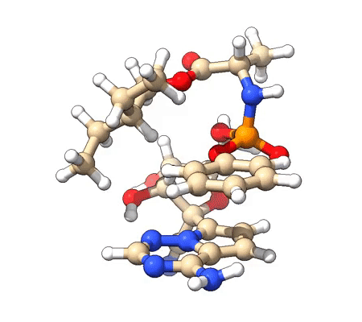

懒得在这里再发一遍了，本文直接在计算化学公社论坛看： [**http://bbs.keinsci.com/thread-16255-1-1.html**](http://bbs.keinsci.com/thread-16255-1-1.html)

此文目的是介绍怎么用molclus基于xtb做的分子动力学轨迹作为初始构型，搜索治疗武汉肺炎的特效药瑞德西韦的在水溶液下的能量最低构象，最终结果如下。此文的做法是对较大体系构象搜索的极佳、普适做法。

后注：鉴于有人在病毒名称上特别敏感，笔者在此进行如下专门澄清，以后不要再试图给笔者发邮件在肺炎的用词方面找茬  
2020年1月下旬，肺炎在武汉大规模爆发之后，中国的媒体、网络上基本都使用wuhan肺炎作为此病的称呼。本文是2020年**2月8日****早上发布的**。在2020年2月8日下午，有关部门**才**将此病命名为新冠肺炎。之后在2020-Feb-11的时候，WHO**才**正式宣布了此肺炎的名称为COVID-19，见<https://www.who.int/emergencies/diseases/novel-coronavirus-2019/technical-guidance/naming-the-coronavirus-disease-(covid-2019)-and-the-virus-that-causes-it>。**因此本文的用词没有任何不当**。
