**通过轨道权重福井函数和轨道权重双描述符预测亲核和亲电反应位点**

Prediction of nucleophilic and electrophilic reaction sites by orbital-weighted Fukui function and orbital-weighted dual descriptor

文/Sobereva@[北京科音](http://www.keinsci.com)

First release: 2020-Feb-24  Last update: 2022-May-24

## 0 前言

福井函数（Fukui function）与双描述符（dual descriptor）是概念密度泛函理论框架下定义的非常流行的用于预测反应位点的方法，笔者之前写过很多相关文章，连同大量相关综述都汇总提供在了这里：《概念密度泛函综述和重要文献合集》（<http://bbs.keinsci.com/thread-384-1-1.html>）。如果读者对一般形式的福井函数和双描述符都不了解的话，看下文之前尤其建议先看《亲电取代反应中活性位点预测方法的比较》（<http://www.whxb.pku.edu.cn/CN/abstract/abstract28694.shtml>）一文中介绍的相关知识。Multiwfn程序还专门提供了非常省事的计算这些量的功能，见《使用Multiwfn超级方便地计算出概念密度泛函理论中定义的各种量》（<http://sobereva.com/484>）。

福井函数和双描述符用于大多数体系都没什么问题。但有些体系比如C60、18碳环，具有高阶点群对称性，这往往令前线分子轨道存在简并性。还有些体系，前线轨道能量相差很小，即准简并。对这些情况，福井函数和双描述符可能无法给出有意义的结果，比如其函数分布不满足体系对称性，因此明显违背基本化学直觉。J. Comput. Chem., 38, 481 (2017)中作者提出了轨道权重福井函数的概念，在J. Phys. Chem. A, 123, 10556 (2019)中他们进一步提出了轨道权重双描述符的概念。相对于一般形式的福井函数和双描述符，这种轨道权重(orbital-weighted)的形式的优点在于可以较合理地用于前线轨道(准)简并的体系，并且对于有对称性的体系，结果完全满足分子对称性。

由于轨道权重福井函数和轨道权重双描述符比较有实际价值，计算起来也很容易，波函数分析程序Multiwfn从2020-Feb-24更新的版本开始支持了这两种函数，在下文将进行介绍，然后给出各种实例演示在Multiwfn中的操作以及它们的实际价值。Multiwfn可以在<http://sobereva.com/multiwfn>免费下载，不熟悉者建议参看《Multiwfn FAQ》（<http://sobereva.com/452>）。Multiwfn是预测反应位点非常强大的工具，支持的这方面的方法见手册4.A.4节的汇总介绍。

**重要提醒：**如果你的体系的前线轨道没有简并或者准简并特征，即原始形式的福井函数和双描述符就已经直接适用的话，就完全没必要而且也不建议用本文介绍的轨道权重的形式（因为这种形式的可调参数Δ的选取存在一定任意性，而且无法考虑轨道弛豫效应，而且仅能用于闭壳层体系）。原始形式的福井函数和双描述符怎么计算在《使用Multiwfn超级方便地计算出概念密度泛函理论中定义的各种量》（<http://sobereva.com/484>）都明确示例了。

## 2 原理

首先回顾一下，福井函数分为三种，f-、f+、f0。有两种常见计算形式，例如f-：  
(1)严格的计算方式：通过有限差分方式获得，即f- = ρ(N) - ρ(N-1)。N是体系原先具有的电子数。以这种形式计算原理上较严格，但需要分别对N和N-1态分别计算得到波函数文件，故略麻烦一些  
(2)轨道冻结近似的计算方式：f-等于HOMO轨道的密度。这种方式计算原理上没有(1)严格，因为忽略了轨道弛豫效应，但计算省事  
双描述符（Δf）定义为f+减去f-，因此双描述符也有以上两种不同的计算方式。

轨道权重福井函数和轨道权重双描述符定义如下，w下标意为weighted

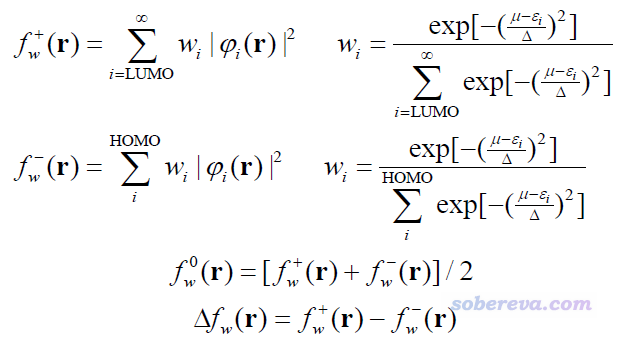

其中μ是化学势，在当前方法中是将HOMO与LUMO能量取平均的方式近似计算的。ε和φ分别是分子轨道能量和波函数。Δ是可调参数，影响式中Gaussian函数衰减的快慢。轨道权重形式的福井函数和一般形式一样，都是全空间积分数值为1。

可见轨道权重的福井函数/双描述符也是基于轨道冻结形式计算的。相对于原始形式，这种轨道权重形式的特点是把所有轨道同时考虑，每个轨道有不同的权重。权重一方面取决于轨道能量与化学势的差值，另一方面取决于可调参数Δ。Δ的数值越小，能量偏离HOMO与LUMO平均能量越大的轨道的权重就倾向于变得越小。当Δ无限小，轨道权重形式就还原为原始形式。Δ的最佳值是能令轨道权重福井函数/双描述符对当前体系反应位点预测得尽可能和实际一致的情况，因此它的最佳取值对体系有依赖性。不过对于预测而非解释反应位点的情况，我们并不事先知道反应在哪里更容易发生，所以Δ的确定有很大的含糊性。轨道权重福井函数的JCC原文里发现对大部分体系用Δ=0.1 Hartree比较适合，因此这被Multiwfn作为默认值。可以先试试这个，如果发现不好的话可以再根据实际情况进一步调节（比如发现轨道权重f-结果不好是因为低阶占据轨道掺进去太多了，那么可以把Δ设小点试试）。

## 3 在Multiwfn中的计算

Multiwfn的主功能22里提供了非常方便的计算轨道权重的福井函数/双描述符的功能，可以计算它们的格点数据，之后能直接看等值面，也可以导出为cub文件便于用第三方程序观看。还有现成的选项通过Hirshfeld空间划分方式计算简缩(condensed)轨道权重福井函数/双描述符，便于定量考察轨道权重福井函数/双描述符在各个原子上的分布量。另外，轨道权重f+/f-/f0/Δf分别对应于Multiwfn中的用户自定义函数95、96、97、98，因此在Multiwfn中对它们可以像其它函数一样去绘制曲线图、平面图、等值面图，考察特定位置的数值，考察在分子表面上的定量分布情况，做盆分析，做域分析等等，极度灵活，只有想不到没有做不到。

由于轨道权重f+/f0/Δf的表达式里涉及到空轨道，因此在Multiwfn中计算时应当用mwfn、fch、molden、gms文件中的一种，因为它们包含空轨道信息，而不能用不包含空轨道的诸如wfn、wfx文件。相关信息看《详谈Multiwfn支持的输入文件类型、产生方法以及相互转换》（<http://sobereva.com/379>）。另外，由于弥散函数往往会破坏非占据分子轨道的化学意义，因此计算时不建议带弥散函数。

## 4 实例

下面就通过一批例子演示轨道权重福井函数/双描述符在Multiwfn中具体怎么计算，并且和其它方法进行对比讨论。下面例子用到的文件都可以在这里下载：<http://sobereva.com/attach/533/file.rar>。

### 4.1 例1：C60

这一节使用C60作为例子。它具有Ih很高阶对称性，前线轨道高度简并，是展现轨道权重形式的福井函数/双描述符价值的非常理想的体系。

启动Multiwfn，然后输入  
C60.fch  //在本文文件包里。在B3LYP/6-31G*下产生  
22  //计算概念密度泛函框架下定义的各种量  
现在会看到一个界面，其中选项4可以用来设置前述的Δ参数，这里我们就暂且用默认值。然后进入选项7，选择恰当的格点设置后，程序就会开始计算各种轨道权重函数的格点数据。对当前体系就选Medium quality grid就够了，如果不知道怎么设置格点合适的话，参看《Multiwfn FAQ》（<http://sobereva.com/452>）中的Q39。

算完之后，会看到一个菜单，可以选择相应选项直接观看轨道权重的f+/f-/f0/Δf等值面，也可以选择相应选项将它们导出为cub文件。这里我把轨道权重形式的f+/f-/Δf的等值面一起给出，如下所示。绿色和蓝色分别代表数值为正和为负的部分。注意绘图时要恰当设置等值面数值(isovalue)，如果发现图中没有出现任何等值面，通常是因为等值面数值设得还不够小。下图的等值面数值用的都是0.0003 a.u.。

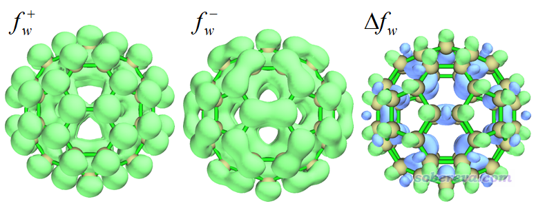

按照福井函数的说法，f+越大的地方是越容易被亲核进攻的位置，从上图看并没有发现在各个原子上的分布有什么特异性。从上图中的轨道权重f-的分布可见在两个六元环共享的碳碳键（[6,6]键）上发生亲电反应的可能性明显高于[5,6]键，因为在[6,6]键上方轨道权重f-的数值明显大于其它地方。轨道权重双描述符一张图就可以同时展现易于发生亲核和亲电反应的位点，由图可见只有在[6,6]键上方出现了蓝色等值面，即轨道权重双描述符为负的地方，这进一步体现了[6,6]键最容易被亲电进攻，或者等价地说，[6,6]键上的区域的亲核性更强。

下图是轨道权重双描述符原文J. Phys. Chem. A, 123, 10556 (2019)的TOC。

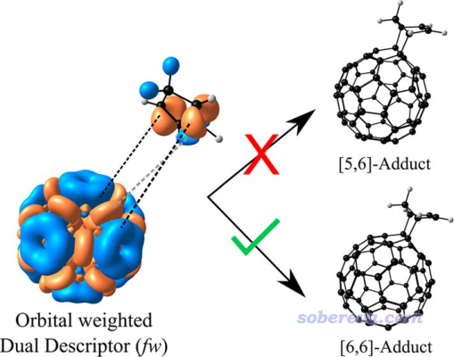

这TOC中左下角就是C60的轨道权重双描述符，图中蓝色和桔黄色分别是数值为正和为负的等值面，用的等值面数值和本例不同（如果本例把等值面数值设小为0.00002就可以得到差不多的图）。C60旁边那个分子是环戊二烯。C60和环戊二烯之间是可以发生加成反应的，但只能加到[6,6]键上而不能加到[6,5]键上。这个TOC充分解释了原因，因为[6,6]方式加成的话两个反应物在接触时，彼此的正好能以双描述符符号互补的方式碰上（如虚线标注的），相当于一个分子的亲核部位与另一个分子的亲电部位相接触，这显然将令反应容易进行，更具体地说，这种方式发生反应的势垒会比较低。

C60的[6,6]键比较容易发生亲电反应这一点也可以通过分子表面的平均局部离子化能分析来体现，见《使用Multiwfn的定量分子表面分析功能预测反应位点、分析分子间相互作用》（<http://sobereva.com/159>）。还可以通过绘制着色图更直观地体现，见《使用Multiwfn和VMD绘制平均局部离子化能(ALIE)着色的分子表面图》（<http://sobereva.com/514>）。笔者绘制了C60的ρ=0.0005 a.u.等值面的ALIE填色图，如下所示，越蓝的地方数值越负。黄球对应分子表面上ALIE的极小点位置。

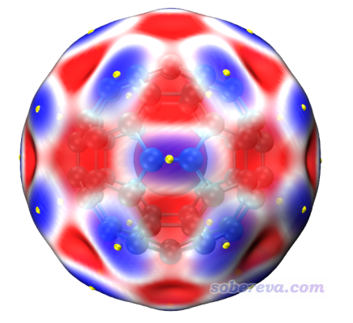

由上图可见，在[6,6]键上方，电子的平均电离能比其它地方更小，是电子最活泼的区域，因此从另一个角度也说明确实[6,6]键比[6,5]键更容易发生亲电反应。

如果用常规形式的福井函数考察C60会是什么情况？下图左侧是轨道冻结近似方式算的f-的0.001 a.u.等值面，即相当于HOMO轨道密度等值面；右侧是以有限差分方式严格算的f-的0.001 a.u.等值面。可见，两种方式算的f-的分布都违背了C60的对称性，因此难以，或者说根本没法用于实际问题的讨论。

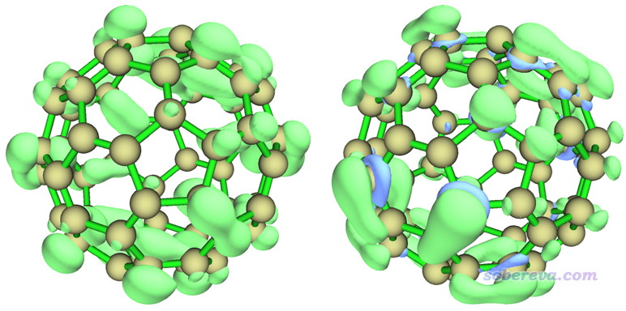

轨道权重福井函数/双描述符在Multiwfn里可以以非常丰富的形式去研究。比如这里我们也在分子表面上做轨道权重双描述符的定量分析。相对于绘制等值面图考察，这种方式能在定量层面上研究。由于轨道权重双描述符对应于Multiwfn中自定义函数98，因此我们打开Multiwfn目录下的settings.ini，把iuserfunc设为98，保存后启动Multiwfn，然后依次输入  
C60.fch  
12  //定量分子表面分析  
1  //设置定义表面的方式  
1  //用电子密度等值面  
0.01  //等值面为ρ=0.01 a.u.（不能用此模块默认的0.001 a.u.，否则效果不好）  
2  //设置被映射的函数  
-1  //用户自定义函数，当前对应于轨道权重双描述符  
3  //设置格点间隔  
0.25  //考虑到当前体系较大，把间隔设置得比默认大一些用于降低计算耗时。0.25 Bohr对于当前的研究精度足够了  
0  //开始分析

计算完毕后，选选项0，然后把原子球大小调节为3.0，此时可看到以下图像。红球和蓝球分别对应于ρ=0.01 a.u.等值面上轨道权重双描述符的极大点和极小点。

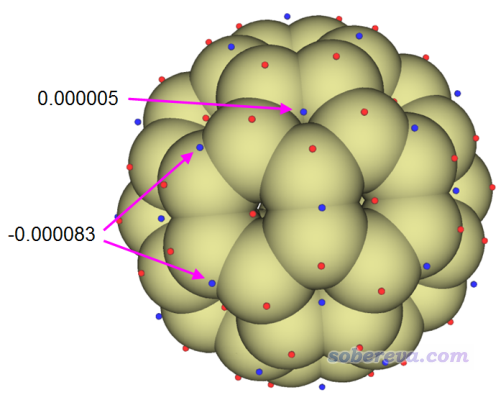

由上图可见，在当前等值面的每个[6,6]键上方都有一个轨道权重双描述符的极小点，比起任何其它区域数值都更负，清晰体现出这是电子最容易被亲电进攻的位置。虽然在五元环中间也有个极小点，但由于其数值为正，因此这种地方并没有显著发生亲电反应的倾向性。

值得一提的是，在Multiwfn的计算轨道权重函数的界面（主功能22）里有个选项5 Print current orbital weights used in orbital-weighted (OW) calculation，选了之后就会根据当前的Δ参数以及轨道能级输出计算f+时用的最低10个空轨道以及计算f-时用的最高10个占据轨道的权重值。这些信息有助于令你清楚地了解这些轨道权重形式的函数的内在机制，往往也能帮助你判断当前的Δ参数是否设得合理（比如如果低能占据轨道或高能空轨道的权重过高，有时可能就不太合理了，因而需要适当减小Δ参数）。比如对于C60这个例子，在默认的Δ参数下，选了这个选项就会输出以下信息：

 10 Highest weights in orbital-weighted f+  
  Orbital   181 (LUMO  )   Weight:  12.47 %   E_diff:     1.752 eV  
  Orbital   182 (LUMO+1)   Weight:  12.47 %   E_diff:     1.752 eV  
  Orbital   183 (LUMO+2)   Weight:  12.47 %   E_diff:     1.752 eV  
  Orbital   184 (LUMO+3)   Weight:   6.32 %   E_diff:     2.847 eV  
  Orbital   185 (LUMO+4)   Weight:   6.32 %   E_diff:     2.847 eV  
  Orbital   186 (LUMO+5)   Weight:   6.32 %   E_diff:     2.847 eV  
  Orbital   187 (LUMO+6)   Weight:   4.70 %   E_diff:     3.207 eV  
  Orbital   188 (LUMO+7)   Weight:   4.70 %   E_diff:     3.207 eV  
  Orbital   189 (LUMO+8)   Weight:   4.70 %   E_diff:     3.207 eV

 10 Highest weights in orbital-weighted f-  
  Orbital   180 (HOMO  )   Weight:   9.06 %   E_diff:    -1.752 eV  
  Orbital   179 (HOMO-1)   Weight:   9.06 %   E_diff:    -1.752 eV  
  Orbital   178 (HOMO-2)   Weight:   9.06 %   E_diff:    -1.752 eV  
  Orbital   177 (HOMO-3)   Weight:   9.06 %   E_diff:    -1.752 eV  
  Orbital   176 (HOMO-4)   Weight:   9.06 %   E_diff:    -1.752 eV  
  Orbital   175 (HOMO-5)   Weight:   5.02 %   E_diff:    -2.728 eV  
  Orbital   174 (HOMO-6)   Weight:   5.02 %   E_diff:    -2.728 eV  
  Orbital   173 (HOMO-7)   Weight:   5.02 %   E_diff:    -2.728 eV  
  Orbital   172 (HOMO-8)   Weight:   5.02 %   E_diff:    -2.728 eV  
  Orbital   171 (HOMO-9)   Weight:   5.02 %   E_diff:    -2.728 eV

可见当前体系HOMO~HOMO-4是简并的，在计算f-时总共占将近50%的权重，而其它更低阶轨道的参与程度也不可忽视。如果你把Δ参数从默认的0.1 Hartree减小到0.05 Hartree，再次选选项5，就会发现f-几乎完全由HOMO~HOMO-4贡献了（此时的轨道权重双描述符的等值面仍是合理的）：

10 Highest weights in orbital-weighted f-  
 Orbital   180 (HOMO  )   Weight:  17.69 %   E_diff:    -1.752 eV  
 Orbital   179 (HOMO-1)   Weight:  17.69 %   E_diff:    -1.752 eV  
 Orbital   178 (HOMO-2)   Weight:  17.69 %   E_diff:    -1.752 eV  
 Orbital   177 (HOMO-3)   Weight:  17.69 %   E_diff:    -1.752 eV  
 Orbital   176 (HOMO-4)   Weight:  17.69 %   E_diff:    -1.752 eV  
 Orbital   175 (HOMO-5)   Weight:   1.66 %   E_diff:    -2.728 eV  
 Orbital   174 (HOMO-6)   Weight:   1.66 %   E_diff:    -2.728 eV  
 Orbital   173 (HOMO-7)   Weight:   1.66 %   E_diff:    -2.728 eV  
 Orbital   172 (HOMO-8)   Weight:   1.66 %   E_diff:    -2.728 eV  
 Orbital   171 (HOMO-9)   Weight:   1.66 %   E_diff:    -2.728 eV

一般来说Δ参数参数不用动，如果你已经有了实验结果，发现轨道权重福井函数/双描述符预测的结果和实际不同，可以适当调调，看看能不能和实验对上，从而来解释实验的观测。另外，如果前线轨道能级本来就相差比较大，或者标准形式的福井函数、双描述符就已经能很好解释实验了，那就完全没必要用轨道权重形式了。

Multiwfn的计算轨道权重函数的界面里还提供了选项6用于计算各个原子Hirshfeld空间中的各种轨道权重函数的积分值便于定量对比各个原子的情况，即计算condensed（简缩）形式的值。对C60，输出信息为：

 Atom index        OW f+          OW f-          OW f0          OW DD  
     1(C )        0.01667        0.01667        0.01667       -0.00000  
     2(C )        0.01667        0.01667        0.01667       -0.00000  
     3(C )        0.01667        0.01667        0.01667       -0.00000  
     4(C )        0.01666        0.01666        0.01666        0.00000  
     5(C )        0.01666        0.01666        0.01666        0.00000  
     6(C )        0.01667        0.01667        0.01667       -0.00000  
 ...略

对于C60算这个没什么意义，因为此体系里所有原子都是空间等价的，所以显然所有原子空间中的积分值都相同，上面给出的数值也体现了这点。

### 4.2 例2：Hexabenzocoronene

Hexabenzocoronene这个体系的结构如下所示

这个体系有非常丰富的pi电子，哪里相对更容易发生亲电反应？我们首先对这个结构进行优化，得到的fch文件在本文文件包里提供了（注：在wB97XD/6-31G*级别下，此fch文件对应的平面结构是有非常轻微破坏平面的虚频的，但当前考察无视这个问题，因为当前结构和实际极小点结构不会相差多少，这点差异也不至于显著影响分析结果）。

我们还是按照前例的做法来绘制轨道权重双描述符的等值面图，等值面数值为0.0001 a.u.时如下所示

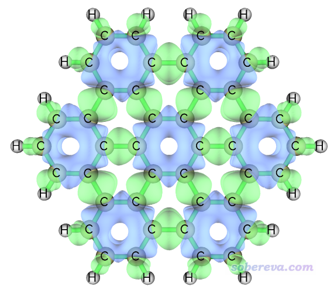

由上可见，此体系中7个六元环上方轨道权重双描述符数值为明显负值（蓝色等值面），说明亲电反应容易发生在这些位置。

实际上，这7个环正是体系中芳香性最强的7个环。一种非常直观的考察pi体系不同区域共轭程度高低的方法是LOL-pi，见笔者论文里的介绍和讨论：Theor. Chem. Acc., 139, 25 (2020) DOI: 10.1007/s00214-019-2541-z。此体系的LOL-pi=0.5的等值面图如下所示，是按照《在Multiwfn中单独考察pi电子结构特征》（<http://sobereva.com/432>）文中方法计算后再按照《在VMD里将cube文件瞬间绘制成效果极佳的等值面图的方法》（<http://sobereva.com/483>）中的做法渲染的。

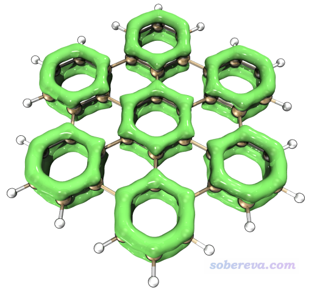

可见轨道权重双描述符所展现的7个最易发生亲电反的环也正对应于LOL-pi展现的芳香性最高的7个环。这并非巧合而是有必然性，因为具有芳香性环的特征之一就是容易发生亲电反应，见《衡量芳香性的方法以及在Multiwfn中的计算》（<http://sobereva.com/176>）的第1节。用其它芳香性衡量指标也可以得到相同的结论。

### 4.3 例3：18碳环

18碳环是2019年首次在凝聚相下观测到的一个结构奇特的体系，笔者对此体系及类似物做过大量理论研究且写过诸多博文，汇总见<http://sobereva.com/carbon_ring.html>，十分推荐一看。这里我们也用轨道权重福井函数/双描述符来考察一下。

wB97XD/def2-TZVP下优化并产生的18碳环的fch文件在本文文件包里提供了。我们首先按照前文的做法直接绘制轨道权重福井函数f-和轨道权重双描述符等值面，如下所示

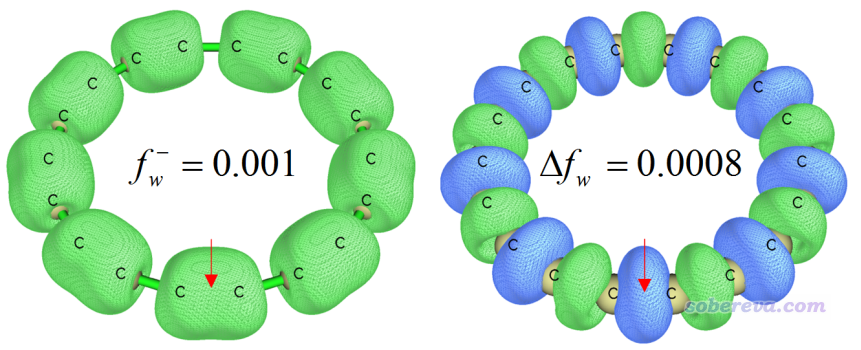

18碳环里有两类C-C键，一长一短，交替出现。其中一个较短的C-C键在上图中通过箭头标出了。可见两种函数都指出较短的C-C键更容易发生亲电反应，相对而言较长的C-C键则更容易被亲核进攻。

在Multiwfn里不仅可以对轨道权重福井函数/双描述符绘制等值面图，由于程序的高度灵活性，还可以对其绘制某两个点之间函数变化的曲线图，或者某个截面的各种平面图。下面，为了更充分地展现轨道权重福井函数在18碳环平面上的分布，我们绘制一下它在这个平面上的填色图+等值线图。把settings.ini里的iuserfunc设为98，然后启动Multiwfn并输入  
C18.fchk  
4  //绘制平面图  
100  //用户自定义函数，目前对应于轨道权重双描述符  
1  //填色图  
[按回车用默认的格点数]  
1  // XY平面  
0  // Z=0的XY平面（即当前体系所在的平面）  
把蹦出来的图关掉，然后输入如下命令调整绘图设置  
1  //设置色彩刻度上下限  
-0.003,0.003  
-8  //把坐标单位改为埃  
-2  //修改坐标刻度间隔  
1.5,1.5,0.001  
2  //显示等值线  
4  //显示原子标签  
1  //红色  
8  //显示键  
14  //棕色  
15  //用蓝色粗线显示范德华表面轮廓  
19  //设置色彩变化方式  
8  //蓝-白-红  
-1  //重新绘图

现在在屏幕上看到下图

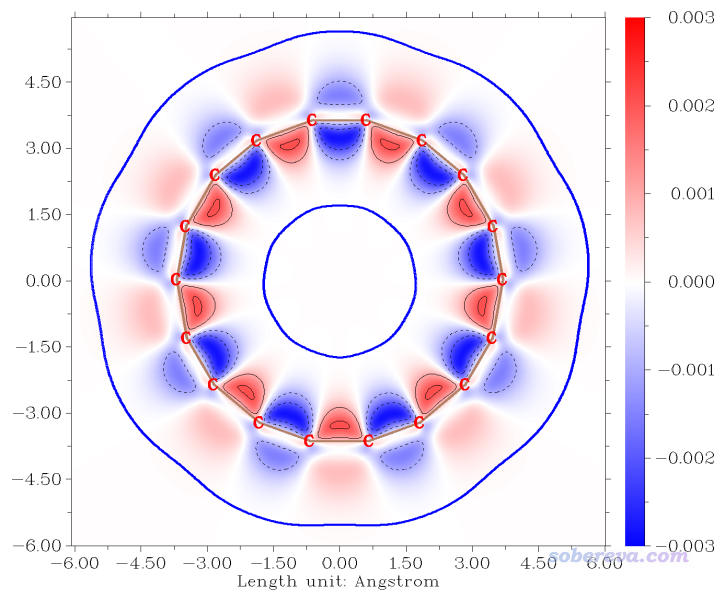

上图比起等值面图更充分地展现了分子平面上轨道权重双描述符的分布情况，可见在环内侧的数值大小比环外侧更高一些。

18碳环这个体系不适合用标准形式的福井函数考察。如《一篇最全面、系统的研究新颖独特的18碳环的理论文章》（<http://sobereva.com/524>）里介绍的笔者的18碳环研究论文中的“Electron ionization, electron affinity and structure reorganization”那一节的N-1与N电子态的密度差图所示，按照有限差分方式算福井函数f-的话得到的等值面会倾向在体系的一侧分布，不满足体系的对称性。

在上述的我的18碳环研究论文里通过分子表面的ALIE也考察了这个体系的反应位点问题，结论是较短的C-C键上的电子更容易失去、更容易被亲电攻击，和轨道权重双描述符的结论一致，请大家自行查看文章。

### 4.4 例4：氯代甲烷

最后，我们用轨道权重双描述符考察一下氯代甲烷CH3Cl这个体系。输入以下命令  
examples\CH3Cl.fchk  
22  //计算概念密度泛函框架下定义的各种量  
7  //计算轨道权重福井函数/双描述符的格点数据  
2  //中等质量格点  
之后可以直接选4来观看轨道权重双描述符等值面。不过这里我们用VMD来渲染以获得更好的效果，因此选择选项8，Multiwfn就会把轨道权重双描述符的格点数据导出到当前目录下的OW_DD.cub中。之后按照《在VMD里将cube文件瞬间绘制成效果极佳的等值面图的方法》（<http://sobereva.com/483>）的做法用VMD绘制出0.008 a.u.等值面图，如下所示（是直接用Tachyon (internal,in-memory rendering)方式渲染的，效果已经足够好了，没必要再单独调用Tachyon渲染器）

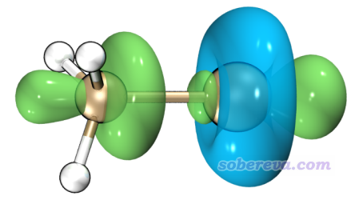

由图可见，环绕Cl原子的一圈等值面是蓝色，即轨道权重双描述符为负，体现出这部分区域的亲核性高，表现出局部Lewis碱的特征，本质在于这个区域是Cl的丰富的孤对电子主要分布的区域。在C-Cl键轴两端，轨道权重双描述符都为明显正值，以化学语言来解释，在碳的那一头的末端容易受到亲核进攻，比如发生SN2反应就是这种情况；在Cl那一头的末端则有一定亲电性，体现出局部Lewis酸特征，这一点和这个区域存在sigma穴在本质上是呼应的。值得一提的是，通过用Multiwfn做价层电子密度分析可以从另一个角度也展现出相似的图景，推荐看笔者的Revealing Molecular Electronic Structure via Analysis of Valence Electron Density一文（物理化学学报, 34, 503 (2018) <http://www.whxb.pku.edu.cn/EN/10.3866/PKU.WHXB201709252>）。

## 5 总结

本文介绍了轨道权重福井函数和轨道权重双描述符的定义，并给出了大量计算和分析例子。相对于原始的福井函数和双描述符的定义，它们在研究前线轨道(准)简并的情况时有非常明显的优势。通过Multiwfn计算它们极度容易、灵活，耗时较低，且只需要提供一个波函数文件作为输入文件即可，非常方便。虽然这俩函数之前并没怎么受到广泛关注，但由于其独特的价值以及在Multiwfn中的完美实现，预计在未来会得到不少应用，并成为概念密度泛函领域、反应位点预测方法中的不可忽视的存在。

在Multiwfn里还可以对轨道权重福井函数/双描述符做盆分析，从而得到整个三维空间中它们的极小点、极大点的位置和具体数值。只要先通过修改iuserfunc参数把用户自定义函数设为其中一种，然后在盆分析模块中选择生成盆的函数的时候选择User-defined function即可。盆分析的操作参看《使用Multiwfn做电子密度、ELF、静电势、密度差等函数的盆分析》（<http://sobereva.com/179>），本文就不具体示例了。

除了前文提到的ALIE外，《使用Multiwfn通过局部电子附着能(LEAE)考察亲核反应位点、难易及弱相互作用》（<http://sobereva.com/676>）中介绍的LEAE与轨道权重福井函数的用途也有很大关联，推荐读者阅读。
