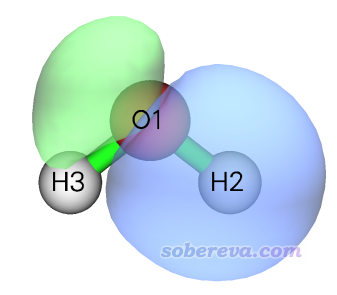
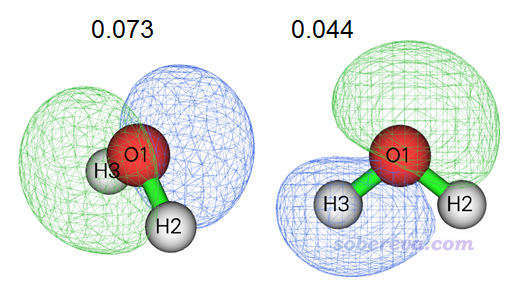
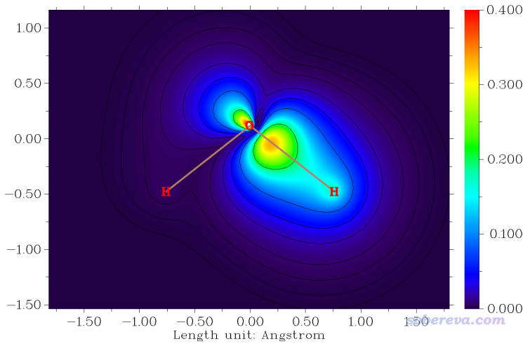
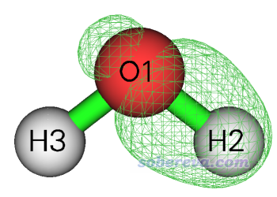
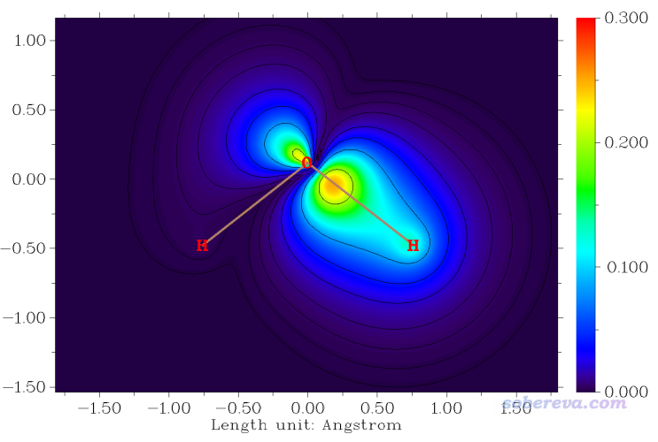
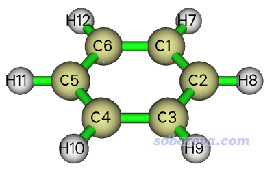
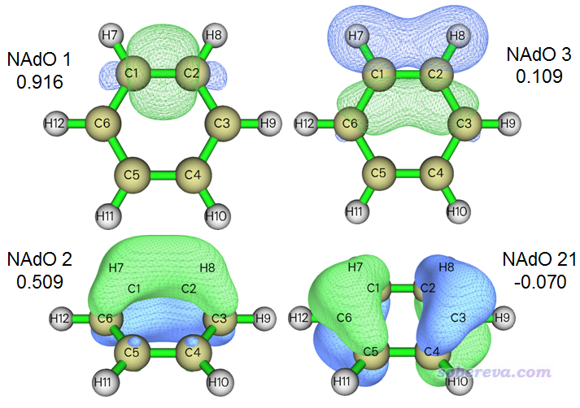
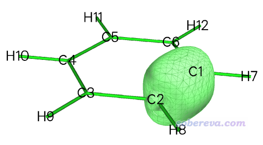
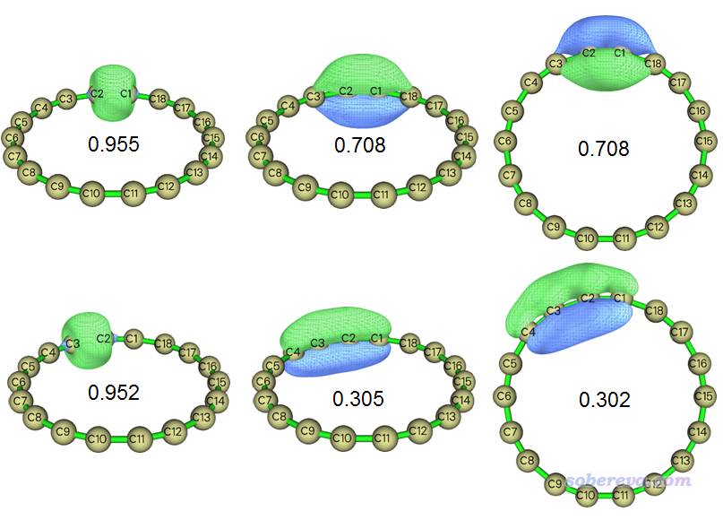
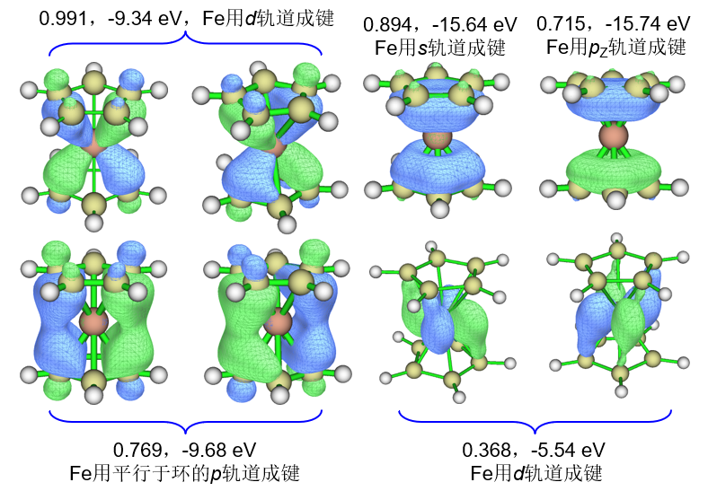

**2024-Jul-12补充**：Multiwfn已经支持了将BOD和NAdO用于CP2K计算的周期性体系的波函数上面，专门的介绍和例子见《使用Multiwfn对周期性体系做键级分析和NAdO分析考察成键特征》（<http://sobereva.com/719>）

**使用键级密度(BOD)和自然适应性轨道(NAdO)图形化研究化学键**

Using bond order density (BOD) and natural adaptive orbital (NAdO) to graphically study chemical bonds

文/Sobereva@[北京科音](http://www.keinsci.com)

First release: 2020-Mar-2  Last update: 2023-Aug-12

## 1 BOD和NAdO简介

键级是十分重要的定量考察化学键特征的手段，这在《Multiwfn支持的分析化学键的方法一览》（<http://sobereva.com/471>）中已经充分介绍过。广义来说，离域化指数（delocalization index, DI）衡量的是两个特定区域之间共享的电子对数，在两个原子空间之间计算的DI可以视为共价键级的一种衡量。原始定义的DI是在AIM原子空间之间计算的，模糊键级（fuzzy bond order）对应于模糊式划分的原子空间之间计算的DI，Mayer键级本质上对应于Hilbert划分的原子空间之间计算的DI。

DI或键级只是一个数字，为了更好地理解它的本质、展现出更多深层次的化学上感兴趣的信息，值得做进一步分析，这有不同方法。比如《Multiwfn支持的分析化学键的方法一览》中提到过，Multiwfn可以把Mayer键级分解为不同轨道的贡献（如MO、LMO的），还可以把Wiberg键级分解为原子轨道之间相互作用的贡献。在J. Phys. Chem. A, 124, 339 (2020)中，作者提出了一个叫做键级密度（bond order density, BOD）的概念，这是一个实空间函数，体现了三维空间中各个位置的电子对DI的贡献，因此如果对BOD绘图，就可以非常直观地考察DI值是由哪些区域的电子所主要贡献的；如果对某个区域的BOD进行积分，还可以定量地考察此区域对DI的具体贡献量（如果对BOD进行全空间积分，就恰好是DI值）。

BOD的原理比较复杂，其定义是对三阶cumulant密度的两个电子坐标分别在两个原子空间中做积分，相关知识就不在此文介绍了，在Multiwfn手册3.200.20节里有详细易懂的说明。

另外，BOD的作者还提出了natural adaptive orbital (NAdO)的概念。NAdO是在计算BOD时伴生得到的一种轨道，它由占据分子轨道做线性变换得到，原先有多少个占据分子轨道就会相应地有多少个NAdO轨道。每个NAdO对应一个本征值，加和恰好等于DI值。通常只有一个或几个NAdO数值较大。因此，可以通过考察NAdO轨道图形，来考察什么样的轨道对DI有显著贡献以及具体贡献多大，因此可以这样通过轨道角度来把DI值的内在本质了解得更透。BOD相当于所有NAdO轨道的概率密度乘上其本征值的加和。NAdO的计算公式和相关细节也不在本文详述了，请读者看Multiwfn手册3.200.20节里的介绍。

NAdO的名字和《使用AdNDP方法以及ELF/LOL、多中心键级研究多中心键》（<http://sobereva.com/138>）中介绍的adaptive natural density (AdNDP)轨道在名字上有点相似，但二者没有任何直接关系，注意不要混淆。

为了避免读者糊涂，这里强调一下：对于任意两个子空间（通常是两个原子空间）之间都可以计算DI；相应地，选取的两个子空间不同，得到的BOD和NAdO轨道也会因此不同。所以考察BOD和NAdO时要说清楚是对哪两个空间而言的。

有很多实空间函数比如ELF、LOL都可以图形化考察分子的哪些区域形成了共价键，详见《ELF综述和重要文献小合集》（<http://bbs.keinsci.com/thread-2100-1-1.html>）里的文章。相对而言，BOD的好处在于它的全空间积分直接对应于DI值，因此BOD图形可以与DI或者键级密切联系起来，能对计算出的DI予以图形化直观的展现和解释。另外，ELF是直接展现出三维空间里所有共价作用区域，还同时把孤对电子、内核区域等地方展示出来，但我们感兴趣的往往只是一对原子之间的作用，不想被其它区域的信息干扰，此时BOD也能体现出它的优势，即“指哪打哪”。PS：这有点像IGM与NCI方法在展现弱相互作用区域时彼此间的关系似的，见《使用Multiwfn做IGMH分析非常清晰直观地展现化学体系中的相互作用》（<http://sobereva.com/621>）。

注意BOD和NAdO主要适合的是共价键，因为离子键以及绝大多数弱相互作用的主要本质都不是通过共享电子的共价相互作用，因此DI值算出来会非常小，用BOD和NAdO再对其进一步考察也没法对这种相互作用的主要内涵进行揭示。

笔者还对BOD和NAdO的应用范畴做了极大的推广，在Multiwfn中这种分析方法还可以用于任意类型的盆之间（比如ELF盆之间），以及特定的两个片段之间，使得这种分析方法能讨论明显更多的问题。

显然，BOD和NAdO给化学键的分析增添了有用的新武器，其它的有价值的化学键分析的方法汇总见《Multiwfn支持的分析化学键的方法一览》（<http://sobereva.com/471>）。波函数分析程序Multiwfn从2020-Feb-27更新的版本开始完美支持了BOD和NAdO分析，计算快速、操作简单、十分灵活。下面先简单介绍下这种分析在Multiwfn中的操作流程，然后在第3节给出几个实际分析例子。最新的Multiwfn可以在官网<http://sobereva.com/multiwfn>免费下载，不了解者建议看《Multiwfn FAQ》（<http://sobereva.com/452>）和《Multiwfn入门tips》（<http://sobereva.com/167>）。

## 2 在Multiwfn中分析BOD和NAdO的基本流程

做BOD和NAdO分析主要有以下步骤  
(1)载入含有基函数信息的文件作为输入文件，比如mwfn、fch、molden，详见《详谈Multiwfn支持的输入文件类型、产生方法以及相互转换》（<http://sobereva.com/379>）。  
(2)计算并产生记录轨道重叠矩阵的文件。具体来说，如果你要考察两个原子间或两个片段间的成键情况，即分析它们之间DI的本质，就计算原子重叠矩阵（atomic overlap matrix, AOM），它在当前语境下指的是各个原子或片段空间中不同占据分子轨道之间重叠积分对应的矩阵，这在产生NAdO时需要。AOM可以通过模糊原子空间分析模块（主功能15）的输出AOM的功能得到，支持Hirshfeld、Hirshfeld-I、Becke划分；如果你要用AIM划分，那就进入盆分析模块（主功能17）并对电子密度产生盆（即AIM盆），然后选择输出AOM的功能。  
如果你想对比如两个ELF盆之间考察BOD/NAdO，则应当用盆分析模块对ELF产生盆，然后选择相应选项导出盆重叠矩阵（basin overlap matrix, BOM）。盆分析的相关信息看《使用Multiwfn做电子密度、ELF、静电势、密度差等函数的盆分析》（<http://sobereva.com/179>）。  
(3)进入主功能200的子功能20，选择是对原子间、盆间还是片段间的作用进行分析，然后选择从哪个文件载入AOM或BOM，然后输入两个原子序号、两个盆的序号或者两个片段里原子的序号。之后程序会显示NAdO的本征值，并在当前目录下输出NAdO.mwfn文件。在此文件中，原先波函数文件里的占据轨道已被替换为了新产生的NAdO轨道，轨道占据数对应于NAdO本征值，而非占据轨道依然是原先波函数文件里的那些。  
(4)如果你接下来马上就要考察BOD，就直接输入y（也可以启动Multiwfn后自行载入NAdO.mwfn），之后对电子密度进行分析就相当于对BOD进行分析，比如用主功能4绘制电子密度平面图就相当于绘制BOD平面图。如果想看NAdO轨道，就可以用比如主功能0照常看轨道，相关操作见《使用Multiwfn观看分子轨道》（<http://sobereva.com/269>）。还可以用比如主功能8做轨道成分分析，见《谈谈轨道成份的计算方法》（<http://sobereva.com/131>），等等。

Multiwfn默认不计算NAdO轨道能量，因此默认情况下NAdO.mwfn文件里的NAdO轨道能量都为0。如果要计算的话，进入主功能200的主功能20后先选-1，设置如何提供计算NAdO轨道能量用的Fock矩阵。之后在产生NAdO轨道的过程中就会自动计算其能量了。注：从2023-Aug-12更新的版本开始Multiwfn才支持计算NAdO轨道能量。

虽然BOD、NAdO分析原理上也可以用于多组态波函数（如MP2、MCSCF波函数），但Multiwfn目前只支持对单行列式波函数（HF、普通泛函下的KS-DFT波函数）做这个分析。开壳层和闭壳层体系都支持。

## 3 实例

### 3.1 水分子

这个例子我们用BOD和NAdO对水分子中的O-H键进行考察。这里我们基于Becke划分方式定义原子空间，相当于要对O-H模糊键级进行图形化考察。

启动Multiwfn，然后输入  
examples\H2O.fch  //B3LYP/6-31G**优化并产生  
15  //模糊空间分析  
3  //计算AOM并输出到当前目录下的AOM.txt中  
0  //返回主菜单  
200  //其它功能（Part 2）  
20  //BOD和NAdO分析  
1  //载入AOM  
[回车]  //载入当前目录下的AOM.txt  
1,2  //对O1和H2的成键进行分析  
现在在屏幕上会看到  
Generating natural adaptive orbitals (NAdOs)...  
 Eigenvalues of NAdOs: (sum=   0.95978 )  
   0.82970   0.07309   0.04428   0.01271   0.00000

此体系一共有5个占据轨道，经过变换后就成为5个NAdO轨道，本征值在上面都给出了，按照由大到小排序。本征值加和是0.95978，这正对应于O1-H2模糊键级数值，由于其数值很接近1，体现水中的O-H键是单重键。5个轨道本征值中有一个非常大（0.82970），可以认为这个轨道对模糊键级贡献了0.82970/0.95978=86.4%，因此这个轨道就可以当成是O-H键最主要的成键轨道。其它几个NAdO轨道也有轻微贡献，但相对来说非常次要。有时候NAdO轨道也可能出现微量的负本征值，一般这不需要关注。

如屏幕提示所示，记录这些NAdO轨道的NAdO.mwfn已经在当前目录下输出了。如果你马上就想分析BOD或者分析NAdO轨道，我们就输入y来让Multiwfn直接载入这个文件。输入y之后，我们进入查看轨道的功能，即主功能0。如果你想检阅一下所有轨道信息的话，可以选择图形窗口上方Orbital info. - Show all，此时在文本窗口会看到：  
Orb:     1 Ene(au/eV):     0.000000       0.0000 Occ: 0.829704 Type:A+B (?   )  
 Orb:     2 Ene(au/eV):     0.000000       0.0000 Occ: 0.073087 Type:A+B (?   )  
 Orb:     3 Ene(au/eV):     0.000000       0.0000 Occ: 0.044276 Type:A+B (?   )  
 Orb:     4 Ene(au/eV):     0.000000       0.0000 Occ: 0.012708 Type:A+B (?   )  
 Orb:     5 Ene(au/eV):     0.000000       0.0000 Occ: 0.000005 Type:A+B (?   )  
 Orb:     6 Ene(au/eV):     0.065347       1.7782 Occ: 0.000000 Type:A+B (?   )  
 Orb:     7 Ene(au/eV):     0.151227       4.1151 Occ: 0.000000 Type:A+B (?   )  
 Orb:     8 Ene(au/eV):     0.756861      20.5952 Occ: 0.000000 Type:A+B (?   )  
 ...略

前5个轨道是NAdO轨道，由于没要求Multiwfn计算它们的能量因此它们的能量都为0，当前它们的占据数(Occ)对应的是之前看到的NAdO本征值。从第6号轨道开始的都是H2O.fch里原本记录的空轨道信息。

在主功能0的图形界面里选择1号轨道来查看它，0.05等值面下的图像如下所示

可见这个轨道明显就是O-H成键轨道应有的样子，这是为什么它对O-H键的模糊键级贡献高达86.4%。

第2、3号NAdO轨道及其本征值如下所示

可见这俩轨道没有明显的对应O1-H2成键的特征，因此NAdO数值很小。但同时注意它们在O1-H2之间的区域是以原子间相位相同方式重叠的，这是它们的本征值为微小正值的原因。

接下来我们绘制分子平面上BOD的填色平面图。回到主菜单，然后依次输入  
4  //绘制平面图  
1  //电子密度（由于当前的轨道是NAdO，因此它此时对应于BOD）  
1  //填色图  
[回车]  //用默认格点数  
0  //修改延展距离  
2  //2 Bohr  
3  //YZ平面  
0  //X=0  
把蹦出来的图像关闭，用后处理菜单的相应选项适当调节作图参数后重新作图，得到下图（如果对作图设置有疑问，参考《Multiwfn FAQ》<http://sobereva.com/452>中的一些说明以及Multiwfn手册4.4节大量绘制平面图的例子）

这张图把分子平面上各个位置的电子对O1-H2键的模糊键级的贡献展现得一目了然。可见贡献较大的区域都主要分布在O1-H2键轴上，这和1号NAdO轨道的概率密度的分布特征很类似。靠近氧的那一边贡献得相对更大，这体现出O-H本身是极性键的事实。

我们也可以绘制BOD的等值面图。返回主菜单后依次输入  
5  //计算格点数据  
1  //电子密度（当前对应于BOD）  
2  //中等质量格点  
-1  //观看等值面  
数值为0.03的BOD等值面图如下所示（PS：BOD是无量纲的）

可见主要分布特征和1号NAdO轨道的概率密度分布差不多，毕竟它是BOD的最主要贡献者。

感兴趣的话，可以再用Multiwfn主功能8的子功能1做个Mulliken轨道成分分析，1号NAdO中的各个壳层的贡献如下：  
Shell     2 Type: S    in atom    1(O ) :     4.99077 %  
 Shell     3 Type: P    in atom    1(O ) :    36.34027 %  
 Shell     4 Type: S    in atom    1(O ) :     1.08294 %  
 Shell     5 Type: P    in atom    1(O ) :    20.24200 %  
 Shell     6 Type: D    in atom    1(O ) :     0.94243 %  
 Shell     7 Type: S    in atom    2(H ) :    24.90089 %  
 Shell     8 Type: S    in atom    2(H ) :    11.22270 %  
 Shell     9 Type: P    in atom    2(H ) :     0.72150 %  
 Shell    11 Type: S    in atom    3(H ) :    -0.77257 %

原子贡献如下  
Atom     1(O ) :    63.63526 %  
 Atom     2(H ) :    36.84510 %  
 Atom     3(H ) :    -0.48036 %

可见，氧的贡献占大头，体现这个NAdO轨道反映的是极性共价键特征。还能看到氧和氢基本上分别是靠p轨道和s轨道的混合构成这个轨道的。

通常通过BOD和NAdO考察原子间成键时就用上面基于Becke模糊式划分计算的AOM就行了，比较快。如果你就是要基于AIM划分来做也可以，但对于稍大的体系在产生盆的过程中需要花不少时间。还是以水分子为例子。启动Multiwfn后依次输入  
examples\H2O.fch  
17  //盆分析  
1  //产生盆  
1  //用电子密度零通量面划分盆（即得到AIM盆）  
2  //中等质量格点  
6  //计算各个原子盆的AOM并导出为当前目录下的AOM.txt  
之后返回主菜单，一切操作皆同前。当前情况NAdO本征值的输出为  
Eigenvalues of NAdOs: (sum=   0.67436 )  
   0.63464   0.01988   0.01443   0.00540   0.00000

即基于AIM划分算的O1-H2的DI为0.67436，比基于模糊式划分要小。这体现出不同划分导致的差异。通常对于极性越大的键，Becke和AIM划分结果的差异越大。当前情况下依然只有一个NAdO轨道的贡献占绝对主导，轨道形状和之前基于Becke划分得到的也没什么差别。把BOD绘制成平面图，如下所示，和之前得到的也没什么差别。所以一般没必要特意用比较费时的AIM划分来分析BOD、NAdO。

### 3.2 苯

此例对苯的C-C键做BOD和NAdO分析，原子序号如下所示。文件在B3LYP/6-31G*下优化并产生，可在<http://sobereva.com/multiwfn/extrafiles/benzene.fch>直接下载。

还是按照前文的做法，先基于Becke划分产生AOM矩阵，然后对C1-C2之间产生NAdO轨道，本征值如下所示  
Eigenvalues of NAdOs: (sum=   1.46743 )  
  0.91563   0.50959   0.10886   0.01613   0.00347   0.00062   0.00058  
   0.00000   0.00000   0.00000   0.00000  -0.00000  -0.00000  -0.00001  
  -0.00001  -0.00011  -0.00024  -0.00086  -0.00301  -0.01316  -0.07006

本征值加和值1.46743相当于C1-C2的模糊键级，差不多1.5，体现出苯环当中的C-C键差不多是1个sigma键加上半个pi键的本质。从本征值上看，第1个NAdO轨道贡献的0.91563将近1.0，我们可以推测这应该就是体现典型的sigma键的特征，而第2个NAdO轨道贡献的0.50959差不多0.5，可以推测应该是体现那半个pi键的特征。另外，还有某些NAdO轨道具有轻微的负本征值。下面我把本征值最正的三个轨道，以及最负的那个轨道都放在一起给出，等值面数值为0.05：

可见，确实1号NAdO的轨道图形正好对应C1-C2的sigma键，和我们预期的完全一致。2号NAdO明显是pi轨道，分布得比1号NAdO明显更离域一些，不仅在C1和C2上有大量分布，在相邻的C3和C6上也有一定分布，所以2号NAdO并非完完全全对应C1-C2作用，这也是为什么2号NAdO对C1-C2的模糊键级贡献远达不到1.0。3号NAdO的形状恐怕是大多数人没想到的，从轨道形状上可以看出这是主要由C1和C2在分子平面上的p原子轨道以肩并肩方式混合而成的，虽然对键级贡献只有0.109，但也不可完全忽视。21号NAdO的本征值为-0.07，即对模糊键级产生轻微负贡献。为啥是负贡献？从图形上可见，这条轨道在C1-C2之间是以相位相反方式叠加的，所以其为负本征值在某种程度上也能理解（尽管模糊键级、DI的概念里本身并没有确切的反键效应一说）。鉴于其负值非常小，姑且把它当成对成键毫无贡献而直接忽略掉也可以。

下面是C1-C2的BOD为0.03的等值面图

可见等值面完全在C1-C2区域。而且仔细看会发现等值面在垂直于苯环方向的延展程度高于在苯环平面上的延展程度，这体现出垂直于苯环的对键级贡献约0.5的pi型NAdO轨道的影响。如果绘制ELF、LOL、电子密度拉普拉斯函数的等值面图，也会看到类似情况。

NAdO轨道与定域化轨道（LMO）之间的关系我觉得值得一提。不熟悉LMO的话看《Multiwfn的轨道定域化功能的使用以及与NBO、AdNDP分析的对比》（<http://sobereva.com/380>）。占据的LMO，以及NAdO轨道，实际上都是对占据的分子轨道做酉变换得到的正交归一的一套轨道。通过这两种轨道都可以对更深入了解成键本质，但相比之下NAdO分析有如下好处  
(1)以LMO角度去分析时，是先对整个体系产生出各个LMO，之后再去找和自己研究的键大致对应的LMO。虽然用轨道占据数扰动的Mayer键级可以给出LMO对Mayer键级产生的贡献，但这种分解是不严格的（即轨道贡献的加和并非总等于总Mayer键级）。而以NAdO轨道角度去分析时，轨道是针对特定的键来产生的，而且Multiwfn输出时又根据本征值来排序，因此可以立马获得直接对应于被研究的键且贡献最主要的轨道。而且NAdO轨道本征值加和正好精确等于DI，这使得NAdO轨道的与被研究的键的特征之间关系非常明确。  
(2)对于大共轭体系，LMO的轨道分布和分子的对称性往往是不符的。比如对苯做LMO分析，会发现占据的pi型LMO轨道是三个，其主体分别落在三个彼此间隔的C-C键上，虽然从物理本质上这对六个C-C键的pi作用的描述其实是均等的（比如你基于LMO绘制ELF-pi图就可以证明这点，参考《在Multiwfn中单独考察pi电子结构特征》<http://sobereva.com/432>），但从轨道图形角度上，乍看起来仿佛这仨LMO把苯的六中心pi离域特征错误地描述成了Kekule式描述的单双键交替的情况；就算你有理论知识不会这么去误解，但在分析讨论轨道的时候也终究不方便。而NAdO分析给出的信息是完全满足对称性的，即如果你对六个C-C键分别做NAdO分析，你会发现结果都是相同的。所以像C60、卟啉、18碳环这样的大共轭体系，用NAdO来分析就不会因为一些主观性而对实际电子结构特征产生错误的认识。

至于用NBO轨道来分析大共轭体系中的键，这是很坑爹的。比如苯环，NBO程序产生的BD型轨道真会把它描述成单双键交替的样子，懂行的人还知道去看non-Lewis电子数、NBO轨道占据数来判断当前给出的图景是否有误导性，而换了初学者，往往没有基础还根据输出信息瞎分析，说不定真以为苯分子的电子结构就是Kekule式所描述的错误情况咧！

### 3.3 18碳环

之前在《一篇最全面、系统的研究新颖独特的18碳环的理论文章》（<http://sobereva.com/524>）介绍的笔者的论文中对18碳环这个奇特的体系的电子结构做了全面透彻的研究，也包括前面提到的LMO、NBO、LOL-pi手段，这里再用NAdO轨道研究一下。此体系在wB97XD/def2-TZVP下产生的fch文件可以在<http://sobereva.com/multiwfn/extrafiles/C18.zip>下载。

18碳环里有一种较长的和一种较短的C-C键交替出现，这我们取一个较短的键C1-C2和一个较长的键C2-C3来考察。以前文的方法，对C1-C2做NAdO分析得到的本征值如下

Eigenvalues of NAdOs: (sum=   2.28329 )  
   0.95470   0.70854   0.70820   0.00254   0.00190   0.00012   0.00003  
   0.00000   0.00000   0.00000   0.00000   0.00000   0.00000   0.00000  
   0.00000   0.00000   0.00000   0.00000   0.00000   0.00000   0.00000  
   0.00000   0.00000   0.00000   0.00000   0.00000   0.00000   0.00000  
   0.00000  -0.00000  -0.00000  -0.00000  -0.00000  -0.00000  -0.00000  
  -0.00000  -0.00000  -0.00000  -0.00000  -0.00000  -0.00000  -0.00000  
  -0.00000  -0.00000  -0.00000  -0.00000  -0.00000  -0.00000  -0.00005  
  -0.00033  -0.00036  -0.00174  -0.04475  -0.04551

对C2-C3做NAdO分析得到的本征值如下

Eigenvalues of NAdOs: (sum=   1.42769 )  
    0.95239   0.30532   0.30244   0.00116   0.00095   0.00017   0.00003  
    0.00001   0.00000   0.00000   0.00000   0.00000   0.00000   0.00000  
    0.00000   0.00000   0.00000   0.00000   0.00000   0.00000   0.00000  
    0.00000   0.00000   0.00000   0.00000   0.00000   0.00000  -0.00000  
   -0.00000  -0.00000  -0.00000  -0.00000  -0.00000  -0.00000  -0.00000  
   -0.00000  -0.00000  -0.00000  -0.00000  -0.00000  -0.00000  -0.00000  
   -0.00000  -0.00000  -0.00000  -0.00000  -0.00000  -0.00000  -0.00023  
   -0.00028  -0.00113  -0.00127  -0.06556  -0.06630

可见较长的C-C键的模糊键级1.43明显小于较短的C-C键的值2.28。每个键的前三个NAdO轨道的本征值显著大于其它的，下面将这两种键的这仨轨道的0.05等值面的图形都给出，第一行和第二行分别对应的是较短和较长的C-C键的情况。

由图可见，对较长和较短的C-C键，对应于sigma作用的轨道的形状以及本征值都差不多，所以这两类键的sigma特征差异相对较小。上图中的pi型NAdO轨道的本征值和形状在这两类键之间相差得相当显著。比如较短C-C键的2号NAdO对键级贡献较大（0.708），而且定域程度相对较高，而较长C-C键的2号NAdO对键级贡献较小（0.305），而且显著离域到相邻的原子上了。这在一定程度上暗示出在C2、C3之间，在环上、下方的电子离域性较强，即定域性较低，被C2和C3独享程度弱，故而C2-C3的垂直于环平面的pi作用没有C1-C2的情况那么强。3号NAdO展现的环平面内的pi作用也有类似情况。从上图中也看到对于每种C-C键，垂直于和平行于环平面的pi作用的强度都差不多。

### 3.4 二茂铁

本例展示如何对片段间相互作用进行分析，将对二茂铁中Fe和两个茂环间做NAdO分析，顺带演示一下NAdO轨道能量的计算。用到的fch文件在<http://sobereva.com/attach/535/Ferrocene_ECP.zip>下载。注：片段间的BOD/NAdO分析是从2020-Nov-28更新的Multiwfn开始支持的。

启动Multiwfn然后输入  
Ferrocene_ECP.fch  
15  //模糊空间分析  
3  //产生AOM.txt  
0  //返回  
200  //其它功能（Part 2）  
20  //BOD与NAdO分析  
-1   //要求计算NAdO轨道能量  
1  //计算NAdO轨道能量用的Fock矩阵通过轨道能量和系数矩阵反解出来（这种做法最方便，但有弥散函数的时候可能会失败，届时需要自行提供含有Fock矩阵的文件供Multiwfn读取）  
3  //片段间相互作用分析  
[回车]  //从AOM.txt中读取AOM并构成FOM  
6  //片段1的原子序号  
1-5,7-21  //片段2的原子序号

结果如下  
Eigenvalues of NAdOs: (sum=   7.58777 )  
  0.99116   0.99085   0.89387   0.76925   0.76873   0.71508   0.36827  
  0.36817   0.17977   0.13708   0.12770   0.12727   0.12692   0.11633  
  0.11582   0.11473   0.11431   0.10179   0.10137   0.04965   0.04957  
  0.04786   0.04779   0.04749   0.04736   0.01979   0.01144   0.01140  
  0.01033   0.00634   0.00307   0.00307   0.00172   0.00026   0.00026  
  0.00026   0.00026   0.00024   0.00024   0.00023   0.00023   0.00021  
  0.00021

然后输入y载入刚导出的NAdO.mwfn，在主功能0里观看新产生的轨道，其中有主要贡献的8个轨道图形和本征值汇总如下（其余贡献最大的只有0.18）。由于当前要求了计算NAdO轨道能量，因此Multiwfn在文本窗口显示轨道信息的时候也能看到轨道能量，也在下图上标了。

从图形上明确可见这些轨道确实对应于Fe与茂环之间的相互作用。上图中标注的Fe用于成键的轨道不仅可以肉眼判断，也可以进入主功能8，选择Mulliken或者SCPA方法做轨道成分分析，Multiwfn会清晰地告诉你Fe用了哪些基函数成键，再根据《利用布居分析判断基函数与原子轨道的对应关系》（<http://sobereva.com/418>）介绍的方法还可以进一步确认是哪些原子轨道用于了成键。另外，有兴趣的读者可以再绘制一下BOD图展现对模糊键级有显著贡献的电子所在的区域。

上图中右上角所示的Fe用pz轨道成键的NAdO轨道的本征值虽然小于上图左上角所示的Fe用d轨道成键的NAdO轨道，即前者对模糊键级的贡献比后者小，但前者的轨道能量（-15.74 eV）明显低于后者（-9.34 eV），因此前者对配体与Fe的结合强度的贡献有可能还更大。

片段间的BOD/NAdO分析对于讨论片段间形成多重键的情况非常有帮助，对于笼状/环状体系包夹子结构的团簇体系用此方法更是对讨论成键特点极为有益。

值得一提的是，ETS-NOCV是另一种Multiwfn支持的非常强大的图形化展现片段间轨道相互作用的方法，不了解的话一定要阅读《使用Multiwfn通过ETS-NOCV方法深入分析片段间的轨道相互作用》（<http://sobereva.com/609>）。ETS-NOCV与NAdO分析有高度的互补性。

## 4 总结

本文介绍了BOD和NAdO的基本概念以及在Multiwfn中的使用，并通过实例展现了如何考察实际问题。由例子可见通过BOD、NAdO以及与其它Multiwfn的功能相联用，可以把特定的原子间或片段间的共价作用主要出现的区域以及本质探究得非常充分，是化学键分析工具箱当中又一有用的新工具，尤其值得在复杂的电子结构研究问题中使用。在Multiwfn手册4.200.20节里还有其它BOD和NAdO分析例子，建议感兴趣的读者一看。

《18个氮原子组成的环状分子长什么样？一篇文章全面揭示18氮环的特征！》（<http://sobereva.com/725>）介绍的笔者的文章中通过NAdO直观、准确揭示了新颖的18氮环中N-N键的成键本质，是NAdO的极好的应用例子，非常推荐一看。

另外，对ELF或做盆分析，可以划分出特征电子结构区域，如孤对电子盆、共价键的盆、内核盆等等。如果在ELF盆之间做BOD、NAdO分析，就可以图形化考察特征区域之间的共享电子作用，并进一步从轨道角度加深认识。
