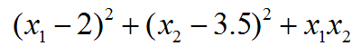
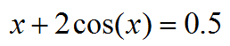

**无需导数的局部极小化算法NEWUOA在Fortran中的使用简例**

A simple example of using the local minimization algorithm NEWUOA without derivatives in Fortran

文/Sobereva@[北京科音](http://www.keinsci.com)  2020-Mar-1

## 1 NEWUOA简介

数学上对多维函数做局部极小化的算法非常多，诸如simplex、BFGS、最陡下降法、共轭梯度法等等。NEWUOA（NEW Unconstrained Optimization Algorithm）是已故的剑桥大学教授Powell于2004年提出的一种不需要导数信息的非约束性局部极小化算法（这点类似于simplex），并且给了实现此算法的Fortran子程序，在此文介绍一下使用。

NEWUOA和其它极小化算法一样需要进行迭代，而且结果依赖于初猜。它不需要导数的好处很明显，很多情况函数是个黑箱，本身没有解析导数，或者解析导数代码很难写，如果用有限差分来计算导数，一方面昂贵，一方面还有数值精度层面的问题。根据Experimental Comparisons of Derivative Free Optimization Algorithms一文的对比（Google一搜就有），相对于流行的BFGS方法（假设梯度通过有限差分得到），多数情况下NEWUOA效率更高，即收敛到极小点所需要计算函数值的次数更少。NEWUOA的原理我就不在这里介绍了，大家可以看<https://en.wikipedia.org/wiki/NEWUOA>。

Powell分享了他的Fortran77写的NEWUOA程序，后来有人写了Fortran95的wrapper（<https://github.com/ralna/MJDP_software/tree/master/newuoa>），我又进一步做了轻微修改使之用着更舒服，可以在这里下载：<http://sobereva.com/attach/536/newuoa_module.f90>。下面就基于这个文件，通过两个很简单的问题示例怎么使用NEWUOA方法解决实际问题，你会发现超级容易。

## 2 例：二元函数极小化

本例我们求下面这个函数的极小点位置和函数值

我们可以先自行求一下解析解。让函数对x1和x2求导分别得0，联立求解方程组，可知精确极小点位置是x1=1/3、x2=10/3。

极小化以上函数的最简Fortran代码如下

PROGRAM test_newuoa  
 use newuoa_module  
 implicit real*8 (a-h,o-z)  
 real*8,allocatable :: X(:)  
 external CALFUN

nvar=2  
 allocate(X(nvar))  
 X(:)=0  
 call newuoa_min(CALFUN, X, RHOBEG=0.1D0, RHOEND=1D-6, IPRINT=2, MAXFUN=50000)  
 END PROGRAM  
            
 subroutine CALFUN(X,F)  
 real*8 :: X(:),F  
 F=(X(1)-2)**2+(X(2)-3.5D0)**2+X(1)*X(2)  
 end subroutine

在编译的时候要将上面的源文件和newuoa_module.f90放在一起编译。newuoa_module.f90中定义了newuoa_module的module，并提供了包含newuoa_min在内的各种相关函数。运行期间newuoa_min会反复调用计算函数值的子程序CALFUN直到达到收敛。CALFUN这个函数的名字以及里面的参数名也可以用其它名字。

此例中，我们定义了含两个元素的数组X，一开始我们给它赋的值是初猜值，在调用newuoa_min子程序做NEWUOA极小化后，X里记录的就是我们要求的终值。CALFUN是计算被极小化的函数的数值的子程序，传入X数组，返回函数值F，这个函数有且只能有这两个参数。NEWUOA算法迭代过程牵扯到置信半径(rho)，初值和终值分别由RHOBEG和RHOEND定义，它们直接影响收敛成功几率以及总耗时。二者都为正，且显然RHOEND<=RHOBEG。Powell建议把RHOBEG设为估计的参数最大变化量的十分之一。RHOEND控制最终X收敛时能达到的精度，显然要求精度越高就应当被设得越小。IPRINT决定newuoa_min运行过程中在屏幕上输出的信息量，0代表什么也不输出，1代表只输出最终结果，2代表运行过程中每当更新RHO的时候输出到现在为止最佳的X及相应的函数值，3代表每次调用CALFUN的时候都输出当前的X及对应的函数值。MAXFUN设的是最多调用CALFUN的次数，如果达到了这个值还没正常结束就算失败。

此例我们以X(1)=0、X(2)=0作为初猜，运行过程输出的信息如下  
  New RHO = 1.0000D-02     Current number of function evaluations =    17  
   Least value of F =  3.918956916835460D+00  
   The corresponding X array is:  
    3.772896D-01   3.340358D+00

  New RHO = 1.0000D-03     Current number of function evaluations =    22  
   Least value of F =  3.916670957635140D+00  
   The corresponding X array is:  
    3.356529D-01   3.331668D+00

  New RHO = 1.0000D-04     Current number of function evaluations =    26  
   Least value of F =  3.916666676331397D+00  
   The corresponding X array is:  
    3.334374D-01   3.333242D+00

  New RHO = 1.0000D-05     Current number of function evaluations =    30  
   Least value of F =  3.916666666692425D+00  
   The corresponding X array is:  
    3.333392D-01   3.333330D+00

  New RHO = 1.0000D-06     Current number of function evaluations =    33  
   Least value of F =  3.916666666666715D+00  
   The corresponding X array is:  
    3.333336D-01   3.333333D+00

  At the return from NEWUOA     Total times of function evaluations =    37  
   Least value of F =  3.916666666666666D+00  
   The corresponding X array is:  
    3.333333D-01   3.333333D+00

可见每次RHO更新时两个X值都被输出，且相应的函数值F也被输出，迄今总共调用了多少次CALFUN也显示了。到最后达到收敛时，X(1)=0.3333333、X(2)=3.333333，和我们前面手动求的解析解1/3和10/3精确一致。把这两个值代入公式得到的值也正是最终显示的3.916666666。

如果你想节约耗时可以把RHOEND设大，这样正常结束时调用CALFUN的总次数会明显变少，但会发现优化出的参数精度也有所打折扣。一般来说需要较精确结果时用1E-6是比较适合的。

当前被极小化的函数很简单，所以用(0,0)这个初猜就得到了想要的结果，然而有时候被极小化的函数可能有不止一个极小点，如果想找全，或者找全局最低的，显然就需要考虑不止一个初猜了。可以结合比如Differential Evolution (DE)等全局最小化算法使用，诸如J Cheminform, 8, 57 (2016)这篇文章就把DE和NEWUOA相结合来优化电负性均衡方法(EEM)电荷的参数。

## 3 例：单变量求解

本例我们要对下面的方程求解x

如果以极小化的思想来考虑，实际上这就等于对|x+2cos(x)-0.5|进行极小化。因此此例的代码应当这样写：

PROGRAM test_newuoa  
 use newuoa_module  
 implicit real*8 (a-h,o-z)  
 real*8,allocatable :: X(:)  
 external :: CALFUN  
      
 nvar=1  
 allocate(X(nvar))  
 X(1)=0  
 call newuoa_min(CALFUN, X, RHOBEG=0.1D0, RHOEND=1D-6, IPRINT=1, MAXFUN=50000)

END PROGRAM

subroutine CALFUN(X,F)  
 real*8 :: X(:),F  
 F=abs(X(1)+2*cos(X(1))-0.5D0)  
 end subroutine

由于这次用了IPRINT=1，所以就只有最终结束时的信息输出了：  
At the return from NEWUOA     Total times of function evaluations =    24  
 Least value of F =  2.144288913097370D-08  
 The corresponding X array is:  
 -8.379604D-01

结果为x=-0.83796，此时方程的求解精度可见已经很好了，x+2cos(x)与0.5之间仅相差2.1442889E-8。

## 4 总结

本文简单介绍了实现NEWUOA局部极小化算法的Fortran子程序的使用，通过实例，充分体现出使用这种算法相当便利，值得大家在平时的研究中尝试使用。此算法不仅可以用于参数较少的情况，用于甚至含有几百个参数的情况也同样可以。但是参数越多时，达到收敛所需计算函数值的次数就会相应地明显越多。另外，如果被优化的函数已经有解析梯度计算代码了，那么NEWOUA的价值就不大了，因为此时用BFGS达到收敛所需的代价一般会更少。总的来说，笔者感觉此算法目前受到的关注程度相对于其价值来说还偏低，以后估计会受到越来越多的重视。顺带一提，Powell还开发过用于带约束条件的无需导数的局部极小化子程序，见<https://zhangzk.net/software.html>。
