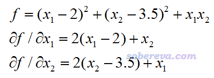

**L-BFGS-B局部极小化算法在Fortran中的使用简例**

A simple example of using L-BFGS-B local minimization algorithm in Fortran

文/Sobereva@[北京科音](http://www.keinsci.com)  2020-Mar-3

本文简要介绍一下L-BFGS-B局部极小化算法的常识，并通过实例介绍怎么在Fortran中使用这个方法解决实际问题。

## 1 相关知识

牛顿法是最重要的做多元函数局部极小化的算法之一，BFGS（Broyden–Fletcher–Goldfarb–Shanno algorithm）是准牛顿法的一种实现，通过近似方式估计Hessian矩阵的逆矩阵而避免了牛顿法那样需要对其精确计算带来的不便和耗时。L-BFGS（limited-memory BFGS）不需要像BFGS那样需要构造和记录完整的Hessian的逆矩阵，使得消耗内存量随被优化的变量数只是线性增长，因此尤为适合用于变量数甚巨的场合。L-BFGS-B（B代表bound）则进一步使L-BFGS支持了极小化过程中对变量施加约束。相关知识看<https://en.wikipedia.org/wiki/Limited-memory_BFGS>。目前BFGS或L-BFGS已经被应用得极为普遍，诸如量子化学程序里做几何优化主要就是基于BFGS的思想。

从耗时来说，牛顿法>BFGS>L-BFGS，而从优化效率来说（达到同样精度所需步数），也是牛顿法>BFGS>L-BFGS（但差距不算特别大）。

L-BFGS-B的作者直接提供了实现L-BFGS-B算法的Fortran 77的代码，见<http://users.iems.northwestern.edu/~nocedal/software.html#lbfgs>。但由于Fortran 77的限制，其子程序调用起来相当麻烦。为了使得其使用尽可能简便，我写了一个Fortran 90的界面。下面通过一个实际例子，讲解怎么具体使用L-BFGS-B对一个简单的非线性函数做极小化。

## 2 例子

L-BFGS-B源文件（.f后缀的），我写的界面（LBFGSB_module.f90）以及本文的例子代码（test_LBFGSB.f90）都可以在这里得到：<http://sobereva.com/attach/538/file.rar>。将文件包里所有文件都一起编译即可得到可执行文件。可见L-BFGS-B子程序利用了BLAS和LINPACK库的部分子程序（后者已经被LAPACK库取代）。

此例我们要对下面的二元函数做极小化，对两个变量的解析导数公式也给出了：

虽然L-BFGS-B支持设置约束条件（即各个变量上下限），但是本例我们不考虑约束条件，相当于只是做L-BFGS。

本例的代码如下，我已经写得尽可能容易理解。

!A code to illustrate the use of L-BFGS-B local minimization routine  
 !Written by Tian Lu ([sobereva@sina.com](mailto:sobereva@sina.com)), 2020-Mar-3  
 program test_LBFGSB  
 use LBFGSB_module  
 implicit real*8(a-h,o-z)  
 character*60 task  
 real*8,allocatable :: X(:),g(:)

nvar=2  
 allocate(X(nvar),g(nvar))

maxcyc=50 !Maximum cycles  
 ftol=1D-7 !Tolerance of function variation  
 gtol=1D-5 !Tolerance of absolute maximum gradient

X=0 !Initial guess  
 task="START"  
 icyc=0  
 do while(task=="START".or.task(1:2)=="FG".or.task=="NEW_X")  
     call LBFGS(X,f,g,task,ncorr=3)  
     if (task(1:2)=="FG") then !Need evaluate function value and gradient  
         icyc=icyc+1  
         if (icyc>maxcyc) exit  
         call fval(nvar,X,f)  
         call fgrad(nvar,X,g)  
           
         write(*,"(' Iteration',i10)") icyc  
         if (icyc==1) then  
             write(*,"(' Function value:',f16.10)") f  
         else  
             fvar=f-fold  
             write(*,"(' Function value:',f16.10,'    Variation:',f16.10)") f,fvar  
         end if  
         fold=f  
         gmax=maxval(g)  
         grms=dsqrt(sum(g**2))  
         write(*,"(' Maximum gradient:',f16.10,'    RMS gradient:',f16.10)") gmax,grms  
         if (icyc>1) then  
             if (abs(fvar)<ftol.and.abs(gmax)<gtol) exit  
         end if  
     else if (task=="NEW_X") then !Variables have been updated  
         write(*,*) "New variables:"  
         write(*,"(6f12.8)") X(:)  
     end if  
     write(*,*)  
 end do

if (task=="ERROR") then  
     write(*,*) "Error was encountered during L-BFGS-B running!"  
 else if (icyc==maxcyc+1) then  
     write(*,"(a,i6,a)") " L-BFGS-B iteration was unconverged after",icyc," cycles!"  
 else  
     write(*,"(/,a,i6,a)") " Convergence criterions have been satisfied after",icyc," cycles!"  
     write(*,*) "Final variable values:"  
     write(*,"(6f12.8)") X(:)  
     write(*,"(a,f16.10)") " Final function value:",f  
 end if  
 read(*,*)  
         
 end program

subroutine fval(nvar,X,f)  
 integer nvar  
 real*8 :: X(nvar),f  
 f=(X(1)-2)**2+(X(2)-3.5D0)**2+X(1)*X(2)  
 end subroutine

subroutine fgrad(nvar,X,g)  
 integer nvar  
 real*8 :: X(nvar),g(nvar)  
 g(1)=2*(X(1)-2)+X(2)  
 g(2)=2*(X(2)-3.5D0)+X(1)  
 end subroutine

运行输出如下  
Iteration         1  
 Function value:   16.2500000000  
 Maximum gradient:   -4.0000000000    RMS gradient:    8.0622577483

Iteration         2  
 Function value:    9.6185114825    Variation:   -6.6314885175  
 Maximum gradient:   -2.1394789812    RMS gradient:    5.2254408980

New variables:  
  0.49613894  0.86824314

Iteration         3  
 Function value:    4.3223858291    Variation:   -5.2961256533  
 Maximum gradient:    0.8008108585    RMS gradient:    0.9223347926

New variables:  
  1.01974264  2.76132558

Iteration         4  
 Function value:    4.0640697287    Variation:   -0.2583161005  
 Maximum gradient:    0.5716770197    RMS gradient:    0.5931409754

New variables:  
  0.76715766  3.03736169

Iteration         5  
 Function value:    3.9166672452    Variation:   -0.1474024835  
 Maximum gradient:   -0.0012552698    RMS gradient:    0.0018594564

New variables:  
  0.33283721  3.33295376

Iteration         6  
 Function value:    3.9166666667    Variation:   -0.0000005785  
 Maximum gradient:   -0.0000002118    RMS gradient:    0.0000003765

New variables:  
  0.33333330  3.33333320

Iteration         7  
 Function value:    3.9166666667    Variation:   -0.0000000000  
 Maximum gradient:    0.0000000000    RMS gradient:    0.0000000000

Convergence criterions have been satisfied after     7 cycles!  
 Final variable values:  
  0.33333333  3.33333333  
 Final function value:    3.9166666667

可见收敛非常顺利。函数变化程度、最大梯度、方均根梯度都随迭代迅速下降。得到的极小点处的两个变量值为0.33333333和3.33333333，与手算得到的解析解1/3和10/3精确吻合，故运行得非常成功。并且可见极小点处的函数值是3.9166666667。

下面解释一下这个例子代码  
开头必须写use LBFGSB_module，这样才能用我写的叫做LBFGS的子程序。这个子程序是原版L-BFGS-B代码的setulb子程序的一个wrapper，在迭代过程中不断被调用，通过接收当前位置的函数值和梯度后给出新的位置。  
fval是用户写的计算函数值的子程序。fgrad是用户写的计算函数梯度矢量的子程序。nvar是变量数目，X是传入的变量矢量。如果被极小化的函数没法算解析导数，用有限差分计算数值导数来定义fgrad也完全可以。  
本例我们将变量的初值设为了(0,0)。由于此函数就一个极小点，所以初值非常随意。  
maxcyc变量设的是迭代次数上限，每次迭代都需要计算一次函数值和梯度。ftol和gtol变量分别设定函数值变化的绝对值和最大梯度的绝对值的收敛限，由代码可见它俩同时满足时迭代就宣告收敛。  
task是运行状态字符串变量，必须是60个字符。初始状态必须是START。当LBFGS子程序返回的task是"FG"时，代表现在需要对当前的位置计算函数值和梯度并传入LBFGS；当返回值是"NEW_X"，说明这次LBFGS更新了位置矢量X。实际上，整个do循环过程中，是"FG"和"NEW_X"状态不断交替，因此每两轮循环计算一次函数值和梯度（算作一次迭代）。  
LBFGS子程序的ncorr是可选参数，它控制校正数，数值通常建议在3~10之间，取值影响收敛效率，设多大最合适视具体问题而定，可以进行实测。

如果想在极小化过程中施加约束，需要向LBFGS子程序传入记录各个变量下限和上限的Xlower和Xupper矢量，都是nvar个元素。还要传入boundstat矢量设置各变量的约束状态，含义见LBFGSB_module.f90里的注释。

对LBFGS子程序还可以设置info变量，用于控制输出信息的详细程度。此例没有设它，相当于用了默认的info=-1，此时LBFGS子程序它自己在运行过程中不会输出任何信息。可用选项见LBFGSB_module.f90里的注释。

顺带一提，之前在《无需导数的局部极小化算法NEWUOA在FORTRAN中的使用简例》（<http://sobereva.com/536>）一文中笔者也用过这个例子。NEWUOA方法的好处是不需要导数，但达到收敛所需的迭代次数高于L-BFGS-B，稳健程度也不及它。但对于没有解析导数的情况，用NEWUOA算法从实际耗时上可能更划算。
