**使用Multiwfn图形化展示分子动力学模拟体系中的孔洞、自由区域**

Using Multiwfn to graphically display pores and free regions in molecular dynamics

文/Sobereva@[北京科音](http://www.keinsci.com)

 First release: 2020-Mar-5   Last update: 2024-Sep-25

## 1 前言

最近有人问我怎么获得类似下面文献中的图

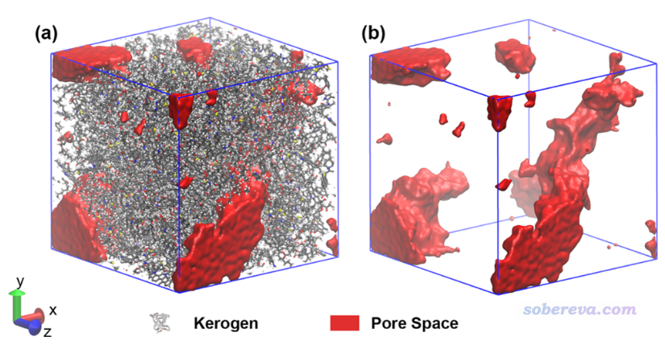

此图像展示出分子动力学模拟体系中的孔洞区域，或者叫自由区域（free region）也可以，这体现出了盒子里哪些区域没有被原子占据。

之前笔者写过《使用Multiwfn可视化分子孔洞并计算孔洞体积》（<http://sobereva.com/408>）一文，那篇文章的做法是用于展现分子体系的特定的内部孔洞的，没法像上图这样对大量体系展示盒子里所有自由区域，而且也根本算不动。为了能得到上面的图，笔者在Multiwfn中加入了相应功能，作为主功能300的子功能1出现，在此文介绍一下。此功能还可以给出自由区域的体积的具体数值便于定量分析。

Multiwfn可以在<http://sobereva.com/multiwfn>免费下载，读者务必使用2021-Sep-14及以后更新的版本。不了解Multiwfn者可参看《Multiwfn FAQ》（<http://sobereva.com/452>）和《Multiwfn入门tips》（<http://sobereva.com/167>）。本文用的VMD是1.9.3版，可在<http://www.ks.uiuc.edu/Research/vmd/>免费下载。

笔者后来还写了《使用Multiwfn计算晶体结构中自由区域的体积、图形化展现自由区域》（<http://sobereva.com/617>），是本文的重要补充，且介绍了更多作图技巧，建议读者阅读。

## 2 实例

我们先直接看一个具体计算实例，之后再说相关细节。本例用到的文件是Multiwfn文件包中的examples目录下的coal.pdb，这是位网友用Lammps程序跑动力学得到的多孔介质体系的一帧，如下所示。明显能看出有不少稀疏、空白区域。

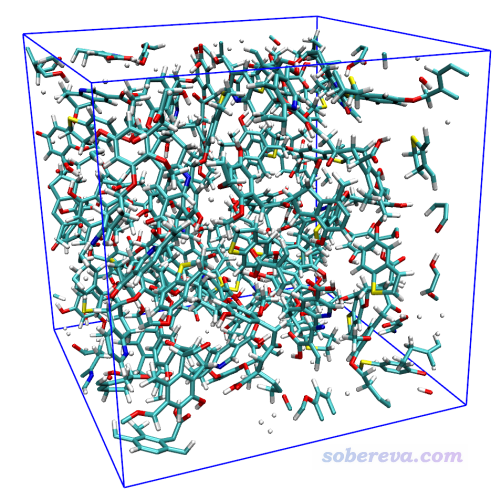

启动Multiwfn，然后输入  
examples\coal.pdb  
300  //其它功能（Part 3）  
1  //观看自由区域和计算自由区域体积  
4  //修改用于平滑边界的展宽函数  
1  //Gaussian展宽  
1.8  //用原子范德华半径的1.8倍作为Gaussian函数的半高全宽（FWHM）  
1  //设置格点并开始计算  
[按回车]  //用默认的原点位置，即(0,0,0)处，这和当前情况一致  
[按回车]  //用晶胞的三个边长作为格点数据计算范围的三个边长  
[按回车]  //用0.25埃格点间距。格点间距越小，要算的格点数就越多，耗时就越高，图像也会越平滑，因此应根据实际情况决定。当前格点间距下的图像质量已经不错了

普通8核机子花大约一分钟就能算完。算完后可以看到  
Volume of entire box:   30038.649 Angstrom^3  
Free volume:   14783.074 Angstrom^3, corresponding to   49.21 % of whole space  
这说明整个盒子总体积，即三个边长的乘积是30038.6 Angstrom^3，自由体积是14783.1 Angstrom^3，占总体积的49.21%。自由体积是这样算的：对于每个格子，如果它距离任意一个原子的距离在此原子的范德华半径以内，这个格子就被认为是占据的。所有没有占据的格子数乘上格子体积就是自由体积。

之后看到后处理菜单，选择3，就出现了图形界面，将窗口右侧的Show molecule和Show data range都选上，可看到下图

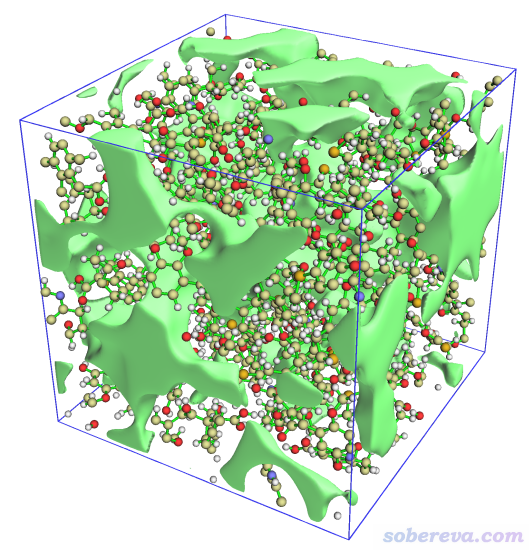

上图中的等值面直观地展现出了盒子中未被原子占据的区域。为了得到更好的图像效果，我们选择4将格点数据导出为当前目录下的free_smooth.cub文件。启动VMD后将之载入，进入Graphics - Representation，点Create Rep，把设置改为下面的样子来显示出等值面。

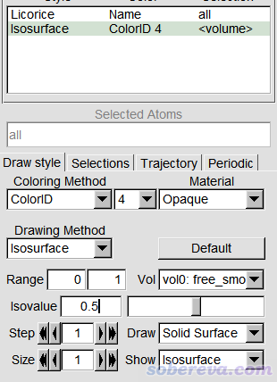

最后在控制台输入pbc box和color Display Background white显示出盒子边框并改成白背景，此时图像如下

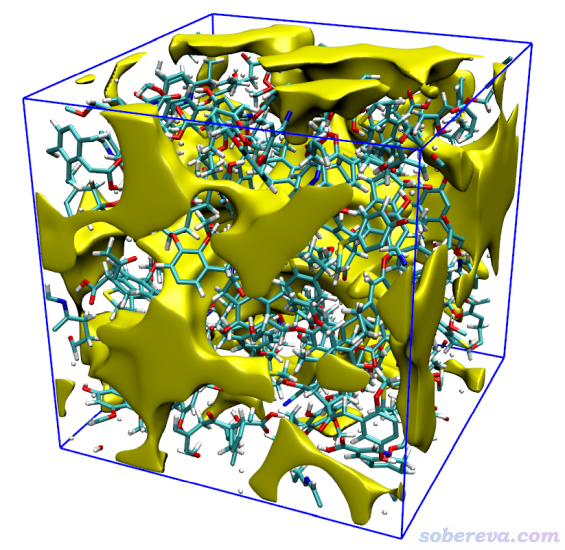

可见效果非常理想。

如果你把Isovalue设小，等值面会占更多的空间区域，如果把Isovalue设大，等值面则会收缩，且较小的等值面会消失。因此可以利用这个设置控制等值面显示的视觉效果。例如将Isovalue设为0.9后看到的图像如下，相对于上图，此时只有最显著的孔洞还可以看到，而相对次要、较小的孔洞就不显示出来了

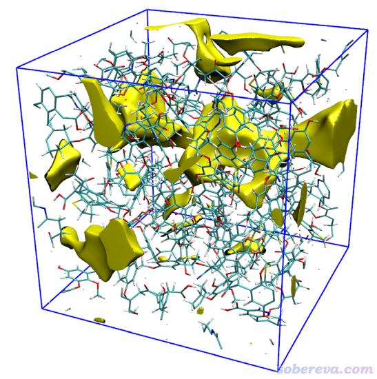

值得顺带一提的是，以上述方式得到的孔洞的等值面与VMD的VDW（范德华球叠加）方式显示的分子表面是互补的。将分子的Drawing method改为VDW后，VMD显示的图像如下所示

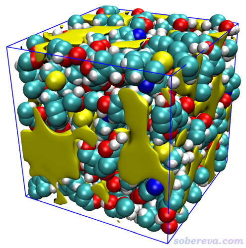

可见黄色的对应孔洞的等值面与对应分子的范德华表面紧紧贴合，二者合在一起正好充满整个盒子。故这两种显示方式有高度互补性，应根据实际被研究的体系和问题恰当使用。

## 3 相关细节说明

下面把Multiwfn上述功能涉及到的各种细节说一下。

使用当前功能可以用各种Multiwfn支持的包含晶胞/盒子信息（即记录三个晶胞矢量，或者三个边的长度+夹角）的文件作为输入文件。比如含有CRYST1字段的pdb文件、GROMACS程序的gro文件、cif文件、VASP的POSCAR、CP2K的restart文件、含有平移矢量（TV）的Gaussian输入文件，等等，完整列举见《使用Multiwfn非常便利地创建CP2K程序的输入文件》（<http://sobereva.com/587>）的相应部分。此时计算的格点数据的三个边是分别平行于晶胞的三条边的。如果你用的输入文件里没有晶胞/盒子信息，在当前功能里选择选项1设置盒子并计算时，程序也会让你手动输入盒子原点坐标、边长、格点间距，但注意此时会假定盒子的三个边是分别平行于X、Y、Z轴的（因此此时不适合非正交盒子的情况）。

在后处理菜单选择观看等值面的时候，只有晶胞/盒子的三条边是正交的情况才能正确显示。对于非正交的情况，必须导出cub文件然后用VMD才能正确显示。

在当前功能的界面里，可以看到Toggle considering periodic boundary condition选项，默认状态是Yes，即考虑周期边界条件。如果选择此选项将之状态切换为No，则计算耗时可以显著降低（约一个数量级），但构造格点数据时就不考虑原子的周期镜像了，这时候会导致误把盒子边缘的一些本来是被占据的地方显示成没有占据。下图左边是考虑周期性的，右边是没考虑周期性的，可见考虑周期性是非常重要的。

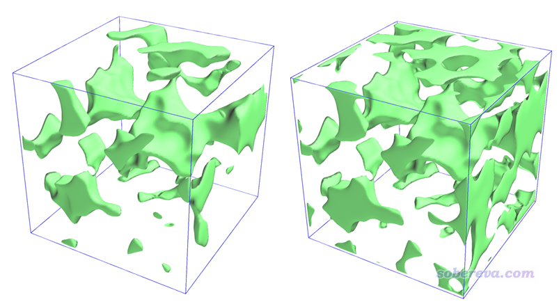

当前功能里有个选项Toggle making isosuface closed at boundary，默认状态是Yes。如果切换为No的话，等值面在盒子边缘就不是封闭的，而是镂空的，如下所示，部分镂空地方我用箭头高亮了。通常来说这样不如封闭的美观。这个设置不影响耗时。

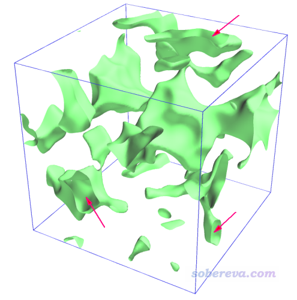

此功能效率很高，用于甚至几万原子都可以。代码做了充分的并行化，如果体系很大算起来很慢，有以下几种方法降低耗时：  
(1)用核数很多的机子算。别忘了需要将settings.ini里的nthreads设为实际的CPU的物理核数  
(2)用更大的格点间距，从而减少要计算的点数。注意对于很大体系，格点间距太小的话不仅算不动，还会由于格点数太多导致内存存不下，致使程序崩溃  
(3)不考虑周期性，前面已经说过了。这样做的话等值面的可靠性会下降，而且算出来的自由体积通常明显不准确

当前功能有个选项Toggle calculating smoothed grid data of free regions，默认状态是Yes，也就是既产生“原始（raw）格点数据”，也产生“平滑后（smoothed）的格点数据”，将之设为No不产生后者的话可以节约几分之一的时间。本文前面展示的等值面都是基于平滑后的格点数据绘制的。这里说一下两类格点数据的产生机制。原始格点数据在构造时是循环每个格点，某个点与任意一个原子的距离小于此原子的范德华半径的话，这个格点的数值就为0，否则为1，因此数值为1的格点就对应于自由区域，前面提到的自由体积也是相当于是所有数值为1的格点数的总和乘上格子体积。这种方式构造的格点数据并不适合展现孔洞区域，比如如果你在后处理菜单选择1来观看它的等值面的话，看到的是下图

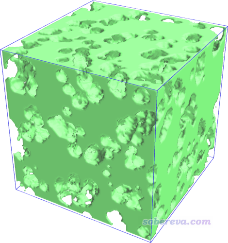

可见效果巨烂，就像是奶酪中在有原子的地方挖走半径等于范德华半径的窟窿，在当前图像中甚至连孔洞的基本模样都看不出来。相比之下，平滑后的格点数据在构造的时候优雅得多。Multiwfn支持通过三种不同的切换函数实现平滑化，即使得原子的边界不是一刀切，而是随原子径向距离增加从1平滑地变化为0。支持的切换函数包括：  
(1)Gaussian函数。变化特征依赖于FWHM，数值越大收敛越慢  
(2)误差函数。变化特征依赖于scale值，scale越大收敛越慢  
(3)Becke函数。变化特征依赖于迭代次数(n_iter)，迭代次数少收敛越慢  
你可以在当前功能里通过选项4选择用哪种函数做平滑，并且之后可以输入所用参数。这几个函数结合不同参数时的变化示意图如下所示，它们等于0.5的位置被设为了碳原子范德华半径处（3.21 Bohr）

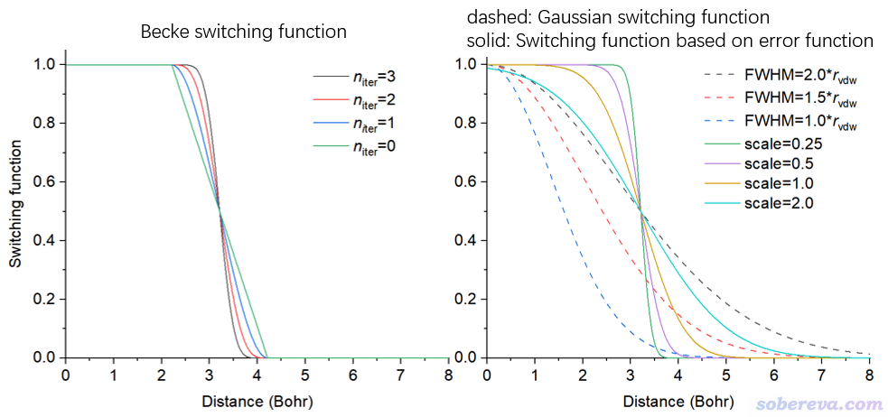

前文的例子我们用的是FWHM为1.8倍原子范德华半径时的Gaussian函数作为展宽，此时在原子范德华半径0.9倍处的切换函数恰为0.5。Multiwfn是这样计算平滑后的格点数据的：对于某个点，起初格点数据为1，令它减去所有原子在此处的切换函数值，如果最后发现为负则把数值设为0。由前面的例子可见，基于这样平滑后的格点数据显示出的等值面非常光滑，能很好地勾勒出孔洞的位置，而且还能通过调节等值面数值来决定是只观看重要孔洞还是也观看次要孔洞。如果大家对所得图像不满意，可以尝试不同展宽函数结合不同参数。

使用Gaussian函数用于平滑化对大多数情况效果不错，有一个缺点是对原子分布得很密集的体系比如C60晶胞，你会发现平滑后的格点数据处处为0。这是由于Gaussian函数收敛得比较慢，每个原子都会影响到较远的区域，即对较远处的平滑化的格点数据都有明显负贡献。故当原子很密集时，可能导致很大范围区域的格点算出来的平滑化的格点数据都为负，最后都被设为了0。解决办法就是改用误差函数或Becke函数来做展宽，Multiwfn会令原子范德华半径处正好等于这俩函数为0.5的位置，而且由于如上图所示它俩在0.5附近衰减得较快，因此可以避免上述用Gaussian函数时的问题。如果坚持用Gaussian函数来平滑化，可将FWHM设得比平时更小（比如1.2）来解决，这使得它收敛得更快。

当前功能有个选项Set scale factor of vdW radii for calculating free volume and raw free region，默认的scale factor是1.0。这个设的是构造前述的原始格点数据时给原子乘的范德华半径，因此影响基于原始格点数据看的等值面的效果，而且由于自由体积是对原始格点数据统计来得到的，因此这个半径也直接决定了计算出的自由体积。比如如果将前例的刻度因子设为1.5的话，算出来的自由体积就只有16.6%了。这个选项对平滑后的格点数据无影响，因为在它产生的过程中不考虑这个刻度因子。

作为应用例子，下面给出文献J. Am. Ceram. Soc. (2024) DOI: 10.1111/jace.20134里用本文介绍的Multiwfn的功能结合VMD作的图：

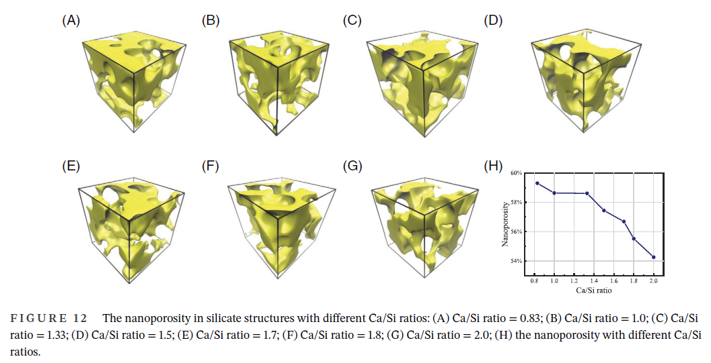
