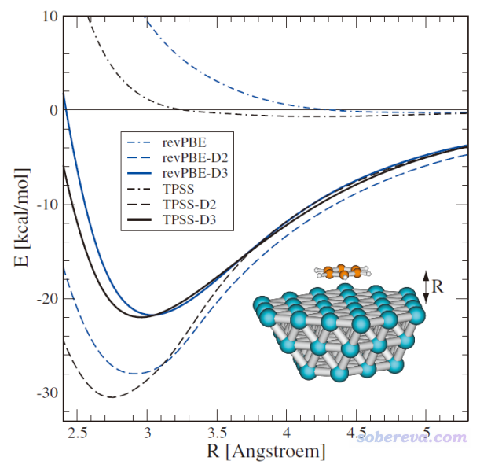
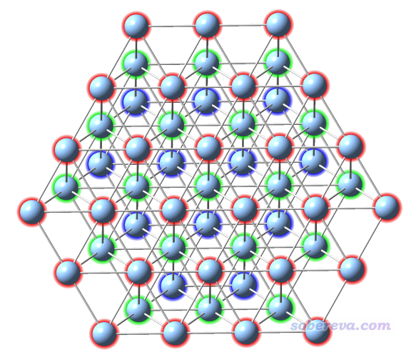
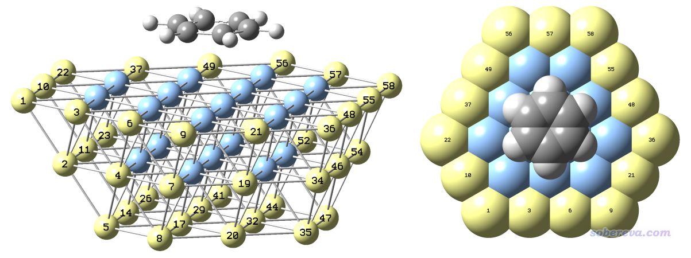
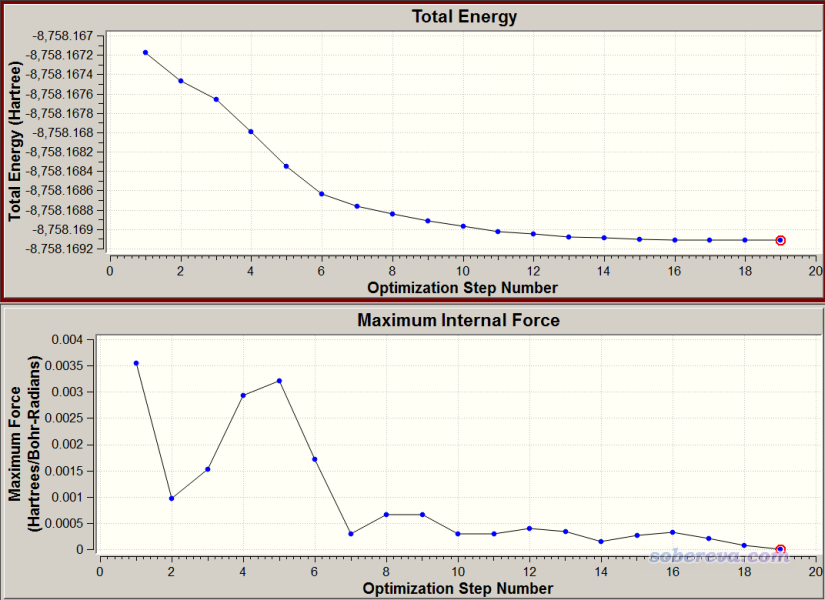
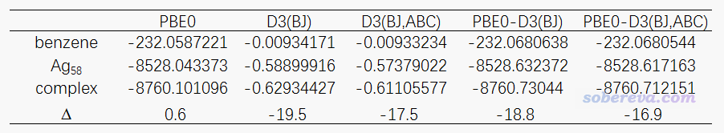
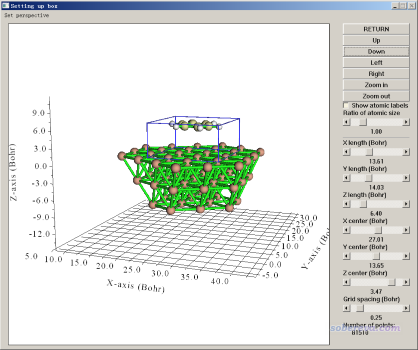
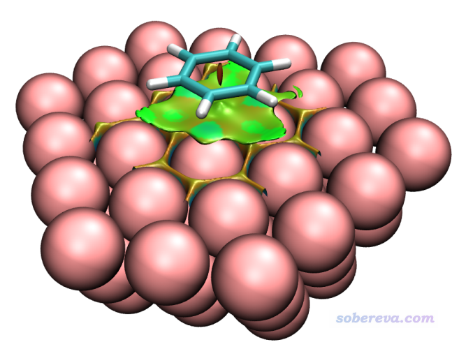
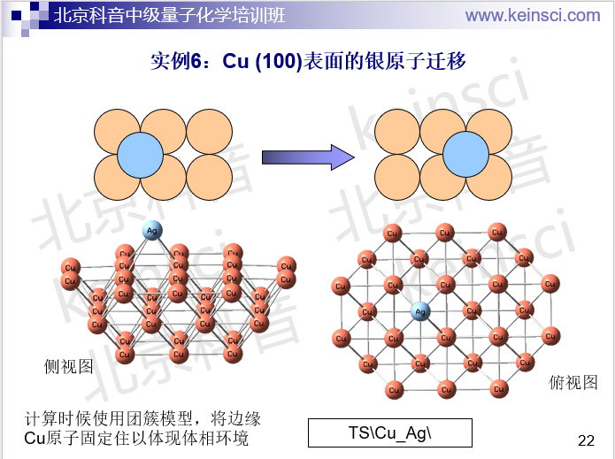

**使用量子化学程序基于簇模型计算金属表面吸附问题**

Calculation of metal surface adsorption problems based on cluster models using quantum chemistry programs

文/Sobereva@[北京科音](http://www.keinsci.com/)

 First release: 2020-Mar-8   Last update: 2020-Mar-10

**简介**：本文首先对量子化学程序基于簇模型计算表面反应或吸附问题做简单介绍，然后基于ORCA量子化学程序，简单演示如何计算苯分子在Ag(111)表面上的吸附能。本文目的是令读者认识到量子化学程序研究表面问题的可行性，并了解实际计算中需要值得注意的地方。

笔者还另有一篇博文章《18碳环（cyclo[18]carbon）与石墨烯的相互作用：基于簇模型的研究一例》（<http://sobereva.com/615>），也和本文主题密切相关，建议读者一看。

## 1 关于簇模型

一说到基于量子力学方法的固体表面反应/吸附的计算，很多人就首先想到用第一性原理程序诸如Quantum Espresso、CP2K去做，甚至以为以计算孤立体系为主的Gaussian、ORCA等量子化学程序完全不适合，实际上这是不对的。很多固体表面问题的计算都可以通过构建簇模型（cluster model）来使用量子化学程序计算。所谓簇模型就是把反应/吸附位点附近区域的原子挖出来当做孤立体系计算。

用量子化学程序通过簇模型来算和使用第一性程序通过周期性方式来算这类问题各有利弊。用簇模型的优点在于：  
• 整体来说，量子化学程序支持的理论方法远比第一性原理程序丰富得多得多，选择余地明显更大，还可以做到更高精度（如双杂化、DLPNO-CCSD(T)等）。用杂化泛函相对于纯泛函的耗时增加程度远低于基于平面波的第一性原理程序。  
• 在计算设置上更方便，也不需要考虑k点、真空层、分子与相邻镜像作用、偶极校正之类乱七八糟的事。  
• 支持的任务类型更丰富，关键词写着省事，可视化程序也多。例如Gaussian vs. VASP  
• 结合强大的Multiwfn可以做非常丰富的波函数分析，使文章的分析讨论部分明显更充实、更上档次。参考比如《Multiwfn支持的分析化学键的方法一览》（<http://sobereva.com/471>）、《Multiwfn支持的弱相互作用的分析方法概览》（<http://sobereva.com/252>）、《Multiwfn支持的电子激发分析方法一览》（<http://sobereva.com/437>）等大量文章，在《Multiwfn入门tips》（<http://sobereva.com/167>）里有所有Multiwfn做分析的博文汇总。而使用第一性原理程序的话，能做的分析少得多，不过最新的Multiwfn结合CP2K也已经能对周期性体系做诸多波函数分析，比如《使用Multiwfn做IGMH分析非常清晰直观地展现化学体系中的相互作用》（<http://sobereva.com/621>）、《使用Multiwfn结合CP2K通过NCI和IGM方法图形化考察固体和表面的弱相互作用》（<http://sobereva.com/588>）、《使用Multiwfn考察周期性体系的芳香性》（<http://sobereva.com/722>）、《使用Multiwfn对周期性体系做键级分析和NAdO分析考察成键特征》（<http://sobereva.com/719>）、《使用Multiwfn结合CP2K做周期性体系的atom-in-molecules (AIM)拓扑分析》（<http://sobereva.com/717>）、《使用Multiwfn结合CP2K对周期性体系做电荷分解分析（CDA）》（<http://sobereva.com/716>）、《使用Multiwfn对周期性体系计算Hirshfeld(-I)、CM5和MBIS原子电荷》（<http://sobereva.com/712>）、《使用Multiwfn结合CP2K计算晶体中原子的氧化态》（<http://sobereva.com/711>）

用簇模型的弊端在于：  
• 需要合理考虑边界效应。边界效应此处指的是使用有限的簇模型作为周期性体系的近似导致的对被研究问题的计算精度的影响。边界效应取决于两点：(1)簇的尺寸 (2)对边界的处理。簇的尺寸越大、让边界原子所处的环境越像体相，则边界效应越小。  
簇的大小选取有很大任意性。固体部分截的原子太少的话边界效应太强，结果不准；而截得大的话，则计算耗时太高。除非团簇截得极大，否则都要考虑怎么恰当处理边界。比如有机体系（如石墨烯），边界往往用氢饱和，见比如《18碳环（cyclo[18]carbon）与石墨烯的相互作用：基于簇模型的研究一例》（<http://sobereva.com/615>）；如果是无机晶体，有用赝氢、capped ECP、用大量背景电荷表现更长程区域原子的静电势等做法；如果是纯金属的话倒是不需要做特别的考虑。  
• 对于原子致密排布的块状固体材料（不是那种稀疏的、有孔洞的诸如MOF等，或者单层材料），用簇模型的话耗时比起用第一性原理程序当周期性算往往更高。但这点具体看用什么程序、什么基组、数值方面的设定等等，不能一概而论。  
• 用簇模型算过渡金属及其化合物的晶体经常会在SCF收敛上遇到麻烦，有时需要大量折腾。但也不是绝对解决不了，可结合《解决SCF不收敛问题的方法》（<http://sobereva.com/61>）里的说明恰当尝试。但即便SCF收敛了，也很有可能收敛到无意义的不稳定的波函数。

总的来说，用第一性原理程序做周期性计算研究表面问题是主流的做法，通过北京科音CP2K第一性原理计算培训班（<http://www.keinsci.com/KFP>）学习一遍可以非常容易地上手这类的计算（若事先不具备基本量子化学计算常识的话则应当同时参加北京科音初级量子化学培训班：<http://www.keinsci.com/KEQC>）。但簇模型计算这类问题也绝非很稀罕，相关研究文章也有不少，如《18碳环（cyclo[18]carbon）与石墨烯的相互作用：基于簇模型的研究一例》（<http://sobereva.com/615>）所介绍的研究。还有的研究将两种方式相结合，取二者长处，比如ACS Catal., 8, 3825 (2018)研究石墨烯上催化二氧化硫与氧气反应形成硫酸盐，就先用了VASP做了周期性计算优化了极小点和过渡态，再用Gausisan基于VASP优化的结构用簇模型做了单点计算，将得到的波函数用Multiwfn分析了催化反应机理以及石墨烯表面与被催化物质的弱相互作用。

## 2 簇模型计算表面问题的实际例子：苯分子在Ag(111)表面物理吸附的结合能的计算

下面就通过一个简单例子，说明如何基于簇模型计算物理吸附的结合能。

### 2.1 相关说明

本例涉及的各种文件都可以在这里下载：<http://sobereva.com/attach/540/file.rar>。

这个体系在DFT-D3原文J. Chem. Phys., 132, 154104 (2010)中被研究过，苯与银表面间距的刚性扫描图如下所示

文中也说了，实验测定的苯吸附到Ag(111)上的焓变是-13 kcal/mol。

下面我们来算苯分子在Ag(111)表面物理吸附对应的结合能。这里说的结合能是习俗上定义的，即只考虑电子能量的变化，而且片段能量用的是复合物中的结构算的。算这个问题分为以下几步  
(1)构建金属簇  
(2)把苯分子放进去得到复合物初猜结构  
(3)优化复合物  
(4)计算各个片段的单点能  
(5)求差得到结合能  
之后还可以再用Multiwfn做一些波函数分析。

严格来说，就算哪怕不计算热力学量，优化完复合物也应当做一下振动分析来看看虚频情况，如果苯分子有沿表面运动的虚频模式，应当恰当消掉，基本策略参考《Gaussian中几何优化收敛后Freq时出现NO或虚频的原因和解决方法》（<http://sobereva.com/278>）。但由于当前体系不小，做振动分析耗时很高，本文就忽略这点了。

本例使用ORCA程序，一方面是因为免费，另一方面是支持RIJCOSX，可以令这种大团簇体系在单点计算和优化时耗时降低极多，明显快过Gaussian。不过ORCA做振动分析慢，也是本文没做振动分析的原因。ORCA的基本常识看《量子化学程序ORCA的安装方法》（<http://sobereva.com/451>）和《基于ORCA量子化学程序对分子做优化、振动分析、观看红外光谱、观看轨道的简单演示》（<https://www.bilibili.com/video/av59599938>）。本文用的是ORCA 4.2.1。

### 2.2 建模

本文用的对应Ag(111)表面的团簇结构就按照上一节文献里的图来构建就行了，用什么程序随意。比如可以去ICSD找到Ag的晶体结构，用VESTA、GaussView、Avogadro之类复制延展成足够大的复晶胞，然后一点点删原子就可以得到。你也可以用某贵得离谱的有切表面功能的可视化程序先载入自带的库里的Ag原胞，用切表面的选项切出(111)表面，然后再复制延展成面积足够大、至少有三层原子厚度的表面，之后再一点点删多余的原子。为了不让边界效应太显著，对于簇模型研究表面问题，一般建议至少三层原子，而且固体团簇要比被吸附的分子明显大一圈。像上面图片里构造的Ag58团簇对于研究苯的吸附就是很得当的，不大不小。再大一圈的话耗时就忒高了，再小一圈的话边界效应就较为显著了。而且为了节约原子来降低耗时，可见上图中的团簇是上面宽下面窄，比起上下一样宽时原子数明显更少。由于苯分子竖着看起来是近乎圆形的，因此团簇的表面最好也接近圆形。显然，分子如果是长条形的，簇的表面也应当是长条形。

笔者建立好的簇如下所示，为了看得清楚每层用了不同颜色。在gview里可能默认没有把Ag-Ag之间判断为成键，导致构建簇模型的时候不好判断原子位置，可以根据《谈谈原子间是否成键的判断问题》（<http://sobereva.com/414>）文中所述自定义成键判断阈值，笔者设的是小于3埃就判断成成键。

然后用把苯分子放在金属簇的上方正中央位置。距离不要太远，要不然优化到平衡位置需要多花很多步；也不要太近，本来过渡金属团簇就是SCF难收敛的典型，如果被吸附分子放得太近导致电子结构变得更复杂的话会雪上加霜。本文把苯分子放在团簇表面上方3埃的位置。从DFT-D3原文里那张势能面扫描图来看，TPSS-D3的极小点位置也差不多就是3埃。

当前的结构不能直接就拿去优化，因为簇模型里边界的原子没有感受到真实体相环境的束缚，如果不把边界的原子进行固定就优化的话，可能导致边界的原子位置大幅改变，和真实情况明显不符。因此我们把最靠边的Ag都冻结，而中间的，即与苯分子密切接触的Ag原子不设冻结，这是为了让它们的位置自发地调整来响应相互作用造成的实际的结构变化。

下图就是笔者在GaussView里最终构建的复合物初始结构，为了看得清楚给了两个视角，黄色是被冻结的原子。在GaussView的Tools - Atom Selection界面里可以直接查询到这些被选成黄色的原子的序号，即1-11,14,17,19-23,26,29,32,34-38,41,44,46-50,52,54-58。

这个初始结构用GaussView保存出来的gjf文件是本文文件包里的Ag58_benzene_freeze.gjf。

值得一提的是，但凡若有可能，都最好让簇模型处于闭壳层状态，这样算起来比开壳层的情况快得多。对于当前的体系，苯分子是闭壳层的，Ag是奇数个电子而且靠s电子成键（成键情况比较简单），故只要Ag原子是偶数个，就可以让整个体系是闭壳层。当前Ag是58个，所以整个体系是闭壳层。如果你用的银团簇是比如Ag59或者Ag57，那么整体就是开壳层了，算起来就费劲多了。所以在设计金属团簇的时候应当注意考虑这点。

### 2.3 几何优化

下面用Multiwfn产生ORCA程序对上面的体系做限制性优化的输入文件。相关信息看《详谈Multiwfn产生ORCA量子化学程序的输入文件的功能》（<http://sobereva.com/490>）。本文用的是2020-Mar-5更新的Multiwfn，可在官网<http://sobereva.com/multiwfn>下载。启动Multiwfn，然后输入  
Ag58_benzene_freeze.gjf  //gjf文件的实际路径，Multiwfn会从中读取结构  
oi  //产生ORCA输入文件  
complex_opt.inp  //产生的文件的名字  
0  //设置任务类型  
2  //优化  
-3  //设置原子冻结  
1-11,14,17,19-23,26,29,32,34-38,41,44,46-50,52,54-58  //被冻结的原子序号  
3  //用RI-B3LYP-D3(BJ)/def2-TZVP(-f)

然后我们就在当前目录下得到了complex_opt.inp文件。把其中的B3LYP改成PBE0，把def2-TZVP(-f)改为def2-SV(P)，把CPU核数和内存分配量设为实际情况，其它内容不变。此时这个文件对应于PBE0-D3(BJ)/def2-SV(P)下进行限制性优化，是我们实际要用的。

这里解释下为什么用这个级别做优化。前面我的博文里提到过，在ORCA里开RI时，纯泛函的耗时远低于杂化泛函，而且纯泛函PBE对纯金属的描述也不错，而之所以这里非要用杂化泛函PBE0，是因为用纯泛函时SCF收敛难度比杂化泛函通常明显更大，尤其是当前这种过渡金属团簇类型的体系本来就是SCF难收敛的体系，尝试过PBE就会发现收敛情况就像噩梦，所以用了杂化泛函。之所以把原本输入文件里的B3LYP关键词给改成了PBE0，这是因为J. Chem. Phys., 127, 024103 (2007)中专门说了B3LYP算金属很烂，而量子化学领域里另一个很常用的杂化泛函PBE0则在这方面可靠得多，也有不少文章用PBE0算过Ag表面，如J. Phys. Chem. C, 117, 5075 (2013)。对于PBE0这种描述色散作用垃圾的泛函，在计算物理吸附时DFT-D校正显然是需要的，见《谈谈“计算时是否需要加DFT-D3色散校正？”》（<http://sobereva.com/413>）、《乱谈DFT-D》（<http://sobereva.com/83>），要不然结果就搞笑了。虽然目前ORCA也支持DFT-D4了，见《DFT-D4色散校正的简介与使用》（<http://sobereva.com/464>），但这里还是用D3，一方面是D3目前已经被极为广泛地使用，比D4更放心一些，另一方面是D4比D3强的地方关键在于能考虑原子带电状态对色散校正的影响，而当前体系里金属基本不带电荷，因此用D4也不会带来什么明显好处（改进较大的是离子、过渡金属配合物类型的体系）。

至于优化此体系用的基组的选择，考虑到当前体系不仅原子数多，而且绝大多数都是重原子，本来耗时就肯定比较高，再加上几何优化对基组不敏感（见《浅谈为什么优化和振动分析不需要用大基组》<http://sobereva.com/387>），所以基组用个便宜的2-zeta档次的就够了。lanl2DZ虽然便宜且也能基本满足几何优化目的，但没有标配的辅助基组，如果用autoaux关键词自动产生辅助基组的话不划算。def2-SVP是ORCA用户非常常用的中等偏小的基组，有标配的辅助基组，且对Ag是赝势基组，耗时不会很高，用于优化比较合适。由于此基组对Ag有f极化函数，它会造成耗时增加不少，而对优化来说影响不大，因此我们实际用的是def2-SV(P)，它把f极化函数给砍掉了，同时也砍掉了对氢的p极化，这对优化影响也甚微。

复合物优化任务的输入文件是本文文件包里的complex_opt.inp，在双路XEON E5-2696v3（共36核）服务器上花了10小时算完。产生的最终结构文件是本文文件包里的complex_opt.xyz。为了观看优化过程的收敛趋势，笔者用《OfakeG：使GaussView能够可视化ORCA输出文件的工具》（<http://sobereva.com/498>）里的OfakeG工具将输出文件转成了赝Gaussian输出文件，即本文文件包里的complex_opt_fake.out。用GaussView打开，收敛曲线如下所示，可见收敛还蛮顺利的

大家通过gview看结构变化也可以发现，由于复合物初始结构本来摆得就比较理想，所以优化过程中只是苯分子位置稍微调节了一下而已，整体没有明显变化，和苯接触的银原子也没怎么动。

### 2.4 单点计算

现在产生单点任务的输入文件。启动Multiwfn，载入complex_opt.xyz，然后输入  
oi  //产生ORCA输入文件  
complex_SP.inp  //产生的文件的名字  
4  //选择计算级别

如果你对结合能计算精度要求不是特别高，或者计算条件不是很好，将产生的complex_SP.inp里的B3LYP改成PBE0就可以开始算了，此时对应于PBE0-D3(BJ)/def2-TZVP级别。

不过，有常识的人都知道，精确计算弱相互作用能需要考虑BSSE问题，见《谈谈BSSE校正与Gaussian对它的处理》（<http://sobereva.com/46>）。在def2-TZVP下虽然BSSE问题已经不太大了，但对于弱相互作用能计算的影响还是不可忽视的，有四个解决办法解决BSSE问题：  
(1)做counterpoise校正。但这需要多花两倍左右时间。若想要用这种做法，参看《在ORCA中做counterpoise校正并计算分子间结合能的例子》（<http://sobereva.com/542>）。  
(2)用gCP方法以免费方式近似解决BSSE问题。gCP校正的简介见《大体系弱相互作用计算的解决之道》（<http://sobereva.com/214>）。gCP对def2-TZVP有现成的参数，在ORCA里要用这种校正就写上gCP(DFT/TZ)即可。而且gCP校正有解析梯度，完全可以用于前面的几何优化过程中，在其输入文件里写上gCP(DFT/SV(P))即可。然而，为什么我们对此例不用gCP？这是因为gCP原本只对前四周期元素拟合了参数，对于之后的元素，会用同族的第四周期元素来凑合，比如Ag的gCP参数会用Cu的参数来凑合。这种凑合的做法，对于第四周期之后元素的原子数较少（比如过渡金属配合物）的时候是可以接受的，但当前体系有一大堆Ag，其参数是影响结合能计算的重点，显然这么凑合是不靠谱的近似。  
(3)给基组加弥散函数，即改成ma-def2-TZVP，这样可有效改进弱相互作用计算精度并减小BSSE问题。但这种做法我不推荐用于当前计算，因为此时没有标配的辅助基组，用autoaux自动产生的不是特别划算。而且本来当前体系SCF就比较难收敛，而众所周知加弥散函数会导致SCF收敛难度暴增，对于当前这种原子堆得紧密的情况更是会导致线性依赖问题极度显著，所以加弥散是馊主意。  
(4)用更大的def2-QZVP基组。这个基组对于普通泛函的DFT计算而言已经基本达到了完备基组极限了。此时BSSE问题已可以忽略，而且比def2-TZVP时对电子结构描述又有少量改进，而且DFT-D3参数原本又是在def2-QZVP下搞的，因此在这个层面上显得很完美。def2-QZVP的确相当贵，但在ORCA中利用RIJCOSX技术，用这么大的基组对当前体系进行单点计算，耗时依然是完全可接受的。因此，本例使用PBE0-D3(BJ)/def2-QZVP来做单点计算。

还有需要注意的是，通常基组越大SCF越不容易收敛。笔者尝试过，在优化后的复合物结构下用def2-TZVP可以直接收敛（虽然SCF花了多达46圈），而用def2-QZVP则迭代几十次之后依然没有收敛的迹象，即便读def2-TZVP收敛的波函数当初猜也不行。经尝试，我发现把incremental Fock加速技术关闭后可以直接解决，即在输入文件里加上%scf DirectResetFreq=1 end。

（补充：如果你是用ORCA 5.0及以后版本，请忽略下面grid4 gridx4部分的说明，输入文件里也不要加上grid4 gridx4，否则会报错）  
另外，建议在关键词里加上grid4 gridx4关键词，使用比默认更好的交换相关泛函积分格点和COSX格点。之所以这样，是因为当前我们希望算的结果比较准，故提升积分格点精度有好处。而且，当前体系大量原子致密堆积，默认积分格点下的积分精度差点意思。比如在def2-TZVP下用默认格点，在SCF收敛后自动做Final grid步骤（提升积分格点精度算最终能量）的时候提示如下  
Change in XC energy                          ...    -0.003667837  
Integrated number of electrons               ...  1144.003054396  
Previous integrated no of electrons          ...  1143.933959260  
可见迭代过程用的积分格点对电子数的积分值1143.9339和整数相差不小。即便在final grid时，积分值1144.0030偏离整数仍不可忽略。反之，如果用grid4 gridx4，则输出变为  
Change in XC energy                          ...     0.001404285  
Integrated number of electrons               ...  1144.000217645  
Previous integrated no of electrons          ...  1144.003114364  
可见积分精度改进不小，明显更接近于整数。提升积分格点精度还有一个好处是对于某些体系可能令SCF收敛更容易。当前这种特征的体系结合大基组本来SCF就很难收敛，显然多花点耗时来提升SCF收敛的可能性是划算的。总之，对本文这种类型的体系在算单点的时候，都建议用grid4 gridx4，一举多得，而对耗时的增加完全可以接受，而且还可能因为达到收敛限所需步数变少而反倒令耗时更低（在def2-TZVP下确实如此，默认格点下用了46轮收敛，grid4 gridx4下用了37轮，导致后者反倒耗时比前者还低了几分钟）。

考虑到上面提到的问题，最终我们对复合物用的单点任务的输入文件的关键词部分如下  
! PBE0 D3 grid4 gridx4 def2-QZVP def2/J RIJCOSX noautostart miniprint nopop  
%scf DirectResetFreq=1 end  
计算用了40轮收敛，在2*E5-2696 v3 36核机子上花了5个小时。注意这类体系本身就是比较难收敛的，所以切勿看到跑了比如30轮左右还没收敛，而且收敛情况还有些波动就把任务给断了，一定要沉得住气。

复合物算完后，我们把complex_SP.inp复制为benene_SP.inp并把其中银原子都去掉，就成了苯分子的单点任务文件，计算之。再把complex_SP.inp复制为Ag58_SP.inp并把其中苯分子部分去掉，就成了银团簇的单点任务文件，计算之。算完的同名out文件在本文文件包里都提供了。

### 2.5 计算结合能

从单点任务输出文件中提取单点能，按照E_bind = E(Ag58_Benzene) - E(benzene) - E(Ag58)即可计算出结合能，即627.51*(-8760.730415916696+232.068063781533+8528.63  
2371853557)=-18.8 kcal/mol。

前面提到，苯吸附过程的实验焓变是-13 kcal/mol，我们算的和实验定性吻合（比DFT-D3原文里势能面扫描图体现的结果还更好）。由于这个结合能已经算是很大了（苯二聚体结合能才-2.8 kcal/mol），而且这又不是容易算的体系，能算到这种精度就已经不容易了。我们的计算结果和实验值的差异来自于几个方面：  
(1)边界效应仍不可忽略，用更大的簇可能能改进结果  
(2)PBE0-D3(BJ)理论方法的误差。可尝试其它泛函或结合其它的色散校正方式  
(3)实验数据对应焓变，本身和我们算的结合能就缺乏可比性。尤其是，形成复合物后，被吸附物被基底束缚，从而会诞生新的振动模式，这会对复合物的焓产生明显贡献（使之变得更正），忽略了这点会导致算出来的结合能偏大（即overbinding、结合能过负）  
(4)忽略了从无限远离到被吸附状态过程中的分子和金属表面结构变化对能量的影响。但由于当前的体系比较刚，这基本可以忽略  
(5)实验数据本身就有误差

有一点非常值得一提，也是绝大多数人都忽略的，也就是DFT-D3的三体校正项，这在《DFT-D色散校正的使用》（<http://sobereva.com/210>）中专门说过。平时我们用Gaussian、ORCA做计算的时候加D3校正都没考虑三体校正项，因为这项对结合能的影响通常很小。然而，对于原子数很多，尤其是当前体系这样原子还是紧密堆积的情况，三体校正项对结合能的影响可能是不容忽视的。

如上面的博文所述，ORCA里写上ABC关键词就可以在计算D3校正时也考虑三体校正项，但我们前面计算的时候没写这个。为了快速得到考虑三体校正项之后的结果，我们用Grimme独立的dftd3程序来算。把分子坐标弄成xyz格式，运行dftd3 mol.xyz -func pbe0 -bj -abc，输出的就是mol.xyz里的体系在PBE0泛函下的带三体校正项的DFT-D3(BJ)色散修正能了。下面的表格里把ORCA输出文件里的PBE0能量、dftd3给出的带和不带三体校正项(ABC)的DFT-D3(BJ)色散校正能都汇总到了一起

由上表可见，如果不考虑色散校正，结合能是正值，这是因为PBE0几乎完全不能描述色散作用（这是苯与Ag表面吸引作用的最主要来源），考虑DFT-D3(BJ)校正后才定性正确。如果再把三体校正项考虑进去，算出来的结合能-16.9 kcal/mol比不考虑三体校正项时明显更接近实验的吸附过程的焓变，改进了约2 kcal/mol。如果再考虑到把焓的热校正考虑进去还能进一步改进结果，且实验数据本来就有误差，可以认为当前计算模型的精度已经相当不错了。

我建议大家用ORCA基于簇模型计算表面问题时都带着ABC关键词。几何优化、振动分析带不带无所谓（PS：三体校正项没有解析Hessian），关键是单点任务时应当带上，反正对耗时没有增加，还有可能对结果有不可忽视的改进。

### 2.6 弱相互作用分析

顺带一提，用簇模型算完之后可以结合Multiwfn做各种各样的波函数分析。比如《使用Multiwfn图形化研究弱相互作用》（<http://sobereva.com/68>）和《使用Multiwfn做NCI分析展现分子内和分子间弱相互作用》（<https://www.bilibili.com/video/av71561024>）中介绍的NCI分析是非常流行的图形化考察弱相互作用的方法，这里我们也将之用于苯与银表面的物理吸附问题上。

是使用单点计算产生的波函数还是几何优化产生的波函数来做NCI分析？我建议用后者，因为后者是在def2-SV(P)下产生的，前者是在def2-QZVP下产生的，用后者耗时显然低得多得多，而且NCI分析对于波函数质量并不敏感，基组基本像样即可。故基于优化任务产生的gbw文件，我们就可以做分析了。如《详谈Multiwfn支持的输入文件类型、产生方法以及相互转换》（<http://sobereva.com/379>）所述，要么用orca_2mkl将gbw转成molden输入文件再载入Multiwfn，要么通过设置Multiwfn的settings.ini里的orca_2mklpath使得multiwfn能直接载入gbw文件了。对当前体系做NCI分析值得注意的一点是，为了节约时间，在设置格点时，应当让空间范围只涵盖苯与金属作用的区域，而不要把整个体系都纳入。具体来说，在NCI分析功能设置格点的步骤中应选择选项10 Set box of grid data visually using a GUI window，然后把盒子范围调整成下面这样

虽然当前体系很大，但由于盒子小，在基本能保证图像精细的0.25 Bohr格点间距下，哪怕用4核机子也能很快就算出来结果。如果想要让图像更光滑，可在上图的界面的右下角把格点间距再改小点，比如0.15 Bohr。下图是0.19 Bohr时用VMD绘制出来的结果，色彩刻度用的-0.04~0.03 a.u.

可见苯和银表面之间有大面积的绿色区域，直观展现出了苯的pi电子与银表面电子海洋的大范围色散相互作用，这有点类似于pi-pi堆积的景象（当然，银没有pi电子）。另外，在银与银之间也有等值面出现，我们不用管它，这体现的是Ag-Ag之间的作用，如果想屏蔽掉也可以，做法参看《用Multiwfn+VMD做RDG分析时的一些要点和常见问题》（<http://sobereva.com/291>）。

## 3 总结&其它

本文通过苯在Ag(111)表面吸附的一个简单例子，示例了怎么用簇模型研究表面问题，并且针对相关知识、涉及到的一些细节和要点做了讨论，希望读者举一反三。本文的情况其实还算比较简单的，不牵扯对边界进行特殊处理的问题。

像当前这种不易SCF收敛的体系，可能光是在优化阶段一开始就已经出现SCF不收敛了（这和复合物初始结构也有关。比如把苯放到距离银表面2.7埃的距离，SCF就比3.0埃的时候难收敛，因为其更偏离平衡距离）。这种情况可以适度降低SCF收敛限。ORCA对优化默认用tightSCF收敛限比较严，如果发现SCF差一点就能收敛，但死活就是达不到收敛限，不妨用scfconv7关键词，即把SCF收敛阈值设成单点任务默认阈值与tightSCF之间，这样优化出来的结果一般也足够精确。如果scfconv7都收敛不了，但是用scfconv6能收敛，在优化完了之后建议再用默认的tightSCF进一步优化确保结构准确。如果是初始结构太离谱导致SCF难收敛，自己又不知道大概怎么摆合适，用xtb程序做个预优化也可以，相关信息见《将Gaussian与Grimme的xtb程序联用搜索过渡态、产生IRC、做振动分析》（<http://sobereva.com/421>）。

对于单元素团簇类型体系，SCF收敛难度通常是：稀土>d族>ds族>主族。本文的Ag团簇的情况虽然已经不是很容易SCF收敛了，但还不是真正难搞的。诸如Fe团簇等，收敛难度远高于Ag团簇，而且还有较高可能性出现波函数不稳定等情况，如果是初学者没经验的话不建议轻易去用簇模型做这些金属的表面问题的计算。

值得一提的是，当前体系是C3v对称性的。如果你用Gaussian来算的话，且在计算之前用gview对称化为C3v，计算会快非常多，收敛也会比较容易。

笔者讲授的北京科音中级量子化学培训班（<http://www.keinsci.com/workshop/KBQC_content.html>）里的过渡态搜索部分有个实例也是基于簇模型的，如下，大家作为练习可以自行做一下。除了要冻结边缘原子外，搜索过渡态和走IRC的过程和普通分子体系无异。

簇模型不仅限于研究表面问题。比如计算酶催化反应，整个蛋白酶动辄几千原子，直接用量子化学算算不动，此时可以把反应位点区域挖出来，即保留底物以及周围一圈跟它发生反应或者有显著弱相互作用的残基的侧链和alpha碳，并且把alpha碳冻结并加氢饱和。这种研究方法可以参看这篇综述：J. Am. Chem. Soc., 139, 6780 (2017)。笔者在北京科音高级量子化学培训班里会讲这种计算的具体细节。虽然也有很多人拿ONIOM(QM:MM)算这种问题，但补力场参数相当麻烦，好多任务和分析都做不了、容易出现乱七八糟问题，非常折腾，从结果上看一般也不比用簇模型有多大好处，所以没有特殊情况的话我很不建议用ONIOM(QM:MM)。笔者专门有一篇文章说这事：《要善用簇模型，不要盲目用ONIOM算蛋白质-小分子相互作用问题》（<http://sobereva.com/597>）。
