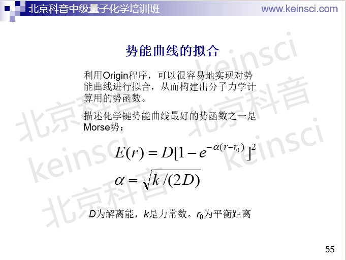
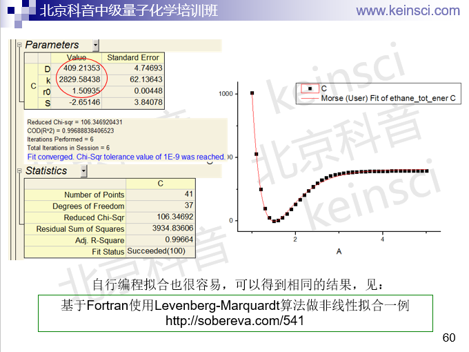

**基于Fortran使用Levenberg-Marquardt算法做非线性拟合**

Using Levenberg-Marquardt algorithm for nonlinear fitting based on Fortran

文/Sobereva@[北京科音](http://www.keinsci.com)

First release: 2020-Mar-13     Last update: 2025-Apr-26

## 1 前言

非线性拟合在计算化学研究中用得非常多，比如自己用复杂函数拟合力场参数就需要用到。Fortran是科学计算领域用的最多的语言之一，本文就通过一个例子，讲解如何通过Fortran非常容易地实现非线性拟合。

## 2 非线性拟合方法

做非线性拟合有很多种方法，比如可以用各种常规的非线性优化算法来实现，即通过不断调整拟合系数来最小化误差函数，误差函数定义为所有拟合点上实际与拟合出的数据差值的平方和。可以用的这类算法很多，比如《L-BFGS-B局部极小化算法在Fortran中的使用简例》（<http://sobereva.com/538>）和《无需导数的局部极小化算法NEWUOA在FORTRAN中的使用简例》（<http://sobereva.com/536>）中介绍的方法。而用得最多，且拟合效率最高、效果最好的是Levenberg-Marquardt算法，具体细节大家看<https://en.wikipedia.org/wiki/Levenberg%E2%80%93Marquardt_algorithm>，这里就不多说了。大家只要知道这几点就行了：  
• 这是个迭代求解的算法  
• 拟合出的结果依赖于初猜参数  
• 此算法需要导数信息

Levenberg-Marquardt算法的代码没必要自己写，因为有很多现成的库可以用。其中MINPACK（<https://people.sc.fsu.edu/~jburkardt/f_src/minpack/minpack.html>）是一个Fortran 90语言的专门做最小二乘极小化的库，其中就有子程序来实现Levenberg-Marquardt算法，另外它还能使用Powell方法求解非线性方程组。下面的例子我们就基于这个库来实现拟合。

## 3 例子的背景知识

本文的例子是用Morse势对乙烷碳碳键断裂的柔性扫描曲线进行拟合。做扫描的方法参看《详谈使用Gaussian做势能面扫描》（<http://sobereva.com/474>）。用Gaussian做过扫描后，再用GaussView查看扫描曲线，在上面点右键就可以看到选项把扫描的点导出为.txt文件。

实际上这个拟合例子是笔者讲的北京科音中级量子化学班（<http://www.keinsci.com/workshop/KBQC_content.html>）中的，课上是讲怎么用流行的Origin程序通过图形界面操作来实现拟合，而这里我们改为使用Fortran程序来等价地实现。实际上Origin用的也正是Levenberg-Marquardt算法。

Morse势的表达式在以下幻灯片里面给出了

下面是通过Origin拟合出来的结果。之后我们要将我们自己写的代码拟合出来的结果和图中的对照

## 4 例子的代码和解读

乙烷碳碳键断裂的柔性扫描的曲线的数据、本例的Fortran源代码文件，以及笔者修改后的MINPACK库的源文件都可以在这里下载：<http://sobereva.com/attach/541/file.rar>。编译很简单，把两个.f90文件放在一起即可编译。

启动后，程序会读取当前目录下的ethane_dissoc.txt文件，然后开始用Morse势来拟合，之后输出结果和拟合误差统计信息。

例子的完整代码如下：

!A code to illustrate how to use Levenberg-Marquardt method to fit  
!Written by Tian Lu ([sobereva@sina.com](mailto:sobereva@sina.com)), last update: 2023-Jun-19  
      
module fitting_module  
integer,parameter :: maxdata=1000  
real*8 x(maxdata),value(maxdata)  
end module  
      
program LMfit  
use fitting_module  
implicit real*8 (a-h,o-z)  
integer,parameter :: nparm=4  
real*8 parm(nparm) !D,k,r0,S  
real*8 fiterr(maxdata),fitval(maxdata)  
character c80tmp*80  
external calcfiterr

open(10,file="ethane_dissoc.txt",status="old")  
ndata=0  
do while(.true.)  
    read(10,"(a)",iostat=ierror) c80tmp  
    if (c80tmp==" ".or.ierror/=0) exit  
    ndata=ndata+1  
    read(c80tmp,*) x(ndata),value(ndata)  
end do  
close(10)  
write(*,"(i6,' data have been loaded')") ndata  
value=(value-minval(value))*2625.5D0

tol=1D-7  
maxcall=5000  
parm(1)=300  
parm(2)=2000  
parm(3)=1.5D0  
parm(4)=0  
write(*,*) "Fitting via Levenberg-Marquardt algorithm..."  
call lmdif1(calcfiterr,ndata,nparm,parm(:),fiterr(1:ndata),tol,maxcall,info)

if (info==1.or.info==2.or.info==3) then  
    write(*,*) "Fitting has successfully finished!"  
else if (info==5) then  
    write(*,"(a,i7)") " Warning: Convergence tolerance has not met while the maximum number of function calls has reached",maxcall  
else if (info==6.or.info==7) then  
    write(*,*) "Error: Tolerance is too small, unable to reach the tolerance!"  
end if

write(*,"(' Fitting result:',/,'  D=',f10.4,'  k=',f10.4,'  r0=',f10.4,'  S=',f10.4)") parm(:)  
write(*,"(' RMSE:',f12.4)") dsqrt(sum(fiterr(1:ndata)**2)/ndata)  
call calcfitval(ndata,nparm,parm,fitval(1:ndata))  
pearsoncoeff=covarray(value(1:ndata),fitval(1:ndata))/stddevarray(value(1:ndata))/stddevarray(fitval(1:ndata))  
write(*,"(2(a,f12.6),/)") " Pearson correlation coefficient r:",pearsoncoeff,"  r^2:",pearsoncoeff**2

do idata=1,ndata  
    write(*,"(' r=',f8.4,'  Inputted=',f10.3,'  Fitted=',f10.3,'  Error=',f10.3)") x(idata),value(idata),fitval(idata),fitval(idata)-value(idata)  
end do  
write(*,*)  
write(*,*) "Press ENTER button to exit"  
read(*,*)

contains

real*8 function stddevarray(array)  
real*8 array(:),avg  
avg=sum(array)/size(array)  
stddevarray=dsqrt(sum((array-avg)**2)/size(array))  
end function

real*8 function covarray(array1,array2)  
real*8 array1(:),array2(:),avg1,avg2  
avg1=sum(array1)/size(array1)  
avg2=sum(array2)/size(array2)  
covarray=sum((array1-avg1)*(array2-avg2))/size(array1)  
end function

end program

!------ The routine calculates fitting error  
subroutine calcfiterr(ndata,nparm,parm,fiterr,iflag)  
use fitting_module  
integer ndata,nparm,iflag  
real*8 :: parm(nparm),fiterr(ndata),fitval(ndata)  
call calcfitval(ndata,nparm,parm,fitval)  
fiterr(:)=abs(fitval(:)-value(1:ndata))  
end subroutine

!------ The routine calculates fitted function at given points  
subroutine calcfitval(ndata,nparm,parm,fitval)  
use fitting_module  
implicit real*8 (a-h,o-z)  
integer ndata,nparm  
real*8 :: parm(nparm),fitval(ndata),k  
D=parm(1)  
k=parm(2)  
r0=parm(3)  
S=parm(4)  
do idata=1,ndata  
    alpha=dsqrt(k/(2*D))  
    fitval(idata)=D*(1-exp(-alpha*(x(idata)-r0)))**2+S  
end do  
end subroutine

 

这个代码内容很容易理解。整个代码的核心是这一句：  
call lmdif1(calcfiterr,ndata,nparm,parm(:),fiterr(1:ndata),tol,maxcall,info)  
每个参数的含义如下：  
lmdif1：MINPACK库的做Levenberg-Marquardt算法拟合的子程序  
calcfiterr：自写的计算各个拟合点位置的误差的子程序  
ndata：数据点的数目  
nparm：被拟合的参数数目  
parm：被拟合的参数的数组。此数组的四个元素对应Morse势当中的D,k,r0,S。其中S参数是用于对Morse势进行上下移动的。本来Morse势是没有S这一项的，之所以弄这么一项是因为当前的扫描数据中并没有一个点恰好落在势能曲线真正的精确谷底位置（这需要优化来得到），所以拟合时应当允许被拟合的曲线整体上下移动，否则扫出来的势能曲线的能量最低的那个拟合点就会误成为Morse势谷底位置  
fiterr：达到拟合收敛时的calcfiterr返回的误差数组  
tol：收敛限，数值越小拟合精度越高，但耗时越高，越容易达不到收敛限  
maxcall：最多可以调用calcfiterr子程序的次数，如果超过了maxcall还没收敛，拟合就算失败了。前面说过这个算法需要导数信息，具体来说是需要Jacobian矩阵（见<https://en.wikipedia.org/wiki/Jacobian_matrix_and_determinant>）。当前例子我们是让MINPACK库自动通过有限差分来计算Jacobian矩阵，因此就省得写计算解析的Jacobian矩阵的代码了。也因此，调用calcfiterr的次数并非等于Levenberg-Marquardt算法的迭代次数。maxcall不要设太小，免得达到此值时迭代还没收敛；但也不要太大，免得白费了大量时间计算结果最后也没收敛（往往是迭代过程中参数出现了震荡等问题）  
info：运行状态信息，在MINPACK包的lmdif1子程序开头的注释中有详细说明

被lmdif1所调用的子程序，即calcfiterr，包含的5个参数是固定的，必须有这个5个，而且数据类型必须和例子中的一致。ndata是数据点的数目，返回的fiterr是各个拟合点的真实值和拟合值之间的误差，iflag不用管。可见calcfiterr子程序调用了calcfitval子程序计算基于当前参数和Morse势的公式得到的各个点的拟合值，然后与真实值求了差值，lmdif1子程序就是根据这个误差数组来优化参数的。由于传入calcfiterr的信息里没有拟合点信息，所以拟合点信息是通过fitting_module这个module来传递进来的。

本例的程序首先从当前目录下的ethane_dissoc.txt中读取所有数据点的位置到x数组、读取数据值到value数组。此文件里是以a.u.为单位的电子能量，我们先转换为以kJ/mol为单位，并且为了不让转换后数量级太大，给调整成以数值最低的拟合点为0点的情况。之后对拟合的运行参数进行设置，初始化拟合参数。在拟合之后，根据返回的info，输出拟合情况。接下来把拟合出的四个参数值输出出来，其中的S不用管，以后使用这个Morse势时只考虑D、k、r0便够了。之后给出误差统计信息，RMSE即Root mean square error，数值越小拟合精度越好。calcfitval子程序计算各个拟合点的拟合值，用于之后计算真实值与拟合值的Pearson相关系数以及r^2。stddevarray函数是对传进来的数组计算标准偏差，covarray函数是对传进来的两个数组计算协方差。

执行后输出信息如下

    41 data have been loaded  
 Fitting via Levenberg-Marquardt algorithm...  
 Fitting has successfully finished!  
 Fitting result:  
  D=  409.2492  k= 2830.1767  r0=    1.5093  S=   -2.6847  
 RMSE:      9.7965  
 Pearson correlation coefficient r:    0.998443  r^2:    0.996888

 r=  1.0000  Inputted=  1011.870  Fitted=  1016.567  Error=     4.697  
 r=  1.1000  Inputted=   529.142  Fitted=   529.802  Error=     0.660  
 r=  1.2000  Inputted=   250.526  Fitted=   244.665  Error=    -5.861  
 r=  1.3000  Inputted=    98.450  Fitted=    89.974  Error=    -8.476  
 r=  1.4000  Inputted=    24.984  Fitted=    18.107  Error=    -6.876  
 r=  1.5000  Inputted=     0.000  Fitted=    -2.560  Error=    -2.560  
 r=  1.6000  Inputted=     4.375  Fitted=     7.171  Error=     2.796  
 r=  1.7000  Inputted=    25.963  Fitted=    33.789  Error=     7.826  
 r=  1.8000  Inputted=    57.081  Fitted=    68.672  Error=    11.591  
 r=  1.9000  Inputted=    92.888  Fitted=   106.447  Error=    13.559  
 r=  2.0000  Inputted=   130.356  Fitted=   143.887  Error=    13.531  
 r=  2.1000  Inputted=   167.625  Fitted=   179.163  Error=    11.538  
 r=  2.2000  Inputted=   203.599  Fitted=   211.340  Error=     7.741  
 r=  2.3000  Inputted=   237.685  Fitted=   240.048  Error=     2.363  
 r=  2.4000  Inputted=   269.599  Fitted=   265.257  Error=    -4.342  
 r=  2.5000  Inputted=   299.236  Fitted=   287.134  Error=   -12.102  
 r=  2.6000  Inputted=   324.266  Fitted=   305.952  Error=   -18.314  
 r=  2.7000  Inputted=   342.488  Fitted=   322.026  Error=   -20.462  
 r=  2.8000  Inputted=   355.783  Fitted=   335.683  Error=   -20.100  
 r=  2.9000  Inputted=   365.529  Fitted=   347.236  Error=   -18.293  
 r=  3.0000  Inputted=   372.714  Fitted=   356.976  Error=   -15.738  
 r=  3.1000  Inputted=   378.049  Fitted=   365.165  Error=   -12.884  
 r=  3.2000  Inputted=   382.043  Fitted=   372.034  Error=   -10.008  
 r=  3.3000  Inputted=   385.058  Fitted=   377.786  Error=    -7.272  
 r=  3.4000  Inputted=   387.355  Fitted=   382.596  Error=    -4.760  
 r=  3.5000  Inputted=   389.115  Fitted=   386.612  Error=    -2.503  
 r=  3.6000  Inputted=   390.465  Fitted=   389.962  Error=    -0.502  
 r=  3.7000  Inputted=   391.508  Fitted=   392.755  Error=     1.247  
 r=  3.8000  Inputted=   392.332  Fitted=   395.082  Error=     2.750  
 r=  3.9000  Inputted=   392.993  Fitted=   397.019  Error=     4.026  
 r=  4.0000  Inputted=   393.524  Fitted=   398.631  Error=     5.107  
 r=  4.1000  Inputted=   393.955  Fitted=   399.971  Error=     6.016  
 r=  4.2000  Inputted=   394.320  Fitted=   401.086  Error=     6.767  
 r=  4.3000  Inputted=   394.638  Fitted=   402.013  Error=     7.375  
 r=  4.4000  Inputted=   394.915  Fitted=   402.784  Error=     7.869  
 r=  4.5000  Inputted=   395.149  Fitted=   403.424  Error=     8.275  
 r=  4.6000  Inputted=   395.348  Fitted=   403.956  Error=     8.608  
 r=  4.7000  Inputted=   395.522  Fitted=   404.398  Error=     8.876  
 r=  4.8000  Inputted=   395.668  Fitted=   404.765  Error=     9.098  
 r=  4.9000  Inputted=   395.784  Fitted=   405.070  Error=     9.286  
 r=  5.0000  Inputted=   395.873  Fitted=   405.324  Error=     9.450 

可见拟合出的Morse势参数和前面ppt中用Origin拟合出来的结果非常接近。r^2非常接近于1，而且所有点的相对误差都不大，故拟合得相当成功。我们算出来的r^2也和Origin给的相一致。

笔者开发的波函数分析程序Multiwfn（<http://sobereva.com/multiwfn>）的主功能300的子功能2专门用来将球对称化的原子径向密度拟合成多个Slater type orbital (STO)或多个Gaussian type function (GTF)的线性组合，其中就用到了本文的方法，但考虑的细节多得多得多，拟合的质量相当高。可以看Multiwfn手册3.300.2节的详细介绍以及4.300.2节的拟合例子，对代码实现感兴趣者可以看Multiwfn源代码中的fitatmdens子程序。
