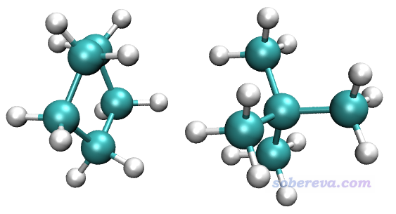
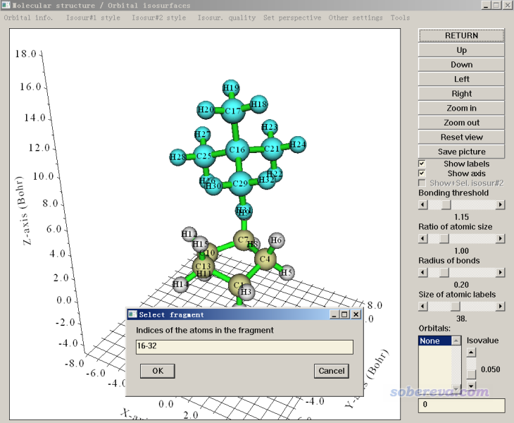
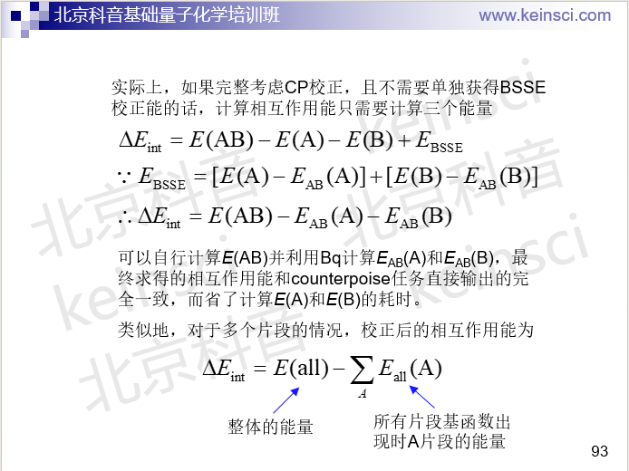

**在ORCA中做counterpoise校正并计算分子间结合能的例子**

Example of performing counterpoise correction and calculation of intermolecular binding energy in ORCA

文/Sobereva@[北京科音](http://www.keinsci.com)

First release: 2020-Mar-13  Last update: 2024-Dec-31

在《谈谈BSSE校正与Gaussian对它的处理》（<http://sobereva.com/46>）一文中介绍过BSSE问题与counterpoise校正。Counterpoise校正在高精度弱相互作用计算时通常需要考虑。Gaussian有现成的counterpoise关键词，因此做counterpoise校正很简单。但是ORCA程序（至少对于撰文时最新的4.2.1版来说）没有提供现成的counterpoise关键词，只能通过定义鬼原子的方式手工实现，因此实现起来稍微麻烦。不熟悉ORCA者看<http://sobereva.com>右侧ORCA分类里我写过的大量相关文章，在北京科音高级量子化学培训班（<http://www.keinsci.com/KAQC>）里有非常详细的ORCA使用全套讲解。

之前在《详谈Multiwfn产生ORCA量子化学程序的输入文件的功能》（<http://sobereva.com/490>）中笔者专门介绍了Multiwfn产生ORCA量子化学程序的输入文件的功能。为了使得用ORCA做counterpoise任务更方便，笔者2020-Mar-13给Multiwfn的这个功能增加了相应选项，在这里通过一个实例简单演示一下。最新版Multiwfn可以在<http://sobereva.com/multiwfn>免费下载，相关知识见《Multiwfn FAQ》（<http://sobereva.com/452>）。

注意按照下文例子算出来的实际上是复合物结构中单体间相互作用能。而一般意义的结合能在计算时是要考虑单体形成复合物过程中形变造成的能量改变（变形能）。由于下面的例子里单体是刚性的，变形能可以忽略不计，因此下文仍称作结合能。强烈建议读者阅读《谈谈分子间结合能的构成以及分解分析思想》（<http://sobereva.com/733>）搞清楚逻辑关系。

本文用的示例体系是下图这个体系，我们要在DLPNO-CCSD(T)/aug-cc-pVTZ下计算其结合能，并考虑counterpoise校正。

此体系的xyz格式的结构文件，后文中涉及的输入输出文件以及要用的shell脚本都可以在这里下载：<http://sobereva.com/attach/542/file.rar>。并不是必须得用xyz格式，只要是Multiwfn支持的含有结构信息的格式（如pdb、mol2...）都可以作为输入文件，见《详谈Multiwfn支持的输入文件类型、产生方法以及相互转换》（<http://sobereva.com/379>）。

启动Multiwfn，输入dimer.xyz的路径载入之。如果你还不知道两个单体的原子序号范围，可以进入Multiwfn的主功能0来查询。进入主功能0后，选择Tools - Select fragment，输入其中一个片段中的任意一个原子的序号比如16，整个片段就被高亮，而且序号也显示出来了，如下所示。

如此这般，把两个片段序号范围都拷出来备用，然后点Return退出主功能0，之后依次输入以下内容：  
oi  //产生ORCA的输入文件  
[按回车] //输出文件与输入文件同名但用inp作为后缀  
0  //选择任务类型  
7  //考虑counterpoise校正的结合能  
1-15  //片段1的序号  
16-32  //片段2的序号  
-2  //加弥散函数  
8  //用DLPNO-CCSD(T) with NormalPNO

在当前目录下马上就有了dimer.inp，内容如下

%pal nprocs   4 end

! DLPNO-CCSD(T) normalPNO RIJK aug-cc-pVTZ aug-cc-pVTZ/JK aug-cc-pVTZ/C tightSCF noautostart miniprint nopop  
%maxcore 1000  
* xyz   0   1  
C      0.79991408   -1.02205164    0.68773696  
H      0.85355588   -1.12205101   -0.39801435  
H      1.49140210   -1.74416936    1.11972040  
C      1.11688700    0.42495279    1.09966205  
H      1.83814230    0.89014504    0.43045256  
H      1.55556959    0.43982464    2.09708356  
C     -0.24455916    1.16568959    1.10297714  
H     -0.25807760    2.00086313    0.40532333  
H     -0.44880450    1.57699582    2.09098447  
C     -1.29871418    0.10381191    0.73930899  
H     -1.47356078    0.10524338   -0.33800545  
H     -2.25673428    0.27804118    1.22715843  
C     -0.64687993   -1.22006836    1.13630660  
H     -1.12443918   -2.08762702    0.68299327  
H     -0.68601864   -1.34528332    2.22022006  
C      0.04984615    0.09420760    5.61627735  
C     -0.04649805   -0.05787837    7.13191782  
H      0.94604832   -0.07334458    7.58427505  
H     -0.60542282    0.77000613    7.57035274  
H     -0.55366275   -0.98654445    7.39726741  
C      0.76389939    1.40111272    5.28065247  
H      0.84541894    1.53461185    4.20097059  
H      0.22042700    2.25580115    5.68615385  
H      1.77150393    1.41176313    5.69888547  
C     -1.35516567    0.11403225    5.01895782  
H     -1.31823408    0.23122219    3.93510886  
H     -1.93746520    0.94145581    5.42730374  
H     -1.88506873   -0.81375459    5.24028712  
C      0.83774596   -1.07927730    5.03893917  
H      0.34252564   -2.02626804    5.25918232  
H      0.93258913   -0.99209454    3.95580439  
H      1.84246405   -1.11668194    5.46268763  
 *

$new_job  
! DLPNO-CCSD(T) normalPNO RIJK aug-cc-pVTZ aug-cc-pVTZ/JK aug-cc-pVTZ/C tightSCF noautostart miniprint nopop Pmodel  
%maxcore 1000  
* xyz   0   1  
C      0.79991408   -1.02205164    0.68773696  
H      0.85355588   -1.12205101   -0.39801435  
H      1.49140210   -1.74416936    1.11972040  
C      1.11688700    0.42495279    1.09966205  
H      1.83814230    0.89014504    0.43045256  
H      1.55556959    0.43982464    2.09708356  
C     -0.24455916    1.16568959    1.10297714  
H     -0.25807760    2.00086313    0.40532333  
H     -0.44880450    1.57699582    2.09098447  
C     -1.29871418    0.10381191    0.73930899  
H     -1.47356078    0.10524338   -0.33800545  
H     -2.25673428    0.27804118    1.22715843  
C     -0.64687993   -1.22006836    1.13630660  
H     -1.12443918   -2.08762702    0.68299327  
H     -0.68601864   -1.34528332    2.22022006  
C:     0.04984615    0.09420760    5.61627735  
C:    -0.04649805   -0.05787837    7.13191782  
H:     0.94604832   -0.07334458    7.58427505  
H:    -0.60542282    0.77000613    7.57035274  
H:    -0.55366275   -0.98654445    7.39726741  
C:     0.76389939    1.40111272    5.28065247  
H:     0.84541894    1.53461185    4.20097059  
H:     0.22042700    2.25580115    5.68615385  
H:     1.77150393    1.41176313    5.69888547  
C:    -1.35516567    0.11403225    5.01895782  
H:    -1.31823408    0.23122219    3.93510886  
H:    -1.93746520    0.94145581    5.42730374  
H:    -1.88506873   -0.81375459    5.24028712  
C:     0.83774596   -1.07927730    5.03893917  
H:     0.34252564   -2.02626804    5.25918232  
H:     0.93258913   -0.99209454    3.95580439  
H:     1.84246405   -1.11668194    5.46268763  
 *

$new_job  
! DLPNO-CCSD(T) normalPNO RIJK aug-cc-pVTZ aug-cc-pVTZ/JK aug-cc-pVTZ/C tightSCF noautostart miniprint nopop Pmodel  
%maxcore 1000  
* xyz   0   1  
C:     0.79991408   -1.02205164    0.68773696  
H:     0.85355588   -1.12205101   -0.39801435  
H:     1.49140210   -1.74416936    1.11972040  
C:     1.11688700    0.42495279    1.09966205  
H:     1.83814230    0.89014504    0.43045256  
H:     1.55556959    0.43982464    2.09708356  
C:    -0.24455916    1.16568959    1.10297714  
H:    -0.25807760    2.00086313    0.40532333  
H:    -0.44880450    1.57699582    2.09098447  
C:    -1.29871418    0.10381191    0.73930899  
H:    -1.47356078    0.10524338   -0.33800545  
H:    -2.25673428    0.27804118    1.22715843  
C:    -0.64687993   -1.22006836    1.13630660  
H:    -1.12443918   -2.08762702    0.68299327  
H:    -0.68601864   -1.34528332    2.22022006  
C      0.04984615    0.09420760    5.61627735  
C     -0.04649805   -0.05787837    7.13191782  
H      0.94604832   -0.07334458    7.58427505  
H     -0.60542282    0.77000613    7.57035274  
H     -0.55366275   -0.98654445    7.39726741  
C      0.76389939    1.40111272    5.28065247  
H      0.84541894    1.53461185    4.20097059  
H      0.22042700    2.25580115    5.68615385  
H      1.77150393    1.41176313    5.69888547  
C     -1.35516567    0.11403225    5.01895782  
H     -1.31823408    0.23122219    3.93510886  
H     -1.93746520    0.94145581    5.42730374  
H     -1.88506873   -0.81375459    5.24028712  
C      0.83774596   -1.07927730    5.03893917  
H      0.34252564   -2.02626804    5.25918232  
H      0.93258913   -0.99209454    3.95580439  
H      1.84246405   -1.11668194    5.46268763  
 *

这个输入文件包含了DLPNO-CCSD(T)/aug-cc-pVTZ with normalPNO级别下的三个单点任务。第一个子任务是对二聚体做计算，输出的能量我们叫E_AB；第二个子任务是对第1个片段在二聚体基组下做计算，输出的能量我们叫E_A(AB)；第三个子任务是对第2个片段在二聚体基组下做计算，输出的能量我们叫E_B(AB)。原子名后面带冒号的说明这个原子是鬼原子。计算前别忘了把maxcore和nproc都设为恰当情况。其中nproc只要在开头定义一次就够了。

在笔者的2*Intel E5-2696v3（36核）机子上，通过36核并行，每个核给6000MB内存，花了41分钟跑完。在输出文件中搜索FINAL SINGLE POINT ENERGY，总共会搜索到三个：  
FINAL SINGLE POINT ENERGY      -393.613585294163  
FINAL SINGLE POINT ENERGY      -196.197449643018  
FINAL SINGLE POINT ENERGY      -197.412738820804  
依次为E_AB、E_A(AB)、E_B(AB)。然后按照计算E_AB - E_A(AB) - E_B(AB)就得到考虑counterpoise校正的结合能了。如果不理解这点，看我的培训班（<http://www.keinsci.com/workshop/KBQC_content.html>）里的一页ppt

对于当前例子，counterpoise校正的结合能因此为627.51*(-393.613585294163+196.197449643018+197.412738820804)= -2.13 kcal/mol。

本文的这个体系其实是著名的S66弱相互作用测试集里的，用的结构也是其补充材料里的结构。在S66文中通过CCSD(T)/CBS计算出来的结果是-2.40 kcal/mol，可见本文的结果和金标准符合得非常好。

为了让结合能计算更省事，我还专门写了个脚本，是本文文件包里的getEbind.sh。此脚本在运行后会处理当前目录下的所有out文件，自动提取整体和两个片段的能量，并求差给出不同单位的结合能。例如当前目录下有三个.out文件，都是上文的方法用Multiwfn产生的任务的输出文件，getEbind.sh输出的信息如下，可见提取结合能非常方便。

H2O_ext.out  
Etot = -761.79953946  E1 = -685.35948656  E2 = -76.43844639 Hartree  
-0.0016065 Hartree  
    -1.008 kcal/mol  
    -4.218 kJ/mol

H2O_int.out  
Etot = -761.80467188  E1 = -685.35943188  E2 = -76.43928426 Hartree  
-0.0059557 Hartree  
    -3.737 kcal/mol  
   -15.637 kJ/mol

H2.out  
Etot = -686.52275741  E1 = -685.35832899  E2 = -1.16228297 Hartree  
-0.0021455 Hartree  
    -1.346 kcal/mol  
    -5.633 kJ/mol

**2022-Jan-9补充**

从2022-Jan-9更新的Multiwfn开始，在产生ORCA输入文件的界面里选择任务类型时可以选择-7，用法同前。此时产生的ORCA输入文件会计算5个能量，依次为：整体的能量、整体基函数下片段1的能量、整体基函数下片段2的能量、片段1的能量、片段2的能量。执行本文文件包里的ORCA_CP.sh就可以对当前目录下所有这种任务的输出文件进行处理，此脚本对每个文件会输出这些信息：(1)5个能量的具体数值 (2)原始的相互作用能 (3)BSSE校正后的相互作用能 (4)BSSE校正能 (5)BSSE校正后的整体的能量。这种任务所做的计算、脚本给出的信息，和Gaussian程序的counterpoise关键词完全相同。

本文文件包里的waterdimer.out是一个例子文件，ORCA_CP.sh对它进行处理的输出如下：

File: waterdimer.out  
 E(AB) = -152.054002577 Hartree  
 E(A)_AB = -76.022655799    E(A) = -76.022397044 Hartree  
 E(B)_AB = -76.024059371    E(B) = -76.022540157 Hartree  
 Raw interaction energy:  
-0.0090654 Hartree  
    -5.689 kcal/mol  
   -23.801 kJ/mol  
 BSSE corrected interaction energy:  
-0.0072874 Hartree  
    -4.573 kcal/mol  
   -19.133 kJ/mol  
 BSSE correction energy:  
 0.0017780 Hartree  
     1.116 kcal/mol  
     4.668 kJ/mol  
 BSSE corrected complex energy:  
-152.0522246 Hartree
