**使用Multiwfn通过单位球面表示法图形化考察（超）极化率张量**

Using Multiwfn to graphically study (hyper)polarizability tensor by unit sphere representation

文/Sobereva@[北京科音](http://www.keinsci.com)

First release: 2020-Apr-10  Last update: 2023-Aug-11

## 1 前言

如果读者对（超）极化率的概念还不怎么了解的话，建议先看看《使用Multiwfn分析Gaussian的极化率、超极化率的输出》（<http://sobereva.com/231>）中的相关知识。平时在研究分子的（超）极化率的时候，关注的通常只是总大小，以及X、Y、Z方向的总分量，而对于（超）极化率张量的各个具体分量，尤其是非对角元，则通常探究得不多，而非对角元所体现出的（超）极化率的各向异性其实也是很值得探究的。在J. Comput. Chem., 32, 1128 (2011)一文中作者提出了单位球面表示法（Unit Sphere Representation）来可视化第一超极化率张量(beta)，这可以很直观地全面考察beta张量的特征，特别是能将其各向异性展现出来。

使用Multiwfn结合VMD绘制单位球面表示法的图像若用于发表文章，**请务必记得在文中引用Multiwfn启动时提示的程序原文**。

## 2 原理

在具体介绍单位球面表示法之前先回顾一下beta的定义，看下式：

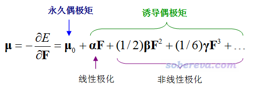

对于均匀外电场来说，静态的beta的ABC分量的物理意义体现的是从B、C方向同时射入单位强度的电场的耦合作用导致分子偶极矩在A方向上发生变化的一半。如果外场是电磁场，其对应的变化的电场会导致分子的电子密度分布震荡而发出电磁波，描述分子的这种响应特征是通过动态的beta。比如beta(-(w1+w2);w1,w2)的ABC分量体现的是频率分别为w1、w2且变化方向分别是B、C的电场，导致分子的偶极矩在A方向上以w1+w2频率发生震荡的程度，也正比于由此发出的w1+w2频率的电磁波的强度。若w1=w2，这对应的是二次谐波生成(SHG)过程。

为了能一目了然地表现向分子的什么方向施加的两个电场的耦合作用会导致分子的偶极矩在什么方向以何种程度发生变化，单位球面表示法定义了βeff矢量，如下所示。

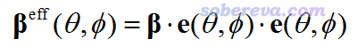

其中e(θ,φ)是从原点朝向球极坐标的(θ,φ)方向的单位矢量。beta既可以是静态的也可以是动态的，原文里只将此方法用在了对应SHG的beta的情况，并且把βeff称为“有效SHG偶极”或“有效非线性偶极”。为了避免含糊，笔者下面给出βeff的i分量的具体的计算表达式

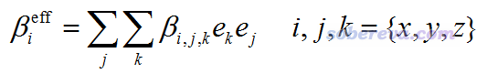

结合前面给出的偶极矩和beta的关系式可知，基于beta(-2w;w,w)计算的βeff(θ,φ)矢量，体现出的是在(θ,φ)方向上的两个变化频率皆为w的电场共同作用所导致的偶极矩以2w频率震荡的方向和大小。

对一个特定半径的球面上每个点都计算βeff矢量，根据矢量方向和大小绘制出箭头并着色（箭头起点设在球面相应位置），得到的就是所谓的单位球面表示法对应的图像了。

在Multiwfn程序解析Gaussian的polar任务的输出文件时还会给出beta_X、beta_Y、beta_Z，表达式如下：

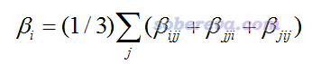

这在单位球面表示法的文章里叫做“矢量表示”（Vector Representation），可以通过绘制一个箭头来图形化展现它。由其表达式可见，这种表示相当于把不同方向施加电场的耦合效果做了平均化，因此忽略掉了各向异性，比如beta_X中包含了beta_XXX、beta_XYY、beta_XZZ等，体现了不同方向的外加电场的耦合作用导致X方向偶极矩的平均变化程度。诸如其中的beta_XXX相当于两个外电场方向与诱导偶极矩方向是共线的情况，beta_XYY或beta_XZZ相当于是垂直的情况，等等。

类似地，笔者将单位球面法推广到极化率和第二超极化率：

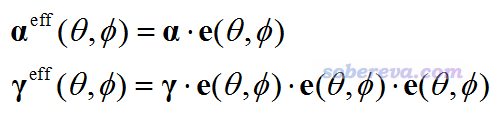

例如基于w频率的极化率（alpha）计算的αeff(θ,φ)矢量体现的是在(θ,φ)方向施加的变化频率为w的电场所引起的分子偶极矩以w频率变化的方向和大小。而γeff(θ,φ)体现的则是(θ,φ)方向的三个电场的耦合所导致的分子偶极矩变化情况。

## 3 Multiwfn做单位球面表示法分析的功能

上述方法已经被笔者实现在了Multiwfn程序中（必须是2020-Apr-10及以后更新的版本才有），程序可以在主页<http://sobereva.com/multiwfn>免费下载，不了解Multiwfn者建议参看《Multiwfn FAQ》（<http://sobereva.com/452>）和《Multiwfn入门tips》（<http://sobereva.com/167>）。此程序可以将单位球面表示法用于极化率、第一/第二超极化率，对第一超极化率还可以用矢量表示法。

使用当前功能应当在Multiwfn启动时载入一个能给Multiwfn提供结构信息的文件（因为Multiwfn要判断分子半径来确定箭头的绘制位置），可以用pdb、gjf、xyz等各种格式，见《详谈Multiwfn支持的输入文件类型、产生方法以及相互转换》（<http://sobereva.com/379>）。Multiwfn做本文介绍的分析时需要从.txt文件中读取（超）极化率，可以让Multiwfn解析Gaussian的polar任务的输出文件来产生，也可以自行提供。此文件里需要记录所有张量的分量，内容是自由格式，单位是a.u.，张量元的记录顺序如下（用Fortran的隐do循环便于表示）  
极化率：((alpha(i,j),j=1,3),i=1,3)  
第一超极化率：(((beta(i,j,k),k=1,3),j=1,3),i=1,3)  
第二超极化率：((((gamma(i,j,k,l),l=1,3),k=1,3),j=1,3),i=1,3)  
其中越靠内的序号越优先循环。比如极化率张量的记录顺序是(1,1),(1,2),(1,3),(2,1),(2,2)...(3,3)。

Multiwfn的这个功能会产生可视化程序VMD的作图脚本，在VMD里执行脚本即可得到瞬间得到图像。VMD可以在此处免费下载：<http://www.ks.uiuc.edu/Research/vmd/>。

下面就通过实例演示怎么通过Multiwfn+VMD对实际体系得到单位球面和矢量表示法的图像。Gaussian用的是G16 A.03版。

## 4 可视化第一超极化率的例子：CH3NHCHO

本例我们对单位球面表示法原文里考察的CH3NHCHO体系进行绘制，这个体系相当于蛋白质的肽键部分区域。用的计算级别和原文完全一样，即优化的级别是B3LYP/6-311++G**（加弥散纯属多余），算（超）极化率的级别是HF/6-311++G**（显然这个级别算的beta是很垃圾的，这里用这个的目的仅仅是为了试图重复原文里的图而已）。即便用相同的级别，也不要指望我们的结果能和原文精确相同，因为作者用的GAMESS-US里的B3LYP和Gaussian里的并不完全相同（VWN泛函的版本有异），而且积分格点等数值层面上也有各种细节的不同。

首先，我们对此体系做polar任务计算alpha和beta，外场频率用450 nm和1030 nm，和原文一致。输入文件如下，结构是在B3LYP/6-311++G**下已经优化好的。为了让Multiwfn能解析输出文件里的信息，#P是必须写的。由于原文考察的是SHG的情况，所以这里写了=DCSHG。

#P HF/6-311++g(d,p) polar=DCSHG CPHF=rdfreq  
[空行]  
B3LYP/6-311++G** opted  
[空行]  
0 1  
 C                 -1.42185400    0.48434600    0.00000000  
 H                 -1.99137900    1.41345100    0.00000000  
 H                 -1.68745700   -0.09936700    0.88452400  
 H                 -1.68745700   -0.09936700   -0.88452400  
 N                  0.00000000    0.80427900    0.00000000  
 C                  0.95655400   -0.15841500    0.00000000  
 H                  0.29333200    1.76830000    0.00000000  
 O                  0.73560300   -1.35373200    0.00000000  
 H                  1.97993900    0.26130100    0.00000000  
[空行]  
450nm 1030nm

计算的输出文件已经提供为Multiwfn文件包里的examples\polar\CH3NHCHO\polar.out。

我们先用Multiwfn把对应1030 nm的SHG形式的beta提取出来成为.txt文件。启动Multiwfn然后输入  
examples\polar\CH3NHCHO\polar.out  
24  //（超）极化率分析  
1  //解析Gaussian的polar任务的输出  
-1  //要求程序解析含频的（超）极化率  
-4  //要求程序解析后把（超）极化率导出成当前目录下的.txt文件  
1  //开始解析。并且当前对应的是有三阶解析导数的情况，如KS-DFT  
2  //如提示所示，2号对应的是1030 nm的情况  
2  //解析Beta(-2w;w,w)形式  
n  //程序问你是否做《使用Multiwfn计算与超瑞利散射(HRS)实验相关的量》（<http://sobereva.com/499>）文中介绍的分析，这里跳过

现在极化率张量和第一超极化率张量已经分别被导出为了当前目录下的alpha.txt和beta.txt，感兴趣的话可以打开看看。现在可以退出Multiwfn。

前面说了，用Multiwfn做本文的分析时应当在一开始载入一个能给Multiwfn提供分子结构信息的格式，实际上也可以直接让Multiwfn从Gaussian的输出文件中读取分子结构。为此，修改Multiwfn目录下的settings.ini里的iloadGaugeom为1，然后启动Multiwfn，依次输入  
examples\polar\CH3NHCHO\polar.out  
24  //（超）极化率  
5  //用单位球面和矢量表示法可视化（超）极化率

现在在屏幕上可以看到很多选项用来设置，包括球面上箭头的半径、比例因子（数值越小箭头越短）、是否给这些箭头着色、圆球的半径（默认是根据分子直径自动调节）、球面上箭头的数目。还可以设置矢量表示法的箭头的半径和比例因子。这些大家可以尝试自行调节以达到更满意的效果，本例就直接用默认值。

现在选择选项2，从屏幕上的提示可见由于程序发现当前目录下有beta.txt，因此就直接从中读取beta张量了，如果没有这个文件的话程序会让你输入含有beta张量的文本文件的路径。从屏幕上还看到球面上实际箭头有566个，并且在当前目录下输出了beta.tcl和beta_vec.tcl，这俩都是VMD的作图脚本，执行前者会绘制单位球面表示法的图像，执行后者会绘制矢量表示法的图像。屏幕上还看到beta_X、beta_Y、beta_Z的值，它们乘上比例因子就相当于矢量表示法的箭头的长度。

为了能在VMD中把分子结构也绘制出来便于考察，我们让Multiwfn导出pdb文件。接着输入以下命令  
0  //退出当前功能  
0  //返回到主菜单  
100  //其它功能（Part 1）  
2  //导出文件  
1  //导出pdb文件  
CH3NHCHO.pdb  
现在当前目录下就有了CH3NHCHO.pdb，可以把Multiwfn关了。

把当前目录下的beta.tcl和beta_vec.tcl都移动到VMD目录下，启动VMD，然后在文本窗口输入source beta.tcl命令运行beta.tcl脚本，此时单位球面表示法的图就显示出来了，再输入source beta_vec.tcl，矢量表示法的箭头也绘制出来了。最后，把CH3NHCHO.pdb拖到VMD的VMD Main窗口里载入，然后选Graphics - Representation，把Drawing method设为CPK，此时图像如下：

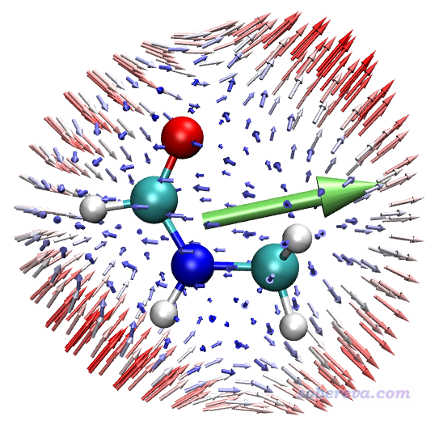

此图和球面表示法原文J. Comput. Chem., 32, 1128 (2011)里的图2(e)几乎完全一样，而且比原文的效果更好，因为原文中的箭头分布并不均匀。图中箭头的颜色按照蓝-白-红变化，箭头越短越蓝，越长越红，箭头实际长度对应于的βeff(θ,φ)矢量的模乘上自设的比例因子。

给出这种图的时候建议同时给出不同角度，以便看得全面，下图是另一个角度的。为了把分子另一侧的箭头淡化以避免扰乱视觉，笔者开了雾化效果，关于这点参见《VMD初始化文件(vmd.rc)我的推荐设置》（<http://sobereva.com/545>）。

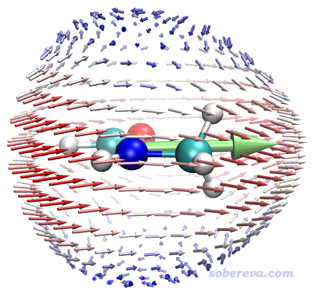

从本例的图能看出什么？下面把3个特征位置标注了出来予以说明

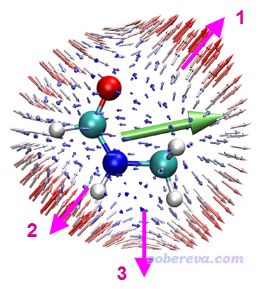

图中1号位置体现的是，当施加的两个频率为w的电磁场的电场变化方向是顺着粉色箭头时，其耦合作用会导致在相同方向产生强度显著的变化频率为2w的诱导偶极矩，由于电场和诱导偶极矩方向相同，因此这个方向没有各向异性。2号位置体现的是沿着粉色箭头方向变化的两个外电场的耦合作用所产生的诱导偶极矩方向是与之相反方向的。3号位置体现的是两个按照粉色箭头变化的外电场的耦合作用产生的诱导偶极矩方向是朝右的，和外电场变化方向正好呈90度角，这就体现出显著各向异性了，如果不作这种图很难了解这一点。注意，这种图的箭头的起点的绝对位置和原子的绝对坐标毫无关系，因为球的半径是我们随意设的（程序默认的是比分子大一圈）。上图标注的粉色箭头都是从内朝外按球面的法矢量方向画的，即对应球面相应位置的e(θ,φ)方向，分析球面上其它位置的箭头特征的时候也需要这么分析。

上图中的绿色箭头体现了(beta_X,beta_Y,beta_Z)矢量方向，亦即体现出了分子beta的整体取向。可见绿色箭头的方向和球面上所有箭头的总趋势（矢量和）相同，都是朝右。显然，这种矢量表示法所展现的信息远没有球面表示法那么丰富，细节无法体现。

原文里还有其它一些体系的球面表示法的例子，感兴趣的读者可以看看。原文做这种分析用的是matlab程序结合paraview可视化，远不如本文介绍的做法方便，而且作者还没把程序公开。

## 5 可视化极化率的例子：18碳环

对于18碳环这个电子结构十分特殊的新颖体系，笔者做了很系统的研究，所有已发表的文章汇总见<http://sobereva.com/carbon_ring.html>。其中也包括对极化率、第二超极化率的研究，已发表于Chem. Asian J., 16, 56 (2021) DOI: 10.1002/asia.202100589，介绍见《全面揭示各种尺寸的碳单环体系的独特的光学性质》（<http://sobereva.com/608>）。下面以此体系为例，将单位球面表示法应用于静态的alpha和gamma，看看这种分析对这种情况能有什么实际价值。本例的输入文件如下，就是上面提到的我的论文里用的原始输入文件，此任务将计算静态的alpha、beta、gamma。

#p wb97xd/gen polar=gamma  
[空行]  
wb97xd/def-TZVP opted  
[空行]  
0 1  
 C                  0.61036100    3.64174700    0.00000000  
 C                 -0.61036100    3.64174700    0.00000000  
 C                 -1.87330600    3.18207300    0.00000000  
 C                 -2.80843400    2.39740800    0.00000000  
 C                 -3.48043300    1.23347100    0.00000000  
 C                 -3.69240900    0.03129400    0.00000000  
 C                 -3.45902600   -1.29228500    0.00000000  
 C                 -2.84866500   -2.34946200    0.00000000  
 C                 -1.81910300   -3.21336700    0.00000000  
 C                 -0.67199900   -3.63087900    0.00000000  
 C                  0.67199900   -3.63087900    0.00000000  
 C                  1.81910300   -3.21336700    0.00000000  
 C                  2.84866500   -2.34946200    0.00000000  
 C                  3.45902600   -1.29228500    0.00000000  
 C                  3.69240900    0.03129400    0.00000000  
 C                  3.48043300    1.23347100    0.00000000  
 C                  2.80843400    2.39740800    0.00000000  
 C                  1.87330600    3.18207300    0.00000000  
[空行]  
0.0  
[空行]  
@/sob/LPol-ds.gbs/N

其中坐标后面的0.0代表只考虑静态的情况（外场为零频）。本例用的LPol-ds是能够高精度表现（超）极化率的基组，不是Gaussian内置的，所以通过外部文件读取，可以在这里获取：《各种Sadlej基组的Gaussian格式的定义》（<http://sobereva.com/345>）。

启动Multiwfn，然后输入  
examples\polar\C18\gamma.out  //上面输入文件的输出文件  
24  //（超）极化率分析  
1  //解析Gaussian的polar任务的输出  
-4  //要求程序解析后把（超）极化率导出成当前目录下的.txt文件  
7  //解析polar=gamma的任务  
此时当前目录就有了alpha.txt和gamma.txt。接着输入：  
0  //退出当前功能  
0  //返回主菜单  
24  //（超）极化率  
5  //用单位球面和矢量表示法可视化（超）极化率  
-3  //修改圆球上箭头的比例因子  
0.005  //这比默认的比例因子小很多，因为C18的极化率很大。这个值需要反复尝试直到令作出的图的箭头长度比较合适  
-5  //修改矢量表示法箭头的比例因子  
0.01  
1  //对极化率进行分析，将会从当前目录下的alpha.txt中载入极化率张量

现在当前目录下就有了alpha.tcl和alpha_vec.tcl，将之挪到VMD目录下，然后运行source alpha.tcl，再运行source alpha_vec.tcl。之后和前例一样通过主功能100的子功能2导出当前体系的pdb文件，并把其载入VMD并显示。此时图像如下（适当用了雾化）

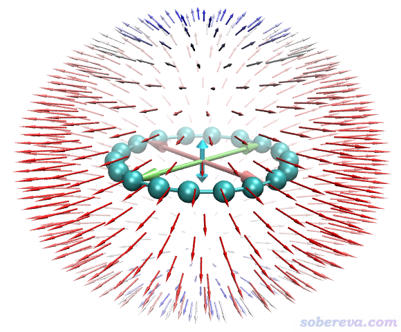

这个图中分布于球面的小箭头体现由分子中心向四面八方都施加同样强度的外电场时导致的分子的偶极矩的变化。由图可以清晰地看出18碳环在垂直于环平面方向的极化率较小，而在平行于分子的方向极化率很大。这很容易理解，因为18碳环分子平面上有非常丰富、高度离域的pi电子（in-plane和out-plane两类pi电子共36个），故平行于体系加外电场必然能高度极化pi电子分布，从而产生显著的诱导偶极矩。从Multiwfn的主功能24的子功能1解析的数据的时候可见alpha_ZZ（垂直于环平面方向）为97.7 a.u.，而alpha_XX和alpha_YY（平行于环平面方向）高达392 a.u.。

上图中央的三个双向大箭头的长度展现的是X、Y、Z方向极化率的总大小（alpha_X、alpha_Y、alpha_Z），分别由下面的公式计算。大箭头的长度使读者便于清晰地对比这三个方向的极化率的大小。注意这种极化率的矢量表示法和之前看到的beta的矢量表示法明显不一样，前者只体现每个轴向的大小，不体现方向性（从球面上的箭头也可见极化率的情况是以中心对称分布的）。

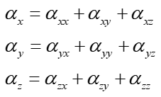

接下来再用单位球面表示法考察一下C18的gamma。在主功能300的子功能3里输入  
-3  //修改圆球上箭头的比例因子  
1E-5  //比默认的值小得多，这是因为gamma的数量级很大  
-5  //修改矢量表示法箭头的比例因子  
0.00005  
3  //对第二超极化率进行分析，将会从当前目录下的gamma.txt中载入极化率张量   
现在当前目录下就有了gamma.tcl和gamma_vec.tcl，在VMD里执行这俩脚本，图像如下

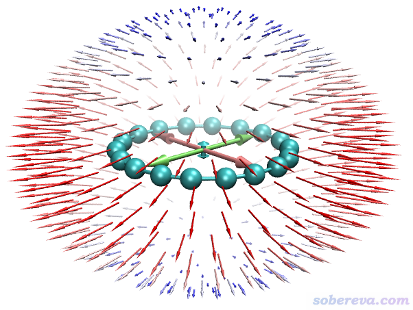

由球面上的箭头可见gamma的特征和alpha类似，都是顺着分子平面的方向大，垂直于分子平面的方向小。此图中，球面上的箭头体现的是由内向外以球面法向量方向施加3个电场的耦合作用导致体系偶极矩的变化矢量。

上图中平行于三个笛卡尔轴的双向大箭头对应的是gamma的矢量表示法，其长度直观体现在X、Y、Z三个方向的gamma的总大小（gamma_X、gamma_Y、gamma_Z），计算方式如下

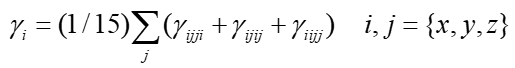

对18碳环我们不分析beta，因为这种中心对称体系的beta精确为0。

## 6 总结

本文介绍了一种在研究（超）极化率问题中非常实用的单位球面表示法，并结合实例介绍了怎么通过Multiwfn和VMD程序非常容易地实现这种分析并且得到效果酷炫的图像。这个方法几乎在任何体系的（超）极化率研究中都可以使用，在文章里给出这样的图像明显能给文章增光添彩，令分析更深入，因此非常推荐大家使用。

以下笔者发表的文章都利用了本文的做法分析了（超）极化率，是单位球面表示法的很好的应用例子，**十分推荐仔细阅读并作为范例进行引用**：  
• 前面提到的Chem. Asian J., 16, 56 (2021)  
• 《理论设计由18碳环与锂原子构成的电场可控的光学开关》（<http://sobereva.com/630>）中介绍的笔者的Carbon, 187, 78 (2022)  
• 《深入揭示18碳环的重要衍生物C18-(CO)n的电子结构和光学特性》（<http://sobereva.com/640>）中介绍的Chem. Eur. J., 28, e202103815 (2022)  
• 《从18碳环的硼氮取代物中理论筛选出具有优异光学性质的分子：一篇CEJ研究文章介绍》（<http://sobereva.com/742>）中介绍的Chem. Eng. J., 515, 163236 (2025)  
• 《理论设计基于18碳环的donor-π-acceptor型非线型光学材料：探究18碳环作为新的pi-linker的潜力》（<http://sobereva.com/751>）中介绍的Phys. Chem. Chem. Phys., 27, 11993 (2025)  
• 《深入探究18碳环与碱金属离子复合物的结构、相互作用与光学性质》（<http://sobereva.com/745>）中介绍的ChemPhysChem, 26, e202500009 (2025)

有一个很值得注意的地方在这里提醒一下。Multiwfn解析Gaussian的polar关键词给出的alpha、beta都是解析的标准朝向下的，对于gamma则是解析输入朝向下的（因为Gaussian没输出标准朝向下的）。如果不懂什么叫输入朝向和标准朝向，看《谈谈Gaussian中的对称性与nosymm关键词的使用》（<http://sobereva.com/297>）中的相关说明。载入到VMD里的分子的结构应当和分析的（超）极化率的朝向一致，否则会造成误判。前面的例子没有区分这点，是因为这些例子中做polar任务的gjf文件中的坐标取自几何优化任务输出文件中的标准朝向下的结果，因此坐标本身就已经是在标准朝向下了，换句话说这些polar任务在做的时候输入朝向和标准朝向是等同的。Multiwfn的iloadGaugeom=1时从Gaussian输出文件中优先载入输入朝向的结构（找不到的时候才会载入标准朝向的，此时屏幕上会有提示），而iloadGaugeom=2时则载入标准朝向的。GaussView打开输出文件时载入的总是标准朝向的。
