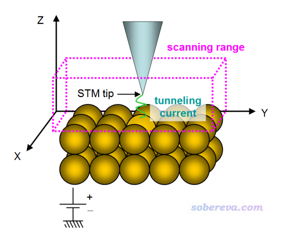
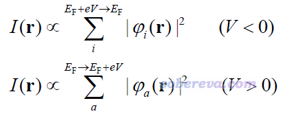
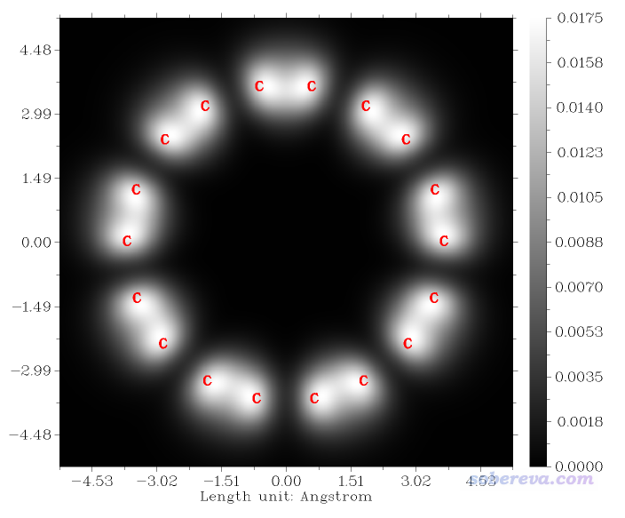
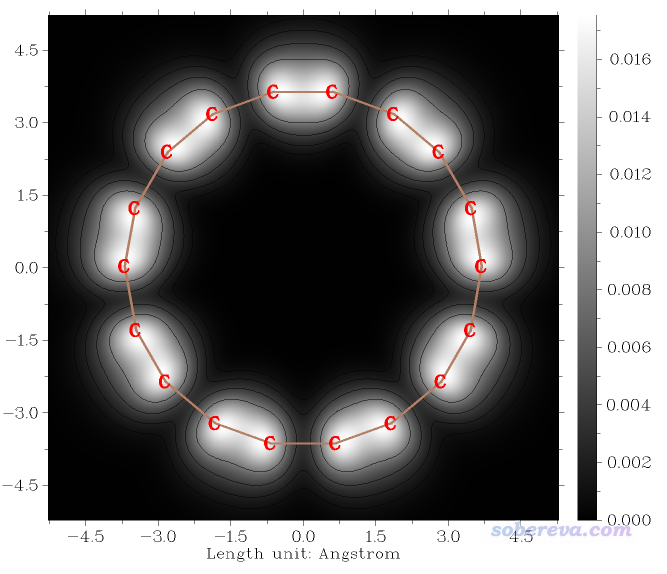
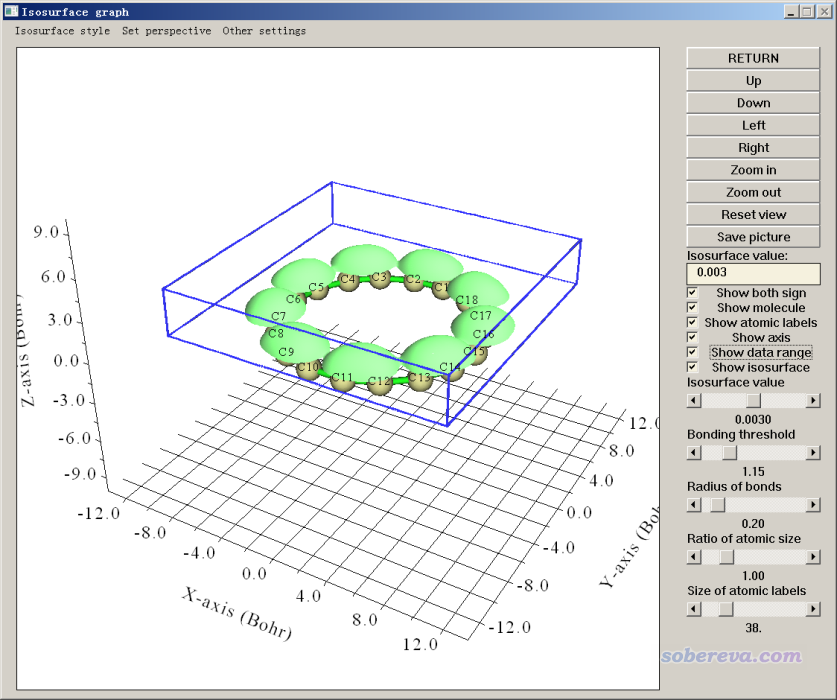
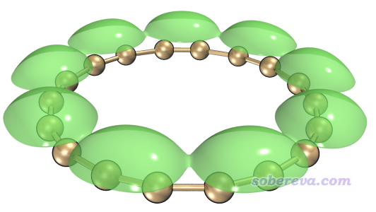
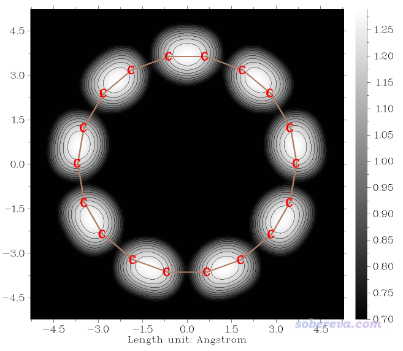

注：笔者后来另写了《使用Multiwfn结合CP2K的波函数模拟周期性体系的隧道扫描显微镜（STM）图像》（<http://sobereva.com/671>），专门介绍怎么用Multiwfn结合CP2K对固体表面体系绘制STM，是对本文的重要补充，请读者别忘了阅读。

**使用Multiwfn模拟扫描隧道显微镜(STM)图像**

Using Multiwfn to simulate scanning tunneling microscopy (STM) images

文/Sobereva@[北京科音](http://sobereva.com/multiwfn)

First release: 2020-Apr-28  Last update: 2020-May-1

## 0 前言

扫描隧道显微镜(scanning tunneling microscopy, STM)是非常常用的在原子级别对固体表面或者被吸附在固体表面的分子进行成像的方法。从2020-Apr-27更新的Multiwfn开始，Multiwfn支持了模拟分子体系STM图像的功能，易学易用、设置灵活、计算速度快、作图效果好。本文将对其原理和使用方法进行介绍，并给出具体例子。

如果对Multiwfn不熟悉，建议参看《Multiwfn FAQ》（<http://sobereva.com/452>）和《Multiwfn入门tips》（<http://sobereva.com/167>），此程序可以在<http://sobereva.com/multiwfn>免费下载。STM图和态密度(DOS)有密切关系，Multiwfn另有强大的功能专门用来绘制DOS，见《使用Multiwfn绘制态密度(DOS)图考察电子结构》（<http://sobereva.com/482>）。

## 1 STM的原理和模拟方法

STM在wiki上有清楚的介绍：<https://en.wikipedia.org/wiki/Scanning_tunneling_microscope>，也有相关专著比如Introduction to Scanning Tunneling Microscopy (2ed, Julian Chen, 2008)。本节只是介绍一下最关键的STM的相关知识，以让读者能正确理解和使用Multiwfn的STM模拟功能。在Multiwfn手册3.300.4节还有更细致的介绍。

STM的示意图如下

如上所示，被测样品平行于XY平面上。STM针尖(tip)在被测物原子上方进行扫描，范围如上图粉框所示。在样品与针尖足够近，且在二者之间施加偏压（bias voltage，以下简写为V）时，由于隧道效应，样品原子与针尖之间会形成隧道电流（tunneling current，以下简写为I）。针尖在不同(x,y,z)的位置时I都不同，STM本质上就是根据I(x,y,z)函数来进行成像。当V<0，电子从样品向针尖流动，当V>0，电子从针尖向样品流动。

STM有两种模式：  
(1)常高模式（constant height mode）：针尖保持在特定的z位置，对x和y做二维扫描，这样得到的图像就体现出不同(x,y)处I的差异。对于比较简单的情况，针尖与样品原子距离越近I就越大，因此通过这样的图就可以判断样品表面的原子排布情况。  
(2)常电流模式（constant current mode）：针尖也是对x和y做扫描，但对每个位置，都调节针尖高度找到I等于特定值的位置（称为z'）。常电流模式的STM图就相当于z'(x,y)的平面图。对于简单情况，原子出现的地方z'会较大（针尖在较高处时就已经产生了特定大小的电流），反之z'较小（针尖需要放得较低才能产生特定大小的电流）。

对于被固体吸附的分子体系，影响STM图特征的不仅是原子位置，还有其电子结构和偏压。

模拟STM的方法很多，比如JACS, 121, 5392 (1999)、JPCB, 101, 5996 (1997)、JCP, 104, 2410 (1996)等，但是真正流行的只有Tersoff-Hamann (TF)模型。此方法在Phys. Rev. Lett., 50, 1998 (1983)提出，后来在Phys. Rev. B, 31, 805 (1985)进行了扩展讨论。TF模型是基于Bardeen计算隧道电流公式通过推导和简化得到的近似的模型。原本的TF模型局限性很大，对应于低温和小偏压极限，而且只适用于周期性体系。TF模型当初考虑了两种情况，一种是将针尖近似为无限小的点，还有一种是将针尖视为是特定半径的球形，一般用的TF模型都是前者，相当于把针尖的真实特征彻底忽略掉了（本来真实特征也难以确定），此时得到的STM图对应于无穷高解析度的情况。TF模型的表达式传递出的一个关键性信息是某个位置的I正比于此处的局部态密度（local density-of-states, LDOS），故实际在用TF模型模拟STM时其实就是等价于计算和绘制LDOS，而对于I的绝对大小并不关心（这本来也没法准确计算得到）。

对于分子、团簇等孤立体系，TF模型写为下式（虽然这并非是TF模型原文里提出的，但写文章时往往都这么叫）

其中r是针尖所在的位置矢量，E_F是费米能级，φ是轨道波函数，e是基元电荷（elementary charge），V是前述的偏压。i循环能量在E_F+eV到E_F范围的占据分子轨道，a循环能量在E_F到E_F+eV范围的非占据分子轨道。费米能级对于孤立体系而言没有确切定义，但在习俗上往往采用HOMO和LUMO能量的平均值，下文也这么考虑。通过上式可见，计算用来模拟STM图的I实质上就是计算特定能量区间内的前线轨道的概率密度的总和，这被研究STM的文章叫做LDOS（注意此语境下的LDOS和《使用Multiwfn绘制态密度(DOS)图考察电子结构》里说的LDOS不完全一样），因此使用TF模型近似模拟STM时说到单位的时候应当写成LDOS的单位，在Multiwfn里用的是a.u.。

## 2 Multiwfn模拟STM图的实例：18碳环

关于Multiwfn模拟STM图像功能的细节看Multiwfn手册4.300.4节的介绍，这里直接通过18碳环这个体系作为例子讲解怎么模拟，使用的是2020-Apr-27更新的Multiwfn。

18碳环这个体系在《一篇最全面、系统的研究新颖独特的18碳环的理论文章》（<http://sobereva.com/524>）介绍的笔者论文中做了非常系统、全面的研究和分析，欢迎阅读。本例得到的图像已被笔者用于在Carbon期刊上发表的论文An sp-hybridized all-carboatomic ring, cyclo[18]carbon: Bonding character, electron delocalization, and aromaticity（<https://doi.org/10.1016/j.carbon.2020.04.099>）的补充材料里，非常推荐一读。

### 2.1 准备输入文件

用Multiwfn模拟STM图像用的输入文件必须包含轨道波函数信息，可以用比如wfn、wfx、fch、molden、mwfn等等，详见《详谈Multiwfn支持的输入文件类型、产生方法以及相互转换》（<http://sobereva.com/379>）。如果你是Gaussian用户，建议用fch文件，因为它不仅包含占据轨道也包含空轨道信息，因此偏压<0和>0的情况都可以绘制，而如果用比如wfn这样只包含占据轨道信息的输入文件，则只能绘制偏压<0的情况。18碳环体系用Gaussian在wB97XD/def2-TZVP下优化并产生的fch文件可以在这里下载：<http://sobereva.com/multiwfn/extrafiles/C18.zip>，计算时用的关键词是# wB97XD/def2TZVP opt。

模拟STM图像用的输入文件当中分子应当基本平行于XY平面以比较符合分子被固体表面吸附时的状态，这并不要求体系非得是平面的。从上面链接给出的C18.fchk文件中可见这个环状分子已经精确处在XY平面上，因此可以直接用于模拟。具体来说，此分子是处在Z=0的XY平面，对于纯平面体系建议都摆成这样以便于分析讨论（Multiwfn对原子的Z坐标并没有严格要求，所有原子的Z坐标比如都为2.5埃也可以，只要恰当解释结果即可）。

有的时候Gaussian在计算纯平面体系时会把体系摆到比如YZ平面去，此时没法直接作图。解决办法之一是修改Gaussian输入文件里的坐标，让体系处于Z=0的XY平面，然后加上nosymm关键词避免被摆到标准朝向下，详见《谈谈Gaussian中的对称性与nosymm关键词的使用》（<http://sobereva.com/297>）。但更好的解决办法是利用Multiwfn的旋转结构和波函数的功能处理一下，这不花任何额外的时间，详见Multiwfn手册3.300.4节模拟菲的STM图的例子。

STM绘制功能只支持能给出分子轨道的理论方法，一般就是用KS-DFT，显然后HF方法、CASSCF等都是不支持的，双杂化泛函也不行。限制性闭壳层、限制性开壳层、非限制性开壳层波函数都支持。

### 2.2 模拟常高模式的STM图像

启动Multiwfn，载入C18.fchk，然后输入  
300  // 其它功能(Part 3)  
4  // 模拟STM图的功能

此时从屏幕上的提示会看到，当前费米能级被设为了HOMO和LUMO能量的平均值，并且默认的偏压被设为了费米能级与HOMO能量的差值。这两个值具体是多少可以从当前STM界面的选项上的提示看到，分别是-3.374 eV和-5.075 V，后者为负值说明在这样的设定下电子是通过隧道效应从C18往探针转移的。当前考虑的占据轨道的能量的下限为E_F + eV = -5.075 eV + e*(-3.374 V) = -8.449 eV，这正对应于18碳环的HOMO能级。也就是说，在默认设置下直接绘制STM图，则这个图将直接对应HOMO的概率密度乘上其简并度。

18碳环这个体系的最高一批占据轨道信息如下所示，这在Multiwfn的主功能0里通过Orbital info. - Show occupied orbitals功能可以直接输出（详见《使用Multiwfn观看分子轨道》<http://sobereva.com/269>）

Orb:    48 Ene(au/eV):    -0.405113     -11.0237 Occ: 2.000000 Type:A+B  
 Orb:    49 Ene(au/eV):    -0.402139     -10.9428 Occ: 2.000000 Type:A+B  
 Orb:    50 Ene(au/eV):    -0.402139     -10.9428 Occ: 2.000000 Type:A+B  
 Orb:    51 Ene(au/eV):    -0.314238      -8.5509 Occ: 2.000000 Type:A+B  
 Orb:    52 Ene(au/eV):    -0.314238      -8.5509 Occ: 2.000000 Type:A+B  
 Orb:    53 Ene(au/eV):    -0.310478      -8.4485 Occ: 2.000000 Type:A+B  
 Orb:    54 Ene(au/eV):    -0.310478      -8.4485 Occ: 2.000000 Type:A+B

可见，此体系最高四个占据的分子轨道能量非常接近，其中53、54是简并的in-plane pi轨道，51、52是简并的out-plane pi轨道。我们当前模拟STM图希望将这四个轨道的贡献都纳入，为此我们需要恰当设置偏压。比如偏压设为-3.5 V时，考虑的占据轨道能量的下限就是-5.075+(-3.5)=-8.575 eV，它大于MO50的能量但是小于MO51的能量，故此时只有序号>=51的那四个占据轨道会对STM图产生贡献。

默认情况下，STM图是常高模式，并且绘制的XY平面的Z值比Z值最大的原子的Z值高0.7埃，因此当前体系默认情况下绘制的常高STM图对应于Z=0.7埃的位置，本例就直接用默认值了。通过屏幕上的选项还可以修改格点数（越大图越精细，但耗时越高）、修改X和Y的计算范围，本例都用默认值。默认的图像的X、Y范围是对边界原子延展3 Bohr来确定的，这通常是适合的。

我们接着输入以下命令  
2  // 修改偏压  
-3.5  // 偏压值(V)  
0  // 开始计算

由于Multiwfn代码效率高，而且常高STM图像的模拟只需要计算一个平面上的数据，所以瞬间就算完了，在屏幕上可以看到以下信息

Lower limit of MO energy considered in the calculation:      -8.575 eV  
 Upper limit of MO energy considered in the calculation:      -5.075 eV  
 The MOs taken into account in the current STM simulation:  
 MO    51   Occ= 2.000   Energy=     -8.5509 eV   Type: Alpha&Beta  
 MO    52   Occ= 2.000   Energy=     -8.5509 eV   Type: Alpha&Beta  
 MO    53   Occ= 2.000   Energy=     -8.4485 eV   Type: Alpha&Beta  
 MO    54   Occ= 2.000   Energy=     -8.4485 eV   Type: Alpha&Beta  
 Totally   4 MOs are taken into account

Grid spacings in X and Y are    0.100278    0.099212 Bohr  
 Calculating, please wait...  
 Maximal value (LDOS) is    0.017536 a.u.

以上信息显示了考虑的轨道能量的上下限，并提示了哪些轨道被纳入了考虑。可见我们期望的那四个轨道都已纳入考虑了，说明偏压设置合理。计算完毕后还提示了平面数据中最大值（即最大的LDOS）是0.0175 a.u.。

此时进入了一个新菜单，用来将计算完的LDOS平面数据绘制成STM图像，里面有大量选项用来调整作图效果，还可以把平面数据导出成文本文件以便通过第三方工具如Sigmaplot重新作图。如果你经常用Multiwfn的主功能4（平面图绘制功能），对这些选项肯定都比较熟悉。由于这些选项一看名字就知道是干什么的，这里我就不一一解释了，不清楚的自己玩玩便知。我们就直接选择选项0来绘图，马上看到下图

上图的色彩刻度条对应的是LDOS值，实际中的STM图像展现的各个位置的隧道电流大小也正比于它。默认设置下色彩刻度下限为0，上限为此平面中的LDOS最大值。上图体现出在碳原子和部分C-C键上方0.7埃的位置有相对明显的隧道电流，因此颜色很白，而在另外一些C-C键上方0.7埃处隧道电流则可以忽略不计，因此是黑色的。如果你仔细读过前述我的18碳环的研究文章就会知道此体系里有两类C-C键，一类较短，一类较长，上图体现出前者上方的隧道电流比后者的更强，这是因为较短C-C键的pi轨道作用相对显著得多。

我们可以根据实际需要调节作图设置以得到更满意的图，比如我们输入以下命令做一些修改：  
5  // 显示化学键  
14  // 用棕色  
2  // 修改图像类型  
2  // 填色图+等值线  
7  // 修改坐标轴的刻度间隔  
1.5,1.5,0.002  
-3  //其它作图设置  
2  // 修改小数点位数  
1  // X轴小数点位数  
1  // Y轴小数点位数  
3  // Z轴小数点位数  
8  // 修改原子标签大小  
70  
0  // 返回上一级菜单  
0  // 重新绘图

此时看到的图像如下，效果比之前的更好了。

### 2.3 模拟常电流模式的STM图像

下面我们对18碳环模拟常电流模式的STM图像。进入STM图像绘制功能后，先选择选项1将绘图模式切换为常电流模式，并且同前例一样把偏压设为-3.5 V。常电流模式要对一个三维区域中均匀分布的各个点计算隧道电流，相当于要计算LDOS的三维格点数据。默认的X、Y、Z范围以及各个方向的格点数从屏幕上的选项的文字中都可以看到。格点数越多，计算耗时越高，而图像越平滑，默认用的150*150*80的格点算是图像效果和耗时的一个权衡。默认的X、Y范围和常高模式一样，而Z范围默认是Z最大的原子上方的0.7~2.5埃区域，通常默认设置就是比较合适的。

现在直接选择0开始计算隧道电流（即计算LDOS），耗时明显高于只考虑一个平面的常高模式，不过在一般4核机子上对这个体系也就不到一分钟就算完了。之后屏幕上提示LDOS格点数据最大值是0.0175 a.u.。接下来会看到几个选项，选1可以进入图形界面观看隧道电流的等值面，LDOS=0.003 a.u.的等值面如下所示。笔者也选了show data range复选框，使实际计算的区域用蓝色矩形展现了出来

从上图可见，计算的X、Y、Z范围的设置是比较恰当的。等值面在C11-C12这样较短的C-C键上方的位置相对较高（即维持特定的隧道电流值时针尖位置较高），而在诸如C12-C13这样较长的C-C上方比较低，这充分体现出这两种C-C键特征的差异，也体现出分子的电子结构对常电流模式STM图的影响。然后我们点Return按钮关闭图形窗口。

当前我们还可以用选项2将LDOS格点数据导出成为STM.cub，这样就可以用VMD绘制成等值面了，效果会更好。利用《在VMD里将cube文件瞬间绘制成效果极佳的等值面图的方法》（<http://sobereva.com/483>）文中的做法可以轻松得到下面的图像

接下来，我们绘制常电流模式STM的平面图。选择3 Calculate and visualize constant current STM image，输入常电流的值。由于格点数据最大值是0.0175，显然输入的数值必须大于0且小于0.0175。这里我们就输入0.003。然后程序就基于LDOS三维格点数据计算出平面数据，并输出最小值和最大值：  
Minimal Z is    0.700000 Angstrom  
 Maximal Z is    1.288940 Angstrom  
即曰，在对应LDOS=0.003 a.u.的常电流STM平面图中，Z最小值为0.7埃，这也正是格点数据的Z范围的最小值；最大值为1.2889埃，这没达到格点数据Z范围最大值（2.5埃），说明在当前电流值下我们计算的格点数据的空间范围是合适的，即Z的上限足够大。

然后我们进入到了和常高模式时一样的绘图界面，有丰富的选项控制作图。在选择选项0进行绘制之前我们像上例一样对作图设置进行修改，最后作图效果如下

在这张图中，色彩刻度对应的是探针的Z位置（埃），此图传递出的信息和前面的等值面图一样，也是在维持电流不变的情况下，探针在较短的C-C键上方的位置比较长的C-C键明显高得多。这张图和前面2.2节绘制的常高模式的STM图的基本特征也非常相似。

如果你还想考察其它常电流下的STM图，就退出作图界面，然后再次选择3 Calculate and visualize constant current STM image并输入其它常电流的值即可。

值得一提的是，在首次于凝聚相中观测到18碳环的文章Science, 365, 1299 (2019)的补充材料的中，作者给出了吸附在NaCl上的18碳环的隧道电流为0.7 pA、偏压为0.1 V的实验STM图像，但那个图模糊不清，而且图像受基底NaCl影响比较明显。

## 4 总结&其它

本文介绍了STM实验的基本概念和STM图像的模拟方法，并且以目前正热门的18碳环体系为例演示了怎么绘制此分子的STM图像，可见Multiwfn绘制STM图像又方便效果又好。大家在以量子化学方式研究新奇特的分子的时候，都可以用此文的方法作图放在文章里，以供实验化学家参考、与实验图像进行对照。

本文的做法是针对孤立体系。如果你是通过第一性原理程序研究固体表面的STM，则本文的方法不适用，不过很多第一性原理程序都直接提供了STM模拟功能，比如Abinit、WIEN2k、CASTEP、OpenMX、GPAW、exciting等。在量子化学范畴中据我所知目前直接支持STM模拟的程序只有xtb一个，但没什么实际意义（参数没法调节，没法直接产生图像，手册里也没有任何介绍，而且根据其源代码我发现它用的方法不对），而Multiwfn基于xtb产生的molden文件可以如上文一样直接作图。
