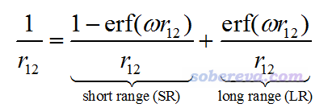
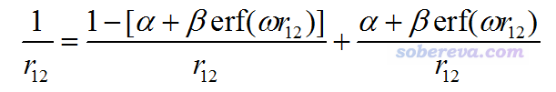
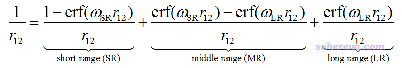
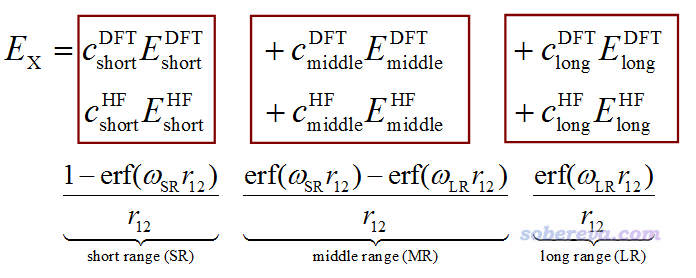

**在Gaussian中自定义范围分离泛函的方法**

The way to customize range-separated DFT functionals in Gaussian

文/Sobereva@[北京科音](http://www.keinsci.com)

 First release: 2020-May-1  Last update: 2022-Nov-17

## 0 前言

之前笔者在《优化长程校正泛函w参数的简便工具optDFTw》（<http://sobereva.com/346>）介绍过长程校正泛函和明显影响其结果的ω参数（以下简写为w）。在Gaussian中对DFT泛函自定义w值的做法在此文里也说了：《Gaussian中非内置的理论方法和泛函的用法》（<http://sobereva.com/344>）。鉴于偶有人问怎么调节范围分离泛函CAM-B3LYP的α和β参数、怎么在Gaussian里用LC-PBE0这样短程HF成份不为0的泛函，笔者在此文就对Gaussian中自定义范围分离泛函参数的问题专门说一下。在说具体怎么实现之前先回顾一下基本概念，否则读者肯定会糊涂。本文内容是针对Gaussian 16而言的，对于其它版本可能适用也可能不适用。

自定义泛函需要用到IOp。在这里特意嘱咐一下，Gaussian做多步任务时，IOp设置仅对第一个任务生效。因此用自定义泛函做opt freq任务时，freq任务是接收不到IOp的，会导致freq和opt用的不是同一个泛函，造成严重问题。因此自定义泛函时opt和freq必须分别做。

## 1 1/r12算符的划分

对GGA泛函做长程校正(long range correction, LC)的思想最早由Tsuneda等人于JCP, 115, 3540 (2001)提出，它将描述电子间相互作用的1/r12算符做如下划分，其中w直接影响被归属于长程和短程作用的范围。erf是误差函数（error function），介绍见<https://en.wikipedia.org/wiki/Error_function>。随着自变量从0开始增加，erf也从0开始逐渐趋于1。

最早的LC类型的泛函将长程部分完全用HF交换项描述，短程部分完全用GGA交换泛函描述，这样做局限性较大，在改进里德堡激发、电荷转移激发等GGA泛函算得很差的问题的精度的同时显著降低了对其它问题的计算精度。在2004年CAM-B3LYP的原文中，提出了Coulomb-attenuating method (CAM)形式的1/r12算符的划分，如下所示

CAM比起LC额外引入了α和β参数，使得优化泛函参数的自由度更大，也令CAM-B3LYP泛函不像LC泛函那样在热化学数据计算精度等方面精度下降得那么严重。如今流行的wB97XD等泛函都是用的CAM的形式。在CAM形式下，长程极限的HF成份是α+β，短程极限的HF成份是α。全局杂化泛函相当于β=0、HF成份为α的情况。LC泛函相当于α=0、β=1的情况。

在JCP, 127, 221103 (2007)提出的HISS原文中，对1/r12的划分还引入了中程区域：

可见w参数有SR和LR两种。当w_SR和w_LR相同时，这种划分还原成LC的形式，当二者不同时，就有了一部分中程区域了。如果w_SR和w_LR其一为0，则这种划分没意义。这种含有中程区域的划分没太大实际价值，也就HISS等极少泛函使用。

范围分离（range-separated）泛函这个词泛指在不同电子作用距离下HF交换项、DFT交换泛函引入程度不同的泛函，上面这些提到的都属于范围分离泛函。范围分离泛函大多是在长程范围引入比短程范围更高比例的HF交换项，但也有HSE06、MN12-SX等长程HF成份为0而短程不为0的泛函，还有HISS那样更特殊的只有在中程范围HF成份不为0而在短程和长程范围都为0的泛函。另外还有所谓的局域杂化泛函，在三维空间不同位置使用不同HF成份，比范围分离泛函更为广义，但实现起来很困难，也没太大价值，有兴趣的话可以看综述WIREs Comput. Mol. Sci., e1378 (2018)，这不属于本文的范畴。

## 2 在Gaussian中定义范围分离泛函

Gaussian在自定义范围分离泛函方面很灵活，但也因此规则相当绕，程序手册和IOp手册里也语焉不详，在这一节笔者详细捋一下思路。

最广义形式的范围分离泛函的交换能可以写为下面这样

Gaussian里有以下IOp与定义范围分离泛函的交换部分有关（虽然<http://gaussian.com/overlay3/>中也有相关说明，但说得不明不白），其中HFx代表HF交换项，DFx代表DFT交换项  
IOp(3/107)：两个数对应于HFx的wLong和wShort  
IOp(3/108)：两个数对应于DFx的wLong和wShort  
IOp(3/119)：两个数对应于HFx的cLong和cShort  
IOp(3/120)：两个数对应于DFx的cLong和cShort  
IOp(3/138)：两个数对应于DFxc和HFx的cMiddle  
IOp(3/130)：对应于HFx的cFull  
IOp(3/131)：对应于DFx的cFull  
下面解释一下这些项都是干嘛的。

Gaussian允许HF和DFT的交换部分用的w参数不同，但一般能见到的泛函对于DFx和HFx用的w参数是相同的，因此3/107和3/108定义的值总是相等的，它俩都设为MMMMMNNNNN就代表wLong为MMMMM/10000、wShort为NNNNN/10000。如果wLong或wShort其一为0，本质上就等于是wLong=wShort的情况，即不存在中程部分，此时也相当于只定义了一个w。例如w=0.47/Bohr的LC泛函就应该把3/107和3/108都写为0470000000，即wShort=0、wLong=0.47，此时不存在中程部分。

Gaussian不是分别去对短程、中程和长程直接设置系数c，而是定义cFull、cLong、cShort。cFull+cLong对应长程系数，cFull+cShort对应短程系数。对于存在中程的情况，cFull相当于中程的系数。与CAM的定义对照，我们可知3/130设的HFx cFull对应于α参数、3/119设的HFx cLong对应于β参数。

如《Gaussian中非内置的理论方法和泛函的用法》（<http://sobereva.com/344>）所述，Gaussian通过IOp(3/76=MMMMMNNNNN)来将全局杂化泛函的HF交换项系数设为NNNNN/10000，如果将这称为ScaHFX，则  
实际的短程HFx系数是ScaHFX*HFx_cShort，实际的长程HFx系数是ScaHFX*HFx_cLong。

根据Gaussian实际输出信息，我发现对于wShort为0而只定义了wLong的情况，也就是绝大多数范围分离泛函的情况，DFT交换部分用的系数实际上是：短程为1 - DFx cShort，长程为1 - DFx cLong。而其它情况下DFx cShort和DFx cLong都是直接定义的实际用的系数。

IOp(3/130=NNNNN)设置HFx cFull为NNNNN/10000的时候，如果令十万、百万、千万位设1，说明分别将HFx cShort、HFx cLong、HFx cMedium取负。设置DFx的IOp(3/131)的用法也是如此。

Gaussian中通过IOp(3/77=MMMMMNNNNN)设置普通杂化泛函的LDA部分和GGA校正部分乘的系数，在定义范围分离泛函的时候这两部分必须相同，即MMMMM=NNNNN才行。

此外，Gaussian还支持对DFT相关部分(DFc)的范围分离，如下所示，但这没实际用处，不用管。  
IOp(3/109)：两个数对应于DFc的wLong和wShort  
IOp(3/121)：两个数对应于DFc的cLong和cShort  
IOp(3/132)：对应于DFc的cFull

## 3 内置的一些范围分离泛函解读

使用范围分离泛函做计算的时候写上#P，就可以在SCF迭代开始前看到泛函的具体参数。下面我们看看对一些常见的范围分离泛函Gaussian输出的信息，弄懂了这些才好自定义

(1) LC-PBE 短程0%，长程100%，w=0.47：  
 IExCor=11009 DFT=T Ex=LC-PBE+HF Corr=PBE ExCW=0 ScaHFX=  1.000000  
  ScaDFX=  1.000000  1.000000  1.000000  1.000000 ScalE2=  1.000000  1.000000  
  HFx  wShort=  0.000000 wLong=  0.470000 cFull=  0.000000 cShort=  0.000000 cLong=  1.000000  
  DFx  wShort=  0.000000 wLong=  0.470000 cFull=  0.000000 cShort=  0.000000 cLong=  1.000000  
可见HFx和DFx的w设置是一样的，前面说了它俩总应当设一样。wShort为0体现出此泛函没有利用中程范围，wLong就对应LC泛函的w了。此例短程HF成份为cFull+cShort=0%，而长程为cFull+cLong=100%。当前情况比较简单，HFx和DFx的cShort、cLong参数都相同，说明HFx与DFx精确互补（别忘了如上一节所述，对wShort=0这种情况，在某个范围DFx设的系数若为c，则真正用的系数为1-c）。

(2) CAM-B3LYP 短程19%，长程65%，w=0.33：  
 IExCor=20419 DFT=T Ex+Corr=CAM-B3LYP ExCW=0 ScaHFX=  1.000000  
  ScaDFX=  1.000000  1.000000  1.000000  0.810000 ScalE2=  1.000000  1.000000  
  HFx  wShort=  0.000000 wLong=  0.330000 cFull=  0.190000 cShort=  0.000000 cLong=  0.460000  
  DFx  wShort=  0.000000 wLong=  0.330000 cFull=  0.190000 cShort=  0.000000 cLong=  0.460000  
可见w=0.33。短程HF成份是0.19+0.00=19%，长程是0.19+0.46=65%。此泛函的相关部分是LYP，其中LYP梯度校正部分的系数是0.81，这是ScaDFX后面第四个数为0.81的原因。关于这个在<http://sobereva.com/344>中我已经说过了。此泛函的DFT交换项和HF交换项也是精确互补的。

(3) wB97X 短程15.77%，长程100%，w=0.3：  
 IExCor= 4538 DFT=T Ex+Corr=wB97X ExCW=0 ScaHFX=  1.000000  
  ScaDFX=  1.000000  1.000000  1.000000  1.000000 ScalE2=  1.000000  1.000000  
  HFx  wShort=  0.000000 wLong=  0.300000 cFull=  0.157706 cShort=  0.000000 cLong=  0.842294  
  DFx  wShort=  0.000000 wLong=  0.300000 cFull=  0.000000 cShort=  0.000000 cLong=  1.000000  
显然此泛函w=0.3。短程HF成分是0.1577+0.0=15.77%，长程HF成分是0.1577+0.8423=100%。此泛函的DFx和HFx的系数并非是精确互补的。DFx的cFull+cShort为0，因此在短程部分DFT交换项的实际系数为1。又由于DFx的cFull+cLong为1，因此在长程部分DFT交换项的实际系数为0。从wB97X原文28式可见，确实此泛函中DFT交换项只有短程部分。

(4) HISSbPBE（HISS）：  
 IExCor= 4709 DFT=T Ex+Corr=HISSbPBE ExCW=0 ScaHFX=  1.000000  
  ScaDFX=  1.000000  1.000000  1.000000  1.000000 ScalE2=  1.000000  1.000000  
  HFx  wShort=  0.840000 wLong=  0.200000 cFull=  0.600000 cShort= -0.600000 cLong= -0.600000  
  DFx  wShort=  0.840000 wLong=  0.200000 cFull=  0.400000 cShort=  0.600000 cLong=  0.600000  
由于这个泛函特意考虑了中程作用，因此wShort与wLong不相等。中程HF成份为cFull=0.6=60%，短程HF成分为cFull+cShort=0.6-0.6=0%，长程HF成分为cFull+cLong=0.6-0.6=0%。HFx的系数靠3/119来定义时只能定义为正值，将之变成此例这样的-0.6需要借助前述的3/130。由于wShort不为0，在这里显示的DFx的系数，也即IOp直接设的DFx的系数就是实际用的系数，因此中程的DFx系数为cFull=0.4，短程部分系数是cFull+cShort=0.4+0.6=1，长程部分系数是cFull+cLong=0.4+0.6=1。可见，HISS泛函的HFx和DFx是精确互补的，在HF成份为0的短程和长程部分DFT交换项都为100%。

(5) HSE06 短程25%，长程0%，w=0.11：  
 IExCor= 3909 DFT=T Ex+Corr=HSEH1PBE ExCW=0 ScaHFX=  0.250000  
  ScaDFX=  1.000000  1.000000  1.000000  1.000000 ScalE2=  1.000000  1.000000  
  HFx  wShort=  0.110000 wLong=  0.000000 cFull=  0.000000 cShort=  1.000000 cLong=  0.000000  
  DFx  wShort=  0.110000 wLong=  0.000000 cFull=  0.000000 cShort= -0.250000 cLong=  1.000000  
这是本文例子里唯一一个长程HF成份为0而短程不为0的泛函。此泛函没有利用到中程区域，本质上就只利用了一个w=0.11，而输出中显示的wShort=0.11 wLong=0显得比较莫名其妙。虽然此泛函的HFx的cFull+cShort=1，但由于ScaHFX=0.25（之前的泛函这项都是1），因此如前所述实际的短程HF成份为ScaHFX*(cFull+cShort)=0.25=25%。如HISS原文式8和表1所示，这个泛函的短程部分的DFT交换项系数是0.75，长程部分为1.0。而在当前的输出中，DFx的cFull+cShort=-0.25，显得有点莫名其妙。我的猜测是当这种数值为负值且wShort>wLong的情况，实际系数0.75是根据1-0.25计算出来的。DFT交换项的长程部分是cFull+cShort=0.0+1.0=1.0，这没什么好说的。

## 4 自定义范围分离泛函例子

这一节我们来通过IOp自定义两个范围分离泛函。

### 4.1 CAM-B3LYP

在一些文章中修改了CAM-B3LYP中的α和β参数，在修改之前我们先看看怎么才能“从头”通过IOp来实现原始的CAM-B3LYP泛函。正确的关键词是这样的：  
# BV5LYP/基组 IOp(3/76=1000010000,3/77=1000010000,3/78=0810010000) IOp(3/107=0330000000,3/108=0330000000) IOp(3/119=0460000000,3/120=0460000000) IOp(3/130=01900,3/131=01900)

上面为了清楚，把不同类别的IOp分开写了，合写到一起也完全可以。用这套关键词进行计算时会看到输出的泛函定义如下，和前面提到的直接用CAM-B3LYP关键词时候显示的各种系数都是相同的。  
 IExCor=  402 DFT=T Ex=B+HF Corr=LYP ExCW=0 ScaHFX=  1.000000  
  ScaDFX=  1.000000  1.000000  1.000000  0.810000 ScalE2=  1.000000  1.000000  
  HFx  wShort=  0.000000 wLong=  0.330000 cFull=  0.190000 cShort=  0.000000 cLong=  0.460000  
  DFx  wShort=  0.000000 wLong=  0.330000 cFull=  0.190000 cShort=  0.000000 cLong=  0.460000

下面详细说说为什么定义。先回顾一下普通杂化泛函的定义方式（详见<http://sobereva.com/344>）：  
E_XC = a*[ d*E_X_LDA + c*ΔE_X_GGA ] + b*E_X_HF + f*E_C_LDA + e*ΔE_C_GGA  
这些系数通过IOp(3/76=ab)、IOp(3/77=cd)、IOp(3/78=ef)来设置。

CAM-B3LYP是将Becke88交换泛函、HF交换项以及LYP相关泛函进行组合得到的。因此我们先写BV5LYP，其中B代表Becke88，V5LYP代表LYP。由于CAM-B3LYP原文里明确说用的是基于VWN5的LDA相关泛函定义的LYP，然而Gaussian默认的是基于VWN3的，因此必须刻意写成V5LYP。此泛函里a是1，HF交换部分具体情况之后会按照范围分离泛函的方式定义，故先将全局系数b设为1，因此用了3/76=1000010000。CAM-B3LYP里LDA交换部分和其GGA梯度校正部分的系数是相同的，并且具体情况之后会按照范围分离泛函的方式定义，故先将全局系数c和d都设为1，因此用了3/77=1000010000。CAM-B3LYP的相关泛函部分的构成和B3LYP的相同，即LDA相关泛函的系数为1（f=1），再加上0.81的LYP形式的GGA梯度校正（e=0.81），因此用了3/78=0810010000。

CAM-B3LYP不对中程范围单独定义，且w为0.33，因此wShort应当设0，wLong应当设0.33，在加上如前所述HFx和DFx用的w一般情况下都是等同的，故用了3/107=0330000000和3/108=0330000000。原文里说了此泛函的α=0.19、α+β=0.65，即短程和长程HF成份分别为19%和65%。想实现这个，就令HFx的cFull等于α（即3/130=01900），令cLong等于β（0.46）且cShort等于0（即3/119=0460000000）。前面说过CAM-B3LYP的DFx与HFx是互补的，因此令定义DFx系数的3/120和3/131分别等于3/130和3/119即可。

把以上的讨论弄清楚了，怎么像一些文献中那样基于其它的α和β参数做CAM-B3LYP计算就很清楚了。比如α=0.15、β=0.4、w=0.25，就用下面的关键词即可：  
BV5LYP IOp(3/76=1000010000,3/77=1000010000,3/78=0810010000) IOp(3/107=0250000000,3/108=0250000000) IOp(3/119=0400000000,3/120=0400000000) IOp(3/130=01500,3/131=01500)  
其中3/76、3/77、3/78保持原CAM-B3LYP的定义不变，只修改了Overlay 3里面的107、108、119、120、130、131。

为了写起来更简便，也可以在CAM-B3LYP基础上只重设w、α和β部分，也就是把上面的“BV5LYP IOp(3/76=1000010000,3/77=1000010000,3/78=0810010000)”这一堆直接用“CAM-B3LYP”关键词来代替。

### 4.2 LC-PBE0

这个泛函在J. Chem. Phys., 129, 034107 (2008)提出，参数是w=0.3、α=0.25、α+β=1.0。它等于把PBE0和LC相结合，近程还是和PBE0一样的25% HF成份，而长程则为100%。原先的PBE0等价于PBEPBE IOp(3/76=1000002500,3/77=0750007500)，将之改造为LC-PBE0，就写：  
PBEPBE IOp(3/76=1000010000,3/77=1000010000) IOp(3/107=0300000000,3/108=0300000000) IOp(3/119=0750000000,3/120=0750000000) IOp(3/130=02500,3/131=02500)  
其中PBEPBE IOp(3/76=1000010000,3/77=1000010000)这部分相当于先把PBE泛函弄成全局100% HF交换+100% DFT交换的状态，之后再用其它IOp定义不同范围如何杂化。

当前关键词下输出的信息如下，可见很正确。  
 ScaDFX=  1.000000  1.000000  1.000000  1.000000 ScalE2=  1.000000  1.000000  
  IRadAn=      5 IRanWt=     -1 IRanGd=            0 ICorTp=0 IEmpDi=  4  
  HFx  wShort=  0.000000 wLong=  0.300000 cFull=  0.250000 cShort=  0.000000 cLong=  0.750000  
  DFx  wShort=  0.000000 wLong=  0.300000 cFull=  0.250000 cShort=  0.000000 cLong=  0.750000
