**谈谈范德华势以及在Multiwfn中的计算、分析和绘制**

On the van der Waals potential and its calculation, analysis and plot in Multiwfn

文/Sobereva@[北京科音](http://www.keinsci.com)

First release: 2020-May-2  Last update: 2024-Oct-29

## 0 前言

在研究分子间弱相互作用领域，静电势是经常被考察的量。通过静电势我们可以方便、直观地了解分子的什么地方倾向于与带有什么电荷的物质（或局部）相互作用，可以对结合强度、结合方式进行解释和预测。关于静电势笔者写过大量文章，Multiwfn程序在静电势分析方面极为灵活和强大，相关博文和资料见《静电势与平均局部离子化能综述合集》（<http://bbs.keinsci.com/thread-219-1-1.html>）。

对于分子间弱相互作用来说，范德华作用与静电作用有同等重要的地位，如果对弱相互作用本质不了解的话，建议看《谈谈“计算时是否需要加DFT-D3色散校正？”》（<http://sobereva.com/413>）和《透彻认识氢键本质、简单可靠地估计氢键强度：一篇2019年JCC上的重要研究文章介绍》（<http://sobereva.com/513>）中的相关介绍。既然通过静电势可以用来估计某分子与其它物质之间的静电作用特征，那么对范德华作用，是否也能定义一个“范德华势”来简单直观地分析考察某个分子与其它物质之间的范德华作用呢？为此，笔者基于分子力场的思想明确定义了范德华势的形式，在Multiwfn程序中加入了其计算和分析功能，还专门发表了一篇文章对此进行了详细介绍，并通过实例展示了范德华势的特征及其实际价值，请读者们仔细阅读：  
 Tian Lu, Qinxue Chen, van der Waals Potential: An Important Complement to Molecular Electrostatic Potential in Studying Intermolecular Interactions. *J. Mol. Model.*, **26**, 315 (2020) DOI: 10.1007/s00894-020-04577-0 

**使用Multiwfn计算范德华势的时候请记得需要在文章中同时引用Multiwfn启动时显示的程序原文，以及上面这篇范德华势的原文。**另外，《Angew. Chem.上发表了全面介绍各种共价和非共价相互作用可视化分析方法的综述》（<http://sobereva.com/746>）里介绍的笔者的综述对范德华势也做了介绍，建议阅读，也欢迎一并引用。

对于极性分子间的相互作用，由于静电作用占主导，对结合强度、结合模式有决定性作用，因此范德华势的意义相对弱一些。而对于弱极性分子间相互作用，范德华势的重要性与静电势是相仿佛的，应当将二者同时纳入考虑。对于非极性分子间的相互作用，由于范德华作用占主导，范德华势的分析有着关键性的意义。为了充分凸显范德华势分析的价值，后文涉及的体系都是非极性分子体系。

下面将首先简要介绍范德华势，然后通过实例讲解如何通过Multiwfn实现范德华势的分析。读者将体会到使用Multiwfn做这种分析非常快速方便，而且相当有实际意义。笔者希望通过本文以及上述论文里更具体的介绍，能令读者们认识到分析范德华势的重要性，并且将这种分析充分应用于日后实际问题的研究中。

## 1 范德华势的定义和实现

三维空间某个位置r处的静电势衡量的是位于r处的一个单位点电荷与当前体系的相互作用能。对于范德华作用，如果以分子力场中常用的Lennard-Jones 12-6势描述，范德华势可以写为下面这样

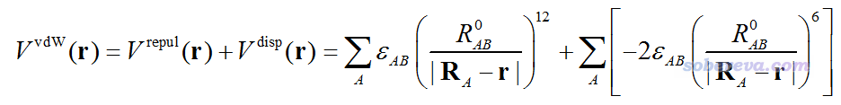

其中V_repul和V_disp分别是范德华势当中的交换互斥势和色散吸引势，分别产生正贡献和负贡献。A循环所有原子，ε和R0分别是原子间LJ势势阱深度和平衡距离，R_A代表A原子的核坐标。在分子力场中，不同原子的范德华参数可能不同，因此ε和R0都是依赖于原子的。如上定义的范德华势中，B原子相当于探针原子。探针原子类型选取得不同，范德华势的分布也会不同。

在Multiwfn中，范德华势用的参数是基于UFF力场的。之所以用UFF力场，是因为UFF支持的元素近乎涵盖整个周期表（从H到Lr），而且对每个元素只有一种范德华参数，而不像GAFF那样对同种元素的不同原子类型往往也有不同的参数，因此避免了指认原子类型的麻烦。也即是说，基于UFF力场分析范德华势的时候，对探针原子只需指定其元素就够了。根据笔者的对比，用UFF和用GAFF的参数得到的范德华势的特征基本上是一致的，再加上通常范德华势主要就是用来做个定性研究，对精度没有特别高要求，用普适性的UFF力场的参数就够了。

## 2 Multiwfn的范德华势的分析功能

Multiwfn从2020年4月更新的版本开始全面支持了范德华势的分析，可以在官网<http://sobereva.com/multiwfn>免费下载。不熟悉Multiwfn者建议看《Multiwfn FAQ》（<http://sobereva.com/452>）和《Multiwfn入门tips》（<http://sobereva.com/167>）。用的输入文件只要能给Multiwfn提供几何结构信息即可，比如xyz、mol、mol2、pdb、gjf、fch、molden等等都可以，详见《详谈Multiwfn支持的输入文件类型、产生方法以及相互转换》（<http://sobereva.com/379>）。探针原子通过settings.ini文件里的ivdwprobe来设，设的是其元素的序号，比如氖就设10。

Multiwfn可以以不同形式做范德华势的分析：  
(1)计算格点数据：使用主功能20的子功能6实现。进入之后选择格点设置，之后范德华势以及构成它的交换互斥势和色散吸引势都会分别计算出来。计算范德华势极其便宜，即便是好几百个原子的体系也是瞬间就能算完。格点数据可以导出成cube文件，也可以选择直接观看等值面。  
(2)盆分析：载入范德华势的cube文件后，可以用Multiwfn强大、普适的盆分析功能寻找范德华势的极大点和极小点和具体的数值，其中极小点尤为有意义，后文将会详述。盆分析功能在此文里有详细介绍：《使用Multiwfn做电子密度、ELF、静电势、密度差等函数的盆分析》（<http://sobereva.com/179>）。  
(3)拓扑分析：用于找范德华势极小点位置并得到其函数数值，虽然盆分析也能实现此目的，但拓扑分析的定位精度明显高于盆分析，而且几乎不耗内存，因而强烈建议用它代替盆分析。此方法专门在《使用Multiwfn对静电势和范德华势做拓扑分析精确得到极小点位置和数值》（<http://sobereva.com/645>）进行了介绍，因此本文就不演示了。  
(4)绘制成曲线图和平面图：范德华势、交换互斥势、色散势分别对应于Multiwfn的自定义函数92、93、94，因此在settings.ini里把iuserfunc设为相应值使得用户自定义函数（user-defined function）对应相应函数后，就可以通过Multiwfn利用主功能3绘制两点连线之间的曲线图、利用主功能4绘制各种风格的平面图。这对于全面、准确考察这些势在特定区域的分布特征很有意义。另外，还可以通过主功能1来考察任意坐标处的这些势的具体值。注：从2022-Jun-4更新的Multiwfn版本开始，范德华势可以直接在选择函数的菜单里选25来使用，就不用先把iuserfunc设为92然后再在选择函数的菜单里选User-defined function了。

Multiwfn还可以考察上述这些势在分子表面上的定量分布、绘制这些势在分子表面上的着色图。但经过实测笔者感觉这两种形式的分析对于这几种势效果不算特别好（明显不如用于静电势时的效果），因此本文对此不再多提。

注意凡是和范德华势有关的分析，Multiwfn给出的单位一律都是kcal/mol。下面的例子都是使用2020-May-2更新的Multiwfn实现的，不要用更老的版本。

## 3 实例1：螺烯

这个例子我们考察一下螺烯的范德华势，具体来说是6-螺烯，由6个六元碳环并在一起构成的像海螺一样的立体结构，如下所示。对这个体系考察范德华势有助于我们了解小分子通过范德华作用倾向于与这个体系在什么区域结合

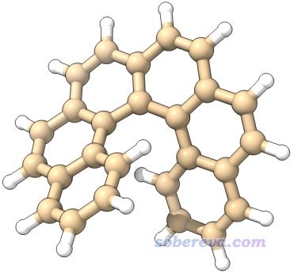

我们来绘制一下以He元素作为探针原子的范德华势等值面图。先把Multiwfn目录下的settings.ini文件里的ivdwprobe设为2（代表周期表第2号元素，He），然后启动Multiwfn，输入  
examples\helicene.xyz  
20  //弱相互作用的可视化分析  
6  //可视化范德华势  
3  //高质量格点（因为这个体系不算小，而且范德华势计算很快，所以用高质量格点。用中等质量格点的话等值面会比较粗糙）

在进入范德华势计算功能的时候屏幕上显示了当前用的范德华参数值，参数在UFF原文里也可以查到  
Element of probe atom: He  
 UFF atomic well depth:     0.056 kcal/mol  
 UFF atomic radius:         1.181 Angstrom

格点数据一眨眼就算完了，之后会看到一些选项，可以直接可视化交换互斥势、色散势、范德华势，也可以将它们导出成cube文件。通常来说单独考察交换互斥势和色散势意义不大，只有它们的加和，即范德华势，才比较有实际化学意义。我们选择选项3显示范德华势的等值面，把Isovalue改为0.6（当前情况下单位是kcal/mol），恰当旋转图像，再用Other settings - Set atom label type要求只显示元素名，之后就可以看到下图(a)，绿色和蓝色分别为正值和负值部分的等值面。等值面的形状是显著受Isovalue值的影响的，当前用的0.6能较为清楚地展现范德华势的主体分布特征。

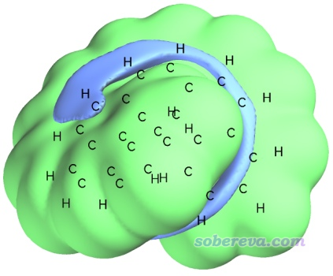

如上所示，在距离原子较近的区域范德华势总是由交换互斥势占主导（如同距离原子较近的区域静电势总是由核电荷的贡献占主导），因此这部分通常没什么可分析的，分析范德华势主要关心的是负值区域，即色散吸引势对应的负贡献大于交换互斥势产生的正贡献的部分，探针原子也只能结合到这样的区域。由上可见，负值等值面只在螺烯的沟壑区域出现，这体现出探针原子He，或者更广义地说各种小分子（尤其是低极性的、不涉及pi氢键之类复杂情况的），倾向于结合到螺烯的沟壑区域。为什么这个区域范德华势为较为明显的负值很容易理解，因为在这样的地方同时有多个周围的碳原子对其有明显的色散吸引作用。

为了让负值区域看得更清楚，我们可以只显示负值区域。具体做法是在Multiwfn图形窗口里点击Show both sign，然后把等值面数值设为-0.6，这样负值区域就通过绿色显示出来了。如果想让其以蓝色显示，可以在菜单里选Isosurface style - Exchange positive and negative colors来让正、负等值面颜色交换。我们还可以显示出分子的范德华表面，这样往往更便于考察，也就是把Ratio of atomic size设为4.0，此时原子球半径正对应于范德华半径。现在的图像如下所示，明显比上面的图更容易分辨负值等值面的位置了

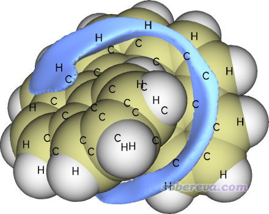

如上获得的范德华势是否真的能和一些现实情况相对应？大家感兴趣的话可以用量子化学程序做一个螺烯+He复合物体系的几何优化，看看都能得到哪些极小点结构、结合能都是多少。由于极小点可能有很多，建议用《genmer：生成团簇初始构型结合molclus做团簇结构搜索的超便捷工具》（<http://bbs.keinsci.com/thread-2369-1-1.html>）文中介绍的genmer+molclus的方式做二聚体构型搜索，以确保不会因为优化用的初始结构考虑不全面而有所遗漏。

为了考察范德华势的分布与实际中He在螺烯附近的动力学行为是否有相关性，笔者对螺烯+He复合物体系用xtb程序在便宜的GFN0-xTB级别下做了2500 ps的动力学模拟。由于二者间的范德华作用很弱，为了模拟过程中He不会因为热运动跑飞了，因此动力学是在很低温（10 K）下做的。做这种模拟很容易，参考《使用Molclus结合xtb做的动力学模拟对瑞德西韦(Remdesivir)做构象搜索》（<http://bbs.keinsci.com/thread-16255-1-1.html>）里关于xtb做动力学的简要介绍，笔者在北京科音高级量子化学培训班里会深入全面讲从头算动力学模拟，其中也包括这个例子。动力学模拟得到的结果如下

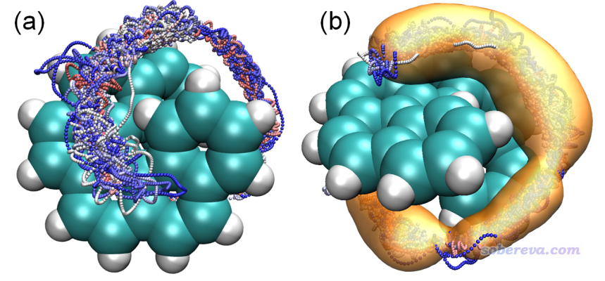

上图(a)是在VMD程序里将所有帧一起叠加显示出来的效果（螺烯部分已经做了align以消除其平动和转动），并且根据模拟时间按照蓝-白-红进行着色。图(b)是通过VMD的volmap插件计算的空间分布函数(sdf)的等值面。从上图可以清楚地看到，在模拟过程中He原子在螺烯的缝隙反复来回穿梭，这是为什么不同颜色的小圆点交错分布在一起。从sdf等值面图可以更清楚地看到模拟过程中He主要出现的空间范围，将之与范德华势等值面图相对照会发现He的主要出现位置和范德华势为明显负值的区域高度吻合，二者的等值面形状基本一致，因此这个例子充分说明通过考察范德华势可以便利、直观地估计其它分子由于范德华作用倾向于被吸附到当前体系的什么区域，显然这种图对于研究范德华作用主导的物理吸附非常有价值。

PS：有范德华势论文的读者问我怎么绘制上面那种粒子位置叠加图，我在这里做了详细说明：<http://sobereva.com/wfnbbs/viewtopic.php?id=331>。

## 4 实例2：18碳环

### 4.1 范德华势等值面图的绘制和极值点分析

对18碳环这个几何和电子结构十分特殊的体系，笔者开展了大量研究，汇总见<http://sobereva.com/carbon_ring.html>，对于其分子间相互作用特征笔者专门发表了一篇论文做了深入探讨，内容介绍见《全面探究18碳环独特的分子间相互作用与pi-pi堆积特征》（<http://sobereva.com/572>），非常建议阅读，其中就充分利用了范德华势讨论了18碳环与小分子作用的本质。在前述的范德华势的论文里笔者还基于不同探针原子分别绘制了18碳环的范德华势等值面图，如下所示，其中只将最重要的负值等值面显示了出来。图中黄色小球对应于范德华势全空间中的极小点位置。图上将等值面数值和极小点数值都标注了出来，单位为kcal/mol。

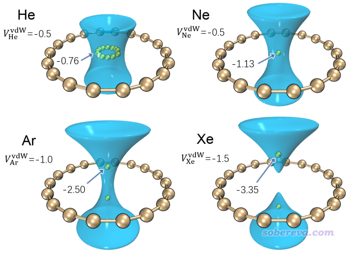

从上图(a)、(b)中可以看到，以He或者Ne为探针的时候，范德华势为明显负值的区域（小于-0.5 kcal/mol）是在环中央及其上方和下方的一定区域。以He为探针的情况，极小点在体系中央连成一个环，数值都是-0.76 kcal/mol，而以Ne为探针的情况，极小点在体系正中央，而且比He的情况更负一些。至于为什么会出现这样的情况，在范德华势的论文里笔者做了详细讨论，推荐大家看看。简单来说，从当前图上可以判断出18碳环对Ne的吸附能强于He，并且都是将它们吸附于环的中央。再来看以Ar为探针原子的情况，由于Ar的势阱深度参数更大，为了便于从等值面上观察范德华势的主体分布特征，上图将其等值面数值设为了比He/Ne更负的-1.0 kcal/mol。由图可见此时范德华势极小点不在体系中央了，而是对称分布在环的上方和下方，这是由于Ar与碳的范德华作用曲线的平衡位置比环的半径更大所致。再看以Xe为探针原子的情况，其极小点偏离环中央更远了，等值面的负值区域甚至在环中央处断开了，这暗示在环中央处要么范德华势为正，要么就是比等值面数值（-1.5 kcal/mol）更小的负值。造成这种现象的原因在于Xe比Ar的范德华半径明显更大。对于甲烷这样的分子，其整体半径明显大于Ne原子，因此可以预期当18碳环吸附它的时候，甲烷的出现位置应当像Ar/Xe的范德华势的极小点一样，在碳环的上/下方出现。笔者用量子化学方法做过18碳环与甲烷复合物的几何优化，结果确实是如此。PS：分子的半径可以用Multiwfn很容易地计算，可参考《谈谈分子半径的计算和分子形状的描述》（<http://sobereva.com/190>）和《使用Multiwfn计算分子的动力学直径》（<http://sobereva.com/503>）。

下面来看如何绘制上面的图，这需要借助VMD，可在<http://www.ks.uiuc.edu/Research/vmd/>免费下载，笔者用的是1.9.3版。这里就绘制以Ar为探针原子的情况。先将settings.ini里的ivdwprobe设为18，然后启动Multiwfn，输入  
examples\C18.xyz  //这是在wB97XD/def2-TZVP下优化得到的结构  
20  //弱相互作用的可视化分析  
6  //可视化范德华势  
3  //高质量格点  
6  //将范德华势格点数据导出为当前目录下的vdW.cub

之后重启Multiwfn，依次输入  
vdW.cub  
17  //盆分析  
1  //生成盆  
2  //基于内存里的格点数据做盆分析

盆分析会把格点数据的正值区域的所有极大点和负值区域的所有极小点位置都找出来（统称吸引子，attractor），并且确定三维空间每个点都归属于哪个吸引子，因此每个吸引子都有一个对应的盆（basin）。如果想看看吸引子和对应的盆的分布的话，可以进入选项0，图形窗口显示的图像如下所示

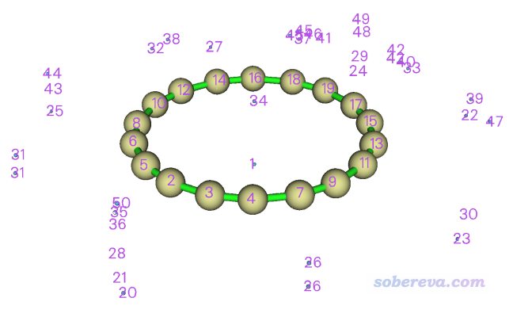

图中蓝色小球对应极小点位置，其中1、34号吸引子明显就是我们要关注的全局最负的两个点的位置。在每个碳原子中央也有吸引子，这对应的是范德华势的极大点，显然在每个原子的原子核位置必然会有一个。在环附近还有一大堆乱七八糟的吸引子，这些不用去管，是由于数值噪音所致的没有化学意义的吸引子。

把图形窗口关闭。接下来我们把吸引子导出成VMD可以认的格式，以便于在VMD里绘制。输入以下命令  
-4  //将吸引子导出  
2  //导出为当前目录下的attractors.pqr  
pqr是生物体系分子模拟领域常用的格式，是文本文件。如Multiwfn在屏幕上的提示所示，这个文件里的残基号对应自动归簇后的吸引子的序号，简单来说就是你在上图中看到的序号。这个文件的倒数第三列（pqr格式原本用来记录原子电荷的列）是吸引子处的格点数据的数值。这个文件里对应1、34号吸引子的是这两列  
HETATM    1  C   ATT A   1      -0.013   0.048  -1.133  -0.25018300E+001 1.00 C   
 HETATM   35  C   ATT A  34      -0.013   0.048   1.113  -0.25016000E+001 1.00 C    
可见它俩的范德华势的数值都是-2.50 kcal/mol，和我在前面的图里用箭头标注的一致。

现在我们用VMD将等值面和吸引子都绘制出来。怎么用VMD非常简单地把cub文件绘制成效果极好的等值面图我在《在VMD里将cube文件瞬间绘制成效果极佳的等值面图的方法》（<http://sobereva.com/483>）中已经详细说了，细节不再累述。按文中的做法把VMD配置好，把vdW.cub挪到VMD目录下，启动VMD后输入cub vdW 1，就会把vdW.cub对应的函数值为+1和-1的等值面分别用绿色和蓝色显示出来。之后在Graphics - Representation里看到有三项，分别对应显示分子结构、显示正值等值面、显示负值等值面。双击第二项令其成为红色，则正值等值面部分就不显示了。然后我们把之前导出的attractors.pqr拖入VMD main窗口载入，在Representation界面里将Selected Atoms设为resid 1 34，这样就只有1和34号吸引子被显示了。再把Sphere Scale设为0.1减小球的尺寸，把Coloring Method设为Color ID，在旁边选Yellow。之后，在Graphics - Materials里把Glossy材质（这是目前显示等值面正在用的材质）的Opacity减小到0.4，使得等值面透明度更高避免遮挡吸引子。现在在VMD图形窗口中看到的图就和本节一开始的图里面的(c)一致了。

**2022-Jul-5重要补充**：后来Multiwfn支持了对范德华势做拓扑分析，找范德华势极小点比用盆分析强得多得多，不仅精度高得多，而且不像盆分析那样计算出的格点数据会占很大内存，还不像盆分析那样由于数值噪音导致产生多余的极小点，因此强烈建议用拓扑分析代替上文的盆分析。具体做法见《使用Multiwfn对静电势和范德华势做拓扑分析精确得到极小点位置和数值》（<http://sobereva.com/645>）。

### 4.2 范德华势曲线图的绘制

为了透彻地研究垂直于环方向且穿过环中心的范德华势的具体变化情况，可以用Multiwfn将范德华势在这条直线上的变化绘制成曲线图。下面这张图是我原文里的，原点位置是环中心处，可见此图把基于不同探针原子在不同位置上的范德华势差异展现得非常清楚，图中还标出了极大点位置。

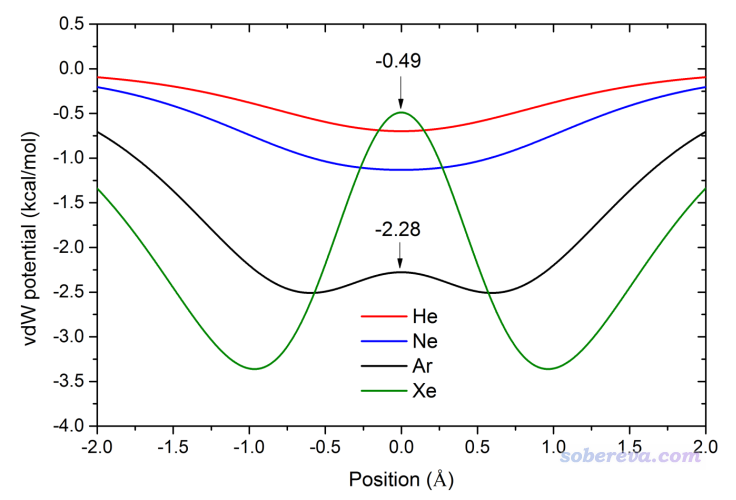

下面我们用Multiwfn绘制以Ar为探针原子的这种图。将settings.ini里的ivdwprobe设为Ar的原子序数18，并且把iuserfunc设为92，使得用户自定义函数对应范德华势。然后启动Multiwfn，输入以下命令  
examples\C18.xyz  
3  //绘制曲线图  
100  //绘制用户自定义函数（目前对应范德华势）  
2  //自定义两个端点的坐标  
0,0,-6,0,0,6  //第一个点为(0,0,-6) Bohr，第二个点为(0,0,6) Bohr。由于体系处在XY平面上，中心在(0,0,0)位置，因此这样的定义的线段垂直于环且穿过环中心

马上看到下图，和前面的图里Ar的情况一致

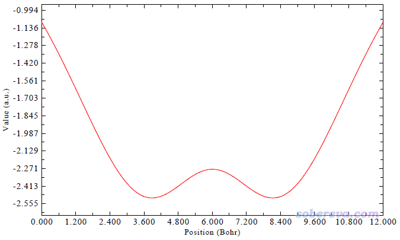

把图像关闭后，选择2就可以把曲线数据导出成为文本文件。我论文里的图是将不同探针原子的情况都这样产生曲线数据的文本文件，再把里面的数据都导入到Origin里一起绘制出来的。

### 4.3 计算原子对范德华势的贡献

在我的范德华势的原文里还基于UFF力场考察了He原子与18碳环的各个原子的相互作用，由此可以展现各个原子对特定位置范德华势的贡献，如下所示，黄球对应于被考察的位置

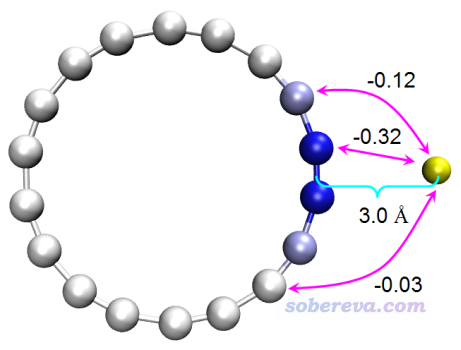

用Multiwfn做这个分析很容易，只要自己建立个18碳环和He原子的复合物结构文件（He的坐标设为被考察的那个点的坐标），按照《使用Multiwfn做基于分子力场的能量分解分析》（<http://sobereva.com/442>）里说的做法做个EDA-FF能量分解即可。具体来说，考察以A原子为探针原子时各原子对r处范德华势的贡献，等价于在r处增加一个A原子，然后用EDA-FF方法考察当前体系各原子与A的相互作用。

比如要考察以He为探针原子时18碳环的各原子对(6.5408,1.1533,0.0)埃处范德华势的贡献，就把examples\C18.xyz的第一行的18改成19，然后在末尾加上一行：He 6.5408 1.1533 0.0，另存为C18_He.xyz。不了解xyz格式者参看《谈谈记录化学体系结构的xyz文件》（<http://sobereva.com/477>）。启动Multiwfn，载入C18_He.xyz，然后输入以下命令  
21  //能量分解  
1  //基于力场的能量分解(EDA-FF)  
-1  //设置范德华作用计算方式  
1  //UFF力场  
2  //定义片段  
2  //有两个片段  
1-18  //第一个片段（18碳环）的原子序号  
19  //第二个片段（He原子）的原子序号  
-3  //要求在分析时输出片段间每一对原子的相互作用  
1  //开始分析

刹那间，屏幕上输出了以下信息  
 Interaction energy components between all fragments:  
                          Electrostatic   Repulsion   Dispersion     Total  
  Frag   1 -- Frag   2:         0.00         0.56        -1.51        -0.95  
这即是18碳环与He原子的相互作用能信息，注意单位是kJ/mol。由于我们没有设置原子电荷，因此原子电荷默认为0，故而两个片段间静电作用能为0。当前情况下，这里显示的0.56、-1.51、-0.95分别对应于在(6.5408,1.1533,0.0)的位置上，18碳环以He为探针原子时的交换互斥势、色散势和范德华势的值。

如屏幕上所示，两个片段间每一对原子对相互作用能的贡献都输出到了当前目录下的interatm.txt，内容如下  
  Atom_i  Atom_j  Dist(Ang) Electrostatic   Repulsive    Dispersion     Total  
 ...略  
      14     19:     3.934         0.00         0.01        -0.13        -0.12  
      15     19:     3.061         0.00         0.27        -0.59        -0.32  
      16     19:     3.061         0.00         0.27        -0.59        -0.32  
      17     19:     3.934         0.00         0.01        -0.13        -0.12  
      18     19:     5.089         0.00         0.00        -0.03        -0.03  
这里15、16号原子是18碳环中与He挨得最近的两个原子，19号原子就是He原子，可见C15-He和C16-He对范德华作用能的贡献都为-0.32 kJ/mol，换句话说，C15和C16对(6.5408,1.1533,0.0)的位置上以He为探针的范德华势的贡献都为-0.32 kJ/mol，这也正是前面图中我标记出的值。

在前面的图里我还根据18碳环上的原子对范德华作用的贡献进行了着色，越蓝说明贡献值越负（对结合起到越重要的作用）。怎么实现这点在《使用Multiwfn做基于分子力场的能量分解分析》里已经专门说了，就是导出pqr文件，在VMD里恰当设置一下着色即可，这里不再累述。

## 5 实例3：碳纳米管片段

此例考察碳纳米管片段，是一小截(6,6)手性的边缘用氢饱和的碳纳米管。下面这张图是我范德华势原文中的±0.7 kcal/mol等值面+极小点图，探针原子为Ne。这张图怎么绘制我就不再细说了，把前面的例子弄会了，再举一反三就能得到。此体系有三类范德华势极小点，图中分别用黄色、粉色和橙色小球显示以便区分。

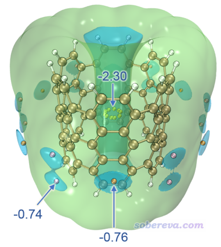

上图体现出范德华势在纳米管的内侧数值很负，最负达到-2.3 kcal/mol，即曰在UFF力场下Ne与这种纳米管结合能最多为-2.3 kcal/mol。而且最负的区域是管中央由黄色小球示意的那一小圈，因此如果把Ne放在比如管口的位置，肯定在优化过程中Ne会自发运动到黄球所示的位置。为什么管里面范德华势那么负很容易理解，毕竟周围围绕了一堆碳，肯定总的色散吸引作用很强。此体系在管外侧也有范德华势明显为负的区域，蓝色等值面展示的部分是相对来说最负的部分，由粉色和橙色标注的极小点处的数值可见最负的地方也不过只有-0.76 kcal/mol，所以管外侧靠范德华作用对分子的吸附能力远远低于管内侧。这张图再次充分展现出分析范德华势的价值，一张图就非常直观地把小分子（假定是无极性或弱极性）被物理吸附的最优位置体现出来了，而且还给出了具体数值便于定量对比不同区域的情况。

为了能更充分地把范德华势的分布细节展现清楚，最好绘制平行于管的范德华势的平面图，下面说一下绘制过程。先在这里下载这个纳米管片段的结构：<http://sobereva.com/attach/551/CNT66.xyz>，此体系中心在原点，管子顺着Z轴。将iuserfunc设为92，ivdwprobe设为10，然后启动Multiwfn，载入此文件，之后输入  
4  //绘制平面图  
100  //用户自定义函数  
1  //填色图  
[按回车用默认的格点数]  
0  //修改延展距离  
10  //10 Bohr  
3  //YZ平面  
0  //Z=0

之后把蹦出来的图关闭，做一下修改：  
1  //修改色彩刻度范围  
-1.5,1.5  //下限和上限  
4  //显示原子标签  
2  //用绿色  
17  //修改显示标签时原子与作图平面距离的阈值  
20  //20 Bohr。此值很大，可以确保所有原子标签都显示出来  
n  
8  //显示化学键  
14  //用棕色  
2  //显示等值线  
3  //修改等值线设置  
14  //修改负值的等值线风格  
20,20  //虚线的长度和间隔  
5  //线粗值（比默认的更粗）  
1  //保存等值线设置并返回  
19  //修改色彩变化方式  
8  //蓝-白-红  
选-1重新绘制图像，如下所示

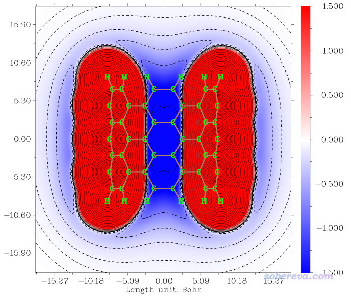

这张图漂亮的图展现出在距离原子较近的位置范德华势都为很大的正值，在管内部范德华势则相当负，在管的外围虽然也为负，但程度低多了。

由于上面的操作较多，我建议把当前绘图设置保存到文件里，以便以后需要重新绘制或者对作图效果稍作调整的时候不用在后处理菜单重新敲一遍调整作图设置的命令。具体来说，关闭图像后输入  
-4  //保存或读取所有作图设置到外部文件  
1  //保存到特定txt文件中  
CNT66_plane.txt  //输出的文件名  
在未来，重新用主功能4对此体系作图后，在后处理菜单选择-4，再输入2，输入CNT66_plane.txt的路径，就可以恢复之前的作图设定了。

## 6 实例4：卟啉

范德华势的分析和操作在前面已经充分讲解了。最后这个例子是我范德华势原文里的一个例子，这里只是简单说一下。下图是卟啉分子的以Ne为探针原子的范德华势的等值面图和截面图，可见这个体系范德华势最负的地方是在环中心的上方和下方。

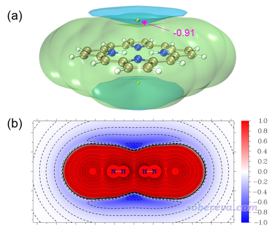

上面的范德华势图是否能与被吸附物的空间分布联系起来？笔者用xtb在GFN1-xTB理论下跑了1 ns动力学，控温在40 K（因为更高温度难以束缚住Ne），并且在模拟时加了球形限制势防止Ne偶尔因为热运动飞走。模拟过程的Ne的轨迹叠加图如下所示，给了两个视角，其中(b)还添加了空间分布函数的一个等值面以勾勒出主体分布区域。

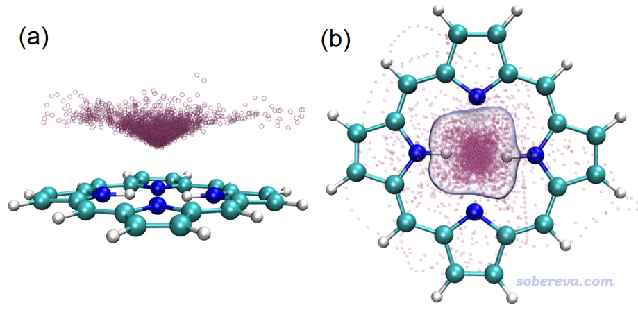

从上面两张图可以看到，范德华势为明显负值的区域呈现出锥形，轨迹叠加图当中粒子的分布也同样展现出锥形特征，而且越接近范德华势最负的位置粒子出现密度越大。此例又一次体现出范德华势可以用来预测和解释由范德华作用主导的单原子（或小分子）的动力学行为、分布特征。

## 7 实例5：周期性体系的范德华势分析--MOF

前面给出的例子都是分子体系的，从2021年2月更新的Multiwfn开始，还支持了周期性体系的范德华势分析，输入文件必须包含晶胞信息才行。Multiwfn支持的哪些格式包含晶胞信息，参见此文第2节：《使用Multiwfn非常便利地创建CP2K程序的输入文件》（<http://sobereva.com/587>）。这一节以一个MOF体系（金属有机框架化合物）作为例子进行演示，下面用到的此体系的cif晶体结构文件可在<http://sobereva.com/attach/551/MOF5.cif>下载，此体系的结构如下

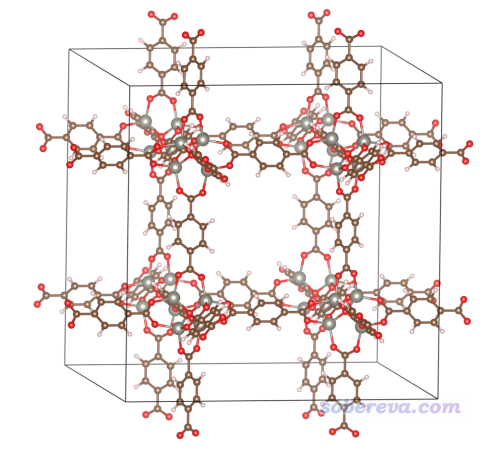

启动Multiwfn，然后输入  
MOF5.cif  //cif文件可以给Multiwfn提供结构和晶胞信息  
20  //图形化考察弱相互作用  
6  //范德华势  
9  //借助晶胞信息设置格点  
[按回车]  //使用0,0,0作为盒子原点  
[按回车]  /将晶胞边长作为盒子边长  
0.3  //格点间距(Bohr)  
算完后可以直接选3可视化范德华势等值面图。注意对于此例这种格子是正交的情况，可以在Multiwfn里正常观看等值面，但如果此体系的晶胞是非正交的，按照上面方式操作的话，格子也将是非正交的，这时候等值面图没法在Multiwfn里正常显示，必须导出cub文件后放到比如VMD或VESTA等支持非正交格子的程序里显示成等值面（或者在格点设定界面里用其它模式定义格点）。

为了得到比较好的图像效果，这里我们选6把范德华势的格点数据导出成vdW.cub，挪到VMD目录下，然后利用《在VMD里将cube文件瞬间绘制成效果极佳的等值面图的方法》（<http://sobereva.com/483>）里提供的脚本在VMD里显示出等值面。之后再做如下调节：  
• 在Graphics - Representation里把对应正值等值面的Rep删掉，并把对应负值等值面的Rep里的Isovalue设为-1.2  
• 在Graphics - Representation里把显示体系结构的那个Rep的Drawing method改为Licorice，把Bond Radius改为0.2  
• 在Graphics - Representation里新增一个Rep，显示方式设为DynamicBonds，Bond Radius改为0.2，Distance Cutoff改为2.0。这个Rep使得MOF中所有键都能被显示出来（原本有些金属和配位原子的键没有被识别出来）  
• 在VMD文本窗口里输入pbc box把盒子边框绘制出来  
• 在VMD Main窗口里选Display - Orthographic设为正交视角  
• 为了让图像层次感清楚，使用距离雾化效果：确保VMD Main窗口里的Display - Depth Cueing处于已选中的状态。然后进入Display - Display Settings，把Cue mode设为Linear，把Cue Start和Cue End分别设为1.5和3.5

此时看到的-1.2 kcal/mol的等值面图如下，-1.5 kcal/mol的等值面的图也一并给出了

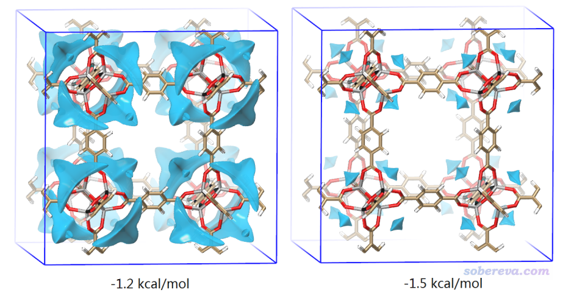

从上图可以非常清晰地看出，只考虑范德华作用的话，这种MOF最倾向于把小分子吸附到骨架的边角部分，因为如上图蓝色等值面所示，这种地方范德华势最负。大家也可以像之前的例子那样做盆分析获得范德华势极小点的具体数值。此例体现出范德华势也很适合用于多孔体系吸附问题的研究。

Multiwfn做周期性体系的分析以及VMD对周期性体系的显示还有更多的细节，在此文有所体现：《使用Multiwfn结合CP2K通过NCI和IGM方法图形化考察固体和表面的弱相互作用》（<http://sobereva.com/588>）。

## 8 总结

本文介绍了笔者对范德华势的定义以及在Multiwfn程序中的实现，并通过多个体系，全面介绍了范德华势如何分析、计算和绘制。范德华势在研究分子间相互作用、考察物理吸附、估计复合物稳定性等问题上有重要价值，这无疑是弱相互作用分析的工具箱里又一重要成员。借助Multiwfn对范德华势做计算、分析和绘制，可以轻松得到清晰、直观、漂亮又非常能说明问题的图像，笔者十分鼓励大家在实际研究中在恰当的场合多利用此方法进行分析。在范德华势的原文中笔者还有对范德华势的更多的介绍和分析讨论，很建议读者们一看。使用Multiwfn做范德华势分析的时候除了引用Multiwfn原文外也请注意引用范德华势的原文J. Mol. Model., 26, 315 (2020)。

值得在最后强调的是，范德华势和静电势在弱相互作用的研究上可以认为是互补的关系。范德华作用主导时应主要关注范德华势，静电作用主导时应主要关注静电势，两类作用都重要时不能忽略任意一方。本文的例子用的分子都是无极性分子，探针原子用的也都是稀有气体原子，因此静电相互作用完全可以忽略不计，而实际情况往往复杂得多，需要根据理论知识、化学直觉以及对范德华势原理的认识来判断什么时候能用范德华势说明问题、能说明什么，不要乱分析或者过度解释。还值得一提的是，相对来说，范德华势的分布特征不像静电势那么复杂，与范德华势关系最直接的是体系的几何结构，而静电势则对体系的电子结构很敏感（相对来说，电子结构对范德华势的影响弱得多得多），在分析时要注重各自的内在特点。

**2023-Jun-30补充**：《8字形双环分子对18碳环的独特吸附行为的量子化学、波函数分析与分子动力学研究》（<http://sobereva.com/674>）一文中介绍了笔者研究OPP分子吸附18碳环的机制，其中使用了范德华势进行分析，是个极好的通过范德华势研究实际问题的例子，非常建议阅读和引用此文。下图是OPP分子的以碳原子为探针的范德华势的-1.2 kcal/mol等值面，OPP大环区域的范德华势等值面的出现区域与18碳环被吸附后出现的位置理想重合，很好地揭示了为什么OPP能对18碳环产生稳定的吸附作用。

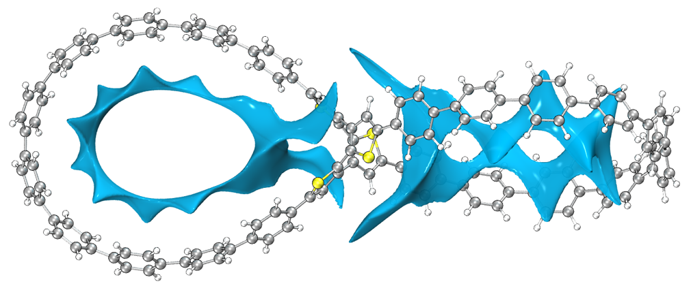

《全面揭示各种碳环与富勒烯之间独特的pi-pi相互作用！》（<http://sobereva.com/727>）深入浅出地介绍了笔者发表的全面系统研究碳环与富勒烯相互作用的文章，研究内容非常有意思，强烈推荐阅读此文。文中通过高精度量子化学计算指出碳环可以将两个富勒烯粘在一起，尤其是对于尺寸恰到好处的C22碳环来说。为了更好地理解这一点，文中绘制了两个富勒烯与一个碳环形成的三聚体中碳环产生的范德华势，下图左图和右图分别对应C22和C30碳环的情况。可见C22的范德华势明显为负的区域正好同时充分覆盖了两个富勒烯大约1/3的原子，特别直观地体现出这样的碳环为什么可以起到将两个富勒烯牢牢吸引到一起的“分子胶水”的作用。

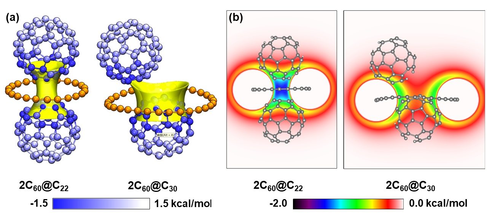
