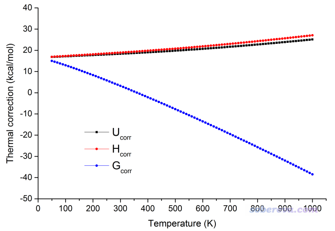
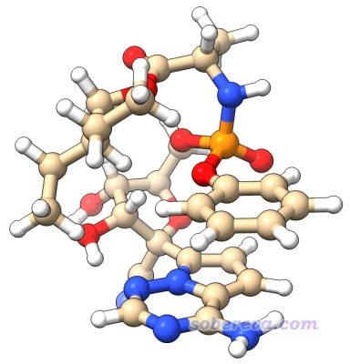

**使用Shermo结合量子化学程序方便地计算分子的各种热力学数据**

Using Shermo combined with quantum chemistry programs to conveniently calculate various thermodynamic data

文/Sobereva@[北京科音](http://www.keinsci.com/)

First release: 2020-May-19  Last update: 2025-Jun-18

## 1 前言

在日常量子化学研究中，计算焓、熵、自由能等热力学数据是最常涉及的问题。主流量子化学程序如Gaussian、ORCA等都自带了振动分析功能，在任务结束后会自动给出热力学数据。但是用这些程序来获得热力学数据往往并不方便，也有很多局限性。为了能令广大量子化学研究者在热力学数据计算方面极尽便利，笔者开发了Shermo程序，在此文将简要介绍并给出使用例子。

Shermo程序的原文已经发表，**使用Shermo程序计算热力学数据发表文章时请务必记得引用**，也十分建议大家阅读：  
Tian Lu, Qinxue Chen, Shermo: A general code for calculating molecular thermochemistry properties, *Comput. Theor. Chem.*, **12****00**, 113249 (2021) DOI: [10.1016/j.comptc.2021.113249](https://www.sciencedirect.com/science/article/abs/pii/S2210271X21001080)

上面的论文正式发表前也发在了论文预印本网站ChemRxiv上，见<https://doi.org/10.26434/chemrxiv.12278801>，没有权限访问上面的正式版文章的话也可以看这个预印版，内容基本一样，引用时请务必引用上面的正式版。

笔者之前还写过《Shermo：计算气相分子配分函数和热力学数据的简单程序》（<http://sobereva.com/315>）一文，那篇文章里介绍的Shermo是1.0版，是本文介绍的Shermo的前身。那个1.0版没有多大实际应用价值，功能很少，使用也很不方便。

## 2 Shermo的功能和特点

Shermo是一个免费的可以独立运行的计算分子热力学数据的程序，需要从量子化学程序振动分析的输出文件里读取信息来进行计算，计算时基于理想气体假设（各种量子化学程序给出的热力学数据也都是如此）。

Shermo有以下特点：  
• 可以读入五种最流行的量子化学程序的输出文件（可以是振动分析，也可以是优化+振动分析），包括Gaussian、ORCA、GAMESS-US、NWChem、xtb。还可以读入CP2K第一性原理程序的振动分析的输出文件  
• 可以计算所有常见的热力学量，包括内能、焓、熵、自由能、等压和等容热容、配分函数  
• 频率校正因子可以对ZPE、熵、升温对焓/内能的增加量、热容同时分别设置（不像Gaussian等程序里只能设一个全局校正因子）  
• 可以非常方便地对温度和压力进行扫描来考察热力学量随温度和压力的变化  
• 默认使用谐振近似模型考虑振动对热力学量的贡献（Gaussian等程序给出的热力学数据就是用的这个方法），同时还支持Truhlar、Grimme和Minenkov各自提出的准RRHO方法考虑低频振动的贡献，**对柔性分子、弱相互作用团簇等含有低频的体系可以得到明显更合理的结果！！！**  
• 可以给出一批构型/构象的Boltzmann分布比例和构象权重的热力学数据  
• 可以考虑浓度变化（如气相标准态到液相标准态）导致的自由能改变  
• 可以通过双击图标执行，也可以通过纯命令行方式运行，因此可以非常容易地嵌入到批处理脚本中，从而一次性计算一大批体系  
• Shermo不用安装也不用配置运行环境就能直接执行，不像Python脚本那样还得先装个Python，因此脑盲也能顺利使用  
• Shermo的输出信息极其简单易懂，而且手册写得特别详细，所有热力学量计算的基本原理和公式都在附录里介绍了

由上可见，Shermo在热力学数据计算方面既强大又灵活方便，可谓分子热力学数据计算离不开的工具。不仅把一些很繁琐的事情变得极其简单，还弥补了不少空白。此外，Shermo算的结果的可靠性在很多情况下也高于量子化学程序直接输出的结果。比如Gaussian不支持准RRHO方法，因此对于柔性大体系计算的自由能可能有多达几甚至十几kcal/mol的误差；ORCA判断点群时容易判断错，导致转动对称数识别错误，进而令转动对热力学量的贡献错误；GAMESS-US的转动常数计算得有问题，也因此导致转动对热力学量的贡献计算得有问题。

稍有一定经验的Gaussian用户都知道其自带的计算热力学数据的freqchk工具，如今有了Shermo之后freqchk就可以彻底扔了。不仅freqchk没有上述的Shermo的大多数优点，而且使用时还必须提供chk文件，如果没保留的话就瞎了，而且为了用freqchk还得装个Gaussian。而对于ORCA、GAMESS-US等其它程序用户，连类似freqchk的工具都没有，就更离不开Shermo了。

## 3 Shermo程序的使用简介

Shermo程序的细节看Shermo手册里的说明，这里我只是把Shermo程序最最基本的一些信息简单提一下。

Shermo程序的可执行文件和手册可以在程序主页<http://sobereva.com/soft/shermo>上下载。文件包里的Shermo.exe是Windows下的可执行文件，没有后缀的是Linux下的可执行文件。settings.ini是用来设置运行参数的文件。

Shermo程序既可以通过交互式方式运行，也可以通过命令行方式运行，后者便于将Shermo嵌入批处理脚本来进行批量计算。

在Windows下运行Shermo通常是双击Shermo.exe图标来启动，程序会先从当前目录下的settings.ini中读取运行参数并显示在屏幕上。输入文件路径后，程序就会从输入文件中读取电子能量、振动频率、原子质量等信息，然后开始计算热力学数据并输出。即便对于巨大体系，也是一瞬间就能算完。

在Linux下运行时，可以进入Shermo目录后输入./Shermo命令来启动。如果你想在任意目录下都能通过Shermo命令启动之并让其从Shermo目录下的settings.ini中载入运行参数，则在~/.bashrc文件里加入以下两行，之后重新进入终端即可。  
export PATH=$PATH:/sob/Shermo_2.0  
export Shermopath=/sob/Shermo_2.0  
（这里假设/sob/Shermo_2.0是Shermo可执行文件和settings.ini所在的目录）

如果在Linux下运行时你嫌编辑settings.ini文件麻烦，也可以直接指定运行参数，比如  
Shermo example/G16_H2CO_freq.out -T 350 -sclZPE 0.9806  
就代表用Shermo处理example/G16_H2CO_freq.out，温度设为350 K，ZPE校正因子设为0.9806。而其它没有明确指定的参数则使用当前settings.ini里设置的。

settings.ini文件里的选项在手册2.3节有详细介绍，在此文件自带的注释里也有简要介绍。诸如在settings.ini里看到有ilowfreq参数，就说明以命令行方式使用时可以用-ilowfreq [参数值] 的形式直接指定数值。

**在线使****用**：除了下载使用外，Shermo也可以通过[https://atomistica-online-shermo.anvil.app](https://atomistica-online-shermo.anvil.app/)网站在线使用，用户直接将计算化学程序的输出文件上传，根据情况对计算方式进行设置，就可以马上返回Shermo计算输出的结果。此在线平台是Stevan Armaković开发的，有使用相关问题请与之联系。通过此在线平台使用Shermo时，除了要引用Shermo原文外，还应同时引用平台作者的文章<https://doi.org/10.1080/08927022.2022.2126865>。

## 4 Shermo使用实例

下面通过一些实例介绍如何使用Shermo结合主流量子化学程序做各种热化学分析，在Shermo手册里还有更多更具体的例子。如果你对热力学量计算原理的知识极为匮乏，强烈建议先看看Shermo手册的附录了解基本常识，否则不可能正确理解结果的含义、在研究文章中正确地分析讨论。

如上所述，Gaussian、ORCA、GAMESS-US、NWChem、xtb、CP2K的振动分析或优化+振动分析的输出文件都可以给Shermo当输入文件用，具体说明参看Shermo手册2.4节。下面的例子我们就用一般量子化学研究者最常用的Gaussian来做优化+振动分析。

如果你急于体验Shermo，或者在看下面的文字时在某些操作上有困惑，可以看看这个简单的Shermo操作演示视频，一些常用的功能和用法都体现了：**《****使用Shermo程序计算各种热力学数据的基本操作演示》（**[**https://www.bilibili.com/video/BV1EN411X7b3/**](https://www.bilibili.com/video/BV1EN411X7b3/)**）**。

## 4.1 计算气相下甲醛的热力学数据

这里我们以一个简单分子甲醛为例计算350 K下的各种热力学数据。本例涉及到的输入输出文件可以在这里下载：<http://sobereva.com/attach/552/H2CO.zip>。

此例我们用B3LYP/6-31G*进行优化和振动分析，而用更好的CCSD(T)/cc-pVTZ级别计算电子能量。如果不理解这么做的原因，看《浅谈为什么优化和振动分析不需要用大基组》（<http://sobereva.com/387>）。简单来说，电子能量的误差主导了内能、焓、自由能的误差，而电子能量对计算级别的要求又显著高于优化和振动分析，所以电子能量的计算应当用更好的级别。

B3LYP/6-31G*下做优化和振动分析的输出文件是本文文件包里的H2CO_optfreq.out。基于优化后的结构再在CCSD(T)/cc-pVTZ下算单点能，输出文件是本文文件包里的H2CO_SP.out，从中可见电子能量是-114.3338033 a.u.。如果你不知道在哪里读电子能量，看《谈谈该从Gaussian输出文件中的什么地方读电子能量》（<http://sobereva.com/488>）。

这里我们先以交互式的方式执行Shermo。用文本编辑器编辑Shermo目录下的settings.ini文件，将里面的E=后面的值改为-114.3338033（如果用默认值0的话，电子能量会用从输入文件中读取的，因此对于本例来说将对应B3LYP/6-31G*级别的电子能量，这显然太糙了），注意等号和数值之间必须有个空格。再将T=后面的值设为350，代表在350 K下分析。为了得到更准确的结果，最好通过频率校正因子来消除由于谐振近似和计算级别自身原因带来的系统性误差，这点在《谈谈谐振频率校正因子》（<http://sobereva.com/221>）中有详细介绍，没看过者之后一定要看。B3LYP/6-31G*级别下的ZPE校正因子为0.9806，因此我们将sclZPE=后面的值设为这个值。当前级别下其它的频率校正因子（比如计算熵用的校正因子）都很接近与1，所以我们保持默认值1.0不变。此例我们用RRHO模型计算热力学量，这和Gaussian 16算热力学量的方式相同，因此把ilowfreq后面的值设为0（对于含有低频的情况明显不如Shermo默认用的准RRHO模型好，具体看下一节）。

保存settings.ini后启动Shermo，首先我们会看到以下运行参数信息，和我们在settings.ini中设的一致。为了确保计算结果无误，每次都应当注意检查这里。  
Running parameters:  
Printing individual contribution of vibration modes: No  
Temperature:     350.000 K  
Pressure:          1.000 atm  
Scale factor of vibrational frequencies for ZPE:        0.9806  
Scale factor of vibrational frequencies for U(T)-U(0):  1.0000  
Scale factor of vibrational frequencies for S(T):       1.0000  
Scale factor of vibrational frequencies for CV:         1.0000  
Low frequencies treatment: Harmonic approximation

然后将H2CO_optfreq.out的图标拖到Shermo窗口里，此时路径就自动产生了。按回车后首先看到分子的信息

                      ======= Molecular information =======  
Electronic energy:     -114.33380330 a.u.  
Spin multiplicity:  1  
Atom    1 (C )   Mass:   12.000000 amu  
Atom    2 (O )   Mass:   15.994910 amu  
Atom    3 (H )   Mass:    1.007830 amu  
Atom    4 (H )   Mass:    1.007830 amu  
Total mass:       30.010570 amu

Point group: C2v  
Rotational symmetry number:  2  
Principal moments of inertia (amu*Bohr^2):  
       6.335702       46.693826       53.029529  
Rotational constants relative to principal axes (GHz):  
   284.852589     38.650532     34.032760  
Rotational temperatures (K):   13.670753    1.854931    1.633313  
This is not a linear molecule

There are     6 frequencies (cm^-1):  
 1197.2  1279.7  1562.4  1848.9  2920.0  2972.3

以上信息中的电子能量是settings.ini中我们自己设的，而自旋多重度、原子质量、频率都是从输入文件中读取的。转动惯量以及与其相关的转动常数和转动温度都是Shermo基于原子坐标和原子质量计算出来的。点群和转动对称数是Shermo基于当前几何结构直接判断的。如果此处显示的信息有任何和实际不符，则接下来的计算结果将没意义，因此每次最好看一眼。

接下来程序分别输出了体系整体平动、整体转动、分子内振动和电子激发各自对内能(U)、焓(H)、熵(S)、自由能(G)、等容热容(CV)、等压热容(CP)和配分函数(q)的贡献。输出的格式紧凑、内容非常清晰易读，还用了多种单位输出以方便用户。只要你仔细看过Shermo手册的附录，或者参加过北京科音的初级或中级量子化学培训班（见<http://sobereva.com/355>）并仔细复习过，就肯定能轻易看懂这些信息，所以我就不再多说了。CV和CP的差异，以及H与U的差异仅来自于平动的贡献，因此只有平动部分是将它们分别输出的。

                         ======= Translation =======  
Translational q:    5.810322E+030     q/NA:    9.648265E+006  
Translational U:      4.365 kJ/mol      1.043 kcal/mol  
Translational H:      7.275 kJ/mol      1.739 kcal/mol  
Translational S:    154.502 J/mol/K    36.927 cal/mol/K  -TS:   12.92 kcal/mol  
Translational CV:    12.472 J/mol/K     2.981 cal/mol/K  
Translational CP:    20.786 J/mol/K     4.968 cal/mol/K

                         ========= Rotation ========  
Rotational q:    9.016795E+002  
Rotational U:      4.365 kJ/mol      1.043 kcal/mol    =H  
Rotational S:     69.045 J/mol/K    16.502 cal/mol/K   -TS:   5.776 kcal/mol  
Rotational CV:    12.472 J/mol/K     2.981 cal/mol/K   =CP

                         ======== Vibration ========  
Vibrational q(V=0):    1.014765E+000  
Vibrational q(bot):    3.094088E-011  
Vibrational U(T)-U(0):     0.227 kJ/mol     0.054 kcal/mol   =H(T)-H(0)  
Vibrational U:     69.323 kJ/mol     16.569 kcal/mol    =H  
Vibrational S:      0.770 J/mol/K     0.184 cal/mol/K   -TS:   0.064 kcal/mol  
Vibrational CV:     3.509 J/mol/K     0.839 cal/mol/K   =CP  
Zero-point energy (ZPE):     69.10 kJ/mol,     16.51 kcal/mol    0.026317 a.u.

                    ======== Electron excitation ========  
Electronic q:    1.000000E+000  
Electronic U:      0.000 kJ/mol      0.000 kcal/mol    =H  
Electronic S:      0.000 J/mol/K     0.000 cal/mol/K   -TS:   0.000 kcal/mol  
Electronic CV:     0.000 J/mol/K     0.000 cal/mol/K   =CP

振动对内能的贡献（Vibrational U）一方面来自于零点能，即ZPE，另一方面来自于从0 K升至当前温度过程中导致内能的增加量，即U(T)-U(0)，它们都单独输出了。

最后，程序输出了总结果。配分函数是所有上面四部分贡献的乘积，各种热力学校正量（Thermal correction）和熵都是上面四部分贡献的加和：

                          ===========================  
                          ========== Total ==========  
                          ===========================  
Total q(V=0):       5.316403E+033  
Total q(bot):       1.621008E+023  
Total q(V=0)/NA:    8.828094E+009  
Total q(bot)/NA:    2.691746E-001  
Total CV:      28.453 J/mol/K       6.800 cal/mol/K  
Total CP:      36.767 J/mol/K       8.788 cal/mol/K  
Total S:      224.317 J/mol/K      53.613 cal/mol/K    -TS:    18.765 kcal/mol  
Thermal correction to U:     78.053 kJ/mol     18.655 kcal/mol   0.029729 a.u.  
Thermal correction to H:     80.963 kJ/mol     19.351 kcal/mol   0.030837 a.u.  
Thermal correction to G:      2.452 kJ/mol      0.586 kcal/mol   0.000934 a.u.  
Electronic energy:       -114.3338033 a.u.  
Sum of electronic energy and ZPE, namely U/H/G at 0 K:       -114.3074860 a.u.  
Sum of electronic energy and thermal correction to U:        -114.3040744 a.u.  
Sum of electronic energy and thermal correction to H:        -114.3029660 a.u.  
Sum of electronic energy and thermal correction to G:        -114.3328693 a.u.

上面也给出了电子能量与热力学校正量的加和，**这就是我们平时经常考察的热力学量了**，包括内能、焓、自由能。比如此处的Thermal correction to G代表当前我们设的350 K时的自由能的热校正量，它与电子能量的加和就是350 K下的自由能，即Sum of electronic energy and thermal correction to G后面的值。而电子能量与ZPE相加，得到的是0 K下的内能/焓/自由能，即Sum of electronic energy and ZPE后面的值。

如果你想考察各个振动模式对各种热力学量的贡献，从而更深层地了解热力学量的本质、探讨各振动模式对其的影响，就把settings.ini里的prtvib后面的值改为1（输出到屏幕上）或-1（输出到当前目录下的vibcontri.txt里）。这里我们将之设为-1，然后重新运行Shermo来处理H2CO_optfreq.out，得到的vibcontri.txt内容如下：

 Note: The wavenumbers shown below are unscaled ones  
   
  Mode  Wavenumber    Freq        Vib. Temp.    q(V=0)        q(bot)  
          cm^-1        GHz            K  
    1    1197.25   0.35893E+05     1722.57    1.00734069    0.08599170  
    2    1279.68   0.38364E+05     1841.18    1.00521977    0.07243629  
    3    1562.40   0.46840E+05     2247.95    1.00162690    0.04036762  
    4    1848.86   0.55428E+05     2660.10    1.00050056    0.02237882  
    5    2920.03   0.87540E+05     4201.26    1.00000612    0.00247431  
    6    2972.29   0.89107E+05     4276.46    1.00000494    0.00222226  
   
  Mode  Wavenumber     ZPE      U(T)-U(0)    U(T)      CV(T)       S(T)  
          cm^-1      kcal/mol   kcal/mol   kcal/mol  cal/mol/K  cal/mol/K  
    1    1197.25     1.67835    0.02513    1.70348    0.35594    0.08633  
    2    1279.68     1.79391    0.01910    1.81301    0.28854    0.06491  
    3    1562.40     2.19024    0.00727    2.19750    0.13358    0.02399  
    4    1848.86     2.59181    0.00265    2.59445    0.05749    0.00855  
    5    2920.03     4.09340    0.00005    4.09345    0.00175    0.00016  
    6    2972.29     4.16668    0.00004    4.16672    0.00147    0.00013

以上信息输出了全部6个振动模式的波数、频率、振动温度，以及它们对配分函数、ZPE、从0 K升温至当前温度令内能的增加量（也等价于令焓的增加量）、内能、等压热容和熵的贡献。由数据可见频率越低的振动模式对U(T)-U(0)、CV(T)、S(T)的贡献越大，而频率越高的振动模式对ZPE和U(T)的贡献越大（注：ZPE占U(T)的大头）。

如果大家想考察其它温度或压力下的热力学数据，相应地修改一下settings.ini里的T和P，重新运行即可。使用Shermo还可以非常容易地对温度和压力进行扫描。比如当前我们想考察各种热力学量从50 K到1000 K之间的变化，就把settings.ini里的T=后面的值改为50,1000,10，这里10代表扫描步长。启动Shermo后还是载入H2CO_optfreq.out，算完后当前目录下就有了scan_UHG.txt和scan_SCq.txt，前者包含了U、H、G以及它们与电子能量的加和，后者包含了S、热容、配分函数。例如scan_SCq.txt的前几行内容如下：

 Unit of S, CV and CP is cal/mol/K, q(V=0)/NA and q(bot)/NA are dimensionless  
   
     T(K)     P(atm)      S         CV        CP       q(V=0)/NA      q(bot)/NA  
    50.000     1.000    37.961     5.962     7.949   3.623341E+006   8.877273E-068  
    60.000     1.000    39.411     5.962     7.949   7.513361E+006   3.415672E-055  
    70.000     1.000    40.636     5.962     7.949   1.391943E+007   3.668237E-046  
    80.000     1.000    41.697     5.962     7.949   2.374593E+007   2.337871E-039  
...略

这两个文件可以非常容易地作图。比如把scan_UHG.txt的前几行删掉后，就可以直接拖入Origin程序导入其中。将温度作为X轴，内能、焓、自由能的热校正量作为Y轴，绘制成的Line+Symbol图如下所示

之所以温度越高焓的热校正量（Hcorr）比内能的热校正量（Ucorr）高得越多，是因为前者比后者多个RT，显然T越大差异就越大。之所以体系温度越高自由能的热校正量（Gcorr）越低，并且一开始为正，温度较高后甚至变成了负值，这是因为G里面有-TS项，而熵必定是正值。

类似地，对压力也可以进行扫描，只要将settings.ini里的P也指定下限、上限、步长即可。如果对温度和压力都设成设了上下限和步长，则Shermo会进行二维扫描。

如果你想在Linux下纯粹靠命令行执行而不改settings.ini文件，对于跑当前的温度扫描例子来说，在按照本文第3节说的修改过~/.bashrc后，运行以下命令即可，非常方便：  
Shermo H2CO_optfreq.out -T 50,1000,10 -sclZPE 0.9806 -E -114.3338033

## 4.2 计算水环境中柔性分子瑞德西韦的热力学数据

### 4.2.1 前言

瑞德西韦这个体系我之前在《使用Molclus结合xtb做的动力学模拟对瑞德西韦(Remdesivir)做构象搜索》（<http://bbs.keinsci.com/thread-16255-1-1.html>）中有过介绍和研究，此物对于治疗COVID-19有较好作用，这里我们计算一下它的热力学数据。这个体系的柔性非常大，因为它有很多可旋转的键。对于这样的体系，在计算时需要做特殊考虑：

(1)必须使用准RRHO（quasi-RRHO）模型代替RRHO模型。RRHO（rigid-rotor harmonic oscillator）是指用谐振近似模型考虑体系内部运动对热力学量的贡献，这也是Gaussian、GAMESS-US等绝大多数量子化学程序计算热力学数据时候用的模型。RRHO对于甲醛那种刚性体系没问题，只要考虑了频率校正因子后结果通常就是比较准确的。但是对于柔性较大的体系，RRHO就可能造成明显误差了。因为柔性体系往往有很多低频模式（一般是指谐振频率在100 cm-1以下的那些振动模式），RRHO模型计算的它们对热力学量的贡献不可靠，而且频率越低越不适用，尤其是计算出来的熵的误差很大。为了解决这个问题，Truhlar课题组的文章（比如J. Phys. Chem. B, 115, 14556 (2011)）通常是将低于100波数的频率人为改为100波数后再计算各种热力学数据。虽然这么做看起来任意性太强，物理意义不太清楚，但从实效来说比起不做这种处理通常明显更为合理。另一种是Grimme在Chem. Eur. J., 18, 9955 (2012)中提出的做法，他将RRHO模型与自由转子模型算的振动对熵的贡献进行了线性插值，此时约200波数以上的振动模式的结果和RRHO模型算的基本一样，而约50波数以下的振动模式的结果和自由转子模型算的基本一样，而在约50~200波数范围内在RRHO和自由转子模型的结果间平滑过渡。Minenkov在J Comput Chem., 44, 1807 (2023)中还建议将这种插值方式也同时应用到振动对内能的贡献上，这样对低频的热力学考虑更一致，而且实测发现对内能的计算精度有所改进。Truhlar、Grimme、Minenkov这三种方法都可以比RRHO显著更好地描述低频模式对热力学量的贡献，都可以称为准RRHO或modified RRHO (mRRHO)，在Shermo中都支持，分别对应ilowfreq=1、2、3。Grimme的做法明显比Truhlar更好，改为Minenkov的做法还可能有更进一步提升。算柔性体系的时候应当用Grimme或Minenkov的准RRHO（我更推荐后者），而算刚性体系的情况，由于没有低频，用准RRHO还是RRHO都可以，结果几乎没区别。关于这个问题更多的介绍和讨论看Shermo的手册和前述的Shermo的论文。如今准RRHO已被越来越多的做理论计算的人所了解，算含有低频的柔性体系、弱相互作用体系如今还用RRHO的话很可能被内行审稿人批评。

(2)应当考虑热力学量的构象平均。柔性体系往往有很多热可及构象，也就是在当前温度下，有不止一个构象出现比例明显大于零。出现比例可以按照Boltzmann分布公式根据构象之间的相对自由能计算，见《根据Boltzmann分布计算分子不同构象所占比例》（<http://sobereva.com/165>），而这些构象的结构可以通过构象搜索程序获得，其中我最推荐Molclus，免费灵活方便准确，详见其主页<http://www.keinsci.com/research/molclus.html>。实际体系的电子能量、内能、焓应当根据分布比例对各个构象计算结果进行权重平均，而熵在权重平均的基础上还要额外考虑构象熵（表达式见手册。这是由于构象间可以相互变换所带来的额外的熵）。自由能就用权重平均的焓和熵根据G=H-TS关系照常来算即可。构象平均问题在Shermo中可以很方便地考虑，只需要提供个构象列表文件即可。

对于分子团簇来说，比如水的四聚体，会有多种热可及构型，计算热力学量的时候也需要对各个构型按上述方式考虑。Molclus也可以方便地对分子团簇做构型搜索，见《genmer：生成团簇初始构型结合molclus做团簇结构搜索的超便捷工具》（<http://bbs.keinsci.com/thread-2369-1-1.html>）里面的说明和例子。

### 4.2.2 计算单个构象的热力学数据

下面，我们首先对已知的瑞德西韦在水中最稳定的构象计算标况下各种热力学数据，此结构如下：

此体系的优化和振动分析是用Gaussian在B3LYP-D3(BJ)/6-31G*在气相下做的，输出文件是Shermo文件包里的example目录下的G16_remdesivir_optfreq.out。之后通过ORCA在此结构上用更高级别的PWPB95-D3(BJ)/def2-QZVPP结合SMD溶剂模型表现的水环境计算了电子能量，输出文件对应example\ensemble\orcaSP00001.out，从中可看到电子能量为-2321.3677188 a.u.。我们将settings.ini里的内容做如下设置：  
E=后面的值改为-2321.3677188  
确认T=后面的值为298.15  
sclZPE=后面的值改为0.9806（DFT-D色散校正对频率校正因子的影响可忽略不计，所以还是用B3LYP/6-31G*的校正因子）  
ilowfreq=后面的值改为2，代表使用Grimme的准RRHO模型

启动Shermo并以G16_remdesivir_optfreq.out为输入文件，结果如下，这个就是瑞德西韦当前构象在水环境中的各种热力学量了  
Sum of electronic energy and ZPE, namely U/H/G at 0 K:      -2320.7549750 a.u.  
Sum of electronic energy and thermal correction to U:       -2320.7137635 a.u.  
Sum of electronic energy and thermal correction to H:       -2320.7128193 a.u.  
Sum of electronic energy and thermal correction to G:       -2320.8212651 a.u.

大家也可以算一下ilowfreq=后面的值为0，也就是用RRHO模型算的结果，你会发现自由能为-2320.8303608 a.u.，与上面的值相差多达5.7 kcal/mol。如果你具体分析的话会发现这主要来自于熵的差异，这充分说明对于较大柔性体系用RRHO模型会造成显著误差，因此就算不是为了图方便而是为了图精确，对于柔性大体系也不建议直接用Gaussian等程序直接输出的自由能。

需要注意的是，若想得到严格的溶液标准态（298.15K,1 M）情况下体系的自由能，还需要将上面给出的自由能-2320.8212651再加上1.89 kcal/mol（0.003012 a.u.），这对应气相标准态（298.15K,1 atm）→溶液标准态转化的自由能变，这点在《谈谈隐式溶剂模型下溶解自由能和体系自由能的计算》（<http://sobereva.com/327>）有专门说明，没看过者强烈建议仔细看看。

实际上Shermo直接就提供了计算浓度改变导致的自由能变的功能，都省得自己手动算了，Shermo手册里有详述和计算公式。简单来说，你只要把settings.ini里的conc设为目标浓度即可。比如当前settings.ini里T=350、P=2，若你设conc= 1.5M，则Shermo运行后不仅会输出(350K,2atm)状态的自由能，还会输出delta-G of conc. change，这就是从当前(350K,2atm)状态转变为(350K,1.5M)状态的自由能变，之后输出的Gibbs free energy at specified concentration就是(350K,1.5M)状态的自由能。显然，若设T= 298.15且conc= 1M，最后Gibbs free energy at specified concentration给你的就是液相标准态自由能。

注：上面计算溶液中的自由能的做法虽然简单，但在原理上来说其实不是最完美的，因为如《谈谈隐式溶剂模型下溶解自由能和体系自由能的计算》所述，SMD模型结合M05-2X/6-31G*级别算出来的溶解自由能才是最准的，而上面这种做法在本质上等于在其它级别（PWPB95-D3(BJ)/def2-QZVPP）下算了溶解自由能。不过这没有明显问题，从实际精度角度来讲结果完全可以接受。你若不怕麻烦，就是想用最理想的做法来算，就按照《谈谈隐式溶剂模型下溶解自由能和体系自由能的计算》里的过程，用Shermo先计算气相下自由能，再手动在M05-2X/6-31G*级别下计算溶解自由能，二者相加后再加上标准态改变的自由能变就行了。

### 4.2.3 计算构象分布比例和构象权重的热力学数据

在前述的《使用Molclus结合xtb做的动力学模拟对瑞德西韦(Remdesivir)做构象搜索》一文中得到了好多能量较低的瑞德西韦的构象，下面我们就取其中最低的三个构象，通过Shermo来计算它们的构象分布比例和构象权重的热力学数据。自由能更高的构象由于贡献很小，所以这里就不纳入考虑了。

我们创建一个后缀为.txt的文本文件，比如叫做list.txt，里面每一行指定一个振动分析或优化+振动分析的输出文件的路径。如果想用更好的电子能量，在路径后面加上分号作为分隔，后面写上电子能量数值即可。此例的文件是下面这样  
example\ensemble\gau00001.out;-2321.367718855799  
example\ensemble\gau00002.out;-2321.363532347723  
example\ensemble\gau00003.out;-2321.369898466825  
这里的电子能量可以从example\ensemble\中的以orca为开头的相应构象的PWPB95-D3(BJ)/def2-QZVPP级别下的单点能任务里读到。这里假定你通过双击Shermo图标启动，所以路径写的是相对于Shermo.exe的相对路径。

settings.ini还是用上面的例子的。启动Shermo后，将list.txt载入，马上就得到下面的输出

Processing example\ensemble\gau00001.out... (    1  of    3 )  
Processing example\ensemble\gau00002.out... (    2  of    3 )  
Processing example\ensemble\gau00003.out... (    3  of    3 )

#System       U               H               G             S          CV  
             a.u.            a.u.            a.u.        J/mol/K     J/mol/K  
   1    -2320.713764    -2320.712819    -2320.821265     954.971     657.837  
   2    -2320.709745    -2320.708801    -2320.817499     957.191     657.295  
   3    -2320.715999    -2320.715054    -2320.822180     943.341     654.902

System    1     Relative G=    2.401 kJ/mol     Boltzmann weight=  27.380 %  
System    2     Relative G=   12.289 kJ/mol     Boltzmann weight=   0.507 %  
System    3     Relative G=    0.000 kJ/mol     Boltzmann weight=  72.113 %

Conformation weighted data:  
Electronic energy:     -2321.369269 a.u.  
U:     -2320.715355 a.u.  
H:     -2320.714411 a.u.  
G:     -2320.822488 a.u.  
S:       951.727 J/mol/K    Conformation entropy:     5.132 J/mol/K  
CV:      655.718 J/mol/K  
CP:      664.032 J/mol/K

可见每个体系的热力学数据都分别给出了，然后给出了相对于自由能最低的那个体系的相对自由能，并由此计算出了玻尔兹曼权重（即分布比例）。最后给出了考虑构象平均的各种热力学数据，其中为了便于分析考察，构象熵也单独给出了（构象熵已经纳入到S:后面的数值了，不要再手动加进去）。由以上输出可见，第3个构象占了主导，而第1个构象也不可忽略，其中自由能最高的构象2的贡献可忽略不计。

如上一节所述，如果要得到溶液中1 M标准态的各个构象的以及构象平均的自由能，应当给这里输出的各个构象的自由能以及构象权重平均的自由能都手动加上1.89 kcal/mol。是否加上1.89 kcal/mol不影响构象间的相对自由能，也因此不影响玻尔兹曼分布比率。

值得一提的是构象分布比例对自由能很敏感，这就要求电子能量计算精度必须足够好，而且必须恰当考虑溶剂效应。如果在list.txt里只写路径而不写分号和电子能量，则电子能量会自动用那三个.out里读取的气相的B3LYP-D3(BJ)/6-31G*的结果，你会发现构象3的分布比例达到99.9%，严重不合理。

## 5 通过shell脚本调用Shermo做批处理

通过写shell脚本，可以调用Shermo非常容易地进行批处理。举个例子，当前目录下有一批.log文件，我们想计算它们标况下的热力学量，并且用0.975的ZPE校正因子，用Grimme的准RRHO方式考虑低频。假设你用的是Bash环境（比如用的Linux，或者在Windows下通过cmder等方式模拟Bash环境），那么可以创建一个文本文件比如叫getGall.sh，把以下内容写入到此文件中

#!/bin/bash  
rm -f getGall.txt  
for inf in *.log  
do  
echo Processing ${inf} ...  
echo ${inf} >> getGall.txt  
./Shermo ${inf} -sclZPE 0.975 -ilowfreq 2 | grep "Sum of electronic energy and thermal correction to G:" | cut -d: -f 2 >> getGall.txt  
done

假设getGall.sh和Shermo可执行文件就在当前目录下，给它们加上可执行权限后，输入./getGall.sh运行此脚本，运行后就在当前目录下得到了getGall.txt文件，里面记录了各个文件名以及Shermo计算出来的自由能值，如下所示  
Cs-atom-in.log  
        -705.4867512 a.u.  
Cs-ion-in.log  
        -705.2690829 a.u.  
Cs-ion-out.log  
        -705.2490426 a.u.  
K-atom-in.log  
       -1285.2091502 a.u.  
K-ion-in.log  
       -1284.9920128 a.u.  
K-ion-out.log  
       -1284.9852452 a.u.  
...略

上面这个脚本稍微有一点shell脚本编写常识和Linux下的命令的知识就能理解是如何工作的。大家稍微举一反三就能利用Shermo非常方便地实现各种批处理。如果你对shell脚本编写一无所知又想学习的话，强烈建议看看《详谈Multiwfn的命令行方式运行和批量运行的方法》（<http://sobereva.com/612>），里面由浅入深对脚本编写做了浅显易懂的介绍并给了很多实用例子。

## 6 固体的热力学量的计算

前面说的都是气相或溶液中的分子或团簇体系。如果你研究的体系是晶体或固体表面（包括表面吸附的情况）的热力学量，一般适合用CP2K第一性原理程序做优化、振动分析然后再将输出文件提供给Shermo算热力学量。这种情况特别要注意Shermo的settings.ini里的imode设置，它默认为0，如果设为1，则平动和转动对热力学量的贡献会被忽略，显然对于算晶体、固体表面的情况设成1是必须的，因为这样的体系不会像孤立的分子/团簇那样自由地平动和转动。在北京科音CP2K第一性原理计算培训班（<http://www.keinsci.com/KFP>）里面的“热力学量与能量相关属性的计算”的部分我专门给了将CP2K与Shermo结合算热力学量的详细的例子，十分推荐需要算这方面问题的人参加。

## 7 FAQ

Q1：为什么Shermo算出的热力学校正量和Gaussian输出的不一致？  
A: 要想Shermo输出的热力学校正量和Gaussian直接输出的严格一致，Shermo的settings.ini里的设定必须满足：  
• T=和P=分别与Gaussian计算时设的温度和压力一致（Gaussian默认的情况相当于T= 298.15、P= 1.0）  
• 频率校正因子和Gaussian设的一致（如果Gaussian计算时没用scale关键词指定，则sclZPE、sclheat、sclS都应当为1.0）  
• 热力学量计算模型和Gaussian一致。Gaussian用的是RRHO模型，对应于ilowfreq= 0  
如果以上都满足，结果还不一致，且体系结构有对称性，大概率是Gaussian的振动分析部分的代码对体系的点群判断有误，导致转动对称数判断不对，进而导致算出的转动对热力学校正量的贡献错误。而Shermo判断点群的功能明显更稳健，不一致的情况一律以Shermo为准（有多次用户问我此问题的时候我最后都发现俩程序对点群判断不一致，每次都是Shermo是正确的而Gaussian是错误的。可能是Gaussian判断点群的阈值过于严格）。

Q2：用Shermo算热力学量，是否需要在Gaussian里写temperature和pressure关键词？  
A：当然不需要！倘若需要的话上文自然就明确说了。热力学数据是Shermo自己算出来的，根本不是从Gaussian输出文件里读取的，显然gjf文件里写影响Gaussian输出的热力学量的temperature和pressure关键词没有任何意义、对Shermo计算结果没有任何影响。

Q3：单个原子怎么算热力学量？  
A：如果你的体系是单个原子，不要做优化，不仅没意义（根本就没有可以被优化的变量！），而且Gaussian等程序立马就会报错。对于单个原子就直接做个振动分析，把输出文件给Shermo用就完了。

Q4：Shermo的sclfreq参数设的是计算U(T)-U(0)的频率校正因子，为什么很多文献里给的是H(T)-H(0)的频率校正因子，这俩频率校正因子是一回事么？  
A：然是一回事，有最基本的热力学数据计算常识就能理解。H(0)和U(0)是相同的，H(T)和U(T)在理想气体近似下就相差个RT，这是平动部分贡献的，和振动没有任何关系，显然给H(T)-H(0)和给U(T)-U(0)用的频率校正因子完全是一码事。再次提醒，如果你缺乏热力学数据计算的常识知识，一定仔细看看Shermo程序手册的附录，搞清楚基本计算原理。顺带一提，北京科音中级量子化学培训班（<http://www.keinsci.com/KBQC>）的“热力学量与能量相关性质的计算”一节对热力学数据计算的背景知识有超级详细的讲解，十分推荐想深入学习的人参加。

## 8 总结&其它

本文介绍了Shermo程序的基本特点、基本用法，并且通过实例介绍了如何将Shermo用于实际问题。由例子可见通过Shermo来计算各种热力学数据前所未有地方便、灵活，以往需要很多操作步骤的麻烦过程都被简化到极致，而且还支持准RRHO模型以合理地考虑低频模式的贡献，因此Shermo是日常应用性量子化学研究中离不开的工具。

为了避免很多人嫌本文太长就不看了，本文写得比较简单，还有很多细节、更多用法说明、更多例子都没有给出，详见Shermo的手册。如果对Shermo有任何问题，看了手册还是不明白，欢迎在计算化学公社论坛（<http://bbs.keinsci.com>）的量子化学版求助。

顺带一提，Gaussian等程序还支持更复杂的计算模型，即非谐振计算、受阻转子，在某些情况下用这些处理结果能更准确一些，但耗时高得多得多，不适合用于中、大体系。这种情况的输出文件也不被Shermo所支持，Shermo只支持谐振近似的振动分析的输出文件（也即是各种量子化学程序做振动分析时默认的情况）。

如果你用的量子化学程序不是Shermo直接支持的，也照样可以用Shermo来分析。如手册所示，Shermo定义了私有格式shm，其中包含了计算热力学数据所需要的所有信息，格式非常简单。因此，如果你想让Shermo也能基于其它量子化学程序振动分析的数据来计算热力学量，自己写个小程序将输出文件转化成shm格式，再给Shermo当输入文件即可。

《谈谈有小虚频时热力学量的计算》（<http://sobereva.com/699>）非常推荐大家一读，里面顺带介绍了Shermo支持的QRRHO模型的一些特点，并且介绍了在Shermo里将小虚频视为实频的设置以及其实际意义。
