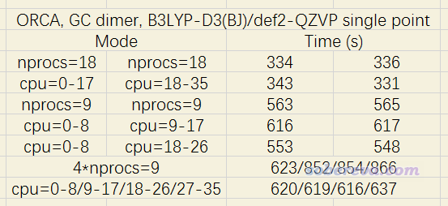
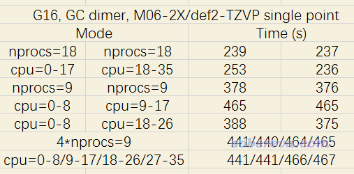

**通过设置CPU内核绑定降低ORCA同时做多任务的耗时**

Reducing time-consuming of multitasking of ORCA by setting CPU core binding

文/Sobereva@[北京科音](http://www.keinsci.com)   2020-Jun-1

## 1 前言

由于任何程序的并行效率都是随着核数增加而降低，当机子核数比较多的时候，比如有好几十核，而且又有许多任务要跑的时候，比起一个一个调用所有核心来跑，同时跑两个或者多个任务但是每个都用较少的核心数（总和不超过物理核心数），总耗时通常会更低。对于某些程序跑某些任务，甚至并行核数较少的时候反倒比核数较多的时候速度还更快。因此在核数较多的机子上，同时跑多个任务是很常见的事情。

然而，同时跑多个任务涉及到资源争抢问题，如果争抢得比较厉害，跑多个任务的效率会大打折扣，甚至可能还不如一个一个用所有核来跑。

如今很多程序在并行计算的时候都支持线程或进程与CPU内核的绑定，从而避免操作系统自动调度导致任务在不同CPU核心上频繁切换执行引起运行效率的下降，恰当绑定也可以有效降低CPU资源争抢问题。ORCA自身没有直接提供内核绑定的设置，但可以通过自行指定OpenMPI的运行选项来实现，本文就说说具体做法和实际效果。

## 2 CPU内核绑定的实现

### 2.1 在ORCA运行时使用内核绑定

ORCA在Linux下并行一般结合OpenMPI使用，本文也只说OpenMPI的情况。OpenMPI基于hwloc库来获取硬件信息，而hwloc库又要利用libnuma。只有在编译OpenMPI时提供了libnuma静态库，之后ORCA运行时才能借助OpenMPI的设置实现内核绑定。多数情况下系统里是没有装libnuma静态库的，对于CentOS 7.x，可以通过yum install numactl-devel命令来装上，之后再按照《量子化学程序ORCA的安装方法》（<http://sobereva.com/451>）里说的照常编译OpenMPI就可以了。

ORCA运行命令中可以加入传递给OpenMPI的mpirun的选项，比如：  
orca test.inp "--bind-to core"  
此时ORCA利用mpirun来运行其支持并行的模块的时候就会把--bind-to core选项传递给mpirun。OpenMPI 3.1.x版的mpirun支持的选项在这里都能看到：<https://www.open-mpi.org/doc/v3.1/man1/mpirun.1.php>，其中就包括了内核绑定的设置的说明。

### 2.2 内核绑定规则的设置

mpirun的选项中--bind-to [值]指定的是绑定的对象什么，而--map-by [值]是设定按照什么顺序循环被绑定物。例如当前机子是双路的，每个CPU有六个核，看以下两种情况：

--bind-to core --map-by core：按照循环各个核的顺序绑定，图例如下。B是代表运行当前进程的CPU核心  
进程0：[B . . . . .][. . . . . .]  
 进程1：[. B . . . .][. . . . . .]  
 进程2：[. . B . . .][. . . . . .]  
 进程3：[. . . B . .][. . . . . .]  
...略  
这表明进程0绑定了第一个CPU的第一个核心，只有这个核心被用来跑这个进程。

--bind-to socket --map-by socket：按照循环各个CPU的顺序绑定（socket此处是指CPU插槽），图例如下  
进程0：[B B B B B B][. . . . . .]  
 进程1：[. . . . . .][B B B B B B]  
 进程2：[B B B B B B][. . . . . .]  
 进程3：[. . . . . .][B B B B B B]  
...略  
可见，此时进程0绑定了第一个CPU的所有核心，这些核心一起执行这个进程，而第二个CPU核心不会跑这个进程。

mpirun加上--report-bindings选项可以在开始并行执行时显示当前是怎么绑定的，用以确认绑定方式合乎自己的要求。

如果想精细控制绑定规则，需要创建rankfile文件。比如rankfile文件是/sob/miku.txt，可以这么运行./violet.x程序：mpiexec -np 3 -rf /sob/miku.txt --report-bindings ./violet.x，此时一共3个进程会按照rankfile里指定的方式来绑定。

比如rankfile文件内容如下  
rank 0=Saber110 slot=1:0,1  
rank 1=Saber109 slot=0:*  
rank 2=Saber108 slot=1:1-3  
rank 3=Saber17 slot=0:1,1:0-2  
rank 4=Saber109 slot=0:*,1:*  
rank 5=Saber109 slot=0-2  
就意味着（注意此处进程、CPU编号和核心编号都是从0开始的）  
第0个进程与Saber110节点的第1号CPU的0、1两个核心绑定  
第1个进程与Saber109节点的第0号CPU的所有核心绑定  
第2个进程与Saber108节点的第1号CPU的1、2、3核心绑定  
第3个进程与Saber17节点的第0号CPU的1号核心，以及第1号CPU的0~2号核心绑定  
第4个进程与Saber109节点的第0、1号CPU的所有核心绑定  
第5个进程与Saber109节点的第0、1、2号逻辑核心绑定  
如果比如当前是-np 3跑3个进程，则只有前3个规则生效，而rank 3、rank 4、rank 5的设置不会被利用。

### 2.3 让每个ORCA任务独占不同的CPU核心

如果只跑一个任务的话，设内核绑定没什么用处。而跑多个任务时，给不同任务指定不同的CPU核心可用范围，则有可能降低CPU资源争抢来降低耗时。为此，需要设置不同rankfile。比如双路共36核72线程机子，其逻辑核心的序号是下面的顺序：  
第一个CPU的18个物理核心：依次为0~17  
第二个CPU的18个物理核心：依次为18~35  
第一个CPU的18个虚拟核心：依次为36~53  
第二个CPU的18个虚拟核心：依次为54~71  
更确切来说，比如0和36号逻辑核心的任务其实都是第一个CPU的实际的0号核心做的，如果就是一个MPI进程要跑，在0还是36号上执行速度都一样，但如果有两个MPI进程，若在0和36号上面同时跑，速度就只有之前的约一半了。详见《正确认识超线程(HT)技术对计算化学运算的影响》（<http://sobereva.com/392>）。下文就忽略掉由于超线程技术而多出来的36~71号核心了。

如果有两个ORCA任务要跑，每个都设nprocs 18，那么默认的情况下，每个任务会同时在两个CPU上跑，有可能存在资源争抢。如果希望这两个任务分别在第一和第二个CPU上跑，可以设置这以下两个rankfile文件。  
CPU1.txt，内容为  
    rank 0=2696v3 slot=0:0  
    rank 1=2696v3 slot=0:1  
    rank 2=2696v3 slot=0:2  
    rank 3=2696v3 slot=0:3  
    rank 4=2696v3 slot=0:4  
    rank 5=2696v3 slot=0:5  
    rank 6=2696v3 slot=0:6  
    rank 7=2696v3 slot=0:7  
    rank 8=2696v3 slot=0:8  
    rank 9=2696v3 slot=0:9  
    rank 10=2696v3 slot=0:10  
    rank 11=2696v3 slot=0:11  
    rank 12=2696v3 slot=0:12  
    rank 13=2696v3 slot=0:13  
    rank 14=2696v3 slot=0:14  
    rank 15=2696v3 slot=0:15  
    rank 16=2696v3 slot=0:16  
    rank 17=2696v3 slot=0:17  
CPU2.txt，内容为  
    rank 0=2696v3 slot=1:0  
    rank 1=2696v3 slot=1:1  
    rank 2=2696v3 slot=1:2  
    rank 3=2696v3 slot=1:3  
    rank 4=2696v3 slot=1:4  
    rank 5=2696v3 slot=1:5  
    rank 6=2696v3 slot=1:6  
    rank 7=2696v3 slot=1:7  
    rank 8=2696v3 slot=1:8  
    rank 9=2696v3 slot=1:9  
    rank 10=2696v3 slot=1:10  
    rank 11=2696v3 slot=1:11  
    rank 12=2696v3 slot=1:12  
    rank 13=2696v3 slot=1:13  
    rank 14=2696v3 slot=1:14  
    rank 15=2696v3 slot=1:15  
    rank 16=2696v3 slot=1:16  
    rank 17=2696v3 slot=1:17  
这里2696v3是当前的主机名，运行hostname命令时显示什么就填什么（如果显示的是IP号，这里就填IP号）。

假设这两个rankfile文件都在/sob目录下，然后执行以下两条命令分别跑ORCA任务  
orca MD1.inp "-rf /sob/CPU1.txt" > MD1.out  
orca MD2.inp "-rf /sob/CPU2.txt" > MD2.out  
则MD1和MD2任务就分别只在第一个和第二个CPU上跑了

如果你有四个任务要跑，每个任务给9个核，那么可以创建四个rankfile：  
CPU1a.txt的内容  
    rank 0=2696v3 slot=0:0  
    rank 1=2696v3 slot=0:1  
    rank 2=2696v3 slot=0:2  
    rank 3=2696v3 slot=0:3  
    rank 4=2696v3 slot=0:4  
    rank 5=2696v3 slot=0:5  
    rank 6=2696v3 slot=0:6  
    rank 7=2696v3 slot=0:7  
    rank 8=2696v3 slot=0:8  
CPU1b.txt的内容  
    rank 0=2696v3 slot=0:9  
    rank 1=2696v3 slot=0:10  
    rank 2=2696v3 slot=0:11  
    rank 3=2696v3 slot=0:12  
    rank 4=2696v3 slot=0:13  
    rank 5=2696v3 slot=0:14  
    rank 6=2696v3 slot=0:15  
    rank 7=2696v3 slot=0:16  
    rank 8=2696v3 slot=0:17  
CPU2a.txt的内容  
    rank 0=2696v3 slot=1:0  
    rank 1=2696v3 slot=1:1  
    rank 2=2696v3 slot=1:2  
    rank 3=2696v3 slot=1:3  
    rank 4=2696v3 slot=1:4  
    rank 5=2696v3 slot=1:5  
    rank 6=2696v3 slot=1:6  
    rank 7=2696v3 slot=1:7  
    rank 8=2696v3 slot=1:8  
CPU2b.txt的内容  
    rank 0=2696v3 slot=1:9  
    rank 1=2696v3 slot=1:10  
    rank 2=2696v3 slot=1:11  
    rank 3=2696v3 slot=1:12  
    rank 4=2696v3 slot=1:13  
    rank 5=2696v3 slot=1:14  
    rank 6=2696v3 slot=1:15  
    rank 7=2696v3 slot=1:16  
    rank 8=2696v3 slot=1:17  
之后跑四个ORCA任务的时候分别指定这四个rankfile，则第一、二个任务就分别在第一个CPU的前9个、后9个核心上跑，第三、四个任务就分别在第二个CPU的前9个、后9个核心上跑，这尽可能减小了四个任务彼此的干扰（但干扰是不可能完全杜绝的）。

## 3 绑定不同CPU核心跑多任务对耗时的影响

为了测试绑定不同CPU核心对于跑多任务的耗时影响，我选了一个碱基对当测试体系，一共29个原子，在B3LYP-D3(BJ)/def2-QZVP结合RIJCOSX级别下，用笔者的XEON 2696v3双路机子（36核72线程）进行测试。结果如下

其中诸如nprocs=18代表不对内核进行绑定设置的情况。可见跑两个18核任务的时候，是否绑定对耗时影响可以忽略。跑两个9核的任务时，分别在两个CPU上跑的耗时明显比让这俩任务分别占同一个CPU的前9个和后9个核心的耗时要低，显然后者的情况会对第一个CPU有一定程度的资源争抢。内核绑定的效果对于同时跑四个任务很明显，直接跑四个9核的任务的耗时比让这四个任务绑定不同核心（分别绑定0-8、9-17、18-26、27-35号核心）的耗时高了1/3有余！

这种绑定的做法对于不同类型任务产生的效果不一样。笔者之前拿ORCA跑了一个环状体系的AIMD模拟，哪怕只是同时跑两条对应于不同温度下的轨迹，每个都给9核，分别绑在两个CPU上跑的速度都显著快于不设绑定直接提交两个任务的情况。还可以观察到一个现象，如果以普通方式运行，当第二个AIMD任务交上去之后，就会发现ORCA显示的第一个AIMD任务的每步的耗时增加了很多；而如果两个任务在运行时分别绑在不同CPU的核心上，则提交第二个任务后，之前正在跑的第一个任务每步的耗时几乎没有变化。

总之，对于ORCA用户，如果经常同时跑多任务的话，不妨留意一下内核绑定问题。对于跑AIMD，我个人总是将多个任务绑定不同内核来跑，哪怕只是同时跑两个任务。

Gaussian从16版开始支持%cpu设置，可直接控制任务在哪些CPU核心上运行，这在《正确认识超线程(HT)技术对计算化学运算的影响》（<http://sobereva.com/392>）中我专门提过。笔者也测试了一下在Gaussian中把同时提交的任务指定在不同CPU核心上对速度的影响。还是用碱基对体系，在M06-2X/def2-TZVP下做单点计算，耗时如下

可见是否将不同任务绑在不同CPU核心上运行对耗时基本没影响，所以Gaussian用户不需要特意考虑内核绑定问题。如果两个9线程的任务分别绑定在同一个CPU的前9个和后9个核来跑，速度则会明显不如照常提交这两个任务，这和测试ORCA时看到的情况是一致的。
