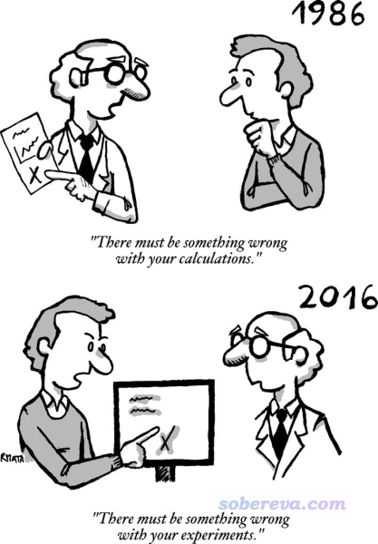

**谈谈量子化学中什么样的benchmark才有意义**

What kind of benchmark is meaningful in quantum chemistry?

文/Sobereva@[北京科音](http://www.keinsci.com)  2020-Jun-5

## 1 前言

笔者在计算化学公社论坛、思想家公社QQ群解答量子化学相关问题时，经常看到有些对理论方法知之甚少、没读过什么文献的初学者在自己的研究中乱做benchmark，还管这叫“标定”，甚至一些初学者竟然以为所谓的标定总是要做。他们所做的事几乎纯粹是在浪费计算资源，每次我都得苦口婆心地劝他们别瞎做无用功。在本文，我就再专门说一下关于benchmark的事，让初学者知道什么样的benchmark才是有价值的、什么时候才应当做、要做的话应当怎么做。

benchmark既是动词也是名词，可以称为横向测试。诸如测试各种显卡在某些游戏上跑的帧率，测试一堆CPU跑某个任务的耗时，测试各种DFT泛函或基组对某类化学体系的某类问题算的结果好坏等等，都可以叫benchmark。

## 2 benchmark研究怎么做？

这一节谈一下量子化学领域里要发表专门的benchmark文章需要考虑什么。有些人以为做benchmark、发benchmark文章是很简单的事，其实绝非如此！benchmark绝不能瞎做，否则纯粹是白浪费时间、得不到什么有意义的信息，最后也发不到什么像样的期刊上、发表了也不会得到多少引用。

通常做benchmark有三个环节：

(1)构造测试集，包括选择被计算的体系、获得参照数据。参照数据可以是高精度实验值，也可以是高精度理论计算值。测试集的构建很有学问，绝对不是随便找点体系就可以当测试集的。测试集的选取应当有明确的意义，能让别人能理解你为什么通过这套测试集做这个benchmark。测试的样本应该够大，以让测试得到的统计数据足够说明问题。如果测试集只有个位数，则无法充分避免巧合性导致对方法本身精度的误判。

如果参照的数据是实验值，必须确认来源可靠，误差大的实验数据应当舍弃，与理论计算的结果没有直接可比性的数据不要用，或者在计算中进行恰当考虑。如果是以高精度的计算值当参照值，必须用没有争议的、能够可靠准确计算当前问题的级别来算，而且文章里应当尽可能写清楚计算细节。有些人以为非得CCSD(T)这种档次的数据才能作为参照数据，这是错误的。只要参照数据的计算级别足够可靠、并且比当前被测试的方法精度明显要高就行。比如测试一批半经验方法，那就可以用已知对当前问题表现很理想的DFT泛函结合较好的基组计算参照值。

(2)恰当选择被测试的方法，然后以恰当的流程进行计算。被测试的方法都应当是比较有意义的，明显不靠谱的方法毫无测试必要。被关注度比较高的，较新且有前景的方法，以及争议比较大的方法应当优先纳入考虑。影响计算结果的因素往往是多方面的，测试某种方法好坏的时候应当在计算时让其它因素的影响尽可能小。比如对比不同理论方法的好坏，显然不能在6-31G*级别下对比，此时基组不完备性误差太大了，表现好的理论方法可能只是恰好与基组层面的误差抵消得较好而已（除非你的测试目的就是想看看哪个方法搭配这种便宜基组时误差较小，从而以较低的花费也能得到可以接受的结果）。

(3)将计算数据与参照值进行对比，讨论什么方法对什么情况是最佳选择、哪些方法虽然精度不是最佳的但是性价比高因此值得选用、哪些方法绝对不应当使用或者在特定某些情况下应当避免使用，等等。讨论过程应注重展现自己对方法的内在特征的理解，试图分析方法为什么好或者为什么不好，争取从原理上对测试现象进行合理的解释，而非简单地把数据复述一遍，这样的话别人光看表格或者图表就够了。最后，最好能给出一个总结，可以是文字也可以是图表，以简洁易懂的方式让非内行读者也知道怎么恰当选择方法，而不必令读者非得花时间努力看完你的整篇文章。

## 3 注意实验数据与理论计算数据的可比性

需要注意的是，如果参照值是来自于实验，一定要确保实验值和你在测试中用的计算方式算的结果有足够的可比性，否则由于某些没有考虑的因素带来的差异，会明显冤枉一些方法。

比如实验上的UV-Vis光谱的最大峰位置并非对应理论计算的垂直激发能位置，本来垂直激发就是个忽略核运动量子效应的假想过程；另外，实验上的吸收峰可能由多个电子激发共同贡献（参看比如《使用Multiwfn绘制红外、拉曼、UV-Vis、ECD、VCD和ROA光谱图》<http://sobereva.com/224>里对UV-Vis谱的分解图）。因此盲目地将最大峰位置和激发能的相符程度用来判断不同方法的计算精度是明显不严格的。另外，溶剂效应对吸收峰位置影响往往是非常明显的，溶剂效应表现的误差和激发态计算方法自身的误差必须要分清楚、分开讨论。

再比如，分子晶体环境中的柔性分子的构象和气相中往往有明显差异。比如联苯在晶体环境中是平面的，而在气相下是有一定二面角的，显然不能因为各种计算级别优化出来都不是平的就说所有计算级别都是不合理的。另外，气相电子衍射谱给出的分子结构对应于热平均结构，如果用的是高温实验数据，那实验结构可能和精确势能面极小点结构有明显差异，显然不能拿这样的实验数据去衡量理论计算的精度。

还要注意，哪怕是相同条件的相同体系的实验数据，不同实验来源都可能有不小差异，比如反应速率常数不同实验来源差好几倍是常事。另外，也绝对不要盲目相信实验数据，好多实验数据本身就是明显错误的，高精度量子化学计算推翻实验数据是很常见的事，现在化学数据手册里也有越来越多的数据都是理论计算给出的。更千万别以为量子化学计算的数据肯定不如实验数据准确，比如Wn系列高精度热力学组合方法给出的气相热化学数据的平均精度可以精确到零点几kcal/mol，这明显高于常规热化学实验能达到的精度。在JCTC, 13, 5291 (2017)里作者通过对60种含过渡金属的双原子分子的解离能的可靠理论计算指出了实验数据可能存在错误。

还有很多东西根本就是不可实验观测的，比如分子轨道能量。如果拿量子化学算的分子轨道能量和电化学实验得到的氧化还原势对比来衡量计算精度，那真是荒诞至极，详见《正确地认识分子的能隙(gap)、HOMO和LUMO》（<http://sobereva.com/543>）。

理论数据计算的方式也必须靠谱，比如测试柔性体系ECD的计算精度，肯定是要考虑构象平均的，参考比如《使用Multiwfn绘制构象权重平均的光谱》（<http://sobereva.com/383>）。如果比如构象搜索方式不当，或者都没考虑构象平均，可能导致真正好的方法和实验偏差很大，反倒是烂的方法由于误差抵消的巧合反倒结果显得好。

在这一节最后，值得一提的是有这么一篇文章Benchmarking Quantum Chemical Methods: Are We Heading in the Right Direction?（Angew. Chem. Int. Ed., 56, (2017)），其中专门讨论了量子化学计算的benchmark问题。这篇文章意义不是很大，大部分都是些老生常谈、内行人都知道的东西，不过有里面有两张图挺值得给初学者看一下的：

上面这张图充分体现了理论化学能达到的精度今非昔比，在很多情况下都足够质疑实验了。所以benchmark结果与实验对比时发现有明显违背常理的时候，不要只怀疑计算方法，也要考虑实验数据有问题的可能性。疑点比较明显的实验数据应当从测试集里剔除，或者尝试找其他人的实验数据。

上面这张图警示大家，实验数据中蕴含着很多对于理论计算的人来说是妖魔鬼怪的因素，计算中不去恰当考虑这些东西就无法让实验数据与计算数据合理地对比，搞计算的人也可以专门去收集涉及的乱七八糟因素少的实验数据，这样更容易与理论计算结果对比。而对于实验化学家，也可以试图在接近理论计算理想化的条件下来做实验（比如低温、气相或非极性溶剂，选热可及构象少的体系等等），从而给计算化学家提供容易作为测试集的参考数据。

## 4 什么样的benchmark有价值？

什么样的benchmark才是有价值、因此能在不错的学术期刊上发表的？这里就列举一下

•(1)某类问题之前还没有过benchmark文章；或者虽然有，但文章都较老，没有涉及较新方法；或者之前考虑的方法较少、水准不高、有明显欠缺。毫无疑问，做一个新的、严谨的、系统性的benchmark解决这些问题，弥补学术界对一些问题认识上的空白，或者改变人们的一些旧有错误的观念，这样的文章无疑是有意义的。

比如笔者之前写的《原子电荷计算方法的对比》（<http://www.whxb.pku.edu.cn/CN/abstract/abstract27818.shtml>）和《亲电取代反应中活性位点预测方法的比较》（<http://www.whxb.pku.edu.cn/CN/abstract/abstract28694.shtml>）就属于这类。虽然之前也有一些文章对比讨论过原子电荷的计算、预测反应位点的方法，但是都比较零散，考虑的方法不太全面，缺乏一个统一、公平的对比。这两篇文章填补了这方面的空白，在原子电荷和反应位点的预测方法的选用方面提供了明确指导，到现在被引用次数不少。

再比如，测试有机反应的文章很多，但是测试金属有机反应的文章则较少。Grimme的MOR41测试集（JCTC, 14, 2596 (2018)）专门测试了不同泛函以及部分后HF方法对41种闭壳层金属有机反应的计算精度，这对于研究金属有机化学的人很有意义。

•(2)被测试的对象比较特殊、专一，这类测试对于后人研究某些特定类型的问题比较有帮助。比如PCCP, 19, 14296 (2017)测试了不同方法算的1812种C60异构体的异构化能；JPCA, 121, 2410 (2017)测试了不同方法算的2~8个金的团簇的相对能量和垂直电离能；JPCA, 123, 10454 (2019)测试了不同泛函计算各种主族团簇团簇的精度；JCTC, 16, 2355 (2020)提出的HB375×10和IHB100×10测试集分别包含了375个中性氢键二聚体和离子氢键二聚体解离路径上的10个点的结合能；JCTC, 9, 1918 (2013)提出的XB51测试集专门测试卤键二聚体结合能；JCP, 137, 054103 (2012)提出的C21测试集专门测试分子晶体中的相互作用能；JPCA, 113, 11974 (2009)中提出的ACONF测试集专门测试烷烃的构象能量差；JCTC, 14, 1254 (2018)提出的MPCONF196测试集包含了13个小肽的共196个构象来测试小肽构象的计算精度；JCIM, 60, 1453 (2020)提出的PLF547测试集构造了547个药物分子与蛋白质片段的局部复合物结构，衡量不同方法算的结合能，对于量子化学研究小分子与蛋白结合的人有帮助。

•(3)测试的角度新颖、独特、弥补之前类似问题测试的盲点。比如测试几何优化的准确度，大多数文章都是拿晶体结构当做参照，但是ROT34测试集（JCC, 35, 1509 (2014)）却用实验的转动常数作为参照来判断几何优化准确度，这就显得比较新颖，而且原理上比用晶体结构当参照更合理，毕竟晶体环境中的分子间相互作用、堆积效应会影响结构，特别是柔性的部分。另外，JCTC, 2, 1282 (2006)还使用气相电子衍射测定的结构来测试泛函优化配位键的精度。

再比如，弱相互作用方面研究得比较多的是两个分子间的相互作用能，而JCTC, 11, 3065 (2015)里提出的3B-69测试集收集了69个三聚体，用于测试不同理论方法算的三体结合能，这能体现不同方法对协同作用的表现能力，因此此测试有一定新意。

再比如，弱相互作用领域里通常考察的是气相下的结合能，但是现实当中更感兴趣的往往是液相下的。在JCTC, 11, 3785 (2015)里提出的S30L测试集中给出收集了30个主-客体复合物的溶液下的结合过程的自由能变，溶剂有氯仿、甲苯、CS2、水等等诸多情况。此文测试了COSMO-RS和SMD溶剂模型结合多种泛函和半经验方法，此研究对于溶液环境中大体系的结合能的计算方法学很有价值。

•(4)测试集构建合理、数据质量很高。比如S66是弱相互作用计算方法学领域里最知名的测试集之一，原文是JCTC, 7, 2427 (2011)，前身是S22。此测试集包含了66种分子二聚体，为了让此测试集的结果比较能反映实际问题，作者特意让色散主导的、静电主导的和介中情况的弱相互作用体系都各占一部分（分别是27、23、16个），而且氢键、普通色散作用、pi-pi堆积等常见类型相互作用都有出现，作为小分子的二聚体测试集来说构建得算是比较周到了。而且文章里给出了一般被视为金标准的CCSD(T)/CBS级别的高精度作用能，可以让后人以此为参照可靠地测试文中未考虑的计算级别的精度。

再比如电子激发研究领域里知名的TBE2测试集（JCP,133,174318 (2010)），包含了28个中等尺寸的有机分子，使用LR-CC3或者MS-CASPT2结合aug-cc-pVTZ下计算了非常高精度的垂直激发能。TBE2成为了后来很多人测试电子激发计算方法准确性的标准测试集之一。

再比如W4-17测试集（JCC, 38, 2063 (2017)），使用了目前最精确的热力学组合方法W4计算了200个原子化能，而原子化能通常是最难算准的热力学量之一，因此这样的数据集对于评判理论方法的精度比较有意义。

•(5)测试集规模特别大，被测试的方法非常多，因此工作量巨大、考察的对象非常系统和全面，给人以thorough的感觉。例如Grimme的GMTKN55大型测试集（PCCP, 19, 32184 (2017)）包含共55个子集，共1505个相对能量，含有各种类型体系的各种与能量相关的问题（势垒、反应能、解离能、异构化能、电子亲和能、电离能、弱相互作用能等）的高精度实验值或理论值，文中测试了多达83个泛函。像这样的工作对于泛函的选择是很有指导意义的。

再比如，JCP, 150, 074108 (2019)里收集了多达155个分子的1468个价层和深层的垂直电离能，测试了IP-EOM-CC系列以及其它的计算电离能的方法，对于电离能的研究很有价值。

再比如测试带隙的文章已经很多了，而JCTC, 15, 5069 (2019)构造了更大的测试集，囊括了多达472个非磁性材料的实验结构和带隙，涵盖周期表里大多数元素，显然这样的benchmark比前人的同类研究更有说服力。

•(6)测试有明确的目的性。比如Head-Gordon想测试明尼苏达系列泛函在近10年来的发展，在JCTC, 12, 4303 (2016)中用含有84个测试集的将近5000个数据的大型测试集测试了14个明尼苏达系列泛函。从此文的TOC立马可见，在M06-2X之后，对于主族元素计算来说，明尼苏达系列泛函的精度并没有什么实质性的进展。

再比如PCCP, 20, 23175 (2018)里使用GMTKN55测试集专门测试不同类型双杂化泛函，从而分析半经验和非经验性方式提出的双杂化泛函的整体表现情况。

## 5 针对特定研究的计算级别的筛选

有的时候我们本身不是为了做benchmark而做，而是有亟待研究的问题而不得不做benchmark。比如当前要研究一批体系，体系比较特殊，虽然已知用NEVPT2、CCSD(T)等昂贵的方法肯定结果准确，但都算不动；而用那些算得动的方法，又不知道哪个最好，或者哪个性价比比较高，那么可以做一下筛选，选出最适合的用于后面的研究，对于以后其他人研究类似的体系也有帮助。

比如要研究的体系是主族元素的团簇里掺了几个过渡金属，想知道各种异构体的结构和能量。像这种体系就不是很好算的，有过渡金属的体系通常比纯主族体系难算，有较多过渡金属就更麻烦。虽然凭研究经验一般能估计出有好几个泛函都可能能用，但都有些不放心，也不知道谁最理想。此时可以先选少数几个异构体，用高精度但昂贵的理论方法计算出参照值，再用各种候选的泛函也都算算，把表现最佳的泛函用于算全部的异构体。

值得一提的是，2019年首次在实验上观测到的18碳环在化学界引起了广泛关注，见此文的相关信息：《一篇最全面、系统的研究新颖独特的18碳环的理论文章》（<http://sobereva.com/524>）。这个体系的电子结构非常特殊，即便是理论化学专家也没有谁敢打包票说哪个泛函肯定能算得合理，像这种情况要做DFT研究肯定要进行泛函的测试。在笔者研究18碳环成键问题的Carbon, 165, 468 (2020)一文中，根据笔者的benchmark，发现常用的B3LYP、PBE0等HF成份不高的泛函对于结构优化完全失败，而wB97XD则表现良好，和很可靠的CCSD结合较小基组优化的结构也较吻合，因此最终确定使用wB97XD用于18碳环的各种问题的研究，包括后来研究18碳环的电子光谱和非线性光学的Carbon, 165, 461 (2020)一文也是用的这个泛函。类似地，如果还要研究其它尺寸的碳环，根据这个测试也都可以有理有据地使用wB97XD。

再比如，在《透彻认识氢键本质、简单可靠地估计氢键强度：一篇2019年JCC上的重要研究文章介绍》（<http://sobereva.com/513>）介绍的笔者的JCC, 40, 2868 (2019)一文中，要通过SAPT2+(3)δMP2对氢键作用能做能量分解考察其本质。虽然在JCP, 140, 094106 (2014)中他人已经证明过此级别算氢键作用能可以算得很准，但是并没有测试过用于离子型氢键的情况，而笔者这篇文章又涉及不少离子型氢键体系。于是在文中笔者对SAPT2+(3)δMP2算离子型氢键结合能与金标准CCSD(T)算的进行了对比，证明了其合理性。

## 6 做benchmark前要多读前人文章

我看到过太初学者不肯读前人文章，就愿意自己做benchmark，还自以为自己所做的是很有意义的事，能获得同行们不知道的新发现，然而他们的做法在内行人眼里完全是胡搞瞎搞。在这里我就专门说说读他人benchmark文章的重要性。

决定做benchmark之前一定要确保已经看了足够的前人的文章！这点极其重要！！！有太多的初学者老想做benchmark是因为他们太无知了。虽然这话难听，但却是就是这么回事。因为初学者读的太少、缺乏对不同类型问题该用的计算方法的常识，于是就总以为什么都得实测一下才能选出合适的，殊不知他们打算通过测试来说明的问题，99.99%的概率早就在前人的benchmark文章里得到解答了。千万别以为benchmark文章很稀少，实际上几乎所有稍微常见的问题绝对至少有10篇文章进行过benchmark，比如(超)极化率的benchmark文章我随便收在硬盘里的都有24篇。哪怕很冷门的问题也都有人发过benchmark文章，比如电场梯度（EFG）的计算（Dalton Trans., 39, 5319 (2010)）。而一些比较热门的问题，比如弱相互作用的计算，光是有点名气的测试集都有好几十个，近15年最最起码有100篇算是弱相互作用benchmark的文章发表。把主流期刊上的benchmark文章看了，有>95%的可能性会打消初学者自己做benchmark的念头。别人已经充分研究过的问题直接借鉴前人的成果就行了，不仅免得自己花大量时间测试，还避免被审稿人质疑你做的测试不专业、结论不可靠、不足矣说明问题。而且根据别人的高水平的benchmark文章选择要用的方法的话，当审稿人对你选择的方法指指点点的时候，你还可以直接拿那些已发表的benchmark文章非常有理有据地回击。

如今benchmark文章可谓层出不穷、铺天盖地、增速迅猛。如果你订阅了常见理论化学期刊的邮件通知，比如JCTC、JCC、PCCP、JCP、JPCA、CPL、TCA、CTC、JMM等，一个月就能看见N篇benchmark文章。特别是在JCTC上这类文章奇多，基本每期都有至少一篇。由于benchmark文章的引用数整体比一般的研究性文章要高，JCTC的IF很大程度也是被这类文章撑起来的。

由于benchmark文章实在太多，甚至可以说泛滥了，所以想发新的专门的benchmark文章也越来越不容易，在创意、计算水平、数据量等方面要求也越来越高，而且做之前还需要花越来越多的精力消化前人的文章。如果不是很内行，对领域了解很多的话，随便脑袋一热就做个benchmark并投到有一定水准的期刊上，有极大的几率会被审稿人指出这测试根本没意义、早就有其它更深入系统全面的benchmark文章考察过类似问题、得到过比当前文章更严谨的结论了。内行审稿人甚至都可能觉得你的benchmark连看都不用看，测试结果凭经验都能猜得八九不离十，测试结论都已经是业内的常识知识了。因此，在做benchmark之前，一定要先好好搜搜前人的工作、仔细阅读。可以把被研究问题的关键词和benchmark一词一起写到Google学术搜索的搜索框里，把前10页的文章列表看看（对初学者嘱咐：千万别用搞笑的百毒学术！）。

另外值得一提的是，除了专门的benchmark文章，几乎所有理论方法的原文里作者也都会做benchmark，用来对比当前的新方法和其它流行的方法的精度。所以不要说由于自己用的方法新，所以就一定不知道其精度的好坏、于是就非得做过benchmark才肯用，你起码应先把原文看了，看原文里的测试结果是否已经能够打消你的疑虑。

看benchmark文章从而了解各种计算方法的精度的时候，要特别注意的是绝对不要只相信一篇文章的结论！每篇文章用的测试集都不同，一些技术上的细节也不同，作者在分析讨论的时候也都带着不同程度的主观性。如果你只看一篇文章，容易一叶障目，产生偏见。尤其是理论方法的提出者他自己在原文里或者他额外发的文章的benchmark中，经常倾向于找对自己的方法有利的测试集测试、给读者看能证明他的方法好的数据，以使得他的方法能够流行开来。而且有的理论方法里面是有经验拟合参数的，如果就拿训练集或者与训练集差不多类型的体系去测那个方法，那个方法比大多数同类方法都更好简直是一定的。值得一提的是，我知道有个开发双杂化泛函的人，每次测试都是拿一些比较烂的方法跟他的方法比，导致每次都能名列前茅，然而每当其它研究者公正、全面地进行测试的时候，他的那个泛函总是名落孙山。不过也有一些研究者比较诚实，比如Grimme，他不试图掩盖自己的方法表现不佳的情况，有时候他新提出的方法甚至不如老方法，他也如实交代。总之，某类问题的benchmark绝对不要只看一篇，以防被误导，而应当从大量文章中归纳总结出自己的观点，并且在实践中以及未来看新的benchmark文章中不断去验证、更新自己的观点。我写过《简谈量子化学计算中DFT泛函的选择》（<http://sobereva.com/272>）一文，此文就是我看过无数篇benchmark文章并结合我实际的研究经验所总结的，是已经反复锤炼到很稳定的观点了。按照此文选用泛函，倘若被外行审稿人质疑，我总能从硬盘里找出相应的benchmark文章怼回去。

还要注意的是，对于发展比较快的领域，不要拿比较老的benchmark文章当做方法选用的判断依据，否则会与主流形势脱节。比如弱相互作用计算的发展非常迅猛，基本上08年以前的benchmark文章对如今就已经没多大指导价值了，其中与DFT有关的观点更是100%过时了。在量子化学书里往往也有benchmark，对于年代稍早的书，要注意里面的作者的观点可能是过时的。比如2001年的A Chemist's Guide to Density Functional Theory 2ed是一本很好的由浅入深地介绍DFT的书，此书后一半主要都是应用介绍和方法对比，显然那个年代的对比数据明显不足以成为如今选用泛函的依据。还要小心有些书有严重误导性，比如知名的Exploring一书，在其第三版中，居然从头到尾都极力试图让读者用APFD泛函，然而此泛函不仅严重非主流，而且如GMTKN55测试集所体现的，其整体精度还不如B3LYP-D3(BJ)，因此绝对不要用。用了的话很容易被审稿人质疑，被质疑后你还找不到任何benchmark文章能成为你使用这个泛函的依据。

## 7 初学者做benchmark容易犯的错误

做benchmark一定要有足够的计算经验、有足够的常识才行，尤其是发专门的benchmark文章，只有对被测试的问题有充分的理解、有扎实的理论功底，才有可能在像样的期刊上发得出来文章。上面给出了很多主流期刊上的测试文章，去看看那些文章就知道主流期刊的benchmark文章是大概怎样的水平。如果对理论都还是一知半解、研究经验还尚浅，写出来的benchmark文章绝对漏洞百出，数据的可信度和结论无法令人信服，甚至内行人看了都想笑。这种垃圾灌水benchmark想发到IF=1.0左右的期刊上都得撞大运，得碰上非内行或者特别宽松的审稿人才行，若想发到JCTC、JCC、PCCP、JCP、JPCA等主流期刊上更是绝对不可能。

有很多初学者在测试用什么泛函算自己体系合理的时候总是莫名其妙地考虑一堆乱七八糟、如今根本无人问津的诡异非主流泛函，比如mPW1B95、mPW1K、BB1K、B3P86等等，真是完全莫名其妙！也不知道他们哪儿看来的这些泛函。所有内行人都明白，不管对什么类型的问题，总有主流泛函，或者相对来说更知名、更常见一些的泛函会比这些莫名其妙的泛函表现得更好。对于常见问题，比如热力学数据的计算、激发能等，比这些垃圾泛函表现更好的泛函更是一大把，根本轮不到测试这些冷门泛函。而且就算拿这些初学者能收集到的有限的测试集，确实测出来这些冷门泛函当中的某个误差确实很小，那又能说明什么？初学者搞的测试集的质量、测试方式的可信度堪忧，而且样本又少，测试结论根本没有说服力，别人看了此文之后照样不敢拿这种泛函算别的，哪怕是算类似的体系。在我看过的无数benchmark文章里，我没见过哪个靠谱的文章里体现出这些诡异的泛函表现出什么特别优异的性能、并因此值得对某类体系某些问题的研究上使用。依我来看，如果经过测试，发现某非主流泛函误差最小，那最好也别用，而应当用测试过的主流泛函里表现相对最好的。主流泛函那么多，通常不可能在没有一个基本能用的情况下却唯独有某个非主流表现得极好。用主流泛函可以减少被审稿人质疑的概率，而且主流泛函由于被用得很多、被研究者们检验得也比较多，依然能存活下来沿用至今，往往说明其比较“皮实”。相反，非主流泛函则极有可能只在某测试集下表现得恰好不错，而换个体系就表现得令人大跌眼镜。

还有的初学者测试泛函的时候，只要表面上看某个泛函和实验误差小，就认为哪个泛函好，这是极具误导性的！一定要搞清楚误差来源都有什么，不要把什么误差都算在泛函的头上！前面第3节我提到过好多个将理论计算与实验数据对照时需要考虑的问题，如果由于忽略了这些因素，将导致理论算的数据都和实验本身就没有严格的可比性，这样筛选出来的表面上看误差小的泛函其实可能反倒误差很大，而真正从本质上表现好的泛函反倒被忽略掉了。之前还见到有个初学者说，他经过测试，发现用STO-3G基组计算碘的时候结果满意。这明显就是瞎猫碰见死耗子，是good result due to wrong reason，要么是由于巧合导致误差恰好抵消得不错（肯定换个体系就完蛋），或者是由于他太没常识，连判断标准本身都严重不科学（比如以为键长误差在0.2埃以内就算不错），或者建模、计算流程、数据读取都是错的。用STO-3G算碘这种毫无常识做法写的文章，就连国内SCI都铁定发不出去。

做benchmark的时候不要选择一看就不靠谱的方法。比如计算弱相互作用，明显不能用B3LYP，要用也得是加色散校正，我在《谈谈“计算时是否需要加DFT-D3色散校正？”》（<http://sobereva.com/413>）里已经写得非常充分了，这早就是业内共识了，不需要再通过测试来体现。显然，如果测试的时候还把B3LYP加进去，完全就是浪费篇幅和计算资源了，是个内行人都知道这个方法肯定精度垫底。倘若你真的测出来B3LYP算某体系弱相互作用能好，也显然不能轻易告诉读者应该用B3LYP算这类问题，而应当分析这违背一般常识的现象到底是怎么出现的，要怀疑是不是自己的测试有bug。

有的初学者是不管算什么都想测一测方法。前面说了，只有算一些又新奇特、又缺乏前人相关的benchmark文章的时候才有必要自己去测。在计算化学公社论坛里，有个人就是算个酯化反应，居然也非要做benchmark来“标定”一下，这完全毫无意义。本来有机体系就好算，酯化反应又是典型得不能再典型的有机反应，计算起来一点难度和特殊性都没有。在前文里就已经提到诸如GMTKN55测试集了，那里面就已经充分包含了热化学计算、势垒计算的子集，那个文章里的结论已经可以充分体现不同泛函算这种很普通的有机反应的精度了，还自己测它干嘛？纯属浪费计算资源，而且还不如直接引GMTKN55这篇顶级专家写的很有影响力的文章更让内行审稿人觉得在泛函选用问题上站得住脚。可能他还想用更高级别的方法，比如DLPNO-CCSD(T)，这也不用自己通过测试来验证啊，此方法的原文JCP, 138, 034106 (2013)，以及之后的涉及了此方法的测试文章JCTC, 11, 4054 (2015)、JPCA, 121, 4379 (2017)都已经足够体现此方法算有机体系热化学数据是很准确的，就连GMTKN55测试集里面作为参照的数据都有不少是DLPNO-CCSD(T)算的。

之前还看到有一个缺乏常识的人做的测试，他说：  
“分别在6-311G、6-311++G、6-311G(2d,2p)、6-311G(3d,3p)、6-311++G(2d,2p)、6-311++G(3d,3p)、cc-pvtz下计算了中等大小有机体系（约30个碳原子）的偶极矩，泛函分别考虑b3lyp和CAM-b3lyp两种情况（在C-PCM溶剂模型下进行计算）。结果发现CAM-b3lyp、6-311G(2d,2p)下计算的偶极矩与实验值最符合。”  
懂得偶极矩计算的人明显能看出来这测试纯粹是瞎测。6-311G连极化函数都没有测什么？明显没有最基本的基组选用常识，基组该用什么这里都说了：《谈谈量子化学中基组的选择》（<http://sobereva.com/336>），里面还专门说了算偶极矩该用的基组。想算准偶极矩是要带弥散函数的，测试6-311G(2d,2p)、6-311G(3d,3p)、cc-pvtz这种弥散函数都没有的基组有什么意义？即便被测的基组里面有些是带弥散函数的，但只考虑Pople基组是明显不妥的，明明def2系列、cc-pVnZ系列用得也非常多，带弥散函数版本的def2、cc-pVnZ为什么不纳入测试？这完全说不过去。实际上Pople系列基组即便带上弥散函数算偶极矩依然比较糟糕，而能够算偶极矩算得很理想的是def2-TZVPD，用法见《给ahlrichs的def2系列基组加弥散的方法》（<http://sobereva.com/340>），便宜一些的话可以用aug-cc-pVDZ。他为什么专门测B3LYP和CAM-B3LYP这俩泛函也完全意义不明。他如果去搜搜偶极矩的benchmark，比如把"dipole moment"和"benchmark"放到Google学术里，肯定能搜到How Accurate Is Density Functional Theory at Predicting Dipole Moments? An Assessment Using a New Database of 200 Benchmark Values这篇，即JCTC, 14, 1969 (2018)。文中明确体现出普通泛函里PBE0算偶极矩是几乎最好的，因此用什么泛函根本都不用自己测，直接引这篇文献、用PBE0就行了。而且我在《谈谈隐式溶剂模型下溶解自由能和体系自由能的计算》（<http://sobereva.com/327>）里还明确说了Gaussian里不应当用比默认的IEFPCM更差的CPCM，非要用CPCM完全是莫名其妙。最后他居然测出来CAM-B3LYP结合6-311G(2d,2p)计算的偶极矩与实验值最符合，这结论明显违背常理。内行人都懂弥散函数对于计算偶极矩必不可少，当前测出来没弥散函数结果反倒更好，碰见内行人能不被质疑么？届时要怎么解释？实际上，溶液环境下的分子的偶极矩根本就是无法实验直接测定的，明显是因为他的实验数据本身和他的计算方式没有可比性，导致他不合理的计算级别的结果恰好与实验数据较为接近。
