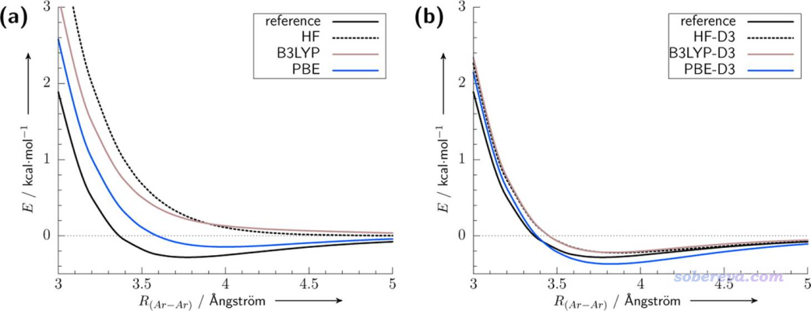
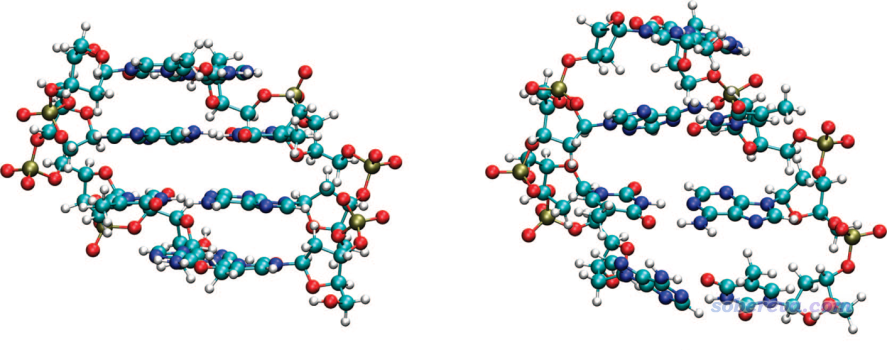
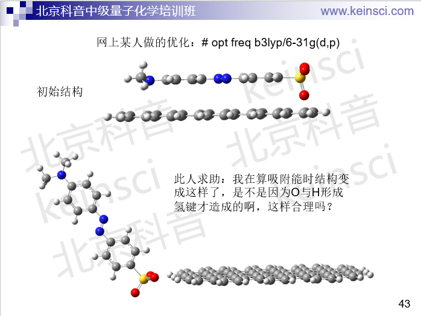
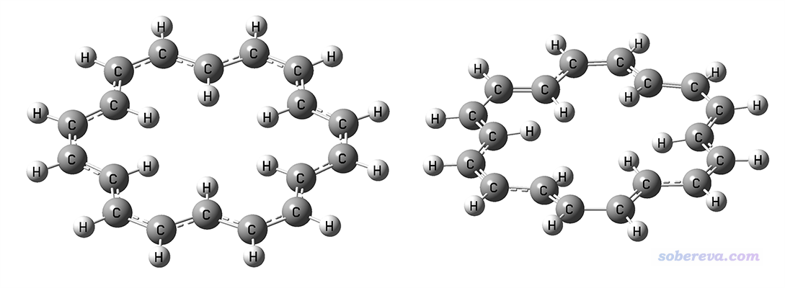
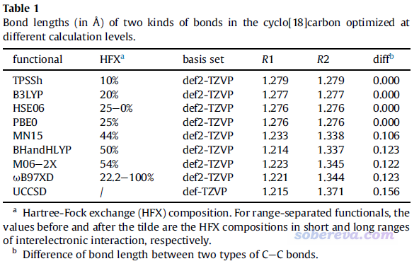
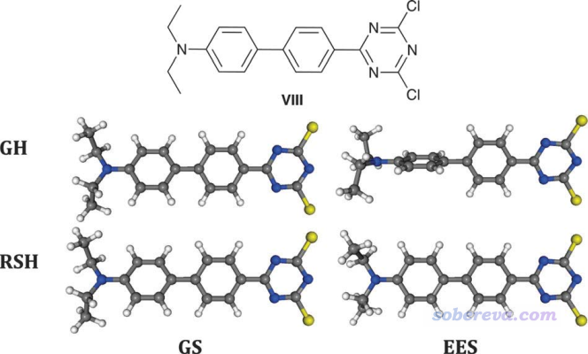
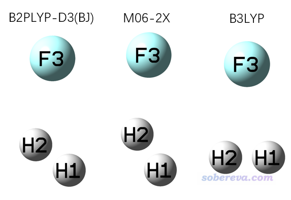
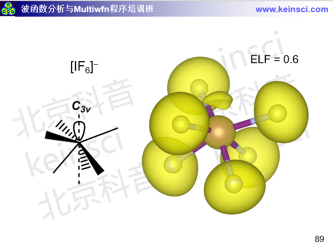

**谈谈量子化学研究中什么时候用B3LYP泛函优化几何结构是适当的**

When is it appropriate to use B3LYP functional to optimize geometric structures in quantum chemistry research?

文/Sobereva@[北京科音](http://www.keinsci.com)

First release: 2020-Jun-11  Last update: 2024-Oct-29

## 1 前言

量子化学研究中什么场合用什么DFT泛函合适，在《简谈量子化学计算中DFT泛函的选择》（<http://sobereva.com/272>）中我已经说过了。量子化学研究中最常见的两类任务就是单点能的计算和几何优化。B3LYP这个1994年提出的老泛函用于计算能量方面已经严重落伍了，不管是什么体系的单点能计算，在主流量子化学程序里总有结果更好甚至能吊打B3LYP的泛函可以用，对有机体系坚持用B3LYP算能量甚至可能导致文章被拒，见《坚持使用B3LYP算有机体系的人的下场》（<http://bbs.keinsci.com/thread-12773-1-1.html>）。

然而，对于几何优化来说，B3LYP至今依然有其实用价值，绝不是说在精度方面没有比它更好的选择，而是因为用B3LYP仍然有一定实际好处：  
1 在杂化泛函里，至少对于量子化学领域用得最多的Gaussian来说，B3LYP的计算速度是最快之一，这得益于B3LYP泛函的形式较为简单。相对于形式复杂的M06-2X，以及wB97XD、CAM-B3LYP等范围分离泛函，B3LYP明显便宜很多。  
2 B3LYP对积分格点依赖性低，因此在不是很高质量的积分格点下势能面就已经是较为平滑的，因此可以用比较便宜的积分格点（因此对于Gaussian 16用户，我一般都建议使用int=fine关键词把昂贵的ultrafine积分格点降低到fine来明显节约时间）。相反，较现代的泛函大多是meta或meta杂化类型的泛函，对积分格点更为敏感，尤其是M06-2X等一些明尼苏达系列泛函对积分格点更是相当敏感，若积分格点质量不够高，容易优化不收敛、收敛了之后有小虚频。对于M06-2X优化某些弱相互作用体系，连Gaussian中int=ultrafine档次的格点都不够用。如果对积分格点方面的知识不懂的话，看《密度泛函计算中的格点积分方法》（<http://sobereva.com/69>）。  
3 B3LYP历史悠久，有海量量子化学研究的文章都用的是B3LYP优化结构，而且在优化大多数体系结构方面并没有其它泛函比它有特别显著优势，因此用B3LYP比较不容易被审稿人质疑。

在本文，就具体对于几种情况说一下B3LYP什么时候可以用、什么时候不适合用，以及为什么。

## 2 弱相互作用体系

简单来说，涉及弱相互作用的体系绝对不要用B3LYP优化，否则如今极容易被审稿人批评；然而只要给B3LYP加上诸如DFT-D3等主流形式的色散校正，就可以万事大吉，内行人一般都不会质疑。目前最常用的是就是B3LYP结合DFT-D3(BJ)色散校正，称为B3LYP-D3(BJ)，在几乎所有主流量子化学程序里都支持。如果不了解色散校正，看以下三篇  
谈谈“计算时是否需要加DFT-D3色散校正？”   
<http://sobereva.com/413>  
DFT-D色散校正的使用  
<http://sobereva.com/210>  
乱谈DFT-D  
<http://sobereva.com/83>

这里所谓的弱相互作用体系就是指弱相互作用可能明显影响体系构型/构象的体系。例如，DNA双螺旋结构当中，平行的碱基对之间有显著的氢键作用，每个碱基与它上、下方的碱基之间有显著的pi-pi堆积作用，都属于弱相互作用。更具体来说，B3LYP描述弱相互作用失败是因为其描述弱相互作用当中的色散作用完全失败，下面这张出自Chem. Rev., 116, 5105 (2016)的图对这点体现得很清楚：

可见对于完全靠色散作用结合的Ar二聚体，B3LYP都给不出极小点结构，而加了DFT-D3色散校正后极小点位置就和精确位置很接近了。

其实B3LYP本身对于描述静电主导的弱相互作用定性正确，优化也可以给出靠谱的结构。氢键有强有弱，本质各有不同，见《透彻认识氢键本质、简单可靠地估计氢键强度：一篇2019年JCC上的重要研究文章介绍》（<http://sobereva.com/513>）。如文中所示，对于比如水二聚体中的氢键来说，静电作用占主要成分，所以B3LYP优化水二聚体的结构实际上是没有太大问题的。但由于DFT-D3是“免费”的校正，无需额外耗时，而且加了之后对各种类型弱相互作用体系的优化都能变得很理想，对于优化静电主导型的氢键作用体系还能有定量改进，所以不加DFT-D3完全说不通，也没有理由如今还直接用B3LYP来优化这种体系。

下面看J. Am. Chem. Soc., 130, 16055 (2008)里面的一个例子，对比了TPSS（右图）和加了DFT-D2形式的色散校正后（左图）优化后的结果，这和B3LYP与B3LYP-D3(BJ)的情形类似

由图可见，考虑色散校正后优化后的DNA结构和实际很相符，而直接用和B3LYP一样对色散作用描述能力为零的TPSS优化的话，虽然氢键距离倒是没明显问题，但由于本质是色散作用的pi-pi堆积完全不能描述，使得碱基间的间距完全错乱。

前一阵子思想家公社QQ群里有人问了如下问题，被我当做反面教材放到了北京科音中级量子化学培训班（<http://www.keinsci.com/workshop/KBQC_content.html>）的ppt里了，读过前文的读者想必知道他遇到的问题是因为什么了。如今还直接用B3LYP优化这种体系完全是缺乏量子化学计算最基本常识的表现。

有些初学者由于缺乏理论化学直觉，不知道什么时候弱相互作用会明显影响体系结构，索性优化的时候就都加上DFT-D3色散校正就完了，有益无害，还不用担心审稿人会质疑。若真碰上外行审稿人质疑你，届时也总能解释得通。

判断什么时候弱相互作用可能影响构型/构象其实是很容易的事，比如《使用Molclus结合xtb做的动力学模拟对瑞德西韦(Remdesivir)做构象搜索》（<http://bbs.keinsci.com/thread-16255-1-1.html>）一文里对瑞德西韦做构象搜索，一看体系结构就知道有很多可旋转的键，故构象非常丰富，不同构象下原子间相互接触情况不同，显然色散作用表现与否可能显著影响构象的结构，更严重影响相对能量，因此此文里用了B3LYP-D3(BJ)来优化。一般来说，只要是做构型搜索、构象搜索，我都建议用B3LYP-D3(BJ)作为最终优化的级别，结果合理，相对来说又便宜又不容易出虚频。

对于阴阳离子作用的情况用B3LYP优化是否需要考虑色散校正看具体情况。比如乙酸钠，钠离子和乙酸根的吸引相互作用几乎完全是静电和极化作用，B3LYP本身就能很好描述，因此色散校正可加可不加。而对于离子液体，虽然静电作用占阴阳离子之间作用的绝大部分，但毕竟这类离子并不算小，特别是有的还带有柔性的链，因此色散作用对结合能的影响不仅不可以忽略，还可能影响离子的构象，因此应当加上色散校正。

值得一提的是，有一篇JCTC上的文章对不同泛函优化弱相互作用体系做了横测，发现B3LYP-D3(BJ)优化精度几乎是最高的。B3LYP-D3(BJ)做优化不仅便宜，即便从精度角度来看，用B3LYP-D3(BJ)优化也是极为理想的选择，详见《证明B3LYP-D3(BJ)非常适合优化弱相互作用体系的一篇文章》（<http://bbs.keinsci.com/thread-19495-1-1.html>）。

## 3 主族元素构成的体系

这一节说的有机体系特指不含大共轭特征、不显著涉及弱相互作用的情况。

用B3LYP优化这类体系一般都是能得到合理的结果的，有大量文献可以提供支撑。比如J. Chem. Theory Comput., 8, 2165 (2012)选了一批由两、三个原子构成的五花八门的体系，在普通泛函（即双杂化以外的泛函）里B3LYP做优化、振动分析结果几乎是最好的，比M06-2X明显更好。根据J. Chem. Theory Comput., 12, 459 (2016)的测试，对于普通有机体系，在普通泛函中非常常用的PBE0表现得几乎最好，B3LYP虽然不是拔尖的，但也在很合理的范围内，表现得不错。在J. Phys. Chem. Lett., 11, 9957 (2020)里作者定义了geometry energy offset (GEO)参数从结构误差对能量影响的角度考察了一批泛函优化小分子的精度，发现B3LYP的表现基本上是最好的。

正因为B3LYP做优化比较稳，在一些高精度热力学组合方法里都用B3LYP来优化。比如G4、G3//B3LYP、CBS-QB3都是基于B3LYP来优化的。在J. Phys. Chem. A, 121, 4379 (2017)里提出的组合方法里是用B3LYP-D3(BJ)做优化和振动分析，再结合DLPNO-CCSD(T)算的高精度单点和一些经验的后校正来得到高精度热力学数据的。

总的来说，即便被优化的体系不显著涉及弱相互作用，我还是建议加上DFT-D3校正，毕竟这相当于增加了B3LYP的普适性。向外行人推荐优化级别的时候，或者给他们写输入文件模板的时候，建议也用B3LYP-D3(BJ)而非B3LYP。有人问我为什么《计算RESP原子电荷的超级懒人脚本（一行命令就算出结果）》（<http://sobereva.com/476>）这个文章的脚本里用的优化方法是B3LYP-D3(BJ)而不是B3LYP，其实就是出于这个考虑，谁知道用这个脚本的人会优化什么样的体系？都统一加上DFT-D3就省得解释了。

## 4 含过渡金属体系

B3LYP在大量文章里被用于优化过渡金属配合物。这种做法可以接受，但如果对配位键键长很关注，B3LYP绝对不是好的选择。在任何涉及到过渡金属配位键键长的横测中，B3LYP没有一次表现特别优异过，基本都是表现中庸，见比如J. Chem. Theory Comput., 2, 1282 (2006)、J. Chem. Theory Comput., 13, 5291 (2017)里的泛函横测。适合研究过渡金属配合物的泛函在《简谈量子化学计算中DFT泛函的选择》里写了，比如TPSSh在优化过渡金属配位键键长的测试文章里经常表现得非常出众。

我每次讲完北京科音量子化学培训班的理论方法那部分、提到不太建议拿B3LYP算过渡金属配合物之后，老有学员在答疑时问我他都已经用B3LYP对他的这种体系做了计算了，现在该怎么办。我的意见是，既然都已经算了，这次就先这么算完，以后就别再用了。

如果你对含有过渡金属体系的计算关注的重点只是配体部分，比如单纯是配体部分发生的反应等，那么用B3LYP优化完全没关系。

如果你算的体系牵扯到d族过渡金属之间直接成键，此时静态相关很强，一定要用纯泛函优化，而不要用B3LYP以及任何其它的杂化泛函。比如J. Chem. Theory Comput., 8, 908 (2012)里研究了[V(C5H5)]2Pn体系，其中两个V之间直接成键，实验V-V键长是2.538埃，纯泛函BP86优化出来是2.568埃，非常理想，TPSS、PBE等纯泛函表现得也都不错，而B3LYP优化出来为2.994埃，明显和实验差得非常远。

## 5 大共轭体系

B3LYP不适合优化大共轭体系，这点很多人都不知道。

轮烯（annulene）是典型的大共轭体系，18个pi电子离域在整体。在Angew. Chem. Int. Ed., 43, 4200 (2004)中指出[18]annulene的C-C键键长应当是不均等的，而且体系是非平面的，而B3LYP算出来的则是C-C键键长都相等，是平面构型（D6h点群），明显和实际不符。我用B3LYP/def2-TZVP优化出的无虚频结构如下图左侧所示。下方右图是我用wB97XD/def2-TZVP优化出的无虚频结果，是D3点群，可见键长确实是不均等的，而且由于H-H的位阻作用导致体系轻微偏离了平面结构，比B3LYP明显与实际情况更相符。

18轮烯体现的B3LYP优化大共轭体系不很合理的问题不是个例，在Chem. Mater., 29, 477 (2017)中作者Bredas专门提到：B3LYP functional suffers from a significant electron self-interaction error...The consequence is a strong tendency for B3LYP to overdelocalize the wave functions; this is the opposite of Hartree−Fock methods, which overlocalize the wave functions. Thus, in extended π-conjugated systems, B3LYP favors fully coplanar conformations。即B3LYP对大共轭体系，由于此泛函的自相互作用误差(SIE)问题，倾向于把体系优化成平面的。它倾向于把键长描述得均衡化也同样是由于SIE问题所导致的。而CAM-B3LYP、wB97XD这样长程HF成份很高的泛函，以及M06-2X这样全局高HF成份泛函，都没有这种问题。关于不同泛函的HF成份可参看《不同DFT泛函的HF成份一览》（<http://sobereva.com/282>）。遇到有机大共轭体系，在优化的时候笔者比较建议用wB97XD，而用M06-2X也完全可以，不过它对积分格点比wB97XD更敏感，用ultrafine积分格点精度的必要性明显更大。

最近，在笔者对18碳环的研究中，B3LYP也展现了同样的问题。18碳环有in-plane和out-plane两套pi共轭作用，每套pi共轭作用都是18个电子在整个体系上离域，相关讨论见Carbon, 165, 468 (2020)和《谈谈18碳环的几何结构和电子结构》（<http://sobereva.com/515>）。对此体系不同泛函优化得到的C-C键键长如下所示

可见HF成份不是太高的泛函，比如B3LYP、PBE0、TPSSh，优化出来都是所有C-C键键长相等。相反，wB97XD以及其它一些HF成份较高的泛函优化出来的都是长-短键交替的情况，这不仅与高精度的CCSD优化的结果相符，而且也与AFM实验上观测到的一致。这体现出不仅是B3LYP，包括与它HF成份相近的泛函都因为SIE问题倾向于把大共轭体系共轭路径上的键长描述得均衡化。

## 6 激发态优化

一个泛函对基态优化的好坏和它对激发态优化的好坏完全没有必然联系，激发态势能面的描述难度也远高于对基态的描述。B3LYP优化激发态表现一般，至少不如它优化基态稳妥。比如J. Chem. Theory Comput., 14, 3715 (2018)里面测试了48个泛函对41个中、小分子激发态的优化精度，虽然B3LYP优化激发态的平均误差较小，但有个别体系定性不正确。而文中发现PBE0和wB97XD优化激发态至少对被测试的体系来说都是合理的，尽管平均绝对误差比B3LYP更大。

众所周知，B3LYP这种HF成份不高的泛函是无法合理描述电荷转移激发态（CT态）的激发能的，见《乱谈激发态的计算方法》（<http://sobereva.com/265>）。如果不知道什么叫CT态，看《图解电子激发的分类》（<http://sobereva.com/284>）和《使用Multiwfn做空穴-电子分析全面考察电子激发特征》（<http://sobereva.com/434>）。B3LYP对CT态的势能面的描述也同样是不合理的，所以不能用于这种激发态的优化。在Chem. Soc. Rev., 42, 845 (2013)的5.2节给出了一个例子，下图中GH（global hybrid）代表的是B3LYP，RSH（range-separated hybrid）代表的是CAM-B3LYP，GS和EES分别代表基态和激发态。

由上图可见，B3LYP和能够合理描述CT态的CAM-B3LYP对于优化基态结构看不出什么差异，但是对激发态的描述就有定性不同了，B3LYP给出的两个苯环近乎垂直的结构是严重错误的。在这篇文章中，作者还特意强调了用长程HF成份很高的范围分离泛函优化CT态的重要性：for CT or Rydberg EES, it is mandatory to use range-separated hybrids (we recommend CAM-B3LYP or wB97X-D) to reach physically meaningful estimates. These latter functionals also circumvent the main problems when optimising the EES geometries having a strong CT character。如果你不知道什么叫范围分离泛函的话，看《在Gaussian中自定义范围分离泛函的方法》（<http://sobereva.com/550>）。

顺带一提，优化基态的泛函和优化激发态的泛函并不需要必须一致，比如你用B3LYP优化基态而用wB97XD优化激发态，在原理上完全没问题（只不过有些审稿人比较外行，这样做有可能会被吐槽。怕被吐槽的话基态用wB97XD优化也完全可以，虽然耗时会更高，但比起优化激发态的耗时来说可以忽略不计）。

## 7 优化过渡态

B3LYP优化有机反应的过渡态一般来说是能给出合理结果的，即便到现在依然使用非常广泛。对于过渡态的几何优化精度的benchmark文章很少。虽然在Org. Biomol. Chem., 9, 689 (2011)中比较了一堆泛函优化出的过渡态的结构，但这篇文章质量不高，测试方式很不科学，也没有给出多少有信服力、有价值的信息。作者在末尾给出的结论是B3LYP, still have an important role to play in the search for transition state geometries for organic reactions, and can generate results that are almost as reliable as much more expensive computational methods，但这个结论并没通过文章中的数据来充分论证，不过如果有审稿人质疑你用B3LYP优化过渡态的合理性的话倒是可以把这篇文章搬出来用。

对有机体系的过渡态搜索，使用wB97XD或M06-2X通常更准确和可靠，但如果你想图便宜用B3LYP，而且实际发现得到的结构完全满足你的期望，那也不用再尝试其它的了。对于非有机类型的反应，如果没有其它信息帮助你判断什么泛函可能比B3LYP更适合优化其过渡态，也大可先用B3LYP试试。

值得一提的是，对于一个反应，并非B3LYP能找出来只有一个虚频的过渡态则这个过渡态就真的很合理。比如F+H2->HF+H这个自由基反应的例子，用不同的泛函结合def-TZVP优化出来的过渡态结构如下

双杂化泛函B2PLYP-D3(BJ)优化出的键角是116.3度，F-H距离是1.600埃、H-H距离是0.765埃，这和J. Chem. Phys., 128, 034305 (2008)中在非常高级别MRCI/jul-cc-pV5Z下得到的113.7度、1.554埃、0.771埃相符得很好。上图中M06-2X的键角偏大，但也定性正确，而B3LYP给出的则可以算是定性不合理了。如果继续跑IRC，会发现B3LYP给的TS是错的，它对应的IRC两头的结构都是HF+H，而M06-2X的TS对应的IRC则是正确的。

## 8 团簇

对于优化主族团簇，如果是碳团簇，用B3LYP优化毫无问题。对于优化其它类型的主族团簇，特别是硼团簇，PBE0或TPSSh有很大概率表现更好，见比如J. Phys. Chem. A, 123, 10454 (2019)。

B3LYP优化金团簇的结构非常差，见J. Phys. Chem. A, 121, 2410 (2017)的测试，在常见泛函里表现最好的是TPSSh，而PBE0虽然表现不突出但也明显比B3LYP强。在《使用量子化学程序基于簇模型计算金属表面吸附问题》（<http://sobereva.com/540>）里涉及到了银团簇来模拟银表面，没有用B3LYP-D3(BJ)优化也是有这方面的考虑。

如果你是优化d族过渡金属的团簇，更是绝对不要用B3LYP，而应当优先考虑BP86、TPSS、SCAN等纯泛函，这类似于前面提到过的V-V键的情况。

B3LYP优化金属的晶格常数很垃圾，见J. Chem. Phys., 127, 024103 (2007)中的测试和分析讨论，而改用PBE0或HSE明显好得多。

## 9 其它特殊分子

还有其它个别分子用B3LYP没法得到哪怕定性正确的结构。一个典型例子是[IF6]-阴离子。如Inorg. Chem., 47, 5485 (2008)用CCSD(T)/aug-cc-pVTZ计算所指出的，它的极小点结构应当是C3v点群，而Oh点群的正八面体结构能量更高且不是极小点。然而用B3LYP/def2-TZVP优化会得到Oh点群的结构且没有虚频，这明显不合理。笔者认为此现象在于B3LYP的离域性误差问题对此体系表现得很突出，过于倾向于电子离域分布，本来碘上应具有的孤对电子当前也不存在。而离域性误差很小的wB97XD泛函优化出的Oh点群的结构有三个简并的虚频，把虚频都消掉后可以优化出没有虚频的C3v点群的结构，和真实情况一致，并且用Multiwfn在这个级别波函数下做ELF分析可以看到碘上确实有孤对电子区域，和期望的一致，见量子化学波函数分析与Multiwfn程序培训班（<http://www.keinsci.com/workshop/WFN_content.html>）里下面这页幻灯片。  
  

  
此例再次体现出当B3LYP的离域性误差问题表现得明显时，推荐改用wB97XD。对于一个电子结构不常见的体系如果你拿不准情况，可以同时用B3LYP和wB97XD优化，如果相符那就可以比较放心用B3LYP，而如果有显著差别，那么B3LYP得到的结构大概率不可靠。顺带一提，MP2和B2PLYP双杂化泛函对[IF6]-这个体系也有和B3LYP同样的问题。
